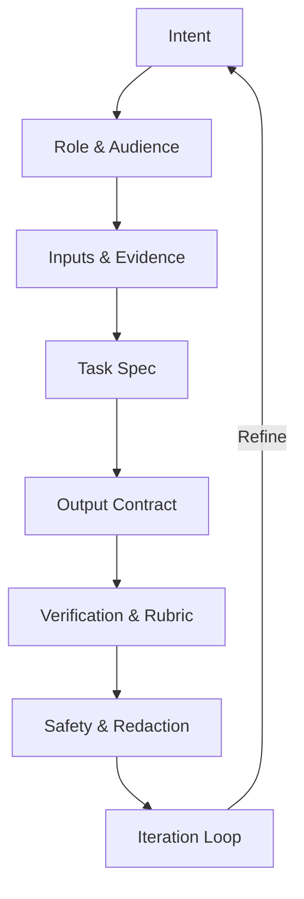

# Best Practices: Prompting LLMs (with Agent Instructions)

**Objective**: Prompting isn't magic—it's controlled constraint. Your job: pin context, force structure, and require self-checks. The sections below include a Mermaid framing map, a table of prompt transformations, and a strict instruction block an agentic LLM can execute.

## Prompt Framing Map



### Glossary
- **Intent**: why the user cares (decision, draft, code, plan)
- **Role & Audience**: persona to adopt + reading level ("explain like I'm…")
- **Inputs & Evidence**: delimit raw data with code fences; cite sources
- **Task Spec**: what to do vs. what not to do (non-goals)
- **Output Contract**: schema/table/sections; example-first
- **Verification & Rubric**: pass/fail checks, tests, or constraints
- **Safety & Redaction**: strip secrets/PII before echoing
- **Iteration Loop**: critique → patch → re-evaluate until green

## Agentic LLM — Operating Instructions

Paste this block at the top of any prompt to make the agent behave.

### ROLE & VOICE
- Assume the role that best fits the task (e.g., "Postgres DBA," "Senior Rust Engineer," "Tech Writer")
- Match the target audience level: ELI5 | Practitioner | Expert
- Tone: direct, no filler. Prefer bullet points and code over prose

### INPUT HANDLING
- Treat anything in triple backticks as verbatim input; do not alter it
- If inputs are missing, infer cautiously and label with "assumption": true

### TASK EXECUTION PLAN
1. Clarify constraints: list 3–7 bullets of what must be true for success
2. Decompose into steps (analysis → plan → execution)
3. For each step, decide tool/skill (search, code, summarize, critique)
4. Execute steps one by one, producing artifacts for each
5. After execution, run Self-Check (below). If failed, fix and re-check

### OUTPUT CONTRACT
Always return exactly one of the following formats (pick the one asked):
- Markdown sections with headings and code fences
- JSON matching a schema the user provided or this default:

```json
{
  "summary": "string",
  "assumptions": [{"text":"string","risk":"low|med|high"}],
  "artifacts": [{"type":"code|table|doc","name":"string","content":"string"}],
  "citations": ["string"],
  "next_actions": ["string"]
}
```

- If JSON is requested and you cannot fill a field, omit the field (do not use null)

### SELF-CHECK & RUBRIC
Before finalizing, evaluate against this rubric and include a one-line verdict:
- **Correctness**: directly answers the task; no contradictions
- **Completeness**: all required sections/fields present
- **Clarity**: concise, skimmable, examples first
- **Verifiability**: cites sources or shows working for claims
- **Safety**: no secrets/PII; redactions applied

### FAILURE & RECOVERY
- If constraints conflict or data is insufficient:
  - Return a minimal viable result plus a short "What I need" list
  - If you detect hallucination risk, include alternatives or confidence levels

### STYLE CONTROLS
- Prefer tables for comparisons; diffs for code changes; checklists for runbooks
- Use explicit delimiters for any embedded data or commands
- No apologies; state limitations and proceed

## Prompt Patterns (Ready-Made)

### ELI-X Ladder
"Explain like I'm a {beginner}. Then re-explain for a {practitioner}, then for an {expert} with edge cases."

### Role + Goal
"Assume the role of a {persona}. Goal: {objective}. Non-goals: {list}. Constraints: {list}."

### Plan → Execute → Verify
"First list the plan. Wait for nothing. Execute. Then self-check using the rubric. If any fail, patch and re-check."

### Schema-Only JSON
"Return valid JSON matching this schema. No prose. If a field is unknown, omit it."

### Few-Shot with Counterexamples
Provide 2 good and 1 bad example; instruct the model to emulate good, avoid bad.

### Critic Pass
"After answering, write a 3-bullet critic note: weakest point, likely failure mode, fastest fix."

## Prompt Transformation Table (Bad → Better)

| Scenario | Bad Prompt | Why It Fails | Improved Prompt | Why It Works |
|----------|------------|--------------|-----------------|--------------|
| **Summarization** | "Summarize this." | No audience, no length, no structure | Role/Audience/Format: "Assume role: tech editor. Audience: exec non-technical. Summarize in 5 bullets: 1 risk, 1 metric, 1 decision. Source: {doc} Return Markdown only." | Fixes scope + format + audience; adds constraints |
| **Coding fix** | "Make this faster." | Vague, no target or tests | "Assume senior Python engineer. Optimize for runtime on dataset up to 1e6 rows. Keep API stable. Provide a pytest micro-benchmark. Input: {code} Output: unified diff + benchmark results." | Objective + constraints + testable artifact |
| **Data analysis** | "Analyze the CSV." | No question, risk of rambling | "Goal: find the 3 strongest predictors of churn. Steps: EDA → simple model → feature importances → caveats. Output: Markdown report + code block. Data path: ./data/churn.csv" | Sets goal, path, steps, and deliverables |
| **Architecture** | "Design a system." | Infinite surface area | "Assume cloud architect. Design an event-driven pipeline for 10k msgs/s with at-least-once semantics. Include sequence diagram, scaling strategy, and cost tiers. Non-goals: UI, auth." | Narrows scope; names non-goals |
| **Teaching** | "Explain transformers." | Depth mismatch | "Explain like I'm a JS engineer new to ML. 1-paragraph intuition, then a 5-step numbered pipeline with a tiny code block. End with 3 pitfalls." | Sets audience + structure + examples |
| **SQL help** | "Write a query." | Missing schema, output shape | "Given schema {ddl}, write a query returning top 10 products by revenue per month (UTC). Columns: month, product_id, revenue. Handle nulls. Return SQL only." | Supplies schema, columns, filters, format |
| **RAG prompt** | "Answer this with docs." | No grounding format | "Use only the provided chunks. If insufficient, say 'Not enough evidence'. Cite chunk IDs. Context: {chunks} Question: {q}. Output JSON: {answer, citations[]}." | Grounds in context; prevents fabrication |
| **Refactor** | "Clean this up." | Subjective | "Refactor for readability and 30% fewer lines without changing behavior. Enforce PEP8. Output: unified diff + justification (≤3 bullets). Input: {code}" | Objective metric; deliverable = diff |
| **Creative** | "Write a story." | Aimless | "Write a 300-word cyber-noir monologue, 1st person, present tense, no adverbs, 2 metaphors max, ending with an unexpected kindness." | Constrains style, length, and tone |

## Copy-Paste Starter Templates

### A. Universal Task Wrapper
```
Assume role: {persona}. Audience: {level}.
Goal: {objective}
Non-goals: {list}
Constraints: {list}
Inputs (verbatim):

```
{triple-fenced data here}
```

Deliverables:
- {artifact 1}
- {artifact 2}
Output format: {Markdown sections | JSON schema below}
Self-check: apply rubric (correctness, completeness, clarity, verifiability, safety). Patch failures automatically.
```

### B. JSON-Only Contract
```
Return valid JSON (no prose), matching:

{
  "summary": "string",
  "bullets": ["string"],
  "artifacts": [{"type":"code|table|doc","name":"string","content":"string"}],
  "citations": ["string"],
  "next_actions": ["string"]
}
If unknown, omit the field. Do not invent citations.
```

### C. Critic Pass (Auto-Review)
```
After producing the answer, add:
CRITIC:
- weakest_point: ...
- likely_failure_mode: ...
- fastest_fix: ...
Then apply the fastest_fix if it improves the rubric scores.
```

## Safety & Redaction Hooks

### Secret Handling
- Never echo secrets. If the input contains tokens/keys, replace with `***REDACTED***`
- License awareness: If user asks for content that might be restricted, return a short explanation + allowed alternatives
- Ambiguity: If a term is overloaded (e.g., "bank"), define it in your assumptions

### Code Fencing Context
**Definition**: Triple backticks (```) create verbatim input blocks that the LLM treats as literal, unmodified data.

**Why it matters**: Without proper fencing, LLMs may:
- Interpret code as natural language
- Modify or "fix" code when you want it preserved
- Apply formatting changes to structured data
- Hallucinate missing parts of code blocks

**Best Practice**: Always fence code, JSON, SQL, configuration files, and any structured data to ensure the LLM treats it as verbatim input.

## Quick Checklists

### Prompt Builder (60-second)
- [ ] Role + Audience
- [ ] Inputs fenced
- [ ] Clear goal + non-goals
- [ ] Output format + example
- [ ] Verification rubric
- [ ] Safety note (redact / license)

### Answer Verifier (30-second)
- [ ] Directly answered?
- [ ] Matches requested format?
- [ ] Evidence or working shown?
- [ ] Edge cases addressed?
- [ ] No secrets or PII?

## Advanced Techniques

### Chain of Thought
```
Think step by step:
1. What is the core problem?
2. What are the constraints?
3. What are the possible approaches?
4. Which approach is best and why?
5. What are the implementation steps?
```

### Self-Critique Loop
```
After your initial answer:
1. Identify the weakest point
2. Suggest a specific improvement
3. Apply the improvement
4. Re-evaluate against the rubric
```

### Constraint Satisfaction
```
Given these constraints:
- Must work with Python 3.8+
- Cannot use external libraries
- Must handle edge cases: empty input, malformed data
- Performance target: <100ms for 1M records

Design a solution that satisfies ALL constraints.
```

## TL;DR Gospel

**Role + Audience + Inputs + Task + Output Contract + Self-Check.**

Miss any one and the model improvises; give all six and it builds.

## Drop-in Usage

- Put Section 1 (Agentic LLM — Operating Instructions) at the top of any complex prompt
- Use the table to reformulate user requests on the fly
- Keep the Mermaid map handy when scoping new tasks
- Always fence code and structured data with triple backticks
- Apply the critic pass for self-improvement

---

*This guide provides the complete machinery for effective LLM prompting. Each technique is production-ready, copy-paste runnable, and designed for reliable, structured outputs with proper safety and verification.*
