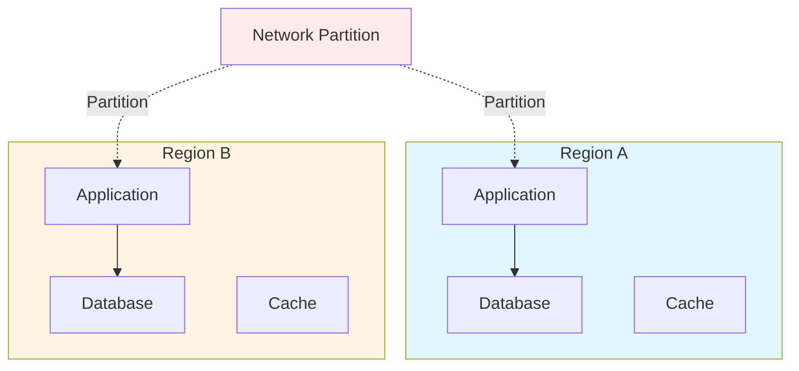
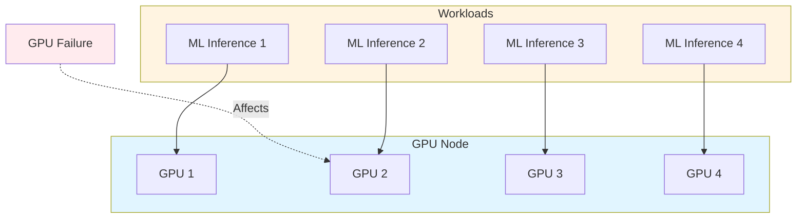
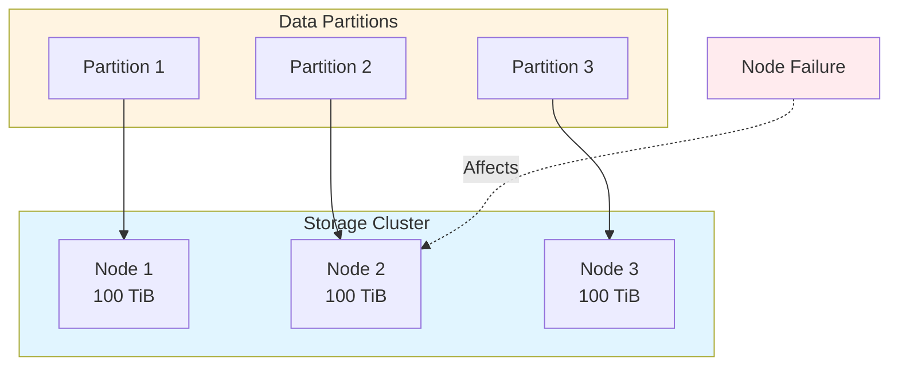
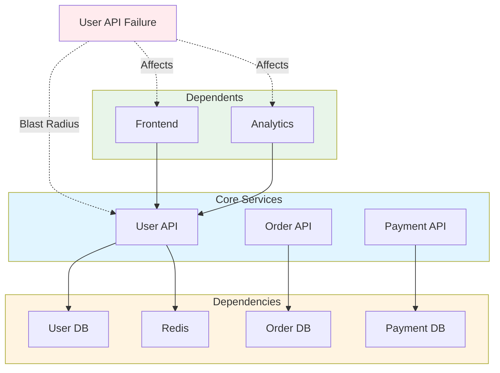
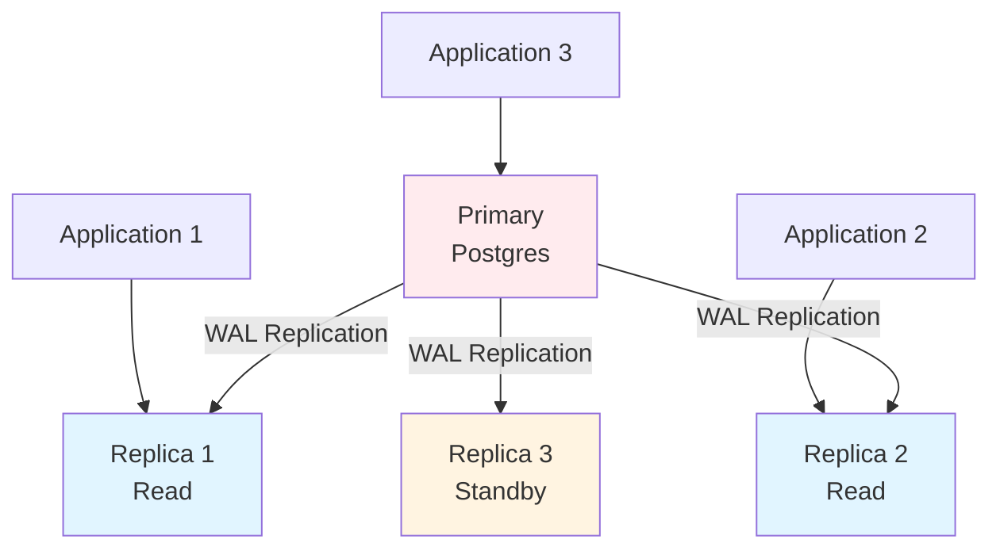
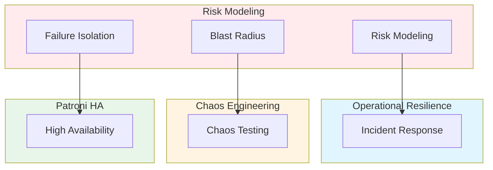

# Operational Risk Modeling, Blast Radius Reduction & Failure Domain Architecture: Best Practices

**Objective**: Establish comprehensive risk modeling frameworks that identify failure domains, model blast radius, and design containment strategies across clusters, databases, data pipelines, and ML systems. When you need to reduce risk, when you want to contain failures, when you need failure domain architecture—this guide provides the complete framework.

## Introduction

Operational risk modeling is not optional—it's fundamental to building reliable, safe systems. Without explicit risk modeling and blast radius containment, failures cascade, systems collapse, and incidents become disasters. This guide establishes patterns for risk modeling, blast radius reduction, and failure domain architecture.

**What This Guide Covers**:
- Formal risk modeling frameworks
- Failure domain diagrams (network partitions, GPU failures, storage node failures)
- Service blast radius maps
- Best practices for limiting cascading failures
- Sandboxing geospatial jobs, ML inference, ingestion pipelines
- Governance: risk committees, incident simulation cycles
- Cluster segmentation (RKE2 + Rancher)
- Postgres/Patroni replica dependency modeling
- FDW isolation boundaries
- ETL failure domain partitioning
- ML model-serving fault isolation
- GPU job firewalling
- DR boundary planning

**Prerequisites**:
- Understanding of distributed systems and failure modes
- Familiarity with risk modeling and failure analysis
- Experience with incident response and disaster recovery

**Related Documents**:
This document integrates with:
- **[Operational Resilience and Incident Response](operational-resilience-and-incident-response.md)** - Incident response patterns
- **[Chaos Engineering, Fault Injection, and Reliability Validation](chaos-engineering-governance.md)** - Chaos testing for risk validation
- **[Patroni PostgreSQL HA](../database-data/patroni-postgres-ha.md)** - Database HA patterns
- **[Performance Monitoring](performance-monitoring.md)** - Performance risk monitoring
- **[Holistic Capacity Planning, Scaling Economics, and Workload Modeling](../architecture-design/capacity-planning-and-workload-modeling.md)** - Capacity risk modeling

## The Philosophy of Risk Modeling

### Risk Principles

**Principle 1: Explicit Risk Modeling**
- Identify all failure domains
- Model blast radius
- Quantify risk exposure

**Principle 2: Containment First**
- Design for failure isolation
- Prevent cascading failures
- Minimize blast radius

**Principle 3: Continuous Validation**
- Test failure scenarios
- Validate containment
- Improve continuously

## Risk Modeling Framework

### Risk Assessment Model

**Risk Model**:
```python
# Risk assessment model
class RiskAssessment:
    def assess_risk(self, component: Component) -> RiskScore:
        """Assess operational risk"""
        # Calculate failure probability
        failure_probability = self.calculate_failure_probability(component)
        
        # Calculate impact
        impact = self.calculate_impact(component)
        
        # Calculate blast radius
        blast_radius = self.calculate_blast_radius(component)
        
        # Calculate risk score
        risk_score = failure_probability * impact * blast_radius
        
        return RiskScore(
            component=component,
            failure_probability=failure_probability,
            impact=impact,
            blast_radius=blast_radius,
            risk_score=risk_score
        )
```

### Failure Domain Identification

**Domain Classification**:
```yaml
# Failure domain classification
failure_domains:
  network:
    - "network-partition"
    - "dns-failure"
    - "load-balancer-failure"
  
  compute:
    - "node-failure"
    - "pod-failure"
    - "gpu-failure"
  
  storage:
    - "disk-failure"
    - "storage-node-failure"
    - "object-store-failure"
  
  database:
    - "primary-failure"
    - "replica-failure"
    - "wal-failure"
  
  application:
    - "service-failure"
    - "dependency-failure"
    - "configuration-error"
```

## Failure Domain Diagrams

### Network Partition Failure

**Diagram**:


### GPU Failure Domain

**Diagram**:


### Storage Node Failure

**Diagram**:


## Service Blast Radius Maps

### Blast Radius Calculation

**Calculation Model**:
```python
# Blast radius calculation
class BlastRadiusCalculator:
    def calculate_blast_radius(self, service: Service) -> BlastRadius:
        """Calculate service blast radius"""
        # Get dependencies
        dependencies = self.get_dependencies(service)
        
        # Get dependents
        dependents = self.get_dependents(service)
        
        # Calculate affected services
        affected_services = dependencies + dependents
        
        # Calculate affected users
        affected_users = self.calculate_affected_users(service)
        
        # Calculate data impact
        data_impact = self.calculate_data_impact(service)
        
        return BlastRadius(
            service=service,
            dependencies=len(dependencies),
            dependents=len(dependents),
            affected_services=len(affected_services),
            affected_users=affected_users,
            data_impact=data_impact
        )
```

### Blast Radius Map

**Visualization**:


## Cascading Failure Prevention

### Circuit Breaker Patterns

**Pattern**: Prevent cascading failures.

**Example**:
```python
# Circuit breaker for blast radius reduction
class CircuitBreaker:
    def __init__(self, failure_threshold: int = 5):
        self.failure_threshold = failure_threshold
        self.failure_count = 0
        self.state = "closed"
    
    def call(self, func):
        """Call function with circuit breaker"""
        if self.state == "open":
            raise CircuitBreakerOpenError()
        
        try:
            result = func()
            self.failure_count = 0
            return result
        except Exception as e:
            self.failure_count += 1
            if self.failure_count >= self.failure_threshold:
                self.state = "open"
            raise e
```

### Bulkhead Pattern

**Pattern**: Isolate failure domains.

**Example**:
```yaml
# Bulkhead pattern
bulkhead:
  isolation:
    - name: "user-domain"
      resources:
        cpu: "100 cores"
        memory: "200 GiB"
      failure_domain: "isolated"
    
    - name: "order-domain"
      resources:
        cpu: "100 cores"
        memory: "200 GiB"
      failure_domain: "isolated"
```

## Cluster Segmentation

### RKE2 Cluster Segmentation

**Segmentation Strategy**:
```yaml
# RKE2 cluster segmentation
cluster_segmentation:
  strategy: "namespace-isolation"
  segments:
    - name: "critical-services"
      namespace: "critical"
      isolation:
        network: "network-policy"
        storage: "storage-class"
        compute: "node-selector"
    
    - name: "batch-jobs"
      namespace: "batch"
      isolation:
        network: "network-policy"
        compute: "dedicated-nodes"
    
    - name: "ml-inference"
      namespace: "ml"
      isolation:
        network: "network-policy"
        compute: "gpu-nodes"
        gpu: "dedicated"
```

### Rancher Project Isolation

**Project Isolation**:
```yaml
# Rancher project isolation
rancher_isolation:
  projects:
    - name: "production"
      clusters: ["prod-cluster"]
      isolation:
        network: "project-network-policy"
        resource_quota: "project-quota"
    
    - name: "development"
      clusters: ["dev-cluster"]
      isolation:
        network: "project-network-policy"
        resource_quota: "project-quota"
```

## Postgres/Patroni Dependency Modeling

### Replica Dependency Model

**Dependency Graph**:


**Dependency Configuration**:
```yaml
# Postgres dependency model
postgres_dependencies:
  primary:
    name: "postgres-primary"
    replicas:
      - name: "postgres-replica-1"
        role: "read"
        lag_threshold: "10 seconds"
      - name: "postgres-replica-2"
        role: "read"
        lag_threshold: "10 seconds"
      - name: "postgres-replica-3"
        role: "standby"
        lag_threshold: "1 minute"
  failover:
    automatic: true
    rto: "2 minutes"
```

## FDW Isolation Boundaries

### FDW Isolation Strategy

**Isolation Pattern**:
```sql
-- FDW isolation boundaries
CREATE SERVER isolated_fdw
FOREIGN DATA WRAPPER postgres_fdw
OPTIONS (
    host 'remote-host',
    port '5432',
    isolation_level 'strict',
    connection_limit '10',
    connect_timeout '5'
);

-- Isolation policy
CREATE POLICY fdw_isolation_policy
ON FOREIGN TABLE remote_table
USING (
    current_user = 'isolated_user'
    AND pg_isolation_test_session()
);
```

## ETL Failure Domain Partitioning

### ETL Isolation

**Partitioning Strategy**:
```yaml
# ETL failure domain partitioning
etl_partitioning:
  strategy: "pipeline-isolation"
  partitions:
    - name: "user-ingestion"
      isolation:
        compute: "dedicated-workers"
        storage: "dedicated-buckets"
        network: "isolated-vpc"
    
    - name: "order-processing"
      isolation:
        compute: "dedicated-workers"
        storage: "dedicated-buckets"
        network: "isolated-vpc"
```

## ML Model-Serving Fault Isolation

### Inference Isolation

**Isolation Pattern**:
```yaml
# ML inference fault isolation
ml_inference_isolation:
  strategy: "model-per-pod"
  isolation:
    compute: "dedicated-gpu"
    network: "service-mesh-isolation"
    storage: "read-only-model-storage"
  fault_domains:
    - name: "model-a"
      isolation: "pod"
      blast_radius: "single-model"
    - name: "model-b"
      isolation: "pod"
      blast_radius: "single-model"
```

## GPU Job Firewalling

### GPU Isolation

**Firewall Configuration**:
```yaml
# GPU job firewalling
gpu_firewall:
  strategy: "gpu-per-job"
  isolation:
    gpu: "dedicated"
    memory: "isolated"
    network: "job-network-policy"
  firewalls:
    - name: "ml-training"
      gpu_allocation: "dedicated"
      memory_limit: "32Gi"
      network_policy: "training-isolation"
    
    - name: "ml-inference"
      gpu_allocation: "dedicated"
      memory_limit: "16Gi"
      network_policy: "inference-isolation"
```

## DR Boundary Planning

### DR Boundaries

**Boundary Definition**:
```yaml
# DR boundary planning
dr_boundaries:
  regions:
    - name: "us-east-1"
      boundary: "region"
      isolation: "complete"
      failover_target: "us-west-2"
    
    - name: "us-west-2"
      boundary: "region"
      isolation: "complete"
      failover_target: "us-east-1"
  
  clusters:
    - name: "prod-cluster"
      boundary: "cluster"
      isolation: "network"
      failover_target: "dr-cluster"
```

## Risk Governance

### Risk Committee

**Committee Structure**:
```yaml
# Risk committee
risk_committee:
  members:
    - role: "architecture-lead"
      responsibility: "technical-risk"
    - role: "security-lead"
      responsibility: "security-risk"
    - role: "operations-lead"
      responsibility: "operational-risk"
  meetings:
    frequency: "monthly"
    agenda:
      - "risk-assessment-review"
      - "blast-radius-analysis"
      - "failure-domain-validation"
```

### Incident Simulation Cycles

**Simulation Framework**:
```yaml
# Incident simulation
incident_simulation:
  frequency: "quarterly"
  scenarios:
    - name: "database-primary-failure"
      blast_radius: "high"
      simulation: "chaos-engineering"
    
    - name: "network-partition"
      blast_radius: "medium"
      simulation: "network-chaos"
    
    - name: "storage-node-failure"
      blast_radius: "high"
      simulation: "storage-chaos"
```

## Architecture Fitness Functions

### Blast Radius Minimization Fitness Function

**Definition**:
```python
# Blast radius minimization fitness function
class BlastRadiusMinimizationFitnessFunction:
    def evaluate(self, system: System) -> float:
        """Evaluate blast radius minimization"""
        # Calculate average blast radius
        avg_blast_radius = self.calculate_avg_blast_radius(system)
        
        # Calculate target blast radius
        target_blast_radius = system.target_blast_radius
        
        # Calculate fitness
        if avg_blast_radius <= target_blast_radius:
            fitness = 1.0
        else:
            fitness = target_blast_radius / avg_blast_radius
        
        return fitness
```

### Failure Domain Isolation Fitness Function

**Definition**:
```python
# Failure domain isolation fitness function
class FailureDomainIsolationFitnessFunction:
    def evaluate(self, system: System) -> float:
        """Evaluate failure domain isolation"""
        # Calculate isolation score
        isolation_score = 0.0
        
        for domain in system.failure_domains:
            # Check network isolation
            network_isolation = self.check_network_isolation(domain)
            
            # Check compute isolation
            compute_isolation = self.check_compute_isolation(domain)
            
            # Check storage isolation
            storage_isolation = self.check_storage_isolation(domain)
            
            # Calculate domain isolation
            domain_isolation = (network_isolation * 0.4) + \
                              (compute_isolation * 0.3) + \
                              (storage_isolation * 0.3)
            
            isolation_score += domain_isolation
        
        # Average isolation
        avg_isolation = isolation_score / len(system.failure_domains)
        
        return avg_isolation
```

## Cross-Document Architecture



## Checklists

### Risk Modeling Checklist

- [ ] Risk assessment completed
- [ ] Failure domains identified
- [ ] Blast radius mapped
- [ ] Cascading failure prevention implemented
- [ ] Cluster segmentation configured
- [ ] Dependency modeling complete
- [ ] FDW isolation boundaries defined
- [ ] ETL partitioning active
- [ ] ML inference isolation configured
- [ ] GPU job firewalling enabled
- [ ] DR boundaries planned
- [ ] Risk governance established
- [ ] Incident simulation scheduled

## Anti-Patterns

### Risk Modeling Anti-Patterns

**Single Shared FDW Hub**:
```sql
-- Bad: Single shared FDW
CREATE SERVER shared_fdw
FOREIGN DATA WRAPPER postgres_fdw
OPTIONS (host 'single-hub');
-- All services depend on one hub

-- Good: Isolated FDWs
CREATE SERVER user_fdw
FOREIGN DATA WRAPPER postgres_fdw
OPTIONS (host 'user-hub');
-- Isolated per domain
```

**Global WAL Choke Points**:
```yaml
# Bad: Single WAL stream
postgres:
  wal_streams: 1
  # All replicas depend on one stream

# Good: Distributed WAL
postgres:
  wal_streams: 3
  # Multiple streams for redundancy
```

## See Also

- **[Operational Resilience and Incident Response](operational-resilience-and-incident-response.md)** - Incident response patterns
- **[Chaos Engineering, Fault Injection, and Reliability Validation](chaos-engineering-governance.md)** - Chaos testing
- **[Patroni PostgreSQL HA](../database-data/patroni-postgres-ha.md)** - Database HA
- **[Performance Monitoring](performance-monitoring.md)** - Performance risk
- **[Holistic Capacity Planning, Scaling Economics, and Workload Modeling](../architecture-design/capacity-planning-and-workload-modeling.md)** - Capacity risk

---

*This guide establishes comprehensive risk modeling and blast radius reduction patterns. Start with risk assessment, extend to failure domain isolation, and continuously validate containment strategies.*

