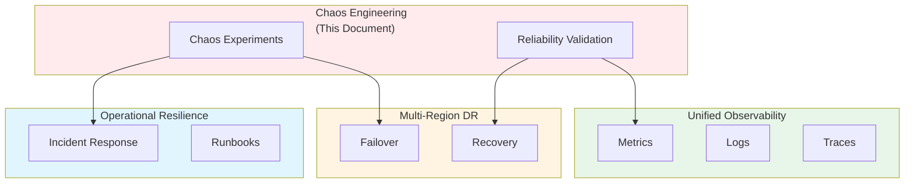

# Chaos Engineering, Fault Injection, and Reliability Validation Across Distributed Systems: Best Practices

**Objective**: Establish safe, systematic chaos engineering practices for validating system resilience across distributed systems, databases, microservices, and data pipelines. When you need to test failure scenarios, when you want to validate SLOs under stress, when you need reproducible fault injection—this guide provides the complete framework.

## Introduction

Chaos engineering is the discipline of experimenting on systems to build confidence in their ability to withstand turbulent conditions. This guide establishes patterns for safe fault injection, systematic testing, and reliability validation across all system layers.

**What This Guide Covers**:
- Principles of safe fault injection
- Cluster-level chaos (RKE2, Rancher, Cilium, networking partitions)
- Database chaos (Postgres, HA failover, FDW disconnects, WAL stalls)
- Distributed microservices chaos (Python/Go/Rust)
- Lakehouse/ETL pipeline chaos (Parquet, DuckDB, PG-Lake)
- UI/system boundary chaos (NiceGUI, Redis, message backplanes)
- Geospatial chaos testing (tiling systems, raster pipelines)
- Metrics and SLO/SLA integration
- Failure pattern catalog and blast-radius templates
- Simulation tooling and reproducibility environments

**Prerequisites**:
- Understanding of distributed systems and failure modes
- Familiarity with Kubernetes, databases, and microservices
- Experience with observability and monitoring

**Related Documents**:
This document integrates with:
- **[Operational Resilience and Incident Response](operational-resilience-and-incident-response.md)** - Incident response patterns
- **[Unified Observability Architecture](unified-observability-architecture.md)** - Observability for chaos testing
- **[Cognitive Load Management and Developer Experience](../architecture-design/cognitive-load-developer-experience.md)** - Reducing cognitive load in chaos scenarios
- **[Multi-Region DR Strategy](../architecture-design/multi-region-dr-strategy.md)** - DR validation through chaos
- **[Semantic Layer Engineering](../database-data/semantic-layer-engineering.md)** - Semantic layer resilience
- **[ML Systems Architecture Governance](../ml-ai/ml-systems-architecture-governance.md)** - ML system resilience

## The Philosophy of Chaos Engineering

### Principles of Safe Fault Injection

**Principle 1: Start Small**
- Begin with low-impact experiments
- Gradually increase blast radius
- Always have rollback capability

**Principle 2: Hypothesis-Driven**
- Formulate hypotheses before experiments
- Define success criteria
- Measure outcomes systematically

**Principle 3: Production-Like Environments**
- Test in staging first
- Use production-like data volumes
- Simulate real-world conditions

**Principle 4: Automated and Reproducible**
- Automate chaos experiments
- Version control experiment definitions
- Enable reproducibility

**Example**:
```yaml
# Chaos experiment definition
experiment:
  name: "database-connection-failure"
  hypothesis: "System gracefully handles database connection failures"
  blast_radius:
    initial: "1 pod"
    max: "50% of pods"
  duration: "5 minutes"
  rollback: "automatic"
  success_criteria:
    - "Error rate < 1%"
    - "No data loss"
    - "Recovery time < 2 minutes"
```

## Cluster-Level Chaos

### RKE2 Cluster Chaos

**Node Failure Simulation**:
```yaml
# RKE2 node failure
chaos_experiment:
  type: "node-failure"
  target:
    cluster: "prod-cluster"
    nodes: ["worker-1", "worker-2"]
  action: "drain-and-delete"
  duration: "10 minutes"
  monitoring:
    - "pod_eviction_rate"
    - "service_availability"
    - "data_consistency"
```

### Rancher Chaos

**Rancher API Failure**:
```yaml
# Rancher API chaos
chaos_experiment:
  type: "api-failure"
  target:
    service: "rancher-api"
    endpoint: "/v3/clusters"
  action: "inject-latency"
  latency: "5 seconds"
  duration: "5 minutes"
```

### Cilium Network Chaos

**Network Partition Simulation**:
```yaml
# Cilium network partition
chaos_experiment:
  type: "network-partition"
  target:
    network_policy: "cilium"
    partition: ["namespace-a", "namespace-b"]
  action: "block-traffic"
  duration: "10 minutes"
  monitoring:
    - "network_packet_loss"
    - "service_connectivity"
    - "circuit_breaker_state"
```

## Database Chaos

### Postgres Chaos

**HA Failover Testing**:
```yaml
# Postgres failover chaos
chaos_experiment:
  type: "postgres-failover"
  target:
    cluster: "postgres-prod"
    primary: "postgres-primary"
  action: "force-failover"
  duration: "2 minutes"
  monitoring:
    - "failover_time"
    - "data_consistency"
    - "connection_pool_state"
```

**FDW Disconnect Testing**:
```sql
-- FDW disconnect simulation
SELECT chaos_inject_fdw_disconnect('s3_fdw', '5 minutes');

-- Monitor FDW state
SELECT * FROM pg_foreign_server WHERE srvname = 's3_fdw';
```

**WAL Stall Testing**:
```yaml
# WAL stall chaos
chaos_experiment:
  type: "wal-stall"
  target:
    database: "postgres-prod"
  action: "stall-wal-writes"
  duration: "30 seconds"
  monitoring:
    - "wal_lag"
    - "replication_delay"
    - "transaction_timeout"
```

## Distributed Microservices Chaos

### Python Service Chaos

**Service Failure Injection**:
```python
# Python chaos injection
from chaos_lib import inject_failure

@inject_failure(
    failure_type="timeout",
    duration="30 seconds",
    probability=0.1
)
def process_request(request):
    """Process request with chaos injection"""
    return handle_request(request)
```

### Go Service Chaos

**Go Chaos Middleware**:
```go
// Go chaos middleware
func ChaosMiddleware(next http.Handler) http.Handler {
    return http.HandlerFunc(func(w http.ResponseWriter, r *http.Request) {
        if shouldInjectChaos() {
            injectChaos(r.Context())
        }
        next.ServeHTTP(w, r)
    })
}
```

### Rust Service Chaos

**Rust Chaos Injection**:
```rust
// Rust chaos injection
use chaos::ChaosInjector;

fn process_request(req: Request) -> Result<Response> {
    let injector = ChaosInjector::new();
    injector.inject_failure("timeout", Duration::from_secs(30))?;
    handle_request(req)
}
```

## Lakehouse/ETL Pipeline Chaos

### Parquet Chaos

**Parquet Read Failure**:
```yaml
# Parquet read chaos
chaos_experiment:
  type: "parquet-read-failure"
  target:
    storage: "s3://lakehouse/data.parquet"
  action: "corrupt-file"
  corruption: "partial"
  monitoring:
    - "read_error_rate"
    - "fallback_mechanism"
    - "data_quality"
```

### DuckDB Chaos

**DuckDB Query Failure**:
```yaml
# DuckDB query chaos
chaos_experiment:
  type: "duckdb-query-failure"
  target:
    database: "analytics"
    query: "SELECT * FROM large_table"
  action: "inject-memory-pressure"
  memory_limit: "1GB"
  duration: "5 minutes"
```

### PG-Lake Chaos

**PG-Lake Connection Failure**:
```yaml
# PG-Lake chaos
chaos_experiment:
  type: "pglake-connection-failure"
  target:
    fdw: "pg_lake"
    source: "s3://lakehouse/"
  action: "disconnect"
  duration: "2 minutes"
  monitoring:
    - "query_failure_rate"
    - "retry_mechanism"
    - "cache_hit_rate"
```

## UI/System Boundary Chaos

### NiceGUI Chaos

**UI Component Failure**:
```yaml
# NiceGUI chaos
chaos_experiment:
  type: "nicegui-component-failure"
  target:
    component: "UserList"
    page: "/users"
  action: "render-failure"
  duration: "30 seconds"
  monitoring:
    - "error_rate"
    - "user_experience"
    - "fallback_ui"
```

### Redis Chaos

**Redis Failure Injection**:
```yaml
# Redis chaos
chaos_experiment:
  type: "redis-failure"
  target:
    cluster: "redis-prod"
    node: "redis-1"
  action: "node-failure"
  duration: "5 minutes"
  monitoring:
    - "cache_hit_rate"
    - "failover_time"
    - "data_consistency"
```

### Message Backplane Chaos

**Message Queue Failure**:
```yaml
# Message queue chaos
chaos_experiment:
  type: "message-queue-failure"
  target:
    queue: "user-events"
    broker: "redis-streams"
  action: "queue-full"
  duration: "10 minutes"
  monitoring:
    - "message_drop_rate"
    - "consumer_lag"
    - "backpressure_state"
```

## Geospatial Chaos Testing

### Tiling System Chaos

**Tile Generation Failure**:
```yaml
# Tile generation chaos
chaos_experiment:
  type: "tile-generation-failure"
  target:
    service: "tile-service"
    zoom_level: 12
  action: "inject-compute-failure"
  duration: "5 minutes"
  monitoring:
    - "tile_generation_rate"
    - "cache_hit_rate"
    - "fallback_tiles"
```

### Raster Pipeline Chaos

**Raster Processing Failure**:
```yaml
# Raster pipeline chaos
chaos_experiment:
  type: "raster-processing-failure"
  target:
    pipeline: "raster-ingestion"
    stage: "transformation"
  action: "inject-memory-pressure"
  duration: "10 minutes"
  monitoring:
    - "processing_rate"
    - "error_rate"
    - "resource_utilization"
```

## Metrics and SLO/SLA Integration

### SLO-Based Chaos

**SLO Validation**:
```yaml
# SLO-based chaos
chaos_experiment:
  type: "slo-validation"
  target:
    service: "user-api"
  slo:
    availability: "99.9%"
    latency_p99: "500ms"
  action: "inject-latency"
  latency: "1 second"
  duration: "10 minutes"
  monitoring:
    - "slo_compliance"
    - "error_budget_consumption"
    - "alert_state"
```

See: **[Unified Observability Architecture](unified-observability-architecture.md)**

## Failure Pattern Catalog

### Common Failure Patterns

**Pattern 1: Cascading Failures**:
```yaml
failure_pattern:
  name: "cascading-failure"
  description: "Failure in one service causes failures in dependent services"
  simulation:
    - inject_failure("service-a")
    - wait_for_cascade("service-b", "service-c")
    - measure_blast_radius()
```

**Pattern 2: Resource Exhaustion**:
```yaml
failure_pattern:
  name: "resource-exhaustion"
  description: "System runs out of critical resources"
  simulation:
    - inject_memory_pressure("80%")
    - inject_cpu_pressure("90%")
    - measure_degradation()
```

**Pattern 3: Network Partitions**:
```yaml
failure_pattern:
  name: "network-partition"
  description: "Network connectivity is lost between components"
  simulation:
    - partition_network("region-a", "region-b")
    - measure_consistency()
    - measure_availability()
```

## Blast Radius Templates

### Blast Radius Definition

**Template**:
```yaml
blast_radius:
  scope: "namespace"  # namespace, cluster, region
  percentage: 10      # percentage of resources
  resources:
    - "pods"
    - "services"
    - "databases"
  isolation:
    - "critical": false
    - "production": false
```

## Simulation Tooling

### Chaos Toolkit

**Experiment Definition**:
```yaml
# Chaos Toolkit experiment
version: "1.0.0"
title: "Database Connection Failure"
description: "Test system resilience to database connection failures"
tags:
  - "database"
  - "resilience"
steady-state-hypothesis:
  title: "System is healthy"
  probes:
    - type: "probe"
      name: "service-healthy"
      tolerance: 200
      provider:
        type: "http"
        url: "http://service/health"
method:
  - type: "action"
    name: "inject-db-failure"
    provider:
      type: "python"
      module: "chaos.postgres"
      func: "disconnect"
      arguments:
        duration: 300
rollbacks:
  - type: "action"
    name: "restore-db-connection"
    provider:
      type: "python"
      module: "chaos.postgres"
      func: "reconnect"
```

## Reproducibility Environments

### Environment Setup

**Chaos Environment**:
```yaml
# Chaos environment
environment:
  name: "chaos-staging"
  cluster: "staging-cluster"
  namespace: "chaos-testing"
  resources:
    - "postgres-cluster"
    - "redis-cluster"
    - "microservices"
  data:
    volume: "production-snapshot"
    anonymized: true
```

## Integration with Observability

### Observability for Chaos

**Metrics Collection**:
```python
# Chaos observability
class ChaosObservability:
    def collect_metrics(self, experiment: dict) -> dict:
        """Collect metrics during chaos experiment"""
        metrics = {
            'error_rate': get_error_rate(),
            'latency_p99': get_latency_p99(),
            'availability': get_availability(),
            'resource_utilization': get_resource_utilization()
        }
        return metrics
```

See: **[Unified Observability Architecture](unified-observability-architecture.md)**

## Cross-Document Architecture



## Checklists

### Chaos Experiment Checklist

- [ ] Hypothesis defined
- [ ] Blast radius calculated
- [ ] Rollback plan ready
- [ ] Observability enabled
- [ ] Success criteria defined
- [ ] Team notified
- [ ] Production-like environment ready
- [ ] Monitoring dashboards configured
- [ ] Incident response team on standby
- [ ] Post-experiment review scheduled

## Anti-Patterns

### Chaos Engineering Anti-Patterns

**Uncontrolled Experiments**:
```yaml
# Bad: No controls
chaos_experiment:
  action: "delete-all-pods"
  # No rollback, no monitoring, no limits

# Good: Controlled experiment
chaos_experiment:
  action: "delete-pods"
  blast_radius: "10%"
  rollback: "automatic"
  monitoring: "enabled"
```

**Production-Only Testing**:
```yaml
# Bad: Only test in production
chaos_experiment:
  environment: "production"
  # No staging validation

# Good: Staging first
chaos_experiment:
  environment: "staging"
  production: "after-validation"
```

## See Also

- **[Operational Resilience and Incident Response](operational-resilience-and-incident-response.md)** - Incident response patterns
- **[Unified Observability Architecture](unified-observability-architecture.md)** - Observability for chaos testing
- **[Cognitive Load Management and Developer Experience](../architecture-design/cognitive-load-developer-experience.md)** - Reducing cognitive load
- **[Multi-Region DR Strategy](../architecture-design/multi-region-dr-strategy.md)** - DR validation
- **[Semantic Layer Engineering](../database-data/semantic-layer-engineering.md)** - Semantic layer resilience
- **[ML Systems Architecture Governance](../ml-ai/ml-systems-architecture-governance.md)** - ML system resilience

---

*This guide establishes comprehensive chaos engineering practices. Start with small experiments, extend to systematic testing, and continuously validate system resilience.*

