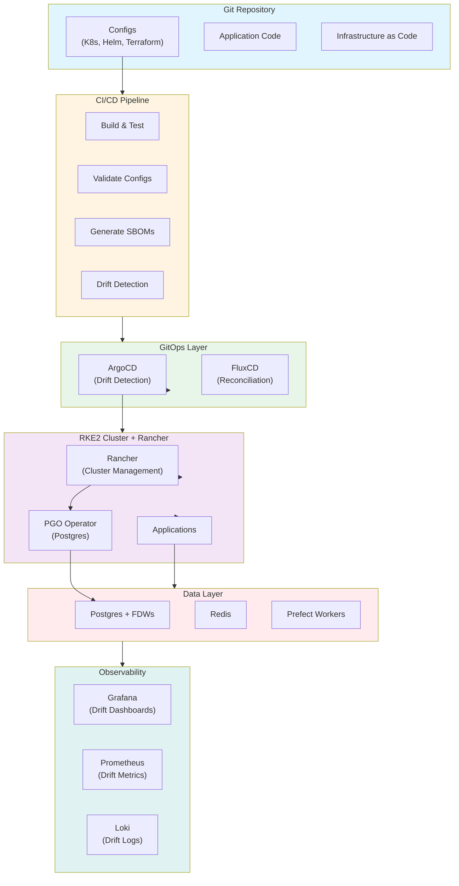

# Cross-Environment Configuration Drift Detection & Drift-Proof Deployment Best Practices

**Objective**: Master production-grade configuration drift detection, prevention, and remediation across multi-environment distributed systems. When you need to ensure consistency across dev/stage/prod, prevent silent failures, and maintain reproducibility—this guide provides complete patterns and implementations.

## Introduction

Configuration drift is the silent killer of production reliability. When environments diverge, deployments become unpredictable, debugging becomes impossible, and security postures degrade. This guide provides a complete framework for detecting, preventing, and remediating drift across all layers of modern distributed systems.

**What This Guide Covers**:
- Philosophy and threat model of configuration drift
- Comprehensive drift categories (infrastructure, Kubernetes, containers, applications, databases, secrets, data)
- Prevention frameworks (GitOps, idempotency, immutable artifacts)
- Detection methods (automated pipelines, dashboards, alerts)
- Remediation strategies (reconciliation, healing, sync patterns)
- Real-world patterns, anti-patterns, and failure modes
- End-to-end examples with complete tooling
- Observability and automation with agentic LLM hooks

**Prerequisites**:
- Understanding of Kubernetes, containers, and infrastructure as code
- Familiarity with GitOps, CI/CD, and observability tools
- Experience with databases, data pipelines, and distributed systems

## The Philosophy & Threat Model of Configuration Drift

### What Is Configuration Drift?

**Configuration drift** occurs when the actual state of a system diverges from its declared, intended state. This can happen at multiple layers:

1. **Runtime Drift**: Live system state differs from configuration files
2. **IaC Drift**: Infrastructure as Code state differs from actual infrastructure
3. **Data-Contract Drift**: Data schemas, contracts, or metadata diverge between environments

### The Threat Model

```mermaid
graph TB
    Drift["Configuration Drift"] --> Security["Security Risks"]
    Drift --> Repro["Reproducibility Loss"]
    Drift --> Audit["Auditability Gaps"]
    Drift --> CI["CI/CD Failures"]
    Drift --> Debug["Debugging Impossibility"]
    Drift --> Data["Data Lineage Corruption"]
    
    Security --> Breach["Unauthorized Access"]
    Security --> Compliance["Compliance Violations"]
    
    Repro --> ML["ML Model Inconsistency"]
    Repro --> ETL["ETL Pipeline Failures"]
    Repro --> Geo["Geospatial Reproducibility Loss"]
    
    Audit --> Forensics["Forensic Impossibility"]
    Audit --> Compliance2["Compliance Failures"]
    
    CI --> Deploy["Deployment Failures"]
    CI --> Rollback["Rollback Failures"]
    
    Debug --> Incident["Extended Incidents"]
    Debug --> MTTR["Increased MTTR"]
    
    Data --> Lineage["Broken Lineage"]
    Data --> Provenance["Lost Provenance"]
    
    style Drift fill:#ff6b6b
    style Security fill:#ff8787
    style Repro fill:#ffa8a8
```



### Risks to Security

**Unauthorized Access**:
- Dev credentials working in prod due to drift
- RBAC policies diverging between environments
- Secrets rotation policies not applied consistently
- Network policies allowing unintended access

**Compliance Violations**:
- Audit logging configurations differ
- Data retention policies inconsistent
- Encryption settings not uniform
- Access controls not aligned with requirements

### Risks to Reproducibility

**ML Model Inconsistency**:
- Different CUDA versions producing different results
- Feature store schemas diverging
- Model signatures mismatched
- Inference environments inconsistent

**ETL Pipeline Failures**:
- Schema contracts not enforced
- Dependency versions diverging
- Environment variables inconsistent
- Data transformation logic differing

**Geospatial Reproducibility Loss**:
- PostGIS versions mismatched
- Coordinate system definitions diverging
- Tile generation parameters inconsistent
- Spatial index configurations differing

### Risks to Auditability

**Forensic Impossibility**:
- Log configurations inconsistent
- Audit trails incomplete or missing
- Timestamp sources diverging
- Event correlation impossible

**Compliance Failures**:
- Cannot prove system state at point in time
- Cannot demonstrate configuration compliance
- Cannot trace changes to authorized sources

### Risks to CI/CD Deterministic Deployment

**Deployment Failures**:
- Configs work in dev but fail in prod
- Environment-specific values not properly isolated
- Secrets injection failing due to drift
- Rollback procedures not tested due to drift

**Rollback Failures**:
- Previous state not recoverable
- Configurations not versioned
- Dependencies not locked
- Infrastructure state unknown

### Risks to Data Lineage & Metadata Provenance

**Broken Lineage**:
- Transformation logic not traceable
- Data sources not identifiable
- Schema evolution not documented
- Metadata inconsistent

**Lost Provenance**:
- Cannot trace data origin
- Cannot verify data quality
- Cannot reproduce results
- Cannot audit data access

## Drift Categories

### Infrastructure Drift

**Node Divergence**:

```yaml
# Infrastructure drift examples
nodes:
  - name: node-1
    kernel: "5.15.0-91-generic"  # Expected
    actual: "5.15.0-89-generic"  # Drift!
  
  - name: node-2
    nvidia_driver: "535.154.03"  # Expected
    actual: "535.129.03"         # Drift!
  
  - name: node-3
    ulimits:
      nofile: 65536              # Expected
      actual: 32768              # Drift!
  
  - name: node-4
    sysctls:
      vm.max_map_count: 262144  # Expected
      actual: 65530              # Drift!
```

**Detection Script**:

```python
# scripts/detect_infrastructure_drift.py
import subprocess
import yaml
from typing import Dict, List

class InfrastructureDriftDetector:
    def __init__(self, expected_config: Dict):
        self.expected = expected_config
    
    def detect_kernel_drift(self, node: str) -> bool:
        """Detect kernel version drift"""
        result = subprocess.run(
            ["ssh", node, "uname -r"],
            capture_output=True,
            text=True
        )
        actual_kernel = result.stdout.strip()
        expected_kernel = self.expected["nodes"][node]["kernel"]
        
        return actual_kernel != expected_kernel
    
    def detect_nvidia_driver_drift(self, node: str) -> bool:
        """Detect NVIDIA driver version drift"""
        result = subprocess.run(
            ["ssh", node, "nvidia-smi --query-gpu=driver_version --format=csv,noheader"],
            capture_output=True,
            text=True
        )
        actual_driver = result.stdout.strip()
        expected_driver = self.expected["nodes"][node]["nvidia_driver"]
        
        return actual_driver != expected_driver
    
    def detect_ulimit_drift(self, node: str) -> Dict[str, bool]:
        """Detect ulimit drift"""
        result = subprocess.run(
            ["ssh", node, "ulimit -n"],
            capture_output=True,
            text=True
        )
        actual_nofile = int(result.stdout.strip())
        expected_nofile = self.expected["nodes"][node]["ulimits"]["nofile"]
        
        return {
            "nofile": actual_nofile != expected_nofile,
            "actual": actual_nofile,
            "expected": expected_nofile
        }
    
    def detect_sysctl_drift(self, node: str) -> Dict[str, bool]:
        """Detect sysctl drift"""
        drifts = {}
        
        for key, expected_value in self.expected["nodes"][node]["sysctls"].items():
            result = subprocess.run(
                ["ssh", node, f"sysctl -n {key}"],
                capture_output=True,
                text=True
            )
            actual_value = int(result.stdout.strip())
            drifts[key] = actual_value != expected_value
        
        return drifts
```

### Kubernetes Drift

**CRD Drift**:

```yaml
# k8s/crd-drift-example.yaml
# Expected CRD version
apiVersion: apiextensions.k8s.io/v1
kind: CustomResourceDefinition
metadata:
  name: postgresclusters.postgresql.cnpg.io
spec:
  versions:
    - name: v1
      served: true
      storage: true
---
# Actual (drifted) CRD version
apiVersion: apiextensions.k8s.io/v1
kind: CustomResourceDefinition
metadata:
  name: postgresclusters.postgresql.cnpg.io
spec:
  versions:
    - name: v1
      served: true
      storage: true
    - name: v2  # Drift! New version not in Git
      served: true
      storage: false
```

**PGO Operator Settings Drift**:

```yaml
# Expected PGO configuration
apiVersion: postgresql.cnpg.io/v1
kind: Cluster
metadata:
  name: postgres-cluster
spec:
  instances: 3
  postgresql:
    parameters:
      max_connections: "100"
      shared_buffers: "256MB"
---
# Actual (drifted) configuration
apiVersion: postgresql.cnpg.io/v1
kind: Cluster
metadata:
  name: postgres-cluster
spec:
  instances: 3
  postgresql:
    parameters:
      max_connections: "200"      # Drift! Manually changed
      shared_buffers: "512MB"     # Drift! Manually changed
```

**Helm Chart Values Drift**:

```yaml
# helm/values-expected.yaml
app:
  replicas: 3
  image:
    tag: "v1.2.0"
  resources:
    requests:
      memory: "512Mi"
      cpu: "500m"
---
# helm/values-actual.yaml (drifted)
app:
  replicas: 5              # Drift! Manually scaled
  image:
    tag: "v1.2.0"
  resources:
    requests:
      memory: "1Gi"        # Drift! Manually changed
      cpu: "1000m"         # Drift! Manually changed
```

**Detection with kubectl diff**:

```bash
# scripts/detect_k8s_drift.sh
#!/bin/bash

# Compare desired vs actual state
kubectl diff -f k8s/app/ > drift-report.txt

if [ -s drift-report.txt ]; then
    echo "Kubernetes drift detected!"
    cat drift-report.txt
    exit 1
fi
```

**ArgoCD Drift Detection**:

```yaml
# argocd/app-with-drift-detection.yaml
apiVersion: argocd.applications/v1alpha1
kind: Application
metadata:
  name: app-prod
spec:
  syncPolicy:
    automated:
      prune: true
      selfHeal: true  # Auto-correct drift
    syncOptions:
      - CreateNamespace=true
  # ArgoCD automatically detects and reports drift
```

### Container Drift

**Image Mutation**:

```dockerfile
# Expected base image
FROM python:3.11-slim

# Actual (drifted) - someone modified running container
# Container now has:
# - Additional packages installed via pip
# - Modified system files
# - Changed environment variables
```

**Base Image Version Skew**:

```yaml
# Expected
images:
  app:
    base: "python:3.11-slim"
    digest: "sha256:abc123..."
  
  ml-inference:
    base: "nvidia/cuda:12.3.0-runtime-ubuntu22.04"
    digest: "sha256:def456..."

# Actual (drifted)
images:
  app:
    base: "python:3.11-slim"
    digest: "sha256:xyz789..."  # Drift! Different digest
  
  ml-inference:
    base: "nvidia/cuda:12.1.0-runtime-ubuntu22.04"  # Drift! Version mismatch
    digest: "sha256:uvw012..."
```

**SBOM Drift Detection**:

```python
# scripts/detect_sbom_drift.py
import json
from syft import syft
from deepdiff import DeepDiff

class SBOMDriftDetector:
    def __init__(self, expected_sbom_path: str):
        with open(expected_sbom_path) as f:
            self.expected_sbom = json.load(f)
    
    def detect_drift(self, image: str) -> Dict:
        """Detect SBOM drift for container image"""
        # Generate SBOM for current image
        actual_sbom = syft.scan(image, output="json")
        actual_data = json.loads(actual_sbom)
        
        # Compare packages
        expected_packages = {
            pkg["name"]: pkg["version"]
            for pkg in self.expected_sbom.get("artifacts", [])
        }
        
        actual_packages = {
            pkg["name"]: pkg["version"]
            for pkg in actual_data.get("artifacts", [])
        }
        
        # Find drift
        drift = DeepDiff(expected_packages, actual_packages)
        
        return {
            "has_drift": bool(drift),
            "added": drift.get("dictionary_item_added", []),
            "removed": drift.get("dictionary_item_removed", []),
            "changed": drift.get("values_changed", {})
        }
```

**CUDA Runtime Mismatch**:

```python
# scripts/detect_cuda_drift.py
import subprocess
import re

def detect_cuda_drift(expected_cuda: str, container: str) -> Dict:
    """Detect CUDA version drift in container"""
    # Check container CUDA version
    result = subprocess.run(
        ["docker", "exec", container, "nvcc", "--version"],
        capture_output=True,
        text=True
    )
    
    match = re.search(r"release (\d+\.\d+)", result.stdout)
    if match:
        actual_cuda = match.group(1)
        
        return {
            "has_drift": actual_cuda != expected_cuda,
            "expected": expected_cuda,
            "actual": actual_cuda
        }
    
    return {"has_drift": True, "error": "CUDA not found"}
```

### Application Drift

**Python Environment Skew**:

```python
# requirements-expected.txt
fastapi==0.104.1
pydantic==2.5.0
uvicorn==0.24.0

# requirements-actual.txt (drifted)
fastapi==0.104.1
pydantic==2.4.0        # Drift! Downgraded
uvicorn==0.25.0        # Drift! Upgraded
```

**FastAPI Dependency Drift**:

```python
# scripts/detect_python_drift.py
import subprocess
import json
from packaging import version

class PythonDriftDetector:
    def detect_drift(self, expected_requirements: str, container: str) -> Dict:
        """Detect Python package drift"""
        # Get installed packages
        result = subprocess.run(
            ["docker", "exec", container, "pip", "freeze"],
            capture_output=True,
            text=True
        )
        
        actual_packages = {}
        for line in result.stdout.strip().split("\n"):
            if "==" in line:
                name, ver = line.split("==")
                actual_packages[name.lower()] = ver
        
        # Load expected requirements
        expected_packages = {}
        with open(expected_requirements) as f:
            for line in f:
                if "==" in line:
                    name, ver = line.strip().split("==")
                    expected_packages[name.lower()] = ver
        
        # Compare
        drift = {}
        for pkg, expected_ver in expected_packages.items():
            if pkg not in actual_packages:
                drift[pkg] = {"status": "missing", "expected": expected_ver}
            elif actual_packages[pkg] != expected_ver:
                drift[pkg] = {
                    "status": "version_mismatch",
                    "expected": expected_ver,
                    "actual": actual_packages[pkg]
                }
        
        return drift
```

**NiceGUI Client-Side Drift**:

```python
# nicegui/detect_client_drift.py
class NiceGUIDriftDetector:
    def detect_asset_drift(self, expected_assets: List[str]) -> Dict:
        """Detect client-side asset drift"""
        # Check if assets match expected versions
        from nicegui import app
        
        actual_assets = []
        for route in app.routes:
            if route.path.endswith(('.js', '.css', '.html')):
                actual_assets.append(route.path)
        
        expected_set = set(expected_assets)
        actual_set = set(actual_assets)
        
        return {
            "missing": list(expected_set - actual_set),
            "extra": list(actual_set - expected_set),
            "has_drift": expected_set != actual_set
        }
```

**Go/Rust Build-Flag Drift**:

```go
// go/detect_build_drift.go
package main

import (
    "fmt"
    "os/exec"
    "strings"
)

func detectBuildFlagDrift(expectedFlags []string, binary string) error {
    // Get actual build flags from binary
    cmd := exec.Command("go", "tool", "nm", binary)
    output, err := cmd.Output()
    if err != nil {
        return err
    }
    
    // Parse build info
    cmd = exec.Command("go", "version", "-m", binary)
    buildInfo, err := cmd.Output()
    if err != nil {
        return err
    }
    
    // Check for expected flags
    buildInfoStr := string(buildInfo)
    for _, flag := range expectedFlags {
        if !strings.Contains(buildInfoStr, flag) {
            return fmt.Errorf("missing build flag: %s", flag)
        }
    }
    
    return nil
}
```

### Database Drift

**Schema Divergence**:

```sql
-- Expected schema (dev)
CREATE TABLE users (
    id SERIAL PRIMARY KEY,
    username TEXT NOT NULL,
    email TEXT NOT NULL,
    created_at TIMESTAMPTZ DEFAULT NOW()
);

-- Actual schema (prod) - drifted
CREATE TABLE users (
    id SERIAL PRIMARY KEY,
    username TEXT NOT NULL,
    email TEXT NOT NULL,
    phone TEXT,              -- Drift! Added column
    created_at TIMESTAMPTZ DEFAULT NOW(),
    updated_at TIMESTAMPTZ   -- Drift! Added column
);
```

**FDW Extension Mismatch**:

```sql
-- Expected FDW configuration
CREATE SERVER s3_server
FOREIGN DATA WRAPPER parquet_s3_fdw
OPTIONS (
    aws_access_key_id 'key1',
    aws_secret_access_key 'secret1'
);

-- Actual (drifted) FDW configuration
CREATE SERVER s3_server
FOREIGN DATA WRAPPER parquet_s3_fdw
OPTIONS (
    aws_access_key_id 'key2',        -- Drift! Different key
    aws_secret_access_key 'secret2', -- Drift! Different secret
    endpoint_url 'https://minio.example.com'  -- Drift! Added option
);
```

**PostGIS Version Skew**:

```sql
-- Detect PostGIS version drift
SELECT 
    extname,
    extversion
FROM pg_extension
WHERE extname = 'postgis';

-- Expected: 3.3.0
-- Actual: 3.2.0  -- Drift!
```

**PgAudit/pg_cron Config Drift**:

```sql
-- Expected pgaudit config
SHOW pgaudit.log;
-- Expected: 'all'

-- Actual (drifted)
SHOW pgaudit.log;
-- Actual: 'ddl,write'  -- Drift! Changed manually

-- Expected pg_cron config
SELECT * FROM cron.job;
-- Expected: 5 jobs

-- Actual (drifted)
SELECT * FROM cron.job;
-- Actual: 7 jobs  -- Drift! Jobs added manually
```

**Schema Drift Detection**:

```python
# scripts/detect_postgres_drift.py
import psycopg2
from schema_diff import compare_schemas

class PostgresDriftDetector:
    def __init__(self, dev_conn, prod_conn):
        self.dev = dev_conn
        self.prod = prod_conn
    
    def detect_schema_drift(self) -> Dict:
        """Detect schema drift between dev and prod"""
        dev_schema = self.get_schema(self.dev)
        prod_schema = self.get_schema(self.prod)
        
        diff = compare_schemas(dev_schema, prod_schema)
        
        return {
            "has_drift": bool(diff),
            "tables_added": diff.get("tables_added", []),
            "tables_removed": diff.get("tables_removed", []),
            "columns_added": diff.get("columns_added", []),
            "columns_removed": diff.get("columns_removed", []),
            "indexes_added": diff.get("indexes_added", []),
            "indexes_removed": diff.get("indexes_removed", [])
        }
    
    def get_schema(self, conn) -> Dict:
        """Get complete database schema"""
        with conn.cursor() as cur:
            # Get tables
            cur.execute("""
                SELECT 
                    schemaname,
                    tablename,
                    columnname,
                    datatype,
                    is_nullable
                FROM pg_catalog.pg_table_def
                WHERE schemaname NOT IN ('pg_catalog', 'information_schema')
                ORDER BY schemaname, tablename, columnname
            """)
            
            schema = {}
            for row in cur.fetchall():
                schema_name, table_name, col_name, data_type, nullable = row
                key = f"{schema_name}.{table_name}"
                if key not in schema:
                    schema[key] = {}
                schema[key][col_name] = {
                    "type": data_type,
                    "nullable": nullable == "YES"
                }
            
            return schema
```

### Secrets/Config Drift

**Vault vs Kubernetes Secrets**:

```yaml
# Expected: Vault secret
vault:
  path: secret/database/prod
  data:
    username: "app_user"
    password: "secret123"

# Actual: Kubernetes secret (drifted)
apiVersion: v1
kind: Secret
metadata:
  name: database-secret
data:
  username: YXBwX3VzZXI=  # base64: app_user
  password: c2VjcmV0NDU2=  # base64: secret456  -- Drift!
```

**Multi-Environment RBAC Mismatch**:

```yaml
# Expected RBAC (dev)
apiVersion: rbac.authorization.k8s.io/v1
kind: RoleBinding
metadata:
  name: app-developers
  namespace: dev
subjects:
  - kind: Group
    name: developers
    apiGroup: rbac.authorization.k8s.io
roleRef:
  kind: Role
  name: developer
  apiGroup: rbac.authorization.k8s.io

# Actual RBAC (prod) - drifted
apiVersion: rbac.authorization.k8s.io/v1
kind: RoleBinding
metadata:
  name: app-developers
  namespace: prod
subjects:
  - kind: Group
    name: developers      # Drift! Should be restricted in prod
    apiGroup: rbac.authorization.k8s.io
roleRef:
  kind: Role
  name: developer
  apiGroup: rbac.authorization.k8s.io
```

**Rotation Policy Drift**:

```yaml
# Expected rotation policy
rotation:
  database_passwords:
    interval: "90d"
    auto_rotate: true
  
  api_keys:
    interval: "180d"
    auto_rotate: true

# Actual (drifted) rotation policy
rotation:
  database_passwords:
    interval: "365d"      # Drift! Extended manually
    auto_rotate: false   # Drift! Disabled manually
  
  api_keys:
    interval: "180d"
    auto_rotate: true
```

### Data Drift

**Lakehouse Metadata Drift**:

```python
# scripts/detect_lakehouse_drift.py
import pyiceberg
from pyiceberg.catalog import load_catalog

class LakehouseDriftDetector:
    def detect_iceberg_drift(self, table_name: str, expected_manifest: str) -> Dict:
        """Detect Iceberg table metadata drift"""
        catalog = load_catalog("s3", **catalog_config)
        table = catalog.load_table(table_name)
        
        # Get current manifest
        current_manifest = table.metadata_location()
        
        # Compare with expected
        with open(expected_manifest) as f:
            expected_data = json.load(f)
        
        current_data = table.metadata()
        
        drift = {
            "schema_drift": current_data.schema() != expected_data["schema"],
            "partition_drift": current_data.partition_spec() != expected_data["partition_spec"],
            "properties_drift": current_data.properties != expected_data["properties"]
        }
        
        return drift
```

**GeoParquet Schema Drift**:

```python
# scripts/detect_geoparquet_drift.py
import geopandas as gpd
import pyarrow.parquet as pq

class GeoParquetDriftDetector:
    def detect_schema_drift(self, expected_path: str, actual_path: str) -> Dict:
        """Detect GeoParquet schema drift"""
        # Read expected schema
        expected_schema = pq.read_schema(expected_path)
        
        # Read actual schema
        actual_schema = pq.read_schema(actual_path)
        
        # Compare
        expected_fields = {f.name: str(f.type) for f in expected_schema}
        actual_fields = {f.name: str(f.type) for f in actual_schema}
        
        drift = {
            "fields_added": set(actual_fields) - set(expected_fields),
            "fields_removed": set(expected_fields) - set(actual_fields),
            "type_changes": {
                field: {"expected": expected_fields[field], "actual": actual_fields[field]}
                for field in set(expected_fields) & set(actual_fields)
                if expected_fields[field] != actual_fields[field]
            }
        }
        
        return drift
```

**MLflow Model Signature Drift**:

```python
# scripts/detect_mlflow_drift.py
import mlflow
from mlflow.tracking import MlflowClient

class MLflowDriftDetector:
    def detect_signature_drift(self, model_name: str, expected_version: int) -> Dict:
        """Detect MLflow model signature drift"""
        client = MlflowClient()
        
        # Get expected model
        expected_model = client.get_model_version(model_name, expected_version)
        expected_signature = expected_model.signature
        
        # Get latest model
        latest_model = client.get_latest_versions(model_name, stages=["Production"])[0]
        latest_signature = latest_model.signature
        
        # Compare signatures
        drift = {
            "has_drift": expected_signature != latest_signature,
            "expected_inputs": expected_signature.inputs.to_dict() if expected_signature else None,
            "actual_inputs": latest_signature.inputs.to_dict() if latest_signature else None,
            "expected_outputs": expected_signature.outputs.to_dict() if expected_signature else None,
            "actual_outputs": latest_signature.outputs.to_dict() if latest_signature else None
        }
        
        return drift
```

**ETL Contract Drift**:

```python
# scripts/detect_etl_contract_drift.py
from prefect import flow
import json

class ETLContractDriftDetector:
    def detect_contract_drift(self, flow_name: str, expected_contract: Dict) -> Dict:
        """Detect ETL contract drift"""
        # Get actual flow definition
        from prefect.client import get_client
        client = get_client()
        
        flow_def = client.read_flow_by_name(flow_name)
        
        # Compare contracts
        actual_contract = {
            "inputs": flow_def.inputs,
            "outputs": flow_def.outputs,
            "transformations": flow_def.transformations
        }
        
        drift = {
            "has_drift": actual_contract != expected_contract,
            "input_drift": actual_contract["inputs"] != expected_contract["inputs"],
            "output_drift": actual_contract["outputs"] != expected_contract["outputs"],
            "transformation_drift": actual_contract["transformations"] != expected_contract["transformations"]
        }
        
        return drift
```

## Preventing Drift

### GitOps Enforcement

**ArgoCD Application with Drift Prevention**:

```yaml
# argocd/drift-prevention.yaml
apiVersion: argocd.applications/v1alpha1
kind: Application
metadata:
  name: app-prod
  namespace: argocd
spec:
  project: default
  source:
    repoURL: https://github.com/myorg/configs.git
    targetRevision: main
    path: k8s/app
    helm:
      valueFiles:
        - values-prod.yaml
  destination:
    server: https://kubernetes.default.svc
    namespace: app-prod
  syncPolicy:
    automated:
      prune: true
      selfHeal: true      # Auto-correct drift
      allowEmpty: false
    syncOptions:
      - CreateNamespace=true
      - PrunePropagationPolicy=foreground
      - PruneLast=true
    # Prevent manual changes
    syncWindow:
      - kind: deny
        schedule: "0 0 * * *"  # Always deny manual changes
        duration: 24h
        applications:
          - "*"
```

**FluxCD Kustomization with Drift Prevention**:

```yaml
# flux/drift-prevention.yaml
apiVersion: kustomize.toolkit.fluxcd.io/v1beta2
kind: Kustomization
metadata:
  name: app-prod
  namespace: flux-system
spec:
  interval: 5m
  path: ./k8s/app
  prune: true
  sourceRef:
    kind: GitRepository
    name: configs
  validation: client
  # Force reconciliation
  force: true
  # Health checks
  healthChecks:
    - apiVersion: apps/v1
      kind: Deployment
      name: app
      namespace: app-prod
```

### Ansible Idempotency Patterns

**Idempotent Infrastructure Configuration**:

```yaml
# ansible/drift-prevention-playbook.yaml
---
- name: Ensure consistent node configuration
  hosts: all
  become: true
  tasks:
    - name: Set kernel parameters
      sysctl:
        name: "{{ item.key }}"
        value: "{{ item.value }}"
        state: present
        sysctl_set: true
        reload: true
      loop:
        - { key: "vm.max_map_count", value: "262144" }
        - { key: "net.core.somaxconn", value: "65535" }
      tags: sysctl
    
    - name: Set ulimits
      pam_limits:
        domain: "*"
        limit_type: "{{ item.type }}"
        limit_item: "{{ item.item }}"
        value: "{{ item.value }}"
      loop:
        - { type: "soft", item: "nofile", value: "65536" }
        - { type: "hard", item: "nofile", value: "65536" }
      tags: ulimits
    
    - name: Ensure NVIDIA driver version
      command: nvidia-smi --query-gpu=driver_version --format=csv,noheader
      register: nvidia_version
      changed_when: false
    
    - name: Alert on NVIDIA driver drift
      fail:
        msg: "NVIDIA driver version mismatch. Expected: {{ expected_nvidia_version }}, Actual: {{ nvidia_version.stdout }}"
      when: nvidia_version.stdout != expected_nvidia_version
```

### Helm Drift Detection

**Helm Diff Plugin**:

```bash
# scripts/helm_drift_check.sh
#!/bin/bash

ENVIRONMENT=$1
CHART_PATH="helm/app"

# Generate expected manifests
helm template $CHART_PATH -f values-$ENVIRONMENT.yaml > expected-manifests.yaml

# Get actual deployed manifests
kubectl get all -n app-$ENVIRONMENT -o yaml > actual-manifests.yaml

# Compare
diff -u expected-manifests.yaml actual-manifests.yaml > drift-report.txt

if [ -s drift-report.txt ]; then
    echo "Helm drift detected in $ENVIRONMENT!"
    cat drift-report.txt
    exit 1
fi
```

**Helm Values Validation**:

```python
# scripts/validate_helm_values.py
import yaml
import jsonschema

class HelmValuesValidator:
    def __init__(self, schema_path: str):
        with open(schema_path) as f:
            self.schema = yaml.safe_load(f)
    
    def validate(self, values_path: str) -> Dict:
        """Validate Helm values against schema"""
        with open(values_path) as f:
            values = yaml.safe_load(f)
        
        try:
            jsonschema.validate(instance=values, schema=self.schema)
            return {"valid": True}
        except jsonschema.ValidationError as e:
            return {
                "valid": False,
                "error": str(e),
                "path": list(e.path)
            }
```

### Kustomize Overlays for Environment Boundaries

```yaml
# kustomize/base/kustomization.yaml
apiVersion: kustomize.config.k8s.io/v1beta1
kind: Kustomization
resources:
  - deployment.yaml
  - configmap.yaml
  - service.yaml

# kustomize/overlays/prod/kustomization.yaml
apiVersion: kustomize.config.k8s.io/v1beta1
kind: Kustomization
resources:
  - ../../base
patches:
  - path: replica-patch.yaml
  - path: resource-patch.yaml
configMapGenerator:
  - name: app-config
    behavior: merge
    literals:
      - ENVIRONMENT=prod
      - LOG_LEVEL=INFO
      - MAX_REPLICAS=10

# Prevent drift by validating overlays
# scripts/validate_kustomize.sh
kustomize build kustomize/overlays/prod | kubectl apply --dry-run=client -f -
```

### Immutable Container Builds + SBOM Pinning

**Immutable Build Process**:

```dockerfile
# Dockerfile with pinned dependencies
FROM python:3.11-slim@sha256:abc123...  # Pinned base image

# Pin all dependencies
COPY requirements-lock.txt /tmp/
RUN pip install --no-cache-dir -r /tmp/requirements-lock.txt

# Generate SBOM
RUN syft packages . -o spdx > /sbom.spdx

# Verify SBOM matches expected
COPY expected-sbom.spdx /expected-sbom.spdx
RUN diff /sbom.spdx /expected-sbom.spdx || exit 1
```

**SBOM Pinning in CI/CD**:

```yaml
# .github/workflows/sbom-pinning.yaml
name: SBOM Pinning
on:
  push:
    branches: [main]

jobs:
  build-and-pin:
    runs-on: ubuntu-latest
    steps:
      - uses: actions/checkout@v3
      
      - name: Build image
        run: docker build -t app:${{ github.sha }} .
      
      - name: Generate SBOM
        run: |
          syft packages app:${{ github.sha }} -o spdx > sbom.spdx
      
      - name: Compare with expected SBOM
        run: |
          if [ -f expected-sbom.spdx ]; then
            diff sbom.spdx expected-sbom.spdx || exit 1
          fi
      
      - name: Commit SBOM if changed
        run: |
          git config user.name "CI"
          git config user.email "ci@example.com"
          git add sbom.spdx
          git commit -m "Update SBOM" || exit 0
          git push
```

### Environment Lockfiles

**Python Lockfile**:

```txt
# requirements-lock.txt (generated by pip-tools)
fastapi==0.104.1
    # via -r requirements.in
pydantic==2.5.0
    # via fastapi
uvicorn==0.24.0
    # via -r requirements.in
```

**Go Lockfile**:

```go
// go.sum (generated by go mod)
github.com/gin-gonic/gin v1.9.1 h1:4idEAncQnU5cB7BeOkPtxjfCSye0AAm1R0RVIqJ+Jmg=
github.com/gin-gonic/gin v1.9.1/go.mod h1:hPrL7YrpYKXt5YId3A/Tnip5kqbEAP+KLuI3SUcPTeU=
```

**Rust Lockfile**:

```toml
# Cargo.lock
[[package]]
name = "serde"
version = "1.0.193"
source = "registry+https://github.com/rust-lang/crates.io-index"
checksum = "25dd9975e1d53b6d0c5ef0d0f3b3b1e7b8e8e8e8e8e8e8e8e8e8e8e8e8e8e8"
```

### Postgres Schema Contract Enforcement

```python
# scripts/enforce_schema_contract.py
from alembic import config, script
from alembic.runtime import migration
import sqlalchemy

class SchemaContractEnforcer:
    def __init__(self, db_url: str, alembic_cfg_path: str):
        self.engine = sqlalchemy.create_engine(db_url)
        self.alembic_cfg = config.Config(alembic_cfg_path)
    
    def enforce_contract(self) -> bool:
        """Enforce schema contract - fail if drift detected"""
        # Get current database revision
        with self.engine.connect() as conn:
            context = migration.MigrationContext.configure(conn)
            current_rev = context.get_current_revision()
        
        # Get expected revision from Alembic
        script_dir = script.ScriptDirectory.from_config(self.alembic_cfg)
        head_rev = script_dir.get_current_head()
        
        if current_rev != head_rev:
            raise ValueError(
                f"Schema drift detected! "
                f"Expected: {head_rev}, Actual: {current_rev}"
            )
        
        return True
```

### Data-Contract-as-Code Patterns

```yaml
# contracts/user-data-contract.yaml
apiVersion: data-contracts/v1
kind: DataContract
metadata:
  name: user-data
  version: "1.2.0"
spec:
  schema:
    type: object
    properties:
      id:
        type: integer
        required: true
      username:
        type: string
        minLength: 3
        maxLength: 50
        required: true
      email:
        type: string
        format: email
        required: true
  constraints:
    - name: unique_username
      type: unique
      fields: [username]
    - name: valid_email_domain
      type: custom
      expression: "email LIKE '%@example.com'"
  evolution:
    breaking_changes_allowed: false
    backward_compatible_only: true
```

## Detecting Drift

### kubectl Diff Pipelines

```yaml
# .github/workflows/drift-detection.yaml
name: Drift Detection
on:
  schedule:
    - cron: '0 2 * * *'  # Daily at 2 AM
  workflow_dispatch:

jobs:
  detect-drift:
    runs-on: ubuntu-latest
    steps:
      - uses: actions/checkout@v3
      
      - name: Check Kubernetes drift
        run: |
          kubectl diff -f k8s/app/ > drift-report.txt || true
          if [ -s drift-report.txt ]; then
            echo "Drift detected!"
            cat drift-report.txt
            gh issue create \
              --title "Configuration drift detected" \
              --body "$(cat drift-report.txt)"
            exit 1
          fi
      
      - name: Check Helm drift
        run: |
          helm diff upgrade app-release helm/app -f values-prod.yaml > helm-drift.txt || true
          if [ -s helm-drift.txt ]; then
            echo "Helm drift detected!"
            cat helm-drift.txt
            exit 1
          fi
```

### ArgoCD Drift Detection Alarms

```yaml
# argocd/drift-alerts.yaml
apiVersion: v1
kind: ConfigMap
metadata:
  name: argocd-notifications-cm
  namespace: argocd
data:
  service.drift: |
    - name: Slack
      slack:
        token: $slack-token
        channel: '#alerts'
        title: "Configuration Drift Detected"
        body: |
          Application {{.app.metadata.name}} has drifted from Git.
          Sync required.
```

### Terraform Drift Checkers

```hcl
# terraform/drift-check.tf
resource "null_resource" "drift_check" {
  triggers = {
    # Trigger on any infrastructure change
    infrastructure_hash = sha256(jsonencode([
      aws_instance.app.id,
      aws_rds_cluster.db.id,
      aws_s3_bucket.data.id
    ]))
  }
  
  provisioner "local-exec" {
    command = <<-EOT
      terraform plan -detailed-exitcode
      if [ $? -eq 2 ]; then
        echo "Drift detected!"
        exit 1
      fi
    EOT
  }
}
```

### GitHub Actions Environment Diff Gating

```yaml
# .github/workflows/env-diff-gate.yaml
name: Environment Diff Gate
on:
  pull_request:
    paths:
      - 'k8s/**'
      - 'helm/**'

jobs:
  check-env-diff:
    runs-on: ubuntu-latest
    steps:
      - uses: actions/checkout@v3
      
      - name: Compare dev and prod configs
        run: |
          # Extract environment-specific values
          helm template app helm/app -f values-dev.yaml > dev-manifests.yaml
          helm template app helm/app -f values-prod.yaml > prod-manifests.yaml
          
          # Check for unintentional differences
          diff dev-manifests.yaml prod-manifests.yaml > env-diff.txt
          
          # Fail if critical differences found
          if grep -q "image:" env-diff.txt; then
            echo "ERROR: Image versions differ between environments!"
            cat env-diff.txt
            exit 1
          fi
```

### Checksum-Based Config Diffing

**Redis Config Diffing**:

```python
# scripts/detect_redis_drift.py
import redis
import hashlib
import json

class RedisDriftDetector:
    def __init__(self, redis_client: redis.Redis, expected_config_path: str):
        self.redis = redis_client
        with open(expected_config_path) as f:
            self.expected_config = json.load(f)
    
    def detect_drift(self) -> Dict:
        """Detect Redis configuration drift"""
        # Get actual config
        actual_config = self.redis.config_get()
        
        # Compare checksums
        expected_hash = hashlib.sha256(
            json.dumps(self.expected_config, sort_keys=True).encode()
        ).hexdigest()
        
        actual_hash = hashlib.sha256(
            json.dumps(actual_config, sort_keys=True).encode()
        ).hexdigest()
        
        # Find differences
        drift = {}
        for key in set(self.expected_config.keys()) | set(actual_config.keys()):
            expected_val = self.expected_config.get(key)
            actual_val = actual_config.get(key)
            
            if expected_val != actual_val:
                drift[key] = {
                    "expected": expected_val,
                    "actual": actual_val
                }
        
        return {
            "has_drift": expected_hash != actual_hash,
            "differences": drift
        }
```

**NGINX Config Diffing**:

```bash
# scripts/detect_nginx_drift.sh
#!/bin/bash

EXPECTED_CONFIG="nginx/nginx.conf"
ACTUAL_CONFIG="/etc/nginx/nginx.conf"

# Generate checksums
EXPECTED_HASH=$(md5sum "$EXPECTED_CONFIG" | cut -d' ' -f1)
ACTUAL_HASH=$(md5sum "$ACTUAL_CONFIG" | cut -d' ' -f1)

if [ "$EXPECTED_HASH" != "$ACTUAL_HASH" ]; then
    echo "NGINX config drift detected!"
    diff -u "$EXPECTED_CONFIG" "$ACTUAL_CONFIG"
    exit 1
fi
```

**YAML Manifest Diffing**:

```python
# scripts/detect_yaml_drift.py
import yaml
import hashlib
from deepdiff import DeepDiff

class YAMLDriftDetector:
    def detect_drift(self, expected_path: str, actual_path: str) -> Dict:
        """Detect YAML manifest drift"""
        with open(expected_path) as f:
            expected = yaml.safe_load(f)
        
        with open(actual_path) as f:
            actual = yaml.safe_load(f)
        
        # Compare structure
        diff = DeepDiff(expected, actual, ignore_order=True)
        
        return {
            "has_drift": bool(diff),
            "added": diff.get("dictionary_item_added", []),
            "removed": diff.get("dictionary_item_removed", []),
            "changed": diff.get("values_changed", {}),
            "type_changes": diff.get("type_changes", {})
        }
```

**Prefect Block Config Drift**:

```python
# scripts/detect_prefect_drift.py
from prefect.blocks.core import Block
from prefect.client import get_client

class PrefectDriftDetector:
    def detect_block_drift(self, block_name: str, expected_config: Dict) -> Dict:
        """Detect Prefect block configuration drift"""
        client = get_client()
        
        # Get actual block
        block = Block.load(block_name)
        actual_config = block.dict()
        
        # Compare
        drift = {}
        for key, expected_val in expected_config.items():
            actual_val = actual_config.get(key)
            if actual_val != expected_val:
                drift[key] = {
                    "expected": expected_val,
                    "actual": actual_val
                }
        
        return {
            "has_drift": bool(drift),
            "differences": drift
        }
```

### Drift Dashboards in Grafana

**Prometheus Metrics for Drift**:

```python
# monitoring/drift_metrics.py
from prometheus_client import Gauge, Counter

# Drift detection metrics
drift_detected = Gauge(
    'config_drift_detected',
    'Configuration drift detected',
    ['environment', 'component', 'drift_type']
)

drift_detection_errors = Counter(
    'drift_detection_errors_total',
    'Drift detection errors',
    ['environment', 'component']
)

drift_remediation_attempts = Counter(
    'drift_remediation_attempts_total',
    'Drift remediation attempts',
    ['environment', 'component', 'status']
)
```

**Grafana Dashboard JSON**:

```json
{
  "dashboard": {
    "title": "Configuration Drift Monitoring",
    "panels": [
      {
        "title": "Drift Detection Status",
        "targets": [
          {
            "expr": "config_drift_detected > 0",
            "legendFormat": "{{environment}}/{{component}}"
          }
        ],
        "alert": {
          "conditions": [
            {
              "evaluator": {
                "params": [0],
                "type": "gt"
              },
              "operator": {
                "type": "and"
              },
              "query": {
                "params": ["A", "5m", "now"]
              },
              "reducer": {
                "params": [],
                "type": "last"
              },
              "type": "query"
            }
          ]
        }
      },
      {
        "title": "Drift by Component",
        "targets": [
          {
            "expr": "sum by (component) (config_drift_detected)",
            "legendFormat": "{{component}}"
          }
        ]
      }
    ]
  }
}
```

### Postgres Metadata Comparison Queries

```sql
-- Compare schema versions
SELECT 
    schemaname,
    tablename,
    COUNT(*) as column_count
FROM pg_catalog.pg_table_def
WHERE schemaname NOT IN ('pg_catalog', 'information_schema')
GROUP BY schemaname, tablename
ORDER BY schemaname, tablename;

-- Compare extensions
SELECT 
    extname,
    extversion
FROM pg_extension
ORDER BY extname;

-- Compare indexes
SELECT 
    schemaname,
    tablename,
    indexname,
    indexdef
FROM pg_indexes
WHERE schemaname NOT IN ('pg_catalog', 'information_schema')
ORDER BY schemaname, tablename, indexname;

-- Compare functions
SELECT 
    n.nspname as schema,
    p.proname as function,
    pg_get_function_arguments(p.oid) as arguments
FROM pg_proc p
JOIN pg_namespace n ON p.pronamespace = n.oid
WHERE n.nspname NOT IN ('pg_catalog', 'information_schema')
ORDER BY schema, function;
```

### Lakehouse Metadata Drift Checkers

**Iceberg Manifest Diffs**:

```python
# scripts/detect_iceberg_drift.py
from pyiceberg.catalog import load_catalog
import json

class IcebergDriftDetector:
    def detect_manifest_drift(self, table_name: str, expected_manifest: str) -> Dict:
        """Detect Iceberg manifest drift"""
        catalog = load_catalog("s3", **catalog_config)
        table = catalog.load_table(table_name)
        
        # Get current manifest list
        current_manifests = table.metadata.manifest_list
        
        # Load expected manifest list
        with open(expected_manifest) as f:
            expected_manifests = json.load(f)
        
        # Compare
        drift = {
            "manifest_count_drift": len(current_manifests) != len(expected_manifests),
            "manifest_hashes_drift": set(current_manifests) != set(expected_manifests),
            "current_count": len(current_manifests),
            "expected_count": len(expected_manifests)
        }
        
        return drift
```

**DuckDB Schema Driffs**:

```python
# scripts/detect_duckdb_drift.py
import duckdb

class DuckDBDriftDetector:
    def detect_schema_drift(self, db_path: str, expected_schema: Dict) -> Dict:
        """Detect DuckDB schema drift"""
        conn = duckdb.connect(db_path)
        
        # Get actual schema
        actual_schema = {}
        tables = conn.execute("SHOW TABLES").fetchall()
        
        for table in tables:
            table_name = table[0]
            columns = conn.execute(f"DESCRIBE {table_name}").fetchall()
            actual_schema[table_name] = {
                col[0]: col[1] for col in columns
            }
        
        # Compare
        drift = {}
        for table, expected_cols in expected_schema.items():
            actual_cols = actual_schema.get(table, {})
            
            if expected_cols != actual_cols:
                drift[table] = {
                    "expected": expected_cols,
                    "actual": actual_cols
                }
        
        return {
            "has_drift": bool(drift),
            "differences": drift
        }
```

**GeoParquet Metadata Drifts**:

```python
# scripts/detect_geoparquet_metadata_drift.py
import geopandas as gpd
import pyarrow.parquet as pq

class GeoParquetMetadataDriftDetector:
    def detect_metadata_drift(self, expected_path: str, actual_path: str) -> Dict:
        """Detect GeoParquet metadata drift"""
        # Read metadata
        expected_meta = pq.read_metadata(expected_path)
        actual_meta = pq.read_metadata(actual_path)
        
        # Compare schema
        expected_schema = expected_meta.schema.to_arrow_schema()
        actual_schema = actual_meta.schema.to_arrow_schema()
        
        # Compare metadata
        expected_custom = expected_meta.metadata
        actual_custom = actual_meta.metadata
        
        drift = {
            "schema_drift": expected_schema != actual_schema,
            "metadata_drift": expected_custom != actual_custom,
            "row_count_drift": expected_meta.num_rows != actual_meta.num_rows
        }
        
        return drift
```

## Remediating Drift

### Reconciliation Loops

**Automated Reconciliation**:

```python
# scripts/reconcile_drift.py
import asyncio
from kubernetes import client, config

class DriftReconciler:
    def __init__(self, k8s_client):
        self.k8s = k8s_client
    
    async def reconcile_loop(self, interval: int = 300):
        """Continuous reconciliation loop"""
        while True:
            try:
                # Detect drift
                drift = await self.detect_drift()
                
                if drift["has_drift"]:
                    # Remediate
                    await self.remediate(drift)
                
                await asyncio.sleep(interval)
            except Exception as e:
                print(f"Reconciliation error: {e}")
                await asyncio.sleep(interval)
    
    async def detect_drift(self) -> Dict:
        """Detect configuration drift"""
        # Implementation
        pass
    
    async def remediate(self, drift: Dict):
        """Remediate detected drift"""
        # Implementation
        pass
```

### Rolling Reconciliation with Zero Downtime

```python
# scripts/rolling_reconciliation.py
class RollingReconciler:
    def reconcile_with_zero_downtime(self, deployment_name: str, namespace: str):
        """Reconcile deployment with zero downtime"""
        # 1. Scale up new replicas
        self.k8s.scale_deployment(
            deployment_name,
            namespace,
            replicas=10  # Temporary scale-up
        )
        
        # 2. Wait for new replicas to be ready
        self.k8s.wait_for_deployment_ready(deployment_name, namespace)
        
        # 3. Update deployment to desired state
        self.k8s.update_deployment(
            deployment_name,
            namespace,
            desired_config
        )
        
        # 4. Wait for rollout
        self.k8s.wait_for_rollout(deployment_name, namespace)
        
        # 5. Scale back down
        self.k8s.scale_deployment(
            deployment_name,
            namespace,
            replicas=5  # Original replica count
        )
```

### Database Schema Healing

```python
# scripts/heal_schema_drift.py
from alembic import config, command
import sqlalchemy

class SchemaHealer:
    def __init__(self, db_url: str, alembic_cfg_path: str):
        self.engine = sqlalchemy.create_engine(db_url)
        self.alembic_cfg = config.Config(alembic_cfg_path)
    
    def heal_drift(self):
        """Heal schema drift by applying missing migrations"""
        # Get current revision
        with self.engine.connect() as conn:
            context = migration.MigrationContext.configure(conn)
            current_rev = context.get_current_revision()
        
        # Get head revision
        script_dir = script.ScriptDirectory.from_config(self.alembic_cfg)
        head_rev = script_dir.get_current_head()
        
        if current_rev != head_rev:
            # Apply missing migrations
            command.upgrade(self.alembic_cfg, "head")
            return True
        
        return False
```

### Kubernetes Operator-Based Reconciliation

```python
# k8s/operator/reconciler.py
from kubernetes import client, config
from kubernetes.client.rest import ApiException

class ConfigDriftOperator:
    def __init__(self):
        config.load_in_cluster_config()
        self.apps_v1 = client.AppsV1Api()
        self.core_v1 = client.CoreV1Api()
    
    def reconcile(self, namespace: str):
        """Reconcile configuration drift"""
        # Get desired state from Git
        desired_state = self.get_desired_state_from_git()
        
        # Get actual state from cluster
        actual_state = self.get_actual_state_from_cluster(namespace)
        
        # Compare and remediate
        drift = self.compare_states(desired_state, actual_state)
        
        if drift:
            self.remediate_drift(drift, namespace)
    
    def remediate_drift(self, drift: Dict, namespace: str):
        """Remediate detected drift"""
        for resource_type, resources in drift.items():
            for resource in resources:
                if resource_type == "deployment":
                    self.reconcile_deployment(resource, namespace)
                elif resource_type == "configmap":
                    self.reconcile_configmap(resource, namespace)
                elif resource_type == "secret":
                    self.reconcile_secret(resource, namespace)
```

### Rehydration Workflows

**Container Refresh**:

```bash
# scripts/rehydrate_containers.sh
#!/bin/bash

NAMESPACE=$1
DEPLOYMENT=$2

# Force pod recreation
kubectl rollout restart deployment/$DEPLOYMENT -n $NAMESPACE

# Wait for rollout
kubectl rollout status deployment/$DEPLOYMENT -n $NAMESPACE

# Verify no drift
kubectl diff -f k8s/app/ -n $NAMESPACE
```

**Environment Reset**:

```python
# scripts/reset_environment.py
class EnvironmentResetter:
    def reset_to_git_state(self, environment: str):
        """Reset environment to Git state"""
        # 1. Backup current state
        self.backup_current_state(environment)
        
        # 2. Apply Git state
        subprocess.run([
            "kubectl", "apply", "-f", f"k8s/{environment}/"
        ])
        
        # 3. Wait for reconciliation
        self.wait_for_reconciliation(environment)
        
        # 4. Verify no drift
        drift = self.detect_drift(environment)
        if drift["has_drift"]:
            raise ValueError("Drift still present after reset")
```

### "Bring-Dev-to-Prod" and "Bring-Prod-to-Dev" Sync Patterns

**Bring Dev to Prod**:

```python
# scripts/sync_dev_to_prod.py
class DevToProdSyncer:
    def sync(self):
        """Sync dev configuration to prod"""
        # 1. Validate dev config
        self.validate_config("dev")
        
        # 2. Create promotion PR
        self.create_promotion_pr("dev", "prod")
        
        # 3. Apply to prod after approval
        self.apply_to_prod()
        
        # 4. Verify sync
        self.verify_sync("dev", "prod")
```

**Bring Prod to Dev**:

```python
# scripts/sync_prod_to_dev.py
class ProdToDevSyncer:
    def sync(self):
        """Sync prod configuration to dev (for testing)"""
        # 1. Export prod config
        prod_config = self.export_prod_config()
        
        # 2. Sanitize secrets
        sanitized = self.sanitize_secrets(prod_config)
        
        # 3. Apply to dev
        self.apply_to_dev(sanitized)
        
        # 4. Verify
        self.verify_sync("prod", "dev")
```

### Safe Rollback Strategies

```python
# scripts/safe_rollback.py
class SafeRollback:
    def rollback(self, target_revision: str):
        """Safely rollback to target revision"""
        # 1. Verify target revision exists
        if not self.verify_revision(target_revision):
            raise ValueError(f"Revision {target_revision} not found")
        
        # 2. Backup current state
        self.backup_current_state()
        
        # 3. Checkout target revision
        subprocess.run(["git", "checkout", target_revision])
        
        # 4. Apply configuration
        self.apply_configuration()
        
        # 5. Verify rollback
        self.verify_rollback(target_revision)
        
        # 6. Tag rollback point
        self.tag_rollback_point(target_revision)
```

## Patterns, Anti-Patterns, and Real-World Failure Modes

### Patterns

**Immutable Artifacts**:

```yaml
# Pattern: Immutable container images
images:
  app:
    tag: "v1.2.0-abc123"  # Git commit SHA
    digest: "sha256:..."   # Content-addressable
    immutable: true        # Never mutate
```

**Declarative Everything**:

```yaml
# Pattern: All configuration in Git
configs:
  - k8s/
  - helm/
  - terraform/
  - ansible/
  - docker/
```

**Locked Dependencies**:

```txt
# Pattern: Lockfiles for all dependencies
requirements-lock.txt
package-lock.json
Cargo.lock
go.sum
```

**Model Signatures Embedded**:

```python
# Pattern: Model signatures in ETL pipelines
@flow
def etl_pipeline():
    # Load model with signature validation
    model = mlflow.pyfunc.load_model(
        "models:/user-predictor/Production",
        model_signature=expected_signature
    )
    
    # Process data
    result = model.predict(data)
    
    return result
```

**Drift SLOs and Budgets**:

```yaml
# Pattern: Drift SLOs
slos:
  drift:
    detection_frequency: "5m"
    remediation_time: "15m"
    max_drift_incidents_per_day: 1
    drift_budget: 0.01  # 1% drift tolerance
```

### Anti-Patterns

**Manual Hotfixing**:

```bash
# ANTI-PATTERN: Manual hotfix
kubectl edit deployment app -n prod
# Changed replicas from 3 to 5 manually
# This will drift!
```

**Runtime Shelling into Containers**:

```bash
# ANTI-PATTERN: Runtime modifications
kubectl exec -it app-pod -n prod -- bash
apt-get install new-package  # Drift! Not in image
```

**"YAML Snowflakes"**:

```yaml
# ANTI-PATTERN: Environment-specific YAML files everywhere
values-dev.yaml
values-stage.yaml
values-prod.yaml
values-prod-us-east.yaml
values-prod-us-west.yaml
values-prod-eu.yaml
# Too many snowflakes!
```

**Unversioned Secrets/ConfigMaps**:

```yaml
# ANTI-PATTERN: Secrets not versioned
apiVersion: v1
kind: Secret
metadata:
  name: db-secret
  # No version, no tracking
data:
  password: c2VjcmV0  # What version is this?
```

**Mixed-Mode Dependency Versions**:

```yaml
# ANTI-PATTERN: CUDA version mismatch
nodes:
  - name: gpu-node-1
    cuda: "12.3.0"
  - name: gpu-node-2
    cuda: "12.1.0"  # Drift!
  - name: gpu-node-3
    cuda: "11.8.0"  # Drift!
```

### Real-World Failure Modes

**GPU Nodes Diverging**:

```yaml
# Failure: GPU nodes with different CUDA versions
gpu_nodes:
  - name: gpu-1
    cuda: "12.3.0"
    driver: "535.154.03"
  - name: gpu-2
    cuda: "12.1.0"      # Different version
    driver: "535.129.03"  # Different driver
    # Result: ML models produce different results
```

**PostGIS/PGO Nodes Out of Sync**:

```yaml
# Failure: PostGIS versions mismatched
postgres_nodes:
  - name: pg-1
    postgis: "3.3.0"
  - name: pg-2
    postgis: "3.2.0"  # Different version
    # Result: Spatial queries return different results
```

**Air-Gapped Clusters Gradually Drifting**:

```yaml
# Failure: Air-gapped cluster drifts from upstream
upstream_cluster:
  config_version: "v1.2.0"
  
air_gapped_cluster:
  config_version: "v1.1.0"  # Stale
  last_sync: "2024-01-01"   # 6 months ago
  # Result: Cannot sync, cannot update
```

**Helm Chart Value Rot**:

```yaml
# Failure: Helm values become stale
values-prod.yaml:
  app:
    image:
      tag: "v1.0.0"  # Stale, should be v1.5.0
    resources:
      requests:
        memory: "256Mi"  # Stale, should be 512Mi
```

**Environmental Differences Causing Different Inference Results**:

```python
# Failure: Different environments produce different ML results
# Dev environment
cuda_version = "12.3.0"
model_result = model.predict(input)  # Result: 0.85

# Prod environment
cuda_version = "12.1.0"  # Different CUDA
model_result = model.predict(input)  # Result: 0.82  # Different!
```

**NiceGUI Frontends Loading Stale Assets**:

```python
# Failure: Frontend assets not updated
# Dev
nicegui_version = "1.4.0"
assets_loaded = ["app.js", "styles.css"]  # Current

# Prod
nicegui_version = "1.3.0"  # Stale
assets_loaded = ["app.js", "styles.css"]  # Old versions
# Result: UI bugs, broken features
```

**Prefect Workflows Using Inconsistent Environment Blocks**:

```python
# Failure: Prefect blocks differ between environments
# Dev
@flow
def etl_flow():
    db_block = PostgresBlock.load("dev-db")  # Config A
    
# Prod
@flow
def etl_flow():
    db_block = PostgresBlock.load("prod-db")  # Config B (different)
    # Result: Different behavior, different results
```

## End-to-End Example: Complete Drift Detection System

### System Architecture



### Complete Drift Detection Workflow

```python
# scripts/complete_drift_detection.py
import asyncio
from datetime import datetime
from typing import Dict, List

class CompleteDriftDetectionSystem:
    def __init__(self):
        self.detectors = {
            "infrastructure": InfrastructureDriftDetector(),
            "kubernetes": KubernetesDriftDetector(),
            "containers": ContainerDriftDetector(),
            "applications": ApplicationDriftDetector(),
            "databases": DatabaseDriftDetector(),
            "secrets": SecretsDriftDetector(),
            "data": DataDriftDetector()
        }
    
    async def detect_all_drift(self, environment: str) -> Dict:
        """Detect drift across all layers"""
        results = {}
        
        for layer, detector in self.detectors.items():
            try:
                drift = await detector.detect(environment)
                results[layer] = drift
            except Exception as e:
                results[layer] = {
                    "has_drift": True,
                    "error": str(e)
                }
        
        return {
            "environment": environment,
            "timestamp": datetime.now().isoformat(),
            "layers": results,
            "has_any_drift": any(r.get("has_drift", False) for r in results.values())
        }
    
    async def remediate_all_drift(self, drift_report: Dict):
        """Remediate all detected drift"""
        for layer, drift in drift_report["layers"].items():
            if drift.get("has_drift"):
                remediator = self.get_remediator(layer)
                await remediator.remediate(drift)
    
    def get_remediator(self, layer: str):
        """Get appropriate remediator for layer"""
        remediators = {
            "infrastructure": InfrastructureRemediator(),
            "kubernetes": KubernetesRemediator(),
            "containers": ContainerRemediator(),
            "applications": ApplicationRemediator(),
            "databases": DatabaseRemediator(),
            "secrets": SecretsRemediator(),
            "data": DataRemediator()
        }
        return remediators.get(layer)
```

### RKE2 Cluster Configuration

```yaml
# rke2/cluster-config.yaml
apiVersion: v1
kind: ConfigMap
metadata:
  name: rke2-config
  namespace: kube-system
data:
  config.yaml: |
    # Prevent drift with locked versions
    kubernetes-version: "v1.28.5"  # Pinned
    cni: "canal"
    service-cidr: "10.43.0.0/16"
    cluster-cidr: "10.42.0.0/16"
    
    # Node configuration
    node-name: "{{ ansible_hostname }}"
    node-ip: "{{ ansible_default_ipv4.address }}"
    
    # Prevent kernel drift
    system-default-registry: "registry.example.com"
    
    # Lock container runtime
    container-runtime-endpoint: "unix:///run/containerd/containerd.sock"
```

### Rancher Cluster Management

```yaml
# rancher/cluster-drift-prevention.yaml
apiVersion: management.cattle.io/v3
kind: Cluster
metadata:
  name: prod-cluster
spec:
  rkeConfig:
    # Lock RKE2 version
    kubernetesVersion: "v1.28.5"
    
    # Prevent node drift
    nodes:
      - address: "node-1.example.com"
        user: "root"
        role:
          - controlplane
          - etcd
          - worker
        # Lock node configuration
        taints: []
```

### PGO Operator Configuration

```yaml
# pgo/cluster-drift-prevention.yaml
apiVersion: postgresql.cnpg.io/v1
kind: Cluster
metadata:
  name: postgres-cluster
spec:
  instances: 3
  postgresql:
    parameters:
      # Lock parameters to prevent drift
      max_connections: "100"
      shared_buffers: "256MB"
      work_mem: "16MB"
  
  # Prevent extension drift
  postgresql:
    parameters:
      shared_preload_libraries: "pgaudit,pg_cron"
  
  # Lock PostGIS version
  bootstrap:
    initdb:
      database: mydb
      owner: app_user
      secret:
        name: postgres-credentials
```

### Postgres FDW Configuration

```sql
-- postgres/fdw-drift-prevention.sql
-- Lock FDW server configuration
CREATE SERVER IF NOT EXISTS s3_server
FOREIGN DATA WRAPPER parquet_s3_fdw
OPTIONS (
    aws_access_key_id '${S3_ACCESS_KEY}',
    aws_secret_access_key '${S3_SECRET_KEY}',
    endpoint_url 'https://s3.example.com'
);

-- Prevent FDW drift with version check
DO $$
BEGIN
    IF (SELECT extversion FROM pg_extension WHERE extname = 'parquet_s3_fdw') != '1.0.0' THEN
        RAISE EXCEPTION 'FDW version drift detected!';
    END IF;
END $$;
```

### NiceGUI Frontend Configuration

```python
# nicegui/drift-prevention.py
from nicegui import app
import hashlib

class NiceGUIDriftPrevention:
    def __init__(self, expected_assets_hash: str):
        self.expected_hash = expected_assets_hash
    
    def check_asset_drift(self):
        """Check for frontend asset drift"""
        # Get actual assets
        actual_assets = self.get_assets()
        
        # Generate hash
        actual_hash = hashlib.sha256(
            str(sorted(actual_assets)).encode()
        ).hexdigest()
        
        if actual_hash != self.expected_hash:
            raise ValueError("Frontend asset drift detected!")
    
    def get_assets(self) -> List[str]:
        """Get list of frontend assets"""
        assets = []
        for route in app.routes:
            if route.path.endswith(('.js', '.css', '.html')):
                assets.append(route.path)
        return assets
```

### Redis Cache Configuration

```python
# redis/drift-prevention.py
import redis
import hashlib
import json

class RedisDriftPrevention:
    def __init__(self, redis_client: redis.Redis, expected_config_hash: str):
        self.redis = redis_client
        self.expected_hash = expected_config_hash
    
    def check_config_drift(self):
        """Check Redis configuration drift"""
        # Get actual config
        actual_config = self.redis.config_get()
        
        # Generate hash
        config_str = json.dumps(actual_config, sort_keys=True)
        actual_hash = hashlib.sha256(config_str.encode()).hexdigest()
        
        if actual_hash != self.expected_hash:
            raise ValueError("Redis config drift detected!")
```

### Prefect Worker Pool Configuration

```python
# prefect/drift-prevention.py
from prefect import flow, task
from prefect.blocks.core import Block

class PrefectDriftPrevention:
    def check_block_drift(self, block_name: str, expected_config: Dict):
        """Check Prefect block configuration drift"""
        block = Block.load(block_name)
        actual_config = block.dict()
        
        if actual_config != expected_config:
            raise ValueError(f"Prefect block {block_name} drift detected!")
    
    @flow
    def drift_aware_flow(self):
        """Flow that checks for drift before execution"""
        # Check environment block
        env_block = Block.load("environment")
        expected_env = {"name": "prod", "region": "us-east-1"}
        
        if env_block.dict() != expected_env:
            raise ValueError("Environment block drift detected!")
        
        # Proceed with flow
        return self.process_data()
```

### CI/CD Drift Gating

```yaml
# .github/workflows/drift-gate.yaml
name: Drift Detection Gate
on:
  pull_request:
    paths:
      - 'k8s/**'
      - 'helm/**'
      - 'docker/**'

jobs:
  drift-gate:
    runs-on: ubuntu-latest
    steps:
      - uses: actions/checkout@v3
      
      - name: Detect infrastructure drift
        run: |
          python scripts/detect_infrastructure_drift.py
      
      - name: Detect Kubernetes drift
        run: |
          kubectl diff -f k8s/app/ > k8s-drift.txt || true
          if [ -s k8s-drift.txt ]; then
            echo "Kubernetes drift detected!"
            exit 1
          fi
      
      - name: Detect container drift
        run: |
          python scripts/detect_sbom_drift.py
      
      - name: Detect application drift
        run: |
          python scripts/detect_python_drift.py
      
      - name: Detect database drift
        run: |
          python scripts/detect_postgres_drift.py
```

## Drift Dashboards & Observability

### Grafana Drift Dashboard

```json
{
  "dashboard": {
    "title": "Configuration Drift Monitoring",
    "panels": [
      {
        "title": "Drift Detection Status",
        "targets": [
          {
            "expr": "config_drift_detected",
            "legendFormat": "{{environment}}/{{component}}"
          }
        ],
        "alert": {
          "conditions": [
            {
              "evaluator": {"params": [0], "type": "gt"},
              "operator": {"type": "and"},
              "query": {"params": ["A", "5m", "now"]},
              "reducer": {"type": "last"},
              "type": "query"
            }
          ]
        }
      },
      {
        "title": "Drift by Component",
        "targets": [
          {
            "expr": "sum by (component) (config_drift_detected)",
            "legendFormat": "{{component}}"
          }
        ]
      },
      {
        "title": "Drift Remediation Success Rate",
        "targets": [
          {
            "expr": "rate(drift_remediation_success_total[5m]) / rate(drift_remediation_attempts_total[5m])",
            "legendFormat": "Success Rate"
          }
        ]
      }
    ]
  }
}
```

### Prometheus Alerting Rules

```yaml
# monitoring/drift-alerts.yaml
groups:
  - name: drift_alerts
    interval: 5m
    rules:
      - alert: ConfigurationDriftDetected
        expr: config_drift_detected > 0
        for: 5m
        labels:
          severity: critical
        annotations:
          summary: "Configuration drift detected in {{ $labels.environment }}/{{ $labels.component }}"
          description: "Drift type: {{ $labels.drift_type }}"
      
      - alert: DriftRemediationFailed
        expr: rate(drift_remediation_failures_total[5m]) > 0
        for: 10m
        labels:
          severity: warning
        annotations:
          summary: "Drift remediation failing in {{ $labels.environment }}"
      
      - alert: HighDriftFrequency
        expr: rate(config_drift_detected[1h]) > 0.1
        for: 1h
        labels:
          severity: warning
        annotations:
          summary: "High frequency of drift detection"
```

### Loki Drift Logs

```yaml
# loki/drift-logs.yaml
# Log all drift detection events
- job_name: drift-detection
  static_configs:
    - targets:
        - localhost
      labels:
        job: drift-detection
        component: drift-detector
```

**Loki Queries**:

```logql
# Find all drift events
{job="drift-detection"} |= "drift detected"

# Drift by environment
{job="drift-detection"} |= "drift detected" | json | environment="prod"

# Drift remediation events
{job="drift-detection"} |= "remediation" | json
```

### SBOM Diff Dashboards

```python
# monitoring/sbom_dashboard.py
from prometheus_client import Gauge

sbom_drift = Gauge(
    'sbom_drift_packages',
    'Number of packages differing in SBOM',
    ['image', 'environment']
)

sbom_drift_severity = Gauge(
    'sbom_drift_severity',
    'Severity of SBOM drift',
    ['image', 'environment', 'severity']
)
```

## Agentic LLM Automation Hooks

### Generating Drift Audits

```python
# llm/drift_audit_generator.py
from openai import OpenAI

class LLMDriftAuditor:
    def __init__(self, client: OpenAI):
        self.client = client
    
    def generate_drift_audit(self, drift_report: Dict) -> str:
        """Generate human-readable drift audit using LLM"""
        prompt = f"""
        Analyze this configuration drift report and generate a comprehensive audit:
        
        {json.dumps(drift_report, indent=2)}
        
        Provide:
        1. Executive summary
        2. Risk assessment
        3. Root cause analysis
        4. Remediation recommendations
        5. Prevention strategies
        """
        
        response = self.client.chat.completions.create(
            model="gpt-4",
            messages=[
                {"role": "system", "content": "You are a senior SRE analyzing configuration drift."},
                {"role": "user", "content": prompt}
            ]
        )
        
        return response.choices[0].message.content
```

### Constructing Environment Diffs

```python
# llm/env_diff_constructor.py
class LLMEnvDiffConstructor:
    def construct_diff(self, dev_config: Dict, prod_config: Dict) -> str:
        """Construct human-readable environment diff"""
        prompt = f"""
        Compare these two environment configurations and highlight:
        1. Differences
        2. Potential risks
        3. Recommended actions
        
        Dev Config:
        {json.dumps(dev_config, indent=2)}
        
        Prod Config:
        {json.dumps(prod_config, indent=2)}
        """
        
        response = self.client.chat.completions.create(
            model="gpt-4",
            messages=[
                {"role": "system", "content": "You are a DevOps engineer comparing environment configurations."},
                {"role": "user", "content": prompt}
            ]
        )
        
        return response.choices[0].message.content
```

### Highlighting Config Mismatches

```python
# llm/config_mismatch_highlighter.py
class LLMConfigMismatchHighlighter:
    def highlight_mismatches(self, configs: List[Dict]) -> Dict:
        """Highlight configuration mismatches using LLM"""
        prompt = f"""
        Analyze these configurations and identify:
        1. Mismatches between environments
        2. Inconsistencies
        3. Potential issues
        
        Configurations:
        {json.dumps(configs, indent=2)}
        """
        
        response = self.client.chat.completions.create(
            model="gpt-4",
            messages=[
                {"role": "system", "content": "You are a configuration management expert."},
                {"role": "user", "content": prompt}
            ]
        )
        
        return json.loads(response.choices[0].message.content)
```

### Recognizing Implicit Drift Patterns

```python
# llm/implicit_drift_patterns.py
class LLMImplicitDriftRecognizer:
    def recognize_patterns(self, drift_history: List[Dict]) -> List[str]:
        """Recognize implicit drift patterns using LLM"""
        prompt = f"""
        Analyze this drift history and identify patterns:
        
        {json.dumps(drift_history, indent=2)}
        
        Identify:
        1. Recurring drift types
        2. Common root causes
        3. Temporal patterns
        4. Correlation patterns
        """
        
        response = self.client.chat.completions.create(
            model="gpt-4",
            messages=[
                {"role": "system", "content": "You are a data analyst identifying patterns in configuration drift."},
                {"role": "user", "content": prompt}
            ]
        )
        
        return json.loads(response.choices[0].message.content)
```

### Proposing Automated Fixes

```python
# llm/automated_fix_proposer.py
class LLMAutomatedFixProposer:
    def propose_fixes(self, drift: Dict) -> List[Dict]:
        """Propose automated fixes for drift"""
        prompt = f"""
        Propose automated fixes for this configuration drift:
        
        {json.dumps(drift, indent=2)}
        
        Provide:
        1. Fix strategy
        2. Code/configuration changes
        3. Risk assessment
        4. Rollback plan
        """
        
        response = self.client.chat.completions.create(
            model="gpt-4",
            messages=[
                {"role": "system", "content": "You are a senior engineer proposing fixes for configuration drift."},
                {"role": "user", "content": prompt}
            ]
        )
        
        return json.loads(response.choices[0].message.content)
```

### Generating PRs to Enforce Drift Contraction

```python
# llm/drift_contraction_pr_generator.py
class LLMDriftContractionPRGenerator:
    def generate_pr(self, drift: Dict) -> Dict:
        """Generate PR to contract drift"""
        prompt = f"""
        Generate a pull request to fix this configuration drift:
        
        {json.dumps(drift, indent=2)}
        
        Provide:
        1. PR title
        2. PR description
        3. Code changes
        4. Testing strategy
        """
        
        response = self.client.chat.completions.create(
            model="gpt-4",
            messages=[
                {"role": "system", "content": "You are a developer creating a PR to fix configuration drift."},
                {"role": "user", "content": prompt}
            ]
        )
        
        pr_data = json.loads(response.choices[0].message.content)
        
        # Create actual PR
        from github import Github
        g = Github(token)
        repo = g.get_repo("myorg/configs")
        pr = repo.create_pull(
            title=pr_data["title"],
            body=pr_data["description"],
            head="fix-drift",
            base="main"
        )
        
        return pr
```

## Checklists

### Daily Drift Detection Checklist

- [ ] Run automated drift detection pipeline
- [ ] Review drift detection alerts
- [ ] Check Grafana drift dashboard
- [ ] Verify no critical drift detected
- [ ] Review drift remediation status

### Weekly Drift Audit Checklist

- [ ] Compare all environment configurations
- [ ] Review SBOM diffs for all images
- [ ] Audit database schema versions
- [ ] Check Kubernetes resource states
- [ ] Verify secrets rotation compliance
- [ ] Review drift detection logs
- [ ] Update drift prevention policies

### Monthly Drift Review Checklist

- [ ] Comprehensive drift audit across all layers
- [ ] Review drift patterns and trends
- [ ] Update drift SLOs and budgets
- [ ] Review and update drift detection rules
- [ ] Test drift remediation procedures
- [ ] Update documentation
- [ ] Review and improve prevention strategies

### Pre-Deployment Drift Check Checklist

- [ ] Verify no drift in source environment
- [ ] Compare source and target configurations
- [ ] Validate SBOMs match
- [ ] Check database schema compatibility
- [ ] Verify secrets are properly scoped
- [ ] Confirm no manual changes pending
- [ ] Run full drift detection suite

## See Also

- **[Configuration Management](configuration-management.md)** - Configuration governance
- **[Release Management](release-management-and-progressive-delivery.md)** - Safe deployment practices
- **[System Resilience](system-resilience-and-concurrency.md)** - Resilience patterns
- **[IAM & RBAC Governance](../security/iam-rbac-abac-governance.md)** - Access control

---

*This guide provides a complete framework for detecting, preventing, and remediating configuration drift. Start with prevention through GitOps and immutable artifacts, add automated detection, and implement remediation workflows. The goal is zero drift tolerance with automated enforcement.*

