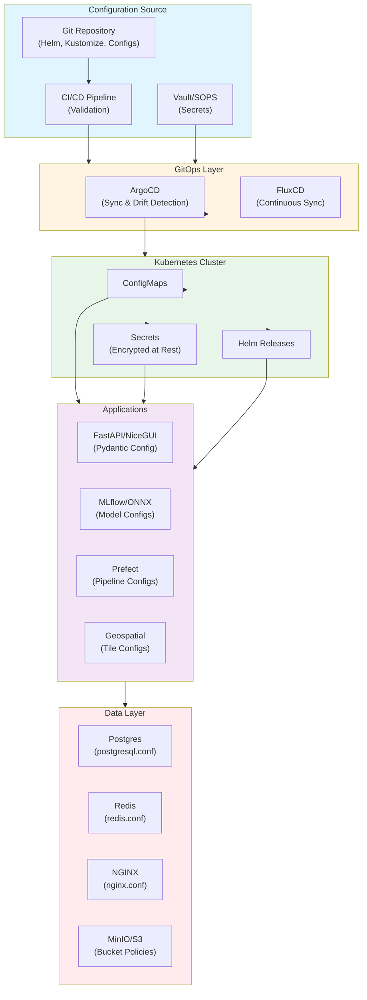
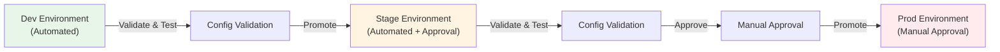

# Configuration Management, Secrets Lifecycle, and Multi-Environment Drift Control

**Objective**: Master production-grade configuration management across multi-environment distributed systems. When you need to prevent config drift, manage secrets securely, validate configurations, and maintain consistency across dev/stage/prod—this guide provides complete patterns and implementations.

## Introduction

Configuration management is the foundation of reliable distributed systems. Misconfigured systems fail silently, leak secrets, and create cascading failures. This guide provides a complete framework for managing configuration across databases, clusters, services, and pipelines.

**What This Guide Covers**:
- Configuration taxonomy and lifecycle
- Secrets management and rotation
- Multi-environment promotion workflows
- Drift detection and prevention
- Configuration validation patterns
- Air-gapped environment strategies
- Application-level configuration patterns
- Monitoring and observability

**Prerequisites**:
- Understanding of Kubernetes, Docker, and distributed systems
- Familiarity with GitOps, Helm, and configuration tools
- Experience with secrets management and encryption

## Why Configuration Management Is Mission-Critical

### The Cost of Configuration Failures

**Postgres/Redis Misconfig → Outages**:
- Wrong connection pool settings cause connection exhaustion
- Incorrect replication config leads to data loss
- Memory limits too low cause OOM kills
- Without proper config management, these failures cascade

**ML Models Loading Wrong Paths → Silent Errors**:
- Model endpoints pointing to wrong buckets
- Feature store paths misconfigured
- Inference services using stale model versions
- Results appear correct but are actually wrong

**Tile Pipelines Pointing at Wrong Buckets → Broken Maps**:
- Geospatial tile generation using dev buckets in prod
- Basemap URLs misconfigured
- Vector tile endpoints incorrect
- Maps fail to render or show wrong data

**Prefect Pipelines Using Wrong Endpoints → Corrupted ETL**:
- ETL jobs writing to wrong databases
- Data transformation pipelines using incorrect schemas
- Backup jobs pointing to wrong object stores
- Data corruption goes undetected until too late

**Drift Between Dev/Stage/Prod → Impossible-to-Debug Behavior**:
- Configs work in dev but fail in prod
- Environment-specific bugs that can't be reproduced
- Different behavior across environments
- Debugging becomes guesswork

**Secrets Mismanagement → Catastrophic Leakage**:
- Hardcoded credentials in code
- Secrets in environment variables exposed in logs
- Rotated secrets not propagated
- Full system compromise

**Air-Gap Configs → Prone to Rot and Divergence**:
- Manual config updates lead to drift
- No automated sync from connected environments
- Configs become stale and incorrect
- Recovery becomes impossible

**K8s values.yaml Fragmentation → Environment Chaos**:
- Different values.yaml per environment
- No single source of truth
- Changes applied inconsistently
- Rollouts fail unpredictably

### Configuration Flow Through Systems



## The Golden Rules of Configuration Management

### Rule 1: Configuration Must Be Declarative, Not Imperative

**Bad (Imperative)**:
```bash
# Don't do this
kubectl set env deployment/api DATABASE_URL=$DB_URL
kubectl patch configmap app-config --type merge -p '{"data":{"key":"value"}}'
```

**Good (Declarative)**:
```yaml
# Do this - version-controlled YAML
apiVersion: v1
kind: ConfigMap
metadata:
  name: app-config
data:
  database_url: "postgresql://db:5432/mydb"
```

### Rule 2: Configuration Must Be Version-Controlled

- All configuration in Git
- Every change tracked and reviewed
- Rollback via Git history
- No manual cluster edits

### Rule 3: No Configuration May Live Only in One Engineer's Head

- Document all configuration decisions
- Use ADRs for major config changes
- Configuration must be self-documenting
- Onboarding docs must include config setup

### Rule 4: Secrets and Config Must Have Lifecycle Policies

- Secrets must expire
- Configs must be validated
- Rotation schedules defined
- Deprecation policies documented

### Rule 5: Configs Must Be Validated Before Deployment

- Schema validation
- Pre-deploy CI checks
- Automated testing
- No invalid configs in production

### Rule 6: Environment Config Drift Is Forbidden Unless Intentional and Documented

- Automated drift detection
- Drift alerts
- Required approvals for intentional drift
- Documentation of all drift exemptions

### Rule 7: Config Changes Must Be Observable and Audit-Logged

- All config changes logged
- Config version tracking
- Change attribution
- Rollback capability

## Types of Configuration and How to Handle Each

### Static Configuration

**Definition**: Build-time configs, immutable container settings, typed structures.

**Examples**:

**Pydantic Config (Python)**:
```python
# config/static_config.py
from pydantic import BaseSettings, Field
from typing import Literal

class DatabaseConfig(BaseSettings):
    """Database connection configuration"""
    host: str = Field(..., description="Database host")
    port: int = Field(5432, description="Database port")
    database: str = Field(..., description="Database name")
    pool_size: int = Field(10, ge=1, le=100, description="Connection pool size")
    pool_timeout: int = Field(30, ge=1, description="Pool timeout in seconds")
    
    class Config:
        env_prefix = "DB_"
        case_sensitive = False

class AppConfig(BaseSettings):
    """Application configuration"""
    environment: Literal["dev", "stage", "prod"] = Field(..., description="Environment")
    log_level: Literal["DEBUG", "INFO", "WARNING", "ERROR"] = Field("INFO")
    api_timeout: int = Field(30, ge=1, description="API timeout in seconds")
    
    database: DatabaseConfig = Field(..., description="Database config")
    
    class Config:
        env_prefix = "APP_"
        case_sensitive = False

# Usage
config = AppConfig()
```

**Go Struct Config**:
```go
// config/config.go
package config

import (
    "time"
    "github.com/kelseyhightower/envconfig"
)

type Config struct {
    Environment string `envconfig:"ENVIRONMENT" required:"true"`
    LogLevel    string `envconfig:"LOG_LEVEL" default:"INFO"`
    APITimeout  int    `envconfig:"API_TIMEOUT" default:"30"`
    
    Database DatabaseConfig `envconfig:"DB"`
}

type DatabaseConfig struct {
    Host      string        `envconfig:"HOST" required:"true"`
    Port      int           `envconfig:"PORT" default:"5432"`
    Database  string        `envconfig:"DATABASE" required:"true"`
    PoolSize  int           `envconfig:"POOL_SIZE" default:"10"`
    PoolTimeout time.Duration `envconfig:"POOL_TIMEOUT" default:"30s"`
}

func Load() (*Config, error) {
    var cfg Config
    err := envconfig.Process("", &cfg)
    return &cfg, err
}
```

**Rust Serde Config**:
```rust
// config/config.rs
use serde::{Deserialize, Serialize};

#[derive(Debug, Deserialize, Serialize)]
pub struct Config {
    pub environment: String,
    #[serde(default = "default_log_level")]
    pub log_level: String,
    #[serde(default = "default_api_timeout")]
    pub api_timeout: u64,
    pub database: DatabaseConfig,
}

#[derive(Debug, Deserialize, Serialize)]
pub struct DatabaseConfig {
    pub host: String,
    #[serde(default = "default_port")]
    pub port: u16,
    pub database: String,
    #[serde(default = "default_pool_size")]
    pub pool_size: u32,
}

fn default_log_level() -> String {
    "INFO".to_string()
}

fn default_api_timeout() -> u64 {
    30
}

fn default_port() -> u16 {
    5432
}

fn default_pool_size() -> u32 {
    10
}
```

### Dynamic Configuration

**Definition**: Runtime parameters, feature flags, performance tuning.

**Examples**:

**Redis-Based Feature Flags**:
```python
# config/feature_flags.py
import redis
import json

class FeatureFlags:
    def __init__(self, redis_client: redis.Redis):
        self.redis = redis_client
    
    def is_enabled(self, flag: str, user_id: str = None) -> bool:
        """Check if feature flag is enabled"""
        key = f"feature_flag:{flag}"
        
        # Check global flag
        global_value = self.redis.get(key)
        if global_value:
            config = json.loads(global_value)
            if config.get("enabled", False):
                return True
        
        # Check user-specific flag
        if user_id:
            user_key = f"feature_flag:{flag}:{user_id}"
            user_value = self.redis.get(user_key)
            if user_value:
                return json.loads(user_value).get("enabled", False)
        
        return False
    
    def set_flag(self, flag: str, enabled: bool, user_id: str = None):
        """Set feature flag"""
        key = f"feature_flag:{flag}" if not user_id else f"feature_flag:{flag}:{user_id}"
        self.redis.set(
            key,
            json.dumps({"enabled": enabled, "updated_at": datetime.now().isoformat()}),
            ex=86400  # 24 hour TTL
        )
```

**ConfigMap-Based Dynamic Config**:
```yaml
# k8s/dynamic-config.yaml
apiVersion: v1
kind: ConfigMap
metadata:
  name: dynamic-config
data:
  feature_flags.json: |
    {
      "enable_new_api": true,
      "enable_ml_inference": false,
      "cache_ttl_seconds": 300
    }
  performance_tuning.json: |
    {
      "max_concurrent_requests": 100,
      "request_timeout_ms": 5000,
      "retry_attempts": 3
    }
```

### Secrets

**Definition**: API keys, database passwords, encryption keys, OAuth/OIDC credentials.

**Examples**:

**External Secrets Operator**:
```yaml
# k8s/external-secret.yaml
apiVersion: external-secrets.io/v1beta1
kind: ExternalSecret
metadata:
  name: database-credentials
  namespace: app
spec:
  refreshInterval: 1h
  secretStoreRef:
    name: vault-backend
    kind: SecretStore
  target:
    name: database-secret
    creationPolicy: Owner
  data:
    - secretKey: password
      remoteRef:
        key: database/prod
        property: password
    - secretKey: username
      remoteRef:
        key: database/prod
        property: username
```

**SOPS Encrypted Config**:
```yaml
# config/secrets.enc.yaml
# Encrypted with SOPS
database:
    password: ENC[AES256_GCM,data:...,iv:...,tag:...,type:str]
    api_key: ENC[AES256_GCM,data:...,iv:...,tag:...,type:str]
```

### Sensitive Configs

**Definition**: PII access controls, ML model endpoints, geospatial tile endpoints.

**Examples**:

**ML Model Endpoint Config**:
```python
# config/ml_config.py
from pydantic import BaseSettings, SecretStr

class MLConfig(BaseSettings):
    """ML model configuration"""
    model_endpoint: str = Field(..., description="ONNX model endpoint")
    feature_store_endpoint: str = Field(..., description="Feature store endpoint")
    inference_timeout: int = Field(5, ge=1, description="Inference timeout")
    batch_size: int = Field(32, ge=1, le=128, description="Batch size")
    
    # Sensitive - use SecretStr
    api_key: SecretStr = Field(..., description="ML API key")
    
    class Config:
        env_prefix = "ML_"
```

**Geospatial Tile Config**:
```python
# config/gis_config.py
class GISConfig(BaseSettings):
    """Geospatial configuration"""
    tile_endpoint: str = Field(..., description="Vector tile endpoint")
    basemap_url: str = Field(..., description="Basemap URL")
    max_zoom: int = Field(12, ge=1, le=18, description="Maximum zoom level")
    cache_ttl: int = Field(3600, ge=0, description="Cache TTL in seconds")
    
    # Sensitive bucket paths
    tile_bucket: str = Field(..., description="Tile storage bucket")
    data_bucket: str = Field(..., description="Geospatial data bucket")
    
    class Config:
        env_prefix = "GIS_"
```

### Environment-Level Configs

**Definition**: Cluster URLs, bucket paths, MLflow tracking URIs, Redis endpoints.

**Examples**:

**Environment-Specific Helm Values**:
```yaml
# helm/values-dev.yaml
environment: dev
cluster:
  name: dev-cluster
  endpoint: https://dev-k8s.example.com

databases:
  postgres:
    host: postgres-dev.example.com
    port: 5432
  redis:
    host: redis-dev.example.com
    port: 6379

object_stores:
  s3:
    endpoint: https://minio-dev.example.com
    bucket: raw-data-dev
    prefix: dev/

mlflow:
  tracking_uri: http://mlflow-dev.example.com:5000

# helm/values-prod.yaml
environment: prod
cluster:
  name: prod-cluster
  endpoint: https://prod-k8s.example.com

databases:
  postgres:
    host: postgres-prod.example.com
    port: 5432
  redis:
    host: redis-prod.example.com
    port: 6379

object_stores:
  s3:
    endpoint: https://s3-prod.example.com
    bucket: raw-data-prod
    prefix: prod/

mlflow:
  tracking_uri: http://mlflow-prod.example.com:5000
```

## Recommended Tools and Patterns

### GitOps (ArgoCD, FluxCD)

**ArgoCD Application**:
```yaml
# argocd/app.yaml
apiVersion: argocd.applications/v1alpha1
kind: Application
metadata:
  name: app-prod
  namespace: argocd
spec:
  project: default
  source:
    repoURL: https://github.com/myorg/configs.git
    targetRevision: main
    path: k8s/app
    helm:
      valueFiles:
        - values-prod.yaml
  destination:
    server: https://kubernetes.default.svc
    namespace: app-prod
  syncPolicy:
    automated:
      prune: true
      selfHeal: true
    syncOptions:
      - CreateNamespace=true
```

**FluxCD Kustomization**:
```yaml
# flux/kustomization.yaml
apiVersion: kustomize.toolkit.fluxcd.io/v1beta2
kind: Kustomization
metadata:
  name: app-prod
  namespace: flux-system
spec:
  interval: 5m
  path: ./k8s/app
  prune: true
  sourceRef:
    kind: GitRepository
    name: configs
  validation: client
  postBuild:
    substitute:
      ENVIRONMENT: prod
      CLUSTER_NAME: prod-cluster
```

### Helm and Kustomize

**Helm Chart Structure**:
```
helm/app/
├── Chart.yaml
├── values.yaml
├── values-dev.yaml
├── values-stage.yaml
├── values-prod.yaml
└── templates/
    ├── deployment.yaml
    ├── configmap.yaml
    └── secret.yaml
```

**Kustomize Overlay**:
```yaml
# kustomize/base/kustomization.yaml
apiVersion: kustomize.config.k8s.io/v1beta1
kind: Kustomization
resources:
  - deployment.yaml
  - configmap.yaml

# kustomize/overlays/prod/kustomization.yaml
apiVersion: kustomize.config.k8s.io/v1beta1
kind: Kustomization
resources:
  - ../../base
patches:
  - path: configmap-patch.yaml
  - path: deployment-patch.yaml
configMapGenerator:
  - name: app-config
    behavior: merge
    literals:
      - ENVIRONMENT=prod
      - LOG_LEVEL=INFO
```

### SOPS + age

**SOPS Configuration**:
```yaml
# .sops.yaml
creation_rules:
  - path_regex: secrets/.*\.yaml$
    age: >-
      age1xxxxxxxxxxxxxxxxxxxxxxxxxxxxxxxxxxxxxxxxxxxxxxxxxxxxxxxxxx
    encrypted_regex: ^(data|stringData|password|api_key|secret)$
```

**Encrypting Secrets**:
```bash
# Encrypt file
sops -e -i secrets/database.yaml

# Edit encrypted file
sops secrets/database.yaml

# Decrypt for CI/CD
sops -d secrets/database.yaml | kubectl apply -f -
```

### External Secrets Operator

**SecretStore**:
```yaml
# k8s/secret-store.yaml
apiVersion: external-secrets.io/v1beta1
kind: SecretStore
metadata:
  name: vault-backend
  namespace: app
spec:
  provider:
    vault:
      server: https://vault.example.com
      path: secret
      version: v2
      auth:
        kubernetes:
          mountPath: kubernetes
          role: app-role
          serviceAccountRef:
            name: external-secrets
```

### Configuration Validation

**Conftest + OPA**:
```rego
# policies/config.rego
package config

deny[msg] {
    input.kind == "ConfigMap"
    input.data.environment == "prod"
    not input.data.log_level
    msg := "Production configs must specify log_level"
}

deny[msg] {
    input.kind == "ConfigMap"
    input.data.environment == "prod"
    input.data.log_level == "DEBUG"
    msg := "Production configs cannot use DEBUG log level"
}
```

**Validation in CI**:
```yaml
# .github/workflows/validate-config.yaml
name: Validate Configuration
on:
  pull_request:
    paths:
      - 'k8s/**'
      - 'helm/**'

jobs:
  validate:
    runs-on: ubuntu-latest
    steps:
      - uses: actions/checkout@v3
      
      - name: Validate Helm charts
        run: |
          helm lint helm/app
          helm template helm/app | kubeconform -strict
      
      - name: Validate with Conftest
        run: |
          helm template helm/app | conftest test -
      
      - name: Validate Kustomize
        run: |
          kustomize build k8s/app | kubeconform -strict
```

### Schema-Based Validation

**Pydantic Schema**:
```python
# config/schema.py
from pydantic import BaseModel, validator
from typing import Literal

class ConfigSchema(BaseModel):
    environment: Literal["dev", "stage", "prod"]
    log_level: Literal["DEBUG", "INFO", "WARNING", "ERROR"]
    api_timeout: int
    
    @validator('api_timeout')
    def validate_timeout(cls, v):
        if v < 1 or v > 300:
            raise ValueError('api_timeout must be between 1 and 300')
        return v
```

**JSON Schema Validation**:
```json
{
  "$schema": "http://json-schema.org/draft-07/schema#",
  "type": "object",
  "properties": {
    "environment": {
      "type": "string",
      "enum": ["dev", "stage", "prod"]
    },
    "log_level": {
      "type": "string",
      "enum": ["DEBUG", "INFO", "WARNING", "ERROR"]
    },
    "api_timeout": {
      "type": "integer",
      "minimum": 1,
      "maximum": 300
    }
  },
  "required": ["environment", "log_level", "api_timeout"]
}
```

## Environment Promotion Workflow

### Dev → Stage → Prod Promotion



**Promotion Script**:
```python
# scripts/promote_config.py
import subprocess
import sys
from pathlib import Path

def promote_config(source_env: str, target_env: str, config_path: Path):
    """Promote configuration from source to target environment"""
    # 1. Validate source config
    print(f"Validating {source_env} configuration...")
    if not validate_config(config_path / f"values-{source_env}.yaml"):
        print(f"ERROR: {source_env} config validation failed")
        sys.exit(1)
    
    # 2. Check for drift
    print(f"Checking for drift in {target_env}...")
    drift = check_drift(source_env, target_env)
    if drift:
        print(f"WARNING: Drift detected between {source_env} and {target_env}")
        if not confirm("Continue with promotion?"):
            sys.exit(1)
    
    # 3. Create promotion PR
    print(f"Creating promotion PR from {source_env} to {target_env}...")
    pr_url = create_promotion_pr(source_env, target_env, config_path)
    print(f"Promotion PR: {pr_url}")
    
    # 4. Run validation in target environment
    print(f"Running validation in {target_env}...")
    if not validate_in_target(target_env):
        print(f"ERROR: Validation failed in {target_env}")
        sys.exit(1)
    
    # 5. Apply config (if auto-approve)
    if target_env != "prod":
        print(f"Applying configuration to {target_env}...")
        apply_config(target_env, config_path)
    else:
        print("Production promotion requires manual approval")
        print(f"Review PR: {pr_url}")

def validate_config(config_file: Path) -> bool:
    """Validate configuration file"""
    result = subprocess.run(
        ["helm", "lint", "-f", str(config_file)],
        capture_output=True
    )
    return result.returncode == 0

def check_drift(source_env: str, target_env: str) -> bool:
    """Check for configuration drift"""
    # Compare configs
    source_config = load_config(f"values-{source_env}.yaml")
    target_config = load_config(f"values-{target_env}.yaml")
    
    return source_config != target_config
```

### Automated Release Tagging

```yaml
# .github/workflows/promote-config.yaml
name: Promote Configuration
on:
  workflow_dispatch:
    inputs:
      source_env:
        description: 'Source environment'
        required: true
        type: choice
        options:
          - dev
          - stage
      target_env:
        description: 'Target environment'
        required: true
        type: choice
        options:
          - stage
          - prod

jobs:
  promote:
    runs-on: ubuntu-latest
    steps:
      - uses: actions/checkout@v3
      
      - name: Validate source config
        run: |
          helm lint -f helm/app/values-${{ github.event.inputs.source_env }}.yaml
      
      - name: Check drift
        run: |
          python scripts/check_drift.py \
            --source ${{ github.event.inputs.source_env }} \
            --target ${{ github.event.inputs.target_env }}
      
      - name: Create promotion PR
        run: |
          gh pr create \
            --title "Promote config: ${{ github.event.inputs.source_env }} → ${{ github.event.inputs.target_env }}" \
            --body "Automated promotion from ${{ github.event.inputs.source_env }} to ${{ github.event.inputs.target_env }}"
      
      - name: Tag release
        if: github.event.inputs.target_env == 'prod'
        run: |
          git tag -a "config-v$(date +%Y%m%d-%H%M%S)" -m "Config promotion to prod"
          git push origin --tags
```

## Multi-Environment Drift Prevention

### Drift Detection Tools

**kubectl diff**:
```bash
# Compare desired vs actual
kubectl diff -f k8s/app/ | tee drift-report.txt

# Check specific resource
kubectl diff -f k8s/app/deployment.yaml
```

**ArgoCD Drift Detection**:
```yaml
# argocd/app-with-drift-detection.yaml
apiVersion: argocd.applications/v1alpha1
kind: Application
metadata:
  name: app-prod
spec:
  syncPolicy:
    automated:
      prune: true
      selfHeal: true  # Auto-correct drift
    syncOptions:
      - CreateNamespace=true
  # ArgoCD automatically detects and reports drift
```

**Postgres Schema Comparison**:
```python
# scripts/detect_postgres_drift.py
import psycopg2
from schema_diff import compare_schemas

def detect_postgres_drift(dev_conn, prod_conn):
    """Detect schema drift between dev and prod"""
    dev_schema = get_schema(dev_conn)
    prod_schema = get_schema(prod_conn)
    
    diff = compare_schemas(dev_schema, prod_schema)
    
    if diff:
        print("Schema drift detected:")
        for change in diff:
            print(f"  - {change}")
        return True
    
    return False

def get_schema(conn):
    """Get database schema"""
    with conn.cursor() as cur:
        cur.execute("""
            SELECT 
                schemaname,
                tablename,
                columnname,
                datatype
            FROM pg_catalog.pg_table_def
            WHERE schemaname NOT IN ('pg_catalog', 'information_schema')
            ORDER BY schemaname, tablename, columnname
        """)
        return cur.fetchall()
```

**Redis Config Audit**:
```python
# scripts/detect_redis_drift.py
import redis

def detect_redis_drift(dev_client: redis.Redis, prod_client: redis.Redis):
    """Detect Redis configuration drift"""
    dev_config = dev_client.config_get()
    prod_config = prod_client.config_get()
    
    drift = []
    for key in set(dev_config.keys()) | set(prod_config.keys()):
        if dev_config.get(key) != prod_config.get(key):
            drift.append({
                "key": key,
                "dev": dev_config.get(key),
                "prod": prod_config.get(key)
            })
    
    return drift
```

**NGINX Config Hash Diffing**:
```bash
# scripts/detect_nginx_drift.sh
#!/bin/bash

DEV_CONFIG="nginx/nginx-dev.conf"
PROD_CONFIG="nginx/nginx-prod.conf"

DEV_HASH=$(md5sum "$DEV_CONFIG" | cut -d' ' -f1)
PROD_HASH=$(md5sum "$PROD_CONFIG" | cut -d' ' -f1)

if [ "$DEV_HASH" != "$PROD_HASH" ]; then
    echo "NGINX config drift detected"
    diff -u "$DEV_CONFIG" "$PROD_CONFIG"
    exit 1
fi
```

**Automated Nightly Drift Detection**:
```yaml
# .github/workflows/nightly-drift-check.yaml
name: Nightly Drift Detection
on:
  schedule:
    - cron: '0 2 * * *'  # 2 AM daily
  workflow_dispatch:

jobs:
  detect-drift:
    runs-on: ubuntu-latest
    steps:
      - uses: actions/checkout@v3
      
      - name: Check K8s drift
        run: |
          kubectl diff -f k8s/app/ > drift-report.txt
          if [ -s drift-report.txt ]; then
            echo "Drift detected!"
            cat drift-report.txt
            exit 1
          fi
      
      - name: Check Postgres drift
        run: |
          python scripts/detect_postgres_drift.py
      
      - name: Check Redis drift
        run: |
          python scripts/detect_redis_drift.py
      
      - name: Report drift
        if: failure()
        run: |
          gh issue create \
            --title "Configuration drift detected" \
            --body "$(cat drift-report.txt)"
```

## Secrets Lifecycle & Rotation Policy

### Secret Creation

**Secret Creation Workflow**:
```python
# scripts/create_secret.py
from cryptography.fernet import Fernet
import secrets
import json

class SecretManager:
    def __init__(self, vault_client):
        self.vault = vault_client
    
    def create_secret(
        self,
        secret_name: str,
        secret_type: str,
        environment: str,
        scopes: list,
        expires_days: int = 90
    ) -> dict:
        """Create new secret with lifecycle policy"""
        # Generate secret value
        if secret_type == "api_key":
            value = secrets.token_urlsafe(32)
        elif secret_type == "password":
            value = secrets.token_urlsafe(24)
        elif secret_type == "jwt_signing_key":
            value = Fernet.generate_key().decode()
        else:
            raise ValueError(f"Unknown secret type: {secret_type}")
        
        # Store in Vault
        self.vault.write(
            f"secret/{environment}/{secret_name}",
            value=value,
            type=secret_type,
            scopes=scopes,
            created_at=datetime.now().isoformat(),
            expires_at=(datetime.now() + timedelta(days=expires_days)).isoformat()
        )
        
        return {
            "name": secret_name,
            "value": value,  # Only returned once
            "expires_at": (datetime.now() + timedelta(days=expires_days)).isoformat()
        }
```

### Automated Rotation

**Database Password Rotation**:
```python
# scripts/rotate_db_password.py
import asyncpg
from vault_client import VaultClient

class DatabasePasswordRotator:
    def __init__(self, vault: VaultClient, db_pool: asyncpg.Pool):
        self.vault = vault
        self.db_pool = db_pool
    
    async def rotate_password(self, user: str, environment: str):
        """Rotate database password with zero downtime"""
        # 1. Generate new password
        new_password = secrets.token_urlsafe(24)
        
        # 2. Create new user with new password (dual-secret pattern)
        new_user = f"{user}_new"
        async with self.db_pool.acquire() as conn:
            await conn.execute(f"""
                CREATE USER {new_user} WITH PASSWORD %s;
                GRANT ALL PRIVILEGES ON DATABASE mydb TO {new_user};
            """, new_password)
        
        # 3. Update application config (grace period)
        await self.update_app_config(new_user, new_password, grace_period=True)
        
        # 4. Wait for connections to migrate
        await asyncio.sleep(300)  # 5 minute grace period
        
        # 5. Drop old user
        async with self.db_pool.acquire() as conn:
            await conn.execute(f"DROP USER {user}")
        
        # 6. Rename new user
        async with self.db_pool.acquire() as conn:
            await conn.execute(f"ALTER USER {new_user} RENAME TO {user}")
        
        # 7. Update Vault
        self.vault.write(
            f"secret/{environment}/database/{user}",
            password=new_password,
            rotated_at=datetime.now().isoformat()
        )
```

**API Key Rotation**:
```yaml
# k8s/api-key-rotation.yaml
apiVersion: batch/v1
kind: CronJob
metadata:
  name: rotate-api-keys
spec:
  schedule: "0 0 * * 0"  # Weekly
  jobTemplate:
    spec:
      template:
        spec:
          containers:
            - name: rotate-keys
              image: secret-rotator:latest
              command:
                - python
                - /app/rotate_api_keys.py
                - --environment
                - prod
                - --rotation-interval
                - "90d"
```

### Secret Retirement

```python
# scripts/retire_secret.py
class SecretRetirer:
    def __init__(self, vault: VaultClient):
        self.vault = vault
    
    def retire_secret(self, secret_name: str, environment: str, reason: str):
        """Retire and archive secret"""
        # 1. Mark as retired
        secret_data = self.vault.read(f"secret/{environment}/{secret_name}")
        secret_data["retired"] = True
        secret_data["retired_at"] = datetime.now().isoformat()
        secret_data["retirement_reason"] = reason
        
        # 2. Move to archive
        self.vault.write(
            f"archive/{environment}/{secret_name}",
            **secret_data
        )
        
        # 3. Delete from active secrets
        self.vault.delete(f"secret/{environment}/{secret_name}")
        
        # 4. Revoke all tokens using this secret
        self.revoke_tokens(secret_name, environment)
```

## Configuration Validation Patterns

### Pre-Deploy CI Validation

```yaml
# .github/workflows/validate-config.yaml
name: Validate Configuration
on:
  pull_request:
    paths:
      - 'k8s/**'
      - 'helm/**'
      - 'config/**'

jobs:
  validate:
    runs-on: ubuntu-latest
    steps:
      - uses: actions/checkout@v3
      
      - name: Validate Helm
        run: |
          helm lint helm/app
          helm template helm/app | kubeconform -strict
      
      - name: Validate with Conftest
        run: |
          helm template helm/app | conftest test -p policies/
      
      - name: Validate Pydantic schemas
        run: |
          python -m pytest tests/test_config_schema.py
      
      - name: Validate JSON schemas
        run: |
          ajv validate -s config/schema.json -d config/values-dev.json
```

### Schema Enforcement

**Pydantic Config Validation**:
```python
# config/validator.py
from pydantic import BaseModel, ValidationError
import yaml

def validate_config_file(config_path: Path, schema: BaseModel):
    """Validate configuration file against schema"""
    with open(config_path) as f:
        config_data = yaml.safe_load(f)
    
    try:
        validated = schema(**config_data)
        return validated
    except ValidationError as e:
        print(f"Validation errors in {config_path}:")
        for error in e.errors():
            print(f"  - {error['loc']}: {error['msg']}")
        raise
```

## Configuration for Air-Gapped Environments

### Bundling Encrypted Config Packages

```bash
# scripts/bundle_airgap_config.sh
#!/bin/bash

BUNDLE_NAME="config-bundle-$(date +%Y%m%d).tar.gz"
ENCRYPTION_KEY="age1xxxxxxxxxxxxxxxxxxxxxxxxxxxxxxxxxxxxxxxxxxxxxxxxxxxxxxxxxx"

# 1. Bundle configs
tar -czf config-bundle.tar.gz \
    k8s/ \
    helm/ \
    config/ \
    secrets.enc.yaml

# 2. Encrypt bundle
sops -e --age "$ENCRYPTION_KEY" config-bundle.tar.gz > "$BUNDLE_NAME"

# 3. Create manifest
cat > manifest.json <<EOF
{
  "bundle_name": "$BUNDLE_NAME",
  "created_at": "$(date -Iseconds)",
  "config_version": "$(git rev-parse HEAD)",
  "checksum": "$(sha256sum $BUNDLE_NAME | cut -d' ' -f1)"
}
EOF

# 4. Sign manifest
gpg --sign manifest.json
```

### Offline ArgoCD Sync

```yaml
# argocd/airgap-sync.yaml
apiVersion: argocd.applications/v1alpha1
kind: Application
metadata:
  name: app-airgap
spec:
  source:
    repoURL: file:///mnt/config-bundle  # Local file system
    path: k8s/app
  syncPolicy:
    automated:
      prune: true
      selfHeal: true
    syncOptions:
      - CreateNamespace=true
```

## Application-Level Configuration Strategy

### NiceGUI Config Loading

```python
# nicegui/config.py
from nicegui import app
from pydantic import BaseSettings
import os

class NiceGUIConfig(BaseSettings):
    """NiceGUI application configuration"""
    title: str = "My App"
    dark_mode: bool = True
    api_endpoint: str
    database_url: str
    redis_url: str
    
    class Config:
        env_file = ".env"
        env_file_encoding = "utf-8"

# Load config
config = NiceGUIConfig()

# Use in app
app.config = config
```

### FastAPI Config

```python
# fastapi/config.py
from fastapi import FastAPI
from pydantic import BaseSettings

class Settings(BaseSettings):
    app_name: str = "My API"
    database_url: str
    redis_url: str
    api_key: str
    
    class Config:
        env_file = ".env"

settings = Settings()

app = FastAPI(title=settings.app_name)

@app.get("/health")
async def health():
    return {"status": "healthy", "config_loaded": True}
```

### MLflow Config Binding

```python
# mlflow/config.py
import mlflow
from pydantic import BaseSettings

class MLflowConfig(BaseSettings):
    tracking_uri: str
    experiment_name: str = "default"
    registry_uri: str = None
    
    class Config:
        env_prefix = "MLFLOW_"

config = MLflowConfig()

# Configure MLflow
mlflow.set_tracking_uri(config.tracking_uri)
mlflow.set_experiment(config.experiment_name)
```

## Configuration Anti-Patterns

### 1. "Configs Live in Slack Messages"

**Symptom**: Configuration shared via chat, not version-controlled.

**Fix**: All configs in Git, use PRs for changes.

### 2. Hard-Coded Credentials in Scripts

**Symptom**: Passwords and keys in source code.

**Fix**: Use secrets management, environment variables, or Vault.

### 3. .env Files Pushed to Git

**Symptom**: `.env` files committed to repository.

**Fix**: Use `.env.example`, add `.env` to `.gitignore`, use SOPS for encrypted secrets.

### 4. K8s Secrets Stored Unencrypted

**Symptom**: Kubernetes secrets in plain YAML.

**Fix**: Use External Secrets Operator, SOPS, or sealed-secrets.

### 5. Configs Duplicated Across Repos

**Symptom**: Same config in multiple repositories.

**Fix**: Central config repository, use Git submodules or config packages.

### 6. Environment-Specific values.yaml Files Scattered

**Symptom**: values.yaml files in multiple locations.

**Fix**: Single Helm chart with environment overlays.

### 7. Missing Config Validation

**Symptom**: Invalid configs deployed to production.

**Fix**: Pre-deploy validation, schema enforcement, CI checks.

### 8. Runtime Mutation of Config

**Symptom**: Configs changed at runtime, causing nondeterminism.

**Fix**: Immutable configs, require restart for changes.

### 9. No Defined Secret Rotation

**Symptom**: Secrets never rotated, high risk of compromise.

**Fix**: Automated rotation schedules, expiration policies.

### 10. Configs Differ Between Nodes Without Reason

**Symptom**: Inconsistent configs across cluster nodes.

**Fix**: Centralized config management, GitOps, automated sync.

### 11. Manual Cluster Config Updates

**Symptom**: kubectl edit, manual ConfigMap changes.

**Fix**: GitOps workflow, all changes via Git.

### 12. Raw YAML Copy/Paste Without Templating

**Symptom**: Duplicated YAML with hardcoded values.

**Fix**: Helm/Kustomize templating, environment variables.

## Testing Configuration Changes

### Unit Testing Configuration Parsers

```python
# tests/test_config.py
import pytest
from config import AppConfig, DatabaseConfig

def test_config_loading():
    """Test configuration loading"""
    config = AppConfig(
        environment="dev",
        log_level="INFO",
        database=DatabaseConfig(
            host="localhost",
            port=5432,
            database="testdb"
        )
    )
    
    assert config.environment == "dev"
    assert config.database.host == "localhost"

def test_config_validation():
    """Test configuration validation"""
    with pytest.raises(ValueError):
        AppConfig(
            environment="invalid",
            log_level="INFO"
        )
```

### Integration Tests

```python
# tests/test_config_integration.py
@pytest.mark.integration
def test_config_deployment():
    """Test configuration deployment"""
    # Deploy config to test cluster
    subprocess.run(["kubectl", "apply", "-f", "k8s/test/"])
    
    # Verify config loaded
    result = subprocess.run(
        ["kubectl", "get", "configmap", "app-config"],
        capture_output=True
    )
    assert result.returncode == 0
```

## Monitoring & Observability of Config

### Prometheus Metrics

```python
# monitoring/config_metrics.py
from prometheus_client import Counter, Gauge, Histogram

config_load_errors = Counter(
    'config_load_errors_total',
    'Total config load errors',
    ['environment', 'config_type']
)

config_drift_detected = Gauge(
    'config_drift_detected',
    'Configuration drift detected',
    ['environment']
)

secret_expiration_days = Gauge(
    'secret_expiration_days',
    'Days until secret expiration',
    ['secret_name', 'environment']
)
```

### PromQL Queries

```promql
# Config load errors
rate(config_load_errors_total[5m])

# Secrets nearing expiration
secret_expiration_days < 7

# Config drift
config_drift_detected > 0
```

## Config Governance Checklists

### Daily Checklist

- [ ] Review config change PRs
- [ ] Check for drift alerts
- [ ] Verify secret expiration warnings
- [ ] Monitor config load errors

### Weekly Config Audit

- [ ] Review all config changes
- [ ] Check for anti-patterns
- [ ] Verify environment consistency
- [ ] Update documentation

### Monthly Secrets Rotation

- [ ] Rotate database passwords
- [ ] Rotate API keys
- [ ] Rotate TLS certificates
- [ ] Update rotation schedules

### Quarterly Drift Review

- [ ] Compare dev/stage/prod configs
- [ ] Document intentional drift
- [ ] Resolve unintentional drift
- [ ] Update drift policies

### Release Checklist

- [ ] Validate all configs
- [ ] Check secret expiration
- [ ] Verify environment promotion
- [ ] Test rollback procedure
- [ ] Update documentation

### DR Test Checklist

- [ ] Test config restore
- [ ] Verify secret recovery
- [ ] Test air-gap config loading
- [ ] Validate disaster recovery procedures

## See Also

- **[Secrets Management & Key Rotation](../security/secrets-governance.md)** - Secrets lifecycle
- **[IAM & RBAC Governance](../security/iam-rbac-abac-governance.md)** - Access control
- **[System Resilience](../operations-monitoring/system-resilience-and-concurrency.md)** - Resilience patterns

---

*This guide provides a complete framework for configuration management. Start with version control, add validation, implement GitOps, and monitor for drift. The goal is consistency, reliability, and security across all environments.*

