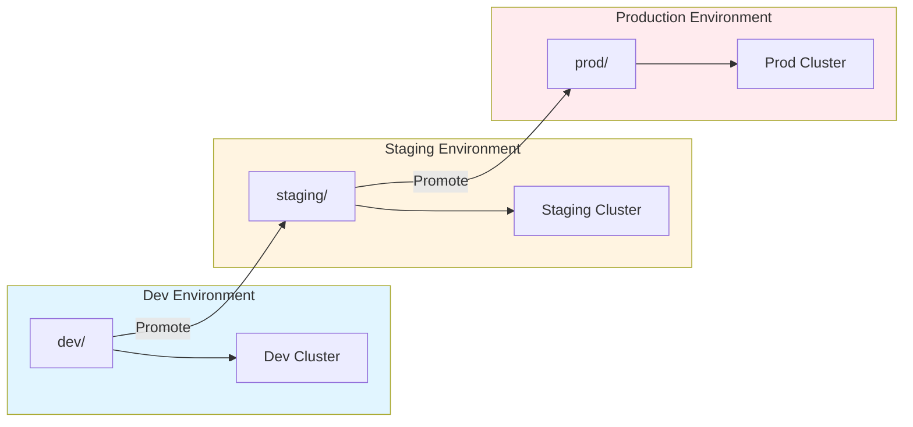
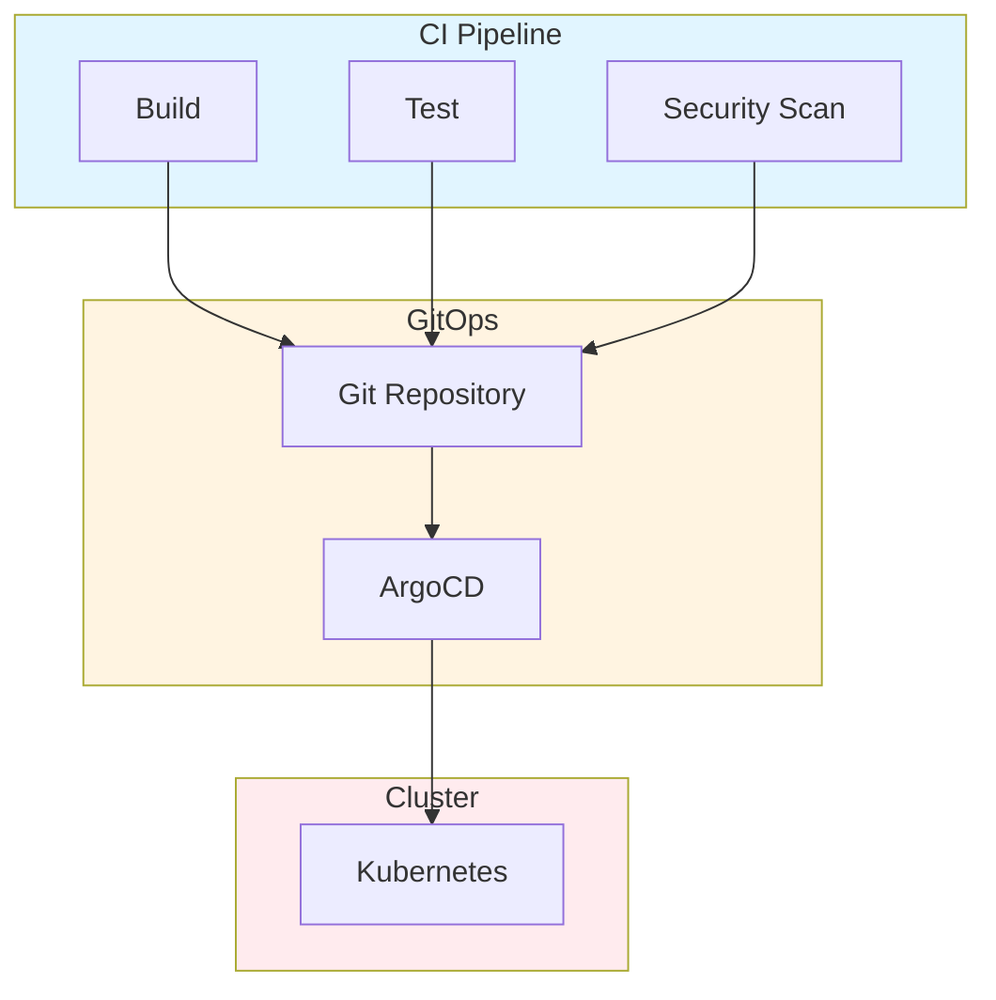
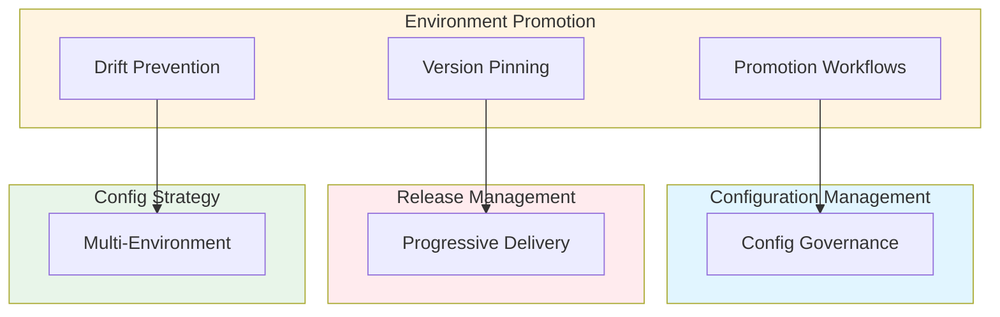

# Cross-Environment Configuration Drift Prevention, Promotion Workflows & Release Channels: Best Practices

**Objective**: Establish comprehensive environment promotion governance that controls configuration flow from dev → staging → prod → isolated environments, prevents drift, and ensures immutable, versioned deployments. When you need controlled promotion, when you want drift prevention, when you need release channels—this guide provides the complete framework.

## Introduction

Environment promotion is the foundation of reliable, reproducible deployments. Without controlled promotion workflows, configurations drift, environments diverge, and deployments become unpredictable. This guide establishes patterns for promotion pipelines, drift detection, version pinning, and release channel governance.

**What This Guide Covers**:
- Promotion pipelines (GitOps, ArgoCD, Flux)
- Diff-based drift detection
- Immutable vs mutable environment rules
- Version pinning policies for Docker images, Helm charts, Postgres schema migrations, Parquet schemas, ML model versions
- Canary and progressive delivery patterns
- Environment-specific divergence prevention
- CI/CD → GitOps → cluster sync flows

**Prerequisites**:
- Understanding of GitOps and CI/CD patterns
- Familiarity with configuration management and versioning
- Experience with multi-environment deployments

**Related Documents**:
This document integrates with:
- **[Configuration Management, Secrets Lifecycle, and Multi-Environment Drift Control](configuration-management.md)** - Configuration governance
- **[Cross-Environment Configuration Drift Detection & Prevention](configuration-drift-detection-prevention.md)** - Drift detection
- **[Release Management, Change Governance, and Progressive Delivery](release-management-and-progressive-delivery.md)** - Release practices
- **[Cross-Environment Configuration Strategy and Multi-Cluster State Management](../architecture-design/environment-config-governance.md)** - Config strategy

## The Philosophy of Environment Promotion

### Promotion Principles

**Principle 1: Immutable Promotion**
- Version all artifacts
- Pin versions in environments
- Prevent ad-hoc changes

**Principle 2: Controlled Flow**
- Dev → Staging → Prod
- Approval gates
- Audit all promotions

**Principle 3: Drift Prevention**
- Continuous drift detection
- Automated remediation
- Alert on divergence

## Promotion Pipeline Architecture

### GitOps Promotion Flow

**Flow Diagram**:


### ArgoCD Promotion

**Configuration**:
```yaml
# ArgoCD promotion workflow
apiVersion: argoproj.io/v1alpha1
kind: Application
metadata:
  name: my-app
spec:
  source:
    repoURL: https://git.example.com/repo
    path: environments/staging
    targetRevision: main
  destination:
    server: https://staging-cluster.example.com
    namespace: staging
  syncPolicy:
    automated:
      prune: true
      selfHeal: true
    syncOptions:
      - CreateNamespace=true
```

### Flux Promotion

**Configuration**:
```yaml
# Flux promotion workflow
apiVersion: kustomize.toolkit.fluxcd.io/v1
kind: Kustomization
metadata:
  name: my-app
spec:
  interval: 5m
  path: ./environments/staging
  prune: true
  sourceRef:
    kind: GitRepository
    name: my-repo
  validation: client
```

## Version Pinning Policies

### Docker Image Versioning

**Policy**:
```yaml
# Docker image version pinning
image_pinning:
  policy: "semver"
  format: "{name}:{major}.{minor}.{patch}"
  environments:
    dev:
      pinning: "loose"
      allow: "latest"
    staging:
      pinning: "minor"
      allow: "{major}.{minor}.*"
    prod:
      pinning: "strict"
      allow: "{major}.{minor}.{patch}"
```

### Helm Chart Versioning

**Policy**:
```yaml
# Helm chart version pinning
helm_pinning:
  policy: "semver"
  format: "{name}-{major}.{minor}.{patch}"
  environments:
    dev:
      pinning: "loose"
    staging:
      pinning: "minor"
    prod:
      pinning: "strict"
```

### Postgres Schema Versioning

**Policy**:
```sql
-- Postgres schema versioning
CREATE TABLE schema_versions (
    id SERIAL PRIMARY KEY,
    version VARCHAR(50) NOT NULL,
    applied_at TIMESTAMPTZ NOT NULL DEFAULT NOW(),
    environment VARCHAR(50) NOT NULL,
    migration_file TEXT NOT NULL
);

-- Version pinning
CREATE FUNCTION pin_schema_version(
    env VARCHAR(50),
    version VARCHAR(50)
) RETURNS void AS $$
BEGIN
    INSERT INTO schema_versions (version, environment, migration_file)
    VALUES (version, env, 'pinned');
END;
$$ LANGUAGE plpgsql;
```

### Parquet Schema Versioning

**Policy**:
```python
# Parquet schema versioning
class ParquetSchemaVersioning:
    def pin_schema_version(self, dataset: str, version: str, env: str):
        """Pin Parquet schema version"""
        schema_metadata = {
            'schema_version': version,
            'environment': env,
            'pinned_at': datetime.now().isoformat()
        }
        
        # Update schema metadata
        self.update_schema_metadata(dataset, schema_metadata)
```

### ML Model Versioning

**Policy**:
```python
# ML model versioning
class MLModelVersioning:
    def pin_model_version(self, model: str, version: str, env: str):
        """Pin ML model version"""
        model_metadata = {
            'model_version': version,
            'environment': env,
            'pinned_at': datetime.now().isoformat()
        }
        
        # Update model metadata
        mlflow.set_model_version_tag(model, version, "environment", env)
```

## Drift Detection

### Diff-Based Drift Detection

**Pattern**:
```python
# Diff-based drift detection
class DriftDetector:
    def detect_drift(self, env: str) -> DriftReport:
        """Detect configuration drift"""
        # Get expected configuration
        expected = self.get_expected_config(env)
        
        # Get actual configuration
        actual = self.get_actual_config(env)
        
        # Calculate diff
        diff = self.calculate_diff(expected, actual)
        
        if diff.has_changes():
            return DriftReport(
                environment=env,
                drift_detected=True,
                changes=diff.changes,
                severity=self.calculate_severity(diff)
            )
        
        return DriftReport(
            environment=env,
            drift_detected=False
        )
```

### Automated Drift Remediation

**Pattern**:
```yaml
# Automated drift remediation
drift_remediation:
  enabled: true
  strategy: "auto-reconcile"
  policies:
    - condition: "drift_severity == low"
      action: "auto-remediate"
    - condition: "drift_severity == high"
      action: "alert-only"
```

## Immutable vs Mutable Environments

### Immutable Environment Rules

**Policy**:
```yaml
# Immutable environment rules
immutable_environments:
  - name: "production"
    rules:
      - "no-direct-kubectl-apply"
      - "no-manual-config-changes"
      - "all-changes-via-gitops"
      - "version-pinning-required"
```

### Mutable Environment Rules

**Policy**:
```yaml
# Mutable environment rules
mutable_environments:
  - name: "development"
    rules:
      - "allow-direct-changes"
      - "allow-experimentation"
      - "auto-sync-to-git"
```

## Canary and Progressive Delivery

### Canary Deployment

**Pattern**:
```yaml
# Canary deployment
apiVersion: argoproj.io/v1alpha1
kind: Rollout
metadata:
  name: my-app
spec:
  replicas: 10
  strategy:
    canary:
      steps:
        - setWeight: 10
        - pause: {}
        - setWeight: 25
        - pause: {duration: 10m}
        - setWeight: 50
        - pause: {duration: 10m}
        - setWeight: 100
```

### Progressive Delivery

**Pattern**:
```yaml
# Progressive delivery
progressive_delivery:
  strategy: "gradual-rollout"
  steps:
    - percentage: 10
      duration: "5 minutes"
      validation: "health-checks"
    - percentage: 25
      duration: "10 minutes"
      validation: "metrics"
    - percentage: 50
      duration: "15 minutes"
      validation: "metrics"
    - percentage: 100
      duration: "30 minutes"
      validation: "full-observability"
```

## CI/CD → GitOps → Cluster Sync Flow

**Complete Flow**:


## Architecture Fitness Functions

### Promotion Compliance Fitness Function

**Definition**:
```python
# Promotion compliance fitness function
class PromotionComplianceFitnessFunction:
    def evaluate(self, system: System) -> float:
        """Evaluate promotion compliance"""
        # Check version pinning
        version_pinning_score = self.check_version_pinning(system)
        
        # Check promotion gates
        promotion_gates_score = self.check_promotion_gates(system)
        
        # Check drift detection
        drift_detection_score = self.check_drift_detection(system)
        
        # Calculate fitness
        fitness = (version_pinning_score * 0.4) + \
                  (promotion_gates_score * 0.3) + \
                  (drift_detection_score * 0.3)
        
        return fitness
```

## Cross-Document Architecture



## Checklists

### Environment Promotion Checklist

- [ ] Promotion pipelines configured
- [ ] Version pinning policies defined
- [ ] Drift detection active
- [ ] Immutable environment rules enforced
- [ ] Canary deployment configured
- [ ] Progressive delivery patterns implemented
- [ ] CI/CD → GitOps flow established
- [ ] Approval gates configured
- [ ] Audit logging enabled
- [ ] Fitness functions defined
- [ ] Regular promotion reviews scheduled

## Anti-Patterns

### Promotion Anti-Patterns

**Silent Config Drift**:
```yaml
# Bad: No drift detection
environment:
  name: "production"
  # No drift monitoring

# Good: Drift detection
environment:
  name: "production"
  drift_detection:
    enabled: true
    interval: "5 minutes"
    remediation: "auto-reconcile"
```

**Environment-Specific Divergence**:
```yaml
# Bad: Divergent configs
dev:
  image: "app:latest"
staging:
  image: "app:v1.0.0"
prod:
  image: "app:v2.0.0"  # Different version!

# Good: Consistent promotion
dev:
  image: "app:dev"
staging:
  image: "app:v1.0.0"  # Promoted from dev
prod:
  image: "app:v1.0.0"  # Promoted from staging
```

## See Also

- **[Configuration Management, Secrets Lifecycle, and Multi-Environment Drift Control](configuration-management.md)** - Configuration governance
- **[Cross-Environment Configuration Drift Detection & Prevention](configuration-drift-detection-prevention.md)** - Drift detection
- **[Release Management, Change Governance, and Progressive Delivery](release-management-and-progressive-delivery.md)** - Release practices
- **[Cross-Environment Configuration Strategy and Multi-Cluster State Management](../architecture-design/environment-config-governance.md)** - Config strategy

---

*This guide establishes comprehensive environment promotion patterns. Start with promotion pipelines, extend to version pinning, and continuously prevent drift.*

