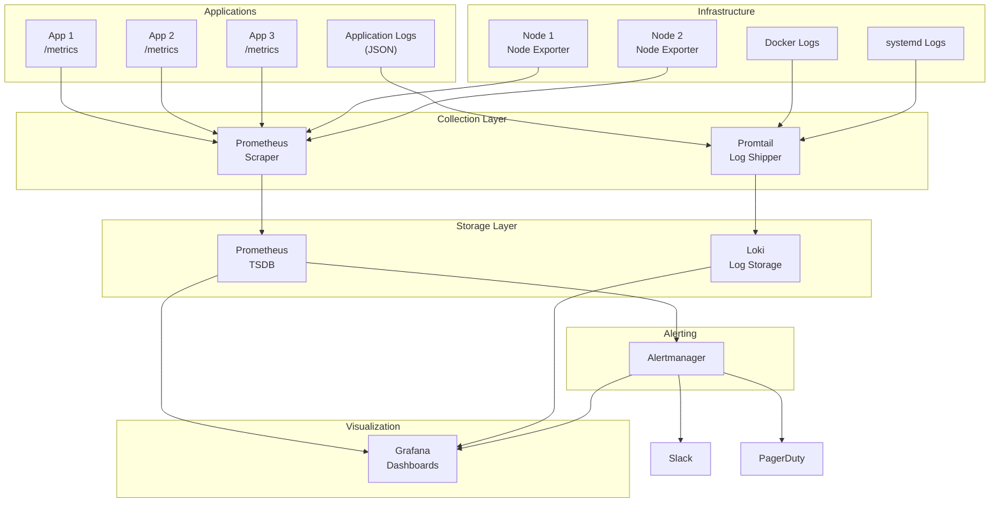
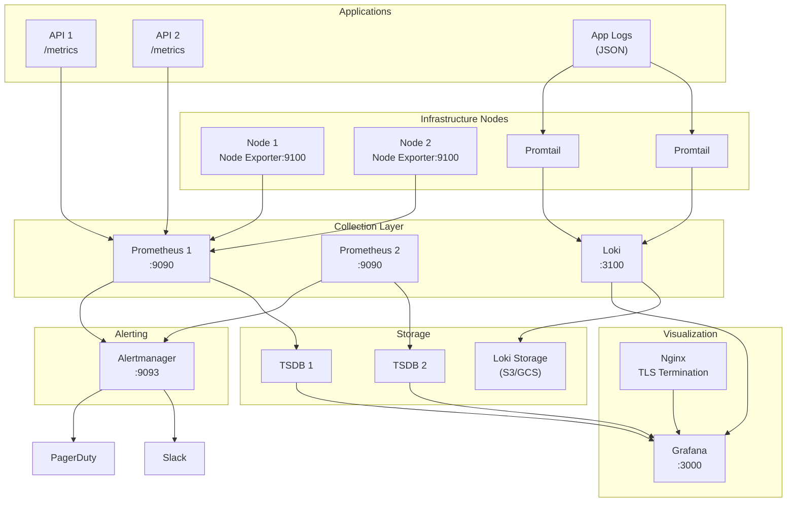

# Best Practices for Monitoring & Observability with Grafana, Prometheus, Loki, Node Exporter, and Structured Logging

**Objective**: Master production-grade observability with Grafana, Prometheus, Loki, and Node Exporter. When you need comprehensive monitoring, structured logging, alerting, and dashboards at scale—these best practices become your foundation.

## Introduction

Production systems need observability: metrics, logs, and traces that tell you what's happening right now and what happened in the past. This guide covers the complete stack: Prometheus for metrics, Loki for logs, Node Exporter for host metrics, and Grafana for visualization.

**What This Guide Assumes**:
- You understand system metrics (CPU, memory, disk, network)
- You're familiar with containers and Linux servers
- You've used Grafana and Prometheus but want production patterns
- You need working configurations, not theory

**What This Guide Provides**:
- Production-ready configurations
- PromQL and LogQL query patterns
- Alerting rules and thresholds
- Dashboard design patterns
- Deployment architectures
- Anti-patterns and pitfalls

## Observability Architecture Overview

### Stack Components

**Grafana**: Visualization and dashboards
- Query Prometheus for metrics
- Query Loki for logs
- Alerting and notification routing
- Dashboard provisioning via GitOps

**Prometheus**: Metrics collection and alerting
- Pull-based metric scraping
- Time-series database
- PromQL query language
- Alert rule evaluation

**Loki**: Log aggregation
- Index-light log storage
- LogQL query language
- Label-based indexing
- Compatible with Prometheus labels

**Node Exporter**: Host-level metrics
- System metrics (CPU, memory, disk, network)
- Exposes `/metrics` endpoint
- Scraped by Prometheus

**Promtail**: Log shipper
- Collects logs from files, systemd, Docker
- Sends to Loki with labels
- Relabeling and pipeline stages

**Alertmanager**: Alert routing
- Receives alerts from Prometheus
- Routes to Slack, PagerDuty, email
- Grouping and inhibition rules

### Architecture Diagram



### Data Flow

1. **Metrics**: Applications and Node Exporter expose `/metrics` → Prometheus scrapes → Stores in TSDB
2. **Logs**: Applications write logs → Promtail collects → Sends to Loki with labels
3. **Queries**: Grafana queries Prometheus (PromQL) and Loki (LogQL)
4. **Alerts**: Prometheus evaluates rules → Sends to Alertmanager → Routes to channels

## Prometheus Best Practices

### Deployment Models

#### Single Prometheus Server

**Use Case**: Small deployments (< 100 targets, < 1M samples/sec)

```yaml
# docker-compose.yml
version: '3.8'

services:
  prometheus:
    image: prom/prometheus:v2.48.0
    volumes:
      - ./prometheus.yml:/etc/prometheus/prometheus.yml
      - prometheus-data:/prometheus
    command:
      - '--config.file=/etc/prometheus/prometheus.yml'
      - '--storage.tsdb.path=/prometheus'
      - '--storage.tsdb.retention.time=30d'
      - '--web.console.libraries=/usr/share/prometheus/console_libraries'
      - '--web.console.templates=/usr/share/prometheus/consoles'
    ports:
      - "9090:9090"

volumes:
  prometheus-data:
```

**Pros**: Simple, low operational overhead
**Cons**: Single point of failure, limited scalability

#### HA Pair with Remote Write

**Use Case**: Medium to large deployments, high availability

```yaml
# prometheus-ha.yml
global:
  external_labels:
    cluster: 'production'
    replica: '${HOSTNAME}'

remote_write:
  - url: 'https://thanos-receive.example.com/api/v1/receive'
    queue_config:
      max_samples_per_send: 1000
      batch_send_deadline: 5s
```

**Architecture**:
- Two Prometheus instances (replica A, replica B)
- Both scrape same targets
- Both write to Thanos Receive or Mimir
- Grafana queries remote storage

**Pros**: High availability, long-term storage, deduplication
**Cons**: More complex, requires remote storage

### Scrape Configurations

#### Scraping Node Exporter

```yaml
# prometheus.yml
global:
  scrape_interval: 15s
  evaluation_interval: 15s
  external_labels:
    cluster: 'production'
    environment: 'prod'

scrape_configs:
  # Node Exporter
  - job_name: 'node-exporter'
    static_configs:
      - targets:
          - 'node1:9100'
          - 'node2:9100'
          - 'node3:9100'
        labels:
          job: 'node-exporter'
          datacenter: 'us-east-1'
    relabel_configs:
      - source_labels: [__address__]
        regex: '([^:]+):\d+'
        target_label: 'instance'
        replacement: '${1}'
```

#### Scraping Application Services

```yaml
# Application metrics
- job_name: 'api-services'
  scrape_interval: 10s
  metrics_path: '/metrics'
  static_configs:
    - targets:
        - 'api1:8080'
        - 'api2:8080'
        - 'api3:8080'
      labels:
        job: 'api'
        service: 'user-api'
        environment: 'production'
    relabel_configs:
      - source_labels: [__address__]
        regex: '([^:]+):\d+'
        target_label: 'instance'
      - source_labels: [__meta_kubernetes_pod_name]
        target_label: 'pod'
```

#### Service Discovery (Kubernetes)

```yaml
- job_name: 'kubernetes-pods'
  kubernetes_sd_configs:
    - role: pod
      namespaces:
        names:
          - default
          - production
  relabel_configs:
    # Only scrape pods with annotation
    - source_labels: [__meta_kubernetes_pod_annotation_prometheus_io_scrape]
      action: keep
      regex: true
    # Use annotation for path
    - source_labels: [__meta_kubernetes_pod_annotation_prometheus_io_path]
      action: replace
      target_label: __metrics_path__
      regex: (.+)
    # Use annotation for port
    - source_labels: [__address__, __meta_kubernetes_pod_annotation_prometheus_io_port]
      action: replace
      regex: ([^:]+)(?::\d+)?;(\d+)
      replacement: $1:$2
      target_label: __address__
    # Add pod labels
    - action: labelmap
      regex: __meta_kubernetes_pod_label_(.+)
    - source_labels: [__meta_kubernetes_namespace]
      target_label: namespace
    - source_labels: [__meta_kubernetes_pod_name]
      target_label: pod
```

### PromQL Patterns & Best Practices

#### CPU Usage

```promql
# CPU usage percentage (all cores)
100 - (avg by (instance) (rate(node_cpu_seconds_total{mode="idle"}[5m])) * 100)

# CPU usage per core
100 - (rate(node_cpu_seconds_total{mode="idle"}[5m]) * 100)

# CPU saturation (load average / CPU count)
node_load1 / count by (instance) (node_cpu_seconds_total{mode="idle"})
```

#### Memory Pressure

```promql
# Memory usage percentage
(1 - (node_memory_MemAvailable_bytes / node_memory_MemTotal_bytes)) * 100

# Memory available
node_memory_MemAvailable_bytes / 1024 / 1024 / 1024  # GB

# Memory pressure (available < 10%)
(node_memory_MemAvailable_bytes / node_memory_MemTotal_bytes) < 0.10
```

#### Disk I/O

```promql
# Disk read IOPS
rate(node_disk_reads_completed_total[5m])

# Disk write IOPS
rate(node_disk_writes_completed_total[5m])

# Disk read time (percentage)
rate(node_disk_io_time_seconds_total{device!~"dm-.*|loop.*"}[5m]) * 100

# Disk write time (percentage)
rate(node_disk_write_time_seconds_total{device!~"dm-.*|loop.*"}[5m]) * 100
```

#### Disk Space

```promql
# Disk space usage percentage
(1 - (node_filesystem_avail_bytes{mountpoint="/"} / node_filesystem_size_bytes{mountpoint="/"})) * 100

# Disk space available (GB)
node_filesystem_avail_bytes{mountpoint="/"} / 1024 / 1024 / 1024

# Disk space free < 10%
(node_filesystem_avail_bytes{mountpoint="/"} / node_filesystem_size_bytes{mountpoint="/"}) < 0.10
```

#### Network Bandwidth

```promql
# Network receive rate (bytes/sec)
rate(node_network_receive_bytes_total{device!~"lo|docker.*|veth.*"}[5m])

# Network transmit rate (bytes/sec)
rate(node_network_transmit_bytes_total{device!~"lo|docker.*|veth.*"}[5m])

# Network receive errors
rate(node_network_receive_errs_total[5m])

# Network transmit errors
rate(node_network_transmit_errs_total[5m])
```

#### Rate vs irate vs increase

**rate()**: Average per-second rate over range
```promql
rate(http_requests_total[5m])  # Average requests/sec over 5 minutes
```

**irate()**: Instantaneous rate (last two samples)
```promql
irate(http_requests_total[5m])  # Current requests/sec
```

**increase()**: Total increase over range
```promql
increase(http_requests_total[5m])  # Total requests in 5 minutes
```

**When to Use**:
- **rate()**: Smooth graphs, alerting on averages
- **irate()**: Spot checks, detecting spikes
- **increase()**: Total counts over time periods

### Alerting Best Practices

#### High CPU Alert

```yaml
# alerts.yml
groups:
  - name: node_alerts
    interval: 30s
    rules:
      - alert: HighCPUUsage
        expr: |
          100 - (avg by (instance) (rate(node_cpu_seconds_total{mode="idle"}[5m])) * 100) > 80
        for: 5m
        labels:
          severity: warning
          component: infrastructure
        annotations:
          summary: "High CPU usage on {{ $labels.instance }}"
          description: "CPU usage is above 80% for 5 minutes on {{ $labels.instance }}"
```

#### Low Disk Space Alert

```yaml
      - alert: LowDiskSpace
        expr: |
          (node_filesystem_avail_bytes{mountpoint="/"} / node_filesystem_size_bytes{mountpoint="/"}) < 0.10
        for: 5m
        labels:
          severity: critical
          component: infrastructure
        annotations:
          summary: "Low disk space on {{ $labels.instance }}"
          description: "Disk space is below 10% on {{ $labels.instance }} ({{ $value | humanize1024 }} available)"
```

#### High Memory Usage Alert

```yaml
      - alert: HighMemoryUsage
        expr: |
          (1 - (node_memory_MemAvailable_bytes / node_memory_MemTotal_bytes)) * 100 > 90
        for: 5m
        labels:
          severity: warning
          component: infrastructure
        annotations:
          summary: "High memory usage on {{ $labels.instance }}"
          description: "Memory usage is above 90% on {{ $labels.instance }}"
```

#### Node Down Alert

```yaml
      - alert: NodeDown
        expr: |
          up{job="node-exporter"} == 0
        for: 1m
        labels:
          severity: critical
          component: infrastructure
        annotations:
          summary: "Node {{ $labels.instance }} is down"
          description: "Node exporter has been down for more than 1 minute on {{ $labels.instance }}"
```

#### Loki Ingestion Failure Alert

```yaml
      - alert: LokiIngestionFailure
        expr: |
          rate(loki_distributor_lines_received_total[5m]) == 0
          and
          rate(loki_distributor_lines_received_total[15m]) > 0
        for: 5m
        labels:
          severity: critical
          component: logging
        annotations:
          summary: "Loki ingestion has stopped"
          description: "No logs are being ingested into Loki for 5 minutes"
```

#### Grafana Datasource Health Alert

```yaml
      - alert: GrafanaDatasourceDown
        expr: |
          up{job="prometheus"} == 0
        for: 2m
        labels:
          severity: critical
          component: visualization
        annotations:
          summary: "Prometheus datasource is down"
          description: "Prometheus is unreachable from Grafana"
```

#### Alertmanager Routing

```yaml
# alertmanager.yml
route:
  receiver: 'default'
  group_by: ['alertname', 'cluster', 'service']
  group_wait: 10s
  group_interval: 10s
  repeat_interval: 12h
  routes:
    - match:
        severity: critical
      receiver: 'pagerduty'
      continue: true
    - match:
        severity: warning
      receiver: 'slack'
    - match:
        component: infrastructure
      receiver: 'ops-team'

receivers:
  - name: 'default'
    webhook_configs:
      - url: 'http://alertmanager-webhook:5001/'

  - name: 'pagerduty'
    pagerduty_configs:
      - service_key: '${PAGERDUTY_KEY}'
        description: '{{ .GroupLabels.alertname }}: {{ .CommonAnnotations.summary }}'

  - name: 'slack'
    slack_configs:
      - api_url: '${SLACK_WEBHOOK_URL}'
        channel: '#alerts'
        title: '{{ .GroupLabels.alertname }}'
        text: '{{ .CommonAnnotations.description }}'

  - name: 'ops-team'
    email_configs:
      - to: 'ops-team@example.com'
        subject: '{{ .GroupLabels.alertname }}'
        html: '{{ .CommonAnnotations.description }}'
```

## Loki Best Practices

### Architecture

#### Single Instance

**Use Case**: Small deployments (< 100GB/day logs)

```yaml
# loki-config.yml
auth_enabled: false

server:
  http_listen_port: 3100
  grpc_listen_port: 9096

common:
  path_prefix: /loki
  storage:
    filesystem:
      chunks_directory: /loki/chunks
      rules_directory: /loki/rules
  replication_factor: 1
  ring:
    instance_addr: 127.0.0.1
    kvstore:
      store: inmemory

schema_config:
  configs:
    - from: 2024-01-01
      store: tsdb
      object_store: filesystem
      schema: v13
      index:
        prefix: index_
        period: 24h

ruler:
  alertmanager_url: http://alertmanager:9093

limits_config:
  reject_old_samples: true
  reject_old_samples_max_age: 168h
  ingestion_rate_mb: 16
  ingestion_burst_size_mb: 32
```

**Pros**: Simple, low overhead
**Cons**: No high availability, limited scalability

#### Scalable Mode (Microservices)

**Use Case**: Large deployments, high availability

**Components**:
- **Distributor**: Receives logs, validates, routes to ingesters
- **Ingester**: Writes logs to storage
- **Querier**: Queries logs from ingesters and storage
- **Query Frontend**: Query coordination and caching
- **Compactor**: Compacts and deduplicates

```yaml
# loki-distributor.yml
target: distributor

server:
  http_listen_port: 3100

distributor:
  ring:
    kvstore:
      store: consul
      consul:
        host: consul:8500

ingester_client:
  pool_config:
    max_workers: 100
    queue_capacity: 10000
```

### Log Ingestion via Promtail

#### System Logs

```yaml
# promtail-config.yml
server:
  http_listen_port: 9080
  grpc_listen_port: 0

positions:
  filename: /tmp/positions.yaml

clients:
  - url: http://loki:3100/loki/api/v1/push

scrape_configs:
  # System logs
  - job_name: system
    static_configs:
      - targets:
          - localhost
        labels:
          job: varlogs
          __path__: /var/log/*.log
    pipeline_stages:
      - regex:
          expression: '^(?P<timestamp>\d{4}-\d{2}-\d{2}T\d{2}:\d{2}:\d{2}) (?P<level>\w+) (?P<message>.*)'
      - labels:
          level:
      - timestamp:
          source: timestamp
          format: RFC3339
```

#### Docker Logs

```yaml
  # Docker logs
  - job_name: docker
    docker_sd_configs:
      - host: unix:///var/run/docker.sock
        refresh_interval: 5s
    relabel_configs:
      # Only collect logs from containers with label
      - source_labels: ['__meta_docker_container_label_logging']
        regex: 'true'
        action: keep
      # Add container labels
      - source_labels: ['__meta_docker_container_name']
        regex: '/(.*)'
        target_label: 'container'
      - source_labels: ['__meta_docker_container_label_com_docker_compose_service']
        target_label: 'service'
      - source_labels: ['__meta_docker_container_label_com_docker_compose_project']
        target_label: 'project'
    pipeline_stages:
      # Parse JSON logs
      - json:
          expressions:
            timestamp: time
            level: level
            message: msg
            trace_id: trace_id
            span_id: span_id
      - labels:
          level:
          trace_id:
          span_id:
      - timestamp:
          source: timestamp
          format: RFC3339
      # Drop noisy logs
      - drop:
          expression: '.*healthcheck.*'
          drop_counter_reason: "healthcheck_noise"
```

#### Labeling Strategy

**Best Practices**:
- Use bounded, low-cardinality labels
- Avoid high-cardinality labels (user_id, request_id)
- Use labels for filtering, not for high-cardinality data

**Good Labels**:
```yaml
labels:
  job: api
  service: user-api
  environment: production
  level: error
  region: us-east-1
```

**Bad Labels**:
```yaml
labels:
  user_id: "12345"  # High cardinality
  request_id: "abc-123"  # High cardinality
  ip_address: "10.0.0.1"  # High cardinality
```

#### Dropping Noisy Logs

```yaml
pipeline_stages:
  # Drop healthcheck logs
  - drop:
      expression: '.*GET /health.*'
      drop_counter_reason: "healthcheck_noise"
  
  # Drop debug logs in production
  - drop:
      expression: '.*level=debug.*'
      drop_counter_reason: "debug_in_production"
      source: level
  
  # Keep only errors and warnings
  - match:
      selector: '{level=~"error|warn"}'
      stages:
        - output:
            source: message
```

#### Relabeling and Pipeline Stages

```yaml
pipeline_stages:
  # Parse JSON
  - json:
      expressions:
        timestamp: time
        level: level
        message: msg
        service: service
        duration_ms: duration_ms
  
  # Extract trace context
  - regex:
      expression: 'trace_id=(?P<trace_id>\w+)'
      source: message
  
  # Add labels
  - labels:
      level:
      service:
      trace_id:
  
  # Convert duration to float
  - template:
      source: duration_ms
      template: '{{ .duration_ms | float64 }}'
  
  # Timestamp parsing
  - timestamp:
      source: timestamp
      format: RFC3339
  
  # Output final message
  - output:
      source: message
```

### Structured Logging

#### Why Structured Logs Matter

**Machine-Parseable**: JSON logs are easy to parse and query
**Consistent Format**: Same fields across all services
**Rich Context**: Include trace IDs, user IDs, request context
**Queryable**: LogQL can filter and aggregate on structured fields

#### JSON Logging Best Practices

**Example Log Fields**:

```json
{
  "timestamp": "2024-01-15T10:30:45.123Z",
  "level": "error",
  "service": "user-api",
  "trace_id": "abc123",
  "span_id": "def456",
  "message": "Failed to process request",
  "user_id": "user-123",
  "request_id": "req-456",
  "duration_ms": 1250.5,
  "status_code": 500,
  "error": "database connection timeout",
  "stack_trace": "..."
}
```

**Python Example**:

```python
import json
import logging
from datetime import datetime

class JSONFormatter(logging.Formatter):
    def format(self, record):
        log_data = {
            "timestamp": datetime.utcnow().isoformat() + "Z",
            "level": record.levelname.lower(),
            "service": "user-api",
            "message": record.getMessage(),
        }
        
        # Add extra fields
        if hasattr(record, "trace_id"):
            log_data["trace_id"] = record.trace_id
        if hasattr(record, "span_id"):
            log_data["span_id"] = record.span_id
        if hasattr(record, "user_id"):
            log_data["user_id"] = record.user_id
        if hasattr(record, "duration_ms"):
            log_data["duration_ms"] = record.duration_ms
        
        # Add exception info
        if record.exc_info:
            log_data["error"] = self.formatException(record.exc_info)
        
        return json.dumps(log_data)

# Configure logger
logger = logging.getLogger()
handler = logging.StreamHandler()
handler.setFormatter(JSONFormatter())
logger.addHandler(handler)
logger.setLevel(logging.INFO)

# Usage
logger.info("Processing request", extra={
    "trace_id": "abc123",
    "user_id": "user-123",
    "duration_ms": 1250.5
})
```

#### LogQL Queries for Structured Logs

**Basic Filtering**:

```logql
# Filter by app
{app="api"} |= "error"

# Filter by level
{job="nginx"} | json | level="warn"

# Filter by service and duration
{service="auth"} | json | duration_ms > 500
```

**Error Rate**:

```logql
# Count errors over last 5 minutes
sum(count_over_time({service="api"} | json | level="error" [5m]))

# Error rate per service
sum(rate({service=~".+"} | json | level="error" [5m])) by (service)
```

**Latency Analysis**:

```logql
# Average latency
avg_over_time({service="api"} | json | duration_ms [5m])

# P95 latency
quantile_over_time(0.95, {service="api"} | json | duration_ms [5m])

# Slow requests (> 1 second)
{service="api"} | json | duration_ms > 1000
```

**Trace Correlation**:

```logql
# All logs for a trace
{trace_id="abc123"}

# Errors in a trace
{trace_id="abc123"} | json | level="error"
```

### Common Loki Query Patterns

#### Count of Errors Over Last 5m

```logql
sum(count_over_time({service="api"} | json | level="error" [5m])) by (service)
```

#### Latency Buckets Parsed from Logs

```logql
# Group by latency buckets
sum by (service, le) (
  count_over_time(
    {service="api"} | json | 
    duration_ms < 100 or duration_ms < 500 or duration_ms < 1000 [5m]
  )
)
```

#### Detecting Sudden Spikes in Log Volume

```logql
# Compare current rate to 1 hour ago
(
  sum(rate({service="api"}[5m])) 
  / 
  sum(rate({service="api"}[5m] offset 1h))
) > 2
```

#### Grouping Logs by Service, Instance, Region

```logql
# Count logs by service and region
sum(count_over_time({service=~".+"} [5m])) by (service, region)

# Error rate by instance
sum(rate({service="api"} | json | level="error" [5m])) by (instance)
```

## Node Exporter Best Practices

### Deployment Patterns

#### Bare Metal Install

```bash
# Download and install
wget https://github.com/prometheus/node_exporter/releases/download/v1.7.0/node_exporter-1.7.0.linux-amd64.tar.gz
tar xvfz node_exporter-1.7.0.linux-amd64.tar.gz
sudo cp node_exporter-1.7.0.linux-amd64/node_exporter /usr/local/bin/
```

#### Docker Container

```yaml
# docker-compose.yml
services:
  node-exporter:
    image: prom/node-exporter:v1.7.0
    container_name: node-exporter
    volumes:
      - /proc:/host/proc:ro
      - /sys:/host/sys:ro
      - /:/rootfs:ro
    command:
      - '--path.procfs=/host/proc'
      - '--path.sysfs=/host/sys'
      - '--collector.filesystem.mount-points-exclude=^/(sys|proc|dev|host|etc)($$|/)'
    ports:
      - "9100:9100"
    restart: unless-stopped
```

#### Systemd Service

```ini
# /etc/systemd/system/node-exporter.service
[Unit]
Description=Node Exporter
After=network.target

[Service]
Type=simple
User=nobody
ExecStart=/usr/local/bin/node_exporter \
  --collector.filesystem.mount-points-exclude=^/(sys|proc|dev|host|etc)($$|/) \
  --collector.filesystem.mount-points-exclude=^/var/lib/docker/overlay2.* \
  --collector.netclass.ignored-devices=^(veth.*|docker.*|br-.*)$$
Restart=always

[Install]
WantedBy=multi-user.target
```

```bash
# Enable and start
sudo systemctl daemon-reload
sudo systemctl enable node-exporter
sudo systemctl start node-exporter
```

### Recommended Node Exporter Collectors

#### Enabled by Default

- **cpu**: CPU statistics
- **diskstats**: Disk I/O statistics
- **filesystem**: Filesystem statistics
- **loadavg**: Load average
- **meminfo**: Memory statistics
- **netdev**: Network interface statistics
- **stat**: Various kernel statistics
- **time**: System time
- **uname**: System information

#### Unsafe Collectors (Avoid in Production)

- **arp**: ARP table (can be large)
- **bonding**: Bonding interface statistics (can cause issues)
- **hwmon**: Hardware monitoring (requires root)
- **infiniband**: InfiniBand statistics (can be slow)
- **ipvs**: IPVS statistics (can be large)
- **nfs**: NFS statistics (can be slow)
- **xfs**: XFS statistics (can be slow)

#### Filesystem Filtering

```bash
# Exclude Docker overlay mounts
--collector.filesystem.mount-points-exclude=^/var/lib/docker/overlay2.*

# Exclude system mounts
--collector.filesystem.mount-points-exclude=^/(sys|proc|dev|host|etc)($$|/)

# Exclude network mounts
--collector.filesystem.mount-points-exclude=^/mnt/nfs.*
```

### Important Metrics with PromQL Examples

#### CPU Saturation

```promql
# Load average / CPU count
node_load1 / count by (instance) (node_cpu_seconds_total{mode="idle"})

# Alert if load > 2x CPU count
(node_load1 / count by (instance) (node_cpu_seconds_total{mode="idle"})) > 2
```

#### Load Average vs CPU Count

```promql
# Load average per CPU
node_load1 / on(instance) count by (instance) (node_cpu_seconds_total{mode="idle"})

# 1-minute load average
node_load1

# 5-minute load average
node_load5

# 15-minute load average
node_load15
```

#### Disk I/O Metrics

```promql
# Disk read time (seconds)
rate(node_disk_io_time_seconds_total{device!~"dm-.*|loop.*"}[5m])

# Disk write time (seconds)
rate(node_disk_write_time_seconds_total{device!~"dm-.*|loop.*"}[5m])

# Disk read IOPS
rate(node_disk_reads_completed_total[5m])

# Disk write IOPS
rate(node_disk_writes_completed_total[5m])

# Disk read bytes/sec
rate(node_disk_read_bytes_total[5m])

# Disk write bytes/sec
rate(node_disk_written_bytes_total[5m])
```

#### Disk Space Usage

```promql
# Disk space usage percentage
(1 - (node_filesystem_avail_bytes{mountpoint="/"} / node_filesystem_size_bytes{mountpoint="/"})) * 100

# Disk space available (GB)
node_filesystem_avail_bytes{mountpoint="/"} / 1024 / 1024 / 1024

# Disk space used (GB)
(node_filesystem_size_bytes{mountpoint="/"} - node_filesystem_avail_bytes{mountpoint="/"}) / 1024 / 1024 / 1024

# Inodes usage percentage
(1 - (node_filesystem_files_free{mountpoint="/"} / node_filesystem_files{mountpoint="/"})) * 100
```

#### Network Bandwidth

```promql
# Network receive rate (bytes/sec)
rate(node_network_receive_bytes_total{device!~"lo|docker.*|veth.*"}[5m])

# Network transmit rate (bytes/sec)
rate(node_network_transmit_bytes_total{device!~"lo|docker.*|veth.*"}[5m])

# Network receive packets/sec
rate(node_network_receive_packets_total{device!~"lo|docker.*|veth.*"}[5m])

# Network transmit packets/sec
rate(node_network_transmit_packets_total{device!~"lo|docker.*|veth.*"}[5m])

# Network errors
rate(node_network_receive_errs_total[5m]) + rate(node_network_transmit_errs_total[5m])
```

## Grafana Best Practices

### Datasource Setup

#### Prometheus Datasource

```yaml
# grafana-datasources.yml
apiVersion: 1

datasources:
  - name: Prometheus
    type: prometheus
    access: proxy
    url: http://prometheus:9090
    isDefault: true
    jsonData:
      httpMethod: POST
      queryTimeout: 60s
      timeInterval: 15s
    editable: true
```

#### Loki Datasource

```yaml
  - name: Loki
    type: loki
    access: proxy
    url: http://loki:3100
    jsonData:
      maxLines: 1000
      derivedFields:
        - datasourceUid: tempo
          matcherRegex: "trace_id=(\\w+)"
          name: TraceID
          url: '$${__value.raw}'
    editable: true
```

### Dashboard Design Guidelines

#### Single-Pane-of-Glass Dashboards

**Structure**:
- **Top Row**: Critical alerts, SLO status
- **Second Row**: System overview** (CPU, memory, disk, network)
- **Third Row**: Application metrics (request rate, error rate, latency)
- **Bottom Row**: Logs (recent errors, slow requests)

**Layout**:
- Use 24-column grid
- Group related panels
- Use row repeat for multiple instances
- Use variables for filtering

#### CPU/Memory Panels with Right Units

```json
{
  "targets": [
    {
      "expr": "100 - (avg by (instance) (rate(node_cpu_seconds_total{mode=\"idle\"}[5m])) * 100)",
      "legendFormat": "{{instance}}",
      "refId": "A"
    }
  ],
  "fieldConfig": {
    "defaults": {
      "unit": "percent",
      "min": 0,
      "max": 100,
      "thresholds": {
        "mode": "absolute",
        "steps": [
          {"value": 0, "color": "green"},
          {"value": 70, "color": "yellow"},
          {"value": 90, "color": "red"}
        ]
      }
    }
  }
}
```

#### Using Legends and Transformations

**Transformations**:
- **Organize fields**: Rename, reorder columns
- **Labels to fields**: Convert label values to fields
- **Merge**: Combine multiple queries
- **Calculate field**: Add calculated fields

**Example**:
```json
{
  "transformations": [
    {
      "id": "organize",
      "options": {
        "excludeByName": {
          "Time": true
        },
        "indexByName": {},
        "renameByName": {
          "Value": "CPU Usage (%)"
        }
      }
    }
  ]
}
```

#### Avoiding Over-Sampling

**Best Practices**:
- Use `$__interval` for step size
- Set max data points (e.g., 1000)
- Use rate() for counters
- Use increase() for totals

**Example**:
```promql
# Good: Uses $__interval
rate(http_requests_total[$__interval])

# Bad: Fixed 1s interval (over-sampling)
rate(http_requests_total[1s])
```

### Foldering, Permissions, and Governance

#### Dashboard Folders per Team

```yaml
# grafana-dashboards.yml
apiVersion: 1

providers:
  - name: 'default'
    orgId: 1
    folder: 'Infrastructure'
    type: file
    disableDeletion: false
    updateIntervalSeconds: 10
    allowUiUpdates: true
    options:
      path: /etc/grafana/dashboards/infrastructure
      foldersFromFilesStructure: true
```

#### Role-Based Access Control

```yaml
# grafana-rbac.yml
apiVersion: 1

roles:
  - name: 'Viewer'
    permissions:
      - action: 'dashboards:read'
        scope: 'dashboards:*'
      - action: 'datasources:read'
        scope: 'datasources:*'
  
  - name: 'Editor'
    permissions:
      - action: 'dashboards:read'
        scope: 'dashboards:*'
      - action: 'dashboards:write'
        scope: 'dashboards:*'
      - action: 'datasources:read'
        scope: 'datasources:*'
  
  - name: 'Admin'
    permissions:
      - action: '*'
        scope: '*'
```

#### Provisioning Dashboards via GitOps

```yaml
# grafana-provisioning.yml
apiVersion: 1

providers:
  - name: 'default'
    orgId: 1
    folder: ''
    type: file
    disableDeletion: false
    updateIntervalSeconds: 10
    allowUiUpdates: true
    options:
      path: /etc/grafana/dashboards
      foldersFromFilesStructure: true
```

#### Using Environment Variables

```json
{
  "templating": {
    "list": [
      {
        "name": "environment",
        "type": "query",
        "query": "label_values(up, environment)",
        "current": {
          "text": "production",
          "value": "production"
        }
      }
    ]
  }
}
```

### Example Dashboards

#### Node-Level System Dashboard

```json
{
  "dashboard": {
    "title": "Node System Metrics",
    "panels": [
      {
        "title": "CPU Usage",
        "targets": [
          {
            "expr": "100 - (avg by (instance) (rate(node_cpu_seconds_total{mode=\"idle\"}[5m])) * 100))",
            "legendFormat": "{{instance}}"
          }
        ],
        "type": "graph",
        "yaxes": [
          {
            "format": "percent",
            "min": 0,
            "max": 100
          }
        ]
      },
      {
        "title": "Memory Usage",
        "targets": [
          {
            "expr": "(1 - (node_memory_MemAvailable_bytes / node_memory_MemTotal_bytes)) * 100",
            "legendFormat": "{{instance}}"
          }
        ],
        "type": "graph",
        "yaxes": [
          {
            "format": "percent",
            "min": 0,
            "max": 100
          }
        ]
      },
      {
        "title": "Disk Space",
        "targets": [
          {
            "expr": "(1 - (node_filesystem_avail_bytes{mountpoint=\"/\"} / node_filesystem_size_bytes{mountpoint=\"/\"})) * 100",
            "legendFormat": "{{instance}}"
          }
        ],
        "type": "graph",
        "yaxes": [
          {
            "format": "percent",
            "min": 0,
            "max": 100
          }
        ]
      }
    ]
  }
}
```

#### Application-Level Logs + Metrics Dashboard

```json
{
  "dashboard": {
    "title": "Application Metrics & Logs",
    "panels": [
      {
        "title": "Request Rate",
        "targets": [
          {
            "expr": "sum(rate(http_requests_total[5m])) by (service)",
            "legendFormat": "{{service}}"
          }
        ],
        "type": "graph"
      },
      {
        "title": "Error Rate",
        "targets": [
          {
            "expr": "sum(rate(http_requests_total{status=~\"5..\"}[5m])) by (service)",
            "legendFormat": "{{service}}"
          }
        ],
        "type": "graph"
      },
      {
        "title": "Recent Errors",
        "targets": [
          {
            "expr": "{service=\"api\"} | json | level=\"error\"",
            "refId": "A"
          }
        ],
        "type": "logs"
      }
    ]
  }
}
```

## Putting It All Together: Production Reference Architecture

### Complete Integrated Architecture



### Recommended Production Topology

**High Availability**:
- 2x Prometheus instances (scraping same targets)
- 2x Loki ingesters (with replication)
- 1x Alertmanager (or 2x for HA)
- 1x Grafana (or 2x behind load balancer)

**Scalability**:
- Prometheus: Remote write to Thanos/Mimir
- Loki: Microservices mode with S3/GCS storage
- Node Exporter: One per host
- Promtail: One per host or per container

### Security Best Practices

#### TLS Termination

```nginx
# nginx.conf
server {
    listen 443 ssl http2;
    server_name grafana.example.com;
    
    ssl_certificate /etc/nginx/ssl/grafana.crt;
    ssl_certificate_key /etc/nginx/ssl/grafana.key;
    ssl_protocols TLSv1.2 TLSv1.3;
    
    location / {
        proxy_pass http://grafana:3000;
        proxy_set_header Host $host;
        proxy_set_header X-Real-IP $remote_addr;
        proxy_set_header X-Forwarded-For $proxy_add_x_forwarded_for;
        proxy_set_header X-Forwarded-Proto $scheme;
    }
}
```

#### Securing /metrics Endpoints

```yaml
# prometheus.yml
scrape_configs:
  - job_name: 'api'
    basic_auth:
      username: 'prometheus'
      password: '${SCRAPE_PASSWORD}'
    tls_config:
      ca_file: /etc/prometheus/ca.crt
      cert_file: /etc/prometheus/client.crt
      key_file: /etc/prometheus/client.key
    static_configs:
      - targets: ['api:8080']
```

#### AuthN/AuthZ for Grafana

```yaml
# grafana.ini
[auth.anonymous]
enabled = false

[auth.basic]
enabled = true

[auth.proxy]
enabled = true
header_name = X-WEBAUTH-USER
header_property = username

[security]
admin_user = admin
admin_password = ${GRAFANA_ADMIN_PASSWORD}
secret_key = ${GRAFANA_SECRET_KEY}
```

## Step-by-Step Working Examples

### Prometheus prometheus.yml

```yaml
# prometheus.yml
global:
  scrape_interval: 15s
  evaluation_interval: 15s
  external_labels:
    cluster: 'production'
    environment: 'prod'

# Alertmanager configuration
alerting:
  alertmanagers:
    - static_configs:
        - targets:
            - 'alertmanager:9093'

# Load alert rules
rule_files:
  - '/etc/prometheus/alerts/*.yml'

# Scrape configurations
scrape_configs:
  # Prometheus itself
  - job_name: 'prometheus'
    static_configs:
      - targets: ['localhost:9090']
  
  # Node Exporter
  - job_name: 'node-exporter'
    static_configs:
      - targets:
          - 'node1:9100'
          - 'node2:9100'
          - 'node3:9100'
        labels:
          job: 'node-exporter'
          datacenter: 'us-east-1'
    relabel_configs:
      - source_labels: [__address__]
        regex: '([^:]+):\d+'
        target_label: 'instance'
        replacement: '${1}'
  
  # API services
  - job_name: 'api-services'
    scrape_interval: 10s
    metrics_path: '/metrics'
    static_configs:
      - targets:
          - 'api1:8080'
          - 'api2:8080'
          - 'api3:8080'
      labels:
        job: 'api'
        service: 'user-api'
        environment: 'production'
    relabel_configs:
      - source_labels: [__address__]
        regex: '([^:]+):\d+'
        target_label: 'instance'
```

### Node Exporter systemd Service

```ini
# /etc/systemd/system/node-exporter.service
[Unit]
Description=Node Exporter
Documentation=https://github.com/prometheus/node_exporter
After=network.target

[Service]
Type=simple
User=nobody
Group=nogroup
ExecStart=/usr/local/bin/node_exporter \
  --collector.filesystem.mount-points-exclude=^/(sys|proc|dev|host|etc)($$|/) \
  --collector.filesystem.mount-points-exclude=^/var/lib/docker/overlay2.* \
  --collector.netclass.ignored-devices=^(veth.*|docker.*|br-.*)$$ \
  --web.listen-address=:9100
Restart=always
RestartSec=5

[Install]
WantedBy=multi-user.target
```

### Promtail Config for Docker Logs

```yaml
# promtail-config.yml
server:
  http_listen_port: 9080
  grpc_listen_port: 0

positions:
  filename: /tmp/positions.yaml

clients:
  - url: http://loki:3100/loki/api/v1/push

scrape_configs:
  - job_name: docker
    docker_sd_configs:
      - host: unix:///var/run/docker.sock
        refresh_interval: 5s
    relabel_configs:
      - source_labels: ['__meta_docker_container_label_logging']
        regex: 'true'
        action: keep
      - source_labels: ['__meta_docker_container_name']
        regex: '/(.*)'
        target_label: 'container'
      - source_labels: ['__meta_docker_container_label_com_docker_compose_service']
        target_label: 'service'
      - source_labels: ['__meta_docker_container_label_com_docker_compose_project']
        target_label: 'project'
    pipeline_stages:
      - json:
          expressions:
            timestamp: time
            level: level
            message: msg
            trace_id: trace_id
            span_id: span_id
      - labels:
          level:
          trace_id:
          span_id:
      - timestamp:
          source: timestamp
          format: RFC3339
      - drop:
          expression: '.*healthcheck.*'
          drop_counter_reason: "healthcheck_noise"
```

### Loki Config

```yaml
# loki-config.yml
auth_enabled: false

server:
  http_listen_port: 3100
  grpc_listen_port: 9096

common:
  path_prefix: /loki
  storage:
    filesystem:
      chunks_directory: /loki/chunks
      rules_directory: /loki/rules
  replication_factor: 1
  ring:
    instance_addr: 127.0.0.1
    kvstore:
      store: inmemory

schema_config:
  configs:
    - from: 2024-01-01
      store: tsdb
      object_store: filesystem
      schema: v13
      index:
        prefix: index_
        period: 24h

ruler:
  alertmanager_url: http://alertmanager:9093

limits_config:
  reject_old_samples: true
  reject_old_samples_max_age: 168h
  ingestion_rate_mb: 16
  ingestion_burst_size_mb: 32
  max_query_length: 721h
  max_query_parallelism: 32
```

### Example PromQL Queries

#### CPU Usage

```promql
# CPU usage percentage
100 - (avg by (instance) (rate(node_cpu_seconds_total{mode="idle"}[5m])) * 100)
```

#### Memory Usage

```promql
# Memory usage percentage
(1 - (node_memory_MemAvailable_bytes / node_memory_MemTotal_bytes)) * 100

# Memory available (GB)
node_memory_MemAvailable_bytes / 1024 / 1024 / 1024
```

#### Disk Alerts

```promql
# Disk space < 10%
(node_filesystem_avail_bytes{mountpoint="/"} / node_filesystem_size_bytes{mountpoint="/"}) < 0.10

# Disk I/O time > 80%
rate(node_disk_io_time_seconds_total{device!~"dm-.*|loop.*"}[5m]) * 100 > 80
```

#### Application Error Rate

```promql
# Error rate per service
sum(rate(http_requests_total{status=~"5.."}[5m])) by (service)

# Error percentage
(sum(rate(http_requests_total{status=~"5.."}[5m])) by (service) 
 / 
 sum(rate(http_requests_total[5m])) by (service)) * 100
```

### Example LogQL Queries

#### Structured Logs

```logql
# Filter by service and level
{service="api"} | json | level="error"

# Filter by duration
{service="api"} | json | duration_ms > 1000

# Filter by trace ID
{trace_id="abc123"}
```

#### Regex Filters

```logql
# Match error messages
{service="api"} |~ "error|exception|failure"

# Match specific patterns
{service="api"} | regexp "(?P<user_id>user-\\d+)" | user_id="user-123"
```

#### Parsed JSON Fields

```logql
# Extract and filter on JSON fields
{service="api"} | json | duration_ms > 500 | level="error"

# Count errors by service
sum(count_over_time({service=~".+"} | json | level="error" [5m])) by (service)

# Average latency
avg_over_time({service="api"} | json | duration_ms [5m])
```

## Recommended Production Practices & Anti-Patterns

### Avoiding Cardinality Explosions in Prometheus

**Problem**: High-cardinality labels create too many time series

**Anti-Pattern**:
```yaml
# Bad: High cardinality
labels:
  user_id: "12345"  # Thousands of users
  request_id: "abc-123"  # Millions of requests
```

**Best Practice**:
```yaml
# Good: Low cardinality
labels:
  service: "api"  # Dozens of services
  environment: "production"  # Few environments
  level: "error"  # Few log levels
```

**Monitoring**:
```promql
# Alert on high cardinality
count({__name__=~".+"}) > 100000
```

### Loki Label Best Practices

**Avoid Unbounded Labels**:
- ❌ `user_id`, `request_id`, `ip_address`
- ✅ `service`, `environment`, `level`, `region`

**Use Labels for Filtering, Not Storage**:
- Labels: Low-cardinality, for filtering
- Log content: High-cardinality data

### Push-Based Logs, Pull-Based Metrics

**Metrics**: Pull-based (Prometheus scrapes)
- Pros: Centralized control, no client-side buffering
- Cons: Requires service discovery

**Logs**: Push-based (Promtail sends to Loki)
- Pros: Lower latency, simpler client
- Cons: Requires reliable network

### Dashboards Built from Alert Rules

**Best Practice**: Build dashboards from alert rules
- Alerts define what matters
- Dashboards visualize alerts
- Single source of truth

**Anti-Pattern**: Ad-hoc dashboards
- Dashboards without corresponding alerts
- No clear definition of "normal"

### Tag Logs with Request IDs for Correlation

**Best Practice**:
```json
{
  "trace_id": "abc123",
  "span_id": "def456",
  "request_id": "req-789",
  "user_id": "user-123"
}
```

**Correlation**:
```logql
# Find all logs for a request
{trace_id="abc123"}

# Find errors in a trace
{trace_id="abc123"} | json | level="error"
```

### Avoid Ad-Hoc Dashboards; Store Everything in Git

**Best Practice**: GitOps for dashboards
- Store dashboards in Git
- Provision via Grafana provisioning
- Version control changes

**Anti-Pattern**: Manual dashboard creation
- No version control
- No review process
- Hard to reproduce

### Never Store Secrets in Loki Logs

**Anti-Pattern**:
```json
{
  "message": "User logged in",
  "password": "secret123",  // NEVER DO THIS
  "api_key": "key-123"  // NEVER DO THIS
}
```

**Best Practice**:
- Filter secrets before logging
- Use redaction in Promtail
- Never log passwords, tokens, keys

### Avoid Timestamp Skew Across Nodes

**Problem**: Different system times cause query issues

**Solution**:
- Use NTP for time synchronization
- Monitor time drift
- Use relative time ranges in queries

**Monitoring**:
```promql
# Alert on time drift
abs(time() - node_time_seconds) > 5
```

## Conclusion

### Maturity Roadmap

#### Stage 1: Metrics + Node Exporter

**Goals**:
- Deploy Node Exporter on all hosts
- Set up Prometheus scraping
- Basic system dashboards

**Implementation**:
- Install Node Exporter
- Configure Prometheus scrape configs
- Create basic CPU/memory/disk dashboards

#### Stage 2: Logs + Loki + Promtail

**Goals**:
- Deploy Loki for log storage
- Deploy Promtail for log collection
- Structured logging in applications

**Implementation**:
- Deploy Loki (single instance)
- Deploy Promtail on hosts
- Update applications to emit JSON logs

#### Stage 3: Unified Dashboards

**Goals**:
- Integrate metrics and logs in Grafana
- Create service-level dashboards
- Enable log-to-metrics correlation

**Implementation**:
- Configure Grafana datasources
- Create unified dashboards
- Use trace IDs for correlation

#### Stage 4: Alerting & SLOs

**Goals**:
- Define alert rules
- Set up Alertmanager
- Create SLO dashboards

**Implementation**:
- Write alert rules
- Deploy Alertmanager
- Configure notification channels
- Define SLOs and error budgets

#### Stage 5: Distributed Tracing + Correlation

**Goals**:
- Integrate distributed tracing (Tempo/Jaeger)
- Full observability: metrics, logs, traces
- Cross-service correlation

**Implementation**:
- Deploy Tempo or Jaeger
- Instrument applications with OpenTelemetry
- Create trace-to-log-to-metrics dashboards

### Final Notes on Scaling and Reliability

**Scaling**:
- Prometheus: Use remote write for long-term storage
- Loki: Use microservices mode for high volume
- Grafana: Use read replicas for high query load

**Reliability**:
- Run Prometheus in HA pairs
- Use remote storage for durability
- Monitor the monitoring stack itself
- Set up alerts for monitoring failures

**Key Principles**:
1. **Start Simple**: Begin with single instances, scale as needed
2. **Monitor Everything**: Even the monitoring stack
3. **Use Labels Wisely**: Low cardinality, high value
4. **Structure Logs**: JSON logs enable powerful queries
5. **Alert on What Matters**: Not everything needs an alert
6. **Version Control**: Store all configs in Git
7. **Document Decisions**: Why you chose these thresholds

This observability stack provides the foundation for understanding your systems at scale. Start with metrics, add logs, then traces. Build dashboards from alerts, not the other way around. And always monitor the monitoring stack itself.

## See Also

- **[Performance Monitoring](performance-monitoring.md)** - Application performance monitoring patterns
- **[Structured Logging & Observability](logging-observability.md)** - Logging best practices and patterns
- **[Grafana](../../tutorials/quick-start/monitoring-with-grafana-prometheus.md)** - Step-by-step Grafana setup tutorial

---

*This guide provides the complete machinery for production-grade observability. The patterns scale from single instances to enterprise deployments, from basic metrics to full distributed tracing.*

