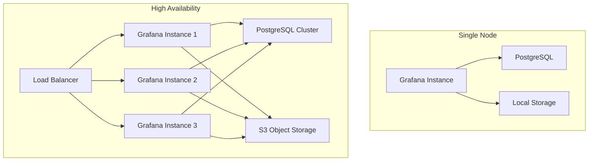

# Grafana Best Practices

**Objective**: Master production-grade Grafana deployment, configuration, and operations for enterprise observability. When you need to build reliable monitoring dashboards, when you want to scale observability across teams, when you're responsible for keeping the lights on at 3AM—Grafana best practices become your weapon of choice.

Grafana is not just a pretty dashboard tool. Treat it as production-critical software: upgrade it, provision it, secure it, observe it.

## 0) Prerequisites (Read Once, Live by Them)

### The Five Commandments

1. **Understand observability architecture**
   - Time-series data sources and query patterns
   - Dashboard design and performance optimization
   - Alerting and notification management
   - Security and access control models

2. **Master Grafana deployment patterns**
   - Container orchestration and scaling
   - Database and storage backend selection
   - High availability and disaster recovery
   - Performance tuning and resource management

3. **Know your data sources**
   - Prometheus metrics and query optimization
   - PostgreSQL/TimescaleDB time-series storage
   - Loki log aggregation and correlation
   - Tempo distributed tracing integration

4. **Validate everything**
   - Test dashboard performance under load
   - Verify alerting reliability and delivery
   - Check security configurations and access controls
   - Monitor Grafana's own health and performance

5. **Plan for production**
   - Design for scalability and fault tolerance
   - Enable comprehensive monitoring and alerting
   - Support multiple teams and use cases
   - Document operational procedures and runbooks

**Why These Principles**: Production Grafana requires understanding distributed systems, observability patterns, and operational excellence. Understanding these patterns prevents dashboard failures and enables reliable monitoring systems.

## 1) Installation & Upgrades

### Docker Compose Deployment

```yaml
# docker-compose.yml
version: "3.9"
services:
  grafana:
    image: grafana/grafana:10.4.0
    container_name: grafana
    ports:
      - "3000:3000"
    environment:
      - GF_SECURITY_ADMIN_PASSWORD=admin
      - GF_DATABASE_TYPE=postgres
      - GF_DATABASE_HOST=postgres:5432
      - GF_DATABASE_NAME=grafana
      - GF_DATABASE_USER=grafana
      - GF_DATABASE_PASSWORD=grafana
      - GF_DATABASE_SSL_MODE=disable
      - GF_SERVER_ROOT_URL=http://localhost:3000
      - GF_SECURITY_SECRET_KEY=your-secret-key-here
      - GF_USERS_ALLOW_SIGN_UP=false
      - GF_USERS_AUTO_ASSIGN_ORG=true
      - GF_USERS_AUTO_ASSIGN_ORG_ROLE=Viewer
      - GF_AUTH_ANONYMOUS_ENABLED=false
      - GF_ANALYTICS_REPORTING_ENABLED=false
      - GF_ANALYTICS_CHECK_FOR_UPDATES=false
    volumes:
      - grafana_data:/var/lib/grafana
      - ./provisioning:/etc/grafana/provisioning
      - ./dashboards:/var/lib/grafana/dashboards
    depends_on:
      - postgres
    restart: unless-stopped
    healthcheck:
      test: ["CMD-SHELL", "curl -f http://localhost:3000/api/health || exit 1"]
      interval: 30s
      timeout: 10s
      retries: 3

  postgres:
    image: postgres:15-alpine
    container_name: grafana-postgres
    environment:
      - POSTGRES_DB=grafana
      - POSTGRES_USER=grafana
      - POSTGRES_PASSWORD=grafana
    volumes:
      - postgres_data:/var/lib/postgresql/data
    restart: unless-stopped

  prometheus:
    image: prom/prometheus:latest
    container_name: prometheus
    ports:
      - "9090:9090"
    volumes:
      - ./prometheus.yml:/etc/prometheus/prometheus.yml
    command:
      - '--config.file=/etc/prometheus/prometheus.yml'
      - '--storage.tsdb.path=/prometheus'
      - '--web.console.libraries=/etc/prometheus/console_libraries'
      - '--web.console.templates=/etc/prometheus/consoles'
      - '--web.enable-lifecycle'
    restart: unless-stopped

volumes:
  grafana_data:
  postgres_data:
```

**Why Docker Compose Matters**: Containerized deployment enables consistent environments and easy scaling. Understanding these patterns prevents deployment issues and enables reliable Grafana operations.

### Helm Chart for Kubernetes

```yaml
# grafana-values.yaml
grafana:
  enabled: true
  image:
    repository: grafana/grafana
    tag: "10.4.0"
    pullPolicy: IfNotPresent
  
  adminPassword: "admin"
  
  persistence:
    enabled: true
    storageClassName: "fast-ssd"
    size: 10Gi
  
  database:
    type: postgres
    host: "postgresql:5432"
    name: "grafana"
    user: "grafana"
    password: "grafana"
  
  grafana.ini:
    server:
      root_url: "https://grafana.yourdomain.com"
    security:
      secret_key: "your-secret-key-here"
      admin_password: "admin"
    users:
      allow_sign_up: false
      auto_assign_org: true
      auto_assign_org_role: "Viewer"
    auth.anonymous:
      enabled: false
    analytics:
      reporting_enabled: false
      check_for_updates: false
  
  service:
    type: ClusterIP
    port: 80
  
  ingress:
    enabled: true
    annotations:
      kubernetes.io/ingress.class: nginx
      cert-manager.io/cluster-issuer: letsencrypt-prod
    hosts:
      - grafana.yourdomain.com
    tls:
      - secretName: grafana-tls
        hosts:
          - grafana.yourdomain.com
  
  resources:
    limits:
      cpu: 1000m
      memory: 1Gi
    requests:
      cpu: 500m
      memory: 512Mi
  
  nodeSelector:
    node-type: monitoring
  
  tolerations:
    - key: node-type
      operator: Equal
      value: monitoring
      effect: NoSchedule
```

**Why Helm Charts Matter**: Kubernetes-native deployment enables enterprise scaling and management. Understanding these patterns prevents orchestration issues and enables reliable cloud-native operations.

### Upgrade Strategy

```bash
# Staging upgrade process
#!/bin/bash
set -e

# 1. Backup current state
kubectl exec -n monitoring grafana-0 -- pg_dump -h postgresql -U grafana grafana > grafana-backup-$(date +%Y%m%d).sql

# 2. Test upgrade in staging
helm upgrade grafana grafana/grafana \
  --namespace monitoring \
  --values grafana-values.yaml \
  --set image.tag="10.4.0" \
  --dry-run

# 3. Apply upgrade
helm upgrade grafana grafana/grafana \
  --namespace monitoring \
  --values grafana-values.yaml \
  --set image.tag="10.4.0"

# 4. Verify health
kubectl wait --for=condition=ready pod -l app.kubernetes.io/name=grafana -n monitoring --timeout=300s

# 5. Run smoke tests
curl -f http://grafana.yourdomain.com/api/health
```

**Why Upgrade Strategy Matters**: Systematic upgrades prevent service disruptions and data loss. Understanding these patterns prevents upgrade failures and enables reliable Grafana operations.

## 2) Data Sources & Connections

### PostgreSQL/TimescaleDB Configuration

```yaml
# provisioning/datasources/postgres.yml
apiVersion: 1

datasources:
  - name: PostgreSQL
    type: postgres
    url: postgres:5432
    database: metrics
    user: grafana
    secureJsonData:
      password: "your-password"
    jsonData:
      sslmode: "disable"
      maxOpenConns: 5
      maxIdleConns: 2
      connMaxLifetime: 14400
      postgresVersion: 1500
      timescaledb: true
    isDefault: false
    editable: true
```

### Prometheus Configuration

```yaml
# provisioning/datasources/prometheus.yml
apiVersion: 1

datasources:
  - name: Prometheus
    type: prometheus
    url: http://prometheus:9090
    access: proxy
    isDefault: true
    jsonData:
      httpMethod: POST
      queryTimeout: 60s
      timeInterval: 15s
      manageAlerts: true
      alertmanagerUid: alertmanager
    editable: true
```

### Loki Configuration

```yaml
# provisioning/datasources/loki.yml
apiVersion: 1

datasources:
  - name: Loki
    type: loki
    url: http://loki:3100
    access: proxy
    jsonData:
      maxLines: 1000
      derivedFields:
        - datasourceUid: tempo
          matcherRegex: "traceID=(\\w+)"
          name: TraceID
          url: "$${__value.raw}"
    editable: true
```

### Tempo Configuration

```yaml
# provisioning/datasources/tempo.yml
apiVersion: 1

datasources:
  - name: Tempo
    type: tempo
    url: http://tempo:3200
    access: proxy
    jsonData:
      tracesToLogs:
        datasourceUid: loki
        tags: ['job', 'instance', 'pod', 'namespace']
        mappedTags: [{ key: 'service.name', value: 'service' }]
        mapTagNamesEnabled: false
        spanStartTimeShift: '-1h'
        spanEndTimeShift: '1h'
        filterByTraceID: false
        filterBySpanID: false
      tracesToMetrics:
        datasourceUid: prometheus
        tags: [{ key: 'service.name', value: 'service' }, { key: 'job' }]
        queries:
          - name: 'Sample query'
            query: 'sum(rate(traces_spanmetrics_latency_bucket{$$__tags}[5m]))'
      serviceMap:
        datasourceUid: prometheus
      search:
        hide: false
      nodeGraph:
        enabled: true
    editable: true
```

**Why Data Source Configuration Matters**: Proper data source setup enables reliable querying and performance. Understanding these patterns prevents connection issues and enables efficient observability.

## 3) Dashboard Management

### Dashboard Provisioning

```yaml
# provisioning/dashboards/dashboards.yml
apiVersion: 1

providers:
  - name: 'default'
    orgId: 1
    folder: ''
    type: file
    disableDeletion: false
    updateIntervalSeconds: 10
    allowUiUpdates: true
    options:
      path: /var/lib/grafana/dashboards
```

### Dashboard JSON Structure

```json
{
  "annotations": {
    "list": [
      {
        "builtIn": 1,
        "datasource": {
          "type": "grafana",
          "uid": "-- Grafana --"
        },
        "enable": true,
        "hide": true,
        "iconColor": "rgba(0, 211, 255, 1)",
        "name": "Annotations & Alerts",
        "type": "dashboard"
      }
    ]
  },
  "editable": true,
  "fiscalYearStartMonth": 0,
  "graphTooltip": 0,
  "id": null,
  "links": [],
  "liveNow": false,
  "panels": [
    {
      "datasource": {
        "type": "prometheus",
        "uid": "prometheus"
      },
      "fieldConfig": {
        "defaults": {
          "color": {
            "mode": "palette-classic"
          },
          "custom": {
            "axisLabel": "",
            "axisPlacement": "auto",
            "barAlignment": 0,
            "drawStyle": "line",
            "fillOpacity": 10,
            "gradientMode": "none",
            "hideFrom": {
              "legend": false,
              "tooltip": false,
              "vis": false
            },
            "lineInterpolation": "linear",
            "lineWidth": 1,
            "pointSize": 5,
            "scaleDistribution": {
              "type": "linear"
            },
            "showPoints": "never",
            "spanNulls": false,
            "stacking": {
              "group": "A",
              "mode": "none"
            },
            "thresholdsStyle": {
              "mode": "off"
            }
          },
          "mappings": [],
          "thresholds": {
            "mode": "absolute",
            "steps": [
              {
                "color": "green",
                "value": null
              },
              {
                "color": "red",
                "value": 80
              }
            ]
          },
          "unit": "short"
        },
        "overrides": []
      },
      "gridPos": {
        "h": 8,
        "w": 12,
        "x": 0,
        "y": 0
      },
      "id": 1,
      "options": {
        "legend": {
          "calcs": [],
          "displayMode": "list",
          "placement": "bottom"
        },
        "tooltip": {
          "mode": "single",
          "sort": "none"
        }
      },
      "targets": [
        {
          "datasource": {
            "type": "prometheus",
            "uid": "prometheus"
          },
          "editorMode": "code",
          "expr": "up",
          "instant": false,
          "range": true,
          "refId": "A"
        }
      ],
      "title": "Panel Title",
      "type": "timeseries"
    }
  ],
  "refresh": "5s",
  "schemaVersion": 38,
  "style": "dark",
  "tags": ["monitoring"],
  "templating": {
    "list": []
  },
  "time": {
    "from": "now-1h",
    "to": "now"
  },
  "timepicker": {},
  "timezone": "",
  "title": "Dashboard Title",
  "uid": "dashboard-uid",
  "version": 1,
  "weekStart": ""
}
```

### Folder Organization

```yaml
# provisioning/dashboards/folders.yml
apiVersion: 1

folders:
  - name: "Infrastructure"
    uid: "infrastructure"
  - name: "Applications"
    uid: "applications"
  - name: "Security"
    uid: "security"
  - name: "Business Metrics"
    uid: "business"
```

**Why Dashboard Management Matters**: Organized dashboards enable efficient monitoring and team collaboration. Understanding these patterns prevents dashboard chaos and enables reliable observability.

## 4) Plugins & Extensions

### Plugin Management

```bash
# Install plugins via grafana-cli
grafana-cli plugins install grafana-piechart-panel
grafana-cli plugins install grafana-worldmap-panel
grafana-cli plugins install grafana-clock-panel
grafana-cli plugins install grafana-simple-json-datasource

# List installed plugins
grafana-cli plugins list-remote

# Update plugins
grafana-cli plugins update-all
```

### Custom Plugin Development

```typescript
// Custom panel plugin structure
import { PanelPlugin } from '@grafana/data';
import { SimpleOptions } from './types';
import { SimplePanel } from './SimplePanel';

export const plugin = new PanelPlugin<SimpleOptions>(SimplePanel)
  .setPanelOptions(builder => {
    return builder
      .addTextInput({
        path: 'text',
        name: 'Text',
        description: 'Text to display',
        defaultValue: 'Hello World',
      })
      .addBooleanSwitch({
        path: 'showSeriesCount',
        name: 'Show series count',
        description: 'Show series count on the panel',
        defaultValue: false,
      });
  });
```

### Plugin Security

```yaml
# grafana.ini security settings
[plugins]
allow_loading_unsigned_plugins = false
plugin_admin_enabled = true
plugin_admin_external_manage_enabled = true

[security]
disable_gravatar = true
cookie_secure = true
cookie_samesite = strict
strict_transport_security = true
content_security_policy = true
```

**Why Plugin Management Matters**: Proper plugin handling ensures security and functionality. Understanding these patterns prevents security vulnerabilities and enables reliable plugin operations.

## 5) Security & Access Control

### OAuth/OpenID Connect Configuration

```yaml
# grafana.ini OAuth settings
[auth.generic_oauth]
enabled = true
name = GitHub
allow_sign_up = true
client_id = your-client-id
client_secret = your-client-secret
scopes = user:email
auth_url = https://github.com/login/oauth/authorize
token_url = https://github.com/login/oauth/access_token
api_url = https://api.github.com/user
team_ids = 123456,789012
team_ids_attribute = teams
role_attribute_path = contains(groups[*], 'admin') && 'Admin' || contains(groups[*], 'editor') && 'Editor' || 'Viewer'
```

### Role-Based Access Control

```yaml
# provisioning/access-control/roles.yml
apiVersion: 1

roles:
  - name: "Admin"
    description: "Full access to all resources"
    permissions:
      - action: "org.users:read"
      - action: "org.users:write"
      - action: "org.users:delete"
      - action: "dashboards:read"
      - action: "dashboards:write"
      - action: "dashboards:delete"
      - action: "datasources:read"
      - action: "datasources:write"
      - action: "datasources:delete"
      - action: "alerting:read"
      - action: "alerting:write"
      - action: "alerting:delete"
  
  - name: "Editor"
    description: "Can create and edit dashboards"
    permissions:
      - action: "dashboards:read"
      - action: "dashboards:write"
      - action: "datasources:read"
      - action: "alerting:read"
      - action: "alerting:write"
  
  - name: "Viewer"
    description: "Read-only access"
    permissions:
      - action: "dashboards:read"
      - action: "datasources:read"
      - action: "alerting:read"
```

### Team and Organization Management

```yaml
# provisioning/teams/teams.yml
apiVersion: 1

teams:
  - name: "SRE Team"
    orgId: 1
    email: "sre@company.com"
    members:
      - "user1@company.com"
      - "user2@company.com"
    permissions:
      - action: "dashboards:read"
        scope: "dashboards:uid:infrastructure"
      - action: "dashboards:write"
        scope: "dashboards:uid:infrastructure"
  
  - name: "Development Team"
    orgId: 1
    email: "dev@company.com"
    members:
      - "dev1@company.com"
      - "dev2@company.com"
    permissions:
      - action: "dashboards:read"
        scope: "dashboards:uid:applications"
      - action: "dashboards:write"
        scope: "dashboards:uid:applications"
```

**Why Security Matters**: Proper access control prevents unauthorized access and data breaches. Understanding these patterns prevents security vulnerabilities and enables reliable access management.

## 6) Performance Tuning

### Query Optimization

```yaml
# grafana.ini performance settings
[server]
http_port = 3000
http_addr = 0.0.0.0
root_url = https://grafana.yourdomain.com
serve_from_sub_path = false

[database]
type = postgres
host = postgres:5432
name = grafana
user = grafana
password = grafana
ssl_mode = disable
max_open_conn = 0
max_idle_conn = 2
conn_max_lifetime = 14400

[log]
mode = console
level = info
filters = grafana:debug

[quota]
enabled = true
global_dashboard_count = 1000
global_user_count = 1000
global_org_count = 1000
global_api_key_count = 1000
global_session_count = 1000
global_alert_rule_count = 1000
global_file_upload_count = 1000
global_data_source_count = 1000
global_transformation_count = 1000
global_correlations_count = 1000
```

### Caching Configuration

```yaml
# grafana.ini caching settings
[cache]
enabled = true
backend = redis
backend_config = addr=redis:6379,pool_size=100,db=0,ssl=false

[redis]
addr = redis:6379
pool_size = 100
db = 0
ssl = false
```

### Recording Rules

```yaml
# prometheus-recording-rules.yml
groups:
  - name: grafana.rules
    rules:
      - record: grafana:panel_load_time:rate5m
        expr: rate(grafana_panel_load_time_seconds_sum[5m]) / rate(grafana_panel_load_time_seconds_count[5m])
      
      - record: grafana:query_duration:rate5m
        expr: rate(grafana_query_duration_seconds_sum[5m]) / rate(grafana_query_duration_seconds_count[5m])
      
      - record: grafana:active_users:rate5m
        expr: rate(grafana_active_users_total[5m])
```

**Why Performance Tuning Matters**: Optimized performance prevents dashboard slowdowns and user frustration. Understanding these patterns prevents performance bottlenecks and enables reliable monitoring.

## 7) Observability of Grafana Itself

### Metrics Endpoint Configuration

```yaml
# grafana.ini metrics settings
[metrics]
enabled = true
interval_seconds = 10
disable_total_stats = false
disable_alerting_stats = false
disable_usage_stats = false
```

### Prometheus Scraping

```yaml
# prometheus.yml
global:
  scrape_interval: 15s
  evaluation_interval: 15s

scrape_configs:
  - job_name: 'grafana'
    static_configs:
      - targets: ['grafana:3000']
    metrics_path: '/metrics'
    scrape_interval: 15s
```

### Grafana Agent Configuration

```yaml
# grafana-agent.yml
server:
  log_level: info
  http_listen_port: 12345

metrics:
  global:
    remote_write:
      - url: http://prometheus:9090/api/v1/write
  configs:
    - name: grafana
      scrape_configs:
        - job_name: grafana
          static_configs:
            - targets: ['grafana:3000']
          metrics_path: '/metrics'
          scrape_interval: 15s
```

### Alerting Rules

```yaml
# grafana-alerts.yml
groups:
  - name: grafana.rules
    rules:
      - alert: GrafanaHighErrorRate
        expr: rate(grafana_http_request_duration_seconds_count{status=~"5.."}[5m]) > 0.1
        for: 5m
        labels:
          severity: warning
        annotations:
          summary: "Grafana high error rate"
          description: "Grafana error rate is {{ $value }} errors per second"
      
      - alert: GrafanaSlowQueries
        expr: histogram_quantile(0.95, rate(grafana_query_duration_seconds_bucket[5m])) > 5
        for: 5m
        labels:
          severity: warning
        annotations:
          summary: "Grafana slow queries"
          description: "95th percentile query duration is {{ $value }} seconds"
```

**Why Self-Observability Matters**: Monitoring Grafana itself prevents blind spots and enables proactive issue resolution. Understanding these patterns prevents monitoring failures and enables reliable observability.

## 8) Scaling & High Availability

### Single Node vs HA Architecture



### HA Deployment Configuration

```yaml
# grafana-ha-values.yaml
grafana:
  enabled: true
  replicas: 3
  
  image:
    repository: grafana/grafana
    tag: "10.4.0"
  
  persistence:
    enabled: false  # Use external storage
  
  database:
    type: postgres
    host: "postgresql-cluster:5432"
    name: "grafana"
    user: "grafana"
    password: "grafana"
  
  grafana.ini:
    server:
      root_url: "https://grafana.yourdomain.com"
    database:
      type: postgres
      host: "postgresql-cluster:5432"
      name: "grafana"
      user: "grafana"
      password: "grafana"
    external_image_storage:
      provider: s3
      s3:
        bucket: "grafana-images"
        region: "us-west-2"
        access_key: "your-access-key"
        secret_key: "your-secret-key"
  
  service:
    type: ClusterIP
    port: 80
  
  ingress:
    enabled: true
    annotations:
      kubernetes.io/ingress.class: nginx
      nginx.ingress.kubernetes.io/affinity: "cookie"
      nginx.ingress.kubernetes.io/session-cookie-name: "grafana-session"
      nginx.ingress.kubernetes.io/session-cookie-hash: "sha1"
    hosts:
      - grafana.yourdomain.com
  
  resources:
    limits:
      cpu: 1000m
      memory: 1Gi
    requests:
      cpu: 500m
      memory: 512Mi
  
  nodeSelector:
    node-type: monitoring
  
  tolerations:
    - key: node-type
      operator: Equal
      value: monitoring
      effect: NoSchedule
```

### Horizontal Scaling

```yaml
# grafana-hpa.yaml
apiVersion: autoscaling/v2
kind: HorizontalPodAutoscaler
metadata:
  name: grafana-hpa
  namespace: monitoring
spec:
  scaleTargetRef:
    apiVersion: apps/v1
    kind: Deployment
    name: grafana
  minReplicas: 3
  maxReplicas: 10
  metrics:
  - type: Resource
    resource:
      name: cpu
      target:
        type: Utilization
        averageUtilization: 70
  - type: Resource
    resource:
      name: memory
      target:
        type: Utilization
        averageUtilization: 80
```

**Why Scaling Matters**: Proper scaling enables reliable service under load. Understanding these patterns prevents performance issues and enables enterprise-grade operations.

## 9) Cutting-Edge Features

### Unified Alerting System

```yaml
# provisioning/alerting/contactpoints.yml
apiVersion: 1

contactPoints:
  - name: "default-email"
    type: "email"
    settings:
      addresses: "alerts@company.com"
      subject: "Grafana Alert: {{ .GroupLabels.alertname }}"
      message: "{{ range .Alerts }}{{ .Annotations.summary }}{{ end }}"
  
  - name: "slack-alerts"
    type: "slack"
    settings:
      url: "https://hooks.slack.com/services/YOUR/SLACK/WEBHOOK"
      title: "Grafana Alert"
      text: "{{ range .Alerts }}{{ .Annotations.summary }}{{ end }}"
  
  - name: "pagerduty"
    type: "pagerduty"
    settings:
      integrationKey: "your-pagerduty-key"
      severity: "critical"
      summary: "{{ range .Alerts }}{{ .Annotations.summary }}{{ end }}"
```

### Grafana Scenes

```typescript
// scenes/dashboard-scene.ts
import { SceneFlexLayout, SceneFlexItem, SceneQueryRunner, VizPanel } from '@grafana/scenes';
import { PrometheusQuery } from '@grafana/prometheus';

export function createDashboardScene() {
  return new SceneFlexLayout({
    children: [
      new SceneFlexItem({
        body: new VizPanel({
          pluginId: 'timeseries',
          title: 'CPU Usage',
          $data: new SceneQueryRunner({
            queries: [
              new PrometheusQuery({
                expr: 'rate(cpu_usage_seconds_total[5m])',
                refId: 'A',
              }),
            ],
          }),
        }),
      }),
    ],
  });
}
```

### JSON-Based Declarative Dashboards

```json
{
  "dashboard": {
    "title": "Infrastructure Overview",
    "uid": "infrastructure-overview",
    "tags": ["infrastructure", "monitoring"],
    "time": {
      "from": "now-1h",
      "to": "now"
    },
    "panels": [
      {
        "title": "System Load",
        "type": "timeseries",
        "targets": [
          {
            "expr": "system_load1",
            "refId": "A"
          }
        ],
        "gridPos": {
          "h": 8,
          "w": 12,
          "x": 0,
          "y": 0
        }
      }
    ]
  }
}
```

**Why Cutting-Edge Features Matter**: Modern features enable advanced observability and automation. Understanding these patterns prevents technical debt and enables innovative monitoring solutions.

## 10) TL;DR Runbook

### Essential Commands

```bash
# Deploy Grafana with HA
helm install grafana grafana/grafana -f grafana-ha-values.yaml

# Provision data sources
kubectl apply -f provisioning/datasources/

# Provision dashboards
kubectl apply -f provisioning/dashboards/

# Scale horizontally
kubectl apply -f grafana-hpa.yaml

# Monitor Grafana
curl -f http://grafana:3000/api/health
```

### Essential Patterns

```yaml
# Essential Grafana patterns
grafana_patterns:
  "ha_deployment": "Postgres + S3 for HA, stateless instances behind LB",
  "provisioning": "YAML/JSON for datasources, dashboards, and access control",
  "security": "OAuth/OIDC for auth, RBAC for permissions, no local admin",
  "observability": "Monitor Grafana with Prometheus, alert on performance",
  "scaling": "Horizontal scaling with HPA, external storage for persistence",
  "performance": "Recording rules, caching, query optimization for speed"
```

### Quick Reference

```yaml
# Essential Grafana operations
# 1. Deploy with HA
helm install grafana grafana/grafana -f grafana-ha-values.yaml

# 2. Provision data sources
kubectl apply -f provisioning/datasources/

# 3. Configure security
kubectl apply -f provisioning/access-control/

# 4. Monitor performance
kubectl apply -f grafana-alerts.yml

# 5. Scale horizontally
kubectl apply -f grafana-hpa.yaml
```

**Why This Runbook**: These patterns cover 90% of Grafana production needs. Master these before exploring advanced observability scenarios.

## 11) The Machine's Summary

Grafana requires understanding distributed systems, observability patterns, and operational excellence. When used correctly, Grafana enables reliable monitoring, alerting, and visualization. The key is understanding deployment patterns, mastering security configurations, and following performance best practices.

**The Dark Truth**: Without proper Grafana understanding, your monitoring remains blind to critical issues. Grafana is your weapon. Use it wisely.

**The Machine's Mantra**: "In the metrics we trust, in the dashboards we visualize, and in the alerts we find the path to reliable operations."

**Why This Matters**: Grafana enables efficient observability that can handle complex monitoring scenarios, maintain high performance, and provide immediate insights while ensuring system reliability and security.

---

*This guide provides the complete machinery for production Grafana operations. The patterns scale from simple dashboards to complex enterprise monitoring, from basic alerting to advanced observability platforms.*
