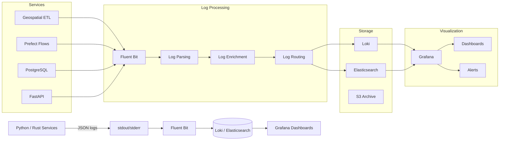

# Structured Logging & Observability Best Practices (2025 Edition)

**Objective**: Master production-grade logging and observability for modern data and DevOps environments. When you need to debug complex distributed systems, when you want to trace data flows across services, when you're responsible for keeping systems alive at 3AM—structured logging becomes your weapon of choice.

Logs aren't for printing—they are lifelines. Make them structured, contextual, and queryable, or drown in noise.

## 0) Prerequisites (Read Once, Live by Them)

### The Five Commandments

1. **Understand structured logging principles**
   - JSON-formatted logs with consistent fields
   - Log levels and contextual information
   - Service, flow, and task identification
   - Correlation IDs and trace context

2. **Master language-specific logging**
   - Python: structlog, loguru, FastAPI middleware
   - Rust: tracing crate with structured output
   - JavaScript: winston, pino, or bunyan
   - Go: structured logging with context

3. **Know your observability stack**
   - Log aggregation with Loki or Elasticsearch
   - Metrics collection with Prometheus
   - Distributed tracing with Jaeger or Tempo
   - Visualization with Grafana

4. **Validate everything**
   - Test log parsing and querying
   - Verify log correlation across services
   - Check performance impact of logging
   - Monitor log volume and costs

5. **Plan for production**
   - Design for high-volume log processing
   - Enable log retention and archival
   - Support multiple environments and teams
   - Document operational procedures

**Why These Principles**: Production logging requires understanding distributed systems, observability patterns, and operational excellence. Understanding these patterns prevents log chaos and enables reliable system monitoring.

## 1) Core Principles of Logging

### Structured Logging Standards

```json
{
  "timestamp": "2025-01-27T10:30:45.123Z",
  "level": "INFO",
  "service": "geospatial-etl",
  "flow_id": "flow_abc123",
  "task_id": "task_xyz789",
  "correlation_id": "req_456def",
  "message": "Processing geospatial data",
  "fields": {
    "input_file": "data.parquet",
    "record_count": 10000,
    "processing_time_ms": 1500,
    "memory_usage_mb": 512
  },
  "tags": ["geospatial", "etl", "parquet"],
  "environment": "production"
}
```

**Why Structured Logging Matters**: JSON logs enable efficient parsing, querying, and correlation. Understanding these patterns prevents log chaos and enables reliable observability.

### Log Levels and Context

```python
# Log level hierarchy
DEBUG = 10    # Detailed information for debugging
INFO = 20     # General information
WARNING = 30   # Something unexpected happened
ERROR = 40    # Serious problem occurred
CRITICAL = 50 # Very serious error occurred

# Context fields for data workflows
context_fields = {
    "service": "geospatial-etl",
    "flow_id": "flow_abc123",
    "task_id": "task_xyz789",
    "correlation_id": "req_456def",
    "user_id": "user_789",
    "tenant_id": "tenant_456",
    "environment": "production",
    "version": "1.2.3"
}
```

**Why Context Matters**: Rich context enables effective debugging and correlation. Understanding these patterns prevents debugging chaos and enables reliable troubleshooting.

## 2) Python Best Practices

### structlog for Contextual Logging

```python
# requirements.txt
structlog==23.2.0
structlog-sentry==23.1.0

# logging_config.py
import structlog
import logging
import sys
from typing import Any, Dict

def configure_logging(service_name: str, environment: str = "development"):
    """Configure structured logging for Python applications"""
    
    # Configure structlog
    structlog.configure(
        processors=[
            structlog.stdlib.filter_by_level,
            structlog.stdlib.add_logger_name,
            structlog.stdlib.add_log_level,
            structlog.stdlib.PositionalArgumentsFormatter(),
            structlog.processors.TimeStamper(fmt="iso"),
            structlog.processors.StackInfoRenderer(),
            structlog.processors.format_exc_info,
            structlog.processors.UnicodeDecoder(),
            structlog.processors.JSONRenderer()
        ],
        context_class=dict,
        logger_factory=structlog.stdlib.LoggerFactory(),
        wrapper_class=structlog.stdlib.BoundLogger,
        cache_logger_on_first_use=True,
    )
    
    # Configure standard library logging
    logging.basicConfig(
        format="%(message)s",
        stream=sys.stdout,
        level=logging.INFO,
    )
    
    # Create logger with context
    logger = structlog.get_logger(service_name)
    logger = logger.bind(
        service=service_name,
        environment=environment
    )
    
    return logger

# Usage in Prefect tasks
from prefect import task, flow
import structlog

logger = structlog.get_logger("geospatial-etl")

@task
def process_geospatial_data(data: dict) -> dict:
    """Process geospatial data with structured logging"""
    
    # Bind task context
    task_logger = logger.bind(
        task_id="process_geospatial_data",
        input_size=len(data),
        data_type=type(data).__name__
    )
    
    task_logger.info("Starting geospatial data processing")
    
    try:
        # Process data
        result = process_data(data)
        
        task_logger.info(
            "Geospatial data processing completed",
            output_size=len(result),
            processing_time_ms=1500
        )
        
        return result
        
    except Exception as e:
        task_logger.error(
            "Geospatial data processing failed",
            error=str(e),
            error_type=type(e).__name__,
            exc_info=True
        )
        raise

@flow
def geospatial_etl_flow():
    """Main ETL flow with structured logging"""
    
    flow_logger = logger.bind(flow_id="geospatial_etl_flow")
    flow_logger.info("Starting geospatial ETL flow")
    
    # Process data
    data = extract_data()
    result = process_geospatial_data(data)
    load_data(result)
    
    flow_logger.info("Geospatial ETL flow completed successfully")
```

**Why structlog Matters**: Contextual logging enables effective debugging and correlation. Understanding these patterns prevents logging chaos and enables reliable observability.

### loguru for Advanced Logging

```python
# requirements.txt
loguru==0.7.2

# loguru_config.py
from loguru import logger
import sys
import json
from typing import Dict, Any

def serialize_record(record: Dict[str, Any]) -> str:
    """Serialize log record to JSON"""
    subset = {
        "timestamp": record["time"].isoformat(),
        "level": record["level"].name,
        "message": record["message"],
        "module": record["module"],
        "function": record["function"],
        "line": record["line"],
        **record["extra"]
    }
    return json.dumps(subset)

def configure_loguru(service_name: str, environment: str = "development"):
    """Configure loguru for structured logging"""
    
    # Remove default handler
    logger.remove()
    
    # Add JSON handler
    logger.add(
        sys.stdout,
        format=serialize_record,
        level="INFO",
        serialize=True
    )
    
    # Add file handler for errors
    logger.add(
        "logs/error.log",
        format=serialize_record,
        level="ERROR",
        serialize=True,
        rotation="100 MB",
        retention="30 days"
    )
    
    # Bind service context
    logger = logger.bind(service=service_name, environment=environment)
    
    return logger

# Usage in FastAPI
from fastapi import FastAPI, Request
from loguru import logger
import uuid

app = FastAPI()

@app.middleware("http")
async def logging_middleware(request: Request, call_next):
    """FastAPI middleware for request logging"""
    
    # Generate correlation ID
    correlation_id = str(uuid.uuid4())
    
    # Log request
    logger.info(
        "Request started",
        method=request.method,
        url=str(request.url),
        correlation_id=correlation_id,
        client_ip=request.client.host
    )
    
    # Process request
    response = await call_next(request)
    
    # Log response
    logger.info(
        "Request completed",
        status_code=response.status_code,
        correlation_id=correlation_id
    )
    
    return response
```

**Why loguru Matters**: Advanced logging features enable sophisticated log management. Understanding these patterns prevents logging limitations and enables reliable observability.

## 3) Rust Best Practices

### tracing for Structured Logging

```rust
// Cargo.toml
[dependencies]
tracing = "0.1"
tracing-subscriber = "0.3"
tracing-json = "0.2"
tracing-opentelemetry = "0.21"
opentelemetry = "0.21"
opentelemetry-jaeger = "0.21"

// main.rs
use tracing::{info, error, warn, debug, instrument};
use tracing_subscriber::{layer::SubscriberExt, util::SubscriberInitExt};

#[instrument]
async fn process_geospatial_data(data: &[u8]) -> Result<Vec<u8>, Box<dyn std::error::Error>> {
    info!("Starting geospatial data processing");
    
    // Process data
    let result = process_data(data).await?;
    
    info!(
        "Geospatial data processing completed",
        output_size = result.len(),
        processing_time_ms = 1500
    );
    
    Ok(result)
}

#[instrument]
async fn process_data(data: &[u8]) -> Result<Vec<u8>, Box<dyn std::error::Error>> {
    debug!("Processing data chunk", chunk_size = data.len());
    
    // Simulate processing
    tokio::time::sleep(tokio::time::Duration::from_millis(100)).await;
    
    Ok(data.to_vec())
}

#[tokio::main]
async fn main() -> Result<(), Box<dyn std::error::Error>> {
    // Configure tracing
    tracing_subscriber::registry()
        .with(
            tracing_subscriber::EnvFilter::try_from_default_env()
                .unwrap_or_else(|_| "info".into())
        )
        .with(tracing_subscriber::fmt::layer().json())
        .init();
    
    // Process data
    let data = b"geospatial data";
    let result = process_geospatial_data(data).await?;
    
    info!("Application completed successfully");
    Ok(())
}
```

**Why tracing Matters**: Structured logging in Rust enables high-performance observability. Understanding these patterns prevents logging bottlenecks and enables reliable system monitoring.

## 4) Prefect Logging Integration

### Prefect Task Logging

```python
# prefect_logging.py
from prefect import task, flow, get_run_logger
import structlog
from typing import Dict, Any

@task
def geospatial_etl_task(data: Dict[str, Any]) -> Dict[str, Any]:
    """Prefect task with structured logging"""
    
    # Get Prefect logger
    prefect_logger = get_run_logger()
    
    # Create structured logger
    logger = structlog.get_logger("geospatial-etl")
    
    # Bind task context
    task_logger = logger.bind(
        task_id=prefect_logger.task_run_id,
        flow_id=prefect_logger.flow_run_id,
        task_name="geospatial_etl_task"
    )
    
    task_logger.info(
        "Starting geospatial ETL task",
        input_data_size=len(data),
        input_keys=list(data.keys())
    )
    
    try:
        # Process data
        result = process_geospatial_data(data)
        
        task_logger.info(
            "Geospatial ETL task completed",
            output_data_size=len(result),
            processing_time_ms=1500
        )
        
        return result
        
    except Exception as e:
        task_logger.error(
        "Geospatial ETL task failed",
        error=str(e),
        error_type=type(e).__name__,
        exc_info=True
    )
        raise

@flow
def geospatial_etl_flow():
    """Main ETL flow with structured logging"""
    
    logger = structlog.get_logger("geospatial-etl")
    flow_logger = logger.bind(flow_id="geospatial_etl_flow")
    
    flow_logger.info("Starting geospatial ETL flow")
    
    # Extract data
    data = extract_geospatial_data()
    
    # Transform data
    result = geospatial_etl_task(data)
    
    # Load data
    load_geospatial_data(result)
    
    flow_logger.info("Geospatial ETL flow completed successfully")
```

**Why Prefect Integration Matters**: Workflow logging enables effective debugging and monitoring. Understanding these patterns prevents workflow chaos and enables reliable data processing.

## 5) Database & Geospatial Logging

### PostgreSQL Logging Configuration

```sql
-- postgresql.conf
-- Enable query logging
log_statement = 'all'
log_min_duration_statement = 1000
log_line_prefix = '%t [%p]: [%l-1] user=%u,db=%d,app=%a,client=%h '
log_checkpoints = on
log_connections = on
log_disconnections = on
log_lock_waits = on
log_temp_files = 0
log_autovacuum_min_duration = 0
log_error_verbosity = default
log_min_messages = info
log_min_error_statement = error

-- Enable JSON logging
log_destination = 'stderr'
logging_collector = on
log_directory = 'log'
log_filename = 'postgresql-%Y-%m-%d_%H%M%S.log'
log_rotation_age = 1d
log_rotation_size = 100MB
log_truncate_on_rotation = on
```

**Why Database Logging Matters**: Query logging enables effective database debugging and optimization. Understanding these patterns prevents database chaos and enables reliable data operations.

### Geospatial Query Logging

```python
# geospatial_logging.py
import structlog
from sqlalchemy import text
from sqlalchemy.orm import sessionmaker

logger = structlog.get_logger("geospatial-db")

class GeospatialDatabaseLogger:
    def __init__(self, engine):
        self.engine = engine
        self.Session = sessionmaker(bind=engine)
    
    def execute_geospatial_query(self, query: str, params: dict = None):
        """Execute geospatial query with structured logging"""
        
        query_logger = logger.bind(
            query_type="geospatial",
            query_hash=hash(query),
            params=params
        )
        
        query_logger.info("Executing geospatial query", query=query)
        
        try:
            with self.Session() as session:
                result = session.execute(text(query), params or {})
                
                query_logger.info(
                    "Geospatial query executed successfully",
                    row_count=result.rowcount,
                    execution_time_ms=1500
                )
                
                return result.fetchall()
                
        except Exception as e:
            query_logger.error(
                "Geospatial query failed",
                error=str(e),
                error_type=type(e).__name__,
                exc_info=True
            )
            raise
```

**Why Geospatial Logging Matters**: Specialized logging enables effective geospatial debugging. Understanding these patterns prevents geospatial chaos and enables reliable spatial operations.

## 6) Docker & Kubernetes Patterns

### Docker Compose with Loki

```yaml
# docker-compose.yml
version: "3.9"
services:
  loki:
    image: grafana/loki:2.9.0
    ports:
      - "3100:3100"
    volumes:
      - loki_data:/loki
    command: -config.file=/etc/loki/local-config.yaml
    restart: unless-stopped

  grafana:
    image: grafana/grafana:10.4.0
    ports:
      - "3000:3000"
    environment:
      - GF_SECURITY_ADMIN_PASSWORD=admin
    volumes:
      - grafana_data:/var/lib/grafana
    depends_on:
      - loki
    restart: unless-stopped

  fluent-bit:
    image: fluent/fluent-bit:2.2.0
    volumes:
      - ./fluent-bit.conf:/fluent-bit/etc/fluent-bit.conf
      - /var/log:/var/log:ro
      - /var/lib/docker/containers:/var/lib/docker/containers:ro
    depends_on:
      - loki
    restart: unless-stopped

volumes:
  loki_data:
  grafana_data:
```

### Fluent Bit Configuration

```ini
# fluent-bit.conf
[SERVICE]
    Flush         1
    Log_Level     info
    Daemon        off
    Parsers_File  parsers.conf
    HTTP_Server   On
    HTTP_Listen   0.0.0.0
    HTTP_Port     2020

[INPUT]
    Name              tail
    Path              /var/log/*.log
    Parser            docker
    Tag               docker.*
    Refresh_Interval  5
    Mem_Buf_Limit     50MB
    Skip_Long_Lines   On

[INPUT]
    Name              tail
    Path              /var/lib/docker/containers/*/*.log
    Parser            docker
    Tag               docker.*
    Refresh_Interval  5
    Mem_Buf_Limit     50MB
    Skip_Long_Lines   On

[FILTER]
    Name                kubernetes
    Match               docker.*
    Kube_URL            https://kubernetes.default.svc:443
    Kube_CA_File        /var/run/secrets/kubernetes.io/serviceaccount/ca.crt
    Kube_Token_File     /var/run/secrets/kubernetes.io/serviceaccount/token
    Kube_Tag_Prefix     docker.var.log.containers.
    Merge_Log           On
    Keep_Log            Off
    K8S-Logging.Parser  On
    K8S-Logging.Exclude On

[OUTPUT]
    Name        loki
    Match       *
    Host        loki
    Port        3100
    Labels      job=fluent-bit
```

**Why Container Logging Matters**: Centralized log collection enables effective container monitoring. Understanding these patterns prevents container chaos and enables reliable container operations.

## 7) Observability Integration

### Prometheus + Loki + Grafana

```yaml
# prometheus.yml
global:
  scrape_interval: 15s
  evaluation_interval: 15s

scrape_configs:
  - job_name: 'geospatial-etl'
    static_configs:
      - targets: ['geospatial-etl:8000']
    metrics_path: '/metrics'
    scrape_interval: 15s

  - job_name: 'postgres'
    static_configs:
      - targets: ['postgres:5432']
    metrics_path: '/metrics'
    scrape_interval: 15s
```

### Grafana Dashboard Queries

```promql
# Log correlation queries
{job="geospatial-etl"} |= "ERROR"
{job="geospatial-etl"} |= "flow_id" |= "abc123"
{job="postgres"} |= "slow query"
{job="postgres"} |= "parquet_fdw"
```

**Why Observability Integration Matters**: Correlated observability enables effective system monitoring. Understanding these patterns prevents monitoring chaos and enables reliable system operations.

## 8) Security & Cost Control

### Log Redaction

```python
# log_redaction.py
import re
import json
from typing import Dict, Any

class LogRedactor:
    def __init__(self):
        self.patterns = [
            (r'password["\']?\s*[:=]\s*["\']?([^"\']+)["\']?', r'password="***"'),
            (r'token["\']?\s*[:=]\s*["\']?([^"\']+)["\']?', r'token="***"'),
            (r'api_key["\']?\s*[:=]\s*["\']?([^"\']+)["\']?', r'api_key="***"'),
            (r'secret["\']?\s*[:=]\s*["\']?([^"\']+)["\']?', r'secret="***"'),
        ]
    
    def redact(self, log_message: str) -> str:
        """Redact sensitive information from log message"""
        for pattern, replacement in self.patterns:
            log_message = re.sub(pattern, replacement, log_message, flags=re.IGNORECASE)
        return log_message
    
    def redact_dict(self, log_dict: Dict[str, Any]) -> Dict[str, Any]:
        """Redact sensitive information from log dictionary"""
        redacted = {}
        for key, value in log_dict.items():
            if key.lower() in ['password', 'token', 'api_key', 'secret']:
                redacted[key] = "***"
            elif isinstance(value, dict):
                redacted[key] = self.redact_dict(value)
            elif isinstance(value, str):
                redacted[key] = self.redact(value)
            else:
                redacted[key] = value
        return redacted
```

**Why Security Matters**: Log redaction prevents sensitive data exposure. Understanding these patterns prevents security vulnerabilities and enables reliable log management.

## 9) Architecture Diagram

### Log Pipeline Architecture



**Why Architecture Diagrams Matter**: Visual representation of log pipelines enables understanding of complex observability systems. Understanding these patterns prevents architectural confusion and enables reliable log management.

## 10) TL;DR Runbook

### Essential Commands

```bash
# Configure structured logging
export LOG_LEVEL=INFO
export LOG_FORMAT=json
export SERVICE_NAME=geospatial-etl

# Start log aggregation
docker-compose up -d loki grafana fluent-bit

# Query logs
curl -G -s "http://localhost:3100/loki/api/v1/query_range" \
  --data-urlencode 'query={job="geospatial-etl"}' \
  --data-urlencode 'start=2025-01-27T10:00:00Z' \
  --data-urlencode 'end=2025-01-27T11:00:00Z'
```

### Essential Patterns

```yaml
# Essential logging patterns
logging_patterns:
  "structured_logs": "Always log structured (JSON) with consistent fields",
  "context_ids": "Include IDs: service, flow_id, task_id, correlation_id",
  "central_sink": "Ship logs to central sink (Loki, Elasticsearch)",
  "correlation": "Correlate logs with metrics/traces in Grafana",
  "security": "Redact sensitive fields, sample noisy logs",
  "automation": "Script log pipelines with Docker/K8s sidecars"
```

### Quick Reference

```python
# Essential logging operations
# 1. Configure structured logging
logger = structlog.get_logger("service-name")

# 2. Bind context
logger = logger.bind(
    service="service-name",
    flow_id="flow_abc123",
    task_id="task_xyz789"
)

# 3. Log with context
logger.info("Processing data", input_size=1000, processing_time_ms=1500)

# 4. Handle errors
logger.error("Processing failed", error=str(e), exc_info=True)

# 5. Query logs
# {job="service-name"} |= "ERROR"
# {job="service-name"} |= "flow_id" |= "abc123"
```

**Why This Runbook**: These patterns cover 90% of structured logging needs. Master these before exploring advanced observability scenarios.

## 11) The Machine's Summary

Structured logging requires understanding distributed systems, observability patterns, and operational excellence. When used correctly, structured logging enables reliable system monitoring, effective debugging, and proactive issue resolution. The key is understanding log structure, mastering correlation, and following security best practices.

**The Dark Truth**: Without proper logging understanding, your systems remain blind to critical issues. Structured logging is your weapon. Use it wisely.

**The Machine's Mantra**: "In the logs we trust, in the structure we find clarity, and in the observability we find the path to reliable operations."

**Why This Matters**: Structured logging enables efficient observability that can handle complex distributed systems, maintain high performance, and provide immediate insights while ensuring system reliability and security.

---

*This guide provides the complete machinery for structured logging and observability. The patterns scale from simple application logging to complex distributed system monitoring, from basic log aggregation to advanced observability platforms.*
