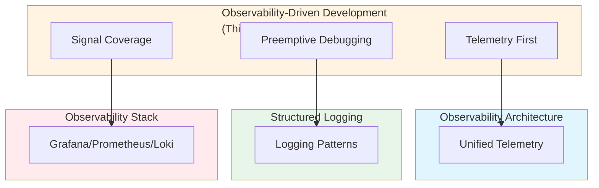

# Observability-Driven Development (ODD), Telemetry-First Coding Practices, and Preemptive Debugging Architecture: Best Practices

**Objective**: Establish comprehensive observability-driven development practices that embed telemetry, logging, tracing, and metrics as first-class design inputs from day one. When you need observability-first design, when you want preemptive debugging, when you need telemetry standards—this guide provides the complete framework.

## Introduction

Observability-driven development is the foundation of debuggable, maintainable systems. Without telemetry-first practices, systems become black boxes, debugging becomes reactive, and incidents become mysteries. This guide establishes patterns for ODD, telemetry-first coding, and preemptive debugging architecture.

**What This Guide Covers**:
- Principles of ODD (logging, tracing, metrics from day 1)
- Instrumentation standards for Python, Go, Rust
- Telemetry review in code review
- Local tracing stacks vs cluster tracing stacks
- Observability scaffolds for new repos
- Datasets + geospatial pipelines observability patterns
- Golden-path guideline: "no unobservable code paths"
- Signal coverage and trace completeness

**Prerequisites**:
- Understanding of observability and telemetry
- Familiarity with logging, tracing, and metrics
- Experience with debugging and incident response

**Related Documents**:
This document integrates with:
- **[Observability as Architecture: Unified Telemetry Models Across Clusters, Services, and Languages](unified-observability-architecture.md)** - Observability architecture
- **[Structured Logging & Observability](logging-observability.md)** - Logging patterns
- **[Grafana, Prometheus, Loki, and Observability](grafana-prometheus-loki-observability.md)** - Observability stack
- **[Operational Resilience and Incident Response](operational-resilience-and-incident-response.md)** - Incident response

## The Philosophy of Observability-Driven Development

### ODD Principles

**Principle 1: Telemetry First**
- Instrument from day one
- No unobservable code paths
- Metrics, logs, traces everywhere

**Principle 2: Preemptive Debugging**
- Design for debuggability
- Predict failure modes
- Instrument before problems

**Principle 3: Signal Coverage**
- Complete trace coverage
- Comprehensive metrics
- Structured logging

## ODD Principles

### Logging from Day One

**Pattern**:
```python
# Logging from day one
import logging
from opentelemetry import trace

logger = logging.getLogger(__name__)
tracer = trace.get_tracer(__name__)

@tracer.start_as_current_span("process_data")
def process_data(data: dict):
    """Process data with observability"""
    logger.info("Processing data", extra={"data_id": data.get("id")})
    
    try:
        result = transform(data)
        logger.info("Data processed successfully", extra={"result_id": result.id})
        return result
    except Exception as e:
        logger.error("Data processing failed", exc_info=True, extra={"data_id": data.get("id")})
        raise
```

### Tracing from Day One

**Pattern**:
```python
# Tracing from day one
from opentelemetry import trace
from opentelemetry.sdk.trace import TracerProvider
from opentelemetry.sdk.trace.export import BatchSpanProcessor
from opentelemetry.exporter.otlp.proto.grpc.trace_exporter import OTLPSpanExporter

# Setup tracing
trace.set_tracer_provider(TracerProvider())
tracer = trace.get_tracer(__name__)

# Add span processor
otlp_exporter = OTLPSpanExporter(endpoint="http://collector:4317")
span_processor = BatchSpanProcessor(otlp_exporter)
trace.get_tracer_provider().add_span_processor(span_processor)

@tracer.start_as_current_span("api_request")
def handle_request(request):
    """Handle request with tracing"""
    with tracer.start_as_current_span("database_query") as span:
        span.set_attribute("db.query", "SELECT * FROM users")
        result = db.query("SELECT * FROM users")
        span.set_attribute("db.rows", len(result))
    return result
```

### Metrics from Day One

**Pattern**:
```python
# Metrics from day one
from prometheus_client import Counter, Histogram, Gauge

# Define metrics
request_count = Counter('http_requests_total', 'Total HTTP requests', ['method', 'endpoint'])
request_duration = Histogram('http_request_duration_seconds', 'HTTP request duration', ['method', 'endpoint'])
active_connections = Gauge('active_connections', 'Active connections')

@app.route('/api/users')
def get_users():
    """API endpoint with metrics"""
    start_time = time.time()
    
    try:
        result = fetch_users()
        request_count.labels(method='GET', endpoint='/api/users').inc()
        return result
    finally:
        request_duration.labels(method='GET', endpoint='/api/users').observe(time.time() - start_time)
```

## Instrumentation Standards

### Python Instrumentation

**Standard**:
```python
# Python instrumentation standard
from opentelemetry import trace, metrics
from opentelemetry.instrumentation.fastapi import FastAPIInstrumentor
from opentelemetry.instrumentation.psycopg2 import Psycopg2Instrumentor
from opentelemetry.instrumentation.requests import RequestsInstrumentor

# Auto-instrumentation
FastAPIInstrumentor.instrument_app(app)
Psycopg2Instrumentor.instrument()
RequestsInstrumentor.instrument()
```

### Go Instrumentation

**Standard**:
```go
// Go instrumentation standard
package main

import (
    "go.opentelemetry.io/otel"
    "go.opentelemetry.io/otel/exporters/otlp/otlptrace/otlptracegrpc"
    "go.opentelemetry.io/otel/sdk/trace"
)

func setupTracing() {
    exporter, _ := otlptracegrpc.New(context.Background())
    tp := trace.NewTracerProvider(
        trace.WithBatcher(exporter),
        trace.WithResource(resource.NewWithAttributes(
            semconv.SchemaURL,
            semconv.ServiceNameKey.String("my-service"),
        )),
    )
    otel.SetTracerProvider(tp)
}
```

### Rust Instrumentation

**Standard**:
```rust
// Rust instrumentation standard
use opentelemetry::global;
use opentelemetry::sdk::trace::TracerProvider;
use opentelemetry_otlp::WithExportConfig;

fn setup_tracing() {
    let tracer = opentelemetry_otlp::new_pipeline()
        .tracing()
        .with_exporter(
            opentelemetry_otlp::new_exporter()
                .tonic()
                .with_endpoint("http://collector:4317")
        )
        .with_trace_config(
            opentelemetry::sdk::trace::config()
                .with_resource(opentelemetry::sdk::Resource::new(vec![
                    opentelemetry::KeyValue::new("service.name", "my-service"),
                ]))
        )
        .install_simple()
        .unwrap();
    
    global::set_tracer_provider(tracer);
}
```

## Telemetry Review in Code Review

### Review Checklist

**Checklist**:
```yaml
# Telemetry review checklist
telemetry_review:
  required:
    - "logging present"
    - "tracing present"
    - "metrics present"
    - "error handling with context"
    - "structured logging"
  recommended:
    - "span attributes"
    - "metric labels"
    - "log correlation IDs"
```

## Local vs Cluster Tracing

### Local Tracing Stack

**Pattern**:
```yaml
# Local tracing stack
local_tracing:
  stack:
    - "Jaeger (local)"
    - "Prometheus (local)"
    - "Loki (local)"
  configuration:
    jaeger:
      endpoint: "http://localhost:16686"
    prometheus:
      endpoint: "http://localhost:9090"
    loki:
      endpoint: "http://localhost:3100"
```

### Cluster Tracing Stack

**Pattern**:
```yaml
# Cluster tracing stack
cluster_tracing:
  stack:
    - "Tempo (cluster)"
    - "Prometheus (cluster)"
    - "Loki (cluster)"
  configuration:
    tempo:
      endpoint: "http://tempo.monitoring.svc:3200"
    prometheus:
      endpoint: "http://prometheus.monitoring.svc:9090"
    loki:
      endpoint: "http://loki.monitoring.svc:3100"
```

## Observability Scaffolds

### New Repo Scaffold

**Pattern**:
```python
# Observability scaffold for new repo
# observability.py
from opentelemetry import trace, metrics
from prometheus_client import Counter, Histogram
import logging

# Setup logging
logging.basicConfig(
    level=logging.INFO,
    format='%(asctime)s - %(name)s - %(levelname)s - %(message)s'
)

# Setup tracing
tracer = trace.get_tracer(__name__)

# Setup metrics
request_count = Counter('requests_total', 'Total requests')
request_duration = Histogram('request_duration_seconds', 'Request duration')
```

## Geospatial Pipeline Observability

### Geospatial Observability

**Pattern**:
```python
# Geospatial pipeline observability
from opentelemetry import trace

tracer = trace.get_tracer(__name__)

@tracer.start_as_current_span("process_raster")
def process_raster(raster_path: str):
    """Process raster with observability"""
    span = trace.get_current_span()
    
    # Add geospatial context
    span.set_attribute("raster.path", raster_path)
    span.set_attribute("raster.size", get_raster_size(raster_path))
    span.set_attribute("raster.crs", get_raster_crs(raster_path))
    span.set_attribute("raster.bounds", get_raster_bounds(raster_path))
    
    # Process raster
    result = process(raster_path)
    
    # Add result context
    span.set_attribute("result.size", result.size)
    span.set_attribute("result.duration", result.duration)
    
    return result
```

## Architecture Fitness Functions

### Signal Coverage Fitness Function

**Definition**:
```python
# Signal coverage fitness function
class SignalCoverageFitnessFunction:
    def evaluate(self, codebase: Codebase) -> float:
        """Evaluate signal coverage"""
        # Count instrumented functions
        instrumented = self.count_instrumented_functions(codebase)
        
        # Count total functions
        total = self.count_total_functions(codebase)
        
        # Calculate coverage
        if total == 0:
            coverage = 1.0
        else:
            coverage = instrumented / total
        
        return coverage
```

### Trace Completeness Fitness Function

**Definition**:
```python
# Trace completeness fitness function
class TraceCompletenessFitnessFunction:
    def evaluate(self, system: System) -> float:
        """Evaluate trace completeness"""
        # Check trace coverage
        trace_coverage = self.check_trace_coverage(system)
        
        # Check span attributes
        span_attributes = self.check_span_attributes(system)
        
        # Check trace correlation
        trace_correlation = self.check_trace_correlation(system)
        
        # Calculate fitness
        fitness = (trace_coverage * 0.4) + \
                  (span_attributes * 0.3) + \
                  (trace_correlation * 0.3)
        
        return fitness
```

## Cross-Document Architecture



## Checklists

### ODD Checklist

- [ ] Logging from day one
- [ ] Tracing from day one
- [ ] Metrics from day one
- [ ] Instrumentation standards defined
- [ ] Telemetry review in code review
- [ ] Local tracing stack configured
- [ ] Cluster tracing stack configured
- [ ] Observability scaffolds created
- [ ] Geospatial observability patterns implemented
- [ ] Fitness functions defined
- [ ] Regular observability reviews scheduled

## Anti-Patterns

### ODD Anti-Patterns

**No Unobservable Code Paths**:
```python
# Bad: Unobservable code path
def process_data(data):
    return transform(data)  # No logging, tracing, or metrics!

# Good: Observable code path
@tracer.start_as_current_span("process_data")
def process_data(data):
    logger.info("Processing data", extra={"data_id": data.id})
    try:
        result = transform(data)
        logger.info("Data processed", extra={"result_id": result.id})
        return result
    except Exception as e:
        logger.error("Processing failed", exc_info=True)
        raise
```

## See Also

- **[Observability as Architecture: Unified Telemetry Models Across Clusters, Services, and Languages](unified-observability-architecture.md)** - Observability architecture
- **[Structured Logging & Observability](logging-observability.md)** - Logging patterns
- **[Grafana, Prometheus, Loki, and Observability](grafana-prometheus-loki-observability.md)** - Observability stack
- **[Operational Resilience and Incident Response](operational-resilience-and-incident-response.md)** - Incident response

---

*This guide establishes comprehensive observability-driven development patterns. Start with telemetry-first design, extend to preemptive debugging, and continuously maintain signal coverage.*

