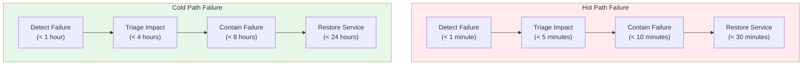
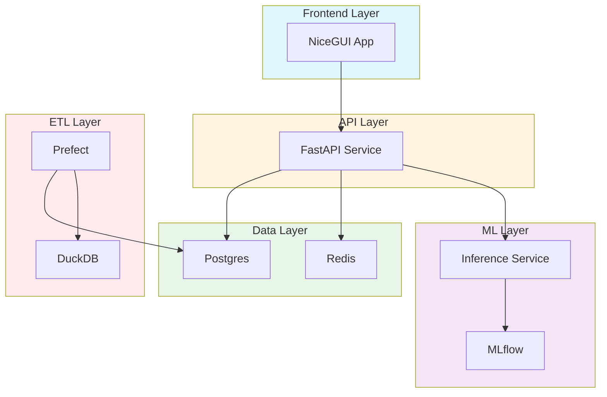
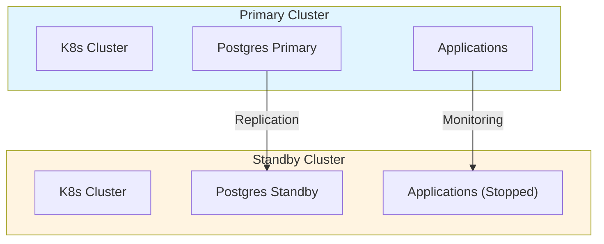
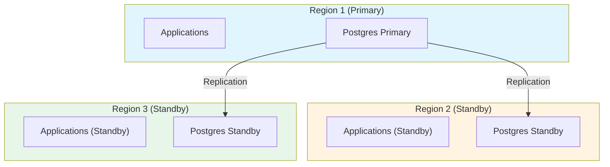

# Operational Resilience and Incident Response: Best Practices for Distributed Systems

**Objective**: Master production-grade operational resilience across RKE2, Postgres, Prefect, Redis, ML pipelines, and air-gapped clusters. When you need to survive incidents, maintain uptime, and recover gracefully—this guide provides complete operational playbooks and incident response frameworks.

## Introduction

Operational resilience is the foundation of reliable distributed systems. Without proper operational practices, systems fail silently, incidents escalate, and recovery takes hours instead of minutes. This guide provides a complete framework for building, operating, and maintaining resilient systems.

**What This Guide Covers**:
- Philosophy of operational readiness
- SLAs, SLOs, and SLIs
- Runbook architecture and templates
- Incident response lifecycle
- Failure Mode & Effects Analysis (FMEA)
- Disaster recovery and business continuity
- Observability for on-call reality
- Test playbooks and chaos engineering
- People, communication, and rotation practices
- Anti-patterns and failure prevention
- Agentic LLM integration for operations

**Prerequisites**:
- Understanding of distributed systems and Kubernetes
- Familiarity with Postgres, Redis, and orchestration systems
- Experience with incident response and on-call rotations

## Philosophy of Operational Readiness

### What "Operational Maturity" Means

**Operational Maturity** is the ability to:
- Detect incidents before users notice
- Respond to incidents within defined SLAs
- Recover from failures automatically or with minimal manual intervention
- Learn from incidents and prevent recurrence
- Scale operations without proportional increase in operational burden

**Maturity Levels**:
1. **Reactive**: Fix issues as they occur
2. **Proactive**: Monitor and prevent issues
3. **Predictive**: Anticipate and prepare for issues
4. **Resilient**: Absorb and recover from failures automatically

### Why System Survivability Equals System Value

**Survivability** is the system's ability to:
- Continue operating during partial failures
- Degrade gracefully under load
- Recover automatically from transient failures
- Maintain data integrity during incidents

**Value Equation**:
```
System Value = Functionality × Availability × Reliability × Data Integrity
```

A system that fails frequently or loses data has zero value, regardless of features.

### Why Docs and Runbooks Matter More Than Architecture Diagrams

**Runbooks** are operational knowledge codified:
- **Architecture diagrams** show "what should be"
- **Runbooks** show "what to do when it isn't"

**Runbook Value**:
- Reduces mean time to recovery (MTTR)
- Enables junior engineers to handle incidents
- Prevents knowledge loss when engineers leave
- Standardizes incident response

**Example**: An architecture diagram shows Postgres primary → replica flow. A runbook shows:
1. How to detect replication lag
2. How to failover if primary fails
3. How to restore replication
4. How to verify data integrity

### The Difference Between Robustness vs Resilience vs Antifragility

**Robustness**: System resists failure (hard to break).

**Resilience**: System recovers from failure (breaks but heals).

**Antifragility**: System improves from failure (gets stronger).

**Example**:
- **Robust**: Postgres with strong constraints (hard to corrupt)
- **Resilient**: Postgres with automatic failover (recovers from primary failure)
- **Antifragile**: Postgres that learns from failures to improve replication logic

### How Incident Response is Part of System Design

**Design for Operations**:
- Systems should be observable (logs, metrics, traces)
- Systems should fail loudly (not silently)
- Systems should degrade gracefully (not catastrophically)
- Systems should be recoverable (not permanently broken)

**Example**: A microservice that:
- Logs all errors with context
- Exposes health endpoints
- Implements circuit breakers
- Supports graceful shutdown
- Has automated rollback capability

## SLAs / SLOs / SLIs

### Service Level Definitions

**SLA (Service Level Agreement)**: Contract with users about service quality.

**SLO (Service Level Objective)**: Internal target for service quality.

**SLI (Service Level Indicator)**: Measured metric of service quality.

### Availability

**Targets**:
- **99.9% (Three Nines)**: 8.76 hours downtime/year
- **99.95%**: 4.38 hours downtime/year
- **99.99% (Four Nines)**: 52.56 minutes downtime/year
- **99.999% (Five Nines)**: 5.26 minutes downtime/year

**Example SLOs**:
```yaml
availability_slos:
  postgres_primary:
    target: 99.95%
    measurement: "Uptime of primary database"
    window: "30 days rolling"
  
  api_endpoints:
    target: 99.9%
    measurement: "HTTP 200 responses / total requests"
    window: "7 days rolling"
  
  ml_inference:
    target: 99.5%
    measurement: "Successful inference requests / total requests"
    window: "24 hours rolling"
```

### Durability

**Targets**:
- **99.999999999% (Eleven Nines)**: 1 object loss per 10 billion objects
- **99.999999% (Eight Nines)**: 1 object loss per 100 million objects

**Example SLOs**:
```yaml
durability_slos:
  postgres_data:
    target: 99.999999999%
    measurement: "Data loss events"
    window: "Annual"
  
  lakehouse_tables:
    target: 99.999999%
    measurement: "Table corruption events"
    window: "Annual"
  
  ml_model_artifacts:
    target: 99.999%
    measurement: "Model artifact loss"
    window: "Annual"
```

### Latency

**Targets**:
- **P50 (Median)**: 50% of requests below this
- **P95**: 95% of requests below this
- **P99**: 99% of requests below this
- **P99.9**: 99.9% of requests below this

**Example SLOs**:
```yaml
latency_slos:
  api_p50:
    target: "< 100ms"
    measurement: "50th percentile response time"
  
  api_p95:
    target: "< 500ms"
    measurement: "95th percentile response time"
  
  api_p99:
    target: "< 1000ms"
    measurement: "99th percentile response time"
  
  postgres_query_p95:
    target: "< 50ms"
    measurement: "95th percentile query time"
  
  ml_inference_p95:
    target: "< 200ms"
    measurement: "95th percentile inference time"
```

### Throughput

**Targets**:
- Requests per second (RPS)
- Transactions per second (TPS)
- Messages per second (MPS)

**Example SLOs**:
```yaml
throughput_slos:
  api_rps:
    target: "> 1000 RPS"
    measurement: "Requests per second"
  
  postgres_tps:
    target: "> 500 TPS"
    measurement: "Transactions per second"
  
  redis_stream_mps:
    target: "> 10000 MPS"
    measurement: "Messages per second"
```

### Data Freshness

**Targets**:
- Time between data creation and availability
- ETL pipeline latency
- Replication lag

**Example SLOs**:
```yaml
freshness_slos:
  etl_pipeline:
    target: "< 5 minutes"
    measurement: "Time from source to destination"
  
  postgres_replication:
    target: "< 1 second"
    measurement: "Replication lag"
  
  lakehouse_updates:
    target: "< 15 minutes"
    measurement: "Time from write to queryable"
```

### Geospatial ETL Timeliness

**Example SLOs**:
```yaml
geospatial_etl_slos:
  tile_generation:
    target: "< 30 minutes"
    measurement: "Time to generate tiles for new data"
  
  spatial_indexing:
    target: "< 10 minutes"
    measurement: "Time to index new geometries"
  
  geospatial_aggregation:
    target: "< 5 minutes"
    measurement: "Time to aggregate spatial data"
```

### ML Inference Stability

**Example SLOs**:
```yaml
ml_inference_slos:
  model_availability:
    target: 99.5%
    measurement: "Model serving availability"
  
  inference_latency_p95:
    target: "< 200ms"
    measurement: "95th percentile inference time"
  
  prediction_accuracy:
    target: "> 95%"
    measurement: "Prediction accuracy vs ground truth"
```

### Postgres Replication Lag Ceilings

**Example SLOs**:
```yaml
postgres_replication_slos:
  streaming_replication:
    target: "< 1 second"
    measurement: "WAL lag"
  
  logical_replication:
    target: "< 5 seconds"
    measurement: "Logical replication lag"
  
  cross_region_replication:
    target: "< 10 seconds"
    measurement: "Cross-region replication lag"
```

### Redis Stream Consumer Lag

**Example SLOs**:
```yaml
redis_stream_slos:
  consumer_lag:
    target: "< 1000 messages"
    measurement: "Pending messages in consumer group"
  
  processing_latency:
    target: "< 5 seconds"
    measurement: "Time from message arrival to processing"
```

### Kubernetes Pod Readiness Windows

**Example SLOs**:
```yaml
kubernetes_slos:
  pod_startup:
    target: "< 30 seconds"
    measurement: "Time from pod creation to ready"
  
  deployment_rollout:
    target: "< 5 minutes"
    measurement: "Time for complete deployment rollout"
  
  node_ready:
    target: "< 2 minutes"
    measurement: "Time from node join to ready"
```

### Tolerable Drift Windows

**Example SLOs**:
```yaml
drift_slos:
  configuration_drift:
    target: "< 1 hour"
    measurement: "Time before drift detection and alert"
  
  time_drift:
    target: "< 100ms"
    measurement: "Clock skew between nodes"
  
  schema_drift:
    target: "< 24 hours"
    measurement: "Time before schema drift detection"
```

## Runbook Architecture

### Startup Runbooks

**Purpose**: Ensure systems start correctly after deployment or restart.

**Structure**:
1. Prerequisites check
2. Dependency verification
3. Service startup sequence
4. Health check validation
5. Smoke tests

**Example: Postgres Cluster Startup**:
```bash
#!/bin/bash
# runbooks/postgres-cluster-startup.sh

set -euo pipefail

echo "=== Postgres Cluster Startup Runbook ==="

# 1. Prerequisites
echo "Checking prerequisites..."
kubectl get nodes | grep -q Ready || exit 1
kubectl get pvc -n postgres | grep -q Bound || exit 1

# 2. Start PGO operator
echo "Starting PGO operator..."
kubectl scale deployment postgres-operator --replicas=1 -n pgo-system

# 3. Wait for operator ready
echo "Waiting for PGO operator..."
kubectl wait --for=condition=ready pod -l name=postgres-operator -n pgo-system --timeout=5m

# 4. Start Postgres cluster
echo "Starting Postgres cluster..."
kubectl patch postgrescluster postgres-cluster -n postgres --type merge -p '{"spec":{"shutdown":false}}'

# 5. Wait for cluster ready
echo "Waiting for Postgres cluster..."
kubectl wait --for=condition=ready postgrescluster postgres-cluster -n postgres --timeout=10m

# 6. Verify replication
echo "Verifying replication..."
kubectl exec -it postgres-cluster-instance1-0 -n postgres -- psql -c "SELECT * FROM pg_stat_replication;"

# 7. Run smoke tests
echo "Running smoke tests..."
kubectl exec -it postgres-cluster-instance1-0 -n postgres -- psql -c "SELECT 1;"

echo "=== Postgres cluster startup complete ==="
```

### Troubleshooting Runbooks

**Purpose**: Diagnose and resolve common issues.

**Structure**:
1. Symptom identification
2. Diagnostic steps
3. Common causes
4. Resolution steps
5. Verification

**Example: Postgres Replication Lag**:
```bash
#!/bin/bash
# runbooks/postgres-replication-lag-troubleshooting.sh

set -euo pipefail

echo "=== Postgres Replication Lag Troubleshooting ==="

# 1. Check replication status
echo "Checking replication status..."
kubectl exec -it postgres-cluster-instance1-0 -n postgres -- psql -c "
SELECT 
    client_addr,
    state,
    sync_state,
    pg_wal_lsn_diff(pg_current_wal_lsn(), sent_lsn) AS sent_lag_bytes,
    pg_wal_lsn_diff(pg_current_wal_lsn(), write_lsn) AS write_lag_bytes,
    pg_wal_lsn_diff(pg_current_wal_lsn(), flush_lsn) AS flush_lag_bytes,
    pg_wal_lsn_diff(pg_current_wal_lsn(), replay_lsn) AS replay_lag_bytes
FROM pg_stat_replication;
"

# 2. Check WAL generation rate
echo "Checking WAL generation rate..."
kubectl exec -it postgres-cluster-instance1-0 -n postgres -- psql -c "
SELECT 
    pg_size_pretty(pg_wal_lsn_diff(pg_current_wal_lsn(), '0/0')) AS total_wal_size,
    pg_size_pretty(pg_current_wal_lsn()) AS current_wal_lsn;
"

# 3. Check network connectivity
echo "Checking network connectivity..."
kubectl exec -it postgres-cluster-instance1-0 -n postgres -- ping -c 3 postgres-cluster-instance2-0.postgres-cluster-pods.postgres.svc.cluster.local

# 4. Check replica resources
echo "Checking replica resources..."
kubectl top pod -n postgres | grep postgres-cluster-instance2

# 5. Common resolutions
echo "Common resolutions:"
echo "1. Increase replica resources if CPU/memory constrained"
echo "2. Check network latency between primary and replica"
echo "3. Verify WAL archiving is not blocking"
echo "4. Check for long-running queries on replica"
```

### "Break Glass" Runbooks

**Purpose**: Emergency procedures for critical failures.

**Structure**:
1. Emergency assessment
2. Immediate containment
3. Service restoration
4. Data integrity verification
5. Post-incident review

**Example: Postgres Primary Failure**:
```bash
#!/bin/bash
# runbooks/postgres-primary-failure-break-glass.sh

set -euo pipefail

echo "=== BREAK GLASS: Postgres Primary Failure ==="
echo "WARNING: This is an emergency procedure. Proceed with caution."

# 1. Verify primary is actually down
echo "Verifying primary failure..."
PRIMARY_POD=$(kubectl get pod -n postgres -l postgres-operator.crunchydata.com/role=master -o jsonpath='{.items[0].metadata.name}')
if kubectl get pod $PRIMARY_POD -n postgres | grep -q Running; then
    echo "ERROR: Primary pod appears to be running. Aborting."
    exit 1
fi

# 2. Promote replica to primary
echo "Promoting replica to primary..."
kubectl patch postgrescluster postgres-cluster -n postgres --type merge -p '{"spec":{"instances":[{"name":"instance2","replicationRole":"primary"}]}}'

# 3. Wait for promotion
echo "Waiting for promotion..."
sleep 30

# 4. Verify new primary
echo "Verifying new primary..."
kubectl exec -it postgres-cluster-instance2-0 -n postgres -- psql -c "SELECT pg_is_in_recovery();"

# 5. Update application connections
echo "Updating application connections..."
# Update connection strings to point to new primary
# This is application-specific

# 6. Verify data integrity
echo "Verifying data integrity..."
kubectl exec -it postgres-cluster-instance2-0 -n postgres -- psql -c "
SELECT 
    schemaname,
    tablename,
    n_live_tup,
    n_dead_tup
FROM pg_stat_user_tables
ORDER BY n_dead_tup DESC
LIMIT 10;
"

echo "=== Break glass procedure complete ==="
echo "NEXT STEPS:"
echo "1. Investigate root cause of primary failure"
echo "2. Restore failed primary as new replica"
echo "3. Schedule postmortem"
```

### Maintenance Playbooks

**Purpose**: Standard procedures for planned maintenance.

**Structure**:
1. Pre-maintenance checks
2. Maintenance steps
3. Verification
4. Rollback procedures

**Example: Postgres VACUUM Maintenance**:
```bash
#!/bin/bash
# runbooks/postgres-vacuum-maintenance.sh

set -euo pipefail

echo "=== Postgres VACUUM Maintenance ==="

# 1. Pre-maintenance checks
echo "Pre-maintenance checks..."
kubectl exec -it postgres-cluster-instance1-0 -n postgres -- psql -c "
SELECT 
    schemaname,
    tablename,
    n_live_tup,
    n_dead_tup,
    last_vacuum,
    last_autovacuum
FROM pg_stat_user_tables
WHERE n_dead_tup > 1000
ORDER BY n_dead_tup DESC;
"

# 2. Run VACUUM ANALYZE on high-dead-tuple tables
echo "Running VACUUM ANALYZE..."
kubectl exec -it postgres-cluster-instance1-0 -n postgres -- psql -c "
VACUUM ANALYZE VERBOSE;
"

# 3. Verify results
echo "Verifying VACUUM results..."
kubectl exec -it postgres-cluster-instance1-0 -n postgres -- psql -c "
SELECT 
    schemaname,
    tablename,
    n_live_tup,
    n_dead_tup
FROM pg_stat_user_tables
WHERE n_dead_tup > 1000;
"

echo "=== VACUUM maintenance complete ==="
```

### Recovery and Reinstatement Workflows

**Purpose**: Restore services after incidents.

**Structure**:
1. Damage assessment
2. Recovery planning
3. Data restoration
4. Service reinstatement
5. Verification and monitoring

**Example: Postgres Data Corruption Recovery**:
```bash
#!/bin/bash
# runbooks/postgres-data-corruption-recovery.sh

set -euo pipefail

echo "=== Postgres Data Corruption Recovery ==="

# 1. Damage assessment
echo "Assessing damage..."
kubectl exec -it postgres-cluster-instance1-0 -n postgres -- psql -c "
SELECT 
    datname,
    pg_database_size(datname) AS size
FROM pg_database
WHERE datname NOT IN ('template0', 'template1', 'postgres');
"

# 2. Identify corrupted tables
echo "Identifying corrupted tables..."
kubectl exec -it postgres-cluster-instance1-0 -n postgres -- psql -c "
SELECT 
    schemaname,
    tablename,
    pg_size_pretty(pg_total_relation_size(schemaname||'.'||tablename)) AS size
FROM pg_tables
WHERE schemaname = 'public';
"

# 3. Restore from backup
echo "Restoring from backup..."
# This is backup-system specific
# Example: pg_restore from S3 backup

# 4. Verify restoration
echo "Verifying restoration..."
kubectl exec -it postgres-cluster-instance1-0 -n postgres -- psql -c "
SELECT COUNT(*) FROM important_table;
"

echo "=== Recovery complete ==="
```

### Hot Path vs Cold Path Failure Diagnosis

**Hot Path**: User-facing, real-time operations.

**Cold Path**: Batch processing, non-real-time operations.

**Diagnosis Strategy**:


### Dependency-Aware Troubleshooting

**Dependency Map**:


**Troubleshooting Flow**:
1. Start from user-facing symptoms
2. Trace dependencies backward
3. Check each dependency's health
4. Identify root cause
5. Resolve from bottom up

## Incident Response Lifecycle

### 1. Detection

**Detection Methods**:
- Automated monitoring alerts
- User reports
- Synthetic monitoring
- Log analysis
- Metric anomalies

**Detection SLO**: Detect incidents within 1 minute of occurrence.

### 2. Triage

**Triage Steps**:
1. Confirm incident is real
2. Assess impact (users affected, severity)
3. Classify incident (P0, P1, P2, P3)
4. Assign incident commander
5. Open incident channel

**Severity Levels**:
- **P0 (Critical)**: Service down, data loss, security breach
- **P1 (High)**: Major feature broken, significant degradation
- **P2 (Medium)**: Minor feature broken, limited impact
- **P3 (Low)**: Cosmetic issues, no user impact

### 3. Containment

**Containment Strategies**:
- Isolate affected systems
- Rollback deployments
- Disable features
- Rate limit traffic
- Failover to backup systems

**Containment SLO**: Contain incidents within 15 minutes of detection.

### 4. Remediation

**Remediation Steps**:
1. Follow runbooks
2. Apply fixes
3. Verify fixes
4. Monitor recovery
5. Document actions

**Remediation SLO**: Resolve incidents within 1 hour for P0, 4 hours for P1.

### 5. Root-Cause Analysis

**RCA Process**:
1. Gather evidence (logs, metrics, traces)
2. Timeline reconstruction
3. Identify root cause
4. Document findings
5. Propose preventive measures

### 6. Postmortem Documentation

**Postmortem Template**:
```markdown
# Postmortem: [Incident Title]

## Summary
- **Date**: [Date]
- **Duration**: [Duration]
- **Impact**: [Users affected, services impacted]
- **Severity**: [P0/P1/P2/P3]

## Timeline
- [Time] - Incident detected
- [Time] - Triage started
- [Time] - Containment achieved
- [Time] - Remediation completed
- [Time] - Service restored

## Root Cause
[Detailed explanation of root cause]

## Impact
- Users affected: [Number]
- Services impacted: [List]
- Data loss: [Yes/No, details]

## Resolution
[Steps taken to resolve]

## Prevention
- [Action item 1]
- [Action item 2]
- [Action item 3]

## Lessons Learned
[Key takeaways]

## Action Items
- [ ] [Action item 1] - Owner: [Name] - Due: [Date]
- [ ] [Action item 2] - Owner: [Name] - Due: [Date]
```

### 7. Resilience Enhancement

**Enhancement Steps**:
1. Implement preventive measures
2. Update runbooks
3. Add monitoring
4. Improve automation
5. Test improvements

### 8. Preventive Engineering

**Preventive Measures**:
- Chaos engineering
- Load testing
- Failure injection
- Disaster recovery drills
- Security audits

## Failure Mode & Effects Analysis (FMEA)

### FMEA Process

1. **Identify Failure Modes**: How can each component fail?
2. **Assess Severity**: Impact of failure (1-10 scale)
3. **Assess Occurrence**: Likelihood of failure (1-10 scale)
4. **Assess Detection**: Ability to detect failure (1-10 scale)
5. **Calculate RPN**: Risk Priority Number = Severity × Occurrence × Detection
6. **Prioritize Actions**: Address highest RPN first

### Compute Layer FMEA

| Component | Failure Mode | Severity | Occurrence | Detection | RPN | Mitigation |
|-----------|--------------|----------|------------|-----------|-----|------------|
| K8s Node | Node crash | 9 | 3 | 2 | 54 | Node health checks, auto-replacement |
| K8s Pod | Pod OOM | 7 | 4 | 3 | 84 | Resource limits, HPA |
| GPU Node | GPU failure | 8 | 2 | 4 | 64 | GPU health monitoring, workload migration |
| Container | Image corruption | 6 | 2 | 5 | 60 | Image scanning, immutable tags |

### Database Layer FMEA

| Component | Failure Mode | Severity | Occurrence | Detection | RPN | Mitigation |
|-----------|--------------|----------|------------|-----------|-----|------------|
| Postgres Primary | Primary crash | 10 | 2 | 2 | 40 | Automatic failover, replication |
| Postgres Replica | Replica lag | 7 | 3 | 3 | 63 | Replication monitoring, lag alerts |
| WAL Archive | Archive failure | 9 | 2 | 4 | 72 | Multiple archive locations, verification |
| Connection Pool | Pool exhaustion | 8 | 3 | 3 | 72 | Pool monitoring, connection limits |

### Message Bus Layer FMEA

| Component | Failure Mode | Severity | Occurrence | Detection | RPN | Mitigation |
|-----------|--------------|----------|------------|-----------|-----|------------|
| Redis | Redis crash | 9 | 2 | 2 | 36 | Redis Sentinel, replication |
| Kafka | Broker failure | 8 | 2 | 2 | 32 | Multi-broker cluster, replication |
| NATS | NATS crash | 7 | 2 | 3 | 42 | NATS clustering, JetStream |
| Consumer | Consumer lag | 6 | 4 | 3 | 72 | Lag monitoring, auto-scaling |

### ML Inference Layer FMEA

| Component | Failure Mode | Severity | Occurrence | Detection | RPN | Mitigation |
|-----------|--------------|----------|------------|-----------|-----|------------|
| Model Server | Server crash | 8 | 2 | 2 | 32 | Multiple replicas, health checks |
| Model Registry | Registry outage | 7 | 2 | 3 | 42 | Backup registry, caching |
| Feature Store | Feature stale | 6 | 3 | 4 | 72 | TTL monitoring, freshness checks |
| GPU | GPU OOM | 8 | 3 | 3 | 72 | GPU memory monitoring, batch sizing |

### NiceGUI/API Layer FMEA

| Component | Failure Mode | Severity | Occurrence | Detection | RPN | Mitigation |
|-----------|--------------|----------|------------|-----------|-----|------------|
| NiceGUI | App crash | 7 | 3 | 2 | 42 | Health checks, auto-restart |
| FastAPI | API timeout | 6 | 4 | 3 | 72 | Timeout monitoring, circuit breakers |
| Load Balancer | LB failure | 9 | 2 | 2 | 36 | Multiple LBs, health checks |
| WebSocket | Connection drop | 5 | 4 | 4 | 80 | Reconnection logic, monitoring |

### Storage Layer FMEA

| Component | Failure Mode | Severity | Occurrence | Detection | RPN | Mitigation |
|-----------|--------------|----------|------------|-----------|-----|------------|
| S3/MinIO | Object loss | 10 | 1 | 5 | 50 | Versioning, replication |
| Parquet | File corruption | 9 | 2 | 4 | 72 | Checksums, validation |
| Lakehouse | Table corruption | 9 | 2 | 3 | 54 | Table validation, backups |
| PVC | Volume failure | 8 | 2 | 3 | 48 | Volume replication, backups |

### Network Layer FMEA

| Component | Failure Mode | Severity | Occurrence | Detection | RPN | Mitigation |
|-----------|--------------|----------|------------|-----------|-----|------------|
| Network | Partition | 9 | 2 | 2 | 36 | Multi-path routing, health checks |
| DNS | DNS failure | 8 | 2 | 3 | 48 | Multiple DNS servers, caching |
| Load Balancer | LB failure | 9 | 2 | 2 | 36 | Multiple LBs, health checks |
| Firewall | Rule misconfiguration | 7 | 3 | 4 | 84 | Automated testing, validation |

## Disaster Recovery & Business Continuity

### Backup & Restore Strategy for Postgres

**Backup Strategy**:
```bash
#!/bin/bash
# backup/postgres-backup.sh

# 1. Full backup
pg_dumpall -h postgres-primary -U postgres > backup_$(date +%Y%m%d_%H%M%S).sql

# 2. WAL archiving
# Configure in postgresql.conf:
# archive_mode = on
# archive_command = 'aws s3 cp %p s3://backups/postgres/wal/%f'

# 3. Point-in-time recovery
# Restore from backup + replay WAL to target time
```

**Restore Strategy**:
```bash
#!/bin/bash
# restore/postgres-restore.sh

# 1. Stop Postgres
kubectl scale statefulset postgres-cluster-instance1 --replicas=0 -n postgres

# 2. Restore from backup
psql -h postgres-primary -U postgres < backup_20240115_120000.sql

# 3. Replay WAL to target time
# Configure recovery_target_time in recovery.conf

# 4. Start Postgres
kubectl scale statefulset postgres-cluster-instance1 --replicas=1 -n postgres
```

### Lakehouse Table Version Rollback

**Rollback Strategy**:
```python
# lakehouse/rollback.py
import pyiceberg

def rollback_table(table_path: str, target_version: int):
    """Rollback lakehouse table to target version"""
    table = pyiceberg.Table.from_path(table_path)
    
    # Get current version
    current_version = table.metadata.current_snapshot_id
    
    # Rollback to target version
    table.rollback_to_snapshot(target_version)
    
    # Verify rollback
    assert table.metadata.current_snapshot_id == target_version
```

### MLflow Experiment Rehydration

**Rehydration Strategy**:
```python
# mlflow/rehydrate.py
import mlflow

def rehydrate_experiment(experiment_id: str, backup_path: str):
    """Rehydrate MLflow experiment from backup"""
    # Restore experiment metadata
    mlflow.restore_experiment(experiment_id, backup_path)
    
    # Restore runs
    runs = mlflow.search_runs(experiment_ids=[experiment_id])
    for run in runs:
        mlflow.restore_run(run.info.run_id, backup_path)
```

### Cross-Cluster Cold-Standby Design

**Architecture**:


**Failover Procedure**:
```bash
#!/bin/bash
# failover/standby-activation.sh

# 1. Promote standby database
kubectl exec -it postgres-standby-0 -n postgres -- psql -c "SELECT pg_promote();"

# 2. Start standby applications
kubectl scale deployment app --replicas=3 -n standby

# 3. Update DNS/load balancer
# Point traffic to standby cluster

# 4. Verify services
kubectl get pods -n standby
```

### Distributed Checkpointing

**Checkpoint Strategy**:
```python
# checkpointing/distributed_checkpoint.py
class DistributedCheckpointer:
    def checkpoint(self, state: dict, checkpoint_id: str):
        """Create distributed checkpoint"""
        # Store checkpoint in multiple locations
        self.store_checkpoint(state, checkpoint_id, "s3://checkpoints/")
        self.store_checkpoint(state, checkpoint_id, "postgres://checkpoints/")
        self.store_checkpoint(state, checkpoint_id, "redis://checkpoints/")
    
    def restore(self, checkpoint_id: str) -> dict:
        """Restore from checkpoint"""
        # Try to restore from any location
        for location in ["s3", "postgres", "redis"]:
            try:
                return self.load_checkpoint(checkpoint_id, location)
            except Exception:
                continue
        raise ValueError(f"Checkpoint {checkpoint_id} not found")
```

### Air-Gapped Restore Operations

**Restore Strategy**:
```bash
#!/bin/bash
# airgap/restore.sh

# 1. Transfer backup to air-gapped cluster
# Via secure USB or physical media

# 2. Verify backup integrity
sha256sum backup.tar.gz > backup.sha256
sha256sum -c backup.sha256

# 3. Extract backup
tar -xzf backup.tar.gz

# 4. Restore services
./restore/postgres-restore.sh
./restore/redis-restore.sh
./restore/app-restore.sh

# 5. Verify restoration
./verify/verify-all.sh
```

### Multi-Region Failover Patterns

**Architecture**:


### Chaos Testing for Recovery Drills

**Chaos Test Suite**:
```python
# chaos/recovery_drills.py
import chaosmesh

class RecoveryDrills:
    def test_postgres_failover(self):
        """Test Postgres primary failover"""
        # Kill primary pod
        chaosmesh.kill_pod("postgres-primary")
        
        # Verify automatic failover
        assert self.verify_new_primary()
        
        # Verify data integrity
        assert self.verify_data_integrity()
    
    def test_network_partition(self):
        """Test network partition recovery"""
        # Partition network
        chaosmesh.network_partition("app", "database")
        
        # Verify graceful degradation
        assert self.verify_graceful_degradation()
        
        # Restore network
        chaosmesh.restore_network()
        
        # Verify recovery
        assert self.verify_recovery()
```

## Observability for On-Call Reality

### Alert Tiers

**Tier 1 (Critical)**: Page on-call immediately
- Service down
- Data loss
- Security breach

**Tier 2 (High)**: Page on-call within 15 minutes
- Major degradation
- Significant user impact

**Tier 3 (Medium)**: Create ticket, no page
- Minor issues
- Limited impact

**Tier 4 (Low)**: Log only
- Informational
- No action required

### Actionable vs Noisy Alerts

**Actionable Alert Criteria**:
- Clear symptom
- Known resolution path
- Actionable information
- Appropriate severity

**Noisy Alert Examples**:
- Alert on every error (should alert on error rate)
- Alert on expected behavior
- Alert without context
- Alert that can't be acted upon

### On-Call Rotations

**Rotation Schedule**:
- **Primary**: Handles all Tier 1 and Tier 2 alerts
- **Secondary**: Handles Tier 3 alerts, backup for primary
- **Escalation**: Senior engineer for complex issues

**Rotation Best Practices**:
- Rotate weekly
- Include context in handoff
- Document common issues
- Provide runbooks

### Operational Dashboards

**Rancher Cluster Health Dashboard**:
```json
{
  "dashboard": {
    "title": "Rancher Cluster Health",
    "panels": [
      {
        "title": "Node Status",
        "targets": [
          {
            "expr": "kube_node_status_condition{condition=\"Ready\"}",
            "legendFormat": "{{node}}"
          }
        ]
      },
      {
        "title": "Pod Status",
        "targets": [
          {
            "expr": "kube_pod_status_phase",
            "legendFormat": "{{pod}}"
          }
        ]
      },
      {
        "title": "Resource Usage",
        "targets": [
          {
            "expr": "kube_node_status_allocatable_cpu_cores",
            "legendFormat": "CPU: {{node}}"
          },
          {
            "expr": "kube_node_status_allocatable_memory_bytes",
            "legendFormat": "Memory: {{node}}"
          }
        ]
      }
    ]
  }
}
```

**Postgres Replication + WAL Backlog Dashboard**:
```json
{
  "dashboard": {
    "title": "Postgres Replication & WAL",
    "panels": [
      {
        "title": "Replication Lag",
        "targets": [
          {
            "expr": "pg_replication_lag_bytes",
            "legendFormat": "{{replica}}"
          }
        ]
      },
      {
        "title": "WAL Generation Rate",
        "targets": [
          {
            "expr": "rate(pg_wal_bytes_written[5m])",
            "legendFormat": "WAL/s"
          }
        ]
      },
      {
        "title": "Replication Slots",
        "targets": [
          {
            "expr": "pg_replication_slot_lag_bytes",
            "legendFormat": "{{slot}}"
          }
        ]
      }
    ]
  }
}
```

**Redis Stream Lag Dashboard**:
```json
{
  "dashboard": {
    "title": "Redis Stream Lag",
    "panels": [
      {
        "title": "Consumer Lag",
        "targets": [
          {
            "expr": "redis_stream_consumer_lag",
            "legendFormat": "{{consumer_group}}/{{consumer}}"
          }
        ]
      },
      {
        "title": "Stream Length",
        "targets": [
          {
            "expr": "redis_stream_length",
            "legendFormat": "{{stream}}"
          }
        ]
      },
      {
        "title": "Processing Rate",
        "targets": [
          {
            "expr": "rate(redis_stream_messages_processed[5m])",
            "legendFormat": "{{consumer_group}}"
          }
        ]
      }
    ]
  }
}
```

**Prefect Orchestration Failures Dashboard**:
```json
{
  "dashboard": {
    "title": "Prefect Orchestration",
    "panels": [
      {
        "title": "Flow Run Failures",
        "targets": [
          {
            "expr": "rate(prefect_flow_runs_failed[5m])",
            "legendFormat": "{{flow_name}}"
          }
        ]
      },
      {
        "title": "Task Run Failures",
        "targets": [
          {
            "expr": "rate(prefect_task_runs_failed[5m])",
            "legendFormat": "{{task_name}}"
          }
        ]
      },
      {
        "title": "Agent Status",
        "targets": [
          {
            "expr": "prefect_agent_status",
            "legendFormat": "{{agent_name}}"
          }
        ]
      }
    ]
  }
}
```

**Inference Pipeline Stalls Dashboard**:
```json
{
  "dashboard": {
    "title": "ML Inference Pipeline",
    "panels": [
      {
        "title": "Inference Latency",
        "targets": [
          {
            "expr": "histogram_quantile(0.95, ml_inference_duration_seconds_bucket)",
            "legendFormat": "P95"
          }
        ]
      },
      {
        "title": "Inference Failures",
        "targets": [
          {
            "expr": "rate(ml_inference_failures_total[5m])",
            "legendFormat": "{{model}}"
          }
        ]
      },
      {
        "title": "Queue Depth",
        "targets": [
          {
            "expr": "ml_inference_queue_depth",
            "legendFormat": "{{model}}"
          }
        ]
      }
    ]
  }
}
```

**NiceGUI Application Health Dashboard**:
```json
{
  "dashboard": {
    "title": "NiceGUI Application Health",
    "panels": [
      {
        "title": "Request Rate",
        "targets": [
          {
            "expr": "rate(nicegui_requests_total[5m])",
            "legendFormat": "{{endpoint}}"
          }
        ]
      },
      {
        "title": "Error Rate",
        "targets": [
          {
            "expr": "rate(nicegui_errors_total[5m])",
            "legendFormat": "{{endpoint}}"
          }
        ]
      },
      {
        "title": "WebSocket Connections",
        "targets": [
          {
            "expr": "nicegui_websocket_connections",
            "legendFormat": "{{instance}}"
          }
        ]
      }
    ]
  }
}
```

### Tracing Needs for Multi-Hop Chains

**Distributed Tracing**:
```python
# tracing/multi_hop_trace.py
from opentelemetry import trace
from opentelemetry.sdk.trace import TracerProvider

tracer = trace.get_tracer(__name__)

def process_request(request):
    """Process request with distributed tracing"""
    with tracer.start_as_current_span("process_request") as span:
        # Add context
        span.set_attribute("request_id", request.id)
        span.set_attribute("user_id", request.user_id)
        
        # Call downstream services
        with tracer.start_as_current_span("call_database"):
            result = call_database(request)
        
        with tracer.start_as_current_span("call_ml_service"):
            prediction = call_ml_service(result)
        
        return prediction
```

### Structured Logging Patterns

**Structured Logging**:
```python
# logging/structured_logging.py
import structlog

logger = structlog.get_logger()

def process_data(data: dict):
    """Process data with structured logging"""
    logger.info(
        "processing_data",
        data_id=data["id"],
        data_type=data["type"],
        timestamp=data["timestamp"]
    )
    
    try:
        result = transform_data(data)
        logger.info(
            "data_processed",
            data_id=data["id"],
            result_size=len(result)
        )
        return result
    except Exception as e:
        logger.error(
            "data_processing_failed",
            data_id=data["id"],
            error=str(e),
            exc_info=True
        )
        raise
```

### User-Facing Synthetic Monitors

**Synthetic Monitoring**:
```python
# monitoring/synthetic_monitors.py
class SyntheticMonitor:
    def monitor_api_endpoint(self, endpoint: str):
        """Monitor API endpoint with synthetic requests"""
        response = requests.get(endpoint)
        
        # Check response
        assert response.status_code == 200
        assert response.json()["status"] == "ok"
        
        # Record metrics
        self.record_metric("synthetic_api_latency", response.elapsed.total_seconds())
        self.record_metric("synthetic_api_status", response.status_code)
    
    def monitor_database_query(self, query: str):
        """Monitor database with synthetic queries"""
        start = time.time()
        result = self.execute_query(query)
        duration = time.time() - start
        
        # Check result
        assert len(result) > 0
        
        # Record metrics
        self.record_metric("synthetic_db_latency", duration)
        self.record_metric("synthetic_db_rows", len(result))
```

## Test Playbooks & Chaos Engineering

### Controlled Failure Injection

**Failure Injection Framework**:
```python
# chaos/failure_injection.py
class FailureInjector:
    def inject_cpu_stress(self, pod_name: str, duration: int):
        """Inject CPU stress"""
        kubectl.exec(
            pod_name,
            "stress-ng",
            "--cpu", "4",
            "--timeout", str(duration)
        )
    
    def inject_memory_pressure(self, pod_name: str, size: str):
        """Inject memory pressure"""
        kubectl.exec(
            pod_name,
            "stress-ng",
            "--vm", "1",
            "--vm-bytes", size,
            "--timeout", "60"
        )
    
    def inject_network_delay(self, pod_name: str, delay: int):
        """Inject network delay"""
        kubectl.exec(
            pod_name,
            "tc", "qdisc", "add", "dev", "eth0", "root", "netem", "delay", str(delay) + "ms"
        )
    
    def inject_packet_loss(self, pod_name: str, loss: float):
        """Inject packet loss"""
        kubectl.exec(
            pod_name,
            "tc", "qdisc", "add", "dev", "eth0", "root", "netem", "loss", str(loss) + "%"
        )
```

### Canary Rollouts

**Canary Deployment**:
```yaml
# canary/deployment.yaml
apiVersion: argoproj.io/v1alpha1
kind: Rollout
metadata:
  name: app-rollout
spec:
  replicas: 10
  strategy:
    canary:
      steps:
      - setWeight: 10  # 10% traffic to canary
      - pause: {}
      - setWeight: 25  # 25% traffic to canary
      - pause: {duration: 5m}
      - setWeight: 50  # 50% traffic to canary
      - pause: {duration: 5m}
      - setWeight: 100 # 100% traffic to canary
      canaryService: app-canary
      stableService: app-stable
  template:
    spec:
      containers:
      - name: app
        image: app:latest
```

### Pod Kill Testing

**Pod Kill Test**:
```python
# chaos/pod_kill_test.py
class PodKillTest:
    def test_pod_restart(self, deployment: str):
        """Test pod restart recovery"""
        # Get pod
        pod = self.get_pod(deployment)
        
        # Kill pod
        kubectl.delete_pod(pod.name)
        
        # Wait for restart
        self.wait_for_pod_ready(deployment, timeout=5*60)
        
        # Verify service
        assert self.verify_service_health(deployment)
    
    def test_all_pods_kill(self, deployment: str):
        """Test all pods kill recovery"""
        # Kill all pods
        kubectl.delete_pods(deployment, all=True)
        
        # Wait for recovery
        self.wait_for_deployment_ready(deployment, timeout=10*60)
        
        # Verify service
        assert self.verify_service_health(deployment)
```

### Network Delay Injection

**Network Delay Test**:
```python
# chaos/network_delay_test.py
class NetworkDelayTest:
    def test_api_timeout(self, api_endpoint: str):
        """Test API behavior under network delay"""
        # Inject delay
        self.inject_network_delay("api-pod", delay=5000)  # 5 seconds
        
        # Make request
        try:
            response = requests.get(api_endpoint, timeout=10)
            assert response.status_code == 200
        except requests.Timeout:
            # Expected behavior
            pass
        finally:
            # Remove delay
            self.remove_network_delay("api-pod")
```

### Postgres Primary Failover Drills

**Failover Drill**:
```bash
#!/bin/bash
# chaos/postgres-failover-drill.sh

echo "=== Postgres Primary Failover Drill ==="

# 1. Verify current primary
PRIMARY=$(kubectl get pod -n postgres -l postgres-operator.crunchydata.com/role=master -o jsonpath='{.items[0].metadata.name}')
echo "Current primary: $PRIMARY"

# 2. Kill primary
echo "Killing primary pod..."
kubectl delete pod $PRIMARY -n postgres

# 3. Wait for failover
echo "Waiting for failover..."
sleep 30

# 4. Verify new primary
NEW_PRIMARY=$(kubectl get pod -n postgres -l postgres-operator.crunchydata.com/role=master -o jsonpath='{.items[0].metadata.name}')
echo "New primary: $NEW_PRIMARY"

# 5. Verify data integrity
echo "Verifying data integrity..."
kubectl exec -it $NEW_PRIMARY -n postgres -- psql -c "SELECT COUNT(*) FROM important_table;"

echo "=== Failover drill complete ==="
```

### Replaying Message Queues

**Queue Replay Test**:
```python
# chaos/queue_replay_test.py
class QueueReplayTest:
    def test_redis_stream_replay(self, stream: str):
        """Test Redis stream replay"""
        # Get messages
        messages = self.get_stream_messages(stream, count=100)
        
        # Replay messages
        for message in messages:
            self.replay_message(stream, message)
        
        # Verify processing
        assert self.verify_messages_processed(messages)
    
    def test_kafka_replay(self, topic: str):
        """Test Kafka topic replay"""
        # Get messages from beginning
        consumer = KafkaConsumer(topic, auto_offset_reset='earliest')
        
        # Replay messages
        for message in consumer:
            self.replay_message(topic, message)
```

### Resilience Scoring

**Resilience Score Calculation**:
```python
# chaos/resilience_scoring.py
class ResilienceScorer:
    def calculate_score(self, test_results: dict) -> float:
        """Calculate resilience score"""
        scores = {
            'pod_restart': self.score_pod_restart(test_results['pod_restart']),
            'failover': self.score_failover(test_results['failover']),
            'network_partition': self.score_network_partition(test_results['network_partition']),
            'load_test': self.score_load_test(test_results['load_test'])
        }
        
        # Weighted average
        weights = {
            'pod_restart': 0.2,
            'failover': 0.3,
            'network_partition': 0.3,
            'load_test': 0.2
        }
        
        total_score = sum(scores[key] * weights[key] for key in scores)
        return total_score
    
    def score_pod_restart(self, result: dict) -> float:
        """Score pod restart recovery"""
        if result['recovery_time'] < 60:  # < 1 minute
            return 1.0
        elif result['recovery_time'] < 300:  # < 5 minutes
            return 0.8
        else:
            return 0.5
```

### Sample Chaos Engineering Test Suite

**Complete Test Suite**:
```python
# chaos/test_suite.py
import pytest

class ChaosTestSuite:
    @pytest.mark.chaos
    def test_pod_kill(self):
        """Test pod kill recovery"""
        # Implementation
        pass
    
    @pytest.mark.chaos
    def test_network_partition(self):
        """Test network partition recovery"""
        # Implementation
        pass
    
    @pytest.mark.chaos
    def test_database_failover(self):
        """Test database failover"""
        # Implementation
        pass
    
    @pytest.mark.chaos
    def test_load_spike(self):
        """Test load spike handling"""
        # Implementation
        pass
```

## People, Communication, and Rotation Practices

### Escalation Ladders

**Escalation Levels**:
1. **L1 (On-Call)**: Initial response, follow runbooks
2. **L2 (Senior Engineer)**: Complex issues, architecture decisions
3. **L3 (Principal Engineer)**: Critical issues, system design
4. **L4 (Engineering Manager)**: Business impact, resource allocation

**Escalation Criteria**:
- L1 → L2: Issue unresolved after 30 minutes
- L2 → L3: Issue unresolved after 2 hours
- L3 → L4: Business impact > $10k/hour

### Communication Templates

**Incident Communication Template**:
```
Subject: [SEVERITY] Incident: [Brief Description]

Status: [Investigating/Mitigating/Resolved]

Impact:
- Services affected: [List]
- Users affected: [Number/Percentage]
- Estimated resolution: [Time]

Actions taken:
- [Action 1]
- [Action 2]

Next update: [Time]
```

**Postmortem Communication Template**:
```
Subject: Postmortem: [Incident Title]

Summary:
[Brief summary]

Root Cause:
[Root cause explanation]

Impact:
[Impact details]

Resolution:
[Resolution steps]

Prevention:
[Preventive measures]

Action Items:
- [ ] [Action item 1]
- [ ] [Action item 2]
```

### Handoff Protocols

**Handoff Checklist**:
- [ ] Current incidents documented
- [ ] Runbooks updated
- [ ] Monitoring alerts reviewed
- [ ] Known issues communicated
- [ ] Escalation paths confirmed
- [ ] Contact information verified

### Incident Commander Roles

**Incident Commander Responsibilities**:
- Coordinate response
- Make decisions
- Communicate status
- Escalate when needed
- Document actions

**Incident Commander Rotation**:
- Rotate weekly
- Include training
- Provide context
- Document decisions

### Engineering vs Ops Responsibilities

**Engineering Responsibilities**:
- System design
- Feature development
- Performance optimization
- Architecture decisions

**Ops Responsibilities**:
- Incident response
- Monitoring setup
- Runbook maintenance
- On-call rotation

**Shared Responsibilities**:
- System reliability
- Performance monitoring
- Capacity planning
- Security

### Avoiding Burnout

**Burnout Prevention**:
- Limit on-call hours
- Provide adequate coverage
- Rotate responsibilities
- Encourage time off
- Recognize contributions

### Cross-Training Across Subsystems

**Cross-Training Plan**:
- Weekly knowledge sharing
- Pair programming
- Documentation reviews
- Incident shadowing
- Training sessions

## Anti-Patterns & Failure Horror Stories

### "Fix in Prod" Spirals

**Problem**: Quick fixes in production without proper testing.

**Example**: Hot-patching Postgres configuration without testing, causing cascading failures.

**Prevention**:
- Enforce change management
- Require testing before production
- Use feature flags
- Implement canary deployments

### Missing Runbooks Leading to Multi-Hour Outages

**Problem**: No runbooks, engineers guessing during incidents.

**Example**: 4-hour outage because no one knew how to failover Postgres cluster.

**Prevention**:
- Maintain up-to-date runbooks
- Test runbooks regularly
- Include runbooks in onboarding
- Review runbooks after incidents

### Time-Skewed Clusters Causing ML Inference Corruption

**Problem**: Clock drift between nodes causes timestamp mismatches.

**Example**: ML models trained on misaligned timestamps, producing incorrect predictions.

**Prevention**:
- Enforce NTP synchronization
- Monitor clock drift
- Validate timestamps
- Use logical clocks where appropriate

### Postgres Failing Silently for Weeks

**Problem**: No monitoring, issues go undetected.

**Example**: Postgres replica lagging for weeks, no alerts.

**Prevention**:
- Implement comprehensive monitoring
- Set up alerts for all critical metrics
- Regular health checks
- Automated testing

### Dead Letter Queues Never Drained

**Problem**: DLQ messages accumulate, never processed.

**Example**: 1 million messages in DLQ, system performance degraded.

**Prevention**:
- Monitor DLQ depth
- Set up alerts
- Implement DLQ processing
- Regular DLQ reviews

### GPU Node Drift Breaking Inference Reproducibility

**Problem**: GPU nodes drift from expected configuration.

**Example**: CUDA version mismatch causes inference failures.

**Prevention**:
- Enforce configuration management
- Monitor node drift
- Use immutable infrastructure
- Regular configuration audits

### Rancher Agents Stuck in Perpetual NotReady

**Problem**: Rancher agents fail to join cluster.

**Example**: Nodes stuck in NotReady state, unable to schedule pods.

**Prevention**:
- Monitor node status
- Set up alerts
- Automate node recovery
- Regular node health checks

### Redis Stream Backpressure Avalanches

**Problem**: Consumer lag causes system overload.

**Example**: Redis stream consumer lag causes memory exhaustion.

**Prevention**:
- Monitor consumer lag
- Implement backpressure handling
- Auto-scale consumers
- Set up alerts

### ETL Pipelines Silently Dropping Partitions

**Problem**: ETL pipelines fail silently, data missing.

**Example**: Partition processing fails, no alerts, data gaps.

**Prevention**:
- Validate ETL outputs
- Monitor partition processing
- Set up data quality checks
- Regular data audits

## Agentic LLM Hooks

### Generate Runbooks

**LLM Runbook Generation**:
```python
# llm/runbook_generator.py
class LLMRunbookGenerator:
    def generate_runbook(self, system: str, failure_mode: str) -> str:
        """Generate runbook using LLM"""
        prompt = f"""
        Generate a runbook for {system} failure mode: {failure_mode}
        
        Include:
        1. Symptom identification
        2. Diagnostic steps
        3. Resolution steps
        4. Verification steps
        5. Rollback procedures
        """
        
        response = self.llm_client.chat.completions.create(
            model="gpt-4",
            messages=[
                {"role": "system", "content": "You are a runbook generation expert."},
                {"role": "user", "content": prompt}
            ]
        )
        
        return response.choices[0].message.content
```

### Review Logs During Incident Triage

**LLM Log Analysis**:
```python
# llm/log_analyzer.py
class LLMLogAnalyzer:
    def analyze_logs(self, logs: List[str]) -> dict:
        """Analyze logs during incident triage"""
        prompt = f"""
        Analyze these logs for incident triage:
        
        {json.dumps(logs, indent=2)}
        
        Identify:
        1. Error patterns
        2. Root cause indicators
        3. Affected components
        4. Recommended actions
        """
        
        response = self.llm_client.chat.completions.create(
            model="gpt-4",
            messages=[
                {"role": "system", "content": "You are a log analysis expert."},
                {"role": "user", "content": prompt}
            ]
        )
        
        return json.loads(response.choices[0].message.content)
```

### Recommend RCA Hypotheses

**LLM RCA Hypothesis Generation**:
```python
# llm/rca_hypothesis.py
class LLMRCAHypothesis:
    def generate_hypotheses(self, incident_data: dict) -> List[str]:
        """Generate RCA hypotheses using LLM"""
        prompt = f"""
        Generate root cause analysis hypotheses for this incident:
        
        {json.dumps(incident_data, indent=2)}
        
        Provide:
        1. Most likely root causes
        2. Supporting evidence
        3. Investigation steps
        4. Confidence levels
        """
        
        response = self.llm_client.chat.completions.create(
            model="gpt-4",
            messages=[
                {"role": "system", "content": "You are an RCA expert."},
                {"role": "user", "content": prompt}
            ]
        )
        
        return json.loads(response.choices[0].message.content)
```

### Generate Postmortems

**LLM Postmortem Generation**:
```python
# llm/postmortem_generator.py
class LLMPostmortemGenerator:
    def generate_postmortem(self, incident_data: dict) -> str:
        """Generate postmortem using LLM"""
        prompt = f"""
        Generate a postmortem for this incident:
        
        {json.dumps(incident_data, indent=2)}
        
        Include:
        1. Summary
        2. Timeline
        3. Root cause
        4. Impact
        5. Resolution
        6. Prevention measures
        7. Action items
        """
        
        response = self.llm_client.chat.completions.create(
            model="gpt-4",
            messages=[
                {"role": "system", "content": "You are a postmortem writing expert."},
                {"role": "user", "content": prompt}
            ]
        )
        
        return response.choices[0].message.content
```

### Propose Resilience Upgrades

**LLM Resilience Proposal**:
```python
# llm/resilience_proposer.py
class LLMResilienceProposer:
    def propose_upgrades(self, system_analysis: dict) -> List[dict]:
        """Propose resilience upgrades using LLM"""
        prompt = f"""
        Propose resilience upgrades for this system:
        
        {json.dumps(system_analysis, indent=2)}
        
        Provide:
        1. Upgrade recommendations
        2. Implementation steps
        3. Expected impact
        4. Priority levels
        """
        
        response = self.llm_client.chat.completions.create(
            model="gpt-4",
            messages=[
                {"role": "system", "content": "You are a resilience engineering expert."},
                {"role": "user", "content": prompt}
            ]
        )
        
        return json.loads(response.choices[0].message.content)
```

### Monitor Drift from Runbook Expectations

**LLM Runbook Drift Detection**:
```python
# llm/runbook_drift_detector.py
class LLMRunbookDriftDetector:
    def detect_drift(self, actual_actions: List[str], runbook: str) -> dict:
        """Detect drift from runbook expectations"""
        prompt = f"""
        Compare actual incident response actions to runbook:
        
        Actual actions:
        {json.dumps(actual_actions, indent=2)}
        
        Runbook:
        {runbook}
        
        Identify:
        1. Deviations from runbook
        2. Missing steps
        3. Additional steps taken
        4. Recommendations
        """
        
        response = self.llm_client.chat.completions.create(
            model="gpt-4",
            messages=[
                {"role": "system", "content": "You are a runbook compliance expert."},
                {"role": "user", "content": prompt}
            ]
        )
        
        return json.loads(response.choices[0].message.content)
```

### Forecast Future Failure Modes

**LLM Failure Mode Forecasting**:
```python
# llm/failure_forecaster.py
class LLMFailureForecaster:
    def forecast_failures(self, system_state: dict) -> List[dict]:
        """Forecast future failure modes using LLM"""
        prompt = f"""
        Forecast potential failure modes for this system:
        
        {json.dumps(system_state, indent=2)}
        
        Provide:
        1. Likely failure modes
        2. Probability estimates
        3. Impact assessments
        4. Prevention recommendations
        """
        
        response = self.llm_client.chat.completions.create(
            model="gpt-4",
            messages=[
                {"role": "system", "content": "You are a failure mode forecasting expert."},
                {"role": "user", "content": prompt}
            ]
        )
        
        return json.loads(response.choices[0].message.content)
```

### Analyze Failure Cascades in Diagrams

**LLM Cascade Analysis**:
```python
# llm/cascade_analyzer.py
class LLMCascadeAnalyzer:
    def analyze_cascade(self, system_diagram: str, failure_point: str) -> dict:
        """Analyze failure cascade using LLM"""
        prompt = f"""
        Analyze failure cascade for this system:
        
        System diagram:
        {system_diagram}
        
        Failure point:
        {failure_point}
        
        Identify:
        1. Cascade path
        2. Affected components
        3. Mitigation points
        4. Recovery strategies
        """
        
        response = self.llm_client.chat.completions.create(
            model="gpt-4",
            messages=[
                {"role": "system", "content": "You are a failure cascade analysis expert."},
                {"role": "user", "content": prompt}
            ]
        )
        
        return json.loads(response.choices[0].message.content)
```

### Suggest Tests to Close Reliability Gaps

**LLM Test Suggestion**:
```python
# llm/test_suggester.py
class LLMTestSuggester:
    def suggest_tests(self, reliability_gaps: List[str]) -> List[dict]:
        """Suggest tests to close reliability gaps"""
        prompt = f"""
        Suggest tests to close these reliability gaps:
        
        {json.dumps(reliability_gaps, indent=2)}
        
        Provide:
        1. Test recommendations
        2. Test implementation steps
        3. Expected outcomes
        4. Priority levels
        """
        
        response = self.llm_client.chat.completions.create(
            model="gpt-4",
            messages=[
                {"role": "system", "content": "You are a test design expert."},
                {"role": "user", "content": prompt}
            ]
        )
        
        return json.loads(response.choices[0].message.content)
```

## Checklists

### Pre-Incident Checklist

- [ ] Monitoring configured
- [ ] Alerts tested
- [ ] Runbooks updated
- [ ] On-call rotation scheduled
- [ ] Escalation paths defined
- [ ] Communication channels ready
- [ ] Backup procedures tested
- [ ] Recovery procedures documented

### Incident Response Checklist

- [ ] Incident confirmed
- [ ] Severity assessed
- [ ] Incident commander assigned
- [ ] Communication sent
- [ ] Runbook consulted
- [ ] Containment attempted
- [ ] Remediation in progress
- [ ] Status updated regularly

### Post-Incident Checklist

- [ ] Service restored
- [ ] Impact assessed
- [ ] Root cause identified
- [ ] Postmortem scheduled
- [ ] Action items created
- [ ] Runbooks updated
- [ ] Monitoring improved
- [ ] Prevention measures implemented

## See Also

- **[System Resilience, Rate Limiting, Concurrency Control & Backpressure](system-resilience-and-concurrency.md)** - Resilience patterns
- **[Configuration Management](configuration-management.md)** - Config governance
- **[Release Management](release-management-and-progressive-delivery.md)** - Deployment practices

---

*This guide provides a complete framework for operational resilience. Start with runbooks, implement monitoring, practice incident response, and continuously improve. The goal is systems that survive incidents and recover gracefully.*

