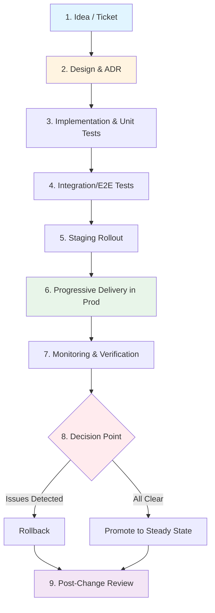
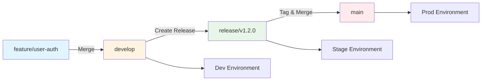
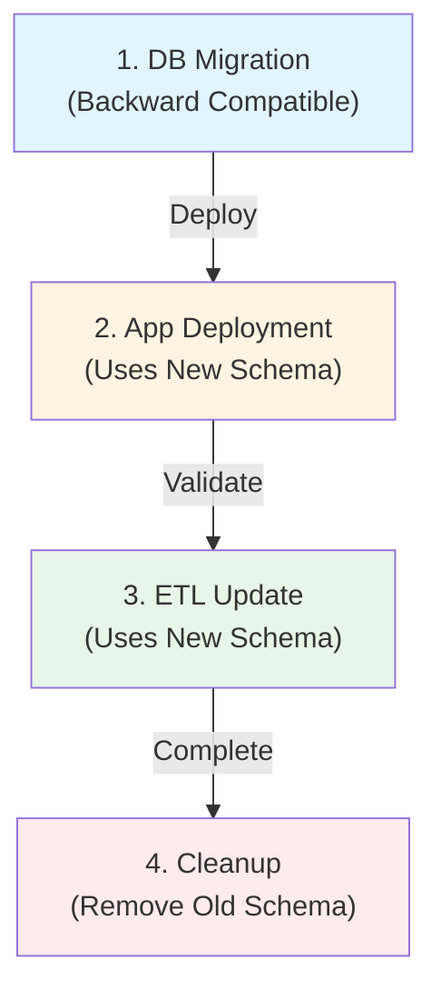
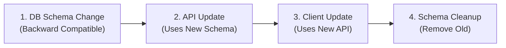
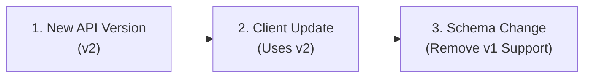

# Release Management, Change Governance, and Progressive Delivery: Best Practices for Distributed Systems

**Objective**: Master production-grade release management and progressive delivery for distributed systems. When you need to safely deploy changes across applications, databases, data pipelines, and ML systems—this guide provides complete patterns and implementations.

## Introduction

Release management is the discipline of safely moving changes from development to production. In distributed systems, this requires coordinating changes across multiple services, databases, pipelines, and infrastructure components. This guide provides a complete framework for managing releases with minimal risk and maximum confidence.

**What This Guide Covers**:
- Release lifecycle and change taxonomy
- Database and schema migration strategies
- Progressive delivery patterns (blue-green, canary, feature flags)
- Coordinating changes across microservices, data pipelines, and ML systems
- CI/CD pipelines and deployment gates
- Observability-driven releases
- Rollback strategies
- Change governance and reviews
- Air-gapped deployment strategies

**Prerequisites**:
- Understanding of Git workflows, CI/CD, and distributed systems
- Familiarity with Kubernetes, databases, and observability tools
- Experience with testing, monitoring, and incident response

## Goals, Non-Goals, and Scope

### Goals

1. **Unified Framework**: Provide a consistent process for changes moving from dev → stage → prod
2. **Safe Rollout Strategies**: Define safe deployment patterns for applications, infrastructure, and data
3. **Integration**: Integrate CI/CD, testing, observability, and DR into a coherent release process
4. **Risk Minimization**: Minimize user impact and operational risk during change
5. **Coordination**: Enable safe coordination of changes across multiple systems

### Non-Goals

1. **Not a Basic Git Tutorial**: Assumes Git literacy and familiarity with branching
2. **Not Pure CI Configuration**: Focuses on process and patterns, with examples
3. **Not a Testing Guide**: References testing but doesn't replace dedicated testing guides

### Scope

- **Application Services**: FastAPI, NiceGUI, Go/Rust backends
- **Databases**: Postgres/PostGIS, FDWs, pgaudit/pg_cron setups
- **Data Pipelines**: ETL/ELT, Prefect/Dask/Spark, GeoParquet pipelines
- **ML/ONNX/LLM Services**: Model deployments, inference pipelines
- **Infrastructure**: RKE2, Rancher, NGINX, object stores
- **Deployment Models**: Both air-gapped and connected environments

## Release Lifecycle Overview

### End-to-End Lifecycle

The release lifecycle follows a structured path from idea to production:



### Lifecycle Stages

**1. Idea / Ticket**:
- Feature request or bug report
- Initial risk assessment
- Ticket creation with labels

**2. Design & ADR**:
- Architecture Decision Record (see [ADR Guide](../architecture-design/adr-decision-governance.md))
- Design review
- Risk classification

**3. Implementation & Unit Tests**:
- Code implementation
- Unit test coverage
- Code review

**4. Integration/E2E Tests**:
- Integration tests
- End-to-end tests
- Performance tests (if applicable)

**5. Staging Rollout**:
- Deploy to staging environment
- Smoke tests
- Validation

**6. Progressive Delivery in Production**:
- Canary or blue-green deployment
- Gradual traffic shift
- Monitoring at each stage

**7. Monitoring & Verification**:
- SLO checks
- Error rate monitoring
- Performance validation

**8. Rollback or Promotion**:
- Rollback if issues detected
- Promote to steady state if successful

**9. Post-Change Review**:
- Review metrics and outcomes
- Document lessons learned
- Update runbooks

## Change Taxonomy & Risk Classification

### Risk Levels

| Risk Level | Examples | Required Tests | Required Approvals | Rollout Strategy | Monitoring |
|------------|----------|----------------|-------------------|------------------|------------|
| **Low** | Copy changes, UI tweaks, minor config changes | Unit tests | Peer review | Full rollout | Basic metrics |
| **Medium** | Non-breaking API additions, new indexes, small ETL additions | Unit + Integration | Tech lead | Canary (10% → 50% → 100%) | Error rate, latency |
| **High** | Breaking schema changes, index drops, large ETL rewrites, ML model changes | Unit + Integration + E2E + Load | Architecture review | Blue-green or extended canary (1% → 5% → 25% → 50% → 100%) | Full observability suite |

### Low-Risk Changes

**Examples**:
- Text/copy changes
- Minor UI styling
- Configuration tweaks (guarded by feature flags)
- Documentation updates

**Requirements**:
- Unit tests passing
- Peer code review
- Full rollout (no canary needed)
- Basic monitoring (error rate)

### Medium-Risk Changes

**Examples**:
- Non-breaking API additions
- New database indexes
- New API endpoints
- Small ETL pipeline additions
- Feature flag additions

**Requirements**:
- Unit + integration tests
- Tech lead approval
- Canary rollout (10% → 50% → 100%)
- Monitor error rate, latency, resource usage
- 15-minute observation period at each stage

### High-Risk Changes

**Examples**:
- Breaking database schema changes
- Index drops or modifications
- Large ETL rewrites
- New ML models in critical paths
- NGINX routing changes
- Cluster upgrades
- Data model changes

**Requirements**:
- Unit + integration + E2E + load tests
- Architecture review + CAB approval
- Blue-green or extended canary (1% → 5% → 25% → 50% → 100%)
- Full observability (metrics, logs, traces)
- 30-minute observation period at each stage
- Rollback plan documented

## Branching, Versioning & Environment Promotion

### Recommended Branching Model

**Branch Structure**:
```
main (production)
├── develop (integration)
│   ├── feature/* (feature branches)
│   └── hotfix/* (urgent fixes)
└── release/* (release candidates)
```

**Environment Mapping**:
- **dev** → `feature/*` branches, `develop` branch
- **stage** → `release/*` branches
- **prod** → `main` branch + tagged releases

### Versioning Strategy

**Semantic Versioning (SemVer)**:
```
vMAJOR.MINOR.PATCH
- MAJOR: Breaking changes
- MINOR: Backward-compatible additions
- PATCH: Bug fixes
```

**API Versioning**:
```yaml
# Path-based versioning
/api/v1/users
/api/v2/users

# Header-based versioning
Accept: application/vnd.api.v1+json
Accept: application/vnd.api.v2+json
```

**Schema Versioning**:
```python
# Alembic migration versioning
# migrations/versions/001_initial_schema.py
revision = '001'
down_revision = None

# migrations/versions/002_add_user_table.py
revision = '002'
down_revision = '001'
```

**ML Model Versioning**:
```python
# MLflow model versioning
import mlflow

mlflow.set_experiment("user-prediction")
with mlflow.start_run():
    mlflow.log_model(model, "model", registered_model_name="user-predictor")
    # Creates version 1, 2, 3, etc.
```

### Code Flow from Branch to Environment



### Tying Releases to ADRs and Changelogs

**Release Notes Template**:
```markdown
# Release v1.2.0

## Changes
- Added user authentication (ADR-0042)
- Database schema migration (Migration 002)
- New ML model for user prediction (Model v3)

## Breaking Changes
- API endpoint `/api/v1/users` deprecated, use `/api/v2/users`

## Migration Required
- Run Alembic migration 002 before deployment

## Related
- ADR-0042: User Authentication Strategy
- PR #123: Implement user auth
- Ticket #456: Add authentication
```

## Database & Schema Change Best Practices

### Backward-Compatible Migrations

**Expand → Migrate → Contract Pattern**:

```sql
-- Step 1: Expand (add new column, nullable)
ALTER TABLE users ADD COLUMN email_new TEXT;

-- Step 2: Migrate (populate new column)
UPDATE users SET email_new = email WHERE email IS NOT NULL;

-- Step 3: Contract (make new column NOT NULL, drop old)
ALTER TABLE users ALTER COLUMN email_new SET NOT NULL;
ALTER TABLE users DROP COLUMN email;
ALTER TABLE users RENAME COLUMN email_new TO email;
```

**Avoiding Destructive Changes**:

```sql
-- BAD: Immediate drop
ALTER TABLE users DROP COLUMN old_field;

-- GOOD: Deprecate first, drop later
-- Step 1: Mark as deprecated
COMMENT ON COLUMN users.old_field IS 'DEPRECATED: Will be removed in v2.0.0';

-- Step 2: Wait for all clients to migrate
-- Step 3: Drop in next major version
ALTER TABLE users DROP COLUMN old_field;
```

### Alembic Migration Example

```python
# migrations/versions/003_add_user_email.py
"""Add user email column

Revision ID: 003
Revises: 002
Create Date: 2024-01-15 10:00:00.000000
"""
from alembic import op
import sqlalchemy as sa

revision = '003'
down_revision = '002'
branch_labels = None
depends_on = None

def upgrade():
    # Expand: Add nullable column
    op.add_column('users', sa.Column('email', sa.String(255), nullable=True))
    
    # Migrate: Populate data (if needed)
    op.execute("""
        UPDATE users 
        SET email = username || '@example.com' 
        WHERE email IS NULL
    """)
    
    # Contract: Make NOT NULL
    op.alter_column('users', 'email', nullable=False)
    
    # Add index
    op.create_index('ix_users_email', 'users', ['email'], unique=True)

def downgrade():
    op.drop_index('ix_users_email', table_name='users')
    op.drop_column('users', 'email')
```

### Long-Running Migrations

**Online Schema Changes**:

```python
# migrations/versions/004_add_index_large_table.py
def upgrade():
    # Use CONCURRENTLY for large tables
    op.execute("""
        CREATE INDEX CONCURRENTLY idx_users_created_at 
        ON users(created_at)
    """)

def downgrade():
    op.execute("DROP INDEX CONCURRENTLY idx_users_created_at")
```

**Chunked Data Migrations**:

```python
# migrations/versions/005_backfill_user_data.py
def upgrade():
    # Process in chunks to avoid locking
    chunk_size = 10000
    offset = 0
    
    while True:
        result = op.execute(f"""
            UPDATE users 
            SET processed = true 
            WHERE id IN (
                SELECT id FROM users 
                WHERE processed = false 
                LIMIT {chunk_size} OFFSET {offset}
            )
        """)
        
        if result.rowcount == 0:
            break
        
        offset += chunk_size
```

### PostGIS-Specific Concerns

**Geospatial Index Changes**:

```python
# migrations/versions/006_add_geospatial_index.py
def upgrade():
    # GIST index for geometry columns
    op.execute("""
        CREATE INDEX CONCURRENTLY idx_locations_geom 
        ON locations USING GIST(geom)
    """)
    
    # SP-GIST for point clouds
    op.execute("""
        CREATE INDEX CONCURRENTLY idx_points_geom 
        ON points USING SPGIST(geom)
    """)
```

**Raster vs Vector Schema Changes**:

```python
# migrations/versions/007_add_raster_table.py
def upgrade():
    op.execute("""
        CREATE TABLE rasters (
            id SERIAL PRIMARY KEY,
            name TEXT NOT NULL,
            rast RASTER NOT NULL
        )
    """)
    
    # Add raster constraints
    op.execute("""
        SELECT AddRasterConstraints(
            'rasters'::name,
            'rast'::name
        )
    """)
```

### Coordinating DB, App, and ETL Changes

**Change Coordination Workflow**:



**Example Coordination**:

```yaml
# release-plan.yaml
release:
  version: v1.2.0
  phases:
    - name: database-migration
      order: 1
      changes:
        - type: migration
          file: migrations/003_add_user_email.py
          backward_compatible: true
    
    - name: application-deployment
      order: 2
      depends_on: [database-migration]
      changes:
        - type: application
          image: app:v1.2.0
          uses_new_schema: true
    
    - name: etl-update
      order: 3
      depends_on: [application-deployment]
      changes:
        - type: etl
          pipeline: user-processing
          version: v2.0.0
          uses_new_schema: true
    
    - name: cleanup
      order: 4
      depends_on: [etl-update]
      changes:
        - type: migration
          file: migrations/004_remove_old_fields.py
          requires_all_clients_updated: true
```

## Progressive Delivery Patterns

### Blue-Green Deployments

**Concept**: Run two identical production environments side-by-side, switch traffic between them.

**NGINX Configuration**:
```nginx
# nginx/blue-green.conf
upstream app_backend {
    # Blue (current)
    server app-blue:8000;
    
    # Green (new)
    server app-green:8000 backup;
}

server {
    listen 80;
    location / {
        proxy_pass http://app_backend;
    }
}

# Switch to green
# Change to:
upstream app_backend {
    server app-green:8000;
    server app-blue:8000 backup;
}
```

**Kubernetes Blue-Green**:
```yaml
# k8s/blue-green-deployment.yaml
apiVersion: apps/v1
kind: Deployment
metadata:
  name: app-blue
spec:
  replicas: 3
  selector:
    matchLabels:
      app: myapp
      version: blue
  template:
    metadata:
      labels:
        app: myapp
        version: blue
    spec:
      containers:
        - name: app
          image: app:v1.1.0
---
apiVersion: apps/v1
kind: Deployment
metadata:
  name: app-green
spec:
  replicas: 3
  selector:
    matchLabels:
      app: myapp
      version: green
  template:
    metadata:
      labels:
        app: myapp
        version: green
    spec:
      containers:
        - name: app
          image: app:v1.2.0
---
apiVersion: v1
kind: Service
metadata:
  name: app-service
spec:
  selector:
    app: myapp
    version: blue  # Switch to 'green' to promote
  ports:
    - port: 80
      targetPort: 8000
```

**Rollback Strategy**:
```bash
# Switch back to blue
kubectl patch service app-service -p '{"spec":{"selector":{"version":"blue"}}}'
```

### Canary Releases

**Gradual Traffic Shifting**:

```yaml
# k8s/canary-deployment.yaml
apiVersion: apps/v1
kind: Deployment
metadata:
  name: app-stable
spec:
  replicas: 9  # 90% of traffic
  selector:
    matchLabels:
      app: myapp
      version: stable
  template:
    metadata:
      labels:
        app: myapp
        version: stable
    spec:
      containers:
        - name: app
          image: app:v1.1.0
---
apiVersion: apps/v1
kind: Deployment
metadata:
  name: app-canary
spec:
  replicas: 1  # 10% of traffic
  selector:
    matchLabels:
      app: myapp
      version: canary
  template:
    metadata:
      labels:
        app: myapp
        version: canary
    spec:
      containers:
        - name: app
          image: app:v1.2.0
---
apiVersion: v1
kind: Service
metadata:
  name: app-service
spec:
  selector:
    app: myapp  # Routes to both stable and canary
  ports:
    - port: 80
      targetPort: 8000
```

**NGINX Canary with Weighted Routing**:
```nginx
# nginx/canary.conf
upstream app_backend {
    # 90% to stable
    server app-stable:8000 weight=90;
    # 10% to canary
    server app-canary:8000 weight=10;
}

server {
    listen 80;
    location / {
        proxy_pass http://app_backend;
    }
}

# Gradually increase canary weight:
# 10% → 25% → 50% → 100%
```

**Automated Canary Promotion**:
```python
# scripts/auto_canary_promotion.py
import time
from prometheus_client import query_range

def check_canary_health(canary_version: str, duration_minutes: int = 15) -> bool:
    """Check if canary is healthy and should be promoted"""
    end_time = time.time()
    start_time = end_time - (duration_minutes * 60)
    
    # Check error rate
    error_rate = query_range(
        'rate(http_requests_total{status=~"5.."}[5m])',
        start_time,
        end_time
    )
    
    if error_rate > 0.01:  # > 1% error rate
        return False
    
    # Check latency
    p95_latency = query_range(
        'histogram_quantile(0.95, rate(http_request_duration_seconds_bucket[5m]))',
        start_time,
        end_time
    )
    
    if p95_latency > 0.5:  # > 500ms P95
        return False
    
    return True

def promote_canary():
    """Promote canary to stable"""
    # Increase canary replicas
    subprocess.run([
        "kubectl", "scale", "deployment/app-canary",
        "--replicas=10"
    ])
    
    # Decrease stable replicas
    subprocess.run([
        "kubectl", "scale", "deployment/app-stable",
        "--replicas=0"
    ])
```

### Feature Flags

**API Layer Feature Flags**:
```python
# api/feature_flags.py
from fastapi import Depends, HTTPException
import redis

class FeatureFlags:
    def __init__(self, redis_client: redis.Redis):
        self.redis = redis_client
    
    def is_enabled(self, flag: str, user_id: str = None) -> bool:
        """Check if feature flag is enabled"""
        # Check global flag
        global_value = self.redis.get(f"feature_flag:{flag}")
        if global_value and global_value.decode() == "true":
            return True
        
        # Check user-specific flag
        if user_id:
            user_value = self.redis.get(f"feature_flag:{flag}:{user_id}")
            if user_value and user_value.decode() == "true":
                return True
        
        return False

flags = FeatureFlags(redis_client)

@app.get("/api/v2/users")
async def get_users_v2(
    user_id: str = Depends(get_current_user),
    flags: FeatureFlags = Depends(lambda: flags)
):
    """New API endpoint behind feature flag"""
    if not flags.is_enabled("new_user_api", user_id):
        raise HTTPException(status_code=404, detail="Feature not enabled")
    
    return {"users": [...]}
```

**UI Layer Feature Flags (NiceGUI)**:
```python
# nicegui/feature_flags.py
from nicegui import ui
import redis

class UIFeatureFlags:
    def __init__(self, redis_client: redis.Redis):
        self.redis = redis_client
    
    def show_feature(self, flag: str, user_id: str = None) -> bool:
        """Check if feature should be shown in UI"""
        return self.redis.get(f"feature_flag:{flag}") == b"true"

flags = UIFeatureFlags(redis_client)

@ui.page("/dashboard")
async def dashboard():
    if flags.show_feature("new_dashboard"):
        # New dashboard UI
        ui.label("New Dashboard")
    else:
        # Old dashboard UI
        ui.label("Old Dashboard")
```

**ML Inference Feature Flags**:
```python
# ml/feature_flags.py
class MLFeatureFlags:
    def __init__(self, redis_client: redis.Redis):
        self.redis = redis_client
    
    def get_model_version(self, model_name: str) -> str:
        """Get model version from feature flag"""
        flag_value = self.redis.get(f"model_version:{model_name}")
        if flag_value:
            return flag_value.decode()
        return "v1"  # Default version

flags = MLFeatureFlags(redis_client)

def predict(input_data):
    """Run prediction with version from feature flag"""
    model_version = flags.get_model_version("user-predictor")
    
    if model_version == "v2":
        return model_v2.predict(input_data)
    else:
        return model_v1.predict(input_data)
```

**Kill Switch**:
```python
# api/kill_switch.py
class KillSwitch:
    def __init__(self, redis_client: redis.Redis):
        self.redis = redis_client
    
    def is_killed(self, feature: str) -> bool:
        """Check if feature is killed"""
        return self.redis.get(f"kill_switch:{feature}") == b"true"
    
    def kill_feature(self, feature: str):
        """Kill a feature immediately"""
        self.redis.set(f"kill_switch:{feature}", "true", ex=3600)  # 1 hour TTL

kill_switch = KillSwitch(redis_client)

@app.post("/api/process")
async def process_data(data: dict):
    if kill_switch.is_killed("data_processing"):
        raise HTTPException(
            status_code=503,
            detail="Feature temporarily disabled"
        )
    
    return process(data)
```

## Coordinating Application, Data & ML Changes

### Schema-First vs API-First Releases

**Schema-First Approach**:


**API-First Approach**:


### ML Model Rollout

**Shadow Deployment**:
```python
# ml/shadow_deployment.py
class ShadowModel:
    def __init__(self, primary_model, shadow_model):
        self.primary = primary_model
        self.shadow = shadow_model
        self.mlflow = mlflow_client
    
    def predict(self, input_data):
        """Run primary model, shadow model in background"""
        # Primary prediction (returned to user)
        primary_result = self.primary.predict(input_data)
        
        # Shadow prediction (logged for comparison)
        shadow_result = self.shadow.predict(input_data)
        
        # Log comparison
        self.mlflow.log_metric("prediction_diff", 
                              abs(primary_result - shadow_result))
        
        return primary_result
```

**A/B Testing Between Models**:
```python
# ml/ab_testing.py
import random

class ABModelTesting:
    def __init__(self, model_a, model_b):
        self.model_a = model_a
        self.model_b = model_b
        self.redis = redis_client
    
    def predict(self, user_id: str, input_data):
        """Route to model A or B based on user"""
        # Consistent assignment per user
        assignment = self.get_assignment(user_id)
        
        if assignment == "A":
            result = self.model_a.predict(input_data)
            self.log_result(user_id, "A", result)
        else:
            result = self.model_b.predict(input_data)
            self.log_result(user_id, "B", result)
        
        return result
    
    def get_assignment(self, user_id: str) -> str:
        """Get consistent assignment for user"""
        assignment = self.redis.get(f"ab_test:{user_id}")
        if not assignment:
            assignment = random.choice(["A", "B"])
            self.redis.set(f"ab_test:{user_id}", assignment)
        return assignment.decode()
```

**Fallback to Last Known Good**:
```python
# ml/fallback_model.py
class ModelWithFallback:
    def __init__(self, current_model, fallback_model):
        self.current = current_model
        self.fallback = fallback_model
        self.error_count = 0
        self.error_threshold = 10
    
    def predict(self, input_data):
        """Predict with fallback on errors"""
        try:
            result = self.current.predict(input_data)
            self.error_count = 0  # Reset on success
            return result
        except Exception as e:
            self.error_count += 1
            
            if self.error_count >= self.error_threshold:
                # Switch to fallback
                return self.fallback.predict(input_data)
            else:
                raise
```

### Coordinating ETL and Dashboards

**ETL Pipeline Release**:
```python
# etl/release_coordination.py
class ETLReleaseCoordinator:
    def __init__(self, prefect_client, grafana_client):
        self.prefect = prefect_client
        self.grafana = grafana_client
    
    def release_etl_pipeline(self, pipeline_version: str):
        """Release ETL pipeline with dashboard coordination"""
        # 1. Deploy new pipeline version
        flow_run = self.prefect.deploy_flow(
            "data-processing",
            version=pipeline_version
        )
        
        # 2. Update dashboard config
        self.grafana.update_datasource(
            "prefect",
            config={"version": pipeline_version}
        )
        
        # 3. Wait for first successful run
        self.prefect.wait_for_run(flow_run.id, status="Success")
        
        # 4. Validate data quality
        if not self.validate_data_quality():
            raise ValueError("Data quality check failed")
        
        return flow_run
```

## Release Pipelines and Gates (CI/CD)

### CI Pipeline

```yaml
# .github/workflows/ci.yaml
name: CI Pipeline
on:
  pull_request:
  push:
    branches: [develop, main]

jobs:
  test:
    runs-on: ubuntu-latest
    steps:
      - uses: actions/checkout@v3
      
      - name: Run unit tests
        run: pytest tests/unit/
      
      - name: Run integration tests
        run: pytest tests/integration/
      
      - name: Run E2E tests
        run: pytest tests/e2e/
  
  security:
    runs-on: ubuntu-latest
    steps:
      - uses: actions/checkout@v3
      
      - name: Trivy scan
        uses: aquasecurity/trivy-action@master
        with:
          scan-type: 'fs'
          scan-ref: '.'
      
      - name: Generate SBOM
        run: |
          syft packages . -o spdx > sbom.spdx
  
  validate:
    runs-on: ubuntu-latest
    steps:
      - uses: actions/checkout@v3
      
      - name: Validate K8s manifests
        run: |
          kubectl apply --dry-run=client -f k8s/
      
      - name: Validate Helm charts
        run: |
          helm lint helm/app
          helm template helm/app | kubeconform -strict
      
      - name: Validate with OPA
        run: |
          helm template helm/app | conftest test -p policies/
  
  build:
    runs-on: ubuntu-latest
    needs: [test, security, validate]
    steps:
      - uses: actions/checkout@v3
      
      - name: Build multi-arch image
        run: |
          docker buildx build \
            --platform linux/amd64,linux/arm64 \
            -t app:${{ github.sha }} \
            --push .
```

### CD Pipeline

```yaml
# .github/workflows/cd.yaml
name: CD Pipeline
on:
  push:
    branches: [main, develop]
    tags:
      - 'v*'

jobs:
  deploy-dev:
    if: github.ref == 'refs/heads/develop'
    runs-on: ubuntu-latest
    steps:
      - uses: actions/checkout@v3
      
      - name: Deploy to dev
        run: |
          kubectl apply -f k8s/app/ -n dev
        env:
          KUBECONFIG: ${{ secrets.KUBECONFIG_DEV }}
  
  deploy-stage:
    if: github.ref == 'refs/heads/main'
    runs-on: ubuntu-latest
    needs: []
    environment:
      name: stage
      url: https://stage.example.com
    steps:
      - uses: actions/checkout@v3
      
      - name: Deploy to stage
        run: |
          kubectl apply -f k8s/app/ -n stage
        env:
          KUBECONFIG: ${{ secrets.KUBECONFIG_STAGE }}
  
  deploy-prod:
    if: startsWith(github.ref, 'refs/tags/v')
    runs-on: ubuntu-latest
    needs: []
    environment:
      name: production
      url: https://prod.example.com
    steps:
      - uses: actions/checkout@v3
      
      - name: Deploy to prod (canary)
        run: |
          # Deploy canary
          kubectl set image deployment/app-canary app=app:${{ github.ref_name }} -n prod
          kubectl scale deployment/app-canary --replicas=1 -n prod
          
          # Wait for canary health check
          ./scripts/wait_for_canary.sh
          
          # Promote canary
          kubectl scale deployment/app-canary --replicas=10 -n prod
          kubectl scale deployment/app-stable --replicas=0 -n prod
        env:
          KUBECONFIG: ${{ secrets.KUBECONFIG_PROD }}
```

### Deployment Gates

**Required Gates**:
1. **Tests Passing**: All unit, integration, E2E tests pass
2. **Static Analysis**: No critical security issues
3. **Policy Checks**: OPA/Kyverno policies pass
4. **Manual Approval**: Required for high-risk changes
5. **SLO Validation**: Pre-deploy SLO checks pass

**Gate Implementation**:
```python
# scripts/deployment_gates.py
class DeploymentGates:
    def __init__(self):
        self.prometheus = prometheus_client
        self.github = github_client
    
    def check_all_gates(self, pr_number: int, risk_level: str) -> bool:
        """Check all deployment gates"""
        gates = [
            self.check_tests(pr_number),
            self.check_security_scan(pr_number),
            self.check_policy_validation(pr_number),
        ]
        
        if risk_level == "high":
            gates.append(self.check_manual_approval(pr_number))
        
        gates.append(self.check_slo_baseline())
        
        return all(gates)
    
    def check_tests(self, pr_number: int) -> bool:
        """Check if all tests pass"""
        checks = self.github.get_pr_checks(pr_number)
        return all(c.status == "success" for c in checks)
    
    def check_manual_approval(self, pr_number: int) -> bool:
        """Check for manual approval"""
        reviews = self.github.get_pr_reviews(pr_number)
        return any(r.state == "APPROVED" and r.author in APPROVERS for r in reviews)
    
    def check_slo_baseline(self) -> bool:
        """Check SLO baseline before deployment"""
        error_rate = self.prometheus.query('rate(http_requests_total{status=~"5.."}[5m])')
        latency = self.prometheus.query('histogram_quantile(0.95, rate(http_request_duration_seconds_bucket[5m]))')
        
        return error_rate < 0.01 and latency < 0.5
```

## Observability-Driven Releases

### Pre-Defined SLOs

```yaml
# slos/production-slos.yaml
slos:
  api:
    latency:
      p50: 50ms
      p95: 200ms
      p99: 500ms
    error_rate: 0.01  # 1%
    availability: 0.999  # 99.9%
  
  database:
    query_latency:
      p95: 100ms
      p99: 500ms
    connection_pool_utilization: 0.8  # 80%
  
  ml_inference:
    latency:
      p95: 200ms
      p99: 500ms
    error_rate: 0.005  # 0.5%
```

### Must-Watch Metrics During Rollout

**API Metrics**:
```promql
# Error rate
rate(http_requests_total{status=~"5.."}[5m]) / rate(http_requests_total[5m])

# Latency percentiles
histogram_quantile(0.95, rate(http_request_duration_seconds_bucket[5m]))
histogram_quantile(0.99, rate(http_request_duration_seconds_bucket[5m]))

# Request rate
rate(http_requests_total[5m])
```

**Database Metrics**:
```promql
# CPU utilization
rate(process_cpu_seconds_total[5m])

# I/O wait
rate(pg_stat_io_blks_read[5m])

# Lock wait time
pg_locks_waiting

# Slow queries
pg_stat_statements_mean_exec_time > 1.0
```

**ML Inference Metrics**:
```promql
# Inference latency
histogram_quantile(0.95, rate(ml_inference_duration_seconds_bucket[5m]))

# Error rate
rate(ml_inference_errors_total[5m]) / rate(ml_inference_requests_total[5m])

# Model version distribution
sum by (model_version) (ml_inference_requests_total)
```

### Release Dashboard

```json
{
  "dashboard": {
    "title": "Release Monitoring",
    "panels": [
      {
        "title": "Error Rate (Old vs New)",
        "targets": [
          {
            "expr": "rate(http_requests_total{version=\"stable\",status=~\"5..\"}[5m])",
            "legendFormat": "Stable"
          },
          {
            "expr": "rate(http_requests_total{version=\"canary\",status=~\"5..\"}[5m])",
            "legendFormat": "Canary"
          }
        ]
      },
      {
        "title": "Latency P95 (Old vs New)",
        "targets": [
          {
            "expr": "histogram_quantile(0.95, rate(http_request_duration_seconds_bucket{version=\"stable\"}[5m]))",
            "legendFormat": "Stable P95"
          },
          {
            "expr": "histogram_quantile(0.95, rate(http_request_duration_seconds_bucket{version=\"canary\"}[5m]))",
            "legendFormat": "Canary P95"
          }
        ]
      }
    ]
  }
}
```

## Rollback Strategies

### Application Rollback

**Kubernetes Rollback**:
```bash
# Rollback to previous deployment
kubectl rollout undo deployment/app -n prod

# Rollback to specific revision
kubectl rollout undo deployment/app --to-revision=3 -n prod

# View rollout history
kubectl rollout history deployment/app -n prod
```

**Docker Rollback**:
```bash
# Rollback to previous image tag
kubectl set image deployment/app app=app:v1.1.0 -n prod

# Or use Helm
helm rollback app-release 1
```

**Feature Flag Rollback**:
```python
# Immediately disable feature
redis_client.set("feature_flag:new_feature", "false")

# Or use kill switch
redis_client.set("kill_switch:new_feature", "true", ex=3600)
```

### Database Rollback

**Reversible Migrations**:
```python
# migrations/versions/008_add_column.py
def upgrade():
    op.add_column('users', sa.Column('new_field', sa.String(255)))

def downgrade():
    op.drop_column('users', 'new_field')

# Rollback
alembic downgrade -1
```

**Forward-Only Migrations with Contingency**:
```python
# migrations/versions/009_complex_change.py
def upgrade():
    # Complex migration that can't be easily reversed
    op.execute("""
        ALTER TABLE users 
        ADD COLUMN new_field TEXT,
        DROP COLUMN old_field
    """)

def downgrade():
    # Contingency plan: restore from backup
    raise NotImplementedError(
        "This migration cannot be automatically reversed. "
        "Restore from backup if rollback is required."
    )
```

**Point-in-Time Recovery**:
```bash
# Restore database to point in time
pg_restore --dbname=mydb \
  --clean \
  --if-exists \
  backup_20240115_120000.dump

# Or use PITR
psql -c "SELECT pg_start_backup('rollback');"
# Restore WAL files to target time
psql -c "SELECT pg_stop_backup();"
```

### ML Model Rollback

```python
# ml/rollback.py
class ModelRollback:
    def __init__(self, mlflow_client):
        self.mlflow = mlflow_client
    
    def rollback_model(self, model_name: str, target_version: int):
        """Rollback to previous model version"""
        # Get current version
        current_version = self.mlflow.get_latest_model_version(model_name)
        
        # Transition to previous version
        self.mlflow.transition_model_version_stage(
            name=model_name,
            version=target_version,
            stage="Production"
        )
        
        # Archive current version
        self.mlflow.transition_model_version_stage(
            name=model_name,
            version=current_version,
            stage="Archived"
        )
```

### Data & ETL Rollback

**Quarantining Bad Data**:
```python
# etl/quarantine.py
def quarantine_bad_data(table_name: str, condition: str):
    """Move bad data to quarantine table"""
    # Create quarantine table if not exists
    op.execute(f"""
        CREATE TABLE IF NOT EXISTS {table_name}_quarantine 
        AS TABLE {table_name} WITH NO DATA
    """)
    
    # Move bad data
    op.execute(f"""
        INSERT INTO {table_name}_quarantine
        SELECT * FROM {table_name}
        WHERE {condition}
    """)
    
    # Delete from main table
    op.execute(f"""
        DELETE FROM {table_name}
        WHERE {condition}
    """)
```

**Re-running ETL with Corrected Logic**:
```python
# etl/rerun.py
def rerun_etl_pipeline(start_date: datetime, end_date: datetime):
    """Re-run ETL pipeline for date range"""
    from prefect import flow
    
    @flow
    def reprocess_data():
        # Reprocess data with corrected logic
        process_data(start_date, end_date)
    
    # Run flow
    flow_run = reprocess_data()
    return flow_run
```

## Change Governance & Reviews

### Change Advisory Board (CAB)

**When to Require CAB Review**:
- High-risk changes
- Production database migrations
- Infrastructure changes
- Security-sensitive changes
- Breaking API changes

**CAB Review Process**:
```markdown
# Change Record Template

## Change Information
- **Change ID**: CHG-2024-001
- **Title**: Add user authentication
- **Risk Level**: High
- **Requester**: Engineering Team
- **Scheduled Date**: 2024-01-20

## Related Artifacts
- **ADR**: ADR-0042
- **PR**: #123
- **Ticket**: #456

## Change Description
Add OAuth2 authentication to API endpoints.

## Risk Assessment
- **Impact**: High (affects all API endpoints)
- **Probability**: Medium (well-tested, but complex)
- **Mitigation**: Blue-green deployment, feature flags

## Rollout Plan
1. Deploy to staging (Day 1)
2. Blue-green deployment to prod (Day 2)
3. Monitor for 24 hours
4. Promote to steady state (Day 3)

## Rollback Plan
1. Switch traffic back to blue (old version)
2. Disable feature flags
3. Restore previous API configuration

## Test Plan
- [ ] Unit tests
- [ ] Integration tests
- [ ] E2E tests
- [ ] Load tests

## Observability Plan
- Monitor error rate (< 1%)
- Monitor latency (P95 < 200ms)
- Monitor authentication success rate

## Approval
- [ ] Tech Lead
- [ ] Security Team
- [ ] Architecture Review
```

### Peer Review Expectations

**Database Migration Review**:
- Reviewed by database expert
- Checked for backward compatibility
- Validated performance impact
- Reviewed rollback plan

**Security-Sensitive Changes**:
- Reviewed by security team
- Security scan results reviewed
- Threat model updated if needed

**ML Changes**:
- Reviewed for model quality
- Checked for data drift impact
- Validated inference performance

## Releases in Air-Gapped Environments

### Packaging Releases

**OCI Image Bundle**:
```bash
# Create image bundle
skopeo copy docker://app:v1.2.0 oci:app-bundle:v1.2.0

# Export to tar
skopeo copy oci:app-bundle:v1.2.0 docker-archive:app-v1.2.0.tar

# Include SBOM
syft packages app-v1.2.0.tar -o spdx > app-v1.2.0.sbom
```

**Helm Chart Bundle**:
```bash
# Package Helm chart
helm package helm/app

# Create bundle
tar -czf release-bundle-v1.2.0.tar.gz \
    app-1.2.0.tgz \
    k8s/ \
    config/ \
    app-v1.2.0.sbom \
    checksums.txt
```

**Verification**:
```bash
# Verify checksums
sha256sum -c checksums.txt

# Verify signatures
gpg --verify release-bundle-v1.2.0.tar.gz.sig
```

### Offline Promotion

**Directory Structure**:
```
release-bundle-v1.2.0/
├── images/
│   ├── app-v1.2.0.tar
│   └── app-v1.2.0.sbom
├── charts/
│   └── app-1.2.0.tgz
├── manifests/
│   └── k8s/
├── config/
│   └── values-prod.yaml
└── checksums.txt
```

**Offline Deployment**:
```bash
# Load images
docker load < images/app-v1.2.0.tar

# Install Helm chart
helm install app-release charts/app-1.2.0.tgz \
    -f config/values-prod.yaml \
    -n prod

# Apply manifests
kubectl apply -f manifests/k8s/ -n prod
```

## Anti-Patterns in Release Management

### 1. "Big Bang" Deploys

**Symptom**: Deploying everything at once with no canary or blue-green.

**Why Dangerous**: Single point of failure, difficult to isolate issues, high blast radius.

**Fix**: Use canary or blue-green deployments, gradual rollout.

**Prevention**: Enforce progressive delivery in CI/CD pipelines.

### 2. Deploying DB Migrations and App Changes Out of Order

**Symptom**: Application deployed before database migration completes.

**Why Dangerous**: Application tries to use schema that doesn't exist, causing errors.

**Fix**: Coordinate deployments, deploy DB first, then app.

**Prevention**: Use deployment orchestration tools, define dependencies.

### 3. Relying Only on Manual Testing After Deploy

**Symptom**: No automated tests, only manual verification.

**Why Dangerous**: Slow feedback, human error, inconsistent testing.

**Fix**: Implement automated E2E tests, smoke tests, health checks.

**Prevention**: Require automated tests in CI/CD pipeline.

### 4. No Rollback Plan

**Symptom**: No documented or tested rollback procedure.

**Why Dangerous**: Can't quickly recover from failures, extended downtime.

**Fix**: Document rollback procedures, test them regularly.

**Prevention**: Require rollback plan for all high-risk changes.

### 5. No SLOs or Metrics Defined Before Rollout

**Symptom**: Deploying without knowing what "good" looks like.

**Why Dangerous**: Can't detect problems, no objective success criteria.

**Fix**: Define SLOs before deployment, set up monitoring.

**Prevention**: Require SLO definition in change records.

### 6. One Giant Release Every Six Months

**Symptom**: Infrequent, large releases with many changes.

**Why Dangerous**: High risk, difficult to debug, long rollback windows.

**Fix**: Release frequently, small incremental changes.

**Prevention**: Encourage continuous deployment, small PRs.

### 7. "Test in Prod" Without Guardrails

**Symptom**: Using production as testing environment.

**Why Dangerous**: Real user impact, data corruption risk.

**Fix**: Use feature flags, canary deployments, staging environment.

**Prevention**: Require staging deployment before production.

### 8. Feature Flags with No Lifecycle

**Symptom**: Feature flags never removed, accumulate technical debt.

**Why Dangerous**: Code complexity, maintenance burden, confusion.

**Fix**: Set expiration dates, regular cleanup, remove unused flags.

**Prevention**: Require flag removal plan in feature design.

### 9. Changes That Silently Alter Data Semantics

**Symptom**: Data meaning changes without notification.

**Why Dangerous**: Incorrect analysis, wrong business decisions.

**Fix**: Document data changes, version schemas, notify consumers.

**Prevention**: Require schema versioning, data contracts.

### 10. Releasing to Prod Directly from Dev Branches

**Symptom**: Bypassing staging, deploying dev code to production.

**Why Dangerous**: Untested code, configuration mismatches.

**Fix**: Enforce branch protection, require staging deployment.

**Prevention**: CI/CD pipeline enforcement, branch policies.

### 11. Untracked Hotfixes Applied Directly in Production

**Symptom**: Manual changes in production, not tracked in Git.

**Why Dangerous**: Configuration drift, lost changes, no audit trail.

**Fix**: All changes via Git, use GitOps, document hotfixes.

**Prevention**: Enforce GitOps, restrict direct cluster access.

### 12. Ignoring Warnings from Observability During Deploy

**Symptom**: Continuing deployment despite error rate spikes.

**Why Dangerous**: Amplifies problems, extends recovery time.

**Fix**: Implement automated rollback on SLO violations.

**Prevention**: Require observability gates in deployment pipeline.

## Checklists & Templates

### Pre-Release Checklist

- [ ] All tests passing (unit, integration, E2E)
- [ ] Security scans passed
- [ ] Configuration validated
- [ ] Database migrations reviewed
- [ ] Rollback plan documented
- [ ] SLOs defined
- [ ] Monitoring dashboards ready
- [ ] Change record created
- [ ] Approvals obtained (if required)
- [ ] Release notes prepared

### DB Migration Checklist

- [ ] Migration is backward compatible
- [ ] Migration tested in dev/stage
- [ ] Rollback plan documented
- [ ] Performance impact assessed
- [ ] Long-running migration identified
- [ ] Backup taken before migration
- [ ] Migration reviewed by DB expert
- [ ] Application code updated to use new schema
- [ ] Application tested with new schema

### ML Model Deployment Checklist

- [ ] Model performance validated
- [ ] Data drift checked
- [ ] Model version tagged
- [ ] Feature store updated
- [ ] Inference service updated
- [ ] A/B test or shadow deployment planned
- [ ] Fallback model identified
- [ ] Monitoring for model metrics
- [ ] Rollback procedure documented

### Progressive Delivery Checklist

- [ ] Canary/blue-green infrastructure ready
- [ ] Traffic splitting configured
- [ ] Observability dashboards ready
- [ ] SLO thresholds defined
- [ ] Automated promotion/rollback configured
- [ ] Manual intervention plan documented
- [ ] Gradual rollout plan (percentages, timing)
- [ ] Success criteria defined

### Rollback Readiness Checklist

- [ ] Previous version tagged and available
- [ ] Rollback procedure documented
- [ ] Rollback tested in staging
- [ ] Database rollback plan (if applicable)
- [ ] Feature flag rollback ready
- [ ] Monitoring for rollback impact
- [ ] Communication plan for rollback

### Post-Release Review Checklist

- [ ] Metrics reviewed (error rate, latency, throughput)
- [ ] SLOs met
- [ ] Incidents documented (if any)
- [ ] Lessons learned captured
- [ ] Runbooks updated
- [ ] Change record closed
- [ ] Team notified of completion

### Release Plan Template

```markdown
# Release Plan: v1.2.0

## Release Information
- **Version**: v1.2.0
- **Release Date**: 2024-01-20
- **Risk Level**: Medium
- **Release Manager**: [Name]

## Changes Included
- User authentication (ADR-0042)
- Database schema migration (Migration 003)
- New ML model (Model v3)

## Deployment Plan
1. **Staging** (Day 1, 10:00 AM)
   - Deploy to staging
   - Run smoke tests
   - Validate functionality

2. **Production Canary** (Day 2, 2:00 AM)
   - Deploy canary (1% traffic)
   - Monitor for 30 minutes
   - Increase to 10% if healthy

3. **Production Gradual Rollout** (Day 2, ongoing)
   - 10% → 25% → 50% → 100%
   - 30-minute observation at each stage

4. **Steady State** (Day 3)
   - Promote to stable
   - Remove canary deployment

## Rollback Plan
1. Scale canary to 0 replicas
2. Scale stable to full replicas
3. Disable feature flags if needed
4. Restore database if migration rolled back

## Success Criteria
- Error rate < 1%
- Latency P95 < 200ms
- All smoke tests passing
- No critical incidents

## Monitoring
- Dashboard: [Link]
- Alerts: [Link]
- SLOs: [Link]

## Communication
- Team notification: [Slack channel]
- Status page: [Link]
- Rollback notification: [Process]
```

## See Also

- **[ADR and Technical Decision Governance](../architecture-design/adr-decision-governance.md)** - Decision recording
- **[Configuration Management](configuration-management.md)** - Config governance
- **[System Resilience](../operations-monitoring/system-resilience-and-concurrency.md)** - Resilience patterns
- **[Testing Best Practices](../operations-monitoring/testing-best-practices.md)** - Testing strategies

---

*This guide provides a complete framework for release management. Start with risk classification, implement progressive delivery, and monitor closely. The goal is safe, reliable releases with minimal user impact.*

