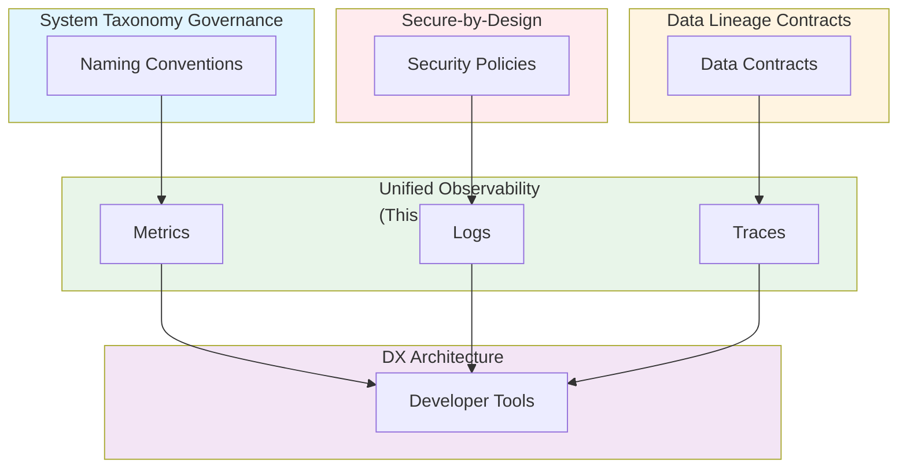

# Observability as Architecture: Unified Telemetry Models Across Clusters, Services, and Languages

**Objective**: Establish a unified telemetry model across all systems, services, and languages. When you need structured logging, when you want distributed tracing, when you need real-time dashboards—this guide provides the complete framework.

## Introduction

Observability is not just monitoring—it's an architectural concern that enables understanding system behavior, debugging issues, and optimizing performance. This guide establishes unified telemetry patterns across all systems.

**What This Guide Covers**:
- Structured logging formats
- Metric naming schema (linked to taxonomy)
- Distributed tracing (OpenTelemetry)
- Trace propagation standards across microservices
- Real-time dashboards tied to lineage
- Postgres/Redis/K8s observability integration
- Anomaly detection pipelines
- Log retention and cost optimization

**Prerequisites**:
- Understanding of observability principles
- Familiarity with Prometheus, Grafana, Loki
- Experience with OpenTelemetry

**Related Documents**:
This document integrates with:
- **[System Taxonomy Governance](../architecture-design/system-taxonomy-governance.md)** - Metrics and logs use taxonomy
- **[Data Lineage Contracts](../database-data/data-lineage-contracts.md)** - Observability tracks lineage
- **[Secure-by-Design Polyglot](../security/secure-by-design-polyglot.md)** - Security telemetry integration
- **[DX Architecture and Golden Paths](../python/dx-architecture-and-golden-paths.md)** - Developer tools use observability

## The Philosophy of Unified Observability

### Observability as Architecture

**Principle**: Observability is not optional—it's fundamental.

**Example**:
```python
# Observability built in
class ObservableService:
    def __init__(self):
        self.logger = StructuredLogger()
        self.metrics = MetricsCollector()
        self.tracer = Tracer()
        # Observability is foundational
```

### Three Pillars

**Logs, Metrics, Traces**:
- **Logs**: Event records
- **Metrics**: Aggregated measurements
- **Traces**: Request flows

## Structured Logging Formats

### Log Schema

**Pattern**: Consistent log structure.

**Example**:
```json
{
  "timestamp": "2024-01-15T12:00:00Z",
  "level": "INFO",
  "service": "user-api",
  "domain": "user",
  "component": "api",
  "trace_id": "abc123",
  "span_id": "def456",
  "message": "User created",
  "metadata": {
    "user_id": "123",
    "action": "create_user"
  }
}
```

### Language-Specific Logging

**Python**:
```python
import structlog

logger = structlog.get_logger()
logger.info(
    "user_created",
    user_id="123",
    action="create_user",
    domain="user",
    component="api"
)
```

**Go**:
```go
import "github.com/rs/zerolog/log"

log.Info().
    Str("user_id", "123").
    Str("action", "create_user").
    Str("domain", "user").
    Str("component", "api").
    Msg("user_created")
```

**Rust**:
```rust
use tracing::info;

info!(
    user_id = "123",
    action = "create_user",
    domain = "user",
    component = "api",
    "user_created"
);
```

## Metric Naming Schema

### Taxonomy-Based Metrics

**Pattern**: Use taxonomy for metric names.

**Example**:
```python
# Taxonomy-based metrics
metrics = {
    'user_api_requests_total': Counter('user_api_requests_total'),
    'user_api_request_duration_seconds': Histogram('user_api_request_duration_seconds'),
    'user_db_connections_active': Gauge('user_db_connections_active')
}
```

**Naming Pattern**: `{domain}_{component}_{metric}_{unit}`

See: **[System Taxonomy Governance](../architecture-design/system-taxonomy-governance.md)**

### Metric Types

**Counters, Gauges, Histograms**:
```python
# Counter: Incrementing value
requests_total = Counter('requests_total')

# Gauge: Current value
connections_active = Gauge('connections_active')

# Histogram: Distribution
request_duration = Histogram('request_duration_seconds')
```

## Distributed Tracing (OpenTelemetry)

### Trace Configuration

**Pattern**: OpenTelemetry for all services.

**Example**:
```python
# OpenTelemetry setup
from opentelemetry import trace
from opentelemetry.sdk.trace import TracerProvider
from opentelemetry.sdk.trace.export import BatchSpanProcessor
from opentelemetry.exporter.otlp.proto.grpc.trace_exporter import OTLPSpanExporter

trace.set_tracer_provider(TracerProvider())
tracer = trace.get_tracer(__name__)

otlp_exporter = OTLPSpanExporter(endpoint="http://otel-collector:4317")
span_processor = BatchSpanProcessor(otlp_exporter)
trace.get_tracer_provider().add_span_processor(span_processor)
```

### Trace Propagation

**Pattern**: Propagate traces across services.

**Example**:
```python
# Trace propagation
from opentelemetry.propagate import inject, extract
from opentelemetry.trace import get_current_span

# Inject trace context
headers = {}
inject(headers)

# Extract trace context
context = extract(headers)
```

## Trace Propagation Standards

### W3C Trace Context

**Pattern**: Use W3C trace context.

**Example**:
```python
# W3C trace context
traceparent = "00-4bf92f3577b34da6a3ce929d0e0e4736-00f067aa0ba902b7-01"
tracestate = "rojo=00f067aa0ba902b7"
```

### Service-to-Service Propagation

**Pattern**: Propagate across service boundaries.

**Example**:
```python
# Service-to-service propagation
def call_service(url, data):
    span = tracer.start_span("call_service")
    headers = {}
    inject(headers)
    
    response = requests.post(url, json=data, headers=headers)
    
    span.end()
    return response
```

## Real-Time Dashboards Tied to Lineage

### Lineage-Aware Dashboards

**Pattern**: Dashboards show lineage.

**Example**:
```json
{
  "dashboard": {
    "title": "User Data Flow",
    "panels": [
      {
        "title": "Lakehouse → Postgres",
        "query": "rate(user_ingestion_records_total[5m])",
        "lineage": {
          "source": "lakehouse",
          "destination": "postgres"
        }
      },
      {
        "title": "Postgres → API",
        "query": "rate(user_api_requests_total[5m])",
        "lineage": {
          "source": "postgres",
          "destination": "api"
        }
      }
    ]
  }
}
```

See: **[Data Lineage Contracts](../database-data/data-lineage-contracts.md)**

## Postgres/Redis/K8s Observability Integration

### Postgres Observability

**Pattern**: Instrument Postgres.

**Example**:
```sql
-- Postgres metrics
SELECT 
    schemaname,
    tablename,
    n_tup_ins as inserts,
    n_tup_upd as updates,
    n_tup_del as deletes
FROM pg_stat_user_tables;
```

### Redis Observability

**Pattern**: Instrument Redis.

**Example**:
```python
# Redis metrics
redis_info = redis_client.info()
metrics = {
    'redis_connected_clients': redis_info['connected_clients'],
    'redis_used_memory': redis_info['used_memory'],
    'redis_keyspace_hits': redis_info['keyspace_hits'],
    'redis_keyspace_misses': redis_info['keyspace_misses']
}
```

### Kubernetes Observability

**Pattern**: Instrument Kubernetes.

**Example**:
```yaml
# Kubernetes metrics
apiVersion: v1
kind: Service
metadata:
  name: user-api-metrics
spec:
  ports:
    - name: metrics
      port: 9090
      targetPort: 9090
```

## Anomaly Detection Pipelines

### Anomaly Detection

**Pattern**: Detect anomalies in metrics.

**Example**:
```python
# Anomaly detection
class AnomalyDetector:
    def detect_anomalies(self, metric: str, data: list) -> list:
        """Detect anomalies"""
        # Calculate baseline
        baseline = calculate_baseline(data)
        
        # Detect outliers
        anomalies = []
        for point in data:
            if is_anomaly(point, baseline):
                anomalies.append(point)
        
        return anomalies
```

## Log Retention and Cost Optimization

### Retention Policy

**Pattern**: Optimize log retention.

**Example**:
```yaml
# Retention policy
retention:
  logs:
    dev: "7 days"
    staging: "30 days"
    prod: "90 days"
  metrics:
    dev: "30 days"
    staging: "90 days"
    prod: "365 days"
  traces:
    dev: "1 day"
    staging: "7 days"
    prod: "30 days"
```

### Cost Optimization

**Pattern**: Optimize observability costs.

**Example**:
```python
# Cost optimization
class ObservabilityOptimizer:
    def optimize(self, data: dict) -> dict:
        """Optimize observability data"""
        # Sample traces
        if data['type'] == 'trace':
            data = sample_traces(data, rate=0.1)
        
        # Aggregate metrics
        if data['type'] == 'metric':
            data = aggregate_metrics(data)
        
        return data
```

## Integration with Security

### Security Telemetry

**Pattern**: Security-aware observability.

**Example**:
```python
# Security telemetry
security_events = {
    'type': 'security',
    'event': 'authentication_failure',
    'user_id': '123',
    'ip_address': '192.168.1.1',
    'timestamp': '2024-01-15T12:00:00Z'
}
```

See: **[Secure-by-Design Polyglot](../security/secure-by-design-polyglot.md)**

## Cross-Document Architecture



## Checklists

### Observability Compliance Checklist

- [ ] Structured logging configured
- [ ] Metrics follow naming schema
- [ ] Distributed tracing enabled
- [ ] Trace propagation working
- [ ] Dashboards tied to lineage
- [ ] Postgres observability enabled
- [ ] Redis observability enabled
- [ ] K8s observability enabled
- [ ] Anomaly detection active
- [ ] Retention policies configured

## Anti-Patterns

### Observability Anti-Patterns

**Unstructured Logs**:
```python
# Bad: Unstructured
print(f"User {user_id} created")

# Good: Structured
logger.info("user_created", user_id=user_id, domain="user")
```

**Inconsistent Metrics**:
```python
# Bad: Inconsistent
user_requests = Counter('requests')
order_requests = Counter('order_requests_total')

# Good: Consistent
user_requests = Counter('user_api_requests_total')
order_requests = Counter('order_api_requests_total')
```

## See Also

- **[System Taxonomy Governance](../architecture-design/system-taxonomy-governance.md)** - Metrics and logs use taxonomy
- **[Data Lineage Contracts](../database-data/data-lineage-contracts.md)** - Observability tracks lineage
- **[Secure-by-Design Polyglot](../security/secure-by-design-polyglot.md)** - Security telemetry integration
- **[DX Architecture and Golden Paths](../python/dx-architecture-and-golden-paths.md)** - Developer tools use observability

---

*This guide establishes unified observability patterns across all systems. Start with structured logging, extend to distributed tracing, and continuously optimize for cost and clarity.*

