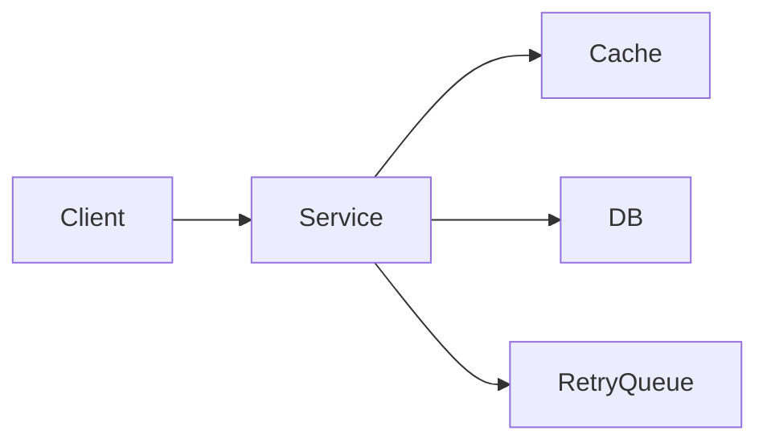

# Failure-Oriented System Design

**Objective**: Design systems assuming failure is inevitable—so that when components fail, the system degrades predictably and recovers without cascading damage.

## Failure as the default state

Networks partition, disks fail, dependencies go down, and software has bugs. Systems that assume success and treat failure as an edge case tend to fail in unpredictable and widespread ways. Failure-oriented design inverts this: assume every dependency and node can fail at any time, and design for detection, containment, and recovery.

## Types of failures

### Network

Latency spikes, packet loss, partitions, and DNS or routing failures. Services should time out, retry with backoff, and avoid assuming the network is reliable. Design for partial connectivity and eventual consistency where appropriate.

### Storage

Disk full, corruption, slow I/O, or storage service outages. Replicate critical data, use checksums, and avoid single points of failure. Design writes and reads to tolerate temporary unavailability or read-after-write delays.

### Compute

Process crashes, OOM, stuck threads, or node loss. Use process supervision, health checks, and graceful shutdown. Stateless or replayable work simplifies recovery; checkpoint long-running work.

### Dependency failures

Downstream APIs, databases, or queues become slow or unavailable. Use timeouts, circuit breakers, and fallbacks. Avoid cascading failure by failing fast and degrading gracefully when dependencies are unhealthy.

## Resilience patterns

### Retries

Retry transient failures with backoff (exponential or jittered) and a bounded number of attempts. Distinguish retryable errors (e.g. 503, timeouts) from non-retryable ones (e.g. 400, 404). Ensure retries are [idempotent](../creative-fun/idempotency-and-dedup.md) where they cause side effects.

### Circuit breakers

When a dependency fails repeatedly, open the circuit: stop sending traffic for a period, then probe to see if the dependency has recovered. This prevents overwhelming a failing service and speeds up failure detection for callers. See [System Resilience & Concurrency](../operations-monitoring/system-resilience-and-concurrency.md) for implementation patterns.

### Idempotency

Design operations so that repeating them (e.g. after a retry or replay) has the same effect as doing them once. Use idempotency keys, deterministic writes, or append-only streams so that retries and restarts do not cause duplicate or inconsistent state.

## System resilience diagram

The service uses a cache to reduce load on the database and a retry queue to defer failed work. Timeouts, circuit breakers, and fallbacks (not shown) limit blast radius when the DB or cache fails. Design so that failure of one dependency does not bring down the service or cascade to others.

## Blast radius management

### Isolation boundaries

Limit the impact of a failure to a bounded set of components. Use process boundaries, queues, and failure domains (e.g. cells, AZs) so that a single failure does not take out the whole system. See [Blast Radius, Risk Modeling & Failure Domains](../operations-monitoring/blast-radius-risk-modeling.md).

### Service degradation

When a dependency is unavailable, degrade gracefully: serve cached or stale data, disable non-essential features, or return a clear error. Document degradation behavior and SLOs so operators and users know what to expect.

### Failover

For stateful or critical paths, design failover: standby replicas, multi-AZ, or manual handoff. Define RTO/RPO and test failover regularly. See [Multi-Region DR Strategy](../architecture-design/multi-region-dr-strategy.md).

## Testing failure

### Chaos engineering

Inject failures in a controlled way to validate that the system behaves as designed. Start small, define hypotheses and success criteria, and run in non-production first. See [Chaos Engineering, Fault Injection & Reliability Validation](../operations-monitoring/chaos-engineering-governance.md).

### Synthetic failures

Use feature flags, fault injection, or test doubles to simulate dependency failures, latency, and errors in CI or staging. This catches missing timeouts, retries, and fallbacks before production.

## See also

- [System Resilience, Rate Limiting, Concurrency & Backpressure](../operations-monitoring/system-resilience-and-concurrency.md) — resilience patterns and implementation
- [Chaos Engineering, Fault Injection & Reliability Validation](../operations-monitoring/chaos-engineering-governance.md) — chaos and testing failure
- [Blast Radius, Risk Modeling & Failure Domains](../operations-monitoring/blast-radius-risk-modeling.md) — isolation and blast radius
- [Idempotency & De-dup](../creative-fun/idempotency-and-dedup.md) — idempotent operations
- [Multi-Region DR Strategy](../architecture-design/multi-region-dr-strategy.md) — failover and DR
- [Reproducible Data Pipelines](../data/reproducible-data-pipelines.md) — restartability and recovery in pipelines
