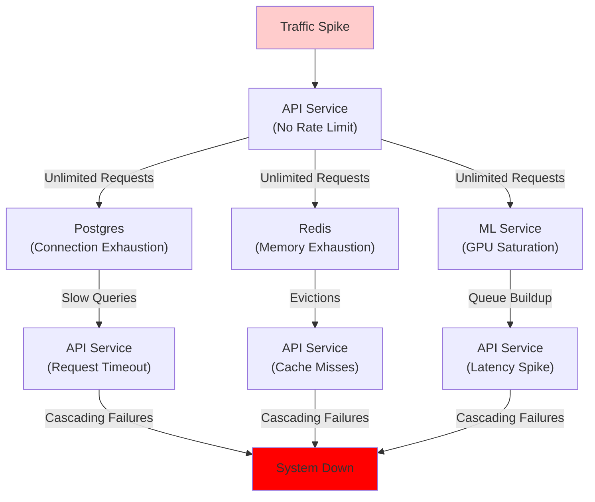
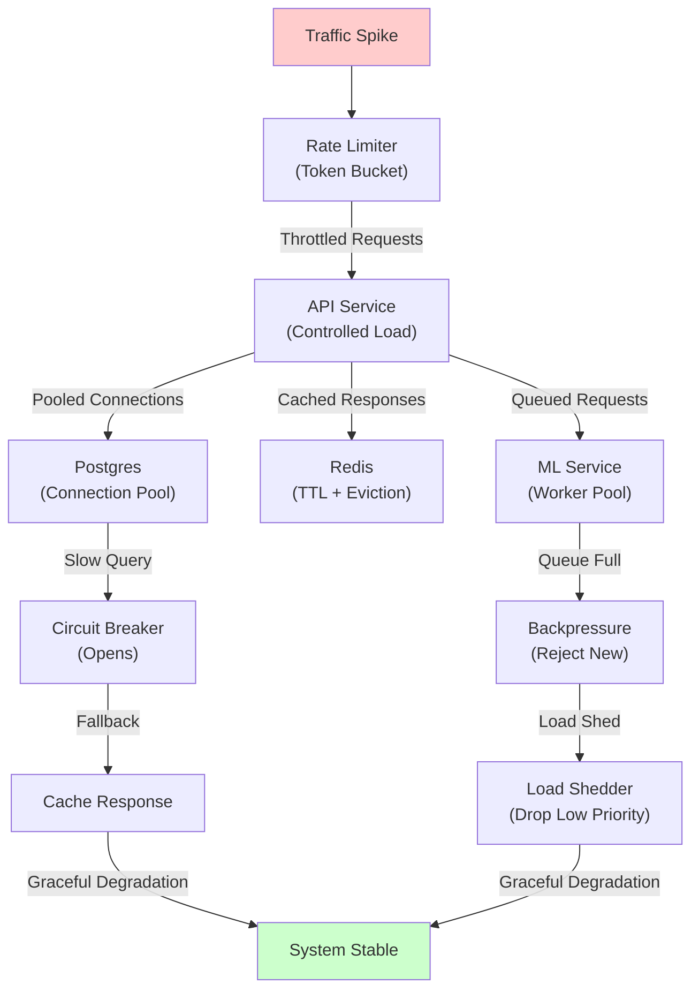
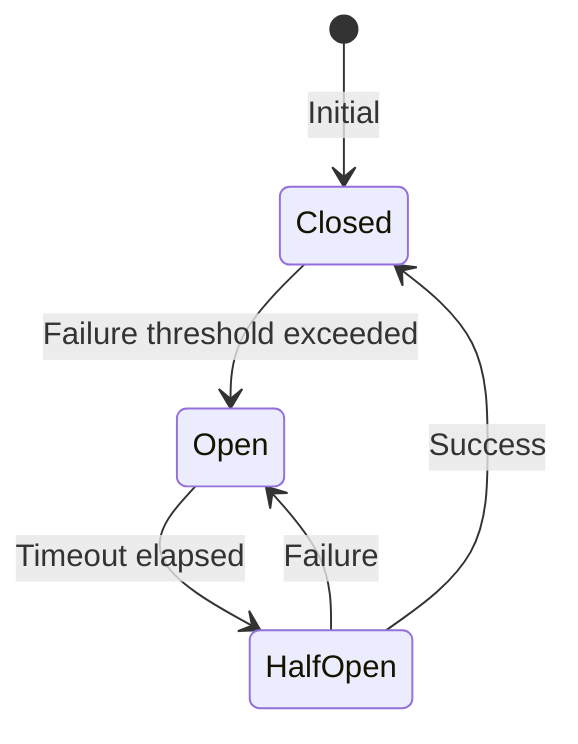
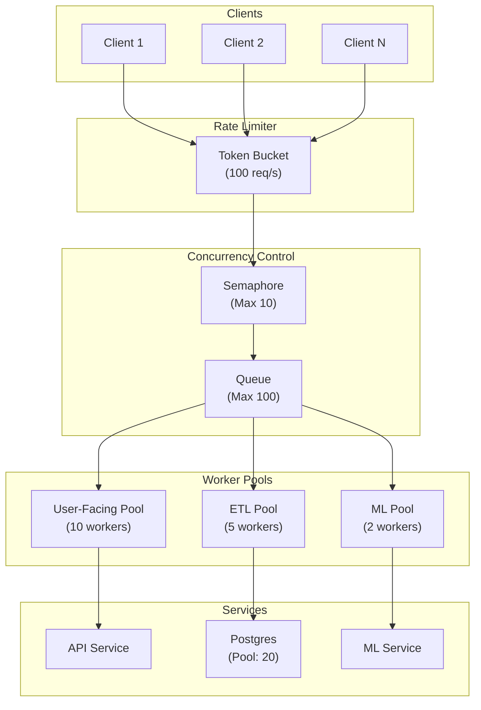
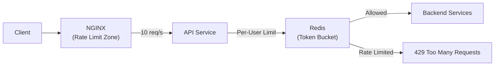

# System Resilience, Rate Limiting, Concurrency Control & Backpressure: Best Practices for Distributed Systems

**Objective**: Master production-grade resilience patterns for distributed systems. When you need to prevent cascading failures, control concurrency, implement rate limiting, handle backpressure, and maintain SLOs under load—this guide provides complete patterns and implementations.

## Introduction

Distributed systems face constant pressure: traffic spikes, resource exhaustion, network failures, and cascading errors. Without proper resilience patterns, systems fail catastrophically. This guide provides a complete framework for building resilient, high-performance distributed systems.

**What This Guide Covers**:
- Concurrency control (threads, async, worker pools)
- Rate limiting (token bucket, leaky bucket, sliding windows)
- Backpressure mechanisms
- Load shedding and graceful degradation
- Circuit breakers and bulkheads
- SLO-driven design and error budgets
- Autoscaling strategies
- GIS and ML-specific resilience patterns

**Prerequisites**:
- Understanding of distributed systems, microservices, and concurrency
- Familiarity with Python async, Go concurrency, Rust async
- Experience with Kubernetes, databases, and message queues

## Purpose & Importance

### Why Resilience Patterns Are Essential

**Postgres-Heavy Systems**:
- Connection pool exhaustion causes cascading failures
- Slow queries block all requests
- Replication lag causes read inconsistencies
- Without rate limiting, databases are overwhelmed

**GIS Computation Pipelines**:
- Spatial queries are CPU-intensive and slow
- Tile generation can saturate compute resources
- Isochrone calculations are expensive
- Without backpressure, GIS services become unresponsive

**ML/ONNX Inference Flows**:
- Model loading is expensive (cold starts)
- GPU saturation causes queue buildup
- Feature extraction can be slow
- Without load shedding, inference latency degrades

**Real-Time Dashboards**:
- Grafana queries can overwhelm databases
- NiceGUI WebSocket connections consume resources
- Real-time updates create thundering herd
- Without rate limiting, dashboards become unusable

**ETL & Streaming Workloads**:
- Large datasets overwhelm memory
- Streaming backpressure causes data loss
- Pipeline failures cascade downstream
- Without circuit breakers, entire pipelines fail

**Microservice Architectures**:
- Service failures cascade across dependencies
- Network partitions cause timeouts
- Retry storms overwhelm services
- Without isolation, one service failure takes down all

**Air-Gapped Clusters**:
- Limited compute resources
- No external fallbacks
- Resource contention is severe
- Without load shedding, systems become unusable

### Failure Cascade Without Resilience



### Failure Cascade With Resilience



## Core Concepts

### Concurrency Control

#### Thread-Level Concurrency

**Python Threading**:

```python
# concurrency/thread_pool.py
from concurrent.futures import ThreadPoolExecutor
import threading

class ThreadPoolController:
    def __init__(self, max_workers: int = 10):
        self.max_workers = max_workers
        self.executor = ThreadPoolExecutor(max_workers=max_workers)
        self.semaphore = threading.Semaphore(max_workers)
    
    def submit(self, func, *args, **kwargs):
        """Submit task with concurrency control"""
        with self.semaphore:
            return self.executor.submit(func, *args, **kwargs)
    
    def shutdown(self, wait=True):
        """Shutdown thread pool"""
        self.executor.shutdown(wait=wait)

# Usage
pool = ThreadPoolController(max_workers=10)
future = pool.submit(expensive_operation, arg1, arg2)
result = future.result()
```

**Go Goroutine Pool**:

```go
// concurrency/worker_pool.go
package concurrency

import (
    "context"
    "sync"
)

type WorkerPool struct {
    workers    int
    jobQueue   chan func()
    wg         sync.WaitGroup
}

func NewWorkerPool(workers int, queueSize int) *WorkerPool {
    return &WorkerPool{
        workers:  workers,
        jobQueue: make(chan func(), queueSize),
    }
}

func (wp *WorkerPool) Start(ctx context.Context) {
    for i := 0; i < wp.workers; i++ {
        wp.wg.Add(1)
        go func() {
            defer wp.wg.Done()
            for {
                select {
                case job := <-wp.jobQueue:
                    job()
                case <-ctx.Done():
                    return
                }
            }
        }()
    }
}

func (wp *WorkerPool) Submit(job func()) error {
    select {
    case wp.jobQueue <- job:
        return nil
    default:
        return ErrQueueFull
    }
}

func (wp *WorkerPool) Stop() {
    close(wp.jobQueue)
    wp.wg.Wait()
}
```

**Rust Tokio Concurrency**:

```rust
// concurrency/tokio_pool.rs
use tokio::sync::Semaphore;
use std::sync::Arc;

pub struct ConcurrencyLimiter {
    semaphore: Arc<Semaphore>,
}

impl ConcurrencyLimiter {
    pub fn new(max_concurrent: usize) -> Self {
        Self {
            semaphore: Arc::new(Semaphore::new(max_concurrent)),
        }
    }
    
    pub async fn execute<F, T>(&self, f: F) -> T
    where
        F: Future<Output = T>,
    {
        let _permit = self.semaphore.acquire().await.unwrap();
        f.await
    }
}

// Usage
let limiter = ConcurrencyLimiter::new(10);
let result = limiter.execute(async {
    expensive_operation().await
}).await;
```

#### Async Scheduling

**Python asyncio**:

```python
# concurrency/async_limiter.py
import asyncio
from asyncio import Semaphore

class AsyncLimiter:
    def __init__(self, max_concurrent: int = 10):
        self.semaphore = Semaphore(max_concurrent)
    
    async def execute(self, coro):
        """Execute coroutine with concurrency limit"""
        async with self.semaphore:
            return await coro

# Usage
limiter = AsyncLimiter(max_concurrent=10)
results = await asyncio.gather(*[
    limiter.execute(process_item(item))
    for item in items
])
```

#### Worker Pools

**Python Worker Pool**:

```python
# concurrency/worker_pool.py
import asyncio
from asyncio import Queue

class AsyncWorkerPool:
    def __init__(self, num_workers: int, queue_size: int = 100):
        self.num_workers = num_workers
        self.queue = Queue(maxsize=queue_size)
        self.workers = []
    
    async def start(self):
        """Start worker pool"""
        self.workers = [
            asyncio.create_task(self._worker())
            for _ in range(self.num_workers)
        ]
    
    async def _worker(self):
        """Worker coroutine"""
        while True:
            item = await self.queue.get()
            if item is None:  # Shutdown signal
                break
            await self.process_item(item)
            self.queue.task_done()
    
    async def submit(self, item):
        """Submit item to queue"""
        await self.queue.put(item)
    
    async def shutdown(self):
        """Shutdown worker pool"""
        for _ in range(self.num_workers):
            await self.queue.put(None)
        await asyncio.gather(*self.workers)
```

#### CPU-Bound vs IO-Bound Decisions

**Decision Matrix**:

| Workload Type | Concurrency Model | Example |
|---------------|------------------|---------|
| **CPU-bound** | Thread pool (limited by CPU cores) | Image processing, ML inference |
| **IO-bound** | Async/await (many concurrent) | Database queries, API calls |
| **Mixed** | Hybrid (thread pool + async) | ETL with CPU transforms + DB I/O |

**Implementation**:

```python
# concurrency/cpu_vs_io.py
import asyncio
from concurrent.futures import ThreadPoolExecutor
import aiohttp

class HybridExecutor:
    def __init__(self, cpu_workers: int = 4, io_concurrent: int = 100):
        self.cpu_pool = ThreadPoolExecutor(max_workers=cpu_workers)
        self.io_semaphore = asyncio.Semaphore(io_concurrent)
    
    async def cpu_bound_task(self, func, *args):
        """Execute CPU-bound task in thread pool"""
        loop = asyncio.get_event_loop()
        return await loop.run_in_executor(self.cpu_pool, func, *args)
    
    async def io_bound_task(self, coro):
        """Execute IO-bound task with concurrency limit"""
        async with self.io_semaphore:
            return await coro

# Usage
executor = HybridExecutor()

# CPU-bound: ML inference
result = await executor.cpu_bound_task(model.predict, features)

# IO-bound: API call
response = await executor.io_bound_task(session.get(url))
```

#### Controlling Parallel Geospatial Computations

**Pattern**: Limit concurrent spatial operations.

```python
# concurrency/geospatial_limiter.py
import asyncio
from shapely.geometry import LineString

class GeospatialLimiter:
    def __init__(self, max_concurrent: int = 4):
        self.semaphore = asyncio.Semaphore(max_concurrent)
    
    async def compute_intersection(self, geom1, geom2):
        """Compute spatial intersection with concurrency limit"""
        async with self.semaphore:
            # CPU-bound operation in thread pool
            loop = asyncio.get_event_loop()
            return await loop.run_in_executor(
                None,
                lambda: geom1.intersects(geom2)
            )

# Usage
limiter = GeospatialLimiter(max_concurrent=4)
results = await asyncio.gather(*[
    limiter.compute_intersection(road, zone)
    for road, zone in road_zone_pairs
])
```

#### Concurrency in Go, Python Async, Rust Async

**Comparison Table**:

| Language | Concurrency Model | Best For |
|----------|------------------|----------|
| **Go** | Goroutines + channels | High-throughput, simple concurrency |
| **Python async** | asyncio + coroutines | IO-bound, event-driven |
| **Rust async** | Tokio + futures | High-performance, memory-safe |

**Go Example**:

```go
// concurrency/go_concurrency.go
func processConcurrently(items []Item) []Result {
    results := make([]Result, len(items))
    sem := make(chan struct{}, 10) // Max 10 concurrent
    var wg sync.WaitGroup
    
    for i, item := range items {
        wg.Add(1)
        go func(idx int, it Item) {
            defer wg.Done()
            sem <- struct{}{}        // Acquire
            defer func() { <-sem }() // Release
            
            results[idx] = processItem(it)
        }(i, item)
    }
    
    wg.Wait()
    return results
}
```

**Python Async Example**:

```python
# concurrency/python_async.py
async def process_concurrently(items: list) -> list:
    semaphore = asyncio.Semaphore(10)  # Max 10 concurrent
    
    async def process_item(item):
        async with semaphore:
            return await process_item_async(item)
    
    return await asyncio.gather(*[
        process_item(item) for item in items
    ])
```

**Rust Async Example**:

```rust
// concurrency/rust_async.rs
use tokio::sync::Semaphore;

async fn process_concurrently(items: Vec<Item>) -> Vec<Result> {
    let semaphore = Arc::new(Semaphore::new(10)); // Max 10 concurrent
    
    let tasks: Vec<_> = items.into_iter().map(|item| {
        let sem = semaphore.clone();
        tokio::spawn(async move {
            let _permit = sem.acquire().await.unwrap();
            process_item(item).await
        })
    }).collect();
    
    futures::future::join_all(tasks).await
        .into_iter()
        .map(|r| r.unwrap())
        .collect()
}
```

#### Controlling ONNX Inference Concurrency

**Pattern**: Limit concurrent model inference.

```python
# concurrency/onnx_limiter.py
import onnxruntime as ort
import asyncio

class ONNXInferenceLimiter:
    def __init__(self, model_path: str, max_concurrent: int = 2):
        self.session = ort.InferenceSession(model_path)
        self.semaphore = asyncio.Semaphore(max_concurrent)
    
    async def infer(self, input_data: np.ndarray):
        """Run inference with concurrency limit"""
        async with self.semaphore:
            # Run inference (CPU-bound, but async for concurrency control)
            loop = asyncio.get_event_loop()
            return await loop.run_in_executor(
                None,
                lambda: self.session.run(None, {"input": input_data})
            )
```

### Rate Limiting Patterns

#### Token Bucket

**Algorithm**: Tokens added at fixed rate, requests consume tokens.

**Python Implementation**:

```python
# rate_limiting/token_bucket.py
import time
import asyncio
from collections import deque

class TokenBucket:
    def __init__(self, capacity: int, refill_rate: float):
        """
        capacity: Maximum tokens
        refill_rate: Tokens per second
        """
        self.capacity = capacity
        self.refill_rate = refill_rate
        self.tokens = capacity
        self.last_refill = time.time()
        self.lock = asyncio.Lock()
    
    async def acquire(self, tokens: int = 1) -> bool:
        """Try to acquire tokens"""
        async with self.lock:
            self._refill()
            
            if self.tokens >= tokens:
                self.tokens -= tokens
                return True
            return False
    
    def _refill(self):
        """Refill tokens based on elapsed time"""
        now = time.time()
        elapsed = now - self.last_refill
        self.tokens = min(
            self.capacity,
            self.tokens + elapsed * self.refill_rate
        )
        self.last_refill = now

# Usage
bucket = TokenBucket(capacity=100, refill_rate=10.0)  # 10 tokens/sec

async def make_request():
    if await bucket.acquire():
        # Make request
        pass
    else:
        # Rate limited
        raise RateLimitError()
```

**Redis-Based Token Bucket**:

```python
# rate_limiting/redis_token_bucket.py
import redis
import time

class RedisTokenBucket:
    def __init__(self, redis_client: redis.Redis, key: str, capacity: int, refill_rate: float):
        self.redis = redis_client
        self.key = key
        self.capacity = capacity
        self.refill_rate = refill_rate
    
    def acquire(self, tokens: int = 1) -> bool:
        """Acquire tokens using Redis Lua script"""
        lua_script = """
        local key = KEYS[1]
        local capacity = tonumber(ARGV[1])
        local refill_rate = tonumber(ARGV[2])
        local tokens_requested = tonumber(ARGV[3])
        local now = tonumber(ARGV[4])
        
        local bucket = redis.call('HMGET', key, 'tokens', 'last_refill')
        local current_tokens = tonumber(bucket[1]) or capacity
        local last_refill = tonumber(bucket[2]) or now
        
        -- Refill tokens
        local elapsed = now - last_refill
        current_tokens = math.min(capacity, current_tokens + elapsed * refill_rate)
        
        -- Check if enough tokens
        if current_tokens >= tokens_requested then
            current_tokens = current_tokens - tokens_requested
            redis.call('HMSET', key, 'tokens', current_tokens, 'last_refill', now)
            redis.call('EXPIRE', key, 3600)
            return 1
        else
            redis.call('HMSET', key, 'tokens', current_tokens, 'last_refill', now)
            redis.call('EXPIRE', key, 3600)
            return 0
        end
        """
        
        result = self.redis.eval(
            lua_script,
            1,
            self.key,
            self.capacity,
            self.refill_rate,
            tokens,
            int(time.time())
        )
        
        return bool(result)
```

#### Leaky Bucket

**Algorithm**: Requests added to bucket, processed at fixed rate.

**Python Implementation**:

```python
# rate_limiting/leaky_bucket.py
import asyncio
import time
from collections import deque

class LeakyBucket:
    def __init__(self, capacity: int, leak_rate: float):
        """
        capacity: Maximum queue size
        leak_rate: Requests per second processed
        """
        self.capacity = capacity
        self.leak_rate = leak_rate
        self.queue = deque()
        self.last_leak = time.time()
        self.lock = asyncio.Lock()
    
    async def add(self, item) -> bool:
        """Add item to bucket"""
        async with self.lock:
            if len(self.queue) >= self.capacity:
                return False  # Bucket full
            
            self.queue.append((item, time.time()))
            return True
    
    async def process(self):
        """Process items from bucket at leak rate"""
        while True:
            async with self.lock:
                self._leak()
            
            await asyncio.sleep(1.0 / self.leak_rate)
    
    def _leak(self):
        """Remove items based on leak rate"""
        now = time.time()
        elapsed = now - self.last_leak
        items_to_process = int(elapsed * self.leak_rate)
        
        for _ in range(min(items_to_process, len(self.queue))):
            if self.queue:
                item, _ = self.queue.popleft()
                # Process item
                asyncio.create_task(process_item(item))
        
        self.last_leak = now
```

#### Fixed Window

**Algorithm**: Count requests in fixed time window.

**Python Implementation**:

```python
# rate_limiting/fixed_window.py
import time
from collections import defaultdict

class FixedWindowLimiter:
    def __init__(self, max_requests: int, window_seconds: int):
        self.max_requests = max_requests
        self.window_seconds = window_seconds
        self.windows = defaultdict(int)
        self.window_start = defaultdict(int)
    
    def is_allowed(self, key: str) -> bool:
        """Check if request is allowed"""
        now = int(time.time())
        window = now // self.window_seconds
        
        # Reset if new window
        if self.window_start[key] != window:
            self.windows[key] = 0
            self.window_start[key] = window
        
        # Check limit
        if self.windows[key] < self.max_requests:
            self.windows[key] += 1
            return True
        
        return False
```

**Redis Fixed Window**:

```python
# rate_limiting/redis_fixed_window.py
import redis
import time

class RedisFixedWindowLimiter:
    def __init__(self, redis_client: redis.Redis, max_requests: int, window_seconds: int):
        self.redis = redis_client
        self.max_requests = max_requests
        self.window_seconds = window_seconds
    
    def is_allowed(self, key: str) -> bool:
        """Check if request is allowed using Redis"""
        window = int(time.time()) // self.window_seconds
        redis_key = f"rate_limit:{key}:{window}"
        
        current = self.redis.incr(redis_key)
        self.redis.expire(redis_key, self.window_seconds)
        
        return current <= self.max_requests
```

#### Sliding Log / Rolling Window

**Algorithm**: Track individual request timestamps, count in sliding window.

**Python Implementation**:

```python
# rate_limiting/sliding_log.py
import time
from collections import deque

class SlidingLogLimiter:
    def __init__(self, max_requests: int, window_seconds: int):
        self.max_requests = max_requests
        self.window_seconds = window_seconds
        self.logs = defaultdict(deque)
    
    def is_allowed(self, key: str) -> bool:
        """Check if request is allowed"""
        now = time.time()
        window_start = now - self.window_seconds
        
        # Remove old entries
        log = self.logs[key]
        while log and log[0] < window_start:
            log.popleft()
        
        # Check limit
        if len(log) < self.max_requests:
            log.append(now)
            return True
        
        return False
```

**Redis Sliding Log**:

```python
# rate_limiting/redis_sliding_log.py
import redis
import time

class RedisSlidingLogLimiter:
    def __init__(self, redis_client: redis.Redis, max_requests: int, window_seconds: int):
        self.redis = redis_client
        self.max_requests = max_requests
        self.window_seconds = window_seconds
    
    def is_allowed(self, key: str) -> bool:
        """Check if request is allowed using Redis sorted set"""
        now = time.time()
        window_start = now - self.window_seconds
        redis_key = f"rate_limit:sliding:{key}"
        
        # Remove old entries
        self.redis.zremrangebyscore(redis_key, 0, window_start)
        
        # Count current entries
        current = self.redis.zcard(redis_key)
        
        if current < self.max_requests:
            # Add current request
            self.redis.zadd(redis_key, {str(now): now})
            self.redis.expire(redis_key, self.window_seconds)
            return True
        
        return False
```

#### NGINX-Based Rate Limits

**NGINX Configuration**:

```nginx
# nginx/rate_limiting.conf
http {
    # Define rate limit zones
    limit_req_zone $binary_remote_addr zone=api_limit:10m rate=10r/s;
    limit_req_zone $http_authorization zone=user_limit:10m rate=100r/s;
    
    # Per-IP rate limiting
    limit_conn_zone $binary_remote_addr zone=conn_limit:10m;
    
    server {
        listen 80;
        server_name api.example.com;
        
        # Apply rate limits
        limit_req zone=api_limit burst=20 nodelay;
        limit_conn conn_limit 10;
        
        location /api/ {
            proxy_pass http://backend;
            
            # Per-user rate limiting (if auth header present)
            limit_req zone=user_limit burst=50 nodelay;
        }
        
        # Stricter limits for expensive endpoints
        location /api/ml/infer {
            limit_req zone=api_limit burst=5 nodelay;
            proxy_pass http://ml-backend;
        }
    }
}
```

#### Per-User, Per-IP, Per-Org, Per-Service Policies

**Multi-Level Rate Limiting**:

```python
# rate_limiting/multi_level.py
class MultiLevelRateLimiter:
    def __init__(self, redis_client: redis.Redis):
        self.redis = redis_client
        self.limiters = {
            "ip": RedisFixedWindowLimiter(redis_client, 100, 60),      # 100/min per IP
            "user": RedisFixedWindowLimiter(redis_client, 1000, 60),   # 1000/min per user
            "org": RedisFixedWindowLimiter(redis_client, 10000, 60),   # 10000/min per org
            "service": RedisFixedWindowLimiter(redis_client, 100000, 60)  # 100000/min per service
        }
    
    def is_allowed(self, ip: str, user_id: str, org_id: str, service: str) -> bool:
        """Check all rate limits"""
        checks = [
            self.limiters["ip"].is_allowed(f"ip:{ip}"),
            self.limiters["user"].is_allowed(f"user:{user_id}"),
            self.limiters["org"].is_allowed(f"org:{org_id}"),
            self.limiters["service"].is_allowed(f"service:{service}")
        ]
        
        return all(checks)
```

#### Rate Limiting Downstream Resources

**Protecting Postgres**:

```python
# rate_limiting/protect_postgres.py
class PostgresRateLimiter:
    def __init__(self, redis_client: redis.Redis):
        self.redis = redis_client
        self.limiter = RedisTokenBucket(
            redis_client,
            "postgres:rate_limit",
            capacity=1000,      # Max 1000 queries
            refill_rate=100.0   # 100 queries/sec
        )
    
    async def execute_query(self, query: str, params: tuple):
        """Execute query with rate limiting"""
        if not await self.limiter.acquire():
            raise RateLimitError("Postgres rate limit exceeded")
        
        return await db.execute(query, params)
```

### Backpressure Mechanisms

#### Queue Size Controls

**Pattern**: Reject requests when queue is full.

```python
# backpressure/queue_control.py
import asyncio
from asyncio import Queue, QueueFull

class BackpressureQueue:
    def __init__(self, maxsize: int = 100):
        self.queue = Queue(maxsize=maxsize)
        self.maxsize = maxsize
    
    async def put(self, item, timeout: float = 0.1) -> bool:
        """Put item with timeout"""
        try:
            await asyncio.wait_for(self.queue.put(item), timeout=timeout)
            return True
        except asyncio.TimeoutError:
            return False  # Queue full, backpressure
    
    async def get(self):
        """Get item from queue"""
        return await self.queue.get()
```

#### Async Task Backpressure

**Pattern**: Limit concurrent async tasks.

```python
# backpressure/async_backpressure.py
class AsyncBackpressure:
    def __init__(self, max_concurrent: int = 10, max_queue: int = 100):
        self.semaphore = asyncio.Semaphore(max_concurrent)
        self.queue = asyncio.Queue(maxsize=max_queue)
    
    async def submit(self, coro) -> bool:
        """Submit task with backpressure"""
        try:
            await asyncio.wait_for(self.queue.put(coro), timeout=0.1)
            asyncio.create_task(self._process())
            return True
        except asyncio.TimeoutError:
            return False  # Backpressure: queue full
    
    async def _process(self):
        """Process tasks from queue"""
        async with self.semaphore:
            coro = await self.queue.get()
            await coro
```

#### Redis Streams Backpressure

**Pattern**: Monitor stream length, reject when too high.

```python
# backpressure/redis_streams.py
class RedisStreamBackpressure:
    def __init__(self, redis_client: redis.Redis, stream_name: str, max_length: int = 10000):
        self.redis = redis_client
        self.stream_name = stream_name
        self.max_length = max_length
    
    async def add_message(self, fields: dict) -> bool:
        """Add message with backpressure check"""
        # Check stream length
        length = self.redis.xlen(self.stream_name)
        
        if length >= self.max_length:
            return False  # Backpressure: stream too long
        
        # Add message
        self.redis.xadd(self.stream_name, fields, maxlen=self.max_length)
        return True
```

#### Prefect/Dask Backpressure

**Prefect Task Concurrency Limits**:

```python
# backpressure/prefect_backpressure.py
from prefect import task, flow
from prefect.concurrency import concurrency

@task
@concurrency(limit=10, occupy=1)  # Max 10 concurrent
def expensive_task(data: dict):
    """Task with concurrency limit"""
    return process_data(data)

@flow
def etl_flow():
    """ETL flow with backpressure"""
    items = load_items()
    
    # Process with concurrency limit (backpressure)
    results = []
    for item in items:
        result = expensive_task(item)  # Will queue if limit reached
        results.append(result)
    
    return results
```

**Dask Backpressure**:

```python
# backpressure/dask_backpressure.py
from dask.distributed import Client
from dask import delayed

def process_with_backpressure(client: Client, items: list, max_concurrent: int = 10):
    """Process items with Dask backpressure"""
    # Limit concurrent tasks
    semaphore = asyncio.Semaphore(max_concurrent)
    
    @delayed
    def process_item(item):
        return expensive_operation(item)
    
    # Process with limit
    tasks = [process_item(item) for item in items]
    results = client.compute(tasks, resources={"worker": 1})
    
    return results
```

#### Postgres Connection Pool Saturation

**Pattern**: Reject connections when pool is full.

```python
# backpressure/postgres_pool.py
import asyncpg
from asyncpg import Pool

class PostgresPoolWithBackpressure:
    def __init__(self, dsn: str, min_size: int = 5, max_size: int = 20):
        self.pool: Pool = None
        self.dsn = dsn
        self.min_size = min_size
        self.max_size = max_size
    
    async def connect(self):
        """Create connection pool"""
        self.pool = await asyncpg.create_pool(
            self.dsn,
            min_size=self.min_size,
            max_size=self.max_size
        )
    
    async def execute(self, query: str, *args, timeout: float = 5.0):
        """Execute query with timeout and backpressure"""
        try:
            async with self.pool.acquire(timeout=timeout) as conn:
                return await conn.execute(query, *args)
        except asyncio.TimeoutError:
            raise BackpressureError("Connection pool exhausted")
```

**Postgres max_connections**:

```sql
-- postgresql.conf
max_connections = 100
superuser_reserved_connections = 3

-- Per-database connection limits
ALTER DATABASE mydb CONNECTION LIMIT 50;
```

#### GIS Tile Generation Throttling

**Pattern**: Limit concurrent tile generation.

```python
# backpressure/gis_tile_throttle.py
class TileGenerationThrottle:
    def __init__(self, max_concurrent: int = 4):
        self.semaphore = asyncio.Semaphore(max_concurrent)
    
    async def generate_tile(self, z: int, x: int, y: int):
        """Generate tile with throttling"""
        async with self.semaphore:
            return await generate_tile_async(z, x, y)
```

#### Model Inference Backpressure

**Pattern**: Queue inference requests, reject when queue full.

```python
# backpressure/ml_inference.py
class MLInferenceBackpressure:
    def __init__(self, model, max_queue: int = 100, max_concurrent: int = 2):
        self.model = model
        self.queue = asyncio.Queue(maxsize=max_queue)
        self.semaphore = asyncio.Semaphore(max_concurrent)
    
    async def infer(self, input_data: np.ndarray, timeout: float = 5.0) -> np.ndarray:
        """Run inference with backpressure"""
        try:
            # Try to add to queue
            future = asyncio.Future()
            await asyncio.wait_for(self.queue.put((input_data, future)), timeout=0.1)
            
            # Process inference
            asyncio.create_task(self._process_inference())
            
            # Wait for result
            return await asyncio.wait_for(future, timeout=timeout)
        except asyncio.TimeoutError:
            raise BackpressureError("Inference queue full")
    
    async def _process_inference(self):
        """Process inference requests"""
        async with self.semaphore:
            input_data, future = await self.queue.get()
            result = self.model.predict(input_data)
            future.set_result(result)
```

### Load Shedding

#### Soft vs Hard Shedding

**Soft Shedding**: Delay or degrade service.

**Hard Shedding**: Reject requests immediately.

```python
# load_shedding/shedding_strategy.py
class LoadShedder:
    def __init__(self, soft_threshold: float = 0.8, hard_threshold: float = 0.95):
        self.soft_threshold = soft_threshold
        self.hard_threshold = hard_threshold
    
    def should_shed(self, load: float, priority: str = "normal") -> str:
        """Determine shedding strategy"""
        if load >= self.hard_threshold:
            return "hard"  # Reject immediately
        
        if load >= self.soft_threshold:
            if priority == "low":
                return "soft"  # Delay or degrade
            return "none"
        
        return "none"
```

#### Prioritized Workloads

**Pattern**: Shed low-priority requests first.

```python
# load_shedding/priority_shedding.py
from enum import Enum

class Priority(Enum):
    CRITICAL = 1
    HIGH = 2
    NORMAL = 3
    LOW = 4

class PriorityLoadShedder:
    def __init__(self, max_load: float = 0.9):
        self.max_load = max_load
    
    def should_process(self, priority: Priority, current_load: float) -> bool:
        """Determine if request should be processed"""
        if current_load < self.max_load:
            return True
        
        # Shed based on priority
        if priority == Priority.CRITICAL:
            return True
        elif priority == Priority.HIGH and current_load < 0.95:
            return True
        elif priority == Priority.NORMAL and current_load < 0.85:
            return True
        else:
            return False  # Shed low priority
```

#### Shedding Low-Priority Traffic

**Implementation**:

```python
# load_shedding/traffic_shedding.py
class TrafficShedder:
    def __init__(self, redis_client: redis.Redis):
        self.redis = redis_client
        self.load_monitor = LoadMonitor()
    
    async def handle_request(self, request: Request) -> Response:
        """Handle request with load shedding"""
        current_load = await self.load_monitor.get_load()
        priority = request.headers.get("X-Priority", "normal")
        
        if not self.should_process(priority, current_load):
            return Response(
                status_code=503,
                body={"error": "Service overloaded, please retry later"}
            )
        
        return await process_request(request)
```

#### Shedding ML Inference When Models Are Cold

**Pattern**: Reject requests when model is loading.

```python
# load_shedding/ml_cold_start.py
class MLColdStartShedder:
    def __init__(self, model_loader):
        self.model_loader = model_loader
        self.model_loaded = asyncio.Event()
        self.loading = False
    
    async def load_model(self):
        """Load model asynchronously"""
        self.loading = True
        try:
            await self.model_loader.load()
            self.model_loaded.set()
        finally:
            self.loading = False
    
    async def infer(self, input_data: np.ndarray) -> np.ndarray:
        """Run inference, shed if model not loaded"""
        if not self.model_loaded.is_set():
            if self.loading:
                raise ServiceUnavailableError("Model loading, please retry")
            else:
                # Start loading
                asyncio.create_task(self.load_model())
                raise ServiceUnavailableError("Model not loaded")
        
        return await self.model.infer(input_data)
```

#### Dropping Expensive Geospatial Queries

**Pattern**: Reject expensive spatial queries under load.

```python
# load_shedding/geospatial_shedding.py
class GeospatialLoadShedder:
    def __init__(self, max_concurrent_queries: int = 10):
        self.semaphore = asyncio.Semaphore(max_concurrent_queries)
        self.queue_size = 0
    
    async def execute_query(self, query: str, timeout: float = 30.0) -> dict:
        """Execute geospatial query with load shedding"""
        # Check if we can accept query
        if self.queue_size > 50:  # Threshold
            raise LoadShedError("Too many geospatial queries in queue")
        
        try:
            async with asyncio.timeout(timeout):
                async with self.semaphore:
                    self.queue_size += 1
                    try:
                        return await execute_spatial_query(query)
                    finally:
                        self.queue_size -= 1
        except asyncio.TimeoutError:
            raise LoadShedError("Geospatial query timeout")
```

#### Returning Partial or Approximate Results

**Pattern**: Return cached or approximate results under load.

```python
# load_shedding/approximate_results.py
class ApproximateResultShedder:
    def __init__(self, cache_client: redis.Redis):
        self.cache = cache_client
    
    async def get_result(self, query: str, exact: bool = True) -> dict:
        """Get result, return approximate if under load"""
        current_load = await get_system_load()
        
        if current_load > 0.9 and not exact:
            # Return cached approximate result
            cached = self.cache.get(f"approx:{hash(query)}")
            if cached:
                return json.loads(cached)
        
        # Compute exact result
        result = await compute_exact_result(query)
        
        # Cache for future approximate results
        self.cache.setex(
            f"approx:{hash(query)}",
            3600,
            json.dumps(result)
        )
        
        return result
```

### Circuit Breakers

#### Open/Half-Open/Closed States

**State Machine**:



**Python Implementation**:

```python
# circuit_breaker/circuit_breaker.py
import asyncio
import time
from enum import Enum

class CircuitState(Enum):
    CLOSED = "closed"
    OPEN = "open"
    HALF_OPEN = "half_open"

class CircuitBreaker:
    def __init__(
        self,
        failure_threshold: int = 5,
        success_threshold: int = 2,
        timeout: float = 60.0
    ):
        self.failure_threshold = failure_threshold
        self.success_threshold = success_threshold
        self.timeout = timeout
        
        self.state = CircuitState.CLOSED
        self.failure_count = 0
        self.success_count = 0
        self.last_failure_time = None
        self.lock = asyncio.Lock()
    
    async def call(self, func, *args, **kwargs):
        """Call function with circuit breaker"""
        async with self.lock:
            if self.state == CircuitState.OPEN:
                if time.time() - self.last_failure_time > self.timeout:
                    self.state = CircuitState.HALF_OPEN
                    self.success_count = 0
                else:
                    raise CircuitBreakerOpenError("Circuit breaker is open")
        
        try:
            result = await func(*args, **kwargs)
            await self._on_success()
            return result
        except Exception as e:
            await self._on_failure()
            raise
    
    async def _on_success(self):
        """Handle successful call"""
        async with self.lock:
            if self.state == CircuitState.HALF_OPEN:
                self.success_count += 1
                if self.success_count >= self.success_threshold:
                    self.state = CircuitState.CLOSED
                    self.failure_count = 0
            elif self.state == CircuitState.CLOSED:
                self.failure_count = 0
    
    async def _on_failure(self):
        """Handle failed call"""
        async with self.lock:
            self.failure_count += 1
            self.last_failure_time = time.time()
            
            if self.failure_count >= self.failure_threshold:
                self.state = CircuitState.OPEN
            elif self.state == CircuitState.HALF_OPEN:
                self.state = CircuitState.OPEN
```

#### Per-Service Circuit Breaking

**Multi-Service Circuit Breaker**:

```python
# circuit_breaker/multi_service.py
class MultiServiceCircuitBreaker:
    def __init__(self):
        self.breakers = {}
    
    def get_breaker(self, service_name: str) -> CircuitBreaker:
        """Get circuit breaker for service"""
        if service_name not in self.breakers:
            self.breakers[service_name] = CircuitBreaker()
        return self.breakers[service_name]
    
    async def call_service(self, service_name: str, func, *args, **kwargs):
        """Call service with circuit breaker"""
        breaker = self.get_breaker(service_name)
        return await breaker.call(func, *args, **kwargs)
```

#### DB Circuit Breaking

**Postgres Circuit Breaker**:

```python
# circuit_breaker/db_circuit_breaker.py
class PostgresCircuitBreaker:
    def __init__(self, pool: asyncpg.Pool):
        self.pool = pool
        self.breaker = CircuitBreaker(
            failure_threshold=5,
            timeout=30.0
        )
    
    async def execute(self, query: str, *args):
        """Execute query with circuit breaker"""
        async def _execute():
            async with self.pool.acquire() as conn:
                return await conn.execute(query, *args)
        
        return await self.breaker.call(_execute)
```

#### ML Inference Circuit Breaking

**ONNX Circuit Breaker**:

```python
# circuit_breaker/ml_circuit_breaker.py
class MLInferenceCircuitBreaker:
    def __init__(self, model_session: ort.InferenceSession):
        self.session = model_session
        self.breaker = CircuitBreaker(
            failure_threshold=3,
            timeout=60.0
        )
    
    async def infer(self, input_data: np.ndarray) -> np.ndarray:
        """Run inference with circuit breaker"""
        async def _infer():
            loop = asyncio.get_event_loop()
            return await loop.run_in_executor(
                None,
                lambda: self.session.run(None, {"input": input_data})
            )
        
        return await self.breaker.call(_infer)
```

#### Redis Failure Fallback

**Pattern**: Fallback to database when Redis fails.

```python
# circuit_breaker/redis_fallback.py
class RedisWithFallback:
    def __init__(self, redis_client: redis.Redis, db_client):
        self.redis = redis_client
        self.db = db_client
        self.breaker = CircuitBreaker(failure_threshold=3, timeout=30.0)
    
    async def get(self, key: str):
        """Get value with Redis fallback to DB"""
        async def _get_from_redis():
            return await self.redis.get(key)
        
        try:
            return await self.breaker.call(_get_from_redis)
        except CircuitBreakerOpenError:
            # Fallback to database
            return await self.db.get(key)
```

#### NGINX Circuit Breaking via Upstream Health Checks

**NGINX Configuration**:

```nginx
# nginx/circuit_breaker.conf
upstream backend {
    server backend1:8000 max_fails=3 fail_timeout=30s;
    server backend2:8000 max_fails=3 fail_timeout=30s backup;
    
    # Health check
    health_check interval=10s fails=3 passes=2;
}

server {
    location /api/ {
        proxy_pass http://backend;
        
        # Circuit breaker behavior
        proxy_next_upstream error timeout http_500 http_502 http_503;
        proxy_next_upstream_tries 3;
        proxy_next_upstream_timeout 10s;
    }
}
```

### Bulkheads / Isolation

#### Workload Isolation

**Pattern**: Isolate workloads to prevent cascading failures.

```python
# bulkheads/workload_isolation.py
class WorkloadIsolator:
    def __init__(self):
        self.pools = {
            "user_facing": asyncio.Semaphore(10),
            "etl": asyncio.Semaphore(5),
            "ml": asyncio.Semaphore(2),
            "gis": asyncio.Semaphore(4)
        }
    
    async def execute(self, workload_type: str, coro):
        """Execute workload in isolated pool"""
        semaphore = self.pools.get(workload_type)
        if not semaphore:
            raise ValueError(f"Unknown workload type: {workload_type}")
        
        async with semaphore:
            return await coro
```

#### Query Isolation in Postgres

**Postgres Resource Groups**:

```sql
-- Create resource groups
CREATE RESOURCE GROUP user_queries WITH (
    cpu_rate_limit = 50,
    memory_limit = 50
);

CREATE RESOURCE GROUP etl_queries WITH (
    cpu_rate_limit = 30,
    memory_limit = 30
);

-- Assign roles to resource groups
ALTER ROLE app_user SET resource_group = user_queries;
ALTER ROLE etl_user SET resource_group = etl_queries;
```

**Connection Pool Isolation**:

```python
# bulkheads/postgres_isolation.py
class IsolatedPostgresPools:
    def __init__(self, dsn: str):
        self.pools = {
            "user_facing": None,
            "etl": None,
            "reporting": None
        }
        self.dsn = dsn
    
    async def connect(self):
        """Create isolated connection pools"""
        self.pools["user_facing"] = await asyncpg.create_pool(
            self.dsn,
            min_size=10,
            max_size=20,
            command_timeout=5.0
        )
        
        self.pools["etl"] = await asyncpg.create_pool(
            self.dsn,
            min_size=5,
            max_size=10,
            command_timeout=300.0
        )
        
        self.pools["reporting"] = await asyncpg.create_pool(
            self.dsn,
            min_size=2,
            max_size=5,
            command_timeout=60.0
        )
    
    async def execute(self, pool_name: str, query: str, *args):
        """Execute query in isolated pool"""
        pool = self.pools.get(pool_name)
        if not pool:
            raise ValueError(f"Unknown pool: {pool_name}")
        
        async with pool.acquire() as conn:
            return await conn.execute(query, *args)
```

#### Separate Redis Pools

**Redis Connection Pool Isolation**:

```python
# bulkheads/redis_isolation.py
class IsolatedRedisPools:
    def __init__(self):
        self.pools = {
            "cache": redis.ConnectionPool(host="redis", db=0, max_connections=50),
            "sessions": redis.ConnectionPool(host="redis", db=1, max_connections=20),
            "streams": redis.ConnectionPool(host="redis", db=2, max_connections=10)
        }
    
    def get_client(self, pool_name: str) -> redis.Redis:
        """Get Redis client for isolated pool"""
        pool = self.pools.get(pool_name)
        if not pool:
            raise ValueError(f"Unknown pool: {pool_name}")
        
        return redis.Redis(connection_pool=pool)
```

#### Separate ONNX Inference Worker Pools

**ML Worker Pool Isolation**:

```python
# bulkheads/ml_isolation.py
class IsolatedMLPools:
    def __init__(self):
        self.pools = {
            "real_time": AsyncWorkerPool(num_workers=4, queue_size=100),
            "batch": AsyncWorkerPool(num_workers=2, queue_size=1000),
            "experimental": AsyncWorkerPool(num_workers=1, queue_size=50)
        }
    
    async def infer(self, pool_name: str, input_data: np.ndarray) -> np.ndarray:
        """Run inference in isolated pool"""
        pool = self.pools.get(pool_name)
        if not pool:
            raise ValueError(f"Unknown pool: {pool_name}")
        
        return await pool.submit(lambda: model.infer(input_data))
```

### Latency SLOs & Error Budgets

#### Define Latency SLOs

**SLO Definitions**:

```yaml
# slos/latency_slos.yaml
slos:
  api:
    p50: 50ms
    p95: 200ms
    p99: 500ms
    availability: 99.9%
  
  postgres:
    p50: 10ms
    p95: 100ms
    p99: 500ms
    availability: 99.95%
  
  ml_inference:
    p50: 50ms
    p95: 200ms
    p99: 500ms
    availability: 99.5%
  
  gis_isochrone:
    p50: 1s
    p95: 5s
    p99: 10s
    availability: 99.0%
```

**Prometheus SLO Tracking**:

```python
# slos/slo_tracking.py
from prometheus_client import Histogram, Counter

# Latency histograms
api_latency = Histogram(
    'api_request_duration_seconds',
    'API request latency',
    buckets=[0.01, 0.05, 0.1, 0.2, 0.5, 1.0, 2.0, 5.0]
)

# Error budget
error_budget = Counter(
    'slo_error_budget_consumed',
    'SLO error budget consumed',
    ['service', 'slo_type']
)

def track_api_latency(duration: float):
    """Track API latency"""
    api_latency.observe(duration)
    
    # Check SLO violation
    if duration > 0.5:  # P99 SLO: 500ms
        error_budget.labels(service='api', slo_type='latency_p99').inc()
```

**PromQL SLO Queries**:

```promql
# API P95 latency
histogram_quantile(0.95, rate(api_request_duration_seconds_bucket[5m]))

# SLO violation rate
rate(api_request_duration_seconds_bucket{le="0.2"}[5m]) / 
rate(api_request_duration_seconds_count[5m])

# Error budget remaining
1 - (rate(slo_error_budget_consumed[1h]) / 3600)
```

#### Track SLOs via Prometheus/Grafana

**Grafana Dashboard**:

```json
{
  "dashboard": {
    "panels": [
      {
        "title": "API Latency SLO",
        "targets": [
          {
            "expr": "histogram_quantile(0.95, rate(api_request_duration_seconds_bucket[5m]))",
            "legendFormat": "P95 Latency"
          }
        ],
        "thresholds": [
          {
            "value": 0.2,
            "colorMode": "critical",
            "fill": true
          }
        ]
      }
    ]
  }
}
```

### Autoscaling Strategies

#### HPA/VPA for RKE2

**Horizontal Pod Autoscaler**:

```yaml
# k8s/hpa.yaml
apiVersion: autoscaling/v2
kind: HorizontalPodAutoscaler
metadata:
  name: api-hpa
spec:
  scaleTargetRef:
    apiVersion: apps/v1
    kind: Deployment
    name: api-service
  minReplicas: 2
  maxReplicas: 10
  metrics:
    - type: Resource
      resource:
        name: cpu
        target:
          type: Utilization
          averageUtilization: 70
    - type: Resource
      resource:
        name: memory
        target:
          type: Utilization
          averageUtilization: 80
  behavior:
    scaleDown:
      stabilizationWindowSeconds: 300
      policies:
        - type: Percent
          value: 50
          periodSeconds: 60
    scaleUp:
      stabilizationWindowSeconds: 0
      policies:
        - type: Percent
          value: 100
          periodSeconds: 15
```

**Vertical Pod Autoscaler**:

```yaml
# k8s/vpa.yaml
apiVersion: autoscaling.k8s.io/v1
kind: VerticalPodAutoscaler
metadata:
  name: api-vpa
spec:
  targetRef:
    apiVersion: apps/v1
    kind: Deployment
    name: api-service
  updatePolicy:
    updateMode: "Auto"
  resourcePolicy:
    containerPolicies:
      - containerName: api
        minAllowed:
          cpu: 100m
          memory: 128Mi
        maxAllowed:
          cpu: 2
          memory: 4Gi
```

#### CPU/GPU Autoscaling for Inference Workers

**GPU Autoscaling**:

```yaml
# k8s/gpu-hpa.yaml
apiVersion: autoscaling/v2
kind: HorizontalPodAutoscaler
metadata:
  name: ml-inference-hpa
spec:
  scaleTargetRef:
    apiVersion: apps/v1
    kind: Deployment
    name: ml-inference
  minReplicas: 1
  maxReplicas: 5
  metrics:
    - type: Pods
      pods:
        metric:
          name: gpu_utilization
        target:
          type: AverageValue
          averageValue: "70"
```

#### Autoscaling Postgres Read Replicas

**Pattern**: Scale read replicas based on query load.

```python
# autoscaling/postgres_replicas.py
class PostgresReplicaAutoscaler:
    def __init__(self, k8s_client, deployment_name: str):
        self.k8s = k8s_client
        self.deployment_name = deployment_name
    
    async def scale_based_on_load(self):
        """Scale read replicas based on query load"""
        # Get current metrics
        query_rate = await get_prometheus_metric(
            "rate(postgres_queries_total[5m])"
        )
        
        # Calculate desired replicas
        target_query_rate_per_replica = 1000  # queries/sec
        desired_replicas = max(
            1,
            int(query_rate / target_query_rate_per_replica)
        )
        
        # Scale deployment
        await self.k8s.scale_deployment(
            self.deployment_name,
            replicas=desired_replicas
        )
```

#### Autoscaling Redis Clusters

**Redis Cluster Autoscaling**:

```yaml
# k8s/redis-hpa.yaml
apiVersion: autoscaling/v2
kind: HorizontalPodAutoscaler
metadata:
  name: redis-hpa
spec:
  scaleTargetRef:
    apiVersion: apps/v1
    kind: StatefulSet
    name: redis
  minReplicas: 3
  maxReplicas: 10
  metrics:
    - type: Resource
      resource:
        name: memory
        target:
          type: Utilization
          averageUtilization: 80
```

#### Autoscale-on-Queue-Depth

**Redis Streams Autoscaling**:

```python
# autoscaling/queue_depth.py
class QueueDepthAutoscaler:
    def __init__(self, k8s_client, deployment_name: str):
        self.k8s = k8s_client
        self.deployment_name = deployment_name
    
    async def scale_based_on_queue(self):
        """Scale based on queue depth"""
        # Get queue depth
        queue_depth = await get_redis_stream_length("jobs:queue")
        
        # Calculate desired replicas (1 worker per 100 queued jobs)
        jobs_per_worker = 100
        desired_replicas = max(
            1,
            int(queue_depth / jobs_per_worker)
        )
        
        # Scale deployment
        await self.k8s.scale_deployment(
            self.deployment_name,
            replicas=desired_replicas
        )
```

### Graceful Degradation Patterns

#### Serving Stale Cached Responses

**Pattern**: Return stale cache when service is down.

```python
# graceful_degradation/stale_cache.py
class StaleCacheDegradation:
    def __init__(self, cache_client: redis.Redis, max_staleness: int = 3600):
        self.cache = cache_client
        self.max_staleness = max_staleness
    
    async def get_with_stale_fallback(self, key: str, fetch_func: callable):
        """Get value, return stale cache if fetch fails"""
        try:
            # Try fresh fetch
            return await fetch_func()
        except Exception:
            # Fallback to stale cache
            cached = self.cache.get(key)
            if cached:
                data = json.loads(cached)
                age = time.time() - data.get("timestamp", 0)
                
                if age < self.max_staleness:
                    return data["value"]
            
            raise
```

#### Lower-Resolution Tiles

**Pattern**: Return lower zoom tiles when under load.

```python
# graceful_degradation/tile_degradation.py
class TileDegradation:
    async def get_tile(self, z: int, x: int, y: int):
        """Get tile, degrade resolution if under load"""
        current_load = await get_system_load()
        
        if current_load > 0.9:
            # Return lower zoom tile
            if z > 10:
                return await self.get_tile(z - 1, x // 2, y // 2)
        
        return await generate_tile(z, x, y)
```

#### Approximate Results

**Pattern**: Return approximate results when exact computation is too slow.

```python
# graceful_degradation/approximate.py
class ApproximateDegradation:
    async def compute_result(self, query: str, exact: bool = True) -> dict:
        """Compute result, return approximate if needed"""
        start_time = time.time()
        timeout = 5.0
        
        try:
            if exact:
                result = await asyncio.wait_for(
                    compute_exact(query),
                    timeout=timeout
                )
            else:
                result = await compute_approximate(query)
            
            return result
        except asyncio.TimeoutError:
            # Fallback to approximate
            return await compute_approximate(query)
```

#### Reduced ML Inference Precision

**Pattern**: Use quantized models when under load.

```python
# graceful_degradation/ml_precision.py
class MLPrecisionDegradation:
    def __init__(self):
        self.full_model = load_model("models/full.onnx")
        self.quantized_model = load_model("models/quantized.onnx")
    
    async def infer(self, input_data: np.ndarray, current_load: float):
        """Run inference, use quantized model if under load"""
        if current_load > 0.9:
            # Use quantized model (faster, lower precision)
            return await self.quantized_model.infer(input_data)
        else:
            # Use full precision model
            return await self.full_model.infer(input_data)
```

## GIS-Specific Resilience Patterns

### Caching Geospatial Queries

**Pattern**: Cache expensive spatial queries.

```python
# gis_resilience/cache_geo_queries.py
class GeospatialQueryCache:
    def __init__(self, redis_client: redis.Redis):
        self.redis = redis_client
    
    async def execute_cached(self, query: str, params: dict) -> list:
        """Execute geospatial query with caching"""
        cache_key = f"gis:query:{hashlib.sha256(json.dumps(params).encode()).hexdigest()}"
        
        # Check cache
        cached = self.redis.get(cache_key)
        if cached:
            return json.loads(cached)
        
        # Execute query
        result = await execute_spatial_query(query, params)
        
        # Cache result
        self.redis.setex(cache_key, 3600, json.dumps(result))
        
        return result
```

### Precomputing Tiles as Fallback

**Pattern**: Precompute tiles for common areas.

```python
# gis_resilience/precompute_tiles.py
class TilePrecomputation:
    async def precompute_common_tiles(self, bbox: dict, zoom_levels: list):
        """Precompute tiles for common areas"""
        for z in zoom_levels:
            for x, y in generate_tile_coords(bbox, z):
                tile = await generate_tile(z, x, y)
                cache_key = f"gis:tile:{z}:{x}:{y}"
                self.redis.setex(cache_key, 604800, tile.to_bytes())
```

### Limiting Heavy ST_* Geoprocessing Functions

**Pattern**: Limit concurrent spatial operations.

```python
# gis_resilience/limit_geoprocessing.py
class GeoprocessingLimiter:
    def __init__(self, max_concurrent: int = 4):
        self.semaphore = asyncio.Semaphore(max_concurrent)
    
    async def st_intersects(self, geom1, geom2):
        """ST_Intersects with concurrency limit"""
        async with self.semaphore:
            return await execute_st_intersects(geom1, geom2)
```

### Queuing Isochrone Requests

**Pattern**: Queue isochrone requests to prevent overload.

```python
# gis_resilience/isochrone_queue.py
class IsochroneQueue:
    def __init__(self, max_queue: int = 100):
        self.queue = asyncio.Queue(maxsize=max_queue)
        self.worker_pool = AsyncWorkerPool(num_workers=2, queue_size=max_queue)
    
    async def compute_isochrone(self, point: dict, max_time: int) -> dict:
        """Compute isochrone with queuing"""
        future = asyncio.Future()
        
        try:
            await asyncio.wait_for(
                self.queue.put((point, max_time, future)),
                timeout=0.1
            )
            return await future
        except asyncio.TimeoutError:
            raise QueueFullError("Isochrone queue full")
```

## ML-Specific Resilience Patterns

### Concurrency-Safe ONNX Inference

**Pattern**: Use thread-safe ONNX session.

```python
# ml_resilience/onnx_concurrency.py
import threading

class ThreadSafeONNXInference:
    def __init__(self, model_path: str):
        self.session = ort.InferenceSession(model_path)
        self.lock = threading.Lock()
    
    def infer(self, input_data: np.ndarray) -> np.ndarray:
        """Thread-safe ONNX inference"""
        with self.lock:
            return self.session.run(None, {"input": input_data})
```

### Preloading Models into Memory

**Pattern**: Preload models to avoid cold starts.

```python
# ml_resilience/model_preload.py
class ModelPreloader:
    def __init__(self, model_paths: list):
        self.models = {}
        self.loading = {}
    
    async def preload_models(self):
        """Preload all models"""
        for model_id, path in model_paths.items():
            asyncio.create_task(self._load_model(model_id, path))
    
    async def _load_model(self, model_id: str, path: str):
        """Load model asynchronously"""
        self.loading[model_id] = True
        try:
            self.models[model_id] = ort.InferenceSession(path)
        finally:
            self.loading[model_id] = False
```

### Hot-Path ML Fallback Models

**Pattern**: Use smaller models when under load.

```python
# ml_resilience/fallback_models.py
class MLFallbackModels:
    def __init__(self):
        self.full_model = load_model("models/full.onnx")
        self.fallback_model = load_model("models/fallback.onnx")
    
    async def infer(self, input_data: np.ndarray, current_load: float):
        """Run inference with fallback model if needed"""
        if current_load > 0.9:
            return await self.fallback_model.infer(input_data)
        return await self.full_model.infer(input_data)
```

## Architecture Diagrams

### Concurrency Control Reference



### Rate Limit Gateway



## Observability & Telemetry

### PromQL Queries

```promql
# Queue depth
rate(queue_size[5m])

# Request latency percentiles
histogram_quantile(0.95, rate(request_duration_seconds_bucket[5m]))

# Circuit breaker state
circuit_breaker_state{state="open"}

# Rate limit hits
rate(rate_limit_hits_total[5m])

# Backpressure rejections
rate(backpressure_rejections_total[5m])
```

## Anti-Patterns

### Unlimited Concurrency

**Symptom**: System overwhelmed, OOM errors, service crashes.

**Fix**: Always set concurrency limits (semaphores, worker pools).

### No Timeout or Retry Limits

**Symptom**: Requests hang indefinitely, resources exhausted.

**Fix**: Set timeouts on all operations, limit retries with exponential backoff.

### Retry Storms Meltdown

**Symptom**: Cascading failures from unlimited retries.

**Fix**: Use circuit breakers, exponential backoff, jitter, retry budgets.

### DB Saturated Due to "Pool=All" Connections

**Symptom**: Database connection exhaustion, all requests fail.

**Fix**: Use connection pools with limits, monitor pool usage.

### ML Inference Workers Blocking for GPU Warmup

**Symptom**: All workers blocked waiting for GPU, queue builds up.

**Fix**: Preload models, use separate warmup workers, graceful degradation.

### GIS Queries Running Unbounded

**Symptom**: Expensive spatial queries block all requests.

**Fix**: Limit concurrent spatial operations, queue expensive queries, use timeouts.

### Redis-Backed Rate Limiting with No TTLs

**Symptom**: Rate limit keys never expire, memory leak.

**Fix**: Always set TTL on rate limit keys, use sliding windows.

### Using sleep() Instead of Proper Backpressure

**Symptom**: Inefficient resource usage, poor responsiveness.

**Fix**: Use semaphores, queues, proper async/await patterns.

### Running All Workloads on Single Worker Class

**Symptom**: One workload type blocks all others.

**Fix**: Use bulkheads, separate worker pools per workload type.

### No Circuit Breaking on Remote Services

**Symptom**: Cascading failures when remote service is down.

**Fix**: Implement circuit breakers for all remote service calls.

### Infinite Queue Growth

**Symptom**: Memory exhaustion from unbounded queues.

**Fix**: Set queue size limits, implement backpressure, reject when full.

### Coupling Retries Across Microservices

**Symptom**: Retry storms cascade across services.

**Fix**: Use circuit breakers, limit retries, use exponential backoff with jitter.

## Final Checklists

### Rate Limiting Readiness

- [ ] Rate limits defined for all endpoints
- [ ] Per-user, per-IP, per-org limits configured
- [ ] Redis-based rate limiting with TTLs
- [ ] NGINX rate limits configured
- [ ] Rate limit monitoring in place
- [ ] Rate limit error handling implemented

### Concurrency Safety

- [ ] Concurrency limits set for all pools
- [ ] CPU-bound vs IO-bound workloads separated
- [ ] Worker pools sized appropriately
- [ ] Semaphores used for limiting
- [ ] Thread safety verified
- [ ] Deadlock prevention measures

### Backpressure Correctness

- [ ] Queue size limits set
- [ ] Backpressure signals implemented
- [ ] Rejection handling in place
- [ ] Queue depth monitored
- [ ] Backpressure propagated upstream

### Load Shedding

- [ ] Priority levels defined
- [ ] Shedding thresholds configured
- [ ] Low-priority traffic identified
- [ ] Graceful degradation implemented
- [ ] Shedding metrics tracked

### Circuit Breaking

- [ ] Circuit breakers for all remote calls
- [ ] Failure thresholds configured
- [ ] Timeout values set
- [ ] Half-open state handling
- [ ] Fallback behaviors defined

### Autoscaling

- [ ] HPA configured for services
- [ ] Metrics-based scaling rules
- [ ] Queue-depth scaling implemented
- [ ] Scale-down policies configured
- [ ] Resource limits set

### Observability Coverage

- [ ] Latency percentiles tracked
- [ ] Queue depths monitored
- [ ] Circuit breaker states exposed
- [ ] Rate limit hits logged
- [ ] Error budgets tracked
- [ ] SLO dashboards configured

## See Also

- **[Performance Best Practices](../performance/end-to-end-caching-strategy.md)** - Caching strategies
- **[Monitoring & Observability](../operations-monitoring/grafana-prometheus-loki-observability.md)** - Observability patterns
- **[Testing Best Practices](../testing/end-to-end-testing-strategy.md)** - Resilience testing

---

*This guide provides a complete framework for system resilience. Start with rate limiting and concurrency control, then add circuit breakers and backpressure. The goal is graceful degradation under load, not perfect availability.*

