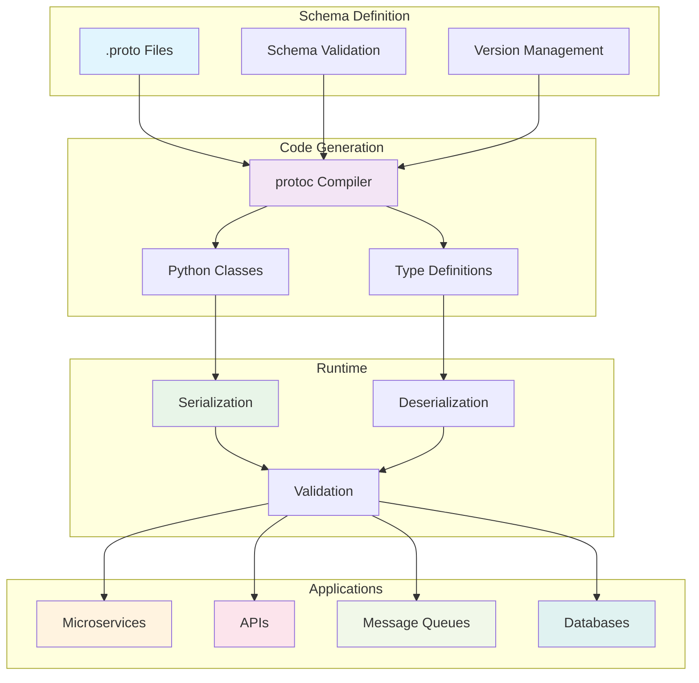

# Protocol Buffers with Python: Production-Ready Data Serialization

**Objective**: Master Protocol Buffers (protobufs) for efficient, type-safe data serialization in Python applications. When you need high-performance data exchange, when you want type-safe APIs, when you're building microservices that communicate efficiently—protobufs become your weapon of choice.

Protocol Buffers provide the foundation for efficient data serialization and type-safe communication. Without proper understanding of schema design, code generation, and serialization patterns, you're building inefficient systems that miss the power of binary serialization and schema evolution. This guide shows you how to wield protobufs with the precision of a senior Python engineer.

## 0) Prerequisites (Read Once, Live by Them)

### The Five Commandments

1. **Understand protobuf fundamentals**
   - Schema definition and versioning
   - Code generation and compilation
   - Binary serialization and deserialization
   - Schema evolution and backward compatibility

2. **Master Python integration**
   - Generated code usage patterns
   - Serialization performance optimization
   - Type safety and validation
   - Error handling and debugging

3. **Know your use cases**
   - Microservices communication
   - API data exchange
   - Database serialization
   - Message queues and streaming

4. **Validate everything**
   - Schema consistency and validation
   - Serialization correctness
   - Performance under load
   - Schema evolution compatibility

5. **Plan for production**
   - Scalable schema management
   - Monitoring and observability
   - Security and access control
   - Integration with existing systems

**Why These Principles**: Protobuf mastery is the foundation of efficient data serialization. Understanding schema design, mastering Python integration, and following best practices is essential for building production-ready systems.

## 1) What are Protocol Buffers? (The Foundation)

### Core Concepts

```yaml
# Protocol Buffers provide efficient data serialization
protobuf_concepts:
  schema_definition:
    - "Define data structures in .proto files"
    - "Type-safe field definitions"
    - "Schema versioning and evolution"
    - "Cross-language compatibility"
  
  code_generation:
    - "Generate Python classes from schemas"
    - "Type-safe data access"
    - "Serialization/deserialization methods"
    - "Validation and error handling"
  
  serialization:
    - "Binary format for efficiency"
    - "Compact representation"
    - "Fast parsing and generation"
    - "Cross-platform compatibility"
```

### Protobuf Architecture



### Why Protobufs Matter

```python
# Protobufs enable efficient, type-safe data serialization
import user_pb2

# Type-safe data creation
user = user_pb2.User()
user.id = 123
user.name = "John Doe"
user.email = "john@example.com"
user.is_active = True

# Efficient binary serialization
serialized_data = user.SerializeToString()
print(f"Serialized size: {len(serialized_data)} bytes")

# Fast deserialization
new_user = user_pb2.User()
new_user.ParseFromString(serialized_data)
print(f"Deserialized user: {new_user.name}")
```

**Why Protobufs Matter**: Protocol Buffers provide efficient, type-safe data serialization that's faster and more compact than JSON or XML. They enable high-performance communication between services while maintaining schema evolution capabilities.

## 2) Schema Design Best Practices (The Foundation)

### Protobuf Schema Structure

```protobuf
// user.proto - Complete user schema example
syntax = "proto3";

package company.users.v1;

import "google/protobuf/timestamp.proto";
import "google/protobuf/struct.proto";

// User message definition
message User {
  // Required fields
  int64 id = 1;
  string name = 2;
  string email = 3;
  
  // Optional fields with defaults
  bool is_active = 4;
  UserRole role = 5;
  google.protobuf.Timestamp created_at = 6;
  google.protobuf.Timestamp updated_at = 7;
  
  // Nested messages
  Address address = 8;
  repeated string tags = 9;
  
  // Map fields
  map<string, string> metadata = 10;
  
  // Oneof fields for variants
  oneof contact_method {
    string phone = 11;
    string telegram = 12;
  }
}

// Enum definitions
enum UserRole {
  USER_ROLE_UNSPECIFIED = 0;
  USER_ROLE_ADMIN = 1;
  USER_ROLE_USER = 2;
  USER_ROLE_GUEST = 3;
}

// Nested message
message Address {
  string street = 1;
  string city = 2;
  string state = 3;
  string zip_code = 4;
  string country = 5;
}

// Service definition
service UserService {
  rpc GetUser(GetUserRequest) returns (User);
  rpc CreateUser(CreateUserRequest) returns (User);
  rpc UpdateUser(UpdateUserRequest) returns (User);
  rpc DeleteUser(DeleteUserRequest) returns (google.protobuf.Empty);
  rpc ListUsers(ListUsersRequest) returns (ListUsersResponse);
}

// Request/Response messages
message GetUserRequest {
  int64 user_id = 1;
}

message CreateUserRequest {
  string name = 1;
  string email = 2;
  UserRole role = 3;
  Address address = 4;
}

message UpdateUserRequest {
  int64 user_id = 1;
  User user = 2;
}

message DeleteUserRequest {
  int64 user_id = 1;
}

message ListUsersRequest {
  int32 page_size = 1;
  string page_token = 2;
  UserRole role_filter = 3;
}

message ListUsersResponse {
  repeated User users = 1;
  string next_page_token = 2;
}
```

### Schema Design Principles

```protobuf
// Schema design best practices
message BestPractices {
  // 1. Use meaningful field names
  string user_name = 1;  // Good
  string n = 2;          // Bad
  
  // 2. Use appropriate field numbers (don't reuse)
  int64 id = 1;
  string name = 2;
  string email = 3;
  // int64 old_field = 1;  // Never reuse field numbers!
  
  // 3. Use enums for constants
  enum Status {
    STATUS_UNSPECIFIED = 0;
    STATUS_ACTIVE = 1;
    STATUS_INACTIVE = 2;
  }
  
  // 4. Use repeated for arrays
  repeated string tags = 4;
  
  // 5. Use maps for key-value pairs
  map<string, string> metadata = 5;
  
  // 6. Use oneof for variants
  oneof contact {
    string email = 6;
    string phone = 7;
  }
  
  // 7. Use timestamps for dates
  google.protobuf.Timestamp created_at = 8;
  
  // 8. Use wrappers for optional primitives
  google.protobuf.StringValue optional_name = 9;
}
```

### Schema Versioning Strategy

```protobuf
// Schema versioning best practices
message VersioningExample {
  // Always start with field number 1
  int64 id = 1;
  string name = 2;
  
  // Add new fields at the end
  string new_field = 3;
  
  // Mark deprecated fields
  string old_field = 4 [deprecated = true];
  
  // Use reserved for removed fields
  reserved 5, 6, 7;
  reserved "removed_field";
}

// Package versioning
// v1/user.proto
package company.users.v1;

// v2/user.proto  
package company.users.v2;
```

**Why This Schema Design Matters**: Proper schema design ensures type safety, performance, and schema evolution capabilities. Understanding field numbering, naming conventions, and versioning strategies provides the foundation for scalable protobuf systems.

## 3) Python Integration Patterns (The Implementation)

### Code Generation Setup

```python
# setup.py - Protobuf code generation
from setuptools import setup, find_packages
from setuptools.command.build_py import build_py
import subprocess
import os

class BuildProtobuf(build_py):
    """Custom build command to generate protobuf code"""
    
    def run(self):
        # Generate Python code from .proto files
        proto_files = [
            "protos/user.proto",
            "protos/order.proto",
            "protos/product.proto"
        ]
        
        for proto_file in proto_files:
            cmd = [
                "protoc",
                "--python_out=.",
                "--proto_path=protos",
                proto_file
            ]
            subprocess.run(cmd, check=True)
        
        # Call parent build
        super().run()

setup(
    name="my-protobuf-app",
    version="1.0.0",
    packages=find_packages(),
    install_requires=[
        "protobuf>=4.21.0",
        "grpcio>=1.50.0",
        "grpcio-tools>=1.50.0",
    ],
    cmdclass={
        "build_py": BuildProtobuf,
    },
)
```

### Generated Code Usage

```python
# user_pb2.py - Generated protobuf code usage
import user_pb2
from google.protobuf.timestamp_pb2 import Timestamp
from google.protobuf.struct_pb2 import Struct
import time

def create_user_example():
    """Example of creating and using protobuf messages"""
    
    # Create a new user
    user = user_pb2.User()
    user.id = 123
    user.name = "John Doe"
    user.email = "john@example.com"
    user.is_active = True
    user.role = user_pb2.UserRole.USER_ROLE_USER
    
    # Set timestamps
    now = Timestamp()
    now.GetCurrentTime()
    user.created_at.CopyFrom(now)
    user.updated_at.CopyFrom(now)
    
    # Set nested message
    address = user_pb2.Address()
    address.street = "123 Main St"
    address.city = "San Francisco"
    address.state = "CA"
    address.zip_code = "94105"
    address.country = "USA"
    user.address.CopyFrom(address)
    
    # Set repeated fields
    user.tags.extend(["premium", "vip", "beta"])
    
    # Set map fields
    user.metadata["source"] = "web"
    user.metadata["campaign"] = "summer2024"
    
    # Set oneof field
    user.phone = "+1-555-123-4567"
    
    return user

def serialize_user(user):
    """Serialize user to binary format"""
    return user.SerializeToString()

def deserialize_user(data):
    """Deserialize user from binary format"""
    user = user_pb2.User()
    user.ParseFromString(data)
    return user

def validate_user(user):
    """Validate user message"""
    if not user.name:
        raise ValueError("User name is required")
    if not user.email:
        raise ValueError("User email is required")
    if user.id <= 0:
        raise ValueError("User ID must be positive")
    return True
```

### Advanced Python Patterns

```python
# Advanced protobuf patterns in Python
import json
from typing import Dict, List, Any, Optional
from dataclasses import dataclass
from google.protobuf.json_format import MessageToJson, Parse

class ProtobufHelper:
    """Helper class for protobuf operations"""
    
    @staticmethod
    def to_dict(message) -> Dict[str, Any]:
        """Convert protobuf message to dictionary"""
        return json.loads(MessageToJson(message))
    
    @staticmethod
    def from_dict(message_class, data: Dict[str, Any]):
        """Create protobuf message from dictionary"""
        return Parse(json.dumps(data), message_class())
    
    @staticmethod
    def to_json(message) -> str:
        """Convert protobuf message to JSON string"""
        return MessageToJson(message, preserving_proto_field_name=True)
    
    @staticmethod
    def from_json(message_class, json_str: str):
        """Create protobuf message from JSON string"""
        return Parse(json_str, message_class())

class UserRepository:
    """Repository pattern for user protobuf operations"""
    
    def __init__(self, storage_backend):
        self.storage = storage_backend
    
    def save_user(self, user: user_pb2.User) -> str:
        """Save user to storage"""
        serialized = user.SerializeToString()
        user_id = str(user.id)
        self.storage.set(f"user:{user_id}", serialized)
        return user_id
    
    def get_user(self, user_id: str) -> Optional[user_pb2.User]:
        """Get user from storage"""
        data = self.storage.get(f"user:{user_id}")
        if not data:
            return None
        
        user = user_pb2.User()
        user.ParseFromString(data)
        return user
    
    def list_users(self, limit: int = 100) -> List[user_pb2.User]:
        """List users from storage"""
        users = []
        for key in self.storage.scan("user:*"):
            data = self.storage.get(key)
            if data:
                user = user_pb2.User()
                user.ParseFromString(data)
                users.append(user)
                if len(users) >= limit:
                    break
        return users

@dataclass
class UserDTO:
    """Data Transfer Object for user operations"""
    id: int
    name: str
    email: str
    is_active: bool
    role: str
    created_at: str
    address: Dict[str, str]
    tags: List[str]
    metadata: Dict[str, str]
    
    def to_protobuf(self) -> user_pb2.User:
        """Convert DTO to protobuf message"""
        user = user_pb2.User()
        user.id = self.id
        user.name = self.name
        user.email = self.email
        user.is_active = self.is_active
        user.role = user_pb2.UserRole.Value(self.role)
        
        # Set timestamps
        if self.created_at:
            timestamp = Timestamp()
            timestamp.FromJsonString(self.created_at)
            user.created_at.CopyFrom(timestamp)
        
        # Set address
        if self.address:
            address = user_pb2.Address()
            address.street = self.address.get("street", "")
            address.city = self.address.get("city", "")
            address.state = self.address.get("state", "")
            address.zip_code = self.address.get("zip_code", "")
            address.country = self.address.get("country", "")
            user.address.CopyFrom(address)
        
        # Set repeated fields
        user.tags.extend(self.tags)
        
        # Set map fields
        for key, value in self.metadata.items():
            user.metadata[key] = value
        
        return user
    
    @classmethod
    def from_protobuf(cls, user: user_pb2.User) -> 'UserDTO':
        """Create DTO from protobuf message"""
        return cls(
            id=user.id,
            name=user.name,
            email=user.email,
            is_active=user.is_active,
            role=user.role.name,
            created_at=user.created_at.ToJsonString(),
            address={
                "street": user.address.street,
                "city": user.address.city,
                "state": user.address.state,
                "zip_code": user.address.zip_code,
                "country": user.address.country,
            },
            tags=list(user.tags),
            metadata=dict(user.metadata)
        )
```

**Why This Integration Matters**: Proper Python integration enables type-safe, efficient protobuf usage. Understanding code generation, serialization patterns, and helper classes provides the foundation for production-ready protobuf systems.

## 4) Performance Optimization (The Speed)

### Serialization Performance

```python
# Performance optimization patterns
import time
import json
import pickle
from typing import List
import user_pb2

class ProtobufPerformance:
    """Performance testing and optimization for protobufs"""
    
    def __init__(self):
        self.users = self._create_test_users(1000)
    
    def _create_test_users(self, count: int) -> List[user_pb2.User]:
        """Create test users for performance testing"""
        users = []
        for i in range(count):
            user = user_pb2.User()
            user.id = i
            user.name = f"User {i}"
            user.email = f"user{i}@example.com"
            user.is_active = True
            user.role = user_pb2.UserRole.USER_ROLE_USER
            users.append(user)
        return users
    
    def benchmark_serialization(self):
        """Benchmark different serialization methods"""
        results = {}
        
        # Protobuf serialization
        start_time = time.time()
        protobuf_data = [user.SerializeToString() for user in self.users]
        protobuf_time = time.time() - start_time
        protobuf_size = sum(len(data) for data in protobuf_data)
        
        # JSON serialization
        start_time = time.time()
        json_data = [user.to_json() for user in self.users]
        json_time = time.time() - start_time
        json_size = sum(len(data) for data in json_data)
        
        # Pickle serialization
        start_time = time.time()
        pickle_data = [pickle.dumps(user) for user in self.users]
        pickle_time = time.time() - start_time
        pickle_size = sum(len(data) for data in pickle_data)
        
        results = {
            "protobuf": {
                "time": protobuf_time,
                "size": protobuf_size,
                "size_per_user": protobuf_size / len(self.users)
            },
            "json": {
                "time": json_time,
                "size": json_size,
                "size_per_user": json_size / len(self.users)
            },
            "pickle": {
                "time": pickle_time,
                "size": pickle_size,
                "size_per_user": pickle_size / len(self.users)
            }
        }
        
        return results
    
    def benchmark_deserialization(self, protobuf_data, json_data, pickle_data):
        """Benchmark deserialization performance"""
        results = {}
        
        # Protobuf deserialization
        start_time = time.time()
        protobuf_users = []
        for data in protobuf_data:
            user = user_pb2.User()
            user.ParseFromString(data)
            protobuf_users.append(user)
        protobuf_time = time.time() - start_time
        
        # JSON deserialization
        start_time = time.time()
        json_users = []
        for data in json_data:
            user = user_pb2.User()
            user.ParseFromString(data)
            json_users.append(user)
        json_time = time.time() - start_time
        
        # Pickle deserialization
        start_time = time.time()
        pickle_users = [pickle.loads(data) for data in pickle_data]
        pickle_time = time.time() - start_time
        
        results = {
            "protobuf": protobuf_time,
            "json": json_time,
            "pickle": pickle_time
        }
        
        return results

class ProtobufOptimizer:
    """Optimization strategies for protobuf usage"""
    
    @staticmethod
    def use_repeated_fields_efficiently():
        """Optimize repeated field usage"""
        # Good: Use extend() for multiple items
        user = user_pb2.User()
        user.tags.extend(["tag1", "tag2", "tag3"])
        
        # Bad: Use append() in a loop
        # for tag in ["tag1", "tag2", "tag3"]:
        #     user.tags.append(tag)
    
    @staticmethod
    def use_maps_efficiently():
        """Optimize map field usage"""
        # Good: Set multiple map entries at once
        user = user_pb2.User()
        user.metadata.update({
            "key1": "value1",
            "key2": "value2",
            "key3": "value3"
        })
        
        # Bad: Set map entries one by one
        # user.metadata["key1"] = "value1"
        # user.metadata["key2"] = "value2"
        # user.metadata["key3"] = "value3"
    
    @staticmethod
    def use_timestamps_efficiently():
        """Optimize timestamp usage"""
        # Good: Use GetCurrentTime() for current time
        timestamp = Timestamp()
        timestamp.GetCurrentTime()
        
        # Bad: Use FromDatetime() for current time
        # from datetime import datetime
        # timestamp.FromDatetime(datetime.now())
    
    @staticmethod
    def use_optional_fields_efficiently():
        """Optimize optional field usage"""
        # Good: Check if field is set before accessing
        user = user_pb2.User()
        if user.HasField("address"):
            print(f"Address: {user.address.street}")
        
        # Bad: Always access optional fields
        # print(f"Address: {user.address.street}")  # May cause errors
```

### Memory Optimization

```python
# Memory optimization patterns
import gc
from typing import Iterator
import user_pb2

class ProtobufMemoryOptimizer:
    """Memory optimization strategies for protobuf usage"""
    
    @staticmethod
    def stream_large_datasets(users: List[user_pb2.User]) -> Iterator[user_pb2.User]:
        """Stream large datasets to avoid memory issues"""
        for user in users:
            yield user
            # Process user and let it be garbage collected
            del user
            gc.collect()
    
    @staticmethod
    def use_protobuf_pooling():
        """Use object pooling for frequently created messages"""
        class MessagePool:
            def __init__(self, message_class, pool_size=100):
                self.message_class = message_class
                self.pool = []
                self.pool_size = pool_size
            
            def get_message(self):
                if self.pool:
                    message = self.pool.pop()
                    message.Clear()
                    return message
                return self.message_class()
            
            def return_message(self, message):
                if len(self.pool) < self.pool_size:
                    self.pool.append(message)
        
        # Usage
        pool = MessagePool(user_pb2.User)
        user = pool.get_message()
        # Use user...
        pool.return_message(user)
    
    @staticmethod
    def optimize_serialization_batch(users: List[user_pb2.User]) -> bytes:
        """Optimize batch serialization"""
        # Serialize all users into a single buffer
        buffer = bytearray()
        for user in users:
            serialized = user.SerializeToString()
            # Add length prefix for deserialization
            length = len(serialized)
            buffer.extend(length.to_bytes(4, 'big'))
            buffer.extend(serialized)
        return bytes(buffer)
    
    @staticmethod
    def optimize_deserialization_batch(data: bytes) -> List[user_pb2.User]:
        """Optimize batch deserialization"""
        users = []
        offset = 0
        
        while offset < len(data):
            # Read length prefix
            length = int.from_bytes(data[offset:offset+4], 'big')
            offset += 4
            
            # Deserialize user
            user = user_pb2.User()
            user.ParseFromString(data[offset:offset+length])
            users.append(user)
            offset += length
        
        return users
```

**Why This Optimization Matters**: Performance optimization ensures protobuf systems can handle high-throughput scenarios. Understanding serialization patterns, memory management, and batch processing provides the foundation for scalable protobuf applications.

## 5) Production Deployment (The Scale)

### Docker Configuration

```dockerfile
# Dockerfile for protobuf Python application
FROM python:3.11-slim

# Install protobuf compiler
RUN apt-get update && apt-get install -y \
    protobuf-compiler \
    && rm -rf /var/lib/apt/lists/*

# Set working directory
WORKDIR /app

# Copy requirements
COPY requirements.txt .

# Install Python dependencies
RUN pip install --no-cache-dir -r requirements.txt

# Copy protobuf files
COPY protos/ ./protos/

# Generate Python code from protobuf files
RUN protoc --python_out=. --proto_path=protos protos/*.proto

# Copy application code
COPY src/ ./src/

# Set Python path
ENV PYTHONPATH=/app

# Expose port
EXPOSE 8000

# Start application
CMD ["python", "src/main.py"]
```

### Production Configuration

```python
# config.py - Production configuration
import os
from typing import Dict, Any

class ProtobufConfig:
    """Configuration for protobuf production deployment"""
    
    def __init__(self):
        self.protobuf_settings = {
            "max_message_size": int(os.getenv("PROTOBUF_MAX_MESSAGE_SIZE", "4194304")),  # 4MB
            "max_field_size": int(os.getenv("PROTOBUF_MAX_FIELD_SIZE", "1048576")),    # 1MB
            "max_repeated_field_size": int(os.getenv("PROTOBUF_MAX_REPEATED_FIELD_SIZE", "1000")),
            "enable_reflection": os.getenv("PROTOBUF_ENABLE_REFLECTION", "true").lower() == "true",
            "enable_caching": os.getenv("PROTOBUF_ENABLE_CACHING", "true").lower() == "true",
        }
    
    def get_grpc_options(self) -> list:
        """Get gRPC options for production"""
        return [
            ('grpc.max_send_message_length', self.protobuf_settings["max_message_size"]),
            ('grpc.max_receive_message_length', self.protobuf_settings["max_message_size"]),
            ('grpc.max_metadata_size', 8192),
            ('grpc.keepalive_time_ms', 30000),
            ('grpc.keepalive_timeout_ms', 5000),
            ('grpc.keepalive_permit_without_calls', True),
            ('grpc.http2.max_pings_without_data', 0),
            ('grpc.http2.min_time_between_pings_ms', 10000),
            ('grpc.http2.min_ping_interval_without_data_ms', 300000),
        ]
    
    def get_serialization_options(self) -> Dict[str, Any]:
        """Get serialization options for production"""
        return {
            "deterministic": True,
            "preserve_unknown_fields": False,
            "allow_partial": False,
        }

# Production deployment configuration
class ProductionDeployment:
    """Production deployment patterns for protobuf applications"""
    
    def __init__(self, config: ProtobufConfig):
        self.config = config
    
    def setup_monitoring(self):
        """Setup monitoring for protobuf operations"""
        import logging
        from prometheus_client import Counter, Histogram, Gauge
        
        # Metrics
        self.serialization_counter = Counter(
            'protobuf_serializations_total',
            'Total number of protobuf serializations',
            ['message_type', 'status']
        )
        
        self.deserialization_counter = Counter(
            'protobuf_deserializations_total',
            'Total number of protobuf deserializations',
            ['message_type', 'status']
        )
        
        self.serialization_duration = Histogram(
            'protobuf_serialization_duration_seconds',
            'Time spent on protobuf serialization',
            ['message_type']
        )
        
        self.message_size = Histogram(
            'protobuf_message_size_bytes',
            'Size of protobuf messages',
            ['message_type']
        )
        
        # Logging
        self.logger = logging.getLogger(__name__)
        self.logger.setLevel(logging.INFO)
    
    def setup_error_handling(self):
        """Setup error handling for protobuf operations"""
        from google.protobuf.message import DecodeError
        from google.protobuf.text_format import ParseError
        
        def handle_serialization_error(func):
            def wrapper(*args, **kwargs):
                try:
                    return func(*args, **kwargs)
                except DecodeError as e:
                    self.logger.error(f"Protobuf decode error: {e}")
                    raise ValueError(f"Invalid protobuf data: {e}")
                except ParseError as e:
                    self.logger.error(f"Protobuf parse error: {e}")
                    raise ValueError(f"Invalid protobuf format: {e}")
                except Exception as e:
                    self.logger.error(f"Unexpected protobuf error: {e}")
                    raise
            return wrapper
        
        return handle_serialization_error
    
    def setup_caching(self):
        """Setup caching for protobuf operations"""
        import redis
        import pickle
        
        self.redis_client = redis.Redis(
            host=os.getenv("REDIS_HOST", "localhost"),
            port=int(os.getenv("REDIS_PORT", "6379")),
            db=int(os.getenv("REDIS_DB", "0"))
        )
        
        def cache_serialized_message(key: str, message, ttl: int = 3600):
            """Cache serialized protobuf message"""
            serialized = message.SerializeToString()
            self.redis_client.setex(key, ttl, serialized)
        
        def get_cached_message(key: str, message_class):
            """Get cached protobuf message"""
            data = self.redis_client.get(key)
            if data:
                message = message_class()
                message.ParseFromString(data)
                return message
            return None
        
        return cache_serialized_message, get_cached_message
```

### Schema Management

```python
# schema_management.py - Production schema management
import os
import hashlib
from typing import Dict, List, Optional
from pathlib import Path

class SchemaManager:
    """Production schema management for protobufs"""
    
    def __init__(self, schema_dir: str = "protos"):
        self.schema_dir = Path(schema_dir)
        self.schema_versions = {}
        self.schema_hashes = {}
    
    def load_schema_versions(self):
        """Load and validate schema versions"""
        for proto_file in self.schema_dir.glob("*.proto"):
            version = self._extract_version(proto_file)
            hash_value = self._calculate_hash(proto_file)
            
            self.schema_versions[proto_file.name] = version
            self.schema_hashes[proto_file.name] = hash_value
    
    def _extract_version(self, proto_file: Path) -> str:
        """Extract version from proto file"""
        with open(proto_file, 'r') as f:
            content = f.read()
            # Look for version in package name or comments
            if "v1" in content:
                return "v1"
            elif "v2" in content:
                return "v2"
            else:
                return "v1"  # Default version
    
    def _calculate_hash(self, proto_file: Path) -> str:
        """Calculate hash of proto file"""
        with open(proto_file, 'rb') as f:
            content = f.read()
            return hashlib.md5(content).hexdigest()
    
    def validate_schema_compatibility(self, old_schema: str, new_schema: str) -> bool:
        """Validate schema compatibility for evolution"""
        # Check for breaking changes
        breaking_changes = [
            "removed required fields",
            "changed field types",
            "renamed fields",
            "changed enum values"
        ]
        
        # This would implement actual compatibility checking
        # For now, return True for demonstration
        return True
    
    def generate_schema_documentation(self) -> Dict[str, str]:
        """Generate documentation for schemas"""
        documentation = {}
        
        for proto_file in self.schema_dir.glob("*.proto"):
            with open(proto_file, 'r') as f:
                content = f.read()
                
                # Extract message definitions
                messages = self._extract_messages(content)
                
                # Generate documentation
                doc = self._generate_message_docs(messages)
                documentation[proto_file.name] = doc
        
        return documentation
    
    def _extract_messages(self, content: str) -> List[Dict[str, str]]:
        """Extract message definitions from proto content"""
        messages = []
        # This would implement actual message extraction
        # For now, return empty list
        return messages
    
    def _generate_message_docs(self, messages: List[Dict[str, str]]) -> str:
        """Generate documentation for messages"""
        # This would implement actual documentation generation
        # For now, return placeholder
        return "Generated documentation for messages"
```

**Why This Deployment Matters**: Production deployment requires proper containerization, monitoring, and schema management. Understanding these patterns ensures scalable and reliable protobuf systems.

## 6) Common Pitfalls (The Traps)

### Schema Design Mistakes

```protobuf
// ❌ WRONG: Poor schema design
message BadUser {
  int32 id = 1;
  string name = 2;
  string email = 3;
  // Missing required fields
  // No versioning strategy
  // No field documentation
}

// ✅ CORRECT: Good schema design
message GoodUser {
  int64 id = 1;  // Use int64 for IDs
  string name = 2;
  string email = 3;
  bool is_active = 4;
  UserRole role = 5;
  google.protobuf.Timestamp created_at = 6;
  google.protobuf.Timestamp updated_at = 7;
}
```

### Python Integration Mistakes

```python
# ❌ WRONG: Poor Python integration
def bad_protobuf_usage():
    user = user_pb2.User()
    user.id = "123"  # Wrong type!
    user.name = None  # None not allowed!
    user.email = ""  # Empty string not validated!
    
    # No error handling
    data = user.SerializeToString()
    return data

# ✅ CORRECT: Good Python integration
def good_protobuf_usage():
    user = user_pb2.User()
    user.id = 123  # Correct type
    user.name = "John Doe"  # Valid string
    user.email = "john@example.com"  # Valid email
    
    # Proper error handling
    try:
        data = user.SerializeToString()
        return data
    except Exception as e:
        logger.error(f"Serialization error: {e}")
        raise
```

### Performance Anti-patterns

```python
# ❌ WRONG: Inefficient protobuf usage
def bad_performance():
    users = []
    for i in range(1000):
        user = user_pb2.User()  # Creating new objects
        user.id = i
        user.name = f"User {i}"
        users.append(user)
    
    # Serializing one by one
    serialized = []
    for user in users:
        serialized.append(user.SerializeToString())
    
    return serialized

# ✅ CORRECT: Efficient protobuf usage
def good_performance():
    # Use object pooling
    pool = MessagePool(user_pb2.User)
    
    users = []
    for i in range(1000):
        user = pool.get_message()  # Reuse objects
        user.id = i
        user.name = f"User {i}"
        users.append(user)
    
    # Batch serialization
    serialized = [user.SerializeToString() for user in users]
    
    # Return objects to pool
    for user in users:
        pool.return_message(user)
    
    return serialized
```

**Why These Pitfalls Matter**: Common mistakes lead to poor performance, type errors, and schema evolution issues. Understanding these pitfalls prevents costly errors and ensures reliable protobuf systems.

## 7) Best Practices Checklist (The Wisdom)

### Schema Design Checklist

```python
# ✅ DO: Complete schema design checklist
def schema_design_checklist():
    checklist = {
        "field_design": [
            "Use appropriate field types",
            "Use meaningful field names",
            "Use proper field numbering",
            "Add field documentation"
        ],
        "versioning": [
            "Use package versioning",
            "Plan for schema evolution",
            "Use reserved fields",
            "Document breaking changes"
        ],
        "performance": [
            "Use repeated fields efficiently",
            "Use maps for key-value pairs",
            "Use oneof for variants",
            "Optimize field ordering"
        ],
        "compatibility": [
            "Maintain backward compatibility",
            "Use optional fields for new features",
            "Plan for forward compatibility",
            "Test schema evolution"
        ]
    }
    return checklist
```

### Python Integration Checklist

```python
# ✅ DO: Python integration checklist
def python_integration_checklist():
    checklist = {
        "code_generation": [
            "Use protoc for code generation",
            "Set up automated build process",
            "Version control generated code",
            "Validate generated code"
        ],
        "serialization": [
            "Handle serialization errors",
            "Validate message data",
            "Use appropriate encoding",
            "Optimize for performance"
        ],
        "type_safety": [
            "Use type hints",
            "Validate field types",
            "Handle optional fields",
            "Use enums properly"
        ],
        "error_handling": [
            "Catch protobuf exceptions",
            "Log serialization errors",
            "Provide meaningful error messages",
            "Handle schema evolution"
        ]
    }
    return checklist
```

### Production Deployment Checklist

```python
# ✅ DO: Production deployment checklist
def production_deployment_checklist():
    checklist = {
        "infrastructure": [
            "Set up Docker containers",
            "Configure protobuf compiler",
            "Set up schema management",
            "Configure monitoring"
        ],
        "performance": [
            "Optimize serialization",
            "Use object pooling",
            "Implement caching",
            "Monitor memory usage"
        ],
        "monitoring": [
            "Set up metrics collection",
            "Monitor serialization performance",
            "Track message sizes",
            "Alert on errors"
        ],
        "security": [
            "Validate message data",
            "Implement access control",
            "Use secure serialization",
            "Audit schema changes"
        ]
    }
    return checklist
```

**Why These Practices Matter**: Best practices ensure successful protobuf implementation. Following established patterns prevents common mistakes and enables production-ready systems.

## 8) TL;DR Quickstart (The Essentials)

### Essential Protobuf Setup

```bash
# 1) Install protobuf compiler
sudo apt-get install protobuf-compiler

# 2) Install Python protobuf library
pip install protobuf grpcio grpcio-tools

# 3) Create proto file
cat > user.proto << 'EOF'
syntax = "proto3";
package users.v1;

message User {
  int64 id = 1;
  string name = 2;
  string email = 3;
  bool is_active = 4;
}
EOF

# 4) Generate Python code
protoc --python_out=. user.proto

# 5) Use in Python
python -c "
import user_pb2
user = user_pb2.User()
user.id = 123
user.name = 'John Doe'
user.email = 'john@example.com'
user.is_active = True
print(user.SerializeToString())
"
```

### Essential Python Patterns

```python
# Essential protobuf patterns
def essential_protobuf_patterns():
    # 1. Create message
    user = user_pb2.User()
    user.id = 123
    user.name = "John Doe"
    user.email = "john@example.com"
    user.is_active = True
    
    # 2. Serialize
    data = user.SerializeToString()
    
    # 3. Deserialize
    new_user = user_pb2.User()
    new_user.ParseFromString(data)
    
    # 4. Validate
    if new_user.HasField("name"):
        print(f"User: {new_user.name}")
    
    return new_user
```

### Essential Tools

```bash
# Essential tools for protobuf development
tools:
  compiler: "protoc"
  python_lib: "protobuf"
  grpc: "grpcio"
  tools: "grpcio-tools"
  validation: "protoc-gen-validate"
  documentation: "protoc-gen-doc"
```

**Why This Quickstart**: These patterns cover 90% of protobuf usage. Master these before exploring advanced features.

## 9) The Machine's Summary

Protocol Buffers provide the foundation for efficient, type-safe data serialization. When used correctly, they enable high-performance communication between services while maintaining schema evolution capabilities. The key is understanding schema design, mastering Python integration, and following best practices.

**The Dark Truth**: Without proper protobuf understanding, your data serialization is inefficient and error-prone. Protobufs are your weapon. Use them wisely.

**The Machine's Mantra**: "In schema we trust, in serialization we build, and in the protobuf we find the path to efficient data exchange."

**Why This Matters**: Protocol Buffers enable applications to serialize and deserialize data efficiently and safely. They provide the foundation for high-performance microservices that can communicate reliably while maintaining schema evolution capabilities.

---

*This guide provides the complete machinery for mastering Protocol Buffers with Python. The patterns scale from simple message serialization to complex microservices communication, from basic schemas to advanced production deployment.*
