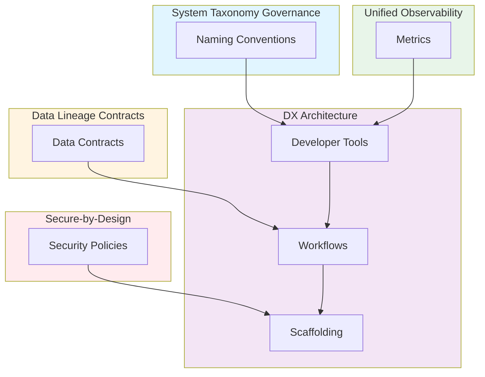

# Developer Experience (DX) as Infrastructure: Golden Paths, Tooling Ecosystems & Workflow Automation

**Objective**: Establish developer experience as infrastructure concern, providing golden paths, consistent tooling, and automated workflows that reduce cognitive load and operational entropy. When you need consistent scaffolding, when you want automated workflows, when you need AI-assisted development—this guide provides the complete framework.

## Introduction

Developer experience is not a nice-to-have—it's infrastructure that enables productivity, reduces errors, and accelerates delivery. This guide establishes DX patterns that integrate with all other best practices to create a cohesive developer ecosystem.

**What This Guide Covers**:
- Consistent scaffolding across languages
- Internal CLIs for golden workflows
- GitFlow pipelines optimized with metadata
- Debugging and profiling tools wired to observability
- Python/Go/Rust code generation templates
- Consistent test architecture
- AI-assisted development workflows
- Onboarding playbooks tied to taxonomy

**Prerequisites**:
- Understanding of developer workflows and tooling
- Familiarity with Python, Go, Rust
- Experience with CI/CD and automation

**Related Documents**:
This document integrates with:
- **[System Taxonomy Governance](../architecture-design/system-taxonomy-governance.md)** - Developer tools enforce taxonomy
- **[Data Lineage Contracts](../database-data/data-lineage-contracts.md)** - Developer tools use lineage
- **[Secure-by-Design Polyglot](../security/secure-by-design-polyglot.md)** - Developer tools enforce security
- **[Unified Observability Architecture](../operations-monitoring/unified-observability-architecture.md)** - Developer tools use observability

## The Philosophy of DX as Infrastructure

### Golden Paths

**Principle**: Provide clear, well-supported paths for common tasks.

**Example**:
```bash
# Golden path: Create new service
make new-service name=user-api domain=user type=api

# Golden path: Run tests
make test

# Golden path: Deploy
make deploy environment=staging
```

### Consistency Across Languages

**Principle**: Same experience regardless of language.

**Example**:
```bash
# Python
make test

# Go
make test

# Rust
make test
# Same command, same behavior
```

## Consistent Scaffolding Across Languages

### Python Scaffolding

**Template**:
```python
# templates/python-service/
service_name/
├── src/
│   └── service_name/
│       ├── __init__.py
│       ├── main.py
│       ├── handlers/
│       ├── services/
│       ├── models/
│       └── utils/
├── tests/
├── docs/
├── .pre-commit-config.yaml
├── Makefile
├── pyproject.toml
└── README.md
```

### Go Scaffolding

**Template**:
```
templates/go-service/
service_name/
├── cmd/
│   └── service_name/
│       └── main.go
├── internal/
│   ├── handlers/
│   ├── services/
│   ├── models/
│   └── utils/
├── pkg/
├── tests/
├── docs/
├── Makefile
├── go.mod
└── README.md
```

### Rust Scaffolding

**Template**:
```
templates/rust-service/
service_name/
├── src/
│   ├── main.rs
│   ├── handlers/
│   ├── services/
│   ├── models/
│   └── utils/
├── tests/
├── docs/
├── Makefile
├── Cargo.toml
└── README.md
```

## Internal CLIs for Golden Workflows

### Unified CLI

**Pattern**: Single CLI for all workflows.

**Example**:
```python
# cli.py
import click

@click.group()
def cli():
    """Unified development CLI"""
    pass

@cli.command()
def new_service():
    """Create new service"""
    name = click.prompt("Service name")
    domain = click.prompt("Domain")
    service_type = click.prompt("Service type")
    scaffold_service(name, domain, service_type)

@cli.command()
def test():
    """Run tests"""
    run_tests()

@cli.command()
def deploy():
    """Deploy service"""
    environment = click.prompt("Environment")
    deploy_service(environment)
```

## GitFlow Pipelines Optimized with Metadata

### Metadata-Enhanced Pipelines

**Pattern**: Use metadata for pipeline optimization.

**Example**:
```yaml
# .github/workflows/ci.yml
name: CI
on: [push, pull_request]

jobs:
  test:
    runs-on: ubuntu-latest
    steps:
      - uses: actions/checkout@v3
      
      - name: Load metadata
        run: |
          metadata=$(load_metadata)
          echo "Service: $(echo $metadata | jq -r '.service')"
          echo "Domain: $(echo $metadata | jq -r '.domain')"
      
      - name: Run tests
        run: |
          make test
      
      - name: Generate lineage
        run: |
          generate_lineage $metadata
```

See: **[Data Lineage Contracts](../database-data/data-lineage-contracts.md)**

## Debugging and Profiling Tools Wired to Observability

### Observability-Integrated Debugging

**Pattern**: Debugging uses observability data.

**Example**:
```python
# Debugging with observability
class ObservableDebugger:
    def debug_request(self, trace_id: str):
        """Debug request using trace"""
        # Get trace
        trace = get_trace(trace_id)
        
        # Get logs
        logs = get_logs(trace_id)
        
        # Get metrics
        metrics = get_metrics(trace_id)
        
        # Debug
        debug_info = {
            'trace': trace,
            'logs': logs,
            'metrics': metrics
        }
        
        return debug_info
```

See: **[Unified Observability Architecture](../operations-monitoring/unified-observability-architecture.md)**

## Code Generation Templates

### Python Code Generation

**Pattern**: Generate code from templates.

**Example**:
```python
# codegen/python_api.py
class PythonAPIGenerator:
    def generate_api(self, spec: dict) -> str:
        """Generate Python API from spec"""
        template = load_template('python_api.j2')
        return template.render(spec=spec)
```

### Go Code Generation

**Pattern**: Generate Go code from templates.

**Example**:
```go
// codegen/go_api.go
func GenerateAPI(spec Spec) string {
    template := loadTemplate("go_api.tmpl")
    return renderTemplate(template, spec)
}
```

### Rust Code Generation

**Pattern**: Generate Rust code from templates.

**Example**:
```rust
// codegen/rust_api.rs
fn generate_api(spec: &Spec) -> String {
    let template = load_template("rust_api.hbs");
    render_template(template, spec)
}
```

## Consistent Test Architecture

### Test Structure

**Pattern**: Consistent test structure across languages.

**Example**:
```
tests/
├── unit/
│   ├── test_handlers.py
│   ├── test_services.py
│   └── test_models.py
├── integration/
│   ├── test_api.py
│   └── test_database.py
└── e2e/
    └── test_workflows.py
```

### Test Utilities

**Pattern**: Shared test utilities.

**Example**:
```python
# tests/utils.py
class TestUtils:
    @staticmethod
    def create_test_user():
        """Create test user"""
        return User(id=1, email="test@example.com")
    
    @staticmethod
    def mock_database():
        """Mock database"""
        return MockDatabase()
```

## AI-Assisted Development Workflows

### AI Code Assistant

**Pattern**: AI-assisted development.

**Example**:
```python
# ai/code_assistant.py
class AICodeAssistant:
    def suggest_code(self, context: dict) -> str:
        """Suggest code using AI"""
        prompt = f"""
        Generate code for:
        {json.dumps(context, indent=2)}
        """
        
        response = self.llm_client.chat.completions.create(
            model="gpt-4",
            messages=[
                {"role": "system", "content": "You are a code generation expert."},
                {"role": "user", "content": prompt}
            ]
        )
        
        return response.choices[0].message.content
```

### AI Code Review

**Pattern**: AI-assisted code review.

**Example**:
```python
# ai/code_review.py
class AICodeReviewer:
    def review_code(self, code: str) -> dict:
        """Review code using AI"""
        prompt = f"""
        Review this code:
        {code}
        """
        
        response = self.llm_client.chat.completions.create(
            model="gpt-4",
            messages=[
                {"role": "system", "content": "You are a code review expert."},
                {"role": "user", "content": prompt}
            ]
        )
        
        return json.loads(response.choices[0].message.content)
```

## Onboarding Playbooks Tied to Taxonomy

### Taxonomy-Based Onboarding

**Pattern**: Onboarding uses taxonomy.

**Example**:
```markdown
# Onboarding Playbook

## Week 1: Foundation
- [ ] Learn taxonomy: [System Taxonomy Governance](../architecture-design/system-taxonomy-governance.md)
- [ ] Understand domains: user, order, payment
- [ ] Learn naming conventions

## Week 2: Data & Lineage
- [ ] Learn lineage: [Data Lineage Contracts](../database-data/data-lineage-contracts.md)
- [ ] Understand data flow
- [ ] Practice tracing lineage

## Week 3: Security
- [ ] Learn security: [Secure-by-Design Polyglot](../security/secure-by-design-polyglot.md)
- [ ] Understand zero-trust
- [ ] Practice secure coding

## Week 4: Observability
- [ ] Learn observability: [Unified Observability Architecture](../operations-monitoring/unified-observability-architecture.md)
- [ ] Understand logging, metrics, traces
- [ ] Practice debugging with observability
```

See: **[System Taxonomy Governance](../architecture-design/system-taxonomy-governance.md)**

## Integration: How All Practices Combine

### Complete Workflow

**Pattern**: All practices work together.

**Example**:
```python
# Complete workflow
class CompleteWorkflow:
    def create_service(self, name: str, domain: str):
        """Create service using all practices"""
        # 1. Use taxonomy for naming
        service_name = apply_taxonomy(name, domain)  # From taxonomy
        
        # 2. Scaffold service
        scaffold_service(service_name, domain)
        
        # 3. Generate lineage metadata
        generate_lineage_metadata(service_name)  # From lineage
        
        # 4. Apply security defaults
        apply_security_defaults(service_name)  # From security
        
        # 5. Configure observability
        configure_observability(service_name)  # From observability
        
        # 6. Generate tests
        generate_tests(service_name)
        
        return service_name
```

## Cross-Document Architecture



## Checklists

### DX Compliance Checklist

- [ ] Consistent scaffolding configured
- [ ] Internal CLIs available
- [ ] GitFlow pipelines optimized
- [ ] Debugging tools integrated
- [ ] Code generation templates ready
- [ ] Test architecture consistent
- [ ] AI assistance enabled
- [ ] Onboarding playbooks created

## Anti-Patterns

### DX Anti-Patterns

**Inconsistent Tooling**:
```bash
# Bad: Inconsistent
python test.py  # Python
go test         # Go
cargo test      # Rust

# Good: Consistent
make test       # All languages
```

**Manual Workflows**:
```bash
# Bad: Manual
git checkout -b feature
# ... manual steps ...
git push

# Good: Automated
make new-feature name=feature-name
```

## See Also

- **[System Taxonomy Governance](../architecture-design/system-taxonomy-governance.md)** - Developer tools enforce taxonomy
- **[Data Lineage Contracts](../database-data/data-lineage-contracts.md)** - Developer tools use lineage
- **[Secure-by-Design Polyglot](../security/secure-by-design-polyglot.md)** - Developer tools enforce security
- **[Unified Observability Architecture](../operations-monitoring/unified-observability-architecture.md)** - Developer tools use observability

---

*This guide establishes DX patterns that integrate with all other best practices. Start with golden paths, extend to automation, and continuously improve developer experience.*

