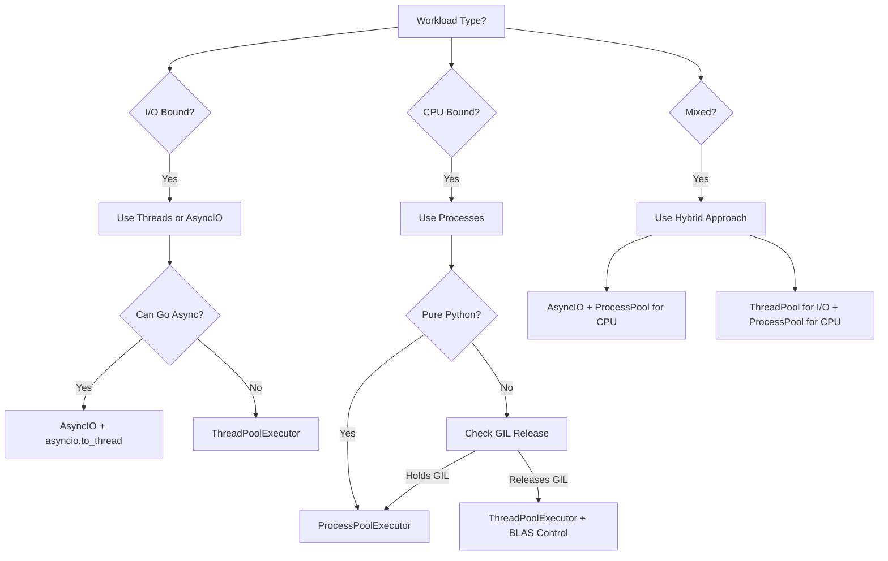

# Python Concurrency: Threads vs Processes (and Doing Pools the Right Way)

**Objective**: Master Python concurrency with a focus on production performance, safety, and scalability. When you need to handle I/O-bound workloads, when you want true CPU parallelism, when you're building production systems—concurrency becomes your weapon of choice.

The GIL is not your enemy, but it's not your friend either. Understanding when to use threads, processes, or asyncio determines whether your application scales or crumbles under load. This guide shows you how to wield Python concurrency with the precision of a battle-tested backend engineer.

## 0) Prerequisites (Read Once, Live by Them)

### The Five Commandments

1. **Understand the GIL and its implications**
   - Global Interpreter Lock limitations
   - I/O-bound vs CPU-bound workloads
   - When threads work vs when they don't
   - Native library GIL releases

2. **Master concurrency patterns**
   - ThreadPoolExecutor and ProcessPoolExecutor
   - Multiprocessing queues and shared memory
   - Asyncio integration and hybrid patterns
   - Graceful shutdown and error handling

3. **Know your performance trade-offs**
   - Thread overhead vs process overhead
   - Memory sharing vs IPC costs
   - Context switching vs parallelism
   - Oversubscription and resource management

4. **Validate everything**
   - Profile before optimizing
   - Test with realistic workloads
   - Monitor resource usage
   - Handle edge cases and failures

5. **Plan for production**
   - Graceful shutdown patterns
   - Error handling and recovery
   - Resource limits and backpressure
   - Monitoring and debugging

**Why These Principles**: Concurrency mastery is the foundation of scalable Python applications. Understanding these patterns prevents deadlocks, resource leaks, and performance bottlenecks.

## 1) The Concurrency Decision Tree

### When to Use What



### Fast Rules of Thumb

```python
# Decision matrix
concurrency_rules = {
    "io_bound": {
        "preferred": "asyncio or ThreadPoolExecutor",
        "reason": "I/O releases GIL, threads are cheap",
        "max_workers": "min(32, os.cpu_count() + 4)"
    },
    "cpu_bound_pure_python": {
        "preferred": "ProcessPoolExecutor",
        "reason": "GIL prevents true parallelism",
        "max_workers": "os.cpu_count()"
    },
    "cpu_bound_native_libs": {
        "preferred": "ThreadPoolExecutor + BLAS control",
        "reason": "NumPy/BLAS release GIL",
        "max_workers": "os.cpu_count()",
        "note": "Set OMP_NUM_THREADS=1"
    },
    "mixed_workload": {
        "preferred": "AsyncIO + ProcessPool",
        "reason": "Async for I/O, processes for CPU",
        "pattern": "orchestrate with async, offload CPU to processes"
    }
}
```

**Why This Decision Tree Matters**: Choosing the wrong concurrency model leads to poor performance and resource waste. Understanding these patterns prevents costly mistakes and enables optimal scaling.

## 2) ThreadPoolExecutor — Correct Usage

### Basic Pattern with Context Manager

```python
import time
import os
from concurrent.futures import ThreadPoolExecutor, as_completed, TimeoutError

def fetch_url(url):
    """Simulate I/O-bound work"""
    time.sleep(0.1)  # Simulate network delay
    return url, 200

def process_urls(urls):
    """Process URLs with proper error handling"""
    results = []
    
    with ThreadPoolExecutor(max_workers=min(32, os.cpu_count() + 4)) as executor:
        # Submit all tasks
        future_to_url = {executor.submit(fetch_url, url): url for url in urls}
        
        # Process completed tasks
        for future in as_completed(future_to_url, timeout=10):
            url = future_to_url[future]
            try:
                result = future.result(timeout=1)
                results.append(result)
            except TimeoutError:
                print(f"Timeout for {url}")
                future.cancel()
            except Exception as e:
                print(f"Error processing {url}: {e}")
    
    return results

# Usage
urls = [f"https://example.com/{i}" for i in range(100)]
results = process_urls(urls)
```

### Backpressure with Bounded Queue

```python
from queue import Queue
from concurrent.futures import ThreadPoolExecutor
import threading

class BoundedProducer:
    """Producer with backpressure control"""
    
    def __init__(self, max_size=100):
        self.queue = Queue(maxsize=max_size)
        self.stop_event = threading.Event()
    
    def worker(self):
        """Worker that processes items from queue"""
        while not self.stop_event.is_set():
            try:
                item = self.queue.get(timeout=0.5)
                if item is None:  # Shutdown signal
                    break
                # Process item
                result = self.process_item(item)
                self.queue.task_done()
            except:
                continue
    
    def process_item(self, item):
        """Process individual item"""
        return item * 2
    
    def start_workers(self, num_workers=8):
        """Start worker threads"""
        with ThreadPoolExecutor(max_workers=num_workers) as executor:
            # Start workers
            futures = [executor.submit(self.worker) for _ in range(num_workers)]
            
            # Feed data
            for item in self.data_stream():
                self.queue.put(item)  # Blocks when full -> natural backpressure
            
            # Shutdown workers
            for _ in range(num_workers):
                self.queue.put(None)
            
            # Wait for completion
            self.queue.join()
    
    def data_stream(self):
        """Simulate data stream"""
        for i in range(1000):
            yield i
```

### Thread Safety Checklist

```python
# Thread safety patterns
import threading
from queue import Queue, Empty

class ThreadSafeCounter:
    """Thread-safe counter with proper locking"""
    
    def __init__(self):
        self._value = 0
        self._lock = threading.RLock()  # Reentrant lock
    
    def increment(self):
        with self._lock:
            self._value += 1
    
    def get_value(self):
        with self._lock:
            return self._value

# Thread-safe logging
import logging
from concurrent.futures import ThreadPoolExecutor

def setup_thread_logging():
    """Setup thread-safe logging"""
    logging.basicConfig(
        level=logging.INFO,
        format='%(asctime)s - %(threadName)s - %(message)s'
    )

def worker_with_logging(worker_id):
    """Worker that logs with thread name"""
    logger = logging.getLogger(__name__)
    logger.info(f"Worker {worker_id} starting")
    # Do work
    logger.info(f"Worker {worker_id} completed")
```

**Why ThreadPoolExecutor Matters**: Proper thread usage enables I/O concurrency without the overhead of processes. Understanding these patterns prevents deadlocks and resource leaks.

## 3) ProcessPoolExecutor — Correct Usage

### Safe Process Pool Setup

```python
import multiprocessing as mp
import os
from concurrent.futures import ProcessPoolExecutor

def cpu_intensive_task(x):
    """CPU-bound task that benefits from true parallelism"""
    total = 0
    for i in range(1_000_000):
        total += (i * x) % 1000
    return total

def setup_process_pool():
    """Setup process pool with proper start method"""
    # Set start method (crucial for Windows/macOS)
    if mp.get_start_method(allow_none=True) != 'spawn':
        mp.set_start_method('spawn', force=True)
    
    # Use ProcessPoolExecutor
    with ProcessPoolExecutor(max_workers=os.cpu_count()) as executor:
        # Submit tasks
        futures = [executor.submit(cpu_intensive_task, i) for i in range(8)]
        
        # Collect results
        results = [future.result() for future in futures]
        return results

if __name__ == "__main__":
    results = setup_process_pool()
    print(f"Results: {results}")
```

### Chunking for Performance

```python
from concurrent.futures import ProcessPoolExecutor, as_completed
import os

def process_batch(batch):
    """Process a batch of items to amortize IPC costs"""
    results = []
    for item in batch:
        # CPU-intensive work
        result = sum(i * item for i in range(1000))
        results.append(result)
    return results

def chunked_processing(items, chunk_size=1000):
    """Process items in chunks for better performance"""
    # Create batches
    batches = [items[i:i+chunk_size] for i in range(0, len(items), chunk_size)]
    
    with ProcessPoolExecutor(max_workers=os.cpu_count()) as executor:
        # Submit batches
        future_to_batch = {executor.submit(process_batch, batch): batch for batch in batches}
        
        # Collect results
        all_results = []
        for future in as_completed(future_to_batch):
            batch_results = future.result()
            all_results.extend(batch_results)
    
    return all_results

# Usage
items = list(range(10000))
results = chunked_processing(items)
```

### Shared Memory for Large Data

```python
import numpy as np
from multiprocessing import shared_memory, Process
import os

def worker_process(name, shape, dtype):
    """Worker that operates on shared memory"""
    # Attach to existing shared memory
    shm = shared_memory.SharedMemory(name=name)
    arr = np.ndarray(shape, dtype=dtype, buffer=shm.buf)
    
    # Perform computation in-place
    arr *= 2
    
    # Clean up
    shm.close()

def shared_memory_example():
    """Example using shared memory for large arrays"""
    # Create large array
    data = np.arange(1_000_000, dtype=np.int32)
    
    # Create shared memory
    shm = shared_memory.SharedMemory(create=True, size=data.nbytes)
    shared_arr = np.ndarray(data.shape, dtype=data.dtype, buffer=shm.buf)
    shared_arr[:] = data[:]  # Copy data to shared memory
    
    # Start worker process
    p = Process(target=worker_process, args=(shm.name, data.shape, data.dtype))
    p.start()
    p.join()
    
    # Results are in shared_arr
    print(f"First 5 elements: {shared_arr[:5]}")
    
    # Clean up
    shm.close()
    shm.unlink()

if __name__ == "__main__":
    shared_memory_example()
```

**Why ProcessPoolExecutor Matters**: True parallelism for CPU-bound tasks. Understanding these patterns prevents pickling issues and enables efficient data sharing.

## 4) Multiprocessing — Low-Level Control

### Safe Worker Pattern with Graceful Shutdown

```python
import multiprocessing as mp
import signal
import os
import time
from queue import Empty

class SafeWorker:
    """Worker with proper signal handling and graceful shutdown"""
    
    def __init__(self, input_queue, output_queue):
        self.input_queue = input_queue
        self.output_queue = output_queue
        self.stop_event = mp.Event()
    
    def init_worker(self):
        """Initialize worker process"""
        # Ignore SIGINT in workers (let main handle it)
        signal.signal(signal.SIGINT, signal.SIG_IGN)
        # Handle SIGTERM for graceful shutdown
        signal.signal(signal.SIGTERM, self._shutdown_handler)
    
    def _shutdown_handler(self, signum, frame):
        """Handle shutdown signals"""
        self.stop_event.set()
    
    def worker(self):
        """Main worker loop"""
        self.init_worker()
        
        while not self.stop_event.is_set():
            try:
                # Get item with timeout
                item = self.input_queue.get(timeout=0.5)
                if item is None:  # Shutdown signal
                    break
                
                # Process item
                result = self.process_item(item)
                self.output_queue.put(result)
                
            except Empty:
                continue
            except Exception as e:
                print(f"Worker error: {e}")
                continue
    
    def process_item(self, item):
        """Process individual item"""
        # Simulate work
        time.sleep(0.1)
        return item * item

def start_workers(num_workers=None):
    """Start worker processes with proper cleanup"""
    if num_workers is None:
        num_workers = os.cpu_count()
    
    # Set start method
    mp.set_start_method('forkserver', force=True)
    
    # Create queues
    input_queue = mp.Queue(maxsize=100)
    output_queue = mp.Queue()
    
    # Create workers
    workers = []
    for i in range(num_workers):
        worker = SafeWorker(input_queue, output_queue)
        p = mp.Process(target=worker.worker, name=f"Worker-{i}")
        p.start()
        workers.append(p)
    
    try:
        # Feed work
        for i in range(1000):
            input_queue.put(i)
        
        # Collect results
        results = []
        for _ in range(1000):
            try:
                result = output_queue.get(timeout=1)
                results.append(result)
            except Empty:
                break
        
        return results
    
    finally:
        # Shutdown workers
        for _ in workers:
            input_queue.put(None)
        
        for worker in workers:
            worker.join(timeout=5)
            if worker.is_alive():
                worker.terminate()
                worker.join()

if __name__ == "__main__":
    results = start_workers()
    print(f"Processed {len(results)} items")
```

**Why Low-Level Multiprocessing Matters**: Fine-grained control over process lifecycle and data sharing. Understanding these patterns enables complex distributed processing.

## 5) Asyncio Integration (Hybrid Patterns)

### Offloading Blocking Calls

```python
import asyncio
import time
from concurrent.futures import ProcessPoolExecutor
import os

def blocking_io_operation(data):
    """Simulate blocking I/O operation"""
    time.sleep(0.1)  # Simulate I/O delay
    return f"Processed: {data}"

def cpu_intensive_task(x):
    """CPU-intensive task"""
    total = 0
    for i in range(100_000):
        total += (i * x) % 1000
    return total

async def async_with_threads():
    """Use asyncio.to_thread for blocking I/O"""
    data = ["item1", "item2", "item3"]
    
    # Offload blocking I/O to thread pool
    tasks = [asyncio.to_thread(blocking_io_operation, item) for item in data]
    results = await asyncio.gather(*tasks)
    
    return results

async def async_with_processes():
    """Use ProcessPoolExecutor for CPU-intensive tasks"""
    # Create process pool
    with ProcessPoolExecutor(max_workers=os.cpu_count()) as executor:
        loop = asyncio.get_running_loop()
        
        # Submit CPU tasks to process pool
        tasks = [
            loop.run_in_executor(executor, cpu_intensive_task, i)
            for i in range(8)
        ]
        
        results = await asyncio.gather(*tasks)
        return results

async def hybrid_async_app():
    """Hybrid async application"""
    # Handle I/O with threads
    io_results = await async_with_threads()
    print(f"I/O results: {io_results}")
    
    # Handle CPU with processes
    cpu_results = await async_with_processes()
    print(f"CPU results: {cpu_results}")

# Run async application
if __name__ == "__main__":
    asyncio.run(hybrid_async_app())
```

### AsyncIO with Progress Tracking

```python
import asyncio
from concurrent.futures import ProcessPoolExecutor
from tqdm.asyncio import tqdm
import os

async def async_with_progress():
    """Async processing with progress tracking"""
    
    def cpu_task(x):
        """CPU-intensive task"""
        total = 0
        for i in range(100_000):
            total += (i * x) % 1000
        return total
    
    # Create process pool
    with ProcessPoolExecutor(max_workers=os.cpu_count()) as executor:
        loop = asyncio.get_running_loop()
        
        # Create tasks
        tasks = [
            loop.run_in_executor(executor, cpu_task, i)
            for i in range(100)
        ]
        
        # Process with progress bar
        results = []
        for task in tqdm.as_completed(tasks, desc="Processing"):
            result = await task
            results.append(result)
        
        return results

if __name__ == "__main__":
    results = asyncio.run(async_with_progress())
    print(f"Completed {len(results)} tasks")
```

**Why Asyncio Integration Matters**: Modern applications need both I/O concurrency and CPU parallelism. Understanding these patterns enables efficient hybrid architectures.

## 6) Performance Tuning & Oversubscription

### BLAS and OpenMP Control

```python
import os
import subprocess
from concurrent.futures import ProcessPoolExecutor

def setup_thread_limits():
    """Setup environment to prevent thread explosion"""
    env_vars = {
        'OMP_NUM_THREADS': '1',
        'OPENBLAS_NUM_THREADS': '1',
        'MKL_NUM_THREADS': '1',
        'NUMEXPR_NUM_THREADS': '1',
        'VECLIB_MAXIMUM_THREADS': '1'
    }
    
    for key, value in env_vars.items():
        os.environ[key] = value

def controlled_cpu_task(x):
    """CPU task with controlled threading"""
    import numpy as np
    
    # This will use only 1 thread due to environment variables
    arr = np.random.random((1000, 1000))
    result = np.dot(arr, arr.T)
    return result.sum()

def run_with_thread_control():
    """Run CPU tasks with thread control"""
    setup_thread_limits()
    
    with ProcessPoolExecutor(max_workers=os.cpu_count()) as executor:
        futures = [executor.submit(controlled_cpu_task, i) for i in range(4)]
        results = [future.result() for future in futures]
        return results

if __name__ == "__main__":
    results = run_with_thread_control()
    print(f"Results: {results}")
```

### Resource Monitoring

```python
import psutil
import time
from concurrent.futures import ProcessPoolExecutor
import os

def monitor_resources():
    """Monitor system resources during processing"""
    process = psutil.Process()
    
    print(f"CPU count: {os.cpu_count()}")
    print(f"Memory: {psutil.virtual_memory().percent}% used")
    print(f"CPU: {psutil.cpu_percent()}% used")
    
    return {
        'cpu_count': os.cpu_count(),
        'memory_percent': psutil.virtual_memory().percent,
        'cpu_percent': psutil.cpu_percent()
    }

def cpu_intensive_with_monitoring(x):
    """CPU task with resource monitoring"""
    start_time = time.time()
    
    # Do work
    total = 0
    for i in range(1_000_000):
        total += (i * x) % 1000
    
    end_time = time.time()
    return {
        'result': total,
        'duration': end_time - start_time,
        'worker_id': os.getpid()
    }

def run_with_monitoring():
    """Run tasks with resource monitoring"""
    print("Before processing:")
    monitor_resources()
    
    with ProcessPoolExecutor(max_workers=os.cpu_count()) as executor:
        futures = [executor.submit(cpu_intensive_with_monitoring, i) for i in range(8)]
        results = [future.result() for future in futures]
    
    print("\nAfter processing:")
    monitor_resources()
    
    return results

if __name__ == "__main__":
    results = run_with_monitoring()
    print(f"Processed {len(results)} tasks")
```

**Why Performance Tuning Matters**: Oversubscription kills performance. Understanding these patterns prevents resource contention and enables optimal scaling.

## 7) Safety, Correctness & Debugging

### Fork Safety and Start Methods

```python
import multiprocessing as mp
import threading
import os

def demonstrate_fork_hazards():
    """Demonstrate why fork() is dangerous with threads"""
    
    # Create a thread (this makes fork() unsafe)
    thread = threading.Thread(target=lambda: time.sleep(1))
    thread.start()
    
    print("Thread created - fork() is now unsafe!")
    print("Use 'spawn' or 'forkserver' start methods")
    
    # This would be dangerous:
    # mp.set_start_method('fork')  # DON'T DO THIS
    
    # This is safe:
    mp.set_start_method('spawn', force=True)

def safe_start_methods():
    """Demonstrate safe start methods"""
    
    print("Safe start methods:")
    print("- 'spawn': Works on all platforms, slower startup")
    print("- 'forkserver': Linux only, faster than spawn")
    print("- 'fork': Linux only, fastest but unsafe with threads")
    
    # Recommended for production
    if os.name == 'posix':  # Linux/macOS
        mp.set_start_method('forkserver', force=True)
    else:  # Windows
        mp.set_start_method('spawn', force=True)

if __name__ == "__main__":
    demonstrate_fork_hazards()
    safe_start_methods()
```

### Debugging Hangs and Deadlocks

```python
import faulthandler
import signal
import time
from concurrent.futures import ProcessPoolExecutor
import os

def setup_debugging():
    """Setup debugging tools for concurrency issues"""
    # Enable faulthandler for hang detection
    faulthandler.enable()
    
    # Setup signal handlers
    def signal_handler(signum, frame):
        print(f"Received signal {signum}")
        faulthandler.dump_traceback()
    
    signal.signal(signal.SIGUSR1, signal_handler)

def potentially_hanging_task(x):
    """Task that might hang"""
    if x % 3 == 0:
        time.sleep(10)  # Simulate hang
    return x * x

def debug_hangs():
    """Debug hanging tasks"""
    setup_debugging()
    
    with ProcessPoolExecutor(max_workers=2) as executor:
        futures = [executor.submit(potentially_hanging_task, i) for i in range(10)]
        
        # Process with timeout
        for i, future in enumerate(futures):
            try:
                result = future.result(timeout=2)
                print(f"Task {i}: {result}")
            except TimeoutError:
                print(f"Task {i}: TIMEOUT")
                future.cancel()

if __name__ == "__main__":
    debug_hangs()
```

### Production Logging

```python
import logging
import multiprocessing as mp
from logging.handlers import QueueHandler, QueueListener
import queue

def setup_multiprocess_logging():
    """Setup logging for multiprocess applications"""
    
    # Create log queue
    log_queue = mp.Queue()
    
    # Setup queue listener
    root = logging.getLogger()
    handler = logging.StreamHandler()
    formatter = logging.Formatter(
        '%(asctime)s - %(processName)s - %(levelname)s - %(message)s'
    )
    handler.setFormatter(formatter)
    
    queue_listener = QueueListener(log_queue, handler)
    queue_listener.start()
    
    return log_queue, queue_listener

def worker_with_logging(log_queue, worker_id):
    """Worker that logs to shared queue"""
    logger = logging.getLogger()
    logger.addHandler(QueueHandler(log_queue))
    logger.setLevel(logging.INFO)
    
    logger.info(f"Worker {worker_id} starting")
    
    # Do work
    time.sleep(0.1)
    
    logger.info(f"Worker {worker_id} completed")

def run_with_logging():
    """Run workers with proper logging"""
    log_queue, listener = setup_multiprocess_logging()
    
    processes = []
    for i in range(4):
        p = mp.Process(target=worker_with_logging, args=(log_queue, i))
        p.start()
        processes.append(p)
    
    for p in processes:
        p.join()
    
    listener.stop()

if __name__ == "__main__":
    run_with_logging()
```

**Why Safety Matters**: Concurrency bugs are hard to debug and can cause production failures. Understanding these patterns prevents hangs, deadlocks, and resource leaks.

## 8) Worked Examples & Templates

### CPU-Bound Map with Progress

```python
from concurrent.futures import ProcessPoolExecutor, as_completed, TimeoutError
from tqdm import tqdm
import time
import os

def heavy_computation(x):
    """CPU-intensive computation"""
    total = 0
    for i in range(1_000_000):
        total += (i * x) % 1000
    return total

def cpu_map_with_progress(items, max_workers=None, timeout=5):
    """Process items with progress tracking and timeouts"""
    if max_workers is None:
        max_workers = os.cpu_count()
    
    results = []
    failed = []
    
    with ProcessPoolExecutor(max_workers=max_workers) as executor:
        # Submit all tasks
        future_to_item = {executor.submit(heavy_computation, item): item for item in items}
        
        # Process with progress bar
        for future in tqdm(as_completed(future_to_item, timeout=timeout), 
                       total=len(future_to_item), desc="Processing"):
            item = future_to_item[future]
            try:
                result = future.result(timeout=1)
                results.append((item, result))
            except TimeoutError:
                print(f"Timeout for item {item}")
                future.cancel()
                failed.append(item)
            except Exception as e:
                print(f"Error for item {item}: {e}")
                failed.append(item)
    
    return results, failed

# Usage
items = list(range(100))
results, failed = cpu_map_with_progress(items)
print(f"Completed: {len(results)}, Failed: {len(failed)}")
```

### I/O-Bound Fetcher with Retries

```python
import requests
import time
import random
from concurrent.futures import ThreadPoolExecutor, as_completed
from typing import List, Tuple

def fetch_with_retries(url: str, max_retries: int = 3, timeout: int = 5) -> Tuple[str, str]:
    """Fetch URL with exponential backoff retry"""
    for attempt in range(max_retries):
        try:
            response = requests.get(url, timeout=timeout)
            response.raise_for_status()
            return url, response.text
        except Exception as e:
            if attempt == max_retries - 1:
                raise RuntimeError(f"Failed to fetch {url} after {max_retries} attempts: {e}")
            
            # Exponential backoff with jitter
            delay = (0.5 * (2 ** attempt)) + random.uniform(0, 0.1)
            time.sleep(delay)
    
    raise RuntimeError(f"Unexpected error fetching {url}")

def fetch_urls_parallel(urls: List[str], max_workers: int = 16) -> List[Tuple[str, str]]:
    """Fetch URLs in parallel with retry logic"""
    results = []
    failed = []
    
    with ThreadPoolExecutor(max_workers=max_workers) as executor:
        # Submit all tasks
        future_to_url = {executor.submit(fetch_with_retries, url): url for url in urls}
        
        # Process completed tasks
        for future in as_completed(future_to_url):
            url = future_to_url[future]
            try:
                result = future.result()
                results.append(result)
            except Exception as e:
                print(f"Failed to fetch {url}: {e}")
                failed.append(url)
    
    return results, failed

# Usage
urls = [f"https://httpbin.org/delay/{i%3}" for i in range(20)]
results, failed = fetch_urls_parallel(urls)
print(f"Success: {len(results)}, Failed: {len(failed)}")
```

**Why These Templates Matter**: Production-ready patterns with error handling, progress tracking, and resource management. Understanding these patterns enables reliable concurrent applications.

## 9) Pitfalls (Red Flags)

### Common Mistakes

```python
# ❌ WRONG: Creating executor per request
def bad_web_handler(request):
    with ThreadPoolExecutor() as executor:  # DON'T DO THIS
        result = executor.submit(process_data, request.data).result()
    return result

# ✅ CORRECT: Reuse executor
class WebApp:
    def __init__(self):
        self.executor = ThreadPoolExecutor(max_workers=32)
    
    def handle_request(self, request):
        future = self.executor.submit(process_data, request.data)
        return future.result()

# ❌ WRONG: Using threads for CPU-bound Python
def bad_cpu_processing():
    with ThreadPoolExecutor() as executor:  # GIL bottleneck
        results = list(executor.map(cpu_intensive_task, range(100)))
    return results

# ✅ CORRECT: Use processes for CPU-bound
def good_cpu_processing():
    with ProcessPoolExecutor() as executor:  # True parallelism
        results = list(executor.map(cpu_intensive_task, range(100)))
    return results

# ❌ WRONG: Not controlling BLAS threads
def bad_numpy_processing():
    # This can spawn hundreds of threads
    import numpy as np
    arr = np.random.random((1000, 1000))
    result = np.dot(arr, arr.T)  # Uses all available threads
    return result

# ✅ CORRECT: Control BLAS threads
import os
os.environ['OMP_NUM_THREADS'] = '1'
os.environ['OPENBLAS_NUM_THREADS'] = '1'

def good_numpy_processing():
    import numpy as np
    arr = np.random.random((1000, 1000))
    result = np.dot(arr, arr.T)  # Uses only 1 thread
    return result
```

### Memory and Resource Leaks

```python
# ❌ WRONG: Not cleaning up resources
def bad_resource_usage():
    executor = ThreadPoolExecutor()
    futures = [executor.submit(task, i) for i in range(1000)]
    # Never calls executor.shutdown() - resource leak!
    return [f.result() for f in futures]

# ✅ CORRECT: Use context manager
def good_resource_usage():
    with ThreadPoolExecutor() as executor:
        futures = [executor.submit(task, i) for i in range(1000)]
        return [f.result() for f in futures]

# ❌ WRONG: Sharing mutable state between threads
shared_list = []  # DON'T DO THIS

def bad_thread_worker(item):
    shared_list.append(item)  # Race condition!

# ✅ CORRECT: Use thread-safe data structures
import queue
shared_queue = queue.Queue()

def good_thread_worker(item):
    shared_queue.put(item)  # Thread-safe
```

**Why These Pitfalls Matter**: Common mistakes lead to performance issues, resource leaks, and production failures. Understanding these patterns prevents costly errors.

## 10) TL;DR Runbook (The Essentials)

### Essential Patterns

```python
# Essential concurrency patterns
import os
from concurrent.futures import ThreadPoolExecutor, ProcessPoolExecutor

# 1. I/O-bound: Use threads
def io_bound_pattern():
    with ThreadPoolExecutor(max_workers=min(32, os.cpu_count() + 4)) as executor:
        futures = [executor.submit(fetch_url, url) for url in urls]
        results = [f.result() for f in futures]
    return results

# 2. CPU-bound: Use processes
def cpu_bound_pattern():
    with ProcessPoolExecutor(max_workers=os.cpu_count()) as executor:
        futures = [executor.submit(cpu_task, item) for item in items]
        results = [f.result() for f in futures]
    return results

# 3. Mixed workload: Use async + processes
async def mixed_workload_pattern():
    with ProcessPoolExecutor() as executor:
        loop = asyncio.get_running_loop()
        tasks = [loop.run_in_executor(executor, cpu_task, item) for item in items]
        results = await asyncio.gather(*tasks)
    return results

# 4. Always use context managers
# 5. Set timeouts and handle exceptions
# 6. Control BLAS threads: OMP_NUM_THREADS=1
# 7. Use proper start methods: spawn/forkserver
# 8. Monitor resources and profile first
```

### Performance Checklist

```python
# Performance optimization checklist
performance_checklist = {
    "thread_pools": "Use for I/O-bound work, control max_workers",
    "process_pools": "Use for CPU-bound work, batch items",
    "blas_control": "Set OMP_NUM_THREADS=1 to prevent oversubscription",
    "start_methods": "Use spawn/forkserver, avoid fork with threads",
    "resource_monitoring": "Profile before optimizing, monitor memory/CPU",
    "error_handling": "Set timeouts, handle exceptions, cancel futures",
    "graceful_shutdown": "Use context managers, cleanup resources"
}
```

**Why This Quickstart**: These patterns cover 90% of Python concurrency usage. Master these before exploring advanced features.

## 11) The Machine's Summary

Python concurrency requires understanding the GIL, choosing the right tool for the job, and following production patterns. When used correctly, threads enable I/O concurrency, processes enable CPU parallelism, and asyncio enables hybrid architectures. The key is understanding performance trade-offs, mastering resource management, and following best practices.

**The Dark Truth**: Without proper concurrency understanding, your Python application is single-threaded and slow. Concurrency is your weapon. Use it wisely.

**The Machine's Mantra**: "In parallelism we trust, in processes we compute, and in the GIL we find the path to efficient Python concurrency."

**Why This Matters**: Concurrency enables applications to scale and perform efficiently. It provides the foundation for high-performance applications that can handle load, maintain responsiveness, and provide meaningful results.

---

*This guide provides the complete machinery for mastering Python concurrency. The patterns scale from simple I/O operations to complex distributed processing, from basic threading to advanced multiprocessing architectures.*
