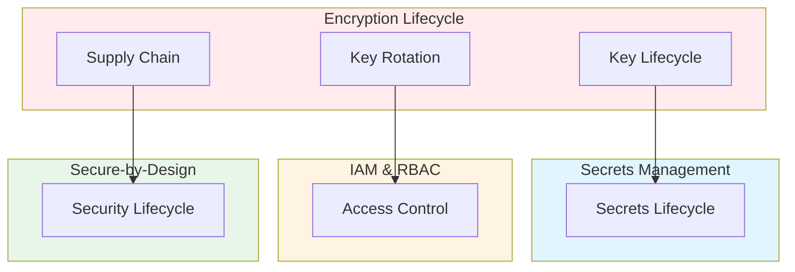

# Secret Supply Chains, Encryption Lifecycle Management & Cryptographic Rotation Strategy: Best Practices

**Objective**: Establish comprehensive encryption lifecycle governance that manages key rotation, cryptographic agility, and secret supply chains across data in motion, data at rest, and application-layer encryption. When you need encryption governance, when you want key rotation, when you need crypto agility—this guide provides the complete framework.

## Introduction

Encryption lifecycle management is fundamental to secure systems. Without proper key rotation, cryptographic agility, and secret supply chain governance, encryption degrades, keys become compromised, and security posture weakens. This guide establishes patterns for encryption lifecycle, key rotation, and cryptographic supply chain management.

**What This Guide Covers**:
- Encryption patterns for data in motion, data at rest, application-layer encryption, object store encryption, envelope encryption
- KMS strategies (cloud + on-prem)
- Key rotation automation
- Cryptographic supply chain scanning
- Air-gapped crypto domain separation
- Entropy freshness and decrypt-path minimization

**Prerequisites**:
- Understanding of encryption and key management
- Familiarity with KMS and key rotation patterns
- Experience with cryptographic security

**Related Documents**:
This document integrates with:
- **[End-to-End Secrets Management & Key Rotation Governance](secrets-governance.md)** - Secrets lifecycle
- **[Identity & Access Management, RBAC/ABAC, and Least-Privilege Governance](iam-rbac-abac-governance.md)** - Access control
- **[Secure-by-Design Lifecycle Architecture Across Polyglot Systems](secure-by-design-polyglot.md)** - Security lifecycle
- **[Cross-Domain Identity Federation, AuthZ/AuthN Architecture & Identity Propagation Models](identity-federation-authz-authn-architecture.md)** - Identity patterns

## The Philosophy of Encryption Lifecycle

### Encryption Principles

**Principle 1: Key Rotation**
- Regular key rotation
- Automated rotation
- Zero-downtime rotation

**Principle 2: Cryptographic Agility**
- Algorithm agility
- Key size flexibility
- Migration paths

**Principle 3: Secret Supply Chain**
- Secure key generation
- Secure key distribution
- Secure key storage

## Encryption Patterns

### Data in Motion Encryption

**Pattern**:
```yaml
# Data in motion encryption
data_in_motion:
  tls:
    version: "1.3"
    cipher_suites:
      - "TLS_AES_256_GCM_SHA384"
      - "TLS_CHACHA20_POLY1305_SHA256"
    certificate_rotation: "90 days"
  mTLS:
    enabled: true
    client_cert_rotation: "90 days"
    server_cert_rotation: "90 days"
```

### Data at Rest Encryption

**Pattern**:
```yaml
# Data at rest encryption
data_at_rest:
  postgres:
    encryption: "AES-256-GCM"
    key_rotation: "90 days"
    key_source: "kms"
  object_store:
    encryption: "AES-256"
    sse: "enabled"
    kms_key_rotation: "90 days"
```

### Application-Layer Encryption

**Pattern**:
```python
# Application-layer encryption
from cryptography.fernet import Fernet
from cryptography.hazmat.primitives import hashes
from cryptography.hazmat.primitives.kdf.pbkdf2 import PBKDF2HMAC
import base64

class ApplicationEncryption:
    def __init__(self, key: bytes):
        self.cipher = Fernet(key)
    
    def encrypt(self, data: bytes) -> bytes:
        """Encrypt data"""
        return self.cipher.encrypt(data)
    
    def decrypt(self, encrypted_data: bytes) -> bytes:
        """Decrypt data"""
        return self.cipher.decrypt(encrypted_data)
```

### Object Store Encryption

**Pattern**:
```yaml
# Object store encryption
object_store_encryption:
  s3:
    sse: "AES256"
    sse_kms: "enabled"
    kms_key_id: "arn:aws:kms:us-east-1:123456789012:key/12345678-1234-1234-1234-123456789012"
    kms_key_rotation: "90 days"
  minio:
    encryption: "AES-256-GCM"
    kms: "vault"
    key_rotation: "90 days"
```

### Envelope Encryption

**Pattern**:
```python
# Envelope encryption
from cryptography.hazmat.primitives.ciphers.aead import AESGCM
import os

class EnvelopeEncryption:
    def __init__(self, kek: bytes):
        self.kek = kek  # Key encryption key
    
    def encrypt(self, data: bytes) -> tuple[bytes, bytes]:
        """Encrypt data with envelope encryption"""
        # Generate data encryption key
        dek = os.urandom(32)
        
        # Encrypt data with DEK
        aesgcm = AESGCM(dek)
        nonce = os.urandom(12)
        encrypted_data = aesgcm.encrypt(nonce, data, None)
        
        # Encrypt DEK with KEK
        kek_aesgcm = AESGCM(self.kek)
        kek_nonce = os.urandom(12)
        encrypted_dek = kek_aesgcm.encrypt(kek_nonce, dek, None)
        
        return encrypted_data, encrypted_dek
    
    def decrypt(self, encrypted_data: bytes, encrypted_dek: bytes) -> bytes:
        """Decrypt data with envelope encryption"""
        # Decrypt DEK with KEK
        kek_aesgcm = AESGCM(self.kek)
        dek = kek_aesgcm.decrypt(encrypted_dek[:12], encrypted_dek[12:], None)
        
        # Decrypt data with DEK
        aesgcm = AESGCM(dek)
        data = aesgcm.decrypt(encrypted_data[:12], encrypted_data[12:], None)
        
        return data
```

## KMS Strategies

### Cloud KMS

**Pattern**:
```yaml
# Cloud KMS
cloud_kms:
  aws:
    service: "AWS KMS"
    key_rotation: "automatic"
    rotation_period: "365 days"
  gcp:
    service: "Cloud KMS"
    key_rotation: "automatic"
    rotation_period: "90 days"
  azure:
    service: "Key Vault"
    key_rotation: "automatic"
    rotation_period: "90 days"
```

### On-Prem KMS

**Pattern**:
```yaml
# On-prem KMS
on_prem_kms:
  vault:
    service: "HashiCorp Vault"
    key_rotation: "automated"
    rotation_period: "90 days"
    key_backend: "transit"
  hsm:
    service: "Hardware Security Module"
    key_rotation: "manual"
    rotation_period: "90 days"
```

## Key Rotation Automation

### Automated Rotation

**Pattern**:
```python
# Automated key rotation
class KeyRotationAutomation:
    def rotate_key(self, key_id: str) -> str:
        """Rotate encryption key"""
        # Create new key version
        new_key = self.create_new_key(key_id)
        
        # Re-encrypt data with new key
        self.re_encrypt_data(key_id, new_key)
        
        # Update key version
        self.update_key_version(key_id, new_key)
        
        # Deprecate old key
        self.deprecate_old_key(key_id)
        
        return new_key
```

### Zero-Downtime Rotation

**Pattern**:
```python
# Zero-downtime key rotation
class ZeroDowntimeRotation:
    def rotate_without_downtime(self, key_id: str):
        """Rotate key without downtime"""
        # Create new key
        new_key = self.create_new_key(key_id)
        
        # Dual-write with both keys
        self.enable_dual_write(key_id, new_key)
        
        # Migrate data
        self.migrate_data(key_id, new_key)
        
        # Switch to new key
        self.switch_to_new_key(key_id, new_key)
        
        # Disable old key
        self.disable_old_key(key_id)
```

## Cryptographic Supply Chain Scanning

### Supply Chain Scanning

**Pattern**:
```python
# Cryptographic supply chain scanning
class CryptographicSupplyChainScanner:
    def scan(self, artifact: str) -> ScanReport:
        """Scan cryptographic supply chain"""
        # Check algorithm strength
        algorithm_strength = self.check_algorithm_strength(artifact)
        
        # Check key size
        key_size = self.check_key_size(artifact)
        
        # Check certificate validity
        certificate_validity = self.check_certificate_validity(artifact)
        
        # Check key rotation status
        key_rotation_status = self.check_key_rotation_status(artifact)
        
        return ScanReport(
            algorithm_strength=algorithm_strength,
            key_size=key_size,
            certificate_validity=certificate_validity,
            key_rotation_status=key_rotation_status
        )
```

## Air-Gapped Crypto Domain Separation

### Air-Gapped Encryption

**Pattern**:
```yaml
# Air-gapped crypto domain separation
air_gapped_crypto:
  domains:
    - name: "production"
      kms: "local-vault"
      key_rotation: "manual"
      rotation_period: "90 days"
    - name: "development"
      kms: "local-vault"
      key_rotation: "manual"
      rotation_period: "180 days"
  sync:
    frequency: "never"
    method: "air-gapped"
```

## Architecture Fitness Functions

### Entropy Freshness Fitness Function

**Definition**:
```python
# Entropy freshness fitness function
class EntropyFreshnessFitnessFunction:
    def evaluate(self, system: System) -> float:
        """Evaluate entropy freshness"""
        # Calculate key age
        key_ages = [self.get_key_age(key) for key in system.keys]
        max_key_age = max(key_ages)
        
        # Calculate freshness (newer keys = higher freshness)
        if max_key_age < timedelta(days=30):
            freshness = 1.0
        elif max_key_age < timedelta(days=90):
            freshness = 0.8
        elif max_key_age < timedelta(days=180):
            freshness = 0.5
        else:
            freshness = 0.2
        
        return freshness
```

### Decrypt-Path Minimization Fitness Function

**Definition**:
```python
# Decrypt-path minimization fitness function
class DecryptPathMinimizationFitnessFunction:
    def evaluate(self, system: System) -> float:
        """Evaluate decrypt-path minimization"""
        # Count decrypt paths
        decrypt_paths = self.count_decrypt_paths(system)
        
        # Calculate minimization (fewer paths = higher fitness)
        if decrypt_paths == 0:
            fitness = 1.0
        else:
            fitness = 1.0 / (1.0 + decrypt_paths)
        
        return fitness
```

## Cross-Document Architecture



## Checklists

### Encryption Lifecycle Checklist

- [ ] Data in motion encryption configured
- [ ] Data at rest encryption configured
- [ ] Application-layer encryption implemented
- [ ] Object store encryption enabled
- [ ] Envelope encryption patterns defined
- [ ] KMS strategies configured
- [ ] Key rotation automation active
- [ ] Cryptographic supply chain scanning enabled
- [ ] Air-gapped crypto domain separation configured
- [ ] Fitness functions defined
- [ ] Regular key rotation reviews scheduled

## Anti-Patterns

### Encryption Anti-Patterns

**Long-Lived JWTs**:
```python
# Bad: Long-lived JWT
token = jwt.encode(
    payload,
    secret,
    algorithm="HS256",
    expires_delta=timedelta(days=365)  # Too long!
)

# Good: Short-lived JWT
token = jwt.encode(
    payload,
    secret,
    algorithm="HS256",
    expires_delta=timedelta(hours=1)  # Short-lived
)
```

**Unrotated DB Credentials**:
```yaml
# Bad: Unrotated credentials
database:
  password: "old-password"  # Never rotated!

# Good: Rotated credentials
database:
  password_rotation: "90 days"
  automatic_rotation: true
```

## See Also

- **[End-to-End Secrets Management & Key Rotation Governance](secrets-governance.md)** - Secrets lifecycle
- **[Identity & Access Management, RBAC/ABAC, and Least-Privilege Governance](iam-rbac-abac-governance.md)** - Access control
- **[Secure-by-Design Lifecycle Architecture Across Polyglot Systems](secure-by-design-polyglot.md)** - Security lifecycle
- **[Cross-Domain Identity Federation, AuthZ/AuthN Architecture & Identity Propagation Models](identity-federation-authz-authn-architecture.md)** - Identity patterns

---

*This guide establishes comprehensive encryption lifecycle patterns. Start with encryption patterns, extend to key rotation, and continuously manage cryptographic supply chains.*

