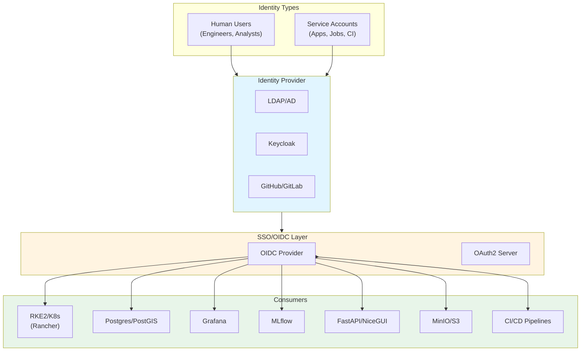

# Identity & Access Management, RBAC/ABAC, and Least-Privilege Governance for Distributed Systems

**Objective**: Master production-grade identity and access management across heterogeneous distributed systems. When you need to implement least-privilege access, RBAC/ABAC patterns, SSO integration, and comprehensive authorization governance—this guide provides complete patterns and implementations.

## Introduction

Identity and Access Management (IAM) is the foundation of security in distributed systems. Without proper IAM, systems are vulnerable to unauthorized access, privilege escalation, and data breaches. This guide provides a complete framework for implementing IAM across databases, clusters, dashboards, APIs, and object stores.

**What This Guide Covers**:
- IAM architecture and identity provider integration
- RBAC and ABAC patterns across all system layers
- Least-privilege role design and implementation
- Multi-environment and multi-tenant governance
- SSO/OIDC integration patterns
- Service account and machine identity management
- Auditing, compliance, and access reviews
- Air-gapped environment strategies

**Prerequisites**:
- Understanding of authentication vs authorization
- Familiarity with OAuth2/OIDC, RBAC concepts
- Experience with Kubernetes, databases, and cloud services
- Basic understanding of security principles

## Goals, Non-Goals, and Scope

### Goals

1. **Consistent IAM Model**: Define a unified identity and authorization model spanning databases, clusters, dashboards, APIs, and object stores.
2. **Least-Privilege Patterns**: Codify least-privilege patterns and role designs that minimize attack surface.
3. **SSO Integration**: Integrate with SSO/OIDC where possible, with clear fallback patterns when not available.
4. **Concrete Examples**: Provide copy-pasteable examples for roles, policies, and configurations across all systems.
5. **Multi-Environment Governance**: Support dev/stage/prod separation with clear access boundaries.
6. **Auditability**: Ensure all access decisions are logged and reviewable.

### Non-Goals

1. **Not a Generic OAuth2 Tutorial**: Assumes familiarity with OAuth2/OIDC basics.
2. **Not a Compliance Framework**: Not a SOC2/ISO mapping, but compatible with those frameworks.
3. **Not a Vendor-Specific Guide**: Patterns work across multiple IdP and platform choices.

### Scope

- **Human Access**: Admins, engineers, analysts, data scientists, operators
- **Service Access**: Microservices, ETL jobs, ML jobs, dashboards, agents, CI/CD runners
- **Cross-Environment**: Dev/stage/prod and cross-cluster governance
- **Deployment Models**: Both connected and air-gapped environments

## IAM Architecture Overview

### Identity Providers (IdPs)

**Supported IdPs**:
- Internal IdP (Keycloak, FreeIPA, Active Directory)
- LDAP/AD integration
- Cloud IdPs (Okta, Azure AD, AWS IAM Identity Center)
- GitHub/GitLab (for developer access)
- Custom OIDC providers

**Core Pattern**: Central identity, distributed authorization.



### Authorization Model

**RBAC at Each Layer**:
- Global roles (platform-admin, data-engineer, ml-engineer, analyst, viewer)
- System-specific roles mapped to global roles
- Environment-specific access (dev/stage/prod)

**ABAC for Nuanced Cases**:
- Namespace-based access
- Project-based access
- Dataset-based access
- Tenant-based access
- Data sensitivity-based access (public, internal, confidential, PII)

## Identity Types and Role Taxonomy

### Human Identities

| Role | Description | Typical Permissions |
|------|-------------|-------------------|
| **platform-admin** | Full system access | Cluster admin, DB superuser (restricted), all dashboards |
| **platform-ops** | Operational access | Cluster read/write (non-destructive), DB maintenance, monitoring |
| **data-platform-engineer** | Data infrastructure | Postgres admin, ETL pipelines, data lake access |
| **application-developer** | Application development | App namespaces, app DB schemas, CI/CD access |
| **ml-engineer** | ML/AI systems | MLflow, model storage, inference services |
| **analyst** | Data analysis | Read-only DB access, curated dashboards, query APIs |
| **read-only-viewer** | View-only access | Dashboard viewer, read-only APIs, no DB access |

**Default Environment Access**:
- **platform-admin**: All environments (with approval for prod)
- **platform-ops**: Dev + Stage (prod by request)
- **data-platform-engineer**: Dev + Stage (prod by request)
- **application-developer**: Dev (stage/prod by request)
- **ml-engineer**: Dev + Stage (prod by request)
- **analyst**: Dev + Stage (prod by request)
- **read-only-viewer**: Dev + Stage (prod by request)

### Machine Identities

**Service Account Categories**:

1. **API Service Accounts**:
   - Backend services (FastAPI, NiceGUI)
   - Read/write to application databases
   - Access to object stores for assets

2. **ETL Service Accounts**:
   - Prefect/Dask workers
   - Bulk data loading
   - Data transformation jobs

3. **ML Service Accounts**:
   - MLflow tracking
   - Model training jobs
   - Inference services

4. **CI/CD Service Accounts**:
   - GitHub Actions runners
   - GitLab CI runners
   - Deployment automation

5. **Infrastructure Service Accounts**:
   - Kubernetes operators (PGO, External Secrets)
   - Monitoring agents
   - Backup jobs

**Service Account Naming Convention**:
```
{system}-{purpose}-{environment}
Examples:
- api-backend-prod
- etl-prefect-dev
- ml-inference-stage
- cicd-deploy-prod
```

## RBAC/ABAC in Kubernetes (RKE2) and Rancher

### Rancher RBAC Integration

**Mapping IdP Groups to K8s Roles**:

```yaml
# rancher/rbac-mapping.yaml
apiVersion: management.cattle.io/v3
kind: GlobalRole
metadata:
  name: platform-admin
rules:
  - apiGroups: ["*"]
    resources: ["*"]
    verbs: ["*"]
---
apiVersion: management.cattle.io/v3
kind: GlobalRole
metadata:
  name: platform-ops
rules:
  - apiGroups: ["*"]
    resources: ["*"]
    verbs: ["get", "list", "watch", "create", "update", "patch"]
  - apiGroups: ["apps"]
    resources: ["deployments", "statefulsets"]
    verbs: ["delete"]
    resourceNames: []  # Restricted deletion
---
apiVersion: management.cattle.io/v3
kind: GlobalRole
metadata:
  name: data-engineer
rules:
  - apiGroups: [""]
    resources: ["pods", "services", "configmaps"]
    verbs: ["get", "list", "watch"]
  - apiGroups: ["apps"]
    resources: ["deployments", "statefulsets"]
    verbs: ["get", "list", "watch", "create", "update"]
  - apiGroups: [""]
    resources: ["namespaces"]
    verbs: ["get", "list", "watch"]
---
apiVersion: management.cattle.io/v3
kind: GlobalRoleBinding
metadata:
  name: platform-admin-binding
globalRoleName: platform-admin
groupPrincipalName: "oidc://keycloak/groups/platform-admins"
userPrincipalName: ""  # Empty for group-based
```

### Namespace Isolation

**System Namespaces (Ops-Only)**:

```yaml
# k8s/system-namespace-rbac.yaml
apiVersion: v1
kind: Namespace
metadata:
  name: kube-system
  labels:
    access: ops-only
    environment: system
---
apiVersion: v1
kind: Namespace
metadata:
  name: monitoring
  labels:
    access: ops-only
    environment: system
---
apiVersion: rbac.authorization.k8s.io/v1
kind: Role
metadata:
  name: ops-only
  namespace: monitoring
rules:
  - apiGroups: ["*"]
    resources: ["*"]
    verbs: ["*"]
---
apiVersion: rbac.authorization.k8s.io/v1
kind: RoleBinding
metadata:
  name: ops-only-binding
  namespace: monitoring
roleRef:
  apiGroup: rbac.authorization.k8s.io
  kind: Role
  name: ops-only
subjects:
  - kind: Group
    name: platform-ops
    apiGroup: rbac.authorization.k8s.io
```

**Team Namespaces with Limited Access**:

```yaml
# k8s/team-namespace-rbac.yaml
apiVersion: v1
kind: Namespace
metadata:
  name: data-platform
  labels:
    team: data-platform
    environment: prod
    data_class: internal
---
apiVersion: rbac.authorization.k8s.io/v1
kind: Role
metadata:
  name: team-developer
  namespace: data-platform
rules:
  - apiGroups: ["apps"]
    resources: ["deployments", "statefulsets"]
    verbs: ["get", "list", "watch", "create", "update", "patch"]
  - apiGroups: [""]
    resources: ["pods", "services", "configmaps", "secrets"]
    verbs: ["get", "list", "watch", "create", "update", "patch"]
  # Explicitly deny destructive actions
  - apiGroups: ["apps"]
    resources: ["deployments", "statefulsets"]
    verbs: ["delete"]
    resourceNames: []  # No deletions allowed
---
apiVersion: rbac.authorization.k8s.io/v1
kind: RoleBinding
metadata:
  name: data-platform-developers
  namespace: data-platform
roleRef:
  apiGroup: rbac.authorization.k8s.io
  kind: Role
  name: team-developer
subjects:
  - kind: Group
    name: data-platform-engineers
    apiGroup: rbac.authorization.k8s.io
```

### Restricting Critical Operations

**Prevent kubectl exec in Production**:

```yaml
# k8s/restrict-exec.yaml
apiVersion: rbac.authorization.k8s.io/v1
kind: ClusterRole
metadata:
  name: no-exec-prod
rules:
  - apiGroups: [""]
    resources: ["pods/exec"]
    verbs: []  # Explicitly deny
---
apiVersion: rbac.authorization.k8s.io/v1
kind: ClusterRoleBinding
metadata:
  name: no-exec-prod-binding
roleRef:
  apiGroup: rbac.authorization.k8s.io
  kind: ClusterRole
  name: no-exec-prod
subjects:
  - kind: Group
    name: application-developers
    apiGroup: rbac.authorization.k8s.io
```

**Restrict Secret Access**:

```yaml
# k8s/restrict-secrets.yaml
apiVersion: rbac.authorization.k8s.io/v1
kind: Role
metadata:
  name: limited-secret-access
  namespace: data-platform
rules:
  - apiGroups: [""]
    resources: ["secrets"]
    verbs: ["get", "list"]
    resourceNames:
      - "app-config"
      - "db-connection"  # Only specific secrets
```

### ABAC Patterns with Labels/Annotations

**Environment-Based Access**:

```yaml
# k8s/abac-environment.yaml
apiVersion: v1
kind: Namespace
metadata:
  name: production
  labels:
    environment: prod
    data_class: confidential
  annotations:
    access.control/environment: prod
    access.control/require-approval: "true"
```

**Admission Webhook for Environment Enforcement**:

```python
# k8s/admission-webhook.py
def validate_deployment(admission_request):
    """Prevent deploying to prod without approval"""
    namespace = admission_request.namespace
    labels = admission_request.object.metadata.labels
    
    if namespace == "production":
        # Check for approval annotation
        if "access.control/approved" not in admission_request.object.metadata.annotations:
            return {
                "allowed": False,
                "status": {
                    "reason": "Production deployments require approval annotation"
                }
            }
        
        # Prevent PII data in shared namespaces
        if labels.get("data_class") == "pii" and namespace != "pii-isolated":
            return {
                "allowed": False,
                "status": {
                    "reason": "PII data cannot be deployed to shared namespaces"
                }
            }
    
    return {"allowed": True}
```

### Pod Security and Network Policies

**Pod Security Standards**:

```yaml
# k8s/pod-security.yaml
apiVersion: v1
kind: Namespace
metadata:
  name: restricted
  labels:
    pod-security.kubernetes.io/enforce: restricted
    pod-security.kubernetes.io/audit: restricted
    pod-security.kubernetes.io/warn: restricted
```

**Network Policies for Isolation**:

```yaml
# k8s/network-policy.yaml
apiVersion: networking.k8s.io/v1
kind: NetworkPolicy
metadata:
  name: default-deny-all
  namespace: data-platform
spec:
  podSelector: {}
  policyTypes:
    - Ingress
    - Egress
---
apiVersion: networking.k8s.io/v1
kind: NetworkPolicy
metadata:
  name: allow-monitoring
  namespace: data-platform
spec:
  podSelector: {}
  ingress:
    - from:
        - namespaceSelector:
            matchLabels:
              name: monitoring
      ports:
        - protocol: TCP
          port: 9090  # Prometheus
  egress:
    - to:
        - namespaceSelector:
            matchLabels:
              name: monitoring
      ports:
        - protocol: TCP
          port: 9090
```

## Postgres/PostGIS Role Design and Least Privilege

### Baseline Roles

**Role Hierarchy**:

```sql
-- postgres/role-hierarchy.sql
-- Superuser role (extremely restricted)
CREATE ROLE pgadmin WITH SUPERUSER CREATEDB CREATEROLE LOGIN;
-- Only grant to break-glass accounts, never to applications

-- Application roles
CREATE ROLE app_rw WITH NOLOGIN;
CREATE ROLE app_ro WITH NOLOGIN;

-- ETL and maintenance roles
CREATE ROLE etl_role WITH NOLOGIN;
CREATE ROLE maintenance_role WITH NOLOGIN;

-- Analyst and read-only roles
CREATE ROLE analyst_role WITH NOLOGIN;
CREATE ROLE readonly_role WITH NOLOGIN;

-- Auditor role (read-only access to audit schema)
CREATE ROLE auditor_role WITH NOLOGIN;

-- Grant connection privileges
GRANT CONNECT ON DATABASE mydb TO app_rw, app_ro, etl_role, analyst_role, readonly_role, auditor_role;
```

### Schema-Level Privileges

```sql
-- postgres/schema-privileges.sql
-- Application schema (read-write for apps)
CREATE SCHEMA IF NOT EXISTS app;
GRANT USAGE ON SCHEMA app TO app_rw;
GRANT CREATE ON SCHEMA app TO app_rw;
GRANT ALL PRIVILEGES ON ALL TABLES IN SCHEMA app TO app_rw;
GRANT ALL PRIVILEGES ON ALL SEQUENCES IN SCHEMA app TO app_rw;
ALTER DEFAULT PRIVILEGES IN SCHEMA app GRANT ALL ON TABLES TO app_rw;
ALTER DEFAULT PRIVILEGES IN SCHEMA app GRANT ALL ON SEQUENCES TO app_rw;

-- Read-only access for dashboards
GRANT USAGE ON SCHEMA app TO app_ro;
GRANT SELECT ON ALL TABLES IN SCHEMA app TO app_ro;
ALTER DEFAULT PRIVILEGES IN SCHEMA app GRANT SELECT ON TABLES TO app_ro;

-- Analytics schema (read-only for analysts)
CREATE SCHEMA IF NOT EXISTS analytics;
GRANT USAGE ON SCHEMA analytics TO analyst_role;
GRANT SELECT ON ALL TABLES IN SCHEMA analytics TO analyst_role;
ALTER DEFAULT PRIVILEGES IN SCHEMA analytics GRANT SELECT ON TABLES TO analyst_role;

-- Audit schema (read-only for auditors)
CREATE SCHEMA IF NOT EXISTS audit;
GRANT USAGE ON SCHEMA audit TO auditor_role;
GRANT SELECT ON ALL TABLES IN SCHEMA audit TO auditor_role;
```

### Table and Column-Level Privileges

```sql
-- postgres/table-privileges.sql
-- Example: Sensitive table with column-level restrictions
CREATE TABLE app.users (
    id SERIAL PRIMARY KEY,
    username TEXT NOT NULL,
    email TEXT NOT NULL,
    password_hash TEXT NOT NULL,  -- Sensitive
    ssn TEXT,  -- PII
    created_at TIMESTAMPTZ DEFAULT NOW()
);

-- App role can read non-sensitive columns
GRANT SELECT (id, username, email, created_at) ON app.users TO app_ro;

-- App role can read/write all columns (for application logic)
GRANT SELECT, INSERT, UPDATE, DELETE ON app.users TO app_rw;

-- Analyst role cannot access PII
GRANT SELECT (id, username, email, created_at) ON app.users TO analyst_role;
-- Explicitly deny SSN access
REVOKE SELECT (ssn, password_hash) ON app.users FROM analyst_role;
```

### Row-Level Security (RLS)

**Multi-Tenant RLS**:

```sql
-- postgres/rls-multi-tenant.sql
-- Enable RLS
ALTER TABLE app.data ENABLE ROW LEVEL SECURITY;

-- Policy: Users can only see their tenant's data
CREATE POLICY tenant_isolation ON app.data
    FOR ALL
    TO app_rw, app_ro
    USING (
        tenant_id = current_setting('app.current_tenant_id', true)::INTEGER
    );

-- Set tenant context (application responsibility)
SET app.current_tenant_id = '123';
```

**Role-Based RLS**:

```sql
-- postgres/rls-role-based.sql
-- Policy: Analysts can only see non-confidential data
CREATE POLICY analyst_data_filter ON app.datasets
    FOR SELECT
    TO analyst_role
    USING (
        data_class IN ('public', 'internal')
        AND data_class != 'confidential'
        AND data_class != 'pii'
    );

-- Policy: Platform ops can see all data
CREATE POLICY ops_full_access ON app.datasets
    FOR ALL
    TO app_rw
    USING (
        current_setting('role') = 'platform-ops'
    );
```

### SECURITY DEFINER Functions

```sql
-- postgres/security-definer.sql
-- Controlled elevated operations
CREATE OR REPLACE FUNCTION app.create_index_safely(
    table_name TEXT,
    index_name TEXT,
    columns TEXT
)
RETURNS VOID
SECURITY DEFINER
SET search_path = app, pg_catalog
LANGUAGE plpgsql
AS $$
BEGIN
    -- Only allow index creation on specific tables
    IF table_name NOT IN ('users', 'orders', 'products') THEN
        RAISE EXCEPTION 'Index creation not allowed on table %', table_name;
    END IF;
    
    -- Create index
    EXECUTE format('CREATE INDEX %I ON %I (%s)', index_name, table_name, columns);
END;
$$;

-- Grant execute to etl_role (not direct table access)
GRANT EXECUTE ON FUNCTION app.create_index_safely(TEXT, TEXT, TEXT) TO etl_role;
REVOKE ALL ON app.users FROM etl_role;  -- No direct table access
```

### Integration with PgAudit and PgCron

**PgAudit Role Mapping**:

```sql
-- postgres/pgaudit-roles.sql
-- Configure pgaudit to log role changes
ALTER SYSTEM SET pgaudit.log = 'role';
ALTER SYSTEM SET pgaudit.role = 'auditor';

-- Create auditor role with pgaudit access
CREATE ROLE pgaudit_role;
GRANT pgaudit_role TO auditor_role;

-- Grant access to audit views
GRANT SELECT ON audit.pg_audit_log TO auditor_role;
GRANT SELECT ON audit.user_activity_log TO auditor_role;
```

**PgCron Job Roles**:

```sql
-- postgres/pgcron-roles.sql
-- ETL job running as etl_role
SELECT cron.schedule(
    'etl-daily-load',
    '0 2 * * *',  -- Daily at 2 AM
    $$
    SET ROLE etl_role;
    SELECT app.load_daily_data();
    $$
);

-- Maintenance job with elevated privileges
SELECT cron.schedule(
    'maintenance-vacuum',
    '0 3 * * 0',  -- Weekly on Sunday at 3 AM
    $$
    SET ROLE maintenance_role;
    VACUUM ANALYZE app.users;
    $$
);
```

### Foreign Data Wrapper (FDW) Access Control

```sql
-- postgres/fdw-access-control.sql
-- Create FDW server with limited credentials
CREATE SERVER s3_server
FOREIGN DATA WRAPPER parquet_s3_fdw
OPTIONS (
    aws_access_key_id '${S3_READONLY_KEY}',
    aws_secret_access_key '${S3_READONLY_SECRET}'
);

-- Grant usage only to specific roles
GRANT USAGE ON FOREIGN SERVER s3_server TO analyst_role;
-- analyst_role can query FDW tables but cannot modify server config
```

## Grafana, Loki, Prometheus, and Observability Access

### SSO/OIDC Integration

**Grafana OIDC Configuration**:

```ini
# grafana/grafana.ini
[auth.generic_oauth]
enabled = true
name = Keycloak
allow_sign_up = true
client_id = grafana
client_secret = ${GRAFANA_CLIENT_SECRET}
scopes = openid profile email groups
auth_url = https://keycloak.example.com/realms/myrealm/protocol/openid-connect/auth
token_url = https://keycloak.example.com/realms/myrealm/protocol/openid-connect/token
api_url = https://keycloak.example.com/realms/myrealm/protocol/openid-connect/userinfo
role_attribute_path = contains(groups[*], 'platform-admin') && 'Admin' || contains(groups[*], 'platform-ops') && 'Editor' || 'Viewer'
```

**Role Mapping**:

| IdP Group | Grafana Role | Permissions |
|-----------|--------------|-------------|
| platform-admin | Admin | Full access, can manage orgs, users, data sources |
| platform-ops | Editor | Can create/edit dashboards, cannot manage users |
| data-engineer | Editor | Can create/edit dashboards in data folder |
| analyst | Viewer | Can view dashboards, cannot edit |
| read-only-viewer | Viewer | Can view dashboards, no Explore access |

### Folder and Dashboard Permissions

```yaml
# grafana/folder-permissions.yaml
# Folder structure
folders:
  - name: "Platform Operations"
    permissions:
      - role: "Admin"
        permission: "Admin"
      - role: "platform-ops"
        permission: "Edit"
      - role: "Viewer"
        permission: "View"
  
  - name: "Data Platform"
    permissions:
      - role: "Admin"
        permission: "Admin"
      - role: "data-engineer"
        permission: "Edit"
      - role: "analyst"
        permission: "View"
  
  - name: "ML/AI"
    permissions:
      - role: "Admin"
        permission: "Admin"
      - role: "ml-engineer"
        permission: "Edit"
      - role: "analyst"
        permission: "View"
```

### Data Source Access Control

**Restrict Prometheus/Loki Access**:

```ini
# grafana/datasource-restrictions.ini
[datasources]
# Restrict Explore access for viewers
[datasources.prometheus]
editable = false
# Only allow queries to specific metrics
allowed_queries = "up,http_requests_total,container_cpu_usage"

[datasources.loki]
editable = false
# Restrict log access to non-sensitive namespaces
allowed_labels = "namespace,container_name"
blocked_labels = "password,secret,token"
```

### Multi-Tenancy in Grafana

**Per-Tenant Organizations**:

```yaml
# grafana/multi-tenant.yaml
organizations:
  - name: "tenant-a"
    users:
      - email: "user@tenant-a.com"
        role: "Admin"
    data_sources:
      - name: "Prometheus"
        url: "http://prometheus-tenant-a:9090"
      - name: "Loki"
        url: "http://loki-tenant-a:3100"
  
  - name: "tenant-b"
    users:
      - email: "user@tenant-b.com"
        role: "Admin"
    data_sources:
      - name: "Prometheus"
        url: "http://prometheus-tenant-b:9090"
```

## Object Store (MinIO/Garage/S3) Access Governance

### Bucket Structure and Policies

**Bucket Organization**:

```
s3://
  ├── raw-data/           # ETL input (RW: etl_role)
  │   ├── dev/
  │   ├── stage/
  │   └── prod/
  ├── curated-data/       # Processed data (RW: etl_role, RO: analyst_role)
  │   ├── dev/
  │   ├── stage/
  │   └── prod/
  ├── models/             # ML models (RW: ml_role, RO: inference_role)
  │   ├── dev/
  │   ├── stage/
  │   └── prod/
  ├── backups/            # Database backups (RW: backup_role)
  │   └── postgres/
  └── logs/               # Application logs (RW: app_role, RO: analyst_role)
```

### IAM-Style Policies

**ETL Job Policy**:

```json
{
  "Version": "2012-10-17",
  "Statement": [
    {
      "Effect": "Allow",
      "Action": [
        "s3:GetObject",
        "s3:PutObject",
        "s3:DeleteObject",
        "s3:ListBucket"
      ],
      "Resource": [
        "arn:aws:s3:::raw-data/*",
        "arn:aws:s3:::raw-data",
        "arn:aws:s3:::curated-data/*",
        "arn:aws:s3:::curated-data"
      ],
      "Condition": {
        "StringEquals": {
          "s3:ExistingObjectTag/environment": "${aws:PrincipalTag/environment}"
        }
      }
    }
  ]
}
```

**ML Job Policy**:

```json
{
  "Version": "2012-10-17",
  "Statement": [
    {
      "Effect": "Allow",
      "Action": [
        "s3:GetObject"
      ],
      "Resource": [
        "arn:aws:s3:::curated-data/*"
      ]
    },
    {
      "Effect": "Allow",
      "Action": [
        "s3:GetObject",
        "s3:PutObject"
      ],
      "Resource": [
        "arn:aws:s3:::models/*"
      ]
    }
  ]
}
```

**Analyst Read-Only Policy**:

```json
{
  "Version": "2012-10-17",
  "Statement": [
    {
      "Effect": "Allow",
      "Action": [
        "s3:GetObject",
        "s3:ListBucket"
      ],
      "Resource": [
        "arn:aws:s3:::curated-data/*",
        "arn:aws:s3:::curated-data"
      ],
      "Condition": {
        "StringNotEquals": {
          "s3:ExistingObjectTag/data_class": "pii"
        }
      }
    }
  ]
}
```

### MinIO-Specific Configuration

```yaml
# minio/policy.yaml
policies:
  - name: etl-policy
    statements:
      - resources:
          - "arn:aws:s3:::raw-data/*"
          - "arn:aws:s3:::curated-data/*"
        actions:
          - s3:GetObject
          - s3:PutObject
          - s3:DeleteObject
          - s3:ListBucket
      - resources:
          - "arn:aws:s3:::raw-data"
          - "arn:aws:s3:::curated-data"
        actions:
          - s3:ListBucket
  
  - name: analyst-readonly
    statements:
      - resources:
          - "arn:aws:s3:::curated-data/*"
        actions:
          - s3:GetObject
        conditions:
          - key: "s3:ExistingObjectTag/data_class"
            operator: "StringNotEquals"
            value: "pii"
```

## CI/CD and Automation: Secure Service Accounts and Tokens

### GitHub Actions OIDC

**OIDC-Based Authentication**:

```yaml
# .github/workflows/deploy.yaml
name: Deploy to Kubernetes

on:
  push:
    branches: [main]

permissions:
  id-token: write
  contents: read

jobs:
  deploy:
    runs-on: ubuntu-latest
    steps:
      - uses: actions/checkout@v3
      
      - name: Configure AWS credentials
        uses: aws-actions/configure-aws-credentials@v2
        with:
          role-to-assume: arn:aws:iam::123456789012:role/github-actions-role
          aws-region: us-east-1
          role-session-name: GitHubActions
      
      - name: Deploy to K8s
        run: |
          kubectl apply -f k8s/
        env:
          KUBECONFIG: ${{ secrets.KUBECONFIG }}
```

**GitHub OIDC Trust Policy**:

```json
{
  "Version": "2012-10-17",
  "Statement": [
    {
      "Effect": "Allow",
      "Principal": {
        "Federated": "arn:aws:iam::123456789012:oidc-provider/token.actions.githubusercontent.com"
      },
      "Action": "sts:AssumeRoleWithWebIdentity",
      "Condition": {
        "StringEquals": {
          "token.actions.githubusercontent.com:aud": "sts.amazonaws.com"
        },
        "StringLike": {
          "token.actions.githubusercontent.com:sub": "repo:myorg/myrepo:*"
        }
      }
    }
  ]
}
```

### GitLab CI/CD

**Protected Variables and Environments**:

```yaml
# .gitlab-ci.yml
stages:
  - build
  - deploy

variables:
  KUBERNETES_NAMESPACE: ${CI_ENVIRONMENT_NAME}

build:
  stage: build
  script:
    - docker build -t $CI_REGISTRY_IMAGE:$CI_COMMIT_SHA .
    - docker push $CI_REGISTRY_IMAGE:$CI_COMMIT_SHA
  only:
    - main
    - develop

deploy:dev:
  stage: deploy
  environment:
    name: development
    url: https://dev.example.com
  script:
    - kubectl apply -f k8s/ -n development
  only:
    - develop
  variables:
    KUBECONFIG: $KUBECONFIG_DEV  # Protected variable, dev only

deploy:prod:
  stage: deploy
  environment:
    name: production
    url: https://prod.example.com
  script:
    - kubectl apply -f k8s/ -n production
  only:
    - main
  when: manual  # Requires manual approval
  variables:
    KUBECONFIG: $KUBECONFIG_PROD  # Protected variable, prod only
```

### Token Rotation and Scoping

**Token Lifecycle Management**:

```python
# cicd/token-rotation.py
import secrets
import boto3
from datetime import datetime, timedelta

class TokenRotator:
    def __init__(self, k8s_client, vault_client):
        self.k8s = k8s_client
        self.vault = vault_client
    
    def rotate_ci_token(self, service_account: str, namespace: str):
        """Rotate CI/CD service account token"""
        # Generate new token
        new_token = secrets.token_urlsafe(32)
        
        # Update in Vault
        self.vault.write(
            f"secret/cicd/{service_account}",
            token=new_token,
            expires_at=(datetime.now() + timedelta(days=90)).isoformat()
        )
        
        # Update Kubernetes secret
        self.k8s.patch_secret(
            namespace=namespace,
            name=f"{service_account}-token",
            data={"token": new_token}
        )
        
        # Revoke old token after grace period
        # (implementation depends on system)
```

## Application-Level AuthN/AuthZ (APIs, NiceGUI, FastAPI, ML Services)

### FastAPI OIDC Integration

**JWT Authentication**:

```python
# api/oidc_auth.py
from fastapi import Depends, HTTPException, Security
from fastapi.security import HTTPBearer, HTTPAuthorizationCredentials
import jwt
from jwt import PyJWKClient

class OIDCAuth:
    def __init__(self, issuer_url: str):
        self.issuer_url = issuer_url
        self.jwks_client = PyJWKClient(f"{issuer_url}/.well-known/jwks.json")
        self.security = HTTPBearer()
    
    async def verify_token(
        self,
        credentials: HTTPAuthorizationCredentials = Security(HTTPBearer())
    ) -> dict:
        """Verify JWT token and return claims"""
        try:
            # Get signing key
            signing_key = self.jwks_client.get_signing_key_from_jwt(
                credentials.credentials
            )
            
            # Decode token
            payload = jwt.decode(
                credentials.credentials,
                signing_key.key,
                algorithms=["RS256"],
                audience="api",
                issuer=self.issuer_url
            )
            
            return payload
        except jwt.InvalidTokenError as e:
            raise HTTPException(
                status_code=401,
                detail=f"Invalid token: {str(e)}"
            )
    
    def require_role(self, *allowed_roles: str):
        """Dependency to require specific roles"""
        async def role_checker(
            claims: dict = Depends(self.verify_token)
        ) -> dict:
            user_roles = claims.get("groups", [])
            
            if not any(role in user_roles for role in allowed_roles):
                raise HTTPException(
                    status_code=403,
                    detail=f"Requires one of: {allowed_roles}"
                )
            
            return claims
        
        return role_checker

# Usage
auth = OIDCAuth("https://keycloak.example.com/realms/myrealm")

@app.get("/api/admin/users")
async def list_users(
    claims: dict = Depends(auth.require_role("platform-admin"))
):
    """List users - requires platform-admin role"""
    return {"users": [...]}

@app.get("/api/data/query")
async def query_data(
    claims: dict = Depends(auth.verify_token)
):
    """Query data - any authenticated user"""
    # Check tenant access
    tenant_id = claims.get("tenant_id")
    return query_data_for_tenant(tenant_id)
```

### Fine-Grained Permissions

```python
# api/permissions.py
from enum import Enum
from typing import List

class Permission(Enum):
    READ_DATA = "read:data"
    WRITE_DATA = "write:data"
    MANAGE_MODELS = "manage:models"
    TRIGGER_TRAINING = "trigger:training"
    VIEW_ANALYTICS = "view:analytics"

class PermissionChecker:
    def __init__(self, claims: dict):
        self.claims = claims
        self.roles = claims.get("groups", [])
        self.permissions = self._map_roles_to_permissions()
    
    def _map_roles_to_permissions(self) -> List[Permission]:
        """Map roles to permissions"""
        permissions = []
        
        if "ml-engineer" in self.roles:
            permissions.extend([
                Permission.READ_DATA,
                Permission.WRITE_DATA,
                Permission.MANAGE_MODELS,
                Permission.TRIGGER_TRAINING
            ])
        
        if "analyst" in self.roles:
            permissions.extend([
                Permission.READ_DATA,
                Permission.VIEW_ANALYTICS
            ])
        
        return permissions
    
    def has_permission(self, permission: Permission) -> bool:
        """Check if user has specific permission"""
        return permission in self.permissions

# Usage in FastAPI
def require_permission(permission: Permission):
    """Dependency factory for permission checks"""
    async def permission_checker(
        claims: dict = Depends(auth.verify_token)
    ) -> dict:
        checker = PermissionChecker(claims)
        
        if not checker.has_permission(permission):
            raise HTTPException(
                status_code=403,
                detail=f"Requires permission: {permission.value}"
            )
        
        return claims
    
    return permission_checker

@app.post("/api/ml/train")
async def train_model(
    claims: dict = Depends(require_permission(Permission.TRIGGER_TRAINING))
):
    """Train model - requires TRIGGER_TRAINING permission"""
    return {"status": "training started"}
```

### API Keys for Machine-to-Machine

```python
# api/api_keys.py
from datetime import datetime, timedelta
import hashlib
import secrets

class APIKeyManager:
    def __init__(self, db):
        self.db = db
    
    def create_api_key(
        self,
        service_name: str,
        scopes: List[str],
        expires_days: int = 90
    ) -> str:
        """Create API key with scopes and expiration"""
        # Generate key
        key = f"sk_{secrets.token_urlsafe(32)}"
        key_hash = hashlib.sha256(key.encode()).hexdigest()
        
        # Store in database
        self.db.execute("""
            INSERT INTO api_keys (service_name, key_hash, scopes, expires_at)
            VALUES (%s, %s, %s, %s)
        """, (
            service_name,
            key_hash,
            scopes,
            datetime.now() + timedelta(days=expires_days)
        ))
        
        return key
    
    async def verify_api_key(
        self,
        key: str,
        required_scope: str
    ) -> dict:
        """Verify API key and check scope"""
        key_hash = hashlib.sha256(key.encode()).hexdigest()
        
        result = self.db.execute("""
            SELECT service_name, scopes, expires_at
            FROM api_keys
            WHERE key_hash = %s AND expires_at > NOW()
        """, (key_hash,))
        
        if not result:
            raise HTTPException(status_code=401, detail="Invalid API key")
        
        scopes = result["scopes"]
        if required_scope not in scopes:
            raise HTTPException(
                status_code=403,
                detail=f"API key missing required scope: {required_scope}"
            )
        
        return {
            "service_name": result["service_name"],
            "scopes": scopes
        }

# Usage
api_key_auth = APIKeyManager(db)

@app.get("/api/data/query")
async def query_data_api(
    api_key: str = Header(..., alias="X-API-Key")
):
    """Query data via API key"""
    key_info = await api_key_auth.verify_api_key(api_key, "read:data")
    return query_data(service=key_info["service_name"])
```

## ABAC Patterns for Data & Environment Sensitivity

### Attribute-Based Access Control

**ABAC Policy Engine**:

```python
# abac/policy_engine.py
from typing import Dict, List, Any
from dataclasses import dataclass

@dataclass
class Subject:
    """Subject attributes"""
    user_id: str
    roles: List[str]
    groups: List[str]
    environment: str
    tenant_id: str = None

@dataclass
class Resource:
    """Resource attributes"""
    resource_id: str
    resource_type: str
    environment: str
    data_class: str
    tenant_id: str = None

@dataclass
class Action:
    """Action to perform"""
    action: str
    resource_type: str

class ABACPolicyEngine:
    def __init__(self):
        self.policies = []
    
    def add_policy(self, policy: dict):
        """Add ABAC policy"""
        self.policies.append(policy)
    
    def evaluate(
        self,
        subject: Subject,
        resource: Resource,
        action: Action
    ) -> bool:
        """Evaluate access based on ABAC policies"""
        for policy in self.policies:
            if self._matches_policy(subject, resource, action, policy):
                return policy["effect"] == "allow"
        
        # Default deny
        return False
    
    def _matches_policy(
        self,
        subject: Subject,
        resource: Resource,
        action: Action,
        policy: dict
    ) -> bool:
        """Check if policy matches request"""
        # Check subject conditions
        if "subject" in policy:
            if not self._match_conditions(subject, policy["subject"]):
                return False
        
        # Check resource conditions
        if "resource" in policy:
            if not self._match_conditions(resource, policy["resource"]):
                return False
        
        # Check action
        if "action" in policy:
            if action.action != policy["action"]:
                return False
        
        return True
    
    def _match_conditions(self, obj: Any, conditions: dict) -> bool:
        """Match object attributes against conditions"""
        for key, value in conditions.items():
            obj_value = getattr(obj, key, None)
            
            if isinstance(value, list):
                if obj_value not in value:
                    return False
            elif obj_value != value:
                return False
        
        return True

# Example policies
policy_engine = ABACPolicyEngine()

# Policy: Analysts can read non-PII data in dev/stage
policy_engine.add_policy({
    "effect": "allow",
    "subject": {
        "roles": ["analyst"],
        "environment": ["dev", "stage"]
    },
    "resource": {
        "data_class": ["public", "internal"]
    },
    "action": "read"
})

# Policy: ML engineers can write models in their environment
policy_engine.add_policy({
    "effect": "allow",
    "subject": {
        "roles": ["ml-engineer"],
        "environment": ["dev", "stage", "prod"]
    },
    "resource": {
        "resource_type": "model",
        "environment": "${subject.environment}"  # Same environment
    },
    "action": "write"
})

# Policy: Prevent PII data in shared namespaces
policy_engine.add_policy({
    "effect": "deny",
    "resource": {
        "data_class": "pii",
        "tenant_id": None  # Shared namespace
    },
    "action": "write"
})
```

### Kubernetes ABAC with Admission Webhooks

```python
# k8s/abac-webhook.py
from kubernetes import client, config
from kubernetes.client.rest import ApiException

class ABACAdmissionWebhook:
    def validate(self, admission_request):
        """Validate request based on ABAC policies"""
        # Extract attributes
        user = admission_request.user_info.username
        groups = admission_request.user_info.groups
        namespace = admission_request.namespace
        resource = admission_request.object
        
        # Get resource attributes
        labels = resource.metadata.labels or {}
        annotations = resource.metadata.annotations or {}
        
        data_class = labels.get("data_class", "internal")
        environment = labels.get("environment", "dev")
        tenant_id = labels.get("tenant_id")
        
        # ABAC checks
        # 1. Prevent PII in shared namespaces
        if data_class == "pii" and not tenant_id:
            return {
                "allowed": False,
                "status": {
                    "reason": "PII data requires tenant isolation"
                }
            }
        
        # 2. Restrict prod deployments
        if environment == "prod" and "platform-admin" not in groups:
            if "access.control/approved" not in annotations:
                return {
                    "allowed": False,
                    "status": {
                        "reason": "Production deployments require approval"
                    }
                }
        
        # 3. Environment matching
        user_env = self._get_user_environment(groups)
        if environment != user_env and user_env != "all":
            return {
                "allowed": False,
                "status": {
                    "reason": f"User environment {user_env} does not match resource environment {environment}"
                }
            }
        
        return {"allowed": True}
```

## Just-In-Time (JIT) Access and Break-Glass Accounts

### JIT Elevation Patterns

**Time-Bound Role Elevation**:

```python
# jit/jit_access.py
from datetime import datetime, timedelta
import asyncio

class JITAccessManager:
    def __init__(self, db, k8s_client, postgres_client):
        self.db = db
        self.k8s = k8s_client
        self.postgres = postgres_client
    
    async def request_elevation(
        self,
        user_id: str,
        target_role: str,
        duration_minutes: int = 60,
        reason: str = ""
    ) -> bool:
        """Request JIT elevation with approval workflow"""
        # Check if approval required
        if target_role in ["platform-admin", "cluster-admin"]:
            # Require approval (ticket, chatops, etc.)
            approval = await self._request_approval(user_id, target_role, reason)
            if not approval:
                return False
        
        # Grant temporary access
        expires_at = datetime.now() + timedelta(minutes=duration_minutes)
        
        # Store in database
        self.db.execute("""
            INSERT INTO jit_access (user_id, role, expires_at, reason)
            VALUES (%s, %s, %s, %s)
        """, (user_id, target_role, expires_at, reason))
        
        # Grant in systems
        if target_role == "cluster-admin":
            await self._grant_k8s_cluster_admin(user_id, expires_at)
        elif target_role == "pgadmin":
            await self._grant_postgres_superuser(user_id, expires_at)
        
        return True
    
    async def _grant_k8s_cluster_admin(
        self,
        user_id: str,
        expires_at: datetime
    ):
        """Grant temporary cluster-admin in K8s"""
        # Create temporary ClusterRoleBinding
        binding = {
            "apiVersion": "rbac.authorization.k8s.io/v1",
            "kind": "ClusterRoleBinding",
            "metadata": {
                "name": f"jit-{user_id}-{int(expires_at.timestamp())}",
                "annotations": {
                    "expires-at": expires_at.isoformat()
                }
            },
            "roleRef": {
                "apiGroup": "rbac.authorization.k8s.io",
                "kind": "ClusterRole",
                "name": "cluster-admin"
            },
            "subjects": [{
                "kind": "User",
                "name": user_id
            }]
        }
        
        self.k8s.create_cluster_role_binding(binding)
        
        # Schedule revocation
        delay = (expires_at - datetime.now()).total_seconds()
        asyncio.create_task(self._revoke_after_delay(user_id, delay))
    
    async def _grant_postgres_superuser(
        self,
        user_id: str,
        expires_at: datetime
    ):
        """Grant temporary superuser in Postgres"""
        # Grant role
        self.postgres.execute(f"""
            GRANT pgadmin TO {user_id};
            ALTER ROLE {user_id} VALID UNTIL '{expires_at.isoformat()}';
        """)
        
        # Schedule revocation
        delay = (expires_at - datetime.now()).total_seconds()
        asyncio.create_task(self._revoke_after_delay(user_id, delay, "postgres"))
```

### Break-Glass Accounts

**Offline Credential Storage**:

```yaml
# break-glass/credentials.yaml
# Encrypted with SOPS or similar
break_glass_accounts:
  - name: break-glass-k8s
    system: kubernetes
    credentials:
      # Encrypted
      kubeconfig: |
        ENC[AES256_GCM,data:...,iv:...,tag:...,type:str]
    restrictions:
      - only_from_bastion: true
      - require_approval: true
      - max_duration_minutes: 30
      - audit_all_actions: true
  
  - name: break-glass-postgres
    system: postgres
    credentials:
      # Encrypted
      password: |
        ENC[AES256_GCM,data:...,iv:...,tag:...,type:str]
    restrictions:
      - only_from_bastion: true
      - require_approval: true
      - max_duration_minutes: 15
      - audit_all_actions: true
```

**Break-Glass Usage Workflow**:

```python
# break-glass/workflow.py
class BreakGlassManager:
    def __init__(self, vault_client, audit_logger):
        self.vault = vault_client
        self.audit = audit_logger
    
    async def use_break_glass(
        self,
        user_id: str,
        account_name: str,
        reason: str,
        approval_ticket: str
    ) -> dict:
        """Use break-glass account with strict controls"""
        # 1. Verify approval
        if not await self._verify_approval(approval_ticket):
            raise ValueError("Approval required")
        
        # 2. Check if on bastion
        if not self._is_on_bastion():
            raise ValueError("Break-glass can only be used from bastion host")
        
        # 3. Retrieve credentials
        credentials = self.vault.read(f"break-glass/{account_name}")
        
        # 4. Log usage
        self.audit.log({
            "event": "break_glass_used",
            "user": user_id,
            "account": account_name,
            "reason": reason,
            "approval": approval_ticket,
            "timestamp": datetime.now().isoformat()
        })
        
        # 5. Set expiration
        expires_at = datetime.now() + timedelta(minutes=15)
        
        return {
            "credentials": credentials,
            "expires_at": expires_at.isoformat(),
            "restrictions": {
                "max_duration_minutes": 15,
                "audit_all_actions": True
            }
        }
```

## Auditing, Logging, and Review

### Postgres Audit Queries

**Role Membership Audit**:

```sql
-- audit/role-membership.sql
-- List all role memberships
SELECT
    r.rolname AS role,
    m.rolname AS member,
    CASE
        WHEN r.rolsuper THEN 'SUPERUSER'
        WHEN r.rolcreaterole THEN 'CREATEROLE'
        WHEN r.rolcreatedb THEN 'CREATEDB'
        ELSE 'REGULAR'
    END AS role_type
FROM pg_roles r
JOIN pg_auth_members am ON r.oid = am.roleid
JOIN pg_roles m ON am.member = m.oid
ORDER BY r.rolname, m.rolname;

-- Find users with excessive privileges
SELECT
    r.rolname,
    r.rolsuper,
    r.rolcreaterole,
    r.rolcreatedb,
    COUNT(DISTINCT am.member) AS member_count
FROM pg_roles r
LEFT JOIN pg_auth_members am ON r.oid = am.roleid
WHERE r.rolsuper = true
   OR r.rolcreaterole = true
GROUP BY r.rolname, r.rolsuper, r.rolcreaterole, r.rolcreatedb
HAVING COUNT(DISTINCT am.member) > 5;  -- Alert threshold
```

**Grant Audit**:

```sql
-- audit/grants.sql
-- List all grants per schema
SELECT
    n.nspname AS schema,
    c.relname AS table,
    r.rolname AS grantee,
    string_agg(DISTINCT p.perm::text, ', ') AS privileges
FROM pg_class c
JOIN pg_namespace n ON c.relnamespace = n.oid
JOIN pg_permission p ON c.oid = p.objoid
JOIN pg_roles r ON p.grantee = r.oid
WHERE n.nspname NOT IN ('pg_catalog', 'information_schema')
GROUP BY n.nspname, c.relname, r.rolname
ORDER BY n.nspname, c.relname, r.rolname;

-- Find tables with public access
SELECT
    n.nspname AS schema,
    c.relname AS table
FROM pg_class c
JOIN pg_namespace n ON c.relnamespace = n.oid
JOIN pg_permission p ON c.oid = p.objoid
JOIN pg_roles r ON p.grantee = r.oid
WHERE r.rolname = 'public'
  AND p.perm::text LIKE '%SELECT%'
  AND n.nspname NOT IN ('pg_catalog', 'information_schema');
```

**RLS Policy Audit**:

```sql
-- audit/rls-policies.sql
-- List all RLS policies
SELECT
    n.nspname AS schema,
    c.relname AS table,
    pol.polname AS policy_name,
    pol.polcmd AS command,
    pg_get_expr(pol.polqual, pol.polrelid) AS using_expression,
    pg_get_expr(pol.polwithcheck, pol.polrelid) AS with_check_expression
FROM pg_policy pol
JOIN pg_class c ON pol.polrelid = c.oid
JOIN pg_namespace n ON c.relnamespace = n.oid
WHERE n.nspname NOT IN ('pg_catalog', 'information_schema')
ORDER BY n.nspname, c.relname, pol.polname;

-- Find tables with RLS disabled but containing sensitive data
SELECT
    n.nspname AS schema,
    c.relname AS table
FROM pg_class c
JOIN pg_namespace n ON c.relnamespace = n.oid
WHERE c.relrowsecurity = false
  AND (
      c.relname LIKE '%user%'
      OR c.relname LIKE '%customer%'
      OR c.relname LIKE '%pii%'
  )
  AND n.nspname NOT IN ('pg_catalog', 'information_schema');
```

**PII Access Report**:

```sql
-- audit/pii-access.sql
-- Who can access PII data?
SELECT DISTINCT
    r.rolname AS role,
    n.nspname AS schema,
    c.relname AS table,
    string_agg(DISTINCT p.perm::text, ', ') AS privileges
FROM pg_class c
JOIN pg_namespace n ON c.relnamespace = n.oid
JOIN pg_permission p ON c.oid = p.objoid
JOIN pg_roles r ON p.grantee = r.oid
WHERE (
    c.relname LIKE '%user%'
    OR c.relname LIKE '%customer%'
    OR c.relname LIKE '%pii%'
    OR EXISTS (
        SELECT 1
        FROM pg_attribute a
        WHERE a.attrelid = c.oid
          AND (
              a.attname LIKE '%ssn%'
              OR a.attname LIKE '%email%'
              OR a.attname LIKE '%phone%'
          )
    )
)
AND n.nspname NOT IN ('pg_catalog', 'information_schema')
GROUP BY r.rolname, n.nspname, c.relname
ORDER BY r.rolname, n.nspname, c.relname;
```

### Kubernetes Audit Logs

**K8s Audit Policy**:

```yaml
# k8s/audit-policy.yaml
apiVersion: audit.k8s.io/v1
kind: Policy
rules:
  # Log all requests
  - level: Metadata
  
  # Log sensitive operations at RequestResponse level
  - level: RequestResponse
    verbs: ["create", "update", "patch", "delete"]
    resources:
      - group: ""
        resources: ["secrets", "configmaps"]
      - group: "rbac.authorization.k8s.io"
        resources: ["*"]
      - group: "apps"
        resources: ["deployments", "statefulsets"]
  
  # Log authentication failures
  - level: Request
    verbs: ["get", "list"]
    resources:
      - group: ""
        resources: ["*"]
    omitStages: ["ResponseStarted"]
```

**Access Review Script**:

```python
# audit/k8s-access-review.py
from kubernetes import client, config

def review_k8s_access():
    """Generate access review report"""
    config.load_kube_config()
    rbac_api = client.RbacAuthorizationV1Api()
    core_api = client.CoreV1Api()
    
    # Get all role bindings
    role_bindings = rbac_api.list_role_binding_for_all_namespaces()
    cluster_role_bindings = rbac_api.list_cluster_role_binding()
    
    report = {
        "cluster_admin_users": [],
        "cluster_admin_groups": [],
        "namespace_admins": {},
        "secret_access": {}
    }
    
    # Find cluster admins
    for binding in cluster_role_bindings.items:
        if binding.role_ref.name == "cluster-admin":
            for subject in binding.subjects:
                if subject.kind == "User":
                    report["cluster_admin_users"].append(subject.name)
                elif subject.kind == "Group":
                    report["cluster_admin_groups"].append(subject.name)
    
    # Find namespace admins
    for binding in role_bindings.items:
        if binding.role_ref.name in ["admin", "edit"]:
            namespace = binding.metadata.namespace
            if namespace not in report["namespace_admins"]:
                report["namespace_admins"][namespace] = []
            
            for subject in binding.subjects:
                report["namespace_admins"][namespace].append({
                    "kind": subject.kind,
                    "name": subject.name
                })
    
    return report
```

## Multi-Environment and Tenant Separation

### Environment Separation Patterns

**Option 1: Distinct Clusters per Environment**

```yaml
# environments/cluster-separation.yaml
clusters:
  - name: dev-cluster
    environment: dev
    access:
      - platform-admin
      - platform-ops
      - application-developer
      - ml-engineer
      - analyst
  
  - name: stage-cluster
    environment: stage
    access:
      - platform-admin
      - platform-ops
      - data-platform-engineer
      - ml-engineer
      - analyst
  
  - name: prod-cluster
    environment: prod
    access:
      - platform-admin  # Restricted
      - platform-ops    # By request
    approval_required: true
```

**Option 2: Multi-Environment Single Cluster**

```yaml
# environments/namespace-separation.yaml
namespaces:
  - name: dev
    labels:
      environment: dev
      data_class: internal
    network_policy: allow-all-dev
  
  - name: stage
    labels:
      environment: stage
      data_class: internal
    network_policy: restrict-prod-access
  
  - name: prod
    labels:
      environment: prod
      data_class: confidential
    network_policy: strict-isolation
    pod_security: restricted
```

### Postgres Environment Separation

**Option 1: Distinct Instances**:

```yaml
# postgres/environment-instances.yaml
instances:
  - name: postgres-dev
    environment: dev
    connection_string: postgresql://dev-db:5432/mydb
    access_roles:
      - application-developer
      - ml-engineer
      - analyst
  
  - name: postgres-prod
    environment: prod
    connection_string: postgresql://prod-db:5432/mydb
    access_roles:
      - platform-admin
      - platform-ops
    approval_required: true
```

**Option 2: Schema per Environment**:

```sql
-- postgres/schema-per-environment.sql
-- Create environment-specific schemas
CREATE SCHEMA IF NOT EXISTS dev;
CREATE SCHEMA IF NOT EXISTS stage;
CREATE SCHEMA IF NOT EXISTS prod;

-- Grant access based on environment
GRANT USAGE ON SCHEMA dev TO application-developer, ml-engineer;
GRANT ALL ON SCHEMA dev TO application-developer;

GRANT USAGE ON SCHEMA stage TO data-platform-engineer, ml-engineer;
GRANT ALL ON SCHEMA stage TO data-platform-engineer;

GRANT USAGE ON SCHEMA prod TO platform-admin, platform-ops;
GRANT ALL ON SCHEMA prod TO platform-admin;
-- platform-ops has limited prod access
```

### Object Store Environment Separation

```yaml
# s3/environment-buckets.yaml
buckets:
  - name: raw-data-dev
    environment: dev
    prefix: "dev/"
    access:
      - etl-role-dev
      - app-role-dev
  
  - name: raw-data-prod
    environment: prod
    prefix: "prod/"
    access:
      - etl-role-prod
    approval_required: true
    encryption: required
    versioning: enabled
```

### Tenant Separation Patterns

**Single Cluster with Per-Tenant Namespaces**:

```yaml
# tenants/namespace-per-tenant.yaml
tenants:
  - id: tenant-a
    namespace: tenant-a
    network_policy: tenant-isolation
    rls_enabled: true
    data_class: internal
  
  - id: tenant-b
    namespace: tenant-b
    network_policy: tenant-isolation
    rls_enabled: true
    data_class: pii
    isolated_cluster: true  # Separate cluster for PII
```

**Postgres RLS for Tenant Isolation**:

```sql
-- tenants/postgres-rls.sql
-- Enable RLS
ALTER TABLE app.data ENABLE ROW LEVEL SECURITY;

-- Tenant isolation policy
CREATE POLICY tenant_isolation ON app.data
    FOR ALL
    USING (
        tenant_id = current_setting('app.current_tenant_id', true)::INTEGER
    );

-- Set tenant context (from application)
SET app.current_tenant_id = 'tenant-a';
```

## Air-Gapped IAM Strategies

### On-Premises IdP

**Keycloak Air-Gapped Setup**:

```yaml
# air-gapped/keycloak-config.yaml
keycloak:
  deployment: on-premises
  database: postgresql  # Local database
  oidc_endpoints:
    issuer: https://keycloak.internal:8443/realms/myrealm
    auth: https://keycloak.internal:8443/realms/myrealm/protocol/openid-connect/auth
    token: https://keycloak.internal:8443/realms/myrealm/protocol/openid-connect/token
  
  user_provisioning:
    source: ldap  # Internal LDAP
    sync_interval: 3600
  
  certificate_management:
    ca_bundle: /etc/ssl/certs/internal-ca.pem
    key_rotation: manual  # No external calls
```

### Offline User Provisioning

```python
# air-gapped/user-provisioning.py
class OfflineUserProvisioner:
    def __init__(self, keycloak_client, ldap_client):
        self.keycloak = keycloak_client
        self.ldap = ldap_client
    
    def provision_user(self, user_data: dict):
        """Provision user from offline source"""
        # 1. Create in Keycloak
        keycloak_user = self.keycloak.create_user({
            "username": user_data["username"],
            "email": user_data["email"],
            "enabled": True
        })
        
        # 2. Assign roles from local config
        roles = self._get_roles_from_config(user_data["department"])
        self.keycloak.assign_roles(keycloak_user["id"], roles)
        
        # 3. Generate initial password (user must change)
        temp_password = self._generate_temp_password()
        self.keycloak.set_password(
            keycloak_user["id"],
            temp_password,
            temporary=True
        )
        
        return {
            "user_id": keycloak_user["id"],
            "temp_password": temp_password  # Secure delivery required
        }
    
    def _get_roles_from_config(self, department: str) -> List[str]:
        """Get roles from local configuration file"""
        # Read from local YAML/JSON config
        config = self._load_local_config()
        return config["departments"][department]["default_roles"]
```

### Offline Credential Distribution

```yaml
# air-gapped/credential-distribution.yaml
distribution_methods:
  - name: encrypted_usb
    description: Encrypted USB drive with credentials
    encryption: LUKS
    contents:
      - kubeconfigs/
      - database_credentials/
      - api_keys/
    rotation_frequency: quarterly
  
  - name: smart_card
    description: PKI smart cards for authentication
    ca: internal-ca
    certificate_validity: 1_year
    pin_required: true
  
  - name: encrypted_config_bundle
    description: SOPS-encrypted configuration bundle
    encryption: age
    key_management: offline
    distribution: secure_channel
```

### Audit Log Preservation

```python
# air-gapped/audit-export.py
class AuditLogExporter:
    def __init__(self, postgres_client, k8s_client):
        self.postgres = postgres_client
        self.k8s = k8s_client
    
    def export_audit_logs(self, start_date: datetime, end_date: datetime):
        """Export audit logs for offline analysis"""
        # 1. Export Postgres audit logs
        pg_logs = self.postgres.execute("""
            SELECT *
            FROM audit.pg_audit_log
            WHERE log_time BETWEEN %s AND %s
        """, (start_date, end_date))
        
        # 2. Export K8s audit logs
        k8s_logs = self.k8s.get_audit_logs(start_date, end_date)
        
        # 3. Export Grafana audit logs
        grafana_logs = self._export_grafana_logs(start_date, end_date)
        
        # 4. Package for export
        export_package = {
            "timestamp": datetime.now().isoformat(),
            "period": {
                "start": start_date.isoformat(),
                "end": end_date.isoformat()
            },
            "logs": {
                "postgres": pg_logs,
                "kubernetes": k8s_logs,
                "grafana": grafana_logs
            }
        }
        
        # 5. Encrypt and sign
        encrypted = self._encrypt_and_sign(export_package)
        
        return encrypted
```

## Anti-Patterns & Failure Modes

### 1. Shared Admin Accounts

**Symptom**: Multiple users share the same admin credentials.

**Why Dangerous**: 
- No individual accountability
- Impossible to audit who did what
- Credential compromise affects all users
- Violates compliance requirements

**Fix**:
- Use individual accounts for all users
- Implement SSO/OIDC for authentication
- Use JIT elevation for temporary admin access

**Prevention**:
- Automated checks for shared accounts
- Regular access reviews
- Enforce individual authentication

### 2. Long-Lived Tokens with Broad Scopes

**Symptom**: API keys or tokens that never expire with excessive permissions.

**Why Dangerous**:
- Compromised tokens provide long-term access
- No way to revoke without rotation
- Excessive permissions increase blast radius

**Fix**:
- Set expiration on all tokens (max 90 days)
- Use OIDC for short-lived tokens
- Implement token rotation
- Scope tokens to minimum required permissions

**Prevention**:
- Automated token expiration checks
- Policy enforcement in CI/CD
- Regular token rotation

### 3. Everyone is Cluster-Admin "Just in Case"

**Symptom**: Granting cluster-admin to all developers for convenience.

**Why Dangerous**:
- Violates least-privilege principle
- One mistake can take down entire cluster
- No isolation between workloads
- Compliance violations

**Fix**:
- Remove unnecessary cluster-admin grants
- Implement namespace-based RBAC
- Use role bindings with minimal permissions
- Provide JIT elevation for rare admin needs

**Prevention**:
- Automated RBAC reviews
- Policy enforcement
- Regular access audits

### 4. All App Pods Using DB Superuser

**Symptom**: All application pods connect to Postgres as superuser.

**Why Dangerous**:
- Applications can modify schema, drop tables
- No audit trail of application actions
- Violates database security best practices
- Single compromised app = full DB access

**Fix**:
- Create application-specific roles
- Grant only required privileges
- Use connection pooling with role mapping
- Implement RLS for multi-tenant scenarios

**Prevention**:
- Database connection audits
- Automated privilege checks
- Code review for DB credentials

### 5. No RLS Where Tenants Share Tables

**Symptom**: Multiple tenants share tables without row-level security.

**Why Dangerous**:
- Tenants can access each other's data
- Data breaches affect all tenants
- Compliance violations (GDPR, etc.)
- Legal liability

**Fix**:
- Enable RLS on all multi-tenant tables
- Implement tenant isolation policies
- Test tenant isolation regularly
- Use separate schemas/clusters for sensitive tenants

**Prevention**:
- Automated RLS checks
- Tenant isolation testing
- Regular security audits

### 6. No Expiration on API Keys

**Symptom**: API keys created without expiration dates.

**Why Dangerous**:
- Compromised keys remain valid indefinitely
- No automatic cleanup of unused keys
- Difficult to rotate credentials

**Fix**:
- Set expiration on all API keys (default 90 days)
- Implement key rotation workflows
- Monitor key usage
- Automatically revoke unused keys

**Prevention**:
- Policy enforcement in key creation
- Automated expiration checks
- Key rotation automation

### 7. CI Tokens That Can Do Anything in Prod

**Symptom**: CI/CD tokens with full production access.

**Why Dangerous**:
- Compromised CI = full prod access
- No separation of concerns
- Accidental deployments possible
- Violates least-privilege

**Fix**:
- Scope CI tokens to specific environments
- Use OIDC instead of static tokens
- Require manual approval for prod
- Separate tokens per environment

**Prevention**:
- Environment-based token scoping
- Automated token audits
- Policy enforcement in CI/CD

### 8. Unlogged Changes to RBAC/Permissions

**Symptom**: RBAC changes made without audit logging.

**Why Dangerous**:
- No accountability for permission changes
- Difficult to detect privilege escalation
- Compliance violations
- No rollback capability

**Fix**:
- Enable audit logging for all RBAC changes
- Require approval for permission changes
- Regular access reviews
- Version control for RBAC configs

**Prevention**:
- Automated audit log verification
- GitOps for RBAC changes
- Regular access reviews

### 9. One Huge "Power User" Role Used Everywhere

**Symptom**: Single role with excessive permissions used across all systems.

**Why Dangerous**:
- Violates least-privilege
- Difficult to audit specific permissions
- All-or-nothing access model
- No granular control

**Fix**:
- Break down into specific roles
- Implement role hierarchy
- Use ABAC for fine-grained control
- Map roles to specific use cases

**Prevention**:
- Role design reviews
- Automated role analysis
- Regular permission audits

### 10. No Environment Separation (Dev Creds Work in Prod)

**Symptom**: Same credentials work across dev/stage/prod.

**Why Dangerous**:
- Accidental prod access from dev
- Compromised dev = compromised prod
- No environment isolation
- Compliance violations

**Fix**:
- Separate credentials per environment
- Environment-based access control
- Network isolation
- Separate clusters/namespaces

**Prevention**:
- Automated environment checks
- Policy enforcement
- Regular access reviews

### 11. Local Users Bypassing SSO

**Symptom**: Local user accounts that bypass SSO/OIDC.

**Why Dangerous**:
- No centralized identity management
- Difficult to revoke access
- Bypasses audit logging
- Compliance violations

**Fix**:
- Disable local user creation
- Migrate to SSO
- Remove bypass mechanisms
- Enforce SSO for all access

**Prevention**:
- Automated local user detection
- Policy enforcement
- Regular user audits

### 12. No Access Reviews for Months/Years

**Symptom**: Access permissions never reviewed or updated.

**Why Dangerous**:
- Stale permissions accumulate
- Former employees retain access
- No visibility into actual access
- Compliance violations

**Fix**:
- Implement quarterly access reviews
- Automated access reports
- Manager approval workflows
- Automatic deprovisioning

**Prevention**:
- Automated review reminders
- Access review automation
- Regular compliance audits

## Implementation Roadmap & Checklists

### Stepwise Rollout Plan

**Phase 1: Inventory and Assessment (Weeks 1-2)**
1. Inventory all identities (human and machine)
2. Map current permissions across all systems
3. Identify high-risk access patterns
4. Document current IAM gaps

**Phase 2: Define Global Roles (Weeks 3-4)**
1. Define global role taxonomy
2. Map roles to system-specific permissions
3. Create role documentation
4. Get stakeholder approval

**Phase 3: Lock Down Kubernetes (Weeks 5-6)**
1. Implement Rancher RBAC
2. Create namespace isolation
3. Remove unnecessary cluster-admin grants
4. Implement network policies

**Phase 4: Refactor Postgres Roles (Weeks 7-8)**
1. Create application-specific roles
2. Implement least-privilege grants
3. Enable RLS for multi-tenant tables
4. Migrate applications to new roles

**Phase 5: Secure CI/CD (Weeks 9-10)**
1. Implement OIDC for CI/CD
2. Scope tokens per environment
3. Require approval for prod deployments
4. Rotate existing tokens

**Phase 6: Integrate SSO/OIDC (Weeks 11-12)**
1. Configure Keycloak/OIDC provider
2. Integrate Grafana, APIs, dashboards
3. Migrate users to SSO
4. Disable local user creation

**Phase 7: Implement RLS/ABAC (Weeks 13-14)**
1. Enable RLS on sensitive tables
2. Implement ABAC policies
3. Configure admission webhooks
4. Test tenant isolation

**Phase 8: Add Auditing and Reviews (Weeks 15-16)**
1. Enable audit logging everywhere
2. Implement access review workflows
3. Create audit dashboards
4. Schedule quarterly reviews

### IAM Readiness Checklist

- [ ] All users have individual accounts (no shared accounts)
- [ ] SSO/OIDC integrated for all human access
- [ ] Service accounts properly scoped and named
- [ ] All tokens have expiration dates
- [ ] Environment separation implemented
- [ ] Least-privilege roles defined and implemented
- [ ] RLS enabled on multi-tenant tables
- [ ] Audit logging enabled everywhere
- [ ] Access review process established
- [ ] Break-glass procedures documented
- [ ] JIT elevation workflow implemented
- [ ] All anti-patterns addressed

### Per-System IAM Checklist

**Kubernetes/RKE2**:
- [ ] Cluster-admin restricted to break-glass only
- [ ] Namespace isolation implemented
- [ ] RBAC roles mapped to global roles
- [ ] Network policies configured
- [ ] Pod security standards enforced
- [ ] Audit logging enabled
- [ ] Admission webhooks for ABAC

**Postgres/PostGIS**:
- [ ] Application-specific roles created
- [ ] Least-privilege grants implemented
- [ ] RLS enabled on sensitive tables
- [ ] PgAudit configured and logging
- [ ] Connection pooling with role mapping
- [ ] Regular privilege audits
- [ ] Superuser access restricted

**Grafana**:
- [ ] SSO/OIDC integrated
- [ ] Folder permissions configured
- [ ] Data source access restricted
- [ ] Multi-tenant orgs or folders
- [ ] Audit logging enabled
- [ ] Local users disabled (except break-glass)

**Object Store (MinIO/S3)**:
- [ ] Bucket policies defined
- [ ] IAM-style access control
- [ ] Environment separation
- [ ] Versioning enabled
- [ ] Encryption at rest
- [ ] Access logging enabled

**CI/CD**:
- [ ] OIDC implemented (no static tokens)
- [ ] Environment-based token scoping
- [ ] Manual approval for prod
- [ ] Token rotation automated
- [ ] Audit logging of deployments

**APIs/Applications**:
- [ ] OIDC/OAuth2 integrated
- [ ] JWT validation implemented
- [ ] Role-based authorization
- [ ] API keys with expiration
- [ ] Audit logging of access

### Break-Glass and JIT Access Checklist

- [ ] Break-glass accounts documented
- [ ] Credentials stored securely (encrypted)
- [ ] Usage requires approval
- [ ] All break-glass actions logged
- [ ] JIT elevation workflow implemented
- [ ] Time-bound access enforced
- [ ] Automatic revocation after expiration
- [ ] Approval workflow documented

### Quarterly Access Review Checklist

- [ ] Generate access report for all systems
- [ ] Review role memberships
- [ ] Identify stale permissions
- [ ] Review service account usage
- [ ] Verify environment separation
- [ ] Check for anti-patterns
- [ ] Update role documentation
- [ ] Revoke unnecessary access
- [ ] Document review findings
- [ ] Schedule next review

## See Also

- **[Secrets Management & Key Rotation](../security/secrets-governance.md)** - Secure credential management
- **[System Resilience & Concurrency](../operations-monitoring/system-resilience-and-concurrency.md)** - Resilience patterns
- **[Testing Best Practices](../operations-monitoring/testing-best-practices.md)** - Security testing

---

*This guide provides a complete framework for IAM and authorization governance. Start with inventory and assessment, then implement least-privilege roles, integrate SSO, and add auditing. The goal is defense in depth with multiple layers of access control.*

