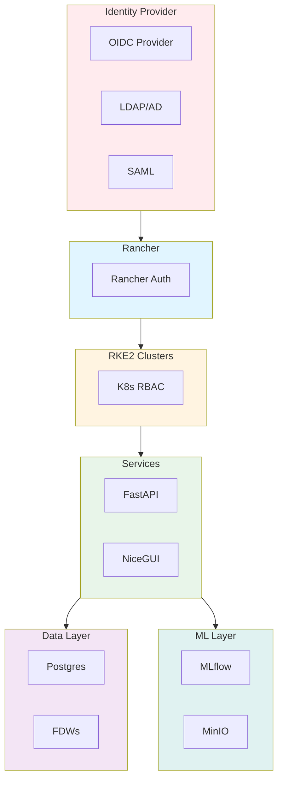
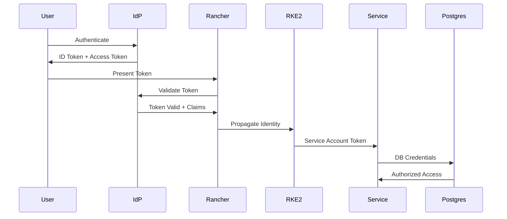
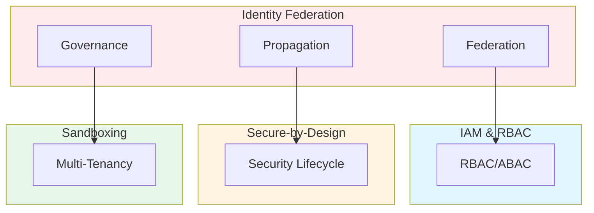

# Cross-Domain Identity Federation, AuthZ/AuthN Architecture & Identity Propagation Models: Best Practices

**Objective**: Establish comprehensive identity federation architecture that unifies authentication and authorization across Rancher, RKE2 clusters, FastAPI/NiceGUI services, Postgres/FDWs, MLflow, object stores, and multi-environment deployments. When you need unified identity, when you want identity propagation, when you need least-privilege governance—this guide provides the complete framework.

## Introduction

Identity federation is the foundation of secure, coherent distributed systems. Without unified identity architecture, systems fragment, access control drifts, and security posture degrades. This guide establishes patterns for cross-domain identity federation, authentication, authorization, and identity propagation across all system layers.

**What This Guide Covers**:
- Architecture for identity propagation across Rancher → RKE2 clusters, FastAPI/NiceGUI services, Postgres/FDWs, MLflow, MinIO, object layers
- On-prem → cloud → air-gapped identity federation
- OIDC/OAuth2 patterns
- ABAC vs RBAC vs ReBAC comparison
- Least-privilege governance
- Token management and delegation
- Identity consistency enforcement
- Multi-environment identity strategies

**Prerequisites**:
- Understanding of authentication and authorization patterns
- Familiarity with OIDC, OAuth2, and identity federation
- Experience with multi-domain identity management

**Related Documents**:
This document integrates with:
- **[Identity & Access Management, RBAC/ABAC, and Least-Privilege Governance](iam-rbac-abac-governance.md)** - IAM patterns
- **[Secure-by-Design Lifecycle Architecture Across Polyglot Systems](secure-by-design-polyglot.md)** - Security lifecycle
- **[Secure Computes, Sandboxing, and Multi-Tenant Isolation for Polyglot Systems](secure-sandboxing-and-multi-tenant-isolation.md)** - Isolation patterns
- **[Operational Risk Modeling, Blast Radius Reduction & Failure Domain Architecture](../operations-monitoring/blast-radius-risk-modeling.md)** - Risk-aware identity

## The Philosophy of Identity Federation

### Identity Principles

**Principle 1: Single Source of Truth**
- Central identity provider
- Consistent identity across domains
- Unified identity model

**Principle 2: Least Privilege**
- Minimal required access
- Just-in-time elevation
- Regular access reviews

**Principle 3: Secure Propagation**
- Encrypted identity tokens
- Short-lived credentials
- Audit all access

## Identity Federation Architecture

### Central Identity Provider

**Architecture Pattern**:


### Identity Propagation Flow

**Flow Diagram**:


## Rancher → RKE2 Identity Propagation

### Rancher Authentication

**Configuration**:
```yaml
# Rancher OIDC configuration
rancher:
  auth:
    provider: "oidc"
    oidc:
      client_id: "rancher-client"
      client_secret: "secret"
      issuer: "https://idp.example.com"
      scopes: ["openid", "profile", "email", "groups"]
      group_claim: "groups"
      user_claim: "email"
```

### RKE2 Cluster Identity

**K8s RBAC Mapping**:
```yaml
# RKE2 RBAC mapping
apiVersion: rbac.authorization.k8s.io/v1
kind: ClusterRoleBinding
metadata:
  name: oidc-group-binding
roleRef:
  apiGroup: rbac.authorization.k8s.io
  kind: ClusterRole
  name: developer
subjects:
- kind: Group
  name: "developers"
  apiGroup: rbac.authorization.k8s.io
```

## FastAPI/NiceGUI Identity Integration

### FastAPI OIDC Integration

**Pattern**:
```python
# FastAPI OIDC integration
from fastapi import Depends, HTTPException, Security
from fastapi.security import HTTPBearer, HTTPAuthorizationCredentials
from jose import jwt, JWTError
import httpx

security = HTTPBearer()

async def get_current_user(
    credentials: HTTPAuthorizationCredentials = Security(security)
) -> dict:
    """Get current user from OIDC token"""
    token = credentials.credentials
    
    # Validate token with IdP
    async with httpx.AsyncClient() as client:
        response = await client.get(
            "https://idp.example.com/.well-known/openid-configuration"
        )
        jwks_uri = response.json()["jwks_uri"]
        
        # Get JWKS
        jwks_response = await client.get(jwks_uri)
        jwks = jwks_response.json()
        
        # Verify token
        try:
            payload = jwt.decode(
                token,
                jwks,
                algorithms=["RS256"],
                audience="api-client"
            )
            return payload
        except JWTError:
            raise HTTPException(status_code=401, detail="Invalid token")

@app.get("/protected")
async def protected_route(user: dict = Depends(get_current_user)):
    """Protected route with identity"""
    return {"user": user["email"], "groups": user.get("groups", [])}
```

### NiceGUI Identity

**Pattern**:
```python
# NiceGUI identity integration
from nicegui import ui
from fastapi import Depends

@ui.page("/dashboard")
async def dashboard(user: dict = Depends(get_current_user)):
    """NiceGUI page with identity"""
    ui.label(f"Welcome, {user['email']}")
    
    # Role-based UI
    if "admin" in user.get("groups", []):
        ui.button("Admin Panel", on_click=show_admin)
```

## Postgres/FDW Identity

### Postgres Role Mapping

**Pattern**:
```sql
-- Postgres role mapping from OIDC
CREATE FUNCTION map_oidc_to_postgres_role(
    oidc_email TEXT,
    oidc_groups TEXT[]
) RETURNS TEXT AS $$
DECLARE
    pg_role TEXT;
BEGIN
    -- Map OIDC groups to Postgres roles
    IF 'developers' = ANY(oidc_groups) THEN
        pg_role := 'app_developer';
    ELSIF 'analysts' = ANY(oidc_groups) THEN
        pg_role := 'analyst_role';
    ELSIF 'admins' = ANY(oidc_groups) THEN
        pg_role := 'admin_role';
    ELSE
        pg_role := 'readonly_role';
    END IF;
    
    RETURN pg_role;
END;
$$ LANGUAGE plpgsql;
```

### FDW Identity Propagation

**Pattern**:
```sql
-- FDW identity propagation
CREATE SERVER remote_db
FOREIGN DATA WRAPPER postgres_fdw
OPTIONS (
    host 'remote-host',
    port '5432',
    identity_propagation 'true'
);

-- User mapping with identity propagation
CREATE USER MAPPING FOR current_user
SERVER remote_db
OPTIONS (
    user 'propagated_user',
    identity_propagation 'true'
);
```

## MLflow/MinIO Identity

### MLflow Identity

**Configuration**:
```python
# MLflow identity integration
import mlflow
from mlflow.tracking import MlflowClient

# Configure MLflow with OIDC
mlflow.set_tracking_uri("https://mlflow.example.com")
mlflow.set_experiment("my-experiment")

# Identity-aware client
client = MlflowClient(
    tracking_uri="https://mlflow.example.com",
    identity_token=get_oidc_token()
)
```

### MinIO Identity

**Configuration**:
```yaml
# MinIO identity configuration
minio:
  identity:
    provider: "oidc"
    oidc:
      client_id: "minio-client"
      issuer: "https://idp.example.com"
      scopes: ["openid", "profile"]
  policies:
    - name: "developer-policy"
      groups: ["developers"]
      permissions: ["read", "write"]
```

## Multi-Environment Identity

### On-Prem Identity

**Pattern**:
```yaml
# On-prem identity
on_prem_identity:
  provider: "ldap"
  ldap:
    server: "ldap://ldap.example.com"
    base_dn: "dc=example,dc=com"
    user_dn: "cn=users,dc=example,dc=com"
    group_dn: "cn=groups,dc=example,dc=com"
```

### Cloud Identity

**Pattern**:
```yaml
# Cloud identity
cloud_identity:
  provider: "oidc"
  oidc:
    issuer: "https://accounts.google.com"
    client_id: "google-client"
    scopes: ["openid", "profile", "email"]
```

### Air-Gapped Identity

**Pattern**:
```yaml
# Air-gapped identity
air_gapped_identity:
  provider: "local-oidc"
  oidc:
    issuer: "https://local-idp.airgap.local"
    client_id: "local-client"
    certificate_authority: "/etc/ssl/ca.pem"
  sync:
    frequency: "monthly"
    method: "secure-media"
```

## OIDC/OAuth2 Patterns

### Authorization Code Flow

**Pattern**:
```python
# OAuth2 authorization code flow
from authlib.integrations.fastapi_oauth2 import OAuth2

oauth = OAuth2()

@app.get("/login")
async def login():
    """Initiate OAuth2 login"""
    redirect_uri = "https://app.example.com/callback"
    return await oauth.authorize_redirect(
        redirect_uri=redirect_uri,
        client_id="client-id",
        scope="openid profile email"
    )

@app.get("/callback")
async def callback(code: str):
    """OAuth2 callback"""
    token = await oauth.authorize_access_token(
        code=code,
        client_id="client-id",
        client_secret="client-secret"
    )
    return {"access_token": token["access_token"]}
```

### Client Credentials Flow

**Pattern**:
```python
# OAuth2 client credentials flow
async def get_service_token():
    """Get service-to-service token"""
    async with httpx.AsyncClient() as client:
        response = await client.post(
            "https://idp.example.com/token",
            data={
                "grant_type": "client_credentials",
                "client_id": "service-client",
                "client_secret": "service-secret",
                "scope": "api.read api.write"
            }
        )
        return response.json()["access_token"]
```

## ABAC vs RBAC vs ReBAC

### RBAC (Role-Based Access Control)

**Pattern**:
```yaml
# RBAC pattern
rbac:
  roles:
    - name: "developer"
      permissions:
        - "read:code"
        - "write:code"
        - "deploy:staging"
    - name: "admin"
      permissions:
        - "*"
  users:
    - user: "alice@example.com"
      roles: ["developer"]
```

### ABAC (Attribute-Based Access Control)

**Pattern**:
```yaml
# ABAC pattern
abac:
  policies:
    - name: "data-access"
      conditions:
        - attribute: "department"
          operator: "equals"
          value: "engineering"
        - attribute: "clearance"
          operator: "gte"
          value: "secret"
      permissions:
        - "read:sensitive-data"
```

### ReBAC (Relationship-Based Access Control)

**Pattern**:
```yaml
# ReBAC pattern
rebac:
  relationships:
    - subject: "user:alice"
      relation: "owner"
      object: "project:alpha"
    - subject: "user:bob"
      relation: "member"
      object: "project:alpha"
  policies:
    - name: "project-access"
      rule: "user can read project if user is owner or member"
```

## Least-Privilege Governance

### Privilege Minimization

**Pattern**:
```python
# Least-privilege enforcement
class LeastPrivilegeEnforcer:
    def enforce(self, user: dict, action: str, resource: str) -> bool:
        """Enforce least-privilege"""
        # Get user permissions
        permissions = self.get_user_permissions(user)
        
        # Check if action is allowed
        required_permission = f"{action}:{resource}"
        
        if required_permission not in permissions:
            return False
        
        # Check for excessive permissions
        if self.has_excessive_permissions(user):
            raise SecurityException("Excessive permissions detected")
        
        return True
```

## Architecture Fitness Functions

### Identity Consistency Fitness Function

**Definition**:
```python
# Identity consistency fitness function
class IdentityConsistencyFitnessFunction:
    def evaluate(self, system: System) -> float:
        """Evaluate identity consistency"""
        # Check identity consistency across domains
        consistency_score = 0.0
        
        for domain in system.domains:
            # Check identity mapping
            identity_mapping = self.check_identity_mapping(domain)
            
            # Check token propagation
            token_propagation = self.check_token_propagation(domain)
            
            # Calculate domain consistency
            domain_consistency = (identity_mapping * 0.5) + \
                                (token_propagation * 0.5)
            
            consistency_score += domain_consistency
        
        # Average consistency
        avg_consistency = consistency_score / len(system.domains)
        
        return avg_consistency
```

### Minimal Privilege Fitness Function

**Definition**:
```python
# Minimal privilege fitness function
class MinimalPrivilegeFitnessFunction:
    def evaluate(self, system: System) -> float:
        """Evaluate minimal privilege"""
        # Calculate privilege excess
        privilege_excess = 0.0
        
        for user in system.users:
            # Get user permissions
            permissions = self.get_user_permissions(user)
            
            # Get required permissions
            required = self.get_required_permissions(user)
            
            # Calculate excess
            excess = len(permissions) - len(required)
            privilege_excess += excess
        
        # Calculate fitness (lower excess = higher fitness)
        if privilege_excess == 0:
            fitness = 1.0
        else:
            fitness = 1.0 / (1.0 + privilege_excess / len(system.users))
        
        return fitness
```

### Secure Delegation Fitness Function

**Definition**:
```python
# Secure delegation fitness function
class SecureDelegationFitnessFunction:
    def evaluate(self, system: System) -> float:
        """Evaluate secure delegation"""
        # Check delegation patterns
        delegation_score = 0.0
        
        for delegation in system.delegations:
            # Check token lifetime
            token_lifetime = delegation.token_lifetime
            if token_lifetime > timedelta(hours=1):
                delegation_score -= 0.1
            
            # Check scope limitation
            if not delegation.scope_limited:
                delegation_score -= 0.1
            
            # Check audit logging
            if not delegation.audit_logged:
                delegation_score -= 0.1
        
        # Normalize score
        fitness = max(0.0, min(1.0, 0.5 + delegation_score))
        
        return fitness
```

## Cross-Document Architecture



## Checklists

### Identity Federation Checklist

- [ ] Central identity provider configured
- [ ] Rancher → RKE2 propagation active
- [ ] FastAPI/NiceGUI identity integrated
- [ ] Postgres role mapping configured
- [ ] FDW identity propagation enabled
- [ ] MLflow/MinIO identity configured
- [ ] Multi-environment identity strategies defined
- [ ] OIDC/OAuth2 patterns implemented
- [ ] ABAC/RBAC/ReBAC policies defined
- [ ] Least-privilege governance active
- [ ] Fitness functions defined
- [ ] Regular identity audits scheduled

## Anti-Patterns

### Identity Anti-Patterns

**Token-Forwarding Leakage**:
```python
# Bad: Token forwarding
def forward_token(token: str, service: str):
    """Forward token to service"""
    # Token exposed in logs/network
    requests.get(service, headers={"Authorization": f"Bearer {token}"})

# Good: Service account
def use_service_account(service: str):
    """Use service account"""
    # Service account token (short-lived, scoped)
    token = get_service_account_token(service)
    requests.get(service, headers={"Authorization": f"Bearer {token}"})
```

**Identity Desync**:
```yaml
# Bad: Identity desync
users:
  - name: "alice"
    k8s_role: "developer"
    postgres_role: "admin"  # Mismatch!

# Good: Identity mapping
identity_mapping:
  oidc_group: "developers"
  k8s_role: "developer"
  postgres_role: "app_developer"
  # Consistent mapping
```

## See Also

- **[Identity & Access Management, RBAC/ABAC, and Least-Privilege Governance](iam-rbac-abac-governance.md)** - IAM patterns
- **[Secure-by-Design Lifecycle Architecture Across Polyglot Systems](secure-by-design-polyglot.md)** - Security lifecycle
- **[Secure Computes, Sandboxing, and Multi-Tenant Isolation for Polyglot Systems](secure-sandboxing-and-multi-tenant-isolation.md)** - Isolation patterns
- **[Operational Risk Modeling, Blast Radius Reduction & Failure Domain Architecture](../operations-monitoring/blast-radius-risk-modeling.md)** - Risk-aware identity

---

*This guide establishes comprehensive identity federation patterns. Start with central identity provider, extend to propagation, and continuously enforce least-privilege governance.*

