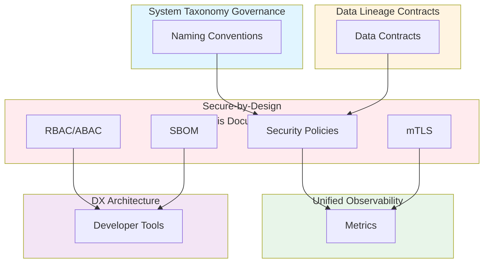

# Secure-by-Design Lifecycle Architecture Across Polyglot Systems: Best Practices

**Objective**: Establish security as a lifecycle concern, not a patch, across Python, Go, Rust, and all infrastructure. When you need secure defaults, when you want zero-trust communication, when you need code-to-cloud traceability—this guide provides the complete framework.

## Introduction

Security must be built into systems from the ground up, not bolted on afterward. This guide establishes secure-by-design patterns across all languages and infrastructure, ensuring security is a lifecycle concern that reduces risk and operational burden.

**What This Guide Covers**:
- Secure defaults in Python, Go, Rust
- Zero-trust internal service communication
- Secrets lifecycle with rotation windows
- RBAC/ABAC patterns
- K8s admission controller policies
- Code-to-cloud security traceability
- SBOM + CVE mitigation pipelines
- Signature/attestation of containers and artifacts

**Prerequisites**:
- Understanding of security principles and threat modeling
- Familiarity with Python, Go, Rust
- Experience with Kubernetes and container security

**Related Documents**:
This document integrates with:
- **[System Taxonomy Governance](../architecture-design/system-taxonomy-governance.md)** - Security policies reference taxonomy
- **[Data Lineage Contracts](../database-data/data-lineage-contracts.md)** - Security policies reference lineage
- **[Unified Observability Architecture](../operations-monitoring/unified-observability-architecture.md)** - Security telemetry integration
- **[DX Architecture and Golden Paths](../python/dx-architecture-and-golden-paths.md)** - Developer tools enforce security

## The Philosophy of Secure-by-Design

### Security as a Lifecycle

**Principle**: Security is not a feature, it's a fundamental property.

**Example**:
```python
# Secure-by-design: Security built in
class SecureService:
    def __init__(self, config: SecureConfig):
        self.config = config
        self.auth = Authentication(config.auth)
        self.encryption = Encryption(config.encryption)
        # Security is foundational, not optional
```

### Defense in Depth

**Principle**: Multiple layers of security.

**Example**:
```yaml
# Defense in depth
security_layers:
  - network: "Network policies"
  - service: "mTLS"
  - application: "Authentication"
  - data: "Encryption at rest"
  - audit: "Logging and monitoring"
```

## Secure Defaults by Language

### Python Secure Defaults

**Pattern**: Secure defaults for Python.

**Example**:
```python
# Secure Python defaults
import ssl
import secrets

# Secure random
token = secrets.token_urlsafe(32)

# Secure SSL context
ssl_context = ssl.create_default_context()
ssl_context.check_hostname = True
ssl_context.verify_mode = ssl.CERT_REQUIRED

# Secure password hashing
from passlib.context import CryptContext
pwd_context = CryptContext(schemes=["bcrypt"], deprecated="auto")
hashed = pwd_context.hash(password)
```

### Go Secure Defaults

**Pattern**: Secure defaults for Go.

**Example**:
```go
// Secure Go defaults
import (
    "crypto/rand"
    "crypto/tls"
    "golang.org/x/crypto/bcrypt"
)

// Secure random
token := make([]byte, 32)
rand.Read(token)

// Secure TLS config
tlsConfig := &tls.Config{
    MinVersion: tls.VersionTLS13,
    CipherSuites: []uint16{
        tls.TLS_AES_128_GCM_SHA256,
        tls.TLS_AES_256_GCM_SHA384,
    },
}

// Secure password hashing
hashed, _ := bcrypt.GenerateFromPassword([]byte(password), bcrypt.DefaultCost)
```

### Rust Secure Defaults

**Pattern**: Secure defaults for Rust.

**Example**:
```rust
// Secure Rust defaults
use rand::Rng;
use bcrypt::{hash, verify, DEFAULT_COST};

// Secure random
let mut rng = rand::thread_rng();
let token: [u8; 32] = rng.gen();

// Secure TLS config
let tls_config = rustls::ClientConfig::builder()
    .with_safe_defaults()
    .with_root_certificates(root_certs)
    .with_no_client_auth();

// Secure password hashing
let hashed = hash(password, DEFAULT_COST)?;
```

## Zero-Trust Internal Service Communication

### mTLS Configuration

**Pattern**: Mutual TLS for all service communication.

**Example**:
```yaml
# mTLS configuration
mtls:
  enabled: true
  ca_cert: /etc/certs/ca.crt
  client_cert: /etc/certs/client.crt
  client_key: /etc/certs/client.key
  server_cert: /etc/certs/server.crt
  server_key: /etc/certs/server.key
```

### Service Mesh Integration

**Pattern**: Service mesh for zero-trust.

**Example**:
```yaml
# Service mesh policy
apiVersion: security.istio.io/v1beta1
kind: PeerAuthentication
metadata:
  name: default
spec:
  mtls:
    mode: STRICT
```

## Secrets Lifecycle with Rotation Windows

### Rotation Policy

**Pattern**: Automated secret rotation.

**Example**:
```yaml
# Rotation policy
rotation:
  schedule: "90 days"
  windows:
    - name: "maintenance"
      start: "02:00"
      duration: "1h"
  notifications:
    - type: "email"
      recipients: ["ops-team@example.com"]
```

### Rotation Implementation

**Example**:
```python
# Secret rotation
class SecretRotator:
    def rotate_secret(self, secret_name: str):
        """Rotate secret"""
        # Generate new secret
        new_secret = generate_secret()
        
        # Update in vault
        update_vault_secret(secret_name, new_secret)
        
        # Notify services
        notify_services(secret_name)
        
        # Update rotation record
        record_rotation(secret_name, new_secret)
```

## RBAC/ABAC Patterns

### RBAC Implementation

**Pattern**: Role-based access control.

**Example**:
```yaml
# RBAC policy
apiVersion: rbac.authorization.k8s.io/v1
kind: Role
metadata:
  name: user-service-role
rules:
  - apiGroups: [""]
    resources: ["pods"]
    verbs: ["get", "list"]
  - apiGroups: [""]
    resources: ["secrets"]
    verbs: ["get"]
```

### ABAC Implementation

**Pattern**: Attribute-based access control.

**Example**:
```python
# ABAC policy
class ABACPolicy:
    def check_access(self, user: User, resource: Resource, action: str) -> bool:
        """Check ABAC access"""
        # Check attributes
        if user.environment != resource.environment:
            return False
        
        if user.team != resource.team:
            return False
        
        # Check action
        if action not in user.permissions:
            return False
        
        return True
```

## K8s Admission Controller Policies

### Policy Definition

**Pattern**: Admission controller policies.

**Example**:
```yaml
# Admission controller policy
apiVersion: kyverno.io/v1
kind: ClusterPolicy
metadata:
  name: require-security-context
spec:
  rules:
    - name: require-security-context
      match:
        resources:
          kinds:
            - Pod
      validate:
        message: "Security context is required"
        pattern:
          spec:
            securityContext:
              runAsNonRoot: true
              seccompProfile:
                type: RuntimeDefault
```

## Code-to-Cloud Security Traceability

### Traceability Model

**Pattern**: Trace security from code to cloud.

**Example**:
```python
# Security traceability
traceability = {
    'code': {
        'repository': 'github.com/org/user-service',
        'commit': 'abc123',
        'sbom': 'sbom.json',
        'vulnerabilities': []
    },
    'build': {
        'image': 'user-service:v1.2.3',
        'sbom': 'image-sbom.json',
        'signature': 'image-signature.sig',
        'attestation': 'image-attestation.json'
    },
    'deployment': {
        'cluster': 'prod-cluster',
        'namespace': 'prod',
        'policies': ['security-policy-1'],
        'scan_results': []
    }
}
```

## SBOM + CVE Mitigation Pipelines

### SBOM Generation

**Pattern**: Generate SBOMs for all artifacts.

**Example**:
```bash
# Generate SBOM
syft packages docker:user-service:v1.2.3 -o spdx-json > sbom.json

# Scan for CVEs
grype sbom:sbom.json -o json > cve-report.json
```

### CVE Mitigation

**Pattern**: Automated CVE mitigation.

**Example**:
```python
# CVE mitigation pipeline
class CVEMitigation:
    def mitigate_cve(self, cve: dict) -> bool:
        """Mitigate CVE"""
        # Check if fix available
        if not cve['fix_available']:
            return False
        
        # Apply fix
        apply_fix(cve['fix'])
        
        # Verify fix
        if not verify_fix(cve):
            return False
        
        return True
```

## Signature/Attestation of Containers and Artifacts

### Container Signing

**Pattern**: Sign all containers.

**Example**:
```bash
# Sign container
cosign sign --key cosign.key user-service:v1.2.3

# Verify signature
cosign verify --key cosign.pub user-service:v1.2.3
```

### Attestation

**Pattern**: Attest artifacts.

**Example**:
```bash
# Generate attestation
cosign attest --key cosign.key \
  --predicate sbom.json \
  --type spdx \
  user-service:v1.2.3

# Verify attestation
cosign verify-attestation --key cosign.pub user-service:v1.2.3
```

## Integration with Taxonomy

### Taxonomy-Based Security

**Pattern**: Use taxonomy for security policies.

**Example**:
```yaml
# Taxonomy-based security
security_policy:
  domain: user  # From taxonomy
  component: api  # From taxonomy
  rules:
    - name: "user-api-access"
      resource: "user-api"  # From taxonomy
      permissions: ["read", "write"]
```

See: **[System Taxonomy Governance](../architecture-design/system-taxonomy-governance.md)**

## Integration with Lineage

### Lineage-Based Security

**Pattern**: Use lineage for security traceability.

**Example**:
```python
# Lineage-based security
security_trace = {
    'data_point': 'user_123',
    'lineage': get_lineage('user_123'),
    'security_policies': [
        {'source': 'lakehouse', 'policy': 'encryption_at_rest'},
        {'source': 'postgres', 'policy': 'row_level_security'},
        {'source': 'api', 'policy': 'authentication'}
    ]
}
```

See: **[Data Lineage Contracts](../database-data/data-lineage-contracts.md)**

## Cross-Document Architecture



## Checklists

### Security Compliance Checklist

- [ ] Secure defaults configured
- [ ] Zero-trust communication enabled
- [ ] Secrets rotation automated
- [ ] RBAC/ABAC policies defined
- [ ] K8s admission policies configured
- [ ] Code-to-cloud traceability enabled
- [ ] SBOM generation automated
- [ ] CVE mitigation pipeline active
- [ ] Container signing enabled
- [ ] Attestation generated

## Anti-Patterns

### Security Anti-Patterns

**Hardcoded Secrets**:
```python
# Bad: Hardcoded secret
password = "secret123"

# Good: External secret
password = os.getenv("DATABASE_PASSWORD")
```

**No mTLS**:
```yaml
# Bad: No mTLS
service:
  tls: false

# Good: mTLS enabled
service:
  mtls:
    enabled: true
```

## See Also

- **[System Taxonomy Governance](../architecture-design/system-taxonomy-governance.md)** - Security policies reference taxonomy
- **[Data Lineage Contracts](../database-data/data-lineage-contracts.md)** - Security policies reference lineage
- **[Unified Observability Architecture](../operations-monitoring/unified-observability-architecture.md)** - Security telemetry integration
- **[DX Architecture and Golden Paths](../python/dx-architecture-and-golden-paths.md)** - Developer tools enforce security

---

*This guide establishes secure-by-design patterns across all systems. Start with secure defaults, extend to zero-trust, and continuously enforce security across the lifecycle.*

