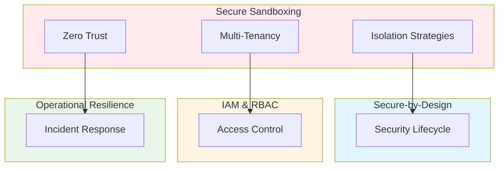

# Secure Computes, Sandboxing, and Multi-Tenant Isolation for Polyglot Systems: Best Practices

**Objective**: Establish comprehensive sandboxing and multi-tenant isolation patterns across Python, Rust, Go microservices, ML inference, embedded engines, and containerized workloads. When you need secure isolation, when you want multi-tenant safety, when you need zero-trust internal boundaries—this guide provides the complete framework.

## Introduction

Secure sandboxing and multi-tenant isolation are fundamental to safe, compliant systems. This guide establishes patterns for isolating workloads, preventing privilege escalation, and ensuring tenant separation across all system layers.

**What This Guide Covers**:
- Isolation strategies for Python notebooks, Rust/Go microservices, ML model inference, DuckDB and embedded engines, Postgres FDW sandbox boundaries
- Hardened container patterns, user namespaces, cgroups
- GPU isolation (MPS, MIG, Kubernetes GPU scheduling)
- Anti-patterns: privilege escalation between services
- Multi-tenant designs for research and HPC clusters
- Secure plugin architecture for NiceGUI/FastAPI apps
- Zero-trust principles in internal service meshes
- Fitness functions for tenant isolation

**Prerequisites**:
- Understanding of security principles and isolation mechanisms
- Familiarity with containers, Kubernetes, and multi-tenancy
- Experience with sandboxing and privilege management

**Related Documents**:
This document integrates with:
- **[Secure-by-Design Lifecycle Architecture Across Polyglot Systems](secure-by-design-polyglot.md)** - Security lifecycle patterns
- **[Identity & Access Management, RBAC/ABAC, and Least-Privilege Governance](iam-rbac-abac-governance.md)** - Access control patterns
- **[Operational Resilience and Incident Response](../operations-monitoring/operational-resilience-and-incident-response.md)** - Incident response for isolation failures
- **[Cost-Aware Architecture & Resource-Efficiency Governance](../architecture-design/cost-aware-architecture-and-efficiency-governance.md)** - Cost-aware isolation

## The Philosophy of Secure Sandboxing

### Isolation Principles

**Principle 1: Defense in Depth**
- Multiple isolation layers
- Fail-safe defaults
- Least privilege

**Principle 2: Zero Trust**
- Verify all access
- Assume breach
- Continuous validation

**Principle 3: Tenant Separation**
- Strong boundaries
- No cross-tenant access
- Audit all interactions

## Isolation Strategies

### Python Notebook Isolation

**Jupyter Isolation**:
```yaml
# Jupyter isolation configuration
jupyter:
  isolation:
    enabled: true
    strategy: "container-per-notebook"
    security:
      run_as_user: "jupyter-user"
      run_as_group: "jupyter-group"
      fs_group: "jupyter-group"
      read_only_root: true
    network:
      policy: "namespace-isolation"
      allowed_egress: ["pypi.org", "conda-forge.org"]
    resource_limits:
      cpu: "2"
      memory: "4Gi"
      storage: "10Gi"
```

**VS Code Isolation**:
```yaml
# VS Code isolation
vscode:
  isolation:
    enabled: true
    strategy: "devcontainer"
    security:
      user_namespace: true
      cgroup_v2: true
      seccomp_profile: "restricted"
    network:
      policy: "pod-network-policy"
```

### Rust/Go Microservice Isolation

**Rust Service Isolation**:
```yaml
# Rust service isolation
rust_service:
  isolation:
    enabled: true
    security_context:
      run_as_non_root: true
      run_as_user: 1000
      capabilities:
        drop: ["ALL"]
        add: []
      seccomp_profile: "runtime/default"
    network:
      policy: "service-mesh-isolation"
      mTLS: true
```

**Go Service Isolation**:
```yaml
# Go service isolation
go_service:
  isolation:
    enabled: true
    security_context:
      run_as_non_root: true
      run_as_user: 1000
      read_only_root_filesystem: true
      allow_privilege_escalation: false
    network:
      policy: "network-policy"
      mTLS: true
```

### ML Model Inference Isolation

**Inference Isolation**:
```yaml
# ML inference isolation
ml_inference:
  isolation:
    enabled: true
    strategy: "model-per-pod"
    security:
      run_as_user: "ml-user"
      run_as_group: "ml-group"
      read_only_model_storage: true
    gpu:
      isolation: "MIG"
      allocation: "dedicated"
    network:
      policy: "inference-isolation"
      rate_limiting: true
```

### DuckDB and Embedded Engine Isolation

**DuckDB Isolation**:
```python
# DuckDB isolation
class IsolatedDuckDB:
    def __init__(self, isolation_config: dict):
        self.isolation = isolation_config
        self.connection = self.create_isolated_connection()
    
    def create_isolated_connection(self):
        """Create isolated DuckDB connection"""
        # Set up sandbox
        sandbox = Sandbox(
            memory_limit=self.isolation['memory_limit'],
            cpu_limit=self.isolation['cpu_limit'],
            network_policy=self.isolation['network_policy']
        )
        
        # Create connection in sandbox
        return sandbox.create_connection()
```

### Postgres FDW Sandbox Boundaries

**FDW Isolation**:
```sql
-- FDW sandbox boundaries
CREATE SERVER isolated_fdw
FOREIGN DATA WRAPPER postgres_fdw
OPTIONS (
    host 'remote-host',
    port '5432',
    isolation_level 'strict',
    sandbox_enabled 'true'
);

-- Isolation policy
CREATE POLICY fdw_isolation_policy
ON FOREIGN TABLE remote_table
USING (
    current_user = 'isolated_user'
    AND current_database = 'isolated_db'
);
```

## Hardened Container Patterns

### Container Hardening

**Pattern**: Harden containers for security.

**Example**:
```dockerfile
# Hardened container
FROM python:3.11-slim

# Create non-root user
RUN groupadd -r appuser && useradd -r -g appuser appuser

# Set up security
RUN apt-get update && \
    apt-get install -y --no-install-recommends \
    ca-certificates && \
    rm -rf /var/lib/apt/lists/*

# Copy application
COPY --chown=appuser:appuser app/ /app/

# Switch to non-root user
USER appuser

# Set security context
RUN chmod 755 /app && \
    chmod 644 /app/*.py

# Run application
CMD ["python", "/app/main.py"]
```

### User Namespaces

**Configuration**:
```yaml
# User namespace configuration
user_namespace:
  enabled: true
  mapping:
    - container_id: 0
      host_id: 1000
      size: 1
  security:
    rootless: true
    no_new_privileges: true
```

### Cgroups Configuration

**Cgroup Setup**:
```yaml
# Cgroup configuration
cgroups:
  version: "v2"
  controllers:
    - "cpu"
    - "memory"
    - "pids"
  limits:
    cpu:
      max: "2"
      period: "100ms"
    memory:
      max: "4Gi"
    pids:
      max: 100
```

## GPU Isolation

### MPS (Multi-Process Service)

**MPS Configuration**:
```yaml
# MPS configuration
gpu_isolation:
  strategy: "MPS"
  mps:
    enabled: true
    memory_fraction: 0.5
    compute_streams: 4
  allocation:
    per_tenant: true
    dedicated: false
```

### MIG (Multi-Instance GPU)

**MIG Configuration**:
```yaml
# MIG configuration
gpu_isolation:
  strategy: "MIG"
  mig:
    enabled: true
    instances:
      - type: "1g.5gb"
        count: 2
      - type: "3g.20gb"
        count: 1
  allocation:
    per_tenant: true
    dedicated: true
```

### Kubernetes GPU Scheduling

**GPU Scheduling**:
```yaml
# Kubernetes GPU scheduling
apiVersion: v1
kind: Pod
spec:
  containers:
  - name: ml-inference
    resources:
      limits:
        nvidia.com/gpu: 1
      requests:
        nvidia.com/gpu: 1
  nodeSelector:
    accelerator: nvidia-tesla-v100
  tolerations:
  - key: nvidia.com/gpu
    operator: Exists
    effect: NoSchedule
```

## Multi-Tenant Designs

### Research Cluster Multi-Tenancy

**Pattern**: Multi-tenant research cluster.

**Example**:
```yaml
# Research cluster multi-tenancy
multi_tenant:
  strategy: "namespace-per-tenant"
  isolation:
    network: "network-policy"
    storage: "storage-class-per-tenant"
    compute: "resource-quota-per-tenant"
  tenants:
    - name: "research-team-a"
      namespace: "research-a"
      quota:
        cpu: "20"
        memory: "40Gi"
        storage: "100Gi"
    - name: "research-team-b"
      namespace: "research-b"
      quota:
        cpu: "20"
        memory: "40Gi"
        storage: "100Gi"
```

### HPC Cluster Multi-Tenancy

**Pattern**: Multi-tenant HPC cluster.

**Example**:
```yaml
# HPC cluster multi-tenancy
hpc_multi_tenant:
  strategy: "partition-per-tenant"
  isolation:
    compute: "slurm-partition"
    storage: "lustre-quota"
    network: "infiniband-vlan"
  tenants:
    - name: "hpc-tenant-a"
      partition: "tenant-a"
      nodes: ["node-1", "node-2"]
      quota:
        cpu_hours: 10000
        memory_gb_hours: 50000
```

## Secure Plugin Architecture

### NiceGUI Plugin Isolation

**Pattern**: Isolate NiceGUI plugins.

**Example**:
```python
# NiceGUI plugin isolation
class IsolatedPlugin:
    def __init__(self, plugin_code: str):
        self.sandbox = Sandbox(
            allowed_imports=['nicegui'],
            blocked_imports=['os', 'subprocess', 'sys'],
            memory_limit='256Mi'
        )
        self.plugin = self.sandbox.execute(plugin_code)
    
    def run(self, context: dict):
        """Run plugin in sandbox"""
        return self.sandbox.run(self.plugin, context)
```

### FastAPI Plugin Isolation

**Pattern**: Isolate FastAPI plugins.

**Example**:
```python
# FastAPI plugin isolation
from fastapi import FastAPI
from sandbox import Sandbox

app = FastAPI()

class IsolatedFastAPIPlugin:
    def __init__(self, plugin_code: str):
        self.sandbox = Sandbox(
            allowed_imports=['fastapi', 'pydantic'],
            blocked_imports=['os', 'subprocess'],
            network_policy='restricted'
        )
        self.plugin = self.sandbox.load_plugin(plugin_code)
    
    @app.middleware("http")
    async def isolate_plugin(request, call_next):
        """Isolate plugin execution"""
        with self.sandbox:
            return await call_next(request)
```

## Zero-Trust Internal Service Meshes

### Service Mesh Isolation

**Pattern**: Zero-trust service mesh.

**Example**:
```yaml
# Service mesh isolation
service_mesh:
  type: "istio"
  zero_trust:
    enabled: true
    mTLS:
      mode: "STRICT"
    authorization:
      policy: "deny-by-default"
    network:
      policy: "default-deny"
  isolation:
    per_namespace: true
    cross_namespace: false
```

## Architecture Fitness Functions

### Tenant Isolation Fitness Function

**Definition**:
```python
# Tenant isolation fitness function
class TenantIsolationFitnessFunction:
    def evaluate(self, system: System) -> float:
        """Evaluate tenant isolation"""
        # Check network isolation
        network_isolation = self.check_network_isolation(system)
        
        # Check storage isolation
        storage_isolation = self.check_storage_isolation(system)
        
        # Check compute isolation
        compute_isolation = self.check_compute_isolation(system)
        
        # Calculate fitness
        fitness = (network_isolation * 0.4) + \
                  (storage_isolation * 0.3) + \
                  (compute_isolation * 0.3)
        
        return fitness
```

## Cross-Document Architecture



## Checklists

### Sandboxing Compliance Checklist

- [ ] Isolation strategies implemented
- [ ] Container hardening configured
- [ ] User namespaces enabled
- [ ] Cgroups configured
- [ ] GPU isolation active
- [ ] Multi-tenant design verified
- [ ] Plugin isolation enabled
- [ ] Zero-trust mesh configured
- [ ] Fitness functions defined
- [ ] Regular security audits scheduled

## Anti-Patterns

### Sandboxing Anti-Patterns

**Privilege Escalation**:
```yaml
# Bad: Privilege escalation allowed
security_context:
  allow_privilege_escalation: true
  run_as_user: 0

# Good: No privilege escalation
security_context:
  allow_privilege_escalation: false
  run_as_user: 1000
  run_as_non_root: true
```

**Weak Network Isolation**:
```yaml
# Bad: No network isolation
network:
  policy: "allow-all"

# Good: Strict network isolation
network:
  policy: "deny-by-default"
  allowed_connections: ["same-namespace"]
```

## See Also

- **[Secure-by-Design Lifecycle Architecture Across Polyglot Systems](secure-by-design-polyglot.md)** - Security lifecycle patterns
- **[Identity & Access Management, RBAC/ABAC, and Least-Privilege Governance](iam-rbac-abac-governance.md)** - Access control patterns
- **[Operational Resilience and Incident Response](../operations-monitoring/operational-resilience-and-incident-response.md)** - Incident response for isolation failures
- **[Cost-Aware Architecture & Resource-Efficiency Governance](../architecture-design/cost-aware-architecture-and-efficiency-governance.md)** - Cost-aware isolation

---

*This guide establishes comprehensive sandboxing and multi-tenant isolation patterns. Start with isolation strategies, extend to multi-tenancy, and continuously enforce zero-trust principles.*

