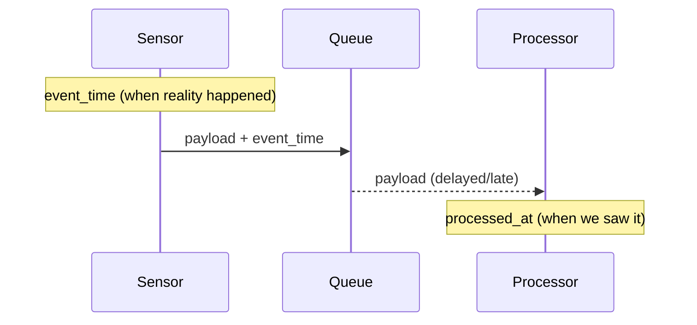

# Time Hygiene: UTC Everywhere, Monotonic Durations, and DST-Proof Scheduling

**Objective**: Master temporal hygiene for production systems that handle time correctly. When you need reliable scheduling, when you want to prevent DST disasters, when you're building data pipelines that span timezones—time hygiene becomes your weapon of choice.

Time is the most misunderstood aspect of system design. Proper time handling prevents DST disasters, enables reliable scheduling, and maintains data integrity across timezones. This guide shows you how to wield time with the precision of a paranoid SRE, covering everything from UTC storage to monotonic clocks and DST-proof scheduling.

## 0) Prerequisites (Read Once, Live by Them)

### The Seven Golden Rules

1. **Store timestamps in UTC with zone info, render in local time at the edges only**
2. **Use monotonic clocks for measuring durations, not wall clock**
3. **Pin all schedules to UTC; never rely on local cron for production**
4. **Log in RFC 3339/ISO-8601 with Z and include a request/run id**
5. **Separate event_time and processed_at in schemas—never conflate them**
6. **Always record the timezone database version (IANA tzdata) when it matters**
7. **Freeze time in tests; don't assert now() without control**

**Why These Rules**: Time handling requires understanding both temporal mechanics and system design patterns. Understanding these patterns prevents DST disasters and enables reliable temporal operations.

## 1) Python: TZ-Aware Now, Monotonic Durations, Serialization

### TZ-Aware UTC Timestamps

```python
# Python 3.11+ (zoneinfo in stdlib)
from datetime import datetime, timezone
import time

# TZ-aware UTC "now" for events
event_time = datetime.now(timezone.utc)  # 2025-10-03T12:34:56.789012+00:00

# Duration measurement (don't use datetime for this)
t0 = time.monotonic_ns()
# ... do work ...
elapsed_ms = (time.monotonic_ns() - t0) / 1_000_000

# ISO 8601 for logs / payloads
payload = {"event_time": event_time.isoformat()}  # "…+00:00"

# Parsing safely
dt = datetime.fromisoformat("2025-10-03T12:34:56.123456+00:00")  # aware
```

**Why TZ-Aware Matters**: timezone.utc guarantees awareness; time.monotonic* is immune to system clock jumps, NTP slews, and DST.

### Monotonic Clock Usage

```python
import time
from datetime import datetime, timezone

class PerformanceTimer:
    def __init__(self):
        self.start_monotonic = time.monotonic_ns()
        self.start_wall = datetime.now(timezone.utc)
    
    def elapsed_ms(self):
        return (time.monotonic_ns() - self.start_monotonic) / 1_000_000
    
    def wall_elapsed(self):
        return datetime.now(timezone.utc) - self.start_wall

# Usage
timer = PerformanceTimer()
# ... do work ...
print(f"Monotonic elapsed: {timer.elapsed_ms():.2f}ms")
print(f"Wall elapsed: {timer.wall_elapsed()}")
```

**Why Monotonic Matters**: Monotonic clocks are immune to system clock adjustments and provide reliable duration measurements.

### Timezone Conversion at Boundaries

```python
from datetime import datetime, timezone
from zoneinfo import ZoneInfo

# Store in UTC
event_time_utc = datetime.now(timezone.utc)

# Convert to user's timezone for display
user_tz = ZoneInfo("America/New_York")
user_time = event_time_utc.astimezone(user_tz)

# Convert back to UTC for storage
stored_utc = user_time.astimezone(timezone.utc)

# Always store the original UTC
assert event_time_utc == stored_utc
```

**Why Boundary Conversion Matters**: Convert timezones only at system boundaries to prevent data corruption and maintain consistency.

## 2) Postgres: Timestamptz vs Timestamp, Indexing, and Retention

### Schema Design with Time Fields

```sql
-- Always: timestamptz (UTC on the wire)
CREATE TABLE readings (
  id           bigserial PRIMARY KEY,
  device_id    text NOT NULL,
  event_time   timestamptz NOT NULL,  -- when it happened
  processed_at timestamptz NOT NULL DEFAULT now(), -- when we ingested it
  payload      jsonb NOT NULL
);

-- Index by time for range scans
CREATE INDEX ON readings (event_time DESC);
-- Optional composite: device + time
CREATE INDEX ON readings (device_id, event_time DESC);
```

**Why Timestamptz Matters**: timestamptz stores UTC with conversion at the edge; time-ordered indexes make queries cheap.

### Partitioning for Retention

```sql
-- Retention: drop old partitions
CREATE TABLE readings_2025_10 PARTITION OF readings
  FOR VALUES FROM ('2025-10-01') TO ('2025-11-01');

-- Query across partitions
SELECT device_id, event_time, payload
FROM readings
WHERE event_time >= '2025-10-01'::timestamptz
  AND event_time < '2025-10-02'::timestamptz;
```

**Why Partitioning Matters**: Time-based partitioning enables efficient retention policies and improves query performance.

### Timezone-Aware Queries

```sql
-- Convert to user timezone for display
SELECT 
  device_id,
  event_time AT TIME ZONE 'UTC' AT TIME ZONE 'America/New_York' AS local_time,
  payload
FROM readings
WHERE event_time >= '2025-10-01'::timestamptz;

-- Aggregate by hour in UTC
SELECT 
  date_trunc('hour', event_time) AS hour_utc,
  count(*) as reading_count
FROM readings
GROUP BY hour_utc
ORDER BY hour_utc;
```

**Why Timezone Queries Matter**: Proper timezone handling in queries prevents data misinterpretation and enables accurate reporting.

## 3) Schedules: Cron, Kubernetes, Prefect—Always UTC

### Kubernetes CronJob (UTC)

```yaml
apiVersion: batch/v1
kind: CronJob
metadata: 
  name: daily-etl
spec:
  schedule: "0 2 * * *"        # interpret & document as UTC
  timeZone: "Etc/UTC"          # k8s >=1.27 supports this; else document UTC
  jobTemplate:
    spec:
      template:
        spec:
          containers:
            - name: etl
              image: your/etl:stable
              env:
                - name: TZ
                  value: "UTC"
          restartPolicy: OnFailure
```

**Why UTC Schedules Matter**: DST wrecks local cron. UTC schedules are reproducible; if you must do local human time, convert at submit-time and document the policy.

### Prefect Deployment Schedule (UTC)

```bash
# Prefect Deployment with UTC schedule
prefect deployment build flows/etl.py:etl -n etl-daily \
  --cron "0 2 * * *" --timezone "UTC" --apply

# Or in Python
from prefect import flow
from prefect.deployments import Deployment
from prefect.server.schemas.schedules import CronSchedule

@flow
def etl_flow():
    pass

deployment = Deployment.build_from_flow(
    flow=etl_flow,
    name="etl-daily",
    schedule=CronSchedule(cron="0 2 * * *", timezone="UTC")
)
deployment.apply()
```

**Why Prefect UTC Matters**: Consistent scheduling prevents DST-related failures and enables reliable automation.

### System Cron (UTC)

```bash
# /etc/crontab - always document UTC
# UTC: 02:00 daily ETL
0 2 * * * etl-user /opt/etl/daily.sh >> /var/log/etl.log 2>&1

# Local time conversion (document the policy)
# America/New_York: 22:00 (10 PM) = UTC 02:00 (2 AM)
# This runs at 10 PM Eastern, 2 AM UTC
```

**Why System Cron Matters**: Document timezone assumptions to prevent scheduling confusion and failures.

## 4) Event Time vs Processing Time (Data Pipeline Mental Model)



**Why Event vs Processing Time Matters**: backfills & late data are normal. Distinguish fields to avoid "traveling through time" bugs.

### Data Pipeline Schema

```python
from pydantic import BaseModel
from datetime import datetime, timezone
from typing import Optional

class SensorReading(BaseModel):
    device_id: str
    event_time: datetime  # When the sensor actually measured
    processed_at: datetime  # When we ingested it
    value: float
    unit: str
    
    class Config:
        json_encoders = {
            datetime: lambda v: v.isoformat()
        }

# Usage
reading = SensorReading(
    device_id="sensor_001",
    event_time=datetime.now(timezone.utc),
    processed_at=datetime.now(timezone.utc),
    value=23.5,
    unit="celsius"
)
```

**Why Schema Separation Matters**: Clear separation prevents temporal confusion and enables accurate data analysis.

## 5) Frontend & APIs: Headers, Serialization, and Clients

### HTTP Headers and Request IDs

```python
from fastapi import FastAPI, Request
from datetime import datetime, timezone
import uuid

app = FastAPI()

@app.middleware("http")
async def add_request_timing(request: Request, call_next):
    request_id = str(uuid.uuid4())
    start_time = datetime.now(timezone.utc)
    
    response = await call_next(request)
    
    # Add timing headers
    response.headers["X-Request-Id"] = request_id
    response.headers["X-Response-Time"] = str(
        (datetime.now(timezone.utc) - start_time).total_seconds()
    )
    
    return response
```

**Why Request IDs Matter**: Request IDs tie logs to time and enable distributed tracing.

### API Response Models

```python
from pydantic import BaseModel, Field
from datetime import datetime, timezone

class ReadingResponse(BaseModel):
    id: str
    event_time: datetime = Field(..., description="TZ-aware UTC")
    processed_at: datetime
    value: float
    unit: str
    
    class Config:
        json_encoders = {
            datetime: lambda v: v.isoformat()
        }

# Ensure serialization is ISO-8601 with 'Z'
reading = ReadingResponse(
    id="x", 
    event_time=datetime.now(timezone.utc), 
    processed_at=datetime.now(timezone.utc),
    value=23.5,
    unit="celsius"
)
```

**Why API Models Matter**: Shared format prevents client parsing drift; request IDs tie logs to time.

## 6) Logging & Tracing: ISO-8601 with 'Z', Include Monotonic Deltas

### Structured Logging with Time

```python
import logging
import time
from datetime import datetime, timezone
import json

class TimeAwareFormatter(logging.Formatter):
    def format(self, record):
        record.timestamp = datetime.now(timezone.utc).isoformat()
        return super().format(record)

# Setup logging
log = logging.getLogger("svc")
handler = logging.StreamHandler()
handler.setFormatter(TimeAwareFormatter(
    '%(timestamp)s [%(levelname)s] %(name)s: %(message)s'
))
log.addHandler(handler)

# Usage with monotonic timing
t0 = time.monotonic()
log.info("Processing started", extra={
    "request_id": "req_123",
    "start_time": datetime.now(timezone.utc).isoformat()
})

# ... do work ...

log.info("Processing completed", extra={
    "request_id": "req_123",
    "end_time": datetime.now(timezone.utc).isoformat(),
    "elapsed_s": round(time.monotonic() - t0, 3)
})
```

**Why Structured Logging Matters**: wall-clock timestamps for humans, monotonic for performance analysis.

### Distributed Tracing

```python
import time
from datetime import datetime, timezone

class TraceContext:
    def __init__(self, trace_id: str):
        self.trace_id = trace_id
        self.start_monotonic = time.monotonic()
        self.start_wall = datetime.now(timezone.utc)
    
    def log_event(self, event: str, **kwargs):
        elapsed = time.monotonic() - self.start_monotonic
        print(json.dumps({
            "trace_id": self.trace_id,
            "event": event,
            "timestamp": datetime.now(timezone.utc).isoformat(),
            "elapsed_s": round(elapsed, 3),
            **kwargs
        }))

# Usage
trace = TraceContext("trace_456")
trace.log_event("start_processing", user_id="user_123")
# ... do work ...
trace.log_event("processing_complete", records_processed=1000)
```

**Why Tracing Matters**: Distributed tracing enables performance analysis and debugging across services.

## 7) Testing: Freeze Time, Travel Time, and DST Edge Cases

### DST Edge Case Testing

```python
import pytest
from freezegun import freeze_time
from datetime import datetime, timezone

@freeze_time("2025-03-30 00:59:50", tz_offset=0)  # DST change day in EU
def test_runs_across_dst_gap():
    from yourpkg.scheduler import next_run_utc
    current_time = datetime.now(timezone.utc)
    next_run = next_run_utc(current_time)
    assert next_run == datetime.fromisoformat("2025-03-30T01:00:00+00:00")

@freeze_time("2025-10-26 01:59:50", tz_offset=0)  # DST fall back
def test_runs_across_dst_fallback():
    from yourpkg.scheduler import next_run_utc
    current_time = datetime.now(timezone.utc)
    next_run = next_run_utc(current_time)
    # Should handle the "extra hour" correctly
    assert next_run > current_time
```

**Why DST Testing Matters**: tests that never cross DST don't protect you. Freeze time and hit the boundaries.

### Time Travel Testing

```python
@pytest.mark.parametrize("test_time", [
    "2025-01-01T00:00:00+00:00",  # New Year
    "2025-03-30T01:30:00+00:00",  # DST spring forward
    "2025-10-26T01:30:00+00:00",  # DST fall back
    "2025-12-31T23:59:59+00:00",  # Year end
])
def test_scheduler_handles_edge_cases(test_time):
    with freeze_time(test_time):
        from yourpkg.scheduler import get_next_run
        next_run = get_next_run()
        assert next_run is not None
        assert next_run > datetime.fromisoformat(test_time)
```

**Why Time Travel Matters**: Comprehensive time testing prevents edge case failures and ensures reliability.

## 8) DST Horror Show (Visualize the Pitfall)

```mermaid
timeline
    title Europe DST Spring Forward (example)
    01:59:59 --> 03:00:00 : Local clock skips one hour
```

**Rule**: Never schedule local 02:30 jobs on DST spring forward—they won't run that day.

### DST Failure Timeline

```python
# DST Spring Forward - Europe 2025
# 01:59:59 CET -> 03:00:00 CEST (skip 02:00-02:59)

# BAD: Local cron at 02:30
# 2025-03-30 01:59:59 CET -> 2025-03-30 03:00:00 CEST
# Job scheduled for 02:30 never runs!

# GOOD: UTC cron at 01:30
# 2025-03-30 01:30:00 UTC -> runs every day
```

**Why DST Visualization Matters**: Understanding DST transitions prevents scheduling disasters and enables reliable automation.

## 9) NTP & Clock Discipline (Infrastructure)

### System Clock Monitoring

```bash
# Debian/Ubuntu: use systemd-timesyncd or chrony
timedatectl timesync-status
chronyc sources -v

# Check clock drift
chronyc tracking
# Look for: "System time" vs "Last offset"

# Alert on significant drift
#!/bin/bash
OFFSET=$(chronyc tracking | grep "Last offset" | awk '{print $4}')
if (( $(echo "$OFFSET > 0.1" | bc -l) )); then
    echo "WARNING: Clock offset ${OFFSET}s exceeds 100ms threshold"
    exit 1
fi
```

**Why NTP Matters**: consistent clocks keep ordering guarantees in distributed systems.

### Kubernetes Clock Sync

```yaml
# DaemonSet for NTP synchronization
apiVersion: apps/v1
kind: DaemonSet
metadata:
  name: ntp-sync
spec:
  selector:
    matchLabels:
      name: ntp-sync
  template:
    metadata:
      labels:
        name: ntp-sync
    spec:
      containers:
      - name: ntp-sync
        image: chrony:latest
        securityContext:
          privileged: true
        volumeMounts:
        - name: dev
          mountPath: /dev
        - name: sys
          mountPath: /sys
      volumes:
      - name: dev
        hostPath:
          path: /dev
      - name: sys
        hostPath:
          path: /sys
```

**Why K8s Clock Sync Matters**: Distributed systems require synchronized clocks for consistency and ordering guarantees.

## 10) Data Modeling Patterns

### JSON Schema for Time Fields

```json
{
  "type": "object",
  "required": ["event_time", "processed_at"],
  "properties": {
    "event_time": { 
      "type": "string", 
      "format": "date-time",
      "description": "When the event actually occurred (UTC)"
    },
    "processed_at": { 
      "type": "string", 
      "format": "date-time",
      "description": "When we processed the event (UTC)"
    },
    "timezone": { 
      "type": "string", 
      "pattern": "^[A-Za-z/_+-]+$",
      "description": "IANA timezone identifier"
    }
  }
}
```

**Why Schema Validation Matters**: validate shape at the boundary; format: date-time expects RFC 3339.

### Database Constraints

```sql
-- Ensure timezone awareness
ALTER TABLE readings 
ADD CONSTRAINT check_event_time_tz 
CHECK (event_time AT TIME ZONE 'UTC' IS NOT NULL);

-- Ensure processed_at is after event_time
ALTER TABLE readings
ADD CONSTRAINT check_processing_order
CHECK (processed_at >= event_time);
```

**Why Constraints Matter**: Database constraints prevent invalid temporal data and maintain data integrity.

## 11) Windowing & Backfills (SQL Patterns)

### Tolerant Aggregation

```sql
-- Hourly aggregates by event_time, tolerate late arrivals by 2h
WITH rounded AS (
  SELECT 
    date_trunc('hour', event_time) AS hour,
    device_id,
    value
  FROM readings
  WHERE event_time >= now() - interval '26 hours'  -- small lookback for late data
)
SELECT 
  hour, 
  device_id,
  count(*) as reading_count,
  avg(value) as avg_value
FROM rounded
GROUP BY hour, device_id
ORDER BY hour DESC;
```

**Why Tolerant Aggregation Matters**: always include a grace window when aggregating streaming-ish data.

### Late Data Handling

```sql
-- Process late-arriving data
WITH late_data AS (
  SELECT *
  FROM readings
  WHERE processed_at > event_time + interval '1 hour'
    AND event_time >= now() - interval '24 hours'
)
UPDATE hourly_aggregates 
SET count = count + 1, 
    total_value = total_value + late_data.value
FROM late_data
WHERE hourly_aggregates.hour = date_trunc('hour', late_data.event_time);
```

**Why Late Data Matters**: Streaming systems must handle late-arriving data gracefully to maintain accuracy.

## 12) Human Time vs Machine Time at the Edges

### User Interface Time Handling

```python
from datetime import datetime, timezone
from zoneinfo import ZoneInfo

class TimeDisplay:
    @staticmethod
    def to_user_time(utc_time: datetime, user_tz: str) -> str:
        """Convert UTC to user's local time for display."""
        user_zone = ZoneInfo(user_tz)
        local_time = utc_time.astimezone(user_zone)
        return local_time.strftime("%Y-%m-%d %H:%M:%S %Z")
    
    @staticmethod
    def from_user_time(user_time_str: str, user_tz: str) -> datetime:
        """Convert user's local time to UTC for storage."""
        user_zone = ZoneInfo(user_tz)
        local_time = datetime.fromisoformat(user_time_str)
        if local_time.tzinfo is None:
            local_time = local_time.replace(tzinfo=user_zone)
        return local_time.astimezone(timezone.utc)
```

**Why Edge Conversion Matters**: Accept user local time only at the UI/API boundary; convert immediately to UTC for storage.

### API Time Boundaries

```python
from fastapi import FastAPI, Query
from datetime import datetime, timezone
from zoneinfo import ZoneInfo

app = FastAPI()

@app.get("/readings")
async def get_readings(
    start_time: str = Query(..., description="ISO 8601 UTC timestamp"),
    end_time: str = Query(..., description="ISO 8601 UTC timestamp"),
    user_tz: str = Query("UTC", description="User timezone for display")
):
    # Parse UTC timestamps
    start_utc = datetime.fromisoformat(start_time)
    end_utc = datetime.fromisoformat(end_time)
    
    # Query in UTC
    readings = get_readings_utc(start_utc, end_utc)
    
    # Convert to user timezone for response
    user_zone = ZoneInfo(user_tz)
    for reading in readings:
        reading['display_time'] = reading['event_time'].astimezone(user_zone).isoformat()
    
    return readings
```

**Why API Boundaries Matter**: Return both UTC timestamp and rendered, localized string where appropriate, but never store localized strings.

## 13) Anti-Patterns (Red Flags)

### Common Time Anti-Patterns

```python
# DON'T: Naive datetime storage
naive_time = datetime.now()  # No timezone info!

# DON'T: Measuring durations with datetime
start = datetime.now()
# ... do work ...
elapsed = datetime.now() - start  # Affected by clock adjustments!

# DON'T: Single timestamp for both event and processing
class BadReading:
    timestamp: datetime  # Which time is this?

# DON'T: String timestamps without timezone
"2025-10-03 12:00:00"  # What timezone?

# DON'T: Mixing precision
seconds = 1640995200
millis = 1640995200000
nanos = 1640995200000000000
```

**Why Anti-Patterns Matter**: Common mistakes lead to temporal bugs and data corruption. Understanding these patterns prevents time-related failures.

### Correct Patterns

```python
# DO: TZ-aware UTC storage
event_time = datetime.now(timezone.utc)

# DO: Monotonic duration measurement
start = time.monotonic_ns()
# ... do work ...
elapsed_ms = (time.monotonic_ns() - start) / 1_000_000

# DO: Separate event and processing time
class GoodReading:
    event_time: datetime      # When it happened
    processed_at: datetime    # When we saw it

# DO: ISO 8601 with timezone
"2025-10-03T12:00:00+00:00"  # UTC
"2025-10-03T08:00:00-04:00"  # EDT

# DO: Consistent precision
timestamp_ns = time.time_ns()
```

**Why Correct Patterns Matter**: Proper time handling prevents bugs and enables reliable temporal operations.

## 14) TL;DR Runbook

### Essential Commands

```bash
# Check system time sync
timedatectl status
chronyc sources -v

# Monitor clock drift
chronyc tracking | grep "Last offset"

# Test DST transitions
python -c "
from datetime import datetime, timezone
import zoneinfo
tz = zoneinfo.ZoneInfo('America/New_York')
print('DST transitions:', tz.transitions)
"
```

### Essential Patterns

```python
# Essential time patterns
time_patterns = {
    "storage": "Always store UTC with timezone info",
    "measurement": "Use monotonic clocks for durations",
    "scheduling": "Pin all schedules to UTC",
    "logging": "ISO-8601 with Z and request IDs",
    "testing": "Freeze time and test DST edges",
    "boundaries": "Convert timezones only at system edges"
}
```

### Quick Reference

```python
# Essential time operations
from datetime import datetime, timezone
import time

# Store UTC
now_utc = datetime.now(timezone.utc)

# Measure duration
start = time.monotonic_ns()
# ... do work ...
elapsed_ms = (time.monotonic_ns() - start) / 1_000_000

# ISO 8601 serialization
iso_string = now_utc.isoformat()  # "2025-10-03T12:34:56.789012+00:00"

# Parse ISO 8601
parsed = datetime.fromisoformat(iso_string)
```

**Why This Runbook**: These patterns cover 90% of time handling needs. Master these before exploring advanced features.

## 15) The Machine's Summary

Time handling requires understanding both temporal mechanics and system design patterns. When used correctly, time hygiene prevents DST disasters, enables reliable scheduling, and maintains data integrity across timezones. The key is understanding UTC storage, mastering monotonic clocks, and following DST-proof scheduling practices.

**The Dark Truth**: Without proper time understanding, your system is fragile and unreliable. Time hygiene is your weapon. Use it wisely.

**The Machine's Mantra**: "In UTC we trust, in monotonic we measure, and in the time we find the path to temporal reliability."

**Why This Matters**: Time hygiene enables efficient temporal operations that can handle complex timezone scenarios, maintain data integrity, and provide reliable scheduling while ensuring consistency and accuracy.

---

*This guide provides the complete machinery for time hygiene. The patterns scale from simple timestamp storage to complex distributed systems, from basic scheduling to advanced temporal data processing.*
