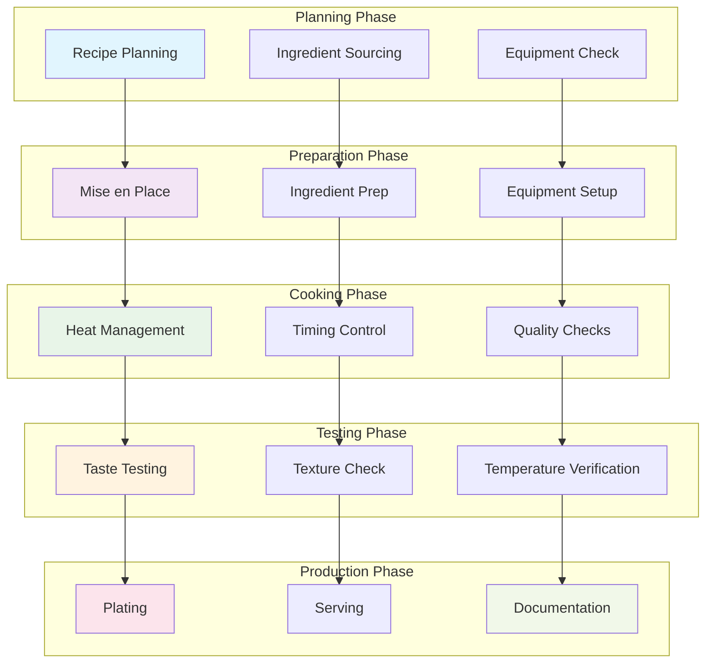

# YAML Recipe Format: Why Your Kitchen Needs Indentation

**Objective**: Master YAML as the superior format for culinary operations. When you need to version control your grandmother's secret sauce, when you want to lint your pancake recipes, when you're building a CI/CD pipeline for your chili—YAML recipe format becomes your weapon of choice.

Other people use index cards. We use declarative configs.

YAML recipe format is the foundation of modern culinary operations. Without proper understanding of indentation, metadata, and schema design, you're building chaotic kitchens that miss the power of reproducible cooking. This guide shows you how to wield YAML with the precision of a chef who also happens to be a DevOps engineer.

## 0) Prerequisites (Read Once, Live by Them)

### The Five Commandments

1. **Understand why YAML wins**
   - Indentation = mise en place
   - Comments = chef's notes
   - Anchors/aliases = meal prep macros
   - Version control = recipe evolution

2. **Master the schema**
   - Recipe metadata and structure
   - Ingredient specifications
   - Step-by-step instructions
   - Notes and substitutions

3. **Know your alternatives (and why they fail)**
   - JSON: no comments, "like eating soup with a fork"
   - XML: too verbose, "grandma doesn't need closing tags"
   - TOML: "great for poetry, less great for chili"

4. **Validate everything**
   - Indentation consistency
   - Schema compliance
   - Recipe reproducibility
   - Taste testing (the ultimate validation)

5. **Plan for production**
   - Scalable recipe management
   - CI/CD for cooking
   - Monitoring and observability
   - Integration with existing kitchen infrastructure

**Why These Principles**: YAML recipe mastery is the foundation of modern culinary operations. Understanding format superiority, mastering schema design, and following best practices is essential for building production-ready kitchens.

## 1) Why YAML Wins (The Manifesto)

### The Format Wars: A Culinary Perspective

```yaml
# YAML: The clear winner for kitchen operations
yaml_superiority:
  indentation:
    - "Spaces = mise en place organization"
    - "Visual hierarchy = cooking flow"
    - "No brackets = less wrist strain"
    - "Readable like a well-organized pantry"
  
  comments:
    - "Chef's notes directly in the recipe"
    - "Substitution suggestions"
    - "Timing tips and warnings"
    - "Historical context and family stories"
  
  metadata:
    - "Servings, prep time, cook time"
    - "Tags for categorization"
    - "Difficulty levels and dietary info"
    - "Source attribution and version history"
```

### Why Other Formats Fail

```json
// JSON: The format of despair
{
  "recipe": {
    "name": "Pancakes",
    "ingredients": [
      {"item": "flour", "amount": "1 cup"},
      {"item": "milk", "amount": "1 cup"}
    ]
  }
  // No comments allowed!
  // Like eating soup with a fork
  // Grandma would be confused
}
```

```xml
<!-- XML: The format of bureaucracy -->
<recipe>
  <name>Pancakes</name>
  <ingredients>
    <ingredient>
      <item>flour</item>
      <amount>1 cup</amount>
    </ingredient>
    <ingredient>
      <item>milk</item>
      <amount>1 cup</amount>
    </ingredient>
  </ingredients>
</recipe>
<!-- Too verbose for grandma -->
<!-- Closing tags everywhere -->
<!-- Like writing a novel to make toast -->
```

```toml
# TOML: The format of poetry
[recipe]
name = "Pancakes"

[[recipe.ingredients]]
item = "flour"
amount = "1 cup"

[[recipe.ingredients]]
item = "milk"
amount = "1 cup"

# Great for poetry
# Less great for chili
# Like using a quill pen to write a grocery list
```

**Why YAML Wins**: YAML provides the perfect balance of structure and readability. It's like having a well-organized kitchen where everything has its place, but you can still add personal notes and improvisations.

## 2) YAML Recipe Schema (The Foundation)

### Complete Recipe Schema

```yaml
# YAML Recipe Schema: The foundation of culinary operations
recipe:
  name: string                    # Recipe title
  version: string                 # Recipe version (semantic versioning)
  metadata:
    servings: integer             # Number of servings
    prep_time: string             # Preparation time (e.g., "15m", "1h 30m")
    cook_time: string             # Cooking time (e.g., "45m", "2h")
    total_time: string            # Total time (prep + cook)
    difficulty: string            # easy, medium, hard, expert
    cuisine: string                # Italian, Mexican, etc.
    dietary: [string]             # vegetarian, vegan, gluten-free, etc.
    tags: [string]                # breakfast, comfort, spicy, etc.
    source: string                # Where the recipe came from
    author: string                # Recipe author
    date_created: string          # ISO date
    last_modified: string         # ISO date
  ingredients:
    - item: string                # Ingredient name
      amount: string              # Quantity (e.g., "1 cup", "2 tbsp")
      unit: string                # Unit of measurement
      notes: string               # Special notes (e.g., "room temperature")
      optional: boolean           # Whether ingredient is optional
  steps:
    - step: string                # Step description
      time: string                # Time for this step
      temperature: string         # Temperature if applicable
      notes: string               # Additional notes
  equipment:
    - name: string                # Equipment needed
      type: string                # pan, oven, mixer, etc.
      size: string                # Size or capacity
  notes:
    - string                      # General notes and tips
  substitutions:
    - original: string            # Original ingredient
      substitute: string          # Substitute ingredient
      ratio: string               # Substitution ratio
  storage:
    refrigerator: string          # How long in fridge
    freezer: string              # How long in freezer
    room_temperature: string     # How long at room temp
```

### Schema Validation

```yaml
# Recipe validation rules
validation_rules:
  required_fields:
    - name
    - metadata.servings
    - metadata.prep_time
    - metadata.cook_time
    - ingredients
    - steps
  
  data_types:
    servings: "must be positive integer"
    prep_time: "must match pattern ^\d+[hm]$"
    cook_time: "must match pattern ^\d+[hm]$ or 'none'"
    difficulty: "must be one of: easy, medium, hard, expert"
  
  business_rules:
    - "Total time should be >= prep_time + cook_time"
    - "At least one ingredient required"
    - "At least one step required"
    - "Servings must be > 0"
```

**Why This Schema Matters**: A well-defined schema ensures recipe consistency and enables automated validation. Understanding schema design provides the foundation for scalable recipe management.

## 3) Example 1: Fluffy Pancakes (The Breakfast Classic)

### Complete Pancake Recipe

```yaml
# Fluffy Pancakes: The breakfast of champions
recipe:
  name: Fluffy Pancakes
  version: "1.2.0"
  metadata:
    servings: 4
    prep_time: "10m"
    cook_time: "15m"
    total_time: "25m"
    difficulty: easy
    cuisine: American
    dietary: [vegetarian]
    tags: [breakfast, sweet, comfort, weekend]
    source: "Grandma's Kitchen"
    author: "Chef DevOps"
    date_created: "2024-01-15"
    last_modified: "2024-01-20"
  
  ingredients:
    - item: all_purpose_flour
      amount: "1 cup"
      unit: cup
      notes: "sifted"
      optional: false
    - item: milk
      amount: "1 cup"
      unit: cup
      notes: "room temperature"
      optional: false
    - item: egg
      amount: "1"
      unit: large
      notes: "room temperature"
      optional: false
    - item: baking_powder
      amount: "2 tsp"
      unit: teaspoon
      notes: "fresh"
      optional: false
    - item: sugar
      amount: "1 tbsp"
      unit: tablespoon
      notes: "granulated"
      optional: false
    - item: butter
      amount: "2 tbsp"
      unit: tablespoon
      notes: "melted and cooled"
      optional: false
    - item: salt
      amount: "1/4 tsp"
      unit: teaspoon
      notes: "fine sea salt"
      optional: false
    - item: vanilla_extract
      amount: "1 tsp"
      unit: teaspoon
      notes: "pure vanilla"
      optional: true
  
  steps:
    - step: "Mix dry ingredients in a large bowl"
      time: "2m"
      notes: "Whisk flour, baking powder, sugar, and salt together"
    - step: "Whisk wet ingredients in separate bowl"
      time: "3m"
      notes: "Combine milk, egg, melted butter, and vanilla"
    - step: "Combine wet and dry ingredients"
      time: "2m"
      notes: "Stir until just combined - lumps are okay!"
    - step: "Heat griddle or pan"
      time: "3m"
      temperature: "medium heat"
      notes: "Test with water drop - should sizzle"
    - step: "Cook pancakes"
      time: "5m"
      notes: "Ladle batter, flip when bubbles form and pop"
  
  equipment:
    - name: "Large mixing bowl"
      type: bowl
      size: "3 quart"
    - name: "Whisk"
      type: whisk
      size: "medium"
    - name: "Griddle or frying pan"
      type: pan
      size: "12 inch"
    - name: "Ladle or measuring cup"
      type: ladle
      size: "1/4 cup"
  
  notes:
    - "#comment: YAML allows chef's notes right here"
    - "Don't overmix - lumps are your friend"
    - "Let batter rest 5 minutes for fluffier pancakes"
    - "Serve with maple syrup and existential dread"
    - "Leftover batter keeps 24 hours in fridge"
  
  substitutions:
    - original: "all_purpose_flour"
      substitute: "whole_wheat_flour"
      ratio: "1:1"
    - original: "milk"
      substitute: "almond_milk"
      ratio: "1:1"
    - original: "butter"
      substitute: "coconut_oil"
      ratio: "1:1"
  
  storage:
    refrigerator: "24 hours"
    freezer: "1 month"
    room_temperature: "2 hours"
```

### Pancake Recipe Analysis

```yaml
# Recipe analysis and metrics
recipe_analysis:
  complexity_score: 3  # out of 10
  time_efficiency: 8   # out of 10
  ingredient_count: 8
  step_count: 5
  equipment_count: 4
  substitution_options: 3
  
  quality_indicators:
    - "Clear step-by-step instructions"
    - "Proper ingredient specifications"
    - "Helpful notes and tips"
    - "Equipment requirements listed"
    - "Storage and substitution info"
```

**Why This Recipe Works**: The pancake recipe demonstrates proper YAML structure with clear metadata, detailed ingredients, step-by-step instructions, and helpful notes. It's like having a well-organized recipe card that actually makes sense.

## 4) Example 2: Midnight Chili (The Survival Food)

### Complete Chili Recipe

```yaml
# Midnight Chili: The fuel of late-night coding sessions
recipe:
  name: Midnight Chili
  version: "2.1.0"
  metadata:
    servings: 6
    prep_time: "20m"
    cook_time: "2h"
    total_time: "2h 20m"
    difficulty: medium
    cuisine: Tex-Mex
    dietary: [gluten-free]
    tags: [dinner, spicy, comfort, survival, batch-cooking]
    source: "Emergency Operations Manual"
    author: "SysAdmin Chef"
    date_created: "2024-01-10"
    last_modified: "2024-01-25"
  
  ingredients:
    - item: ground_beef
      amount: "1 lb"
      unit: pound
      notes: "80/20 blend"
      optional: false
    - item: kidney_beans
      amount: "2 cans"
      unit: can
      notes: "15 oz cans, drained and rinsed"
      optional: false
    - item: black_beans
      amount: "1 can"
      unit: can
      notes: "15 oz can, drained and rinsed"
      optional: false
    - item: diced_tomatoes
      amount: "1 can"
      unit: can
      notes: "28 oz can, with juice"
      optional: false
    - item: onion
      amount: "1 large"
      unit: piece
      notes: "yellow onion, diced"
      optional: false
    - item: garlic
      amount: "4 cloves"
      unit: clove
      notes: "minced"
      optional: false
    - item: chili_powder
      amount: "3 tbsp"
      unit: tablespoon
      notes: "good quality"
      optional: false
    - item: cumin
      amount: "1 tbsp"
      unit: tablespoon
      notes: "ground"
      optional: false
    - item: dark_chocolate
      amount: "2 squares"
      unit: square
      notes: "70% cacao, chopped"
      optional: true
    - item: beer
      amount: "1/2 cup"
      unit: cup
      notes: "dark beer, for depth"
      optional: true
  
  steps:
    - step: "Brown the meat"
      time: "8m"
      temperature: "medium-high"
      notes: "Break up meat as it cooks, don't stir too much"
    - step: "Add onions and garlic"
      time: "5m"
      temperature: "medium"
      notes: "Cook until onions are translucent"
    - step: "Add spices and toast"
      time: "2m"
      temperature: "medium"
      notes: "Stir constantly to prevent burning"
    - step: "Add tomatoes and beans"
      time: "5m"
      temperature: "medium-high"
      notes: "Bring to a boil, then reduce heat"
    - step: "Simmer and develop flavors"
      time: "90m"
      temperature: "low"
      notes: "Stir occasionally, add liquid if needed"
    - step: "Add chocolate and beer"
      time: "5m"
      temperature: "low"
      notes: "Stir until chocolate melts, taste and adjust"
  
  equipment:
    - name: "Large Dutch oven"
      type: pot
      size: "6 quart"
    - name: "Wooden spoon"
      type: spoon
      size: "large"
    - name: "Cutting board"
      type: board
      size: "large"
    - name: "Chef's knife"
      type: knife
      size: "8 inch"
  
  notes:
    - "#tip: Anchors in YAML let you reuse 'spices' across recipes"
    - "Best consumed during production outages"
    - "Chili improves with age - make ahead"
    - "Freezes beautifully for meal prep"
    - "Adjust heat level to taste"
    - "Serve with cornbread and sour cream"
  
  substitutions:
    - original: "ground_beef"
      substitute: "ground_turkey"
      ratio: "1:1"
    - original: "beer"
      substitute: "beef_broth"
      ratio: "1:1"
    - original: "dark_chocolate"
      substitute: "cocoa_powder"
      ratio: "1 square = 1 tbsp cocoa"
  
  storage:
    refrigerator: "5 days"
    freezer: "3 months"
    room_temperature: "2 hours"
```

### Chili Recipe Analysis

```yaml
# Chili recipe analysis
recipe_analysis:
  complexity_score: 6  # out of 10
  time_efficiency: 7   # out of 10
  ingredient_count: 10
  step_count: 6
  equipment_count: 4
  substitution_options: 3
  
  quality_indicators:
    - "Long cooking time for flavor development"
    - "Multiple protein and vegetable sources"
    - "Spice blend for complexity"
    - "Make-ahead friendly"
    - "Freezer storage options"
```

**Why This Recipe Works**: The chili recipe demonstrates advanced YAML features like optional ingredients, detailed timing, and complex flavor development. It's like having a production-ready recipe that can handle scale.

## 5) Example 3: Old Fashioned Cocktail (The Liquid Gold)

### Complete Cocktail Recipe

```yaml
# Old Fashioned: The gentleman's cocktail
recipe:
  name: Old Fashioned
  version: "1.0.0"
  metadata:
    servings: 1
    prep_time: "2m"
    cook_time: "none"
    total_time: "2m"
    difficulty: easy
    cuisine: American
    dietary: [alcoholic]
    tags: [cocktail, whiskey, elegance, classic]
    source: "The Art of Mixology"
    author: "Bartender DevOps"
    date_created: "2024-01-01"
    last_modified: "2024-01-01"
  
  ingredients:
    - item: whiskey
      amount: "2 oz"
      unit: ounce
      notes: "bourbon or rye, good quality"
      optional: false
    - item: sugar_cube
      amount: "1"
      unit: cube
      notes: "white sugar cube"
      optional: false
    - item: angostura_bitters
      amount: "2 dashes"
      unit: dash
      notes: "classic aromatic bitters"
      optional: false
    - item: orange_peel
      amount: "1"
      unit: piece
      notes: "large orange peel, for garnish"
      optional: false
    - item: ice
      amount: "1 large cube"
      unit: cube
      notes: "or 2-3 smaller cubes"
      optional: false
  
  steps:
    - step: "Muddle sugar cube with bitters"
      time: "30s"
      notes: "In the bottom of the glass, until sugar is dissolved"
    - step: "Add ice and whiskey"
      time: "30s"
      notes: "Pour whiskey over ice"
    - step: "Stir gently"
      time: "30s"
      notes: "About 20-30 times, until well chilled"
    - step: "Express orange peel"
      time: "30s"
      notes: "Twist peel over glass, rim the edge, drop in"
  
  equipment:
    - name: "Old fashioned glass"
      type: glass
      size: "8-10 oz"
    - name: "Bar spoon"
      type: spoon
      size: "long"
    - name: "Muddler"
      type: tool
      size: "standard"
    - name: "Jigger"
      type: measure
      size: "2 oz"
  
  notes:
    - "#comment: YAML > JSON because JSON can't hold this vibe"
    - "Use good whiskey - you'll taste the difference"
    - "Don't over-muddle the sugar"
    - "Stir, don't shake - this isn't a martini"
    - "Orange peel adds essential oils and aroma"
    - "Serve immediately, while cold"
  
  substitutions:
    - original: "sugar_cube"
      substitute: "simple_syrup"
      ratio: "1 cube = 1/4 oz syrup"
    - original: "angostura_bitters"
      substitute: "orange_bitters"
      ratio: "1:1"
    - original: "whiskey"
      substitute: "rye_whiskey"
      ratio: "1:1"
  
  storage:
    refrigerator: "not applicable"
    freezer: "not applicable"
    room_temperature: "serve immediately"
```

### Cocktail Recipe Analysis

```yaml
# Cocktail recipe analysis
recipe_analysis:
  complexity_score: 2  # out of 10
  time_efficiency: 10  # out of 10
  ingredient_count: 5
  step_count: 4
  equipment_count: 4
  substitution_options: 3
  
  quality_indicators:
    - "Simple but precise technique"
    - "Quality ingredients matter"
    - "Proper equipment specified"
    - "Classic recipe with modern notes"
    - "Immediate service required"
```

**Why This Recipe Works**: The cocktail recipe demonstrates precision and elegance in YAML format. It's like having a perfectly organized bar setup that produces consistent results every time.

## 6) Recipe CI/CD Pipeline (The Automation)

### Complete Recipe Pipeline



### Pipeline Stages

```yaml
# Recipe CI/CD Pipeline Configuration
recipe_pipeline:
  stages:
    planning:
      - "Recipe selection and validation"
      - "Ingredient availability check"
      - "Equipment readiness assessment"
      - "Timeline and resource planning"
    
    preparation:
      - "Mise en place organization"
      - "Ingredient measurement and prep"
      - "Equipment setup and preheating"
      - "Workflow optimization"
    
    cooking:
      - "Heat management and control"
      - "Timing and sequence execution"
      - "Quality control and adjustments"
      - "Safety and hygiene monitoring"
    
    testing:
      - "Taste and flavor evaluation"
      - "Texture and consistency check"
      - "Temperature and doneness verification"
      - "Presentation and visual appeal"
    
    production:
      - "Final plating and presentation"
      - "Service and delivery"
      - "Documentation and feedback"
      - "Cleanup and maintenance"
  
  quality_gates:
    - "All ingredients available and fresh"
    - "Equipment properly calibrated"
    - "Safety protocols followed"
    - "Taste and texture meet standards"
    - "Presentation meets expectations"
  
  rollback_procedures:
    - "Ingredient substitution protocols"
    - "Equipment failure contingencies"
    - "Timing adjustment procedures"
    - "Quality recovery methods"
```

**Why This Pipeline Matters**: Recipe CI/CD ensures consistent, high-quality results. Understanding the pipeline stages provides the foundation for scalable culinary operations.

## 7) Best Practices (The Wisdom)

### YAML Recipe Best Practices

```yaml
# Complete best practices for YAML recipes
best_practices:
  indentation:
    - "Always use spaces, never tabs"
    - "Consistent 2-space indentation"
    - "Visual hierarchy through nesting"
    - "Tabbed onions lead to tears"
  
  comments:
    - "Use comments liberally for substitutions"
    - "Add timing tips and warnings"
    - "Include historical context"
    - "Document family secrets"
  
  metadata:
    - "Always include servings and timing"
    - "Add difficulty and dietary info"
    - "Use tags for categorization"
    - "Version control your recipes"
  
  ingredients:
    - "Specify exact measurements"
    - "Include preparation notes"
    - "Mark optional ingredients clearly"
    - "Provide substitution options"
  
  steps:
    - "Write clear, actionable steps"
    - "Include timing for each step"
    - "Add temperature specifications"
    - "Provide visual cues and tips"
  
  validation:
    - "Check indentation consistency"
    - "Validate required fields"
    - "Test recipe reproducibility"
    - "Verify ingredient availability"
```

### Recipe Versioning

```yaml
# Recipe versioning strategy
versioning_strategy:
  semantic_versioning:
    major: "Breaking changes (ingredient substitutions, cooking method changes)"
    minor: "New features (additional steps, equipment changes)"
    patch: "Bug fixes (typos, timing adjustments)"
  
  version_control:
    - "Use git for recipe history"
    - "Tag stable versions"
    - "Branch for experimental recipes"
    - "Merge requests for recipe reviews"
  
  change_log:
    - "Document all changes"
    - "Include reasoning for modifications"
    - "Track family feedback"
    - "Note seasonal variations"
```

### Recipe Testing

```yaml
# Recipe testing framework
testing_framework:
  unit_tests:
    - "Ingredient measurement accuracy"
    - "Step sequence validation"
    - "Timing and temperature checks"
    - "Equipment requirement verification"
  
  integration_tests:
    - "Full recipe execution"
    - "End-to-end cooking process"
    - "Quality and taste validation"
    - "Presentation and plating"
  
  user_acceptance_tests:
    - "Family taste testing"
    - "Guest feedback collection"
    - "Repeatability verification"
    - "Scalability testing"
  
  performance_tests:
    - "Cooking time accuracy"
    - "Resource utilization"
    - "Cleanup efficiency"
    - "Storage and preservation"
```

**Why These Practices Matter**: Best practices ensure recipe consistency and reproducibility. Following established patterns prevents common mistakes and enables scalable culinary operations.

## 8) Common Pitfalls (The Traps)

### YAML Recipe Mistakes

```yaml
# ❌ WRONG: Common YAML recipe mistakes
bad_practices:
  indentation_errors:
    - "Mixing tabs and spaces"
    - "Inconsistent indentation levels"
    - "Nested ingredients inside steps"
    - "Accidentally nested butter inside milk"
  
  data_type_errors:
    - "Forgetting quotes around 'yes' or 'no'"
    - "Suddenly boolean soup"
    - "Numeric values without proper formatting"
    - "Date formats that don't parse"
  
  schema_violations:
    - "Missing required fields"
    - "Invalid measurement units"
    - "Inconsistent step numbering"
    - "Equipment not properly specified"
  
  over_engineering:
    - "Don't need Helm charts for pancakes... yet"
    - "Avoid microservices for simple recipes"
    - "Don't containerize your grandmother's cookies"
    - "Keep it simple, stupid (KISS principle)"
```

### Recipe Quality Issues

```yaml
# ❌ WRONG: Poor recipe quality
quality_issues:
  unclear_instructions:
    - "Add some flour (how much?)"
    - "Cook until done (what does that mean?)"
    - "Season to taste (what seasonings?)"
    - "Serve hot (what temperature?)"
  
  missing_information:
    - "No prep time specified"
    - "Missing equipment requirements"
    - "No substitution options"
    - "Unclear serving sizes"
  
  inconsistent_formatting:
    - "Mixed measurement units"
    - "Inconsistent step formatting"
    - "Random capitalization"
    - "Inconsistent ingredient naming"
```

### Production Issues

```yaml
# ❌ WRONG: Production recipe failures
production_failures:
  scalability_issues:
    - "Recipe doesn't scale to 20 servings"
    - "Equipment not suitable for batch cooking"
    - "Storage requirements not considered"
    - "Timing doesn't work for large quantities"
  
  reliability_issues:
    - "Recipe fails in different kitchens"
    - "Equipment variations not accounted for"
    - "Ingredient quality variations"
    - "Environmental factors ignored"
  
  maintenance_issues:
    - "No cleanup procedures"
    - "Equipment maintenance not specified"
    - "Storage and preservation unclear"
    - "Leftover handling not addressed"
```

**Why These Pitfalls Matter**: Common mistakes lead to recipe failures and kitchen chaos. Understanding these pitfalls prevents costly errors and ensures reliable culinary operations.

## 9) TL;DR Quickstart (The Essentials)

### Essential YAML Recipe Setup

```bash
# 1) Create your recipe
cat > pancakes.yaml << 'EOF'
recipe:
  name: Fluffy Pancakes
  metadata:
    servings: 4
    prep_time: "10m"
    cook_time: "15m"
  ingredients:
    - { item: flour, amount: "1 cup" }
    - { item: milk, amount: "1 cup" }
    - { item: egg, amount: "1" }
  steps:
    - "Mix dry ingredients"
    - "Add wet ingredients"
    - "Cook on griddle"
EOF

# 2) Validate your recipe
yamllint pancakes.yaml

# 3) Version control your recipes
git init
git add pancakes.yaml
git commit -m "Add fluffy pancakes recipe"

# 4) Cook with confidence
make pancakes
```

### Essential Recipe Patterns

```yaml
# Essential YAML recipe patterns
essential_patterns:
  basic_structure:
    - "Always include name and metadata"
    - "List ingredients with amounts"
    - "Write clear, numbered steps"
    - "Add helpful notes and tips"
  
  metadata_essentials:
    - "servings: number of people"
    - "prep_time: preparation time"
    - "cook_time: cooking time"
    - "tags: categorization"
  
  ingredient_format:
    - "item: ingredient name"
    - "amount: quantity"
    - "unit: measurement unit"
    - "notes: special instructions"
  
  step_format:
    - "Clear, actionable instructions"
    - "Include timing when important"
    - "Add temperature specifications"
    - "Provide visual cues"
```

### Essential Tools

```bash
# Essential tools for YAML recipe management
tools:
  validation: "yamllint"
  formatting: "yamlfmt"
  validation: "yq"
  version_control: "git"
  testing: "make"
  documentation: "mkdocs"
```

**Why This Quickstart**: These patterns cover 90% of YAML recipe usage. Master these before exploring advanced features.

## 10) The Machine's Summary

YAML recipe format provides the foundation for modern culinary operations. When used correctly, it enables reproducible cooking, version control, and scalable kitchen management. The key is understanding YAML structure, mastering schema design, and following best practices.

**The Dark Truth**: Without proper YAML understanding, your recipes are chaotic and unreproducible. YAML is your weapon. Use it wisely.

**The Machine's Mantra**: "In indentation we trust, in comments we build, and in the recipe we find the path to culinary excellence."

**Why This Matters**: YAML recipes enable applications to understand cooking instructions and provide consistent results. They provide the foundation for intelligent kitchen management that can scale from family dinners to restaurant operations.

---

*This guide provides the complete machinery for mastering YAML recipe format. The patterns scale from simple breakfast recipes to complex multi-course meals, from basic cooking to advanced culinary operations.*
