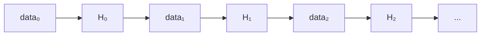
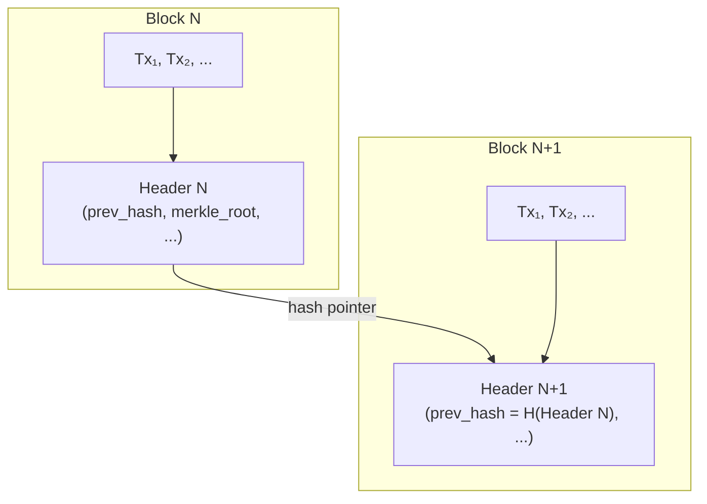

---
tags:
  - deep-dive
  - cryptography
  - systems-design
  - distributed-systems
---

# Blockchain vs Hashchain: Cryptographic Integrity vs Distributed Consensus

**Themes:** Systems Design · Cryptography · Distributed Systems

---

## 1. Introduction: Two Terms Often Treated as the Same

Engineers and product teams routinely conflate **hash chains** and **blockchains**. Both involve cryptographic hashing, linked records, and tamper detection—so the confusion is understandable. But they solve **different system problems**.

A **hash chain** is an **integrity mechanism**: a way to bind a sequence of data items so that any modification to past items is detectable. It requires no agreement among multiple parties and no consensus protocol. A single authority (or a single verifier) can build and check it.

A **blockchain** is a **distributed consensus ledger**: a replicated, agreed-upon ordering of transactions (or state updates) maintained by many participants who do not fully trust each other. Hash-linked blocks are one internal component; the defining feature is **who decides what goes in the chain** and **how disagreement is resolved**.

This deep dive explains both structures in computer-science terms, contrasts their architectures, and gives practical guidance on when to use which—without marketing narratives about cryptocurrency. The goal is clarity: hash chains are a fundamental primitive; blockchains are a distributed-system design that uses that primitive to achieve something more.

---

## 2. Cryptographic Hash Functions (Foundation)

Both hash chains and blockchains rest on **cryptographic hash functions**. A hash function maps an arbitrary-length input to a fixed-length output (e.g. 256 bits for SHA-256). For use in integrity structures, we rely on these properties:

- **Determinism**: The same input always produces the same output. Recomputing a hash yields a verifiable match.
- **Preimage resistance**: Given a hash value, it is computationally infeasible to find an input that produces it. You cannot "reverse" the hash to forge data.
- **Collision resistance**: It is computationally infeasible to find two different inputs that produce the same hash. So a hash uniquely (for practical purposes) commits to its input.
- **Avalanche effect**: A small change in the input (e.g. one bit) produces a completely different output. So tampering anywhere in a chain invalidates downstream hashes.

These properties make hashes ideal for **commitment** and **binding**: once you have a hash of some data, you can later verify that the data has not changed without re-transmitting the full data. SHA-256 (and SHA-3, BLAKE2, etc.) are standard choices; SHA-256 is widely used in both hash-chain applications and in Bitcoin and many other blockchains.

---

## 3. What Is a Hash Chain

A **hash chain** is a sequence of records in which each record is cryptographically bound to the previous one. Formally, with a hash function \(H\):

- **Record 0**: \(H_0 = H(\text{data}_0)\) — the first entry is the hash of the first data item (or the data itself may be stored and \(H_0\) is derived).
- **Record 1**: \(H_1 = H(\text{data}_1 \| H_0)\) — the second entry hashes the second data item concatenated with \(H_0\).
- **Record 2**: \(H_2 = H(\text{data}_2 \| H_1)\), and so on.

Each entry **commits to** the previous entry. If an attacker changes \(\text{data}_1\), then \(H_1\) would change, so \(H_2 = H(\text{data}_2 \| H_1)\) would not match the stored \(H_2\), and every subsequent hash would be wrong. Verification is simple: walk the chain from the beginning, recomputing each hash and comparing. Any break indicates tampering.

So: a hash chain provides **tamper evidence**. It does not prevent tampering; it makes tampering detectable to anyone who can verify the hashes. The chain has a **single logical order** (the order of linkage). There is no notion of "consensus" or "who is allowed to append"—that is an application-layer concern. Typically one party maintains the chain; others may verify it.

---

## 4. Applications of Hash Chains

Hash chains appear wherever you need **ordered, tamper-evident records** without distributed consensus:

- **Audit logs**: Append-only logs where each log entry is chained to the previous. Auditors can verify that no entry was inserted, deleted, or altered after the fact. The log maintainer may be trusted to append correctly; the chain ensures they cannot silently rewrite history.
- **Timestamping**: Systems that attest "this document existed at time T" often build a hash chain of documents (or hashes of documents) and optionally anchor the chain in a trusted time source or a later publication (e.g. in a newspaper or a blockchain). The chain proves ordering and existence.
- **Software supply chain / transparency**: Logs of released artifacts, build events, or dependency resolutions can be hash-chained so that any backdated or altered entry breaks the chain. Certificate Transparency uses a similar idea (a Merkle tree of certificates with a single append-only log).
- **Secure logging**: System events hashed and chained so that compromise of the log store does not allow undetected deletion or modification of past events. Verification can be done by a separate verifier or by third parties given the chain and the hash function.
- **Version histories**: A linear history of versions (e.g. config snapshots, document revisions) where each version commits to the previous. Anyone with the latest hash can verify the full history if they have the data.

Hash chains are **simple and efficient**: one hash per record, minimal state, and verification cost linear in chain length. They do not require a network, tokens, or consensus. They only require a **trusted or semi-trusted maintainer** to append in order and to make the chain (or its head) available for verification.

---

## 5. Limitations of Hash Chains

Hash chains do **not** provide:

- **Distributed consensus**: There is no protocol for multiple parties to agree on the next entry. One party (or a coordinated group) decides what gets appended. If that party is malicious, they can append false data—the chain only guarantees that once appended, the order and content are tamper-evident.
- **Sybil resistance**: There is no cost to creating identities. A hash chain does not restrict who can verify or who can submit; any application-layer access control is separate.
- **Trustless coordination**: Verifiers must trust that the chain they see is the canonical one (or that the maintainer is not withholding or reordering). There is no built-in mechanism for "majority vote" or "economic finality."
- **Protection against a malicious maintainer**: If the single maintainer is compromised or malicious, they can append bad data or, in some designs, refuse to publish. The chain guarantees integrity of the *linkage*, not the *correctness* of what was appended.

So hash chains are **integrity structures**, not **consensus systems**. They answer: "Has this sequence been altered?" They do not answer: "What should the next entry be, and who gets to decide?"

---

## 6. What Is a Blockchain

A **blockchain** is a **distributed ledger** in which:

- **Blocks** of transactions (or state updates) are produced and broadcast to a network.
- **Hash links** between blocks (each block header includes the hash of the previous block header) form a chain, so the *structure* is hash-linked.
- **Consensus rules** determine which blocks are accepted and in what order. Participants run a **consensus mechanism** (proof of work, proof of stake, BFT, etc.) to agree on the canonical chain.
- **Replication**: Many nodes store and relay the same chain. No single party is the unique "maintainer"; the system is designed so that a sufficient fraction of participants must agree before a block is considered part of the ledger.
- **Cryptographic validation**: Blocks and transactions are validated (signatures, Merkle proofs, state transitions) so that invalid data is rejected even if proposed.

So a blockchain **uses** a hash chain (or hash-linked blocks) as an internal data structure, but adds **who may extend the chain** and **how disagreement is resolved**. The hash chain gives ordering and tamper evidence; the consensus layer gives **agreed-upon** ordering and **trustless** (or trust-minimized) verification among strangers.

---

## 7. Core Components of Blockchain Systems

Typical building blocks:

- **Blocks**: Containers that hold a batch of transactions (or similar payloads), a block header (metadata, previous block hash, nonce, etc.), and often a Merkle root of the transactions.
- **Transactions**: Signed statements (e.g. "move X from A to B") that are included in blocks and executed according to the protocol rules.
- **Merkle trees**: A tree of hashes (e.g. leaves = transaction hashes, internal nodes = hash of children) whose root is stored in the block header. This allows **efficient inclusion proofs**: to prove that a transaction is in a block, you need only the block header and a logarithmic number of sibling hashes (a Merkle path), not the full block. So light clients can verify inclusion without downloading the whole chain.
- **Block headers**: Usually include previous-block hash, Merkle root, timestamp, difficulty/nonce (in PoW), and other protocol-specific fields. The header is what gets hashed to form the "link" to the next block.
- **Hash pointers**: The "previous block hash" in each header is the hash pointer: it commits to the content and order of the prior block. So the chain of headers is a hash chain.

The **Merkle tree** is what makes verification scalable: you can prove "this transaction is in this block" with O(log n) data instead of the full block.

---

## 8. Consensus Mechanisms

Blockchains need a way for distributed, possibly mutually distrusting parties to agree on the next block. That is the role of **consensus mechanisms**:

- **Proof of work (PoW)**: Miners compete to find a nonce such that the hash of the block header meets a difficulty target. The first to broadcast a valid block gets a reward; others extend from it. Security comes from the cost of redoing work (e.g. Bitcoin). PoW is expensive in energy and hardware.
- **Proof of stake (PoS)**: Validators lock capital (stake). The protocol selects who may propose the next block (often with probability proportional to stake). Misbehavior can be penalized (slashing). Security comes from economic skin in the game. PoS avoids mining hardware but introduces game-theoretic and implementation complexity.
- **Byzantine fault tolerance (BFT)**: A fixed set of validators run a consensus algorithm (e.g. PBFT, Tendermint) to agree on the next block. Typically requires a known set of participants and a bound on Byzantine nodes (e.g. &lt; 1/3). Good for permissioned or semi-permissioned chains; less suitable for fully open, permissionless systems.

Consensus is **necessary** in a decentralized setting because there is no single trusted maintainer. The protocol must define how the next block is chosen and how conflicts (forks) are resolved. Hash chains alone do not provide this.

---

## 9. The Key Architectural Difference

| Aspect | Hash chain | Blockchain |
|--------|------------|------------|
| **Primary goal** | Data integrity (tamper evidence) | Distributed agreement on a shared ledger |
| **Maintainer** | Single or centralized | Many participants; no single authority |
| **Consensus** | None | Required (PoW, PoS, BFT, etc.) |
| **Trust model** | Trust the maintainer to append; chain ensures no silent alteration | Trust the consensus rules and the majority of participants |
| **Verification** | Recompute hashes along the chain | Validate blocks + consensus rules; may use Merkle proofs for light clients |
| **Append cost** | One hash computation | Mining/staking/consensus round + network propagation |
| **Use case** | Audit logs, transparency logs, versioning | Decentralized ledgers, cryptocurrencies, multi-party state |
| **Complexity** | Low | High (protocol, incentives, networking) |

So: a **hash chain** is a **data structure** for integrity. A **blockchain** is a **distributed system** that uses hash-linked blocks plus consensus to achieve a shared, tamper-resistant ordering of transactions. The hash chain is a component; the consensus and replication are what make it a "blockchain."

---

## 10. Performance and Complexity

**Hash chains:**

- **Lightweight**: One hash per record; storage is the records plus one hash per record (or just the head if verifiers store the chain).
- **Efficient verification**: Linear in chain length; can be done offline or in batch.
- **Easy to implement**: No networking, no consensus, no tokens. Append and verify.

**Blockchains:**

- **Computationally expensive**: PoW mining consumes significant energy; PoS and BFT require many messages and state.
- **Consensus overhead**: Latency (block time), throughput limits (transactions per second), and the cost of running nodes.
- **Network coordination**: Propagation of blocks and transactions, handling forks, syncing state. Operational and bandwidth cost.

Trade-off: hash chains give **integrity with minimal complexity**. Blockchains give **integrity plus decentralized consensus** at the cost of complexity, latency, and resource use. For many applications (internal logs, transparency logs, supply-chain attestation), a hash chain is sufficient and preferable. For open, trustless ledgers, the extra cost of a blockchain may be justified.

---

## 11. Security Properties

**Hash chains** provide:

- **Tamper evidence**: Any change to past data breaks the chain. A verifier who has (or obtains) the correct head can detect modification. They do *not* prevent a malicious maintainer from appending bad data or from withholding the chain.

**Blockchains** provide:

- **Tamper resistance via consensus**: Changing past blocks would require redoing work (PoW) or violating consensus (PoS/BFT) and is assumed infeasible when the majority of participants follow the protocol. So the **threat model** includes malicious or rational participants; the design aims to make cheating expensive or detectable and punishable.

The difference is **who can violate integrity**. In a hash chain, the maintainer can append incorrectly; the chain only ensures they cannot alter history undetected. In a blockchain, altering history is meant to be economically or cryptographically infeasible for any single party or minority. Distributed verification and consensus change the security guarantee from "detectable tampering" to "costly or impossible tampering."

---

## 12. Use Cases Where Hash Chains Are Better

Choose a **hash chain** when:

- You need **tamper-evident ordering** but **one party (or a known set) maintains the log**: audit logs, internal compliance logs, build/release transparency, certificate logs.
- **Verifiers** are known or can obtain the chain from a single (or few) source(s). No need for "anyone in the world" to agree on the next entry.
- **Simplicity and cost** matter: no consensus, no tokens, no mining. Just append and verify.
- **Performance** matters: high append throughput and low verification cost.

Examples: secure audit logs, software transparency (e.g. sigstore, Certificate Transparency-style logs), version histories, supply-chain event logs where a central authority is acceptable. Using a **blockchain** here would add cost and complexity without solving a problem you have (you do not need decentralized consensus).

---

## 13. Use Cases Where Blockchain Makes Sense

Choose a **blockchain** when:

- **Multiple distrusting parties** must agree on a shared ordering of transactions or state. No single authority is acceptable.
- You need a **decentralized ledger**: payments, asset ownership, or shared state where participants do not all trust one coordinator.
- **Censorship resistance** or **permissionless participation** is a requirement: anyone can submit transactions and anyone can verify, without a central gatekeeper.
- **Economic or game-theoretic guarantees** are part of the design: staking, slashing, mining rewards, and so on.

Examples: public cryptocurrencies, decentralized finance (DeFi) ledgers, public notarization or timestamping that must not depend on a single company, or any setting where "who decides the next block?" cannot be answered by "one trusted party." In those cases, consensus mechanisms and the associated cost are necessary.

---

## 14. Misconceptions

- **"Blockchain equals security."** Blockchains provide specific guarantees (e.g. tamper-resistant ordering under consensus assumptions). They do not automatically make an application "secure." Bugs in smart contracts, key management, and off-chain dependencies remain. A hash chain or even a signed log may be more appropriate and simpler when you do not need decentralization.

- **"Blockchain is always decentralized."** Many "blockchain" systems are permissioned: a fixed set of validators, run by consortia or enterprises. They use consensus and hash-linked blocks but are not open or permissionless. "Blockchain" does not imply "no central control."

- **"Blockchain replaces databases."** Blockchains are slow and expensive compared to traditional databases. They are a fit when you need **shared, agreed-upon state among distrusting parties**. When you have a single authority or a trusted database, a database (plus perhaps a hash chain or signed log for integrity) is usually better.

- **"Hash chains are primitive versions of blockchain."** Hash chains are not "blockchain without consensus." They are a **different primitive**: integrity without consensus. They are the right tool when you need tamper evidence and have a trusted or semi-trusted maintainer. Calling them "primitive" misses that they solve a simpler problem by design.

---

## 15. Design Guidance for Engineers

**Use a hash chain when:**

- You need **ordered, tamper-evident records**.
- A **single party (or a known consortium)** can maintain the log.
- Verifiers can **obtain the chain** from that party or a small set of sources.
- You want **low implementation and operational cost**.

**Use a blockchain when:**

- You need **multi-party agreement** on the contents and order of a ledger.
- No **single trusted authority** is acceptable.
- You are willing to bear **consensus cost** (latency, throughput, complexity, and often economic cost).

**Use a traditional database (and optionally hashes or signatures) when:**

- You need **high throughput**, **low latency**, and **flexible querying**.
- A **single authority** owns the data and is trusted by readers.
- Integrity can be provided by **signatures, checksums, or a hash chain** maintained by that authority, without distributed consensus.

Decision flow: Do I need **integrity** only (tamper evidence)? → Hash chain or signed log. Do I need **agreement among distrusting parties**? → Blockchain or other consensus system. Do I only need **performance and central control**? → Database plus optional integrity mechanisms.

---

## 16. Conclusion

**Hash chains** are a fundamental cryptographic primitive for ensuring **data integrity**: each record commits to the previous, so tampering is detectable. They are simple, efficient, and widely used in audit logs, transparency systems, and versioning. They do **not** provide distributed consensus or protection against a malicious maintainer.

**Blockchains** are **distributed systems** that use hash-linked blocks as a building block but add **consensus mechanisms** and **replication** so that many parties can agree on a shared ledger without a single trusted authority. They solve a harder problem (trustless coordination) at higher cost and complexity.

Understanding the difference—integrity mechanism vs consensus system—helps engineers choose the right architecture: a hash chain when integrity and simplicity suffice, a blockchain when decentralized agreement is required, and a database when neither distributed consensus nor a chain is necessary.

!!! tip "See also"
    - [Merkle Trees Explained](merkle-trees-explained.md) — structure and use of Merkle trees in blockchains and distributed systems
    - [Proof of Work Explained](proof-of-work-explained.md) — how hash puzzles and mining secure decentralized consensus
    - [Distributed Systems and the Myth of Infinite Scale](distributed-systems-myth-of-infinite-scale.md) — coordination and consistency in distributed systems
    - [Building a Bitcoin Mining Rig](building-a-bitcoin-mining-rig.md) — how Bitcoin's proof-of-work mining infrastructure works in practice
