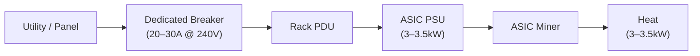
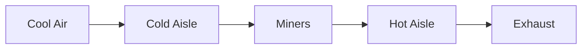
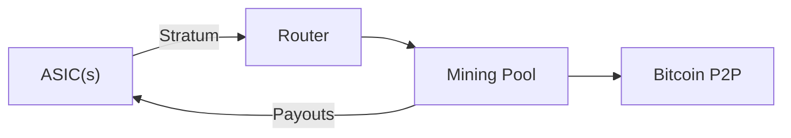

---
tags:
  - deep-dive
  - infrastructure
  - hardware
  - energy
  - economics
---

# Bitcoin Mining Rig Setup: Architecture, Hardware, and Operational Realities

**Themes:** Infrastructure · Hardware · Energy Economics

---

## 1. Introduction: What Bitcoin Mining Actually Is

Bitcoin mining is not "earning free coins with spare GPU cycles." It is the industrial process that enforces Bitcoin's security model.

At the protocol level, Bitcoin uses **proof-of-work (PoW)**: miners repeatedly compute a double SHA-256 hash over a block header that includes a reference to previous blocks, a Merkle root of transactions, and a nonce. The network defines a **difficulty target**; a block is valid if its hash is numerically below that target. Because SHA-256 is designed to be unpredictable, the only way to find such a hash is to try an enormous number of nonces.

Miners perform this computation at scale and broadcast candidate blocks to the network. Nodes verify the block's hash meets the target (proof-of-work), that transactions are valid and non-double-spent, and that consensus rules are respected. The miner whose block is accepted earns the **block reward** (currently a fixed number of BTC per block, halved roughly every four years) plus **transaction fees** from included transactions.

From a systems perspective, mining converts **electrical energy and capital hardware** into **probabilistic rewards in BTC**. The **hash rate** (trillions of hashes per second, TH/s) you can sustain, relative to global network hash rate, determines your share of rewards. The network's **difficulty** adjusts every ~2016 blocks to keep block production near 10 minutes, regardless of total hash rate.

The last decade of Bitcoin mining is the story of **hardware specialization** and **industrialization**: CPU → GPU → FPGA → ASIC; home PC → mining room → warehouse → containerized industrial facility. Modern Bitcoin mining is **ASIC-based industrial infrastructure**, not GPU hobby rigs. The engineering and economics look closer to a small data center coupled to an energy-optimization problem than to a gaming build.

---

## 2. Mining Economics: Why Hardware Matters

Mining is a simple but unforgiving equation:

**Profit = BTC earned × BTC price − OPEX − CAPEX amortization**

BTC earned depends on your **hash rate**, **network hash rate** and **difficulty**, **block reward**, and **transaction fees**. OPEX is dominated by **electricity cost**. CAPEX is the cost of ASICs, power distribution, cooling, and space, amortized over the hardware's economic lifetime.

Key variables:

- **Hash rate**: hashes per second your rigs compute (e.g. 100 TH/s).
- **Difficulty adjustment**: every ~2016 blocks (~two weeks), Bitcoin recalculates difficulty so blocks arrive roughly every 10 minutes. If total hash rate rises, difficulty rises; the same rig earns less BTC.
- **Block rewards and fees**: the protocol subsidy halves roughly every 210,000 blocks; transaction fees are volatile.

Profitability is dominated by **electricity cost per unit of work** and **ASIC efficiency**, expressed as **Joules per terahash (J/TH)**:

**Efficiency (J/TH) = Power (Watts) / Hash rate (TH/s)**

| Miner                | Hash rate (TH/s) | Power (W) | Efficiency (J/TH) |
|----------------------|------------------|-----------|-------------------|
| Antminer S9 (legacy) | 13.5             | 1350      | ~100              |
| Antminer S19j Pro    | 100              | 3050      | ~30.5             |
| WhatsMiner M30S++     | 112              | 3472      | ~31.0             |
| Antminer S19 XP      | 140              | 3010      | ~21.5             |

A miner at 100 J/TH is uncompetitive unless electricity is essentially free. Modern fleets trend toward 20–30 J/TH. **Electricity cost × efficiency** defines your operating ceiling. There is also structural **centralization pressure**: cheap power and capital cluster at scale operators; difficulty and halving compress margins so hobby miners at residential rates are pushed out first. Hardware choice is a **binding economic constraint**.

---

## 3. Mining Hardware Overview

**Evolution:** CPU mining (2009–2010) → GPU mining (2010–2013) → FPGA (2011–2013) → **ASIC mining (2013–present)**. ASICs outperform GPUs and FPGAs by dramatic factors in hash rate and J/TH. Bitcoin mining is almost exclusively ASIC-based today.

Modern miners are integrated units: ASIC hashboards, control board, PSU (often 3–3.5 kW), high-speed fans, Ethernet, and firmware. Key metrics: **hash rate (TH/s)**, **power draw (W)**, **efficiency (J/TH)**, **cooling requirements**. Efficiency is the difference between being viable at \$0.05/kWh versus needing \$0.02/kWh to break even.

---

## 4. Components of a Modern Mining Rig

A rig in ASIC terms is a **power-dense node**: **ASIC miner**, **PSU** (3–3.5 kW, 200–240V), **network** (Ethernet), **cooling** (fans or immersion), **rack/frame**, **power distribution** (PDUs, breakers), **monitoring**. **Airflow and thermal constraints** are non-negotiable: air-cooled ASICs use front-to-back airflow; each unit moves hundreds of CFM. The rig is a power and heat node integrated into an **electrical and thermal envelope**.

---

## 5. Power Infrastructure

A single modern ASIC typically draws **3,000–3,500 W** at **200–240 V** (≈12–16 A continuous). For one S19j Pro: 3050 W at 240 V ≈ 12.7 A; size breakers at 125% continuous → **20 A breaker** at 240 V. Two units → ~30 A circuit; ten units → ~127 A → panel and sub-panel territory. Each miner (or small group) should have a **dedicated circuit** and industrial-rated PDUs. In a warehouse, you work at panel scale (3-phase, transformers); **power becomes the limiting factor** — you can only host as many miners as service capacity and cooling permit.



---

## 6. Cooling and Thermal Management

Every watt consumed becomes heat. A 3 kW miner produces **3 kW of heat** continuously. **Air cooling**: high-speed fans, front-to-back flow, cold aisle intake, hot aisle exhaust. **Fan noise**: S19-class can be 80–90 dBA — residential use is non-trivial. **Temperature monitoring** is essential; thermal throttling cuts hash rate. **Immersion cooling**: hashboards in dielectric fluid; better thermal control and less noise, but higher CAPEX and complexity. At scale, airflow design (intake, exhaust plenum, ducting) defines capacity.



---

## 7. Network and Pool Configuration

Solo mining is rare: at hundreds of EH/s network hash rate, a single 100 TH/s miner has vanishing probability of finding a block. **Pools** aggregate hash power and distribute rewards by contributed work (shares). Most pools use **Stratum** over TCP: miners connect to pool endpoints, receive work units, submit shares; the pool records contributions and pays out when it finds a block.



Configuration (conceptual):

```text
Pool URL: stratum+tcp://us-east.pool.example.com:3333
Worker:   bc1qyourbtcaddress.worker1
Password: x
```

Use primary and backup pools; keep latency and packet loss low; isolate miner network from critical systems.

---

## 8. Firmware and Mining Software

ASIC firmware manages connectivity, temperature/fan control, voltage/frequency tuning, pool config, and monitoring. **Stock firmware** is vendor-supplied and supported. **Aftermarket firmware** (e.g. Braiins OS) offers advanced tuning, better telemetry, and potential efficiency gains at the cost of license fees and possible warranty impact. Evaluate tuning modes (fixed performance, fixed power, dynamic), monitoring APIs, and security (signed updates, no backdoors). Improving efficiency by 5–10% across hundreds of units translates directly into power savings.

---

## 9. Step-by-Step Example Setup (Single Antminer-Class Rig)

**Electrical:** Verify panel capacity; install dedicated 240 V circuit (20–30 A); appropriate receptacle and PDU; label circuit. **Networking:** Connect Ethernet; assign static IP or DHCP reservation; allow outbound TCP to pool ports. **Pool:** In miner web UI, set Pool 1 URL, worker (e.g. `bc1q...rig01`), password; optionally Pool 2/3 failover. **Firmware:** Log in (change default credentials); update to latest vendor or chosen aftermarket firmware; select operating mode; confirm fans and temperatures. **Testing:** Power on; check reported hash rate and temperatures; verify worker on pool dashboard; compare 5–60 min average hash rate. **Monitoring:** Watch temperatures and fan speeds during burn-in; ensure no recirculation; confirm no throttling or frequent disconnects.

---

## 10. Monitoring and Maintenance

Monitor **hash rate** (rig and fleet), **temperature** (chip/board and ambient), **power** (per-rig or PDU), **connectivity** (pool status, stale/rejected shares). Use pool dashboards, vendor/third-party dashboards, or Prometheus/Grafana. **Common failures:** overheating (blocked intakes, recirculation), fan failure (0 RPM, shutdowns), PSU issues (undervoltage, overload), unstable pools (disconnects, high stale rate). Mitigations: spare fans, correct circuit/PDU sizing, multiple pools. Maintenance: dust cleaning, thermal checks, controlled firmware updates.

---

## 11. Scaling to a Mining Farm

Scaling turns the problem into **facility design**: **racks** (density limited by power and cooling per rack), **cold/hot aisle** layout, **noise** (hearing protection, isolation). **Power:** 3-phase panels, balanced phases, industrial PDUs with metering. **Cooling:** engineered intakes/exhaust, filtration, or containerized/immersion solutions. Operational challenges: heat in hot climates, condensation in cold, dust. At scale, the job is running a small power plant whose product is hashed blocks.

---

## 12. Security Considerations

Risks: **firmware tampering** (dev fees, malware), **pool/config hijacking** (payout address changed), **network exposure** (default credentials, exposed dashboards). **Mitigations:** run miners on an **isolated VLAN** with controlled egress (pool endpoints, NTP, firmware only); change default credentials; prefer signed firmware; treat miner UIs as untrusted. Isolation protects both the rigs and the rest of your infrastructure.

---

## 13. Environmental and Energy Considerations

Mining is energy-intensive by design. It is **flexible, location-agnostic load** — can use stranded/curtailed energy, participate in demand response — but also **continuous** and a competitor for low-carbon power. **Renewable mining** (hydro, wind/solar off-peak, geothermal) is common where marginal energy cost is low. **Flare gas mining** uses gas that would otherwise be flared. **Grid balancing** via interruptible contracts is possible. Energy sourcing and grid integration are first-class design concerns for serious miners.

---

## 14. Economic Reality Check

**Difficulty increases** and **hardware obsolescence** (2–4 years at many power prices) compress margins. **Electricity pricing** is decisive: residential rates (e.g. \$0.12–0.20/kWh) are rarely viable; industrial (\$0.03–0.06/kWh) is where serious operations live. Pool fees, firmware fees, facility and staff costs all cut in. A **home miner at \$0.15/kWh** with one S19j Pro is largely educational or ideological; an **industrial miner at \$0.04/kWh** with efficient ASICs and good cooling may be profitable but remains exposed to BTC price and regulation. Design must be coupled to a **clear-eyed economic model**.

For complementary infrastructure economics, see [The Economics of GPU Infrastructure](the-economics-of-gpu-infrastructure.md).

---

## 15. Conclusion

Bitcoin mining rigs are **specialized cryptographic infrastructure**: **hardware efficiency**, **electrical engineering**, **thermal engineering**, **network and protocol operations**, and **energy economics** define success. Whether designing a single-rig learning environment or a containerized farm, the same disciplines apply — a purpose-built data center converting electricity into proof-of-work. Approach it with engineering rigor, realistic economics, and an operational plan that survives beyond the first halving.

!!! tip "See also"
    - [The Economics of GPU Infrastructure](the-economics-of-gpu-infrastructure.md) — economic and operational patterns in power-hungry compute clusters
    - [Converting Bitcoin Mining to LLM Clusters](converting-bitcoin-mining-to-llm.md) — why ASICs cannot run LLMs and how mining facilities can be repurposed for AI compute
    - [Power Electronics for ESP32](../best-practices/embedded/power-electronics-for-esp32.md) — low-voltage power design fundamentals
    - [Observability vs Monitoring](observability-vs-monitoring.md) — monitoring patterns for mining fleet operations
