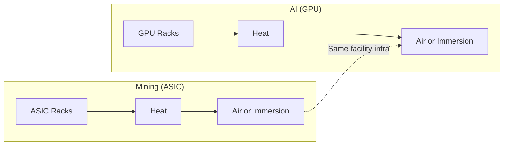
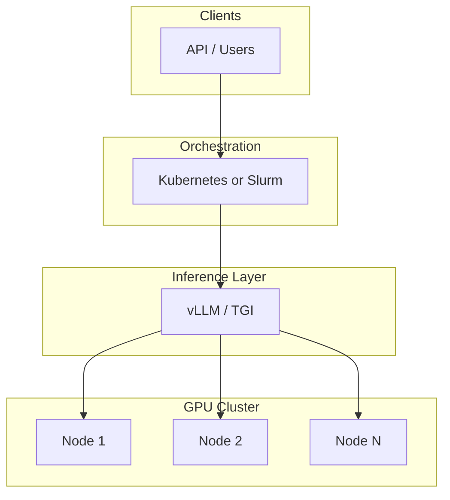

---
tags:
  - deep-dive
  - infrastructure
  - ai
  - gpu
  - mining
---

# From Bitcoin Miner to AI Cluster: Repurposing Mining Infrastructure for Large Language Models

**Themes:** Infrastructure · AI Compute · Facility Repurposing

*This deep dive explains why Bitcoin ASIC miners cannot run neural networks and how mining **facilities and infrastructure** can be repurposed for LLM and AI workloads. For the underlying mining rig architecture and power/cooling design, see [Building a Bitcoin Mining Rig](building-a-bitcoin-mining-rig.md). For GPU economics and acquisition, see [The Economics of GPU Infrastructure](the-economics-of-gpu-infrastructure.md).*

---

## 1. Introduction: The Idea of Reusing Mining Hardware

A natural question arises when both Bitcoin mining and AI training consume enormous amounts of power and capital: **"Can Bitcoin mining machines run AI models?"**

The idea is attractive for several reasons. Mining operations represent massive installed **hash compute**: hundreds of exahash per second globally, housed in facilities with **high-density power distribution**, **industrial cooling**, and **warehouse-scale space**. Historically, **GPU mining** (Ethereum and other proof-of-work chains) did use general-purpose graphics cards, and some of those same GPUs later found their way into early AI clusters. So the intuition that "mining hardware" might be reused for AI is not baseless—but it depends entirely on *which* mining hardware.

The reality is sharp:

- **Bitcoin ASIC miners cannot run LLMs.** They are fixed-function silicon designed only for double SHA-256 hashing. They have no programmable instruction pipeline, no floating-point units, and no ability to execute matrix operations or neural network kernels.
- **Mining facilities**, by contrast—the buildings, electrical feeds, cooling systems, racks, and operational practices—are exactly the kind of infrastructure that AI compute clusters need. Repurposing a Bitcoin mining *facility* for GPU-based AI workloads is not only possible but has already been done by operators pivoting from crypto to AI.

This document explains the technical reasons ASICs and neural compute are incompatible, what parts of mining infrastructure transfer to AI, and how a realistic conversion from a mining site to an LLM cluster can be planned and executed.

---

## 2. Why Bitcoin ASICs Cannot Run LLMs

### 2.1 Architecture of a Bitcoin ASIC

A Bitcoin mining ASIC (Application-Specific Integrated Circuit) is designed to do one thing: compute the **double SHA-256** hash of a block header as fast and as efficiently as possible. The algorithm is fixed:

1. Take a 80-byte block header (version, prev block hash, Merkle root, time, bits, nonce).
2. Apply SHA-256 twice in sequence.
3. Compare the 256-bit result to the network difficulty target.

The silicon is optimized for this pipeline and nothing else. Typical design characteristics:

- **Fixed-function datapaths**: dedicated logic for the SHA-256 round functions (shift, rotate, add, XOR). There is no instruction decoder, no general-purpose ALU, no load/store unit for arbitrary memory access.
- **No floating-point units**: SHA-256 uses only integer bitwise and modular arithmetic. Neural networks require floating-point (FP32, FP16, BF16) or quantized integer matrix multiplies. An ASIC has no FPUs.
- **No programmable pipeline**: You cannot load a different program. The "program" is burned into the hardware. There is no way to run CUDA, OpenCL, or a custom neural kernel.
- **Minimal memory model**: ASICs hold working state for the current block header and intermediate hash state. They do not have large, random-access memory arrays for model weights or activations. LLMs require tens or hundreds of gigabytes of high-bandwidth memory per device.
- **No software stack**: There is no driver that exposes "run this kernel." The firmware on a miner tells the ASIC which nonce range to try and collects results. There is no path to run PyTorch, TensorFlow, or vLLM.

In other words, a Bitcoin ASIC is a **cryptographic accelerator**, not a **general-purpose or matrix accelerator**. It is the wrong abstraction for neural compute.

### 2.2 What Neural Networks Require

Large language models (and neural networks in general) are built from:

- **Matrix multiplications** (and related ops): weight matrices × activations, at scale. This requires hardware that can perform dense or sparse matrix ops at high throughput, typically with floating-point or reduced-precision arithmetic.
- **Large, high-bandwidth memory**: model weights (e.g. 7B parameters × 2 bytes ≈ 14 GB for FP16) and activations must be stored and streamed at high bandwidth. GPUs and AI accelerators provide hundreds of GB/s of memory bandwidth per device.
- **Programmability**: different layers, attention mechanisms, and optimizers require flexible execution of many small and large kernels. This is why GPUs (programmable shaders/CUDA cores) and dedicated AI accelerators (programmable tensor pipelines) dominate, not fixed-function SHA-256 chips.

### 2.3 Comparison: ASIC vs GPU vs CPU vs AI Accelerator

| Characteristic        | Bitcoin ASIC     | GPU (e.g. A100/H100) | CPU                  | AI accelerator (e.g. TPU, MI300) |
|-----------------------|------------------|----------------------|-----------------------|-----------------------------------|
| **Primary function**  | SHA-256 hashing  | General parallel compute | General serial/parallel | Matrix / tensor ops        |
| **Instruction set**   | None (fixed)     | Programmable (CUDA, etc.) | Programmable (x86/ARM) | Programmable (tensor ops)  |
| **Floating-point**    | No               | Yes (FP32/FP16/BF16/TF32) | Yes                   | Yes (often optimized)      |
| **Matrix units**      | No               | Yes (Tensor Cores, etc.)  | Limited               | Yes (core purpose)         |
| **Memory**            | Small, hash state| Large VRAM (40–80+ GB)    | System RAM            | High-bandwidth on-chip/HBM |
| **Can run LLMs?**     | **No**           | Yes                  | Theoretically, very slow | Yes                    |
| **Can run SHA-256?**  | Optimized        | Yes but inefficient  | Yes but slow          | Possible but not designed  |

The table makes the asymmetry clear: ASICs are built for one hash function; LLMs need programmable matrix and memory hardware. There is no software or firmware update that can turn an Antminer into an LLM inference engine.

---

## 3. The Historical Exception: GPU Mining

Not all "mining" hardware is ASICs. **GPU mining** was the norm for many proof-of-work chains, most notably **Ethereum** (until its move to proof-of-stake in 2022). Ethereum's Ethash algorithm was deliberately designed to be **memory-hard** and **GPU-friendly**, so that ASICs would not dominate and retail GPUs could participate.

GPU mining rigs were literally **racks of consumer or prosumer GPUs** (NVIDIA GeForce, AMD Radeon) connected to a host CPU, with strong PSUs and aggressive cooling. Those same GPUs are **general-purpose parallel processors**: they run CUDA or ROCm, execute floating-point and matrix operations, and can run neural network training and inference. When Ethereum moved to proof-of-stake, a large installed base of GPU mining capacity was suddenly idle. Many of those GPUs were:

- Redeployed into **AI training and inference clusters**
- Sold into the secondary market and used for LLM fine-tuning, inference, and other ML workloads
- Already in facilities with high power and cooling, which were then repurposed for AI

So when people say "mining farms turned into AI clusters," they are usually referring to **GPU mining farms** (Ethereum and similar), not Bitcoin ASIC farms. The hardware in those cases was reusable; the facility was reusable; only the workload and software stack changed. For **Bitcoin**, the hardware (ASICs) is not reusable for AI—only the **facility and infrastructure** are.

---

## 4. What Parts of Mining Infrastructure Are Valuable for AI

The real opportunity in repurposing **Bitcoin** mining operations is the **infrastructure**, not the silicon. Mining operations have already solved problems that AI clusters need at scale:

- **High-density power distribution**: Mining facilities are built to deliver hundreds of kilowatts or megawatts to compute-dense racks. ASICs draw ~3–3.5 kW per unit; GPU servers often draw 5–10 kW per node. The same electrical design—dedicated circuits, PDUs, panel capacity—supports GPU clusters.
- **Industrial cooling**: Air-cooled mining uses massive airflow (cold aisle/hot aisle) or immersion. Both translate to GPU deployments: air-cooled GPU racks need similar airflow discipline; immersion cooling for GPUs is an established option and aligns with mining immersion expertise.
- **Warehouse-scale space**: Large, single-story or industrial buildings with clear span, loading docks, and space for rows of racks. AI clusters need the same.
- **Rack infrastructure**: 19" racks, cable management, and physical layout. Mining racks may need reinforcement or replacement for heavier GPU servers, but the layout and density planning experience transfers.
- **Network connectivity**: Mining sites already have fiber or high-grade connectivity for pool communication. AI clusters need more bandwidth (see below), but the physical path and often the carrier relationships are in place.
- **Operational practices**: 24/7 monitoring, incident response, and maintenance. The mindset of running critical, power-hungry infrastructure is the same.

What does *not* transfer is the **compute hardware itself**: the ASICs are decommissioned and sold or scrapped. They cannot be "retasked" for AI.

---

## 5. Electrical Infrastructure

Mining farms are built around **megawatt-scale or multi-hundred-kilowatt power** delivery. Typical characteristics:

- **Utility service**: Often 480 V or medium-voltage feeds, with transformers down to 208 V or 240 V for racks.
- **High-amperage PDUs**: Industrial PDUs rated for 30 A, 60 A, or more per branch, with per-outlet or per-phase metering.
- **Dedicated circuits**: Each miner or small group on its own circuit to avoid overload and simplify fault isolation. Same discipline applies to GPU servers.

Power comparison:

| Load type        | Typical power per unit | Notes                          |
|------------------|------------------------|--------------------------------|
| Bitcoin ASIC     | ~3–3.5 kW              | Single voltage, single PSU     |
| GPU server (1–8 GPUs) | ~1–2 kW (idle) to 5–10 kW (full) | Depends on GPU count and TDP |
| 8× A100 80GB node| ~5–7 kW sustained      | High-end training/inference    |

So a facility that could run 100 ASICs at ~350 kW can, from a **power budget** perspective, run on the order of 50–70 high-end GPU servers (e.g. 8× A100 per node). The main work is **redesigning the distribution**: new PDUs and circuits sized for GPU server inlets (often 208 V or 240 V, 20–30 A per server), and ensuring breaker and panel capacity matches. Transformer and utility capacity often already exist; the change is at the rack level.

---

## 6. Cooling Systems

Mining cooling strategies map well to GPU cooling needs.

**Air cooling:**

- Mining uses **cold aisle / hot aisle** layouts with high CFM fans. GPU servers also use front-to-back (or similar) airflow; the same aisle discipline and fan power apply.
- Intake air temperature and humidity limits for GPUs are similar in spirit to ASIC limits (e.g. avoid >35°C intake). Existing HVAC or outside-air systems may need tuning for slightly different heat loads per rack but the design language is the same.

**Immersion cooling:**

- Some Bitcoin mining operations use **immersion cooling** (miners submerged in dielectric fluid). The same approach is used for GPUs: immersion eliminates fan noise, improves heat transfer, and allows higher power density per rack.
- Converting an immersion mining setup to immersion GPU means **replacing the miners with GPU servers or GPU-only trays** designed for immersion. The tanks, pumps, heat exchangers, and fluid handling can often be reused or adapted. Thermal design (heat rejection to ambient) is similar in principle: you are still rejecting hundreds of kilowatts of heat.

The takeaway: cooling infrastructure built for high-density mining is suitable for high-density GPU compute. The main variable is **heat load per rack** (kW per rack); if GPU racks are denser than ASIC racks, you may need more cooling capacity per rack or fewer servers per rack until cooling is upgraded.

---

## 7. Networking Requirements for AI Clusters

Here the difference between mining and AI is large.

**Mining:**

- Low bandwidth: miners send/receive small work units and shares (Stratum protocol). A few Mbps per miner is ample. Latency matters only at the margin (stale shares). Standard 1 GbE or even 100 Mb to the rack is typical.

**AI clusters:**

- **Training**: Gradient and parameter synchronization across nodes requires **high bandwidth** and **low latency**. Multi-node training commonly uses 25 GbE, 100 GbE, or **InfiniBand** (e.g. 200 Gb/s HDR), plus **NVLink** or NVSwitch within a node for multi-GPU communication.
- **Inference**: Single-node inference may need only 10–25 GbE for model loading and API traffic. Multi-node inference (e.g. tensor parallelism, or many replicas behind a load balancer) benefits from fast interconnect for model parallelism and low-latency load balancing.

So when converting a mining facility to AI:

- **In-building cabling** usually must be **upgraded**: Cat6a/optical for 10–25 GbE at minimum; often 100 GbE or InfiniBand for training clusters.
- **Top of rack (ToR) switches** must be replaced or added with high-speed ports.
- **NVLink/NVSwitch** is a function of the GPU servers you buy, not the facility—but the facility must have space and power for those servers.

Mining gives you **space, power, and cooling**. It does not give you the right network; that is a new investment.

---

## 8. Converting a Mining Facility into an AI Cluster

A conceptual transition looks like this.

**Step 1: Decommission ASIC miners**

- Power down and remove miners. Sell or scrap ASICs; retain or sell PSUs and cables if not needed for the new design.
- Document existing power and cooling capacity (per rack, per aisle, total) for planning.

**Step 2: Plan power and cooling for GPU servers**

- Decide target density (e.g. 8× A100 per node, N nodes per rack).
- Size circuits and PDUs for GPU server power draw; upgrade breakers/PDUs if necessary.
- Verify cooling (air or immersion) can handle the new heat load per rack and total.

**Step 3: Install GPU servers and rack layout**

- Procure GPU servers (or build from components). Install in racks with correct power and airflow alignment.
- Cable power and out-of-band management (e.g. IPMI, iDRAC) first; validate power and cooling before stressing GPUs.

**Step 4: Upgrade networking**

- Deploy ToR and spine switches (or equivalent) with 25/100 GbE or InfiniBand.
- Cable GPU servers to the network; configure VLANs and routing as needed for cluster traffic and management.

**Step 5: Deploy orchestration and software stack**

- Install and configure **orchestration**: Kubernetes (with GPU device plugins and operators) or **Slurm** for HPC-style job scheduling.
- Deploy **container runtime** (e.g. containerd, Docker) and **GPU drivers** (NVIDIA, AMD).
- Deploy **distributed compute / inference** frameworks (see Section 10).

**Step 6: Validate and operate**

- Run health checks (GPU detection, memory, NVLink). Run small training or inference jobs to validate throughput and stability.
- Put in place **monitoring** (Prometheus/Grafana, DCGM, or vendor tools) and **alerting** for temperature, power, and job failures.

Realistic considerations:

- **Timeline**: Months, not weeks—especially if electrical or cooling upgrades are required.
- **Capital**: GPU servers are expensive; networking is a significant additional cost. The facility is the enabler, not the only cost.
- **Skills**: Operations team needs ML platform and GPU cluster experience, or you need to hire or partner. Mining ops experience transfers only partly (facility and power/cooling); software stack and ML workflows are new.

---

## 9. Hardware for Running LLM Models

LLMs run on hardware that can perform large matrix operations and hold large models in memory.

**NVIDIA GPUs:**

- **A100** (40 GB / 80 GB): Workhorse for training and inference. High memory bandwidth, Tensor Cores, NVLink.
- **H100**: Next-gen; higher FP8 throughput and memory bandwidth. Used for large training and high-throughput inference.
- **L40S, L4**: Often used for inference and lighter training/fine-tuning.

**AMD accelerators:**

- **MI250X, MI300A/MI300X**: Competitive with A100/H100 for training and inference in supported frameworks (ROCm).

**Dedicated inference / AI chips:**

- **Google TPU**, **AWS Trainium/Inferentia**, **Groq LPU**, etc. These are not "mining repurpose" targets in the same way—they are typically consumed in cloud or specific deployments. For a facility you own, GPU servers are the usual path.

**Memory requirements:**

- **7B parameter model** (FP16): ~14 GB. Fits on a single 24–40 GB GPU.
- **70B parameter model** (FP16): ~140 GB. Requires multi-GPU (e.g. 2× 80 GB A100) or quantization (e.g. 4-bit → ~35 GB).
- **Larger models**: 405B+ parameters require many GPUs and model/tensor parallelism. This is cluster territory.

**Example cluster sizes:**

- **Small inference cluster**: 4–8 nodes × 8 GPUs (e.g. 32–64 A100 80GB). Serves 7B–70B models with replication and some headroom.
- **Training / large inference**: Dozens to hundreds of GPUs; InfiniBand or equivalent; Slurm or Kubernetes with MPI or distributed frameworks.

---

## 10. Software Stack for LLM Infrastructure

Typical layers:

**Container runtime and orchestration:**

- **Kubernetes** with NVIDIA GPU operator (or AMD equivalent) for scheduling GPU workloads, or **Slurm** for HPC-style batch training and inference.
- **Containers** (Docker, OCI) for reproducible environments (CUDA, PyTorch, etc.).

**Distributed compute and training:**

- **PyTorch**, **TensorFlow** with multi-GPU and multi-node support.
- **Ray** for distributed training and serving.
- **DeepSpeed**, **Megatron-LM** for very large model training.

**Inference engines:**

- **vLLM**: High-throughput LLM inference with PagedAttention.
- **TGI** (Text Generation Inference): Hugging Face inference server.
- **Triton Inference Server**: Flexible backend for multiple model types.
- **Custom APIs** (FastAPI, etc.) wrapping the above.

**Typical architecture:**

The facility provides power, cooling, and space; the software stack turns GPU servers into a usable LLM platform.

---

## 11. Cost Comparison

**Mining economics (Bitcoin):**

- Revenue: BTC earned × BTC price (volatile).
- Costs: Electricity (dominant), ASIC depreciation, facility, labor.
- Margin: Compressed by difficulty and halving; highly sensitive to electricity price.

**AI compute economics:**

- Revenue: Rental (cloud-style) or internal value from training/inference.
- Costs: Electricity, GPU server depreciation, facility, labor, networking, software licenses (if any).
- Margin: Depends on utilization and pricing. GPU scarcity has kept cloud GPU prices high; on-prem can be attractive if utilization is high and capital is available.

**Comparison:**

- **Electricity**: Same facility, so similar \$/kWh. AI clusters may run at similar or higher total kW than mining, so total power cost can be comparable or higher.
- **Hardware depreciation**: ASICs depreciate quickly (2–4 years to obsolescence at many power prices). GPUs also depreciate but have a broader resale market (ML, rendering, scientific). AI hardware is more expensive per kW of compute in dollar terms.
- **GPU scarcity**: GPUs have been supply-constrained; lead times and premiums are real. Repurposing a facility does not remove the need to procure GPUs.
- **Cloud vs on-prem**: Cloud GPU (e.g. AWS, GCP, Azure) avoids upfront capital but has high marginal cost and sometimes limited availability. On-prem in a repurposed mining facility can reduce marginal cost if you have sustained, high utilization—but you bear capital and operations risk.

Repurposing makes sense when the **facility** is the scarce or strategic asset (e.g. cheap power, existing permits, skilled ops) and you are willing to invest in new compute hardware and software to capture AI demand instead of mining revenue.

---

## 12. Real-World Examples

A number of operators have pivoted or expanded from crypto mining to AI compute:

- **Data center operators** that previously hosted Bitcoin ASIC mining have in some cases allocated space and power to GPU clusters for AI training and inference, sometimes under the same roof as remaining mining or in converted halls.
- **GPU mining farms** (Ethereum-era) were in many cases directly repurposed: same GPUs, same or similar facility, new workload (AI). This is the "mining to AI" story that involves **reusing the GPUs**.
- **Bitcoin-only facilities** that repurpose do so by **removing ASICs** and **installing GPU servers** (or other AI accelerators). The reported cases emphasize reuse of **power contracts**, **cooling**, and **site location** (e.g. near hydro or wind) rather than reuse of mining silicon.

Public reporting on specific companies (e.g. CoreWeave, which has roots in GPU mining and now operates large GPU clouds; or mining operators adding AI colocation) illustrates the pattern: the valuable asset is the **infrastructure and the power deal**, not the ASICs themselves.

---

## 13. Environmental and Infrastructure Implications

Repurposing mining infrastructure for AI can be beneficial from an infrastructure and energy perspective:

- **Stranded or cheap power**: Many mining sites were built where power is cheap (hydro, wind, excess capacity). The same sites can host AI compute, so the grid and generation assets are used rather than abandoned when mining economics weaken.
- **Renewable sites**: Mining has co-located with renewables for cost and ESG reasons. AI demand is growing; siting GPU clusters at renewable or low-carbon sites can align with corporate sustainability goals and regulatory trends.
- **Demand growth**: AI compute demand is expanding rapidly. Adding supply in existing, power-ready facilities can be faster and sometimes cheaper than greenfield data center builds—assuming power and cooling headroom exist.

The implication is not that "AI is green" or "mining is good"—it is that **facilities built for power-hungry compute can be redeployed** to another form of power-hungry compute (AI) when the economics and policy environment favor it. Repurposing avoids wasting the sunk cost in grid connections, transformers, and cooling.

---

## 14. Practical Guide: Building an LLM Inference Cluster from a Mining Setup

**Example target: 32-GPU inference cluster** (e.g. 4 nodes × 8 GPUs, A100 80GB or similar).

**Rack layout:**

- 4 GPU servers in one or two racks (depending on server form factor and power/cooling per rack).
- Reserve space for ToR switch(es) and PDU(s). Typical GPU server: ~2–3 U, 5–7 kW; 4 servers ≈ 20–28 kW per rack. Ensure existing mining-era circuits and cooling can support this or add capacity.

**Power:**

- 4 × 7 kW ≈ 28 kW. At 240 V, ~117 A continuous; use 125% for breaker sizing → ~146 A. Typically 2–3 dedicated 60 A circuits or equivalent PDU branches. Match to your facility’s existing voltage and PDU ratings.

**Networking:**

- 25 GbE or 100 GbE ToR; each server with 1–2 ports. Optional: InfiniBand if you later add training or large model parallelism. Separate management network (1 GbE) for BMC and SSH.

**Inference stack (example):**

- **Orchestration**: Kubernetes with NVIDIA GPU operator, or bare-metal Slurm.
- **Runtime**: vLLM or TGI in containers; load balancer (e.g. nginx, or K8s Service) in front.
- **Models**: Pull from Hugging Face or internal registry; mount shared storage (NFS or object) for model weights if needed.
- **APIs**: OpenAI-compatible or custom REST/gRPC; auth and rate limiting as required.

**Validation:**

- Deploy a 7B model on one node; measure throughput (tokens/s) and latency. Scale to 4 nodes with replication; test failover and load distribution. Monitor GPU utilization, memory, and temperature.

This is a minimal but realistic architecture. Scaling to more nodes or to training adds networking (e.g. InfiniBand), more orchestration, and distributed training frameworks—but the facility’s role (power, cooling, space, and physical layout) remains the same as in the mining era.

---

## 15. Conclusion

**Bitcoin ASIC miners cannot run LLMs.** They are fixed-function SHA-256 engines with no floating-point units, no programmable pipeline, and no path to execute neural network kernels. No software or firmware can change that.

The opportunity is in **mining infrastructure**, not mining silicon. Facilities built for Bitcoin mining already provide:

- High-density power distribution
- Industrial cooling (air or immersion)
- Warehouse-scale space and rack infrastructure
- Operational experience with 24/7, power-hungry compute

These assets align well with the needs of GPU-based AI clusters. Converting a mining site to an AI cluster means **decommissioning ASICs**, **installing GPU servers**, **upgrading networking**, and **deploying an orchestration and inference stack**. The electrical and thermal design of the facility can be reused; the network usually must be upgraded; the compute hardware is replaced entirely.

For operators with existing mining facilities, repurposing for AI is a realistic path—provided they are ready to invest in GPUs, networking, and the right operational and software capabilities. The rigs themselves cannot run the models; the buildings that housed them can.

!!! tip "See also"
    - [Building a Bitcoin Mining Rig](building-a-bitcoin-mining-rig.md) — ASIC mining architecture, power, cooling, and operational realities
    - [The Economics of GPU Infrastructure](the-economics-of-gpu-infrastructure.md) — GPU scarcity, utilization, and acquisition strategies for ML and inference
