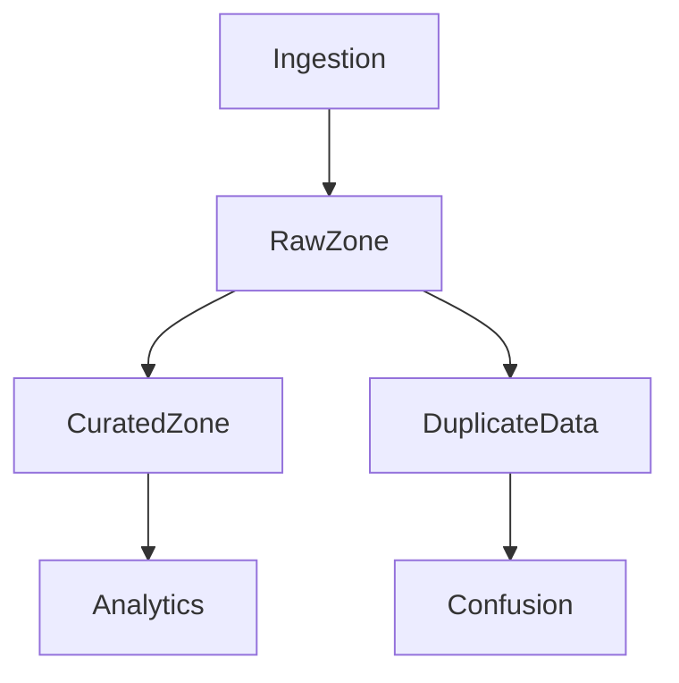

---
tags:
  - deep-dive
  - data-engineering
  - governance
  - data-lake
---

# Why Most Data Lakes Become Data Swamps

*Governance Failures and the Entropy of Unstructured Storage*

**Themes:** Data Architecture · Governance · Organizational

---

## Opening Thesis

Data lakes promise flexibility and scale: ingest raw data quickly, apply schema when needed, and let diverse consumers use the same storage. Without governance, that promise inverts. Lakes inevitably degrade into unmanageable data swamps—repositories where data accumulates faster than context, where ownership is unclear, and where the cost of understanding the data approaches or exceeds the cost of reacquiring it from source systems. This essay examines the original lake vision, how entropy emerges, why metadata collapses, and what architectural and organizational practices can prevent or reverse the swamp.

---

## The Original Data Lake Vision

The data lake concept emerged as an alternative to the rigid, centralized warehouse. Goals included:

**Schema-on-read**: Data could be stored in raw or semi-structured form; schema would be applied at query time. This allowed rapid ingestion without upfront modeling and supported exploratory and ML use cases that did not fit a fixed star schema.

**Cheap storage**: Object storage (S3, HDFS, Azure Blob) made it economical to retain large volumes of raw data. The economic argument for discarding or aggressively aggregating data weakened; "keep everything" became feasible.

**Rapid ingestion**: Pipelines could land data without lengthy transformation. New sources could be added quickly. The bottleneck of a central modeling team was reduced.

Organizations adopted lakes to escape warehouse rigidity, to support data science and ad-hoc analysis, and to consolidate data from many sources into one place. The vision was correct for a narrow set of conditions: when governance (ownership, schema, quality, lineage) is applied with the same rigor as in a warehouse, a lake can serve both flexible and governed use cases. In practice, governance was often deferred or assumed to emerge later. It did not.

---

## The Entropy Problem

Entropy in a data lake is the tendency for the system to become less organized and less usable over time. It emerges through:

**Inconsistent schemas**: Different teams or pipelines write the same logical entity with different column names, types, or encodings. The same event may appear in multiple shapes. Queries and downstream pipelines must account for variation or break when they encounter it.

**Uncontrolled ingestion**: When any team can write to the lake without standards, the rate of new datasets and partitions outstrips the rate of documentation and curation. Discovery becomes impossible; duplication and near-duplication multiply.

**Dataset duplication**: Copies of the same or similar data appear in different paths, with different transformations or filters. There is no single source of truth; consumers do not know which copy is authoritative. Confusion and inconsistency follow.

Data flows from ingestion into a raw zone; ideally some of it is promoted to a curated zone and then to analytics. In an ungoverned lake, the raw zone also feeds duplicate or ad-hoc copies that bypass curation. Those copies proliferate and feed confusion: which dataset is correct? Who owns it? When was it last updated? The diagram illustrates the fork between governed flow (raw → curated → analytics) and entropic flow (raw → duplicate → confusion).

---

## Metadata Collapse

When metadata is missing or wrong, the lake becomes unusable at scale.

**Unknown datasets**: Without a catalog or enforced registration, datasets appear in storage with no name, no description, and no owner. Analysts and pipelines cannot discover what exists or whom to ask. Data that could be valuable is effectively lost.

**Broken lineage**: If lineage is not recorded automatically, the chain from source to table to report is unknown. When quality issues arise, root-cause analysis is guesswork. When upstream schemas change, impact analysis is impossible. Lineage is the nervous system of a data platform; without it, the platform is blind.

**Inconsistent schemas**: Schema drift—columns added, removed, or changed type without coordination—breaks consumers. When there is no schema registry or contract enforcement, drift is inevitable. Downstream pipelines and reports fail or produce wrong results.

The concept of **metadata as control plane** is relevant here: the control plane (catalog, schema registry, lineage) governs the data plane. When the control plane is absent or weak, the data plane drifts. The lake may hold petabytes of bytes, but without metadata infrastructure it is not a governed system—it is a swamp. See [Metadata as Infrastructure](metadata-as-infrastructure.md) and [The Metadata Crisis in Modern Data Platforms](metadata-crisis-in-modern-data-platforms.md).

---

## Governance Failures

Governance failures are usually organizational, not technical.

**Unclear ownership**: When no one is designated owner of a dataset or domain, no one is accountable for quality, retention, or schema evolution. Ownership must be assigned and visible; without it, the lake becomes a commons that no one maintains.

**Missing data contracts**: Producers and consumers often operate with implicit assumptions about schema, freshness, and semantics. When those assumptions are not written down and enforced (contracts), changes break consumers or go unnoticed until wrong decisions are made. Contracts do not require heavy tooling; they require discipline and a place to record and enforce agreements.

**Weak validation**: Data that is not validated at ingest or at stage boundaries can contain errors that propagate. Validation—checks on schema, nullability, ranges, and referential integrity—must be automated and tied to promotion. Without it, bad data accumulates and trust in the lake erodes.

---

## The Rise of Lakehouse Architectures

Technologies such as **Delta Lake**, **Apache Iceberg**, and **Apache Hudi** attempt to restore structure on top of object storage. They provide:

- **ACID transactions** and time travel over Parquet (or similar) files
- **Schema enforcement** and evolution at write time
- **Metadata** (table manifest, partition specs, statistics) that is part of the table rather than an afterthought

Lakehouse architectures do not eliminate the need for governance—ownership, contracts, lineage—but they provide a technical foundation that makes governance enforceable. Tables have schemas; writes that violate the schema can be rejected. The lakehouse is a step from "unstructured lake" toward "governed, queryable data product." See [Lakehouse vs Warehouse vs Database](lakehouse-vs-warehouse-vs-database.md).

---

## Architectural Lessons

**Enforce ingestion standards**: Define what can be written, where, and in what format. Use a schema registry or table format that enforces schema at write. Reject or quarantine data that does not meet standards rather than allowing it to accumulate ungoverned.

**Treat metadata as infrastructure**: Catalogs, lineage, and schema must be produced and updated as a byproduct of pipeline execution, not maintained manually. Metadata that is documentation drifts; metadata that is infrastructure governs.

**Define ownership boundaries**: Assign owners to domains, datasets, or zones. Make ownership visible in the catalog. Hold owners accountable for quality, retention, and evolution. Without boundaries, the lake has no structure.

**Promote curated layers**: Maintain a clear path from raw or landing to curated. Curated datasets have owners, contracts, and quality checks. They are the interface that consumers should use; raw zones are for ingestion and staging, not for ad-hoc consumption without governance.

---

## Decision Framework

| Situation | Recommendation |
|-----------|-----------------|
| New lake or zone | Define zones (raw, curated, analytics), ownership, and ingestion standards before scale grows. |
| Existing ungoverned lake | Start with a catalog and lineage for high-value datasets; introduce contracts and validation for new or critical pipelines; do not try to document everything at once. |
| Choosing storage format | Prefer a table format (Delta, Iceberg, Hudi) over raw Parquet if you need ACID, schema enforcement, and time travel. |
| Multi-team lake | Enforce domain boundaries and ownership; use contracts between producer and consumer domains; automate metadata from pipelines. |

**Principle**: A lake without governance becomes a swamp. Governance must be designed in from the start or introduced as soon as the cost of chaos becomes visible.

!!! tip "See also"
    - [Why Most Data Lakes Become Data Swamps](why-data-lakes-become-swamps.md) — Companion deep dive on governance and entropy
    - [The Metadata Crisis in Modern Data Platforms](metadata-crisis-in-modern-data-platforms.md) — Why metadata fails when it is an afterthought
    - [The Myth of Infinite Data Scale](myth-of-infinite-data-scale.md) — How "store everything" drives swamp formation
    - [Why Most Data Pipelines Are Operationally Fragile](why-data-pipelines-are-operationally-fragile.md) — Pipeline design and lake health
    - [Metadata as Infrastructure](metadata-as-infrastructure.md) — Control plane for data systems
    - [Metadata as Control Plane](../best-practices/data/metadata-control-plane.md) — Best-practice metadata architecture
    - [Data Lake Governance](../best-practices/database-data/data-lake-governance.md) — Practices for governing lakes
    - [Lakehouse vs Warehouse vs Database](lakehouse-vs-warehouse-vs-database.md) — Table formats and architecture
