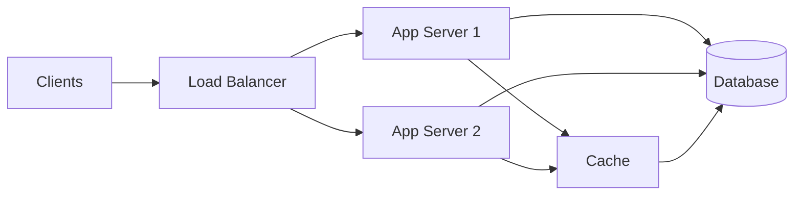
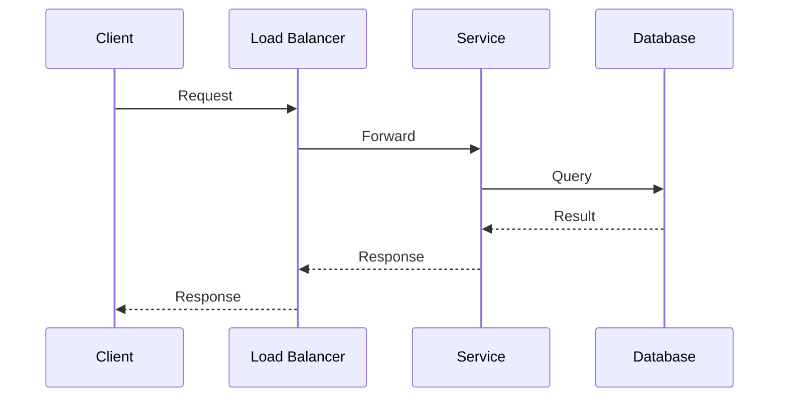
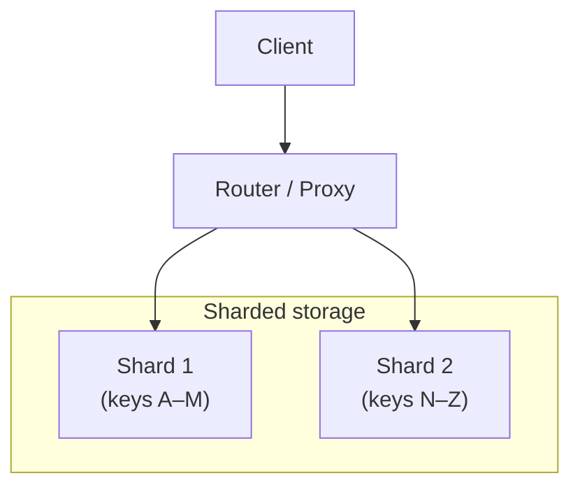
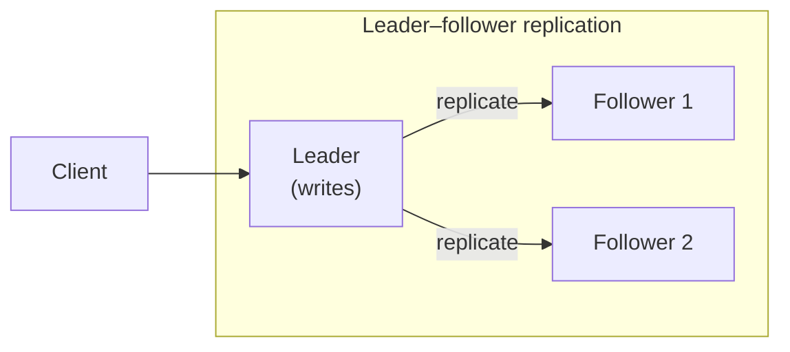
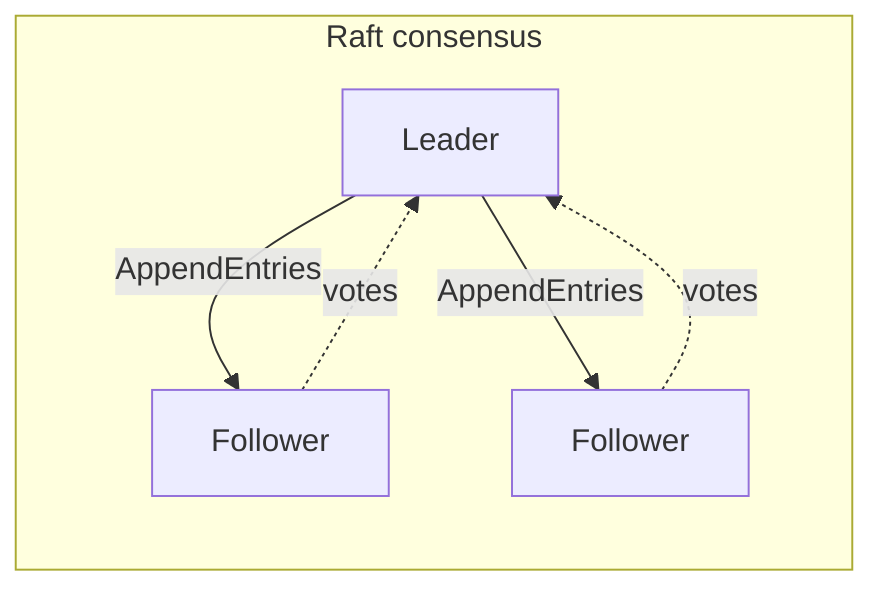
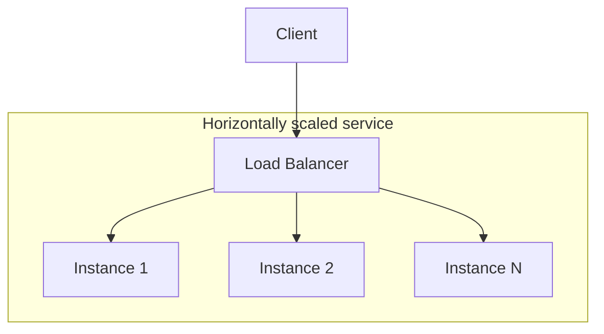
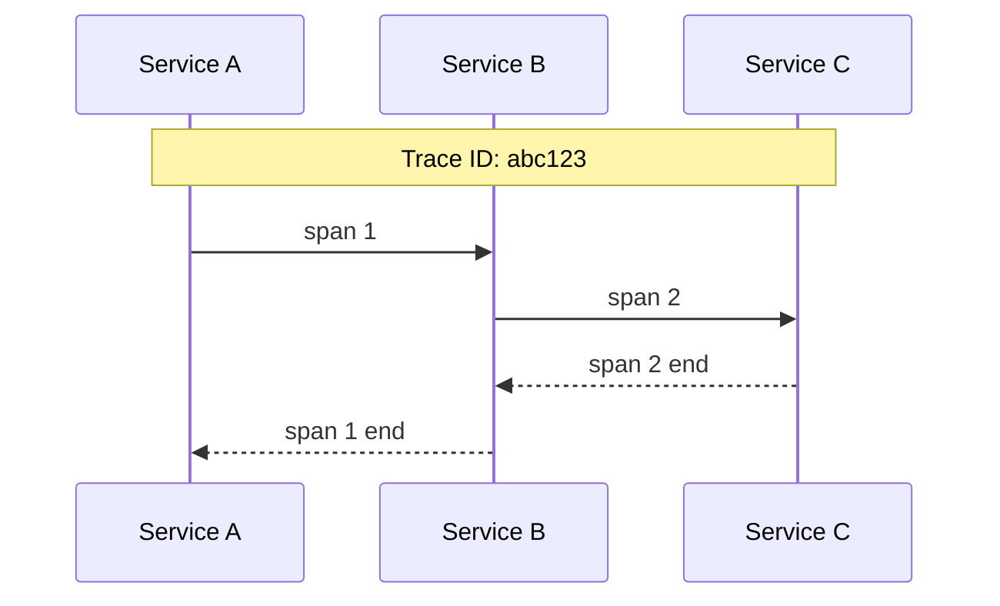
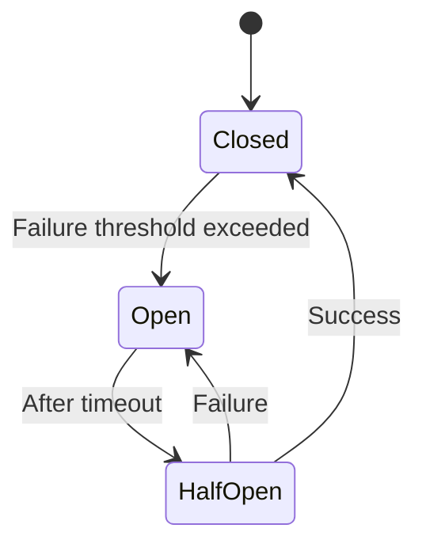
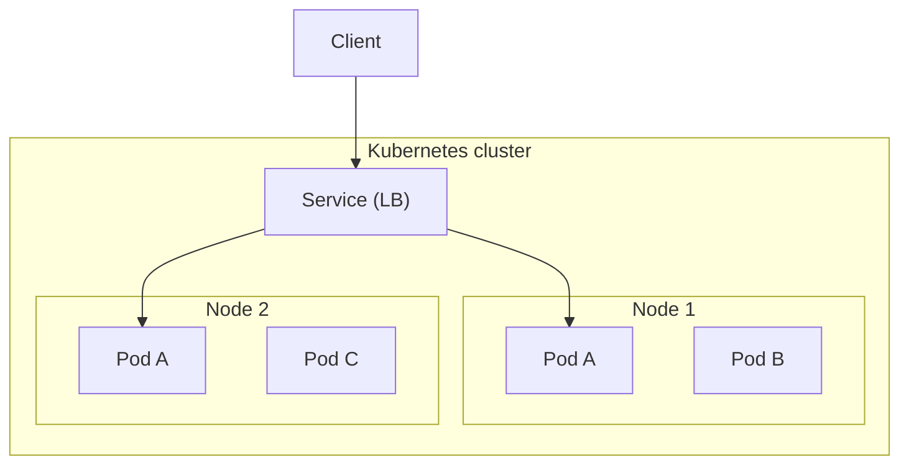

---
tags:
  - deep-dive
  - architecture
  - distributed-systems
  - systems-design
---

# Distributed Systems Architecture: Designing Reliable Systems Across Machines

**Themes:** Architecture · Distributed Systems · Infrastructure

*This deep dive is an architectural and technical introduction to distributed systems. For the limits of distribution—coordination cost, CAP, and the myth of infinite scale—see [Distributed Systems and the Myth of Infinite Scale](distributed-systems-myth-of-infinite-scale.md). For when distribution is justified and when it is not, see [Why Most Microservices Should Be Monoliths](why-most-microservices-should-be-monoliths.md) and [Appropriate Use of Microservices](appropriate-use-of-microservices.md).*

---

## 1. Introduction: Why Distributed Systems Exist

A single machine has hard limits: CPU capacity, memory, storage, and network bandwidth are bounded. A single point of failure is also a reliability limit—if that machine fails, the service is down. Distributed systems address these constraints by **spreading work and state across multiple machines** that cooperate to provide a single logical service or capability.

Reasons to distribute:

- **Capacity**: One machine cannot handle the compute, memory, or I/O required. Adding machines increases aggregate capacity.
- **Reliability**: Replicas and redundancy allow the system to tolerate the failure of one or more nodes.
- **Geography**: Placing nodes in multiple regions reduces latency for distant users and can improve availability during regional outages.
- **Organizational**: Separate teams may own separate services; distribution can align system boundaries with team boundaries (with attendant trade-offs).

The core idea is **multiple machines cooperating to provide a single logical service**. That cooperation introduces new problems: network latency, partial failure, consistency, and coordination. This document explains how distributed systems are structured, how they communicate, how they store and replicate data, and how they handle failure—so that the trade-offs are explicit and the architecture is understandable.

---

## 2. Core Challenges of Distributed Systems

Distributed computing is fundamentally harder than single-machine computing because of:

- **Network latency**: Messages take time. Round-trip times range from sub-millisecond (same datacenter) to hundreds of milliseconds (cross-continent). You cannot assume instant communication.
- **Partial failure**: One node or link can fail while others continue. There is no global "crash"—only a subset of the system may be unavailable. Detection and recovery must account for this.
- **Clock synchronization**: Clocks on different machines drift. You cannot rely on "wall clock" for ordering events across nodes without careful synchronization (e.g. NTP, or logical clocks). Many systems avoid depending on synchronized time for correctness.
- **Data consistency**: When data is replicated or partitioned, reads and writes may see different views. Deciding what "consistent" means and enforcing it is a central design choice.
- **Coordination**: Agreeing on leader election, membership, or the order of operations across nodes requires protocols (e.g. consensus) that add latency and complexity.

These challenges are inherent. They are not solved by better hardware; they are managed by architectural choices and protocols. The rest of this document describes those choices.

---

## 3. Basic Distributed System Architecture

A typical distributed service is composed of:

- **Clients**: Issuers of requests (users, other services, or front-end applications).
- **Load balancers**: Distribute incoming requests across multiple **service nodes** so that no single node is overloaded and failures can be routed around.
- **Service nodes (app servers)**: Execute business logic, call downstream services or data stores, and return responses.
- **Databases**: Persistent storage; may be single-node or distributed (replicated, sharded).
- **Caches**: Reduce load on databases and latency for read-heavy workloads (e.g. in-memory caches, Redis).
- **Message queues**: Decouple producers and consumers; buffer work and enable asynchronous processing.

Requests flow: client → load balancer → service node → (cache, database, or other services) → response back along the path. Each hop adds latency and a potential point of failure.

---

## 4. Communication Models

How nodes talk to each other shapes latency, coupling, and failure modes.

**Synchronous request–response (RPC, REST, gRPC):** The caller sends a request and blocks until a response (or timeout). Simple to reason about, but the caller is tied to the callee’s availability and latency. Failures and slow responses must be handled with timeouts and retries.

**Asynchronous messaging:** The sender posts a message to a queue or broker; the receiver processes it later. Decouples availability (sender and receiver need not be up at the same time) and can improve throughput. Trade-off: no immediate response; you need another channel or callback for results.

**Event-driven systems:** Components react to events (e.g. "order placed," "payment received"). Event producers do not know consumers; a message bus or log (e.g. Kafka) mediates. Good for loose coupling and replay, but ordering and exactly-once semantics are harder.

**Streaming:** Continuous flows of data (e.g. logs, metrics, event streams). Consumers process incrementally. Used for real-time analytics, pipelines, and event sourcing.

Technologies map to these models: **REST** and **gRPC** for synchronous RPC; **Kafka**, **RabbitMQ**, **SQS** for messaging and events; **gRPC streaming**, **Kafka** for streaming. Choice depends on latency requirements, coupling tolerance, and operational complexity.

---

## 5. Data Storage in Distributed Systems

Storage can be **centralized** (one logical database, possibly with replicas for read scaling and failover), **replicated** (multiple copies for availability and read capacity), or **sharded** (data split across nodes by key range or hash to scale write capacity).

| Pattern | Scalability | Consistency | Complexity |
|---------|-------------|------------|------------|
| Single primary | Limited | Strong | Low |
| Primary + read replicas | Read scale | Eventually consistent reads | Medium |
| Sharding | Write scale | Per-shard; cross-shard harder | High |
| Multi-leader replication | Write scale, geo | Conflict handling, eventual | High |

Sharding partitions data so that each partition (shard) is stored on a subset of nodes. Requests are routed to the shard that owns the key. Scaling writes means adding shards and redistributing keys; rebalancing and cross-shard operations are complex.

---

## 6. Replication and Fault Tolerance

Replication provides **redundancy** (tolerance of node failure) and often **read scaling** (spread read load across replicas). How replicas are updated determines consistency and write path.

**Leader–follower (primary–replica):** One node is the **leader**; it accepts writes and replicates them to **followers** (synchronously or asynchronously). Reads can go to the leader (strong consistency) or to followers (possibly stale). On leader failure, a follower is promoted (failover). Simple and common (e.g. PostgreSQL, MySQL, Kafka).

**Multi-leader:** Multiple nodes accept writes (e.g. one per region). Writes are replicated asynchronously between leaders. Conflicts must be detected and resolved (last-write-wins, merge, or application logic). Higher write availability and lower latency for distant writers; conflict handling is hard.

**Quorum systems:** A write is acknowledged when a **quorum** of replicas (e.g. majority) has applied it. Reads consult a quorum so that they see at least one up-to-date replica. Tolerates minority failures; adds latency (multiple round-trips).

---

## 7. The CAP Theorem

The **CAP theorem** (Brewer; formalized by Gilbert and Lynch) states that in the presence of a **network partition**, a distributed system cannot simultaneously guarantee all three of:

- **Consistency**: Every read sees the most recent write (or an error).
- **Availability**: Every request receives a non-error response.
- **Partition tolerance**: The system continues to operate despite network partitions.

Because partitions occur in real networks, **partition tolerance** is effectively required. The choice is between **C** and **A** when a partition occurs: either preserve consistency (refuse or delay responses that might be wrong) or preserve availability (respond with possibly stale data). In normal operation, systems can offer both C and A; CAP applies when the partition happens.

Examples: A CP system may refuse writes or reads when it cannot reach a quorum (e.g. consistent distributed databases). An AP system may always respond, using best-effort replica data (e.g. Dynamo-style eventually consistent stores). Design must explicitly choose how to behave under partition. For a deeper treatment of CAP and coordination cost, see [Distributed Systems and the Myth of Infinite Scale](distributed-systems-myth-of-infinite-scale.md).

---

## 8. Consistency Models

**Strong consistency:** Every read sees the latest committed write. Implemented via single leader plus synchronous replication or quorum read/write. Simplest for application logic; higher latency and lower availability under failure.

**Eventual consistency:** Replicas converge to the same value when writes stop. No guarantee on when. Reduces coordination and improves availability; applications must handle stale reads and conflicts (e.g. version vectors, CRDTs).

**Causal consistency:** Writes that are causally related (e.g. reply after message) are seen in the same order by all nodes. Weaker than strong, stronger than eventual; useful for social feeds, comments, and collaborative apps.

Systems choose based on the cost of staleness versus the cost of coordination. Strong consistency is easier to reason about but limits scale and availability; eventual consistency pushes complexity into the application.

---

## 9. Distributed Consensus

When multiple nodes must **agree** on a value (e.g. the next leader, the order of operations, or replicated log entries), a **consensus algorithm** is used. It ensures that correct nodes (a majority or quorum) agree despite failures and message delays.

**Paxos:** Classic consensus protocol; nodes propose values and vote. Correct when a majority of nodes are correct and messages are eventually delivered. Conceptually elegant but complex to implement and explain.

**Raft:** Designed for understandability. Leader election plus log replication. One leader; followers replicate the leader’s log; when a majority has an entry, it is committed. Used in etcd, Consul, and many distributed databases. For a full treatment, see [Raft Consensus Explained](raft-consensus-explained.md).

Consensus enables **replicated state machines**: the same sequence of commands is applied on every node, so they stay in sync. Used for coordination (e.g. Kubernetes etcd), distributed locks, and consistent configuration.

---

## 10. Scaling Distributed Systems

**Horizontal scaling:** Add more nodes (instead of bigger machines). Requires **stateless** or **partitioned state** so that load can be spread. Techniques:

- **Load balancing:** Distribute requests across service instances (round-robin, least connections, or application-aware). Health checks remove failed nodes from the pool.
- **Partitioning (sharding):** Split data or work by key so that each partition is served by a subset of nodes. Enables scaling writes and storage.
- **Replication:** More replicas for reads (and for fault tolerance). Writes still go to leader or quorum.
- **Autoscaling:** Add or remove instances based on load (CPU, request rate, queue depth). Reduces cost when idle; must be tuned to avoid flapping and cold starts.

---

## 11. Observability and Monitoring

Distributed systems require **observability**: the ability to infer internal state from external outputs (logs, metrics, traces).

- **Logging:** Structured logs (e.g. JSON) with request IDs, trace IDs, and context. Centralized in a log store (e.g. Loki, Elasticsearch) so that requests can be followed across services.
- **Metrics:** Counters, gauges, histograms (latency, throughput, errors). Used for dashboards and alerting. Often stored in a time-series DB (e.g. Prometheus).
- **Distributed tracing:** A **trace** follows a request across service boundaries. Each service creates **spans** (start/end, parent/child). Trace IDs tie spans together so that you can see the full path and latency breakdown. Tools: Jaeger, Zipkin, OpenTelemetry.

Without tracing, debugging a slow or failed request across many services is guesswork. With it, you see which service or call was slow or failed. For the distinction between monitoring and observability, see [Observability vs Monitoring](observability-vs-monitoring.md).

---

## 12. Failure Handling

Failures are normal: nodes crash, networks partition, disks fill, and dependencies slow down or fail. Resilience patterns:

- **Timeouts:** Every outbound call has a timeout. Prevents indefinite blocking when a dependency hangs.
- **Retries:** Transient failures (e.g. network blip) can be retried with backoff (exponential or jittered) to avoid thundering herd. Only for idempotent or safely retriable operations.
- **Circuit breaker:** If a dependency fails repeatedly, "open" the circuit—stop sending requests for a period—so that the failing service can recover and the caller does not pile on. After a cooldown, try again (half-open); if success, close the circuit.
- **Bulkheads:** Isolate resources (e.g. thread pools, connections) per dependency so that one failing dependency does not exhaust all resources and starve others.
- **Graceful degradation:** When a dependency is unavailable, return cached data, a reduced feature set, or a clear error instead of cascading failure.

---

## 13. Microservices vs Monoliths

**Monolith:** One deployable unit; all logic in one process. Simple to deploy and debug; scales by replicating the whole unit. Bottlenecks and team boundaries are managed by modularity inside the monolith.

**Microservices:** Many small services; each deployed and scaled independently. Enables separate team ownership and technology diversity. Cost: operational complexity (many deployments, networks, failure modes), distributed debugging, and consistency and transaction boundaries across services.

Trade-offs:

| Aspect | Monolith | Microservices |
|--------|----------|---------------|
| Deployment | One artifact | Many services, coordination |
| Debugging | Single process, stack traces | Distributed tracing, many logs |
| Transactions | Local ACID | Cross-service saga or eventual |
| Team boundaries | Module boundaries | Service boundaries |

Microservices are appropriate when you have **clear domain boundaries**, **teams that own services**, and **operational maturity** to run many services. They are a poor default for small teams or early-stage products. See [Why Most Microservices Should Be Monoliths](why-most-microservices-should-be-monoliths.md) and [Appropriate Use of Microservices](appropriate-use-of-microservices.md) for when distribution is justified.

---

## 14. Modern Distributed Infrastructure

**Containers:** Package application and dependencies into an image; run consistently across environments. Enable density and portability.

**Orchestration (e.g. Kubernetes):** Schedule containers onto nodes, manage lifecycle (restart, scale), provide service discovery and load balancing, and handle rolling updates. The control plane (API server, scheduler, controllers) is itself a distributed system; data stores like etcd use consensus.

**Service mesh:** Sidecar proxies (e.g. Envoy) next to each service instance handle traffic: retries, timeouts, mTLS, and observability. Offloads cross-cutting concerns from application code. Adds latency and operational weight.

**Cloud infrastructure:** Managed databases, queues, and object storage reduce the operational burden of running distributed storage yourself, at the cost of vendor lock-in and less control.

---

## 15. Real-World Examples

Large-scale systems combine the patterns above:

- **Search engines:** Crawlers and indexers; sharded indices; replicated query servers behind load balancers; caching layers. Consistency is often eventual (index updates propagate); availability and low latency are paramount.
- **Streaming platforms:** Event log (e.g. Kafka) for ingestion; consumers process in parallel; state stores and caches for joins and windows. Scaling is horizontal (partitions and consumer groups).
- **Large-scale web applications:** Stateless API tiers behind load balancers; replicated or sharded databases; caches (CDN, in-memory); async workers for heavy or non-real-time work. Failures are isolated with circuit breakers and timeouts; observability is via tracing and metrics.

Common patterns: **redundancy** for availability, **partitioning** for scale, **replication** for read capacity and durability, **async** for decoupling, and **observability** for operation and debugging.

---

## 16. Conclusion

Distributed systems **trade simplicity for scalability and reliability**. Single-machine systems are easier to reason about and operate; distributing work and state across machines introduces network latency, partial failure, and consistency trade-offs that must be explicitly designed for.

Designing distributed systems requires balancing:

- **Consistency** (how fresh and coherent reads are) against **availability** (whether the system responds under failure) and **latency** (how long operations take).
- **Operational complexity** (more nodes, more failure modes, more coordination) against **capacity and resilience** (more nodes, more aggregate capacity, redundancy).
- **Coupling** (synchronous RPC vs async messaging) against **simplicity** (request–response is easier to debug than event flows).

There is no single "right" architecture. The right design depends on load, failure requirements, team size, and organizational constraints. This document has outlined the components, communication models, storage and replication patterns, consensus, scaling, observability, and failure handling that form the vocabulary of distributed systems architecture—so that those trade-offs can be chosen deliberately.

!!! tip "See also"
    - [Distributed Systems and the Myth of Infinite Scale](distributed-systems-myth-of-infinite-scale.md) — CAP, coordination cost, and the limits of distribution
    - [Why Most Microservices Should Be Monoliths](why-most-microservices-should-be-monoliths.md) — When distribution is premature
    - [Appropriate Use of Microservices](appropriate-use-of-microservices.md) — When microservices are justified
    - [Observability vs Monitoring](observability-vs-monitoring.md) — How to observe distributed systems
