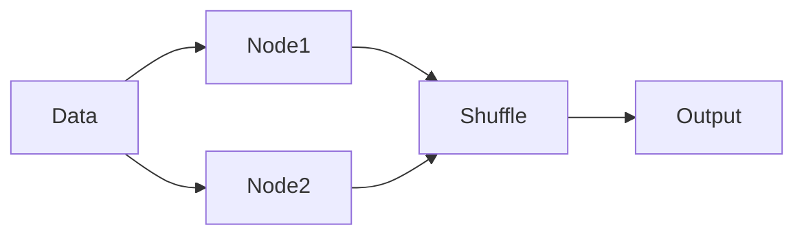

---
tags:
  - deep-dive
  - data-engineering
  - economics
  - distributed-systems
---

# The Economics of Distributed Data Processing

*Why Scale Is Often the Most Expensive Optimization*

**Themes:** Data Architecture · Economics · Systems Design

---

## Opening Thesis

Distributed systems promise scalability, but they impose significant economic costs that are often ignored in early architectural decisions. The decision to distribute computation across many machines is not merely technical—it is a commitment to ongoing expenditure on coordination, failure handling, and operational complexity. When organizations adopt Spark or similar engines without a clear economic model, they discover that "scale" is expensive: underutilized clusters, data movement costs that exceed compute costs, and engineering time consumed by tuning and debugging rather than by delivering value. This essay examines the cost structure of distributed data processing, when distribution is justified, and when it is wasteful.

---

## The Cost Model of Data Processing

Every data processing system incurs costs across five categories. Distributed systems multiply each.

**Compute**: CPU time on worker nodes. In a cluster, you pay for every node, whether it is busy or idle. Single-node engines use one machine; Spark uses many. Idle capacity in a distributed cluster is multiplied across nodes.

**Memory**: RAM for execution, caching, and shuffle buffers. Distributed systems replicate memory needs (each executor has its own heap) and add serialization/deserialization costs when data moves between nodes. Memory is often the binding constraint; undersized executors cause spilling and OOMs; oversized executors waste money and can increase GC cost.

**Network**: Data movement between nodes. Shuffle, replication, and broadcast consume bandwidth. In cloud environments, cross-AZ or cross-region traffic can be a major line item. The more distributed the job, the more network cost.

**Storage**: Persistent storage for inputs, outputs, and intermediate data. Object storage (S3, GCS) is cheap per GB but can accumulate cost at scale. Local or ephemeral storage for shuffle is often the bottleneck rather than the cost driver, but storage I/O limits throughput.

**Observability**: Logging, metrics, tracing, and dashboards. Distributed systems require more instrumentation to be debuggable. The cost of running Prometheus, Grafana, or a managed observability platform scales with the number of nodes and jobs. Teams that skip observability pay later in incident response and blind tuning.

Distributed systems do not eliminate these costs; they shift and amplify them. The goal of architecture is to incur distribution cost only when the workload justifies it.

---

## Horizontal Scaling vs Vertical Scaling

| Strategy | Benefits | Risks |
|----------|----------|--------|
| **Vertical scaling** | Single machine; no coordination overhead; simpler operations; lower latency for in-memory workloads | Hardware limits (max RAM, cores); single point of failure; may not fit data size |
| **Horizontal scaling** | Can grow beyond one node; fault tolerance across nodes; elasticity in cloud | Coordination cost; network and shuffle cost; operational complexity; underutilization if workload is bursty |

Vertical scaling is often cheaper and simpler until the data or compute truly exceeds one machine. Horizontal scaling is necessary when the workload cannot fit or complete in a reasonable time on a single node. The break-even point has moved: modern single-node engines (DuckDB, Polars) and larger instances (hundreds of GB RAM, many cores) push the break-even to higher data volumes than a decade ago.

---

## Data Movement as the Hidden Cost

The most underestimated cost in distributed processing is **data movement**. Data does not move for free.

**Shuffle**: In Spark, shuffle is the all-to-all transfer of data between stages. Each byte is serialized, sent over the network, and deserialized. For wide transformations (joins, group-bys), shuffle volume can be multiples of the input size. Shuffle dominates runtime and cost in many production jobs.

**Replication**: Distributed storage (HDFS, object storage with replication) and fault-tolerant execution (Spark's recomputation of lost partitions) imply that data is copied or recomputed. Replication protects against failure but doubles or triples storage and sometimes compute.

**Serialization overhead**: Moving data between JVMs or between nodes requires serialization and deserialization. The CPU cost and the temporary memory allocation can be significant. Columnar formats (Parquet, Arrow) reduce this cost but do not eliminate it.

Data is partitioned across nodes; after a wide transformation, shuffle aggregates results before producing output. The shuffle phase is where latency and cost concentrate. Minimizing shuffle—through better partitioning, broadcast when one side is small, or avoiding unnecessary wide operations—is often the highest-leverage optimization.

---

## The Economics of Cluster Utilization

Distributed clusters are frequently **underutilized**. Reasons include:

**Idle compute**: Jobs are scheduled intermittently; between jobs, nodes may sit idle. Autoscaling reduces waste but adds complexity and cold-start cost. Many organizations over-provision "to be safe," paying for capacity that is rarely used.

**Over-provisioning**: Clusters sized for peak load run at low utilization during normal operation. The economic alternative—right-sizing for typical load and accepting slower runs at peak—is often not modeled explicitly.

**Scheduling inefficiency**: Shared clusters run many jobs with different resource needs. Small jobs and large jobs compete for the same pool; queueing and fragmentation can leave a significant fraction of the cluster underused at any moment.

The result is that the **marginal cost of one more job** in a distributed cluster is often high: you are paying for the whole cluster, not just the resources the job consumes. In contrast, a single-node engine or a serverless/warehouse model can align cost more closely with actual usage.

---

## When Distributed Systems Are Justified

Distribution is justified when one or more of the following hold:

- **Multi-terabyte ETL**: The dataset or the transformation output does not fit in memory or on a single node's disk in a reasonable time. Spark (or similar) is the right tool for scheduled batch jobs over very large data.
- **Large-scale ML**: Training or feature computation over large datasets often requires distributed compute. Spark's MLlib and integration with ML platforms are used for this reason.
- **Geospatial raster processing**: Processing global or continental rasters, or large vector datasets with spatial joins, can exceed single-node capacity. Distributed engines with spatial support (Spark with GeoSpark, or custom pipelines) are used when data size demands it.

In these cases, the economic comparison is not "Spark vs nothing" but "Spark vs other distributed options" or "Spark vs failing to meet the SLA." The cost of distribution is accepted because the workload cannot be done otherwise.

---

## When Distributed Systems Are Wasteful

Distribution is wasteful when:

- **Local analytics suffice**: The dataset fits in memory or on fast local storage. DuckDB, Polars, or even Pandas can complete the job faster and cheaper than a Spark cluster. The cluster's coordination and startup cost dominate.
- **Medium datasets**: Data in the tens to low hundreds of GB often fits on a single large instance. Pushing such workloads to Spark adds operational cost without clear benefit.
- **Exploratory analysis**: Ad-hoc queries and exploration benefit from low latency and simplicity. A local engine or a SQL warehouse is usually more cost-effective than spinning up a cluster.

**Alternatives**: DuckDB (in-process analytical SQL on Parquet/CSV), Polars (vectorized DataFrames in Rust), and cloud SQL warehouses (Snowflake, BigQuery, Redshift) handle a large fraction of analytical workloads without distribution. Use them when the workload fits; reserve Spark for the subset of work that genuinely requires distributed execution.

---

## Decision Framework

**Cost-aware architecture** means choosing the smallest system that meets the workload's data size, latency, and reliability requirements.

- **Data fits on one machine, latency is not sub-second critical**: Prefer DuckDB, Polars, or a warehouse. Avoid Spark unless you are already committed to a Spark-based platform.
- **Data is multi-TB, batch ETL, scheduled**: Spark (or similar) is appropriate. Invest in partitioning, shuffle reduction, and observability so that cost per job is predictable and minimized.
- **Mixed workload**: Use a hybrid. Spark for large batch; DuckDB or Polars for ad-hoc and medium-sized analytics over the same Parquet or lakehouse tables. The data lives once; the engine choice varies by query.

**Do not distribute by default.** Distribute when evidence—data size, measured runtimes, or SLA requirements—justifies the cost. Otherwise, prefer simpler, cheaper tools.

!!! tip "See also"
    - [The Economics of Observability](the-economics-of-observability.md) — Cost of observing distributed systems
    - [When to Use Spark (and When Not To)](../best-practices/data-processing/spark/when-to-use-spark.md) — When Spark is justified
    - [Spark in Modern Data Architectures](../best-practices/data-processing/spark/spark-modern-architecture.md) — Where Spark fits in the stack
    - [DuckDB vs PostgreSQL vs Spark](duckdb-vs-postgres-vs-spark.md) — Execution models and economics
    - [Reproducible Data Pipelines](../best-practices/data/reproducible-data-pipelines.md) — Pipeline discipline and cost
