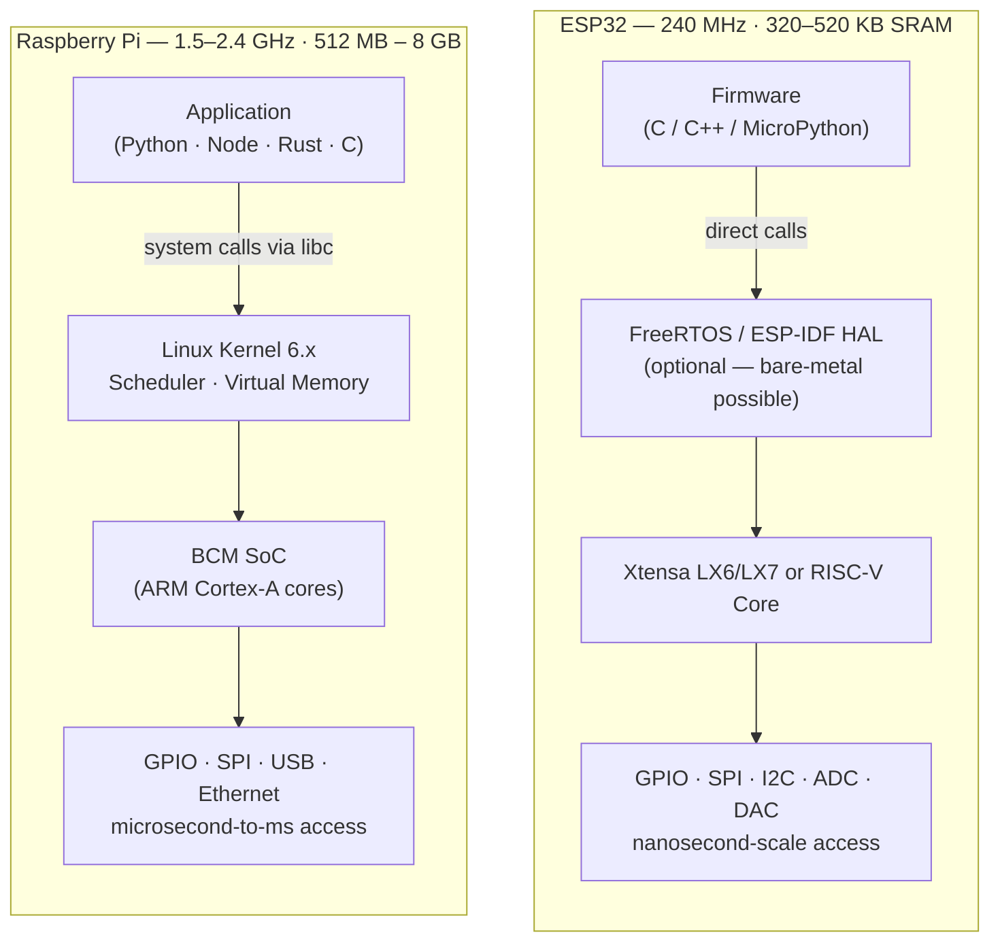

---
tags:
  - deep-dive
  - embedded
  - iot
---

# ESP32 vs Raspberry Pi: Microcontroller Discipline vs Linux Convenience

**Themes:** Embedded · Hardware · Economics

---

## Opening Thesis

The comparison between the ESP32 and the Raspberry Pi is frequently framed as a question of capability: one is more powerful, one is cheaper, one has better connectivity. This framing, while not wrong, misses the architecturally important distinction. The question is not which device is more capable in the abstract. It is which abstraction model is appropriate for the deployment context.

The ESP32 is a microcontroller. Its defining characteristic is determinism: a program running on bare metal or a real-time operating system executes with predictable timing, predictable memory layout, and predictable hardware access. The Raspberry Pi is a single-board computer. Its defining characteristic is convenience: a full Linux environment provides familiar tooling, a package manager, networking stacks, and a runtime environment for high-level languages. Convenience and determinism are in tension. Understanding this tension is the analytical core of the platform decision.

---

## Architectural Differences

The physical architecture of each platform reflects its design intent.

The critical difference is the presence of the Linux kernel and its scheduler between the application and the hardware. The Linux scheduler manages CPU time across all running processes. A process running on the Pi may be preempted at any moment by the kernel to service an interrupt, manage memory, perform I/O for another process, or execute kernel maintenance tasks. This preemption is invisible to the application and introduces timing jitter that is bounded statistically but not bounded absolutely.

On the ESP32, the application (or its RTOS tasks) runs with direct access to the hardware. GPIO transitions happen in nanoseconds. Timer interrupts fire within microseconds of their scheduled time. The timing envelope is deterministic within the constraints of the application's own logic.

---

## Determinism vs Throughput

Real-time constraints in embedded systems come in two varieties: hard real-time (a deadline missed is a system failure) and soft real-time (a deadline missed degrades performance but does not cause failure). The distinction determines platform suitability more than any performance benchmark.

Hard real-time requirements — controlling a motor that requires commutation pulses within a 50-microsecond window, reading an ADC at precisely 1 kHz to avoid aliasing, generating a PWM signal with nanosecond-scale duty cycle precision — are incompatible with the Linux scheduler. Even a real-time Linux kernel (PREEMPT_RT) reduces scheduling jitter substantially but does not eliminate it. GPIO transitions on a Raspberry Pi, measured with an oscilloscope, show jitter of tens to hundreds of microseconds under normal system load.

The ESP32's hardware peripherals provide an additional layer of timing discipline: the RMT (Remote Control) peripheral generates precise signal sequences in hardware without CPU involvement; the I2S peripheral clocks data at exact sample rates; the hardware timer triggers interrupts with microsecond precision. These peripherals offload timing-critical operations from the CPU entirely, enabling precise signal generation even under software load.

The Raspberry Pi's throughput advantage is real and substantial for computation-heavy workloads. A compute task that requires floating-point operations, memory bandwidth, or I/O throughput will execute orders of magnitude faster on the Pi's Cortex-A cores with GB-scale RAM than on the ESP32's Xtensa core with 500 KB of SRAM. The question is whether the workload actually requires this throughput, and whether it can tolerate the non-determinism that comes with it.

---

## Power Profiles

Power consumption is the deciding factor for many deployment contexts, particularly battery-operated remote sensors, solar-powered monitoring stations, and energy-harvesting applications.

| State | ESP32 | Raspberry Pi Zero 2W | Raspberry Pi 4 (2 GB) |
|---|---|---|---|
| Active (full load) | 200–300 mA @ 3.3V | 350–400 mA @ 5V | 600–900 mA @ 5V |
| Idle (WiFi on) | 60–100 mA @ 3.3V | 100–150 mA @ 5V | 350–400 mA @ 5V |
| Light sleep (WiFi maintained) | 2–5 mA @ 3.3V | N/A (no equivalent) | N/A (no equivalent) |
| Deep sleep | 10–150 µA @ 3.3V | ~70 mA (no true sleep) | ~200 mA (no true sleep) |

The deep sleep comparison is the most consequential. The ESP32 in deep sleep draws between 10 and 150 microamperes, depending on configuration. A 2000 mAh LiPo cell at 10 µA average consumption (waking for 1 second every 15 minutes) has a theoretical lifespan exceeding 20 years. At realistic power budgets accounting for wake cycles, WiFi association, and sensor reads, multi-year battery operation is achievable.

The Raspberry Pi has no equivalent sleep state. The Linux kernel does not support the deep sleep modes available to microcontrollers; its power management stack manages CPU frequency scaling and peripheral power domains, but the system continues drawing hundreds of milliamperes at minimum even at idle. Battery-powered Pi deployments typically last hours to a few days on practical battery capacities. This is not a failure of design — the Pi was designed for different use cases — but it is an absolute disqualifier for applications where long-term battery operation is required.

---

## Security Surface

The security threat model of the two platforms differs in ways that are not obvious from the feature comparison.

### ESP32 Security Surface

The ESP32's attack surface is bounded by its firmware. A correctly configured ESP32 exposes only the network services it was programmed to expose: typically an MQTT client connection or an HTTP client making outbound requests. There is no SSH daemon, no shell, no package manager, no general-purpose network service. Compromising an ESP32 requires either:

- Exploiting a vulnerability in the specific application firmware
- Physical access to the device (JTAG debugging, flash extraction)
- Compromising the OTA update mechanism to deliver malicious firmware

The ESP32 provides hardware-level security features: secure boot (cryptographic verification of the bootloader and application), flash encryption (AES-128/256 encryption of flash contents), and eFuse-based key storage for device credentials. When these features are configured correctly, physical access does not provide a path to credential extraction or code injection.

The OTA update mechanism is both the primary software update path and the primary software attack surface. An OTA delivery mechanism without transport security (TLS verification of the update server certificate), image integrity verification (cryptographic signature of the firmware image), and rollback protection (the device reverts to a known-good firmware if the new firmware fails to boot) is a significant attack vector.

### Raspberry Pi Security Surface

The Raspberry Pi running a full Linux distribution exposes the full attack surface of a Linux server: any service that is listening on a network socket is potentially exploitable. A default Raspbian/Raspberry Pi OS installation includes SSH enabled by default (in some versions), a web-based configuration interface (raspi-config accessible remotely in some configurations), and an apt package manager that pulls updates from the internet.

The Linux package manager is both a strength (security patches can be applied across the entire software stack with `apt upgrade`) and an exposure (the attack surface includes every installed package, and package supply chain attacks affect the Pi as they affect any Linux system). The Pi's broad software ecosystem means that a deployed Pi system likely runs software from many sources, each with its own vulnerability history.

Operating system updates on the Pi are a manual or scheduled process. Automated unattended upgrades can be configured, but they carry the risk of breaking application software when system libraries are updated. This creates an operational tension between security (apply all patches promptly) and stability (some patches may be destabilizing) that does not have a clean resolution.

---

## Development Velocity

### Toolchains and Debugging

Python development on the Raspberry Pi benefits from the full Python ecosystem, standard development tools (gdb, valgrind, strace), remote development via SSH, and the ability to run a development environment directly on the device or to cross-develop from a workstation using standard Python tooling.

Firmware development for the ESP32, even with modern frameworks (ESP-IDF, Arduino, PlatformIO), requires a cross-compilation toolchain, a flash programmer (USB-to-serial or JTAG), and familiarity with embedded debugging concepts. The JTAG debugging interface (OpenOCD + GDB) provides full debugging capability but requires hardware setup. UART logging provides printf-style debugging but requires a serial connection.

MicroPython and CircuitPython enable Python-native development on the ESP32, reducing the toolchain complexity significantly for simple applications. The trade-off is reduced access to hardware peripherals and reduced performance compared to compiled C or Rust firmware.

### Remote Updates

Deploying an update to a Raspberry Pi in the field is operationally similar to updating a remote Linux server: SSH access, git pull, service restart, or a configuration management tool. This is familiar to most software developers.

Updating an ESP32 firmware in the field requires OTA (over-the-air update) capability to be built into the firmware. ESP-IDF provides an OTA API, and Mongoose OS provides a more integrated OTA management platform, but OTA must be explicitly designed and tested. The failure mode of a failed OTA update is a device that may be stuck in an unbootable state at a remote location — a more severe consequence than a failed `apt upgrade` on a Pi with SSH access.

---

## Ecosystem Maturity

The ESP32's ecosystem, while large for a microcontroller platform, reflects the constraints of embedded development: libraries are written in C or C++, documentation is dense, and the community skews toward hardware engineers rather than software developers. The Arduino ecosystem provides a higher-level abstraction layer with extensive community libraries, but at the cost of performance and memory efficiency. The ESP-IDF ecosystem provides full-featured access to the ESP32's peripherals but requires comfort with C and embedded patterns.

The Raspberry Pi's ecosystem is effectively the Linux ecosystem: Python, Node.js, Go, Rust, Docker, Kubernetes (at small scale), and every library available for any of these environments. The entry barrier for software developers with no embedded background is substantially lower.

This ecosystem difference shapes team capability requirements. An embedded firmware developer is more productive on the ESP32. A software developer or data scientist is more productive on the Pi. For organizations without embedded expertise, the Pi's familiarity often outweighs its power and determinism disadvantages for applications where those disadvantages are not disqualifying.

---

## Decision Framework

| Application | ESP32 | Raspberry Pi | Notes |
|---|---|---|---|
| Battery-powered sensor node | Clear choice | Not viable | Deep sleep current is definitive |
| Precision timing (PWM, ADC at exact rate) | Clear choice | Not viable without PREEMPT_RT | Linux scheduler jitter |
| Long-lived remote deployment | Preferred | Viable with management tooling | SD card wear is Pi concern |
| Edge ML inference | Marginal | Preferred | RAM and compute constraints |
| Home automation controller | Both viable | Preferred | Ecosystem and update simplicity |
| Industrial sensor with hard RT | Clear choice | Not suitable | Determinism requirement |
| Network-connected data collection | Both viable | Preferred for complex logic | Depends on power constraints |
| Protocol gateway (LoRa → MQTT → cloud) | Both viable | Preferred | More RAM for buffering |

The decision reduces to three questions:

**Does the application have hard real-time requirements?** If yes, the Raspberry Pi is not a suitable choice. Soft real-time requirements may be met by the Pi with careful system configuration and PREEMPT_RT, but this adds operational complexity.

**Does the application require multi-year battery operation?** If yes, the Raspberry Pi is not a suitable choice for the battery-constrained node itself, though it may be suitable as an always-on hub that manages battery-powered ESP32 sensors.

**Does the application require complex computation, significant memory, or an extensive software ecosystem?** If yes, and if power and timing constraints are compatible, the Raspberry Pi provides a more productive development environment and a richer capability set.

The most architecturally coherent designs for complex IoT systems frequently use both: ESP32 nodes at the edge for sensing, timing, and power-constrained operation; Raspberry Pi (or cloud infrastructure) as the hub for data aggregation, protocol translation, local ML inference, and management. The platforms are more often complementary than competing.

!!! tip "See also"
    - [MQTT vs HTTP in IoT Systems](mqtt-vs-http-iot.md) — protocol selection for the edge-to-hub communication layer
    - [ESP32 Best Practices](../best-practices/esp32/index.md) — programming architecture, power management, and security for ESP32 deployments
    - [LoRaWAN vs Raw LoRa](lorawan-vs-raw-lora.md) — radio protocol selection for low-power wide-area deployments
