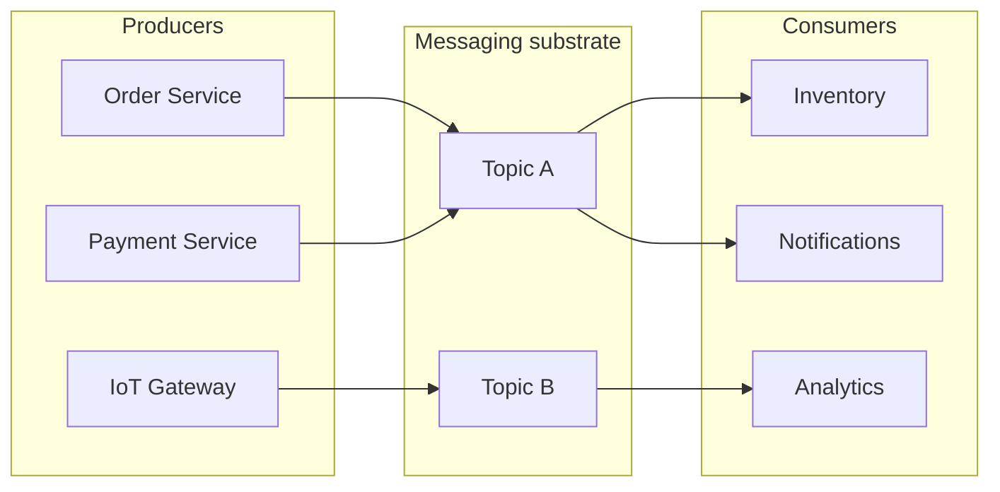
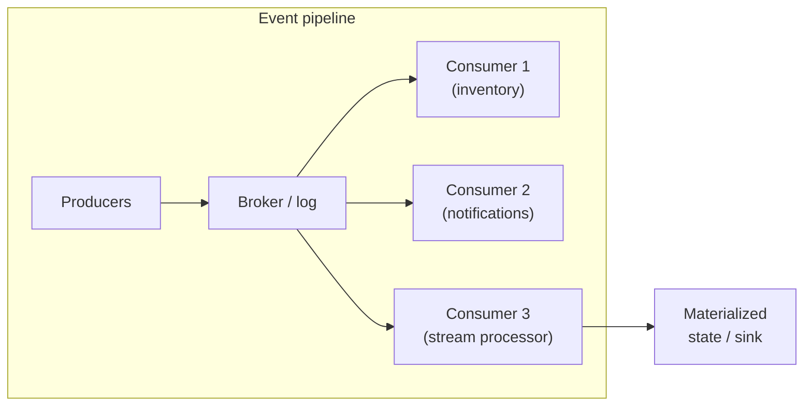
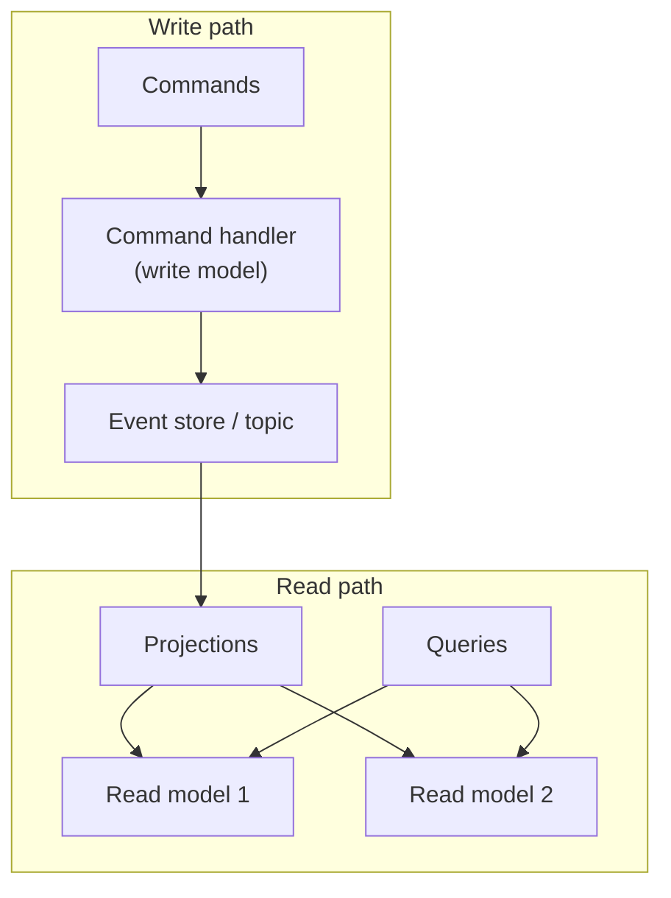
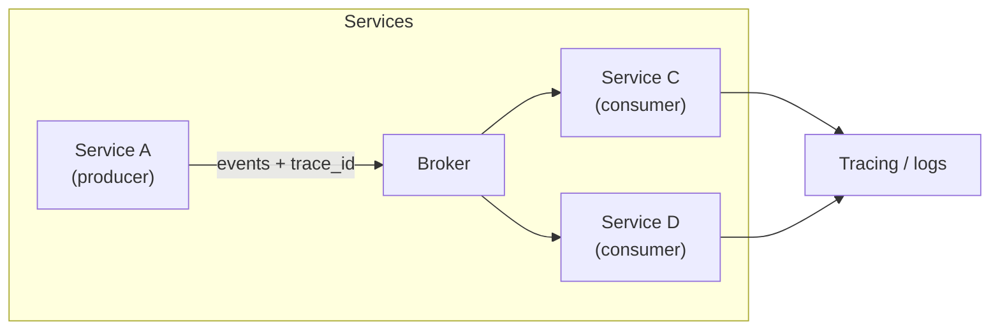

---
tags:
  - deep-dive
  - distributed-systems
  - architecture
  - event-driven
  - streaming
---

# Event-Driven Architecture: Designing Systems That React to Change

**Themes:** Distributed Systems · Messaging · Stream Processing · Architecture

*Event-driven systems communicate by producing and consuming immutable events instead of synchronous request-response calls. This document explains how such systems are designed, how message brokers and event logs fit in, and what trade-offs they introduce. For broader distributed-systems context, see [Distributed Systems Architecture](distributed-systems-architecture.md). For the cost of real-time and streaming infrastructure, see [The Hidden Cost of Real-Time Systems](the-hidden-cost-of-real-time-systems.md).*

---

## 1. Introduction: The Limits of Request-Response Systems

In a **request-response** model, a client sends a request and blocks (or waits asynchronously) for a response. The caller is **coupled** to the callee in time: the callee must be available, and the caller’s workflow depends on the response. That model works well when the operation is short, the dependency is necessary, and failure can be surfaced immediately to the user. It breaks down when:

- **Availability coupling:** If the downstream service is down or slow, the caller fails or stalls. Cascading timeouts and thread-pool exhaustion are common.
- **Temporal coupling:** The caller and callee must be up at the same time. Offline processing, retries with backoff, and “fire-and-forget” workflows are awkward to express.
- **Scalability coupling:** Throughput is bounded by the slowest synchronous hop. Adding more callers does not help if the bottleneck is a single database or service.
- **Domain coupling:** The caller often needs to know “who” to call and “what” to ask for. Adding a new consumer of the same fact (e.g. “order placed”) usually means changing the producer to call another endpoint or another system.

**Event-driven architecture** inverts the relationship: producers **emit events** (facts that something happened) and do not wait for consumers. Consumers **subscribe** to streams or topics and react when events arrive. Producers and consumers are **decoupled** in time and in identity—new consumers can be added without changing producers. The trade-off is complexity: you introduce messaging infrastructure, ordering and delivery semantics, and operational concerns (backpressure, replay, dead-letter handling). This document explains how event-driven systems are built, how brokers and streams work, and how to reason about their safety and scalability.

---

## 2. What Is an Event?

An **event** is an **immutable record** that something happened at a point in time. It is a fact, not a command or a request. Typical properties:

- **Identity:** An event ID (often unique per event or per aggregate).
- **Type or name:** e.g. `OrderPlaced`, `PaymentCaptured`, `SensorReading`.
- **Timestamp:** When it occurred (or when it was produced).
- **Payload:** The relevant data (order ID, amount, sensor value, etc.).
- **Metadata:** Source, correlation ID, schema version—used for tracing and evolution.

Events are **immutable**: they are never edited or deleted in the logical model. Corrections are expressed as new events (e.g. `OrderCancelled`). This makes event streams **auditable** and **replayable**: you can rebuild state or derive new views by replaying the log. The distinction between “something that happened” (event) and “something to do” (command) is central: commands are intent; events are recorded history.

---

## 3. Event Producers and Consumers

In an event-driven system, **producers** create events and send them to a **messaging substrate** (broker or log). **Consumers** read from that substrate and process events. There may be many producers and many consumers; they do not address each other directly. The substrate is responsible for durability, routing, and delivery.

- **Producer:** Publishes events to a **topic** or **stream** (a named channel). It does not know which consumers will read the events.
- **Consumer:** Subscribes to one or more topics and receives events. It may process them once, or multiple consumers may process the same event for different purposes (e.g. one updates inventory, another sends a notification).
- **Broker / log:** Accepts events from producers, stores them (durably or in-memory), and delivers them to consumers according to the system’s semantics (e.g. at-most-once, at-least-once, exactly-once).

Producers and consumers scale independently. Adding a new consumer (e.g. a new analytics pipeline) does not require changes to producers—only a new subscription to the relevant topic or stream.

---

## 4. Message Brokers

A **message broker** (or **event broker**) is the infrastructure that sits between producers and consumers. It receives events, stores or forwards them, and delivers them according to the chosen model. Different systems optimize for different trade-offs: throughput, latency, persistence, routing flexibility, and operational complexity.

**Apache Kafka** treats data as an **append-only log** per topic partition. Events are persisted to disk and retained for a configurable period. Consumers read by **offset** (position in the log); they can replay from any offset. Kafka excels at high-throughput, durable event streaming and log aggregation. Key concepts: topics, partitions, consumer groups, offsets. Best when you need durability, replay, and multiple consumers reading the same stream at different paces.

**RabbitMQ** is a **traditional message broker** built around queues and exchanges. Producers publish to exchanges; exchanges route to queues by rules (direct, topic, fanout). Consumers consume from queues; messages are typically removed when acknowledged. RabbitMQ offers flexible routing, priority queues, and dead-letter queues. Best when you need task queues, request-reply patterns, or complex routing rather than a single shared log.

**NATS** emphasizes **simplicity and low latency**. It supports fire-and-forget pub/sub, request-reply, and (with JetStream) persistent streams with optional replay. NATS is lightweight and suits service-to-service messaging and edge/IoT scenarios where a heavy log like Kafka is unnecessary.

| System   | Model           | Persistence        | Replay        | Typical use                    |
|----------|------------------|--------------------|---------------|--------------------------------|
| Kafka    | Log per partition| Durable, disk      | Yes, by offset| Event streaming, log aggregation |
| RabbitMQ | Queues + exchanges | Optional, configurable | No (by default) | Task queues, routing, RPC-like |
| NATS     | Pub/sub; JetStream for streams | Optional in JetStream | Yes in JetStream | Lightweight messaging, edge, IoT |

Choosing a broker depends on whether you need a **durable, replayable log** (Kafka, JetStream) or **ephemeral or queue-based delivery** (RabbitMQ, core NATS), and on your operational and scaling requirements.

---

## 5. Event Streams

An **event stream** (or **event log**) is a **totally ordered** (or partition-ordered) sequence of events. Streams are usually **append-only**: new events are added at the end; existing events are not modified. This gives:

- **Replay:** Consumers can re-read from an earlier position to reprocess or rebuild state.
- **Audit:** The stream is a history of what happened.
- **Multiple consumers:** Different consumers can read at different speeds or from different positions.

In **Kafka**, a topic is split into **partitions**; order is preserved only within a partition. Producers can assign a key so that related events go to the same partition. In **Kafka Streams** or **Flink**, streams are the primary abstraction: you process infinite sequences of events with operators (map, filter, join, window, aggregate).

Stream **processing** runs continuous computations over streams: filtering, enrichment, aggregation (e.g. windows), and joining streams. Results may be written to a database, another topic, or a dashboard. The pipeline diagram above shows a single logical stream (or topic) fanned out to multiple consumers, with one consumer feeding a stateful processor and sink.

---

## 6. Event Sourcing

**Event sourcing** is a persistence pattern: the **source of truth** is the **sequence of events**, not a current snapshot. The application state is **derived** by replaying events in order. When something happens, you append an event; to get current state, you reduce over the event history (e.g. start from empty, apply each event).

Benefits:

- **Full history:** Every change is recorded. You can reconstruct state at any point in time or build new projections later.
- **Auditability:** No separate audit log; the event log is the audit.
- **Debugging:** Reproduce bugs by replaying the same event sequence.

Challenges:

- **Replay cost:** Rebuilding state from a long history can be slow. **Snapshots** are used: persist a state snapshot at index N, then replay only events after N.
- **Schema evolution:** Events are immutable but the code that interprets them changes. You need versioning and compatibility (e.g. schema registry, upcasters).
- **Storage growth:** The log grows forever unless you compact or archive (e.g. Kafka log compaction for keyed topics, or retention limits).

Event sourcing is often combined with **CQRS** (see below): the write side appends events; the read side is one or more projections built from the same event stream.

---

## 7. CQRS Pattern

**CQRS** (Command Query Responsibility Segregation) separates **writes** (commands that change state) from **reads** (queries that read state). In an event-driven design, the write model often produces events (e.g. “OrderPlaced”); one or more **read models** consume those events and maintain **projections** (views) optimized for query patterns. So:

- **Command side:** Accepts commands, validates, appends events to the event store or topic. No direct read by external clients from this store for serving queries.
- **Query side:** Consumes events (or reads from the event log) and updates read-optimized stores (e.g. SQL tables, caches, search indexes). Queries hit these stores.

Read and write models can use different schemas and storage technologies. Consistency is **eventual**: the read side lags slightly behind the write side. For many domains (dashboards, search, reporting), that lag is acceptable.

---

## 8. Scaling Event Systems

Event-driven systems scale by **partitioning** and **parallelizing** consumers.

- **Partitioned streams:** In Kafka, a topic is divided into partitions. Order is preserved only within a partition. More partitions allow more parallel consumers. The producer’s partition key (e.g. user ID, order ID) determines which partition an event goes to, so related events can be kept in order.
- **Consumer groups:** A **consumer group** is a set of consumers that share the work of reading a topic. Each partition is assigned to one consumer in the group. Adding consumers (up to the number of partitions) increases throughput; beyond that, extra consumers are idle.
- **Horizontal scaling:** Add more broker nodes (Kafka cluster), more consumer instances in the same group, or more partitions (with care: increasing partitions later can change key-to-partition mapping). Backpressure is handled by consumer lag: if consumers fall behind, you scale consumers or optimize processing.

Scaling producers is usually straightforward (they are stateless); the main levers are partition count and consumer parallelism.

---

## 9. Failure Handling

Delivery and processing semantics determine how failures are handled.

- **At-most-once:** The broker may deliver an event zero or one time. If the consumer crashes after processing but before acknowledging, the event is lost. Low overhead, simple, but no guarantee of processing.
- **At-least-once:** The broker redelivers until the consumer acknowledges. If the consumer processes then crashes before ack, the event may be processed again. So **consumers must be idempotent** or **deduplicated** (e.g. by event ID) so that duplicate delivery does not corrupt state.
- **Exactly-once:** The system guarantees each event is processed precisely once. This requires coordination: idempotent producers (e.g. Kafka transactional IDs), exactly-once semantics in the stream processor (e.g. Flink checkpointing, Kafka Streams transactions), and idempotent or transactional sinks. Complexity and latency are higher; use when duplicates are unacceptable (e.g. financial debits).

**Idempotency** is central: if a consumer can safely apply the same event twice and get the same result (e.g. “set balance to X” keyed by event ID, or “add only if not seen”), at-least-once delivery is sufficient for correctness. Many systems aim for at-least-once plus idempotent consumers rather than full exactly-once infrastructure.

---

## 10. Observability

Event flows span many services and queues. **Observability** requires tracing an event (or request) across producers, broker, and consumers, and measuring lag, errors, and latency.

- **Correlation IDs:** Attach a common ID (e.g. `correlation_id`, `trace_id`) to each event and propagate it through the pipeline. Logs and traces can then be grouped by this ID.
- **Distributed tracing:** Instrument producers, broker, and consumers so that a single trace shows the path of an event (or the request that caused it) across services. Tools (e.g. OpenTelemetry, Jaeger) correlate spans by trace ID.
- **Consumer lag:** Monitor how far behind the last produced event each consumer (or consumer group) is. High lag indicates backpressure or under-provisioning.
- **Dead-letter queues / topics:** Failed events (e.g. after N retries) can be sent to a DLQ for inspection and replay. Metrics on DLQ depth and replay rate are part of observability.

Treating the event pipeline as a first-class part of the trace (producer → topic → consumer) makes it possible to see where delays or failures occur.

---

## 11. Real-World Systems

Event-driven architecture appears in:

- **Streaming platforms:** Video or audio pipelines where events represent frames, segments, or user actions; processing and analytics run on event streams.
- **Financial systems:** Trades, settlements, and risk engines consume market and trade events; auditability and ordering are critical; often at-least-once or exactly-once with idempotency.
- **IoT pipelines:** Devices or gateways publish sensor events to a broker; downstream systems do analytics, alerting, or storage. High volume and geographic distribution favor brokers that support many producers and flexible consumption (e.g. Kafka, MQTT + Kafka bridge).
- **Microservices:** Services publish domain events (e.g. “OrderPlaced”); other services subscribe to update their local state or trigger workflows. This reduces synchronous coupling and allows independent deployment and scaling.

In each case, the same principles apply: events as immutable facts, a broker or log as the backbone, and clear semantics for ordering, delivery, and failure handling.

---

## 12. Tradeoffs

Event-driven design introduces **complexity** that request-response does not have:

- **Operational surface:** You operate and tune brokers (replication, retention, partitions), monitor consumer lag, and handle backpressure and rebalancing.
- **Debugging:** Failures can be delayed (consumer processes an event minutes later) and distributed (producer, broker, consumer, and schema). Tracing and correlation IDs are necessary.
- **Consistency:** Read models are eventually consistent. If your product requires strong consistency for a given operation, you need additional mechanisms (e.g. consistent read-your-writes from a single writer or a different consistency boundary).
- **Ordering:** Global order is expensive; usually you have per-partition or per-key order. Designing partition keys and understanding where order matters is a design task.
- **Duplicates and exactly-once:** At-least-once is common; exactly-once requires careful design and often heavier infrastructure. Idempotency in consumers is a must for correctness.

Adopting event-driven architecture is justified when decoupling, scalability, replay, or audit matter more than the added operational and reasoning cost. It is not a default for every system.

---

## 13. Conclusion

**Event-driven architecture** replaces synchronous request-response with **asynchronous flow of events**: producers emit facts; consumers react. **Message brokers** and **event logs** (e.g. Kafka, RabbitMQ, NATS) provide durability, routing, and delivery semantics. **Event sourcing** keeps the event log as the source of truth; **CQRS** separates write and read models and builds read models from events. Scaling relies on **partitioning** and **consumer groups**; robustness relies on **delivery semantics** (at-least-once, exactly-once) and **idempotent** processing. **Observability**—tracing, correlation IDs, lag monitoring—is essential when events flow across many services.

When you need **decoupled**, **scalable**, and **auditable** systems that react to change rather than only to direct calls, event-driven design is the appropriate tool—with the understanding that it shifts complexity into the messaging and stream-processing layer and into operational and debugging practices.
