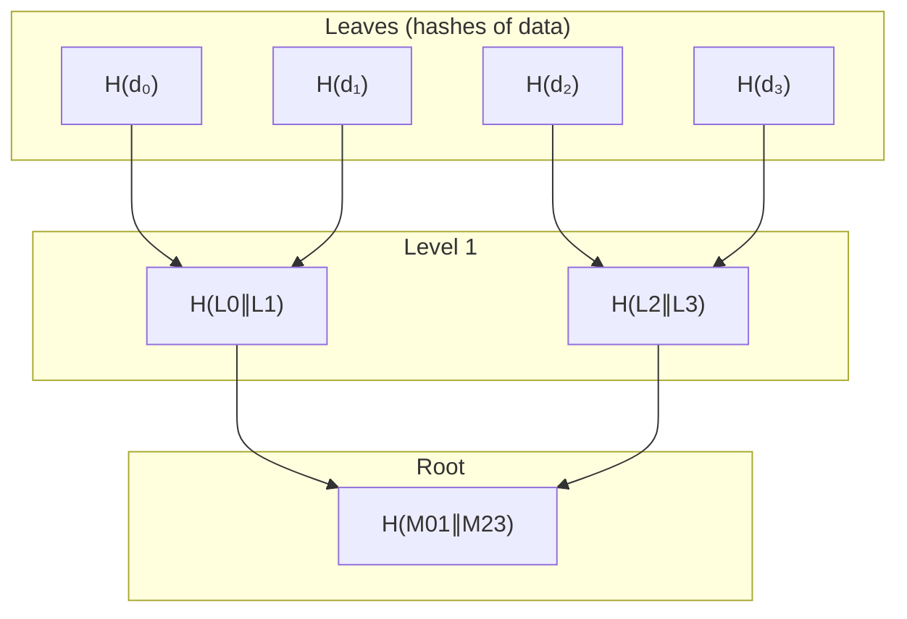
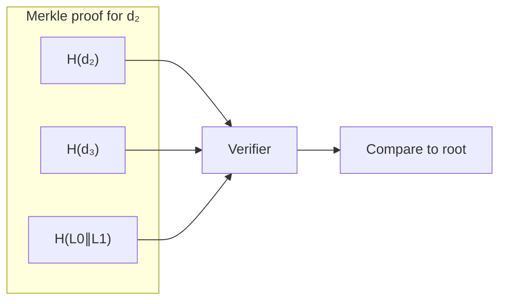

---
tags:
  - deep-dive
  - cryptography
  - systems-design
  - data-structures
---

# Merkle Trees Explained: Cryptographic Integrity at Scale

**Themes:** Cryptography · Data Structures · Distributed Systems

*Merkle trees appear throughout distributed systems—blockchains, version control, content-addressable storage, and transparency logs. For how they fit into blockchain architecture, see [Blockchain vs Hashchain](blockchain-vs-hashchain.md).*

---

## 1. Introduction: Verifying Large Data Efficiently

A central problem in distributed systems is **integrity at scale**: how can a node verify that a large dataset (or a single element within it) is correct without downloading and re-hashing everything?

Hashing each record individually gives tamper detection for that record but does not bind the records together. A verifier would need to fetch the entire dataset and recompute every hash to be sure nothing was altered or reordered. For a billion-row log or a multi-gigabyte file store, that is impractical. What we need is a structure that:

- **Commits** to the whole set with a single root value (e.g. a root hash).
- Allows **proof of inclusion**: prove that a specific element is in the set using only a small amount of auxiliary data (logarithmic in the set size).
- Makes **tampering detectable**: any change to any element forces the root to change, so a verifier who knows the correct root can reject modified data.

**Hash trees** (Merkle trees) provide exactly this: a tree of hashes whose root summarizes the entire set, and whose structure allows compact **Merkle proofs** for membership. They are a foundational cryptographic data structure for scalable integrity verification.

---

## 2. Cryptographic Hash Functions (Brief Review)

Merkle trees rely on **cryptographic hash functions**. A hash function \(H\) maps arbitrary-length inputs to a fixed-length output (e.g. 256 bits). The properties we need:

- **Determinism**: \(H(x)\) is always the same for the same \(x\). Recomputing yields a verifiable match.
- **Collision resistance**: It is computationally infeasible to find \(x \neq y\) such that \(H(x) = H(y)\). So the hash uniquely commits to its input for practical purposes.
- **Preimage resistance**: Given \(h = H(x)\), it is infeasible to find \(x\). You cannot reverse the hash to forge data.
- **Avalanche effect**: A small change in the input (e.g. one bit) produces a completely different output. So any tampering changes the hash.

These properties make hashes suitable for **commitment** and **binding**: the root of a Merkle tree commits to the entire set, and recomputing the tree from modified data would yield a different root. Standard choices include SHA-256, SHA-3, and BLAKE2.

---

## 3. What Is a Merkle Tree

A **Merkle tree** (hash tree) is a tree in which:

- **Leaf nodes** are the hashes of the data elements (or the data elements themselves, with their hashes computed as the leaf value). Typically we have \(n\) leaves corresponding to \(n\) items.
- **Internal nodes** are the hashes of their children. Conventionally, a parent’s value is \(H(\text{left child} \| \text{right child})\) (or \(H(\text{left}) \| H(\text{right})\) with a fixed order). If the number of children is odd at a level, the last node may be duplicated or handled by a defined padding rule.
- The **root** (single top node) is the **Merkle root** or **root hash**. It is a fixed-size commitment to the entire set: anyone who knows the root can verify that a purported element is in the set by checking a **Merkle proof** (see below).

Hashes are thus **recursively combined**: leaves → parents → grandparents → … → root. The tree is usually **binary** (each internal node has two children), so the depth is \(O(\log n)\) for \(n\) leaves.



---

## 4. Building a Merkle Tree

Construction proceeds bottom-up:

1. **Hash each data element** to form the leaves. If the number of leaves is not a power of two, pad (e.g. duplicate the last leaf or use a fixed padding value) so that every level has an even number of nodes.
2. **Pair leaves** (left, right) and set each parent to \(H(\text{left} \| \text{right})\). Order must be fixed (e.g. left-to-right) so that verification is deterministic.
3. **Repeat** for the new level: pair those hashes, hash each pair to form the next level up.
4. **Stop** when one node remains; that is the **root**.

Pseudocode:

```text
function build_merkle_tree(leaves: list of bytes) -> bytes:
    if len(leaves) == 0: return EMPTY_HASH
    current = [hash(leaf) for leaf in leaves]
    while len(current) > 1:
        if len(current) % 2 == 1:
            current.append(current[-1])   // pad to even
        next_level = []
        for i in 0 .. len(current)-1 step 2:
            next_level.append(hash(current[i] || current[i+1]))
        current = next_level
    return current[0]
```

The root depends on every leaf and on the order of leaves. Changing any leaf or reordering leaves changes the root.

---

## 5. Merkle Proofs

A **Merkle proof** (also **authentication path** or **Merkle path**) proves that a **specific leaf** is in the tree with a given root, without sending the whole tree.

**What the prover sends:**

- The **leaf index** (or the leaf value itself).
- The **sibling hashes** along the path from the leaf to the root. At each level, the verifier has one node (starting from the leaf); the proof supplies that node’s sibling. The verifier hashes the two siblings together (in the correct order) to get the parent, then repeats until reaching the root.

**Verification steps:**

1. Compute the leaf hash (if the verifier has the leaf data) or take the leaf hash from the proof.
2. At each level, combine the current hash with the sibling hash from the proof (left then right, or as the scheme specifies) and set the current hash to \(H(\text{combined})\).
3. After processing all proof elements, the current hash should equal the **known root**. If it does, the leaf is in the tree; if not, the proof is invalid.

**Size of a proof:** The path has one sibling per level. For a tree with \(n\) leaves, there are \(\lceil \log_2 n \rceil\) levels, so the proof is \(O(\log n)\) hashes. For a million leaves, that is about 20 hashes (e.g. 20 × 32 bytes = 640 bytes for SHA-256), not the full dataset.



---

## 6. Efficiency Advantages

Merkle trees give **logarithmic** verification cost instead of linear:

| Operation              | Without Merkle tree     | With Merkle tree        |
|------------------------|-------------------------|--------------------------|
| Commit to \(n\) items  | \(n\) hashes            | \(n\) leaf hashes + \(O(n)\) internal (still \(O(n)\) to build) |
| Verify one element    | Fetch and hash all \(n\)| Fetch element + \(O(\log n)\) proof hashes |
| Proof size            | N/A                     | \(O(\log n)\) hashes     |
| Bandwidth for proof   | Entire dataset          | One element + \(O(\log n)\) hashes |

So:

- **Logarithmic verification**: A verifier with the root can check membership in \(O(\log n)\) time and with \(O(\log n)\) extra data.
- **Bandwidth savings**: Light clients (e.g. in blockchains) can verify that a transaction is in a block without downloading the full block—only the block header (which contains the Merkle root) and a Merkle proof.
- **Partial verification**: You can verify one or a few elements without touching the rest. Replicated systems can prove “this chunk is correct” without transferring the whole set.

This is why Merkle trees are standard in distributed storage, blockchains, and transparency logs: they scale integrity verification to very large sets.

---

## 7. Merkle Trees in Bitcoin

Bitcoin uses a **Merkle tree of transactions** inside each block:

- The **block header** includes a **Merkle root** (hash of the root of the transaction tree), plus previous block hash, timestamp, difficulty, nonce, etc.
- The **block body** is the list of transactions. Miners build the Merkle tree over these transactions and put the root in the header.
- **Simplified Payment Verification (SPV)** clients download block headers (80 bytes each) and request **Merkle proofs** for transactions that concern them. They verify that the transaction is in the block by checking the proof against the header’s Merkle root. They do **not** download every transaction in every block.

So Merkle trees are what make **lightweight clients** possible: you can prove “this payment is in this block” with a small proof and a small amount of header data, instead of storing or streaming the full chain. The same idea appears in many other blockchains and in distributed systems that need inclusion proofs.

---

## 8. Merkle Trees in Distributed Systems

Beyond blockchains, Merkle trees (and related structures) appear wherever you need **scalable integrity** or **content-addressed verification**:

- **Git**: Commit objects form a DAG; each commit points to a tree object that is effectively a Merkle tree of the repository contents (blobs and nested trees). Content-addressed storage and integrity are central to Git’s model.
- **IPFS**: Content is identified by hashes (CIDs). Large objects are split into blocks; the blocks are arranged in a Merkle DAG. You can fetch and verify only the blocks you need, using proofs or parent links.
- **Distributed databases**: Some systems use Merkle trees (or Merkle-like structures) for **anti-entropy**: compare roots between replicas to detect divergence, then exchange and verify only the differing subtrees.
- **Certificate Transparency**: Logs of issued certificates are maintained as Merkle trees. Browsers and monitors can verify that a certificate was logged by checking a Merkle proof against a published root.
- **Secure file sync**: Tools that sync large file sets can use a Merkle tree (or similar) so that a client verifies only the chunks that changed, using a small proof and the root.

In all these cases, the pattern is the same: a **root commits to a large set**; **proofs** let you verify membership or subset integrity with **logarithmic** data.

---

## 9. Variants of Merkle Trees

Several variants extend the basic structure:

- **Sparse Merkle trees (SMTs)**: A full binary tree over a fixed address space (e.g. \(2^{256}\) leaves). Most leaves are “empty” (e.g. hash of zero). Used for key–value stores and state commitments: you can prove membership or non-membership of a key with a path. Used in some blockchain state designs and verifiable databases.
- **Merkle Patricia trees (tries)**: Combine Merkle hashing with a radix/patricia trie structure. Each node’s hash commits to its children; the tree is keyed by path (e.g. account address). Ethereum’s state and transaction tries are Merkle Patricia trees, allowing efficient proofs for “what is the value at key K?”
- **Merkle DAGs**: A directed acyclic graph where nodes are hashes of their content and links. Multiple nodes can point to the same child (shared subgraphs). IPFS and Git use this: the “tree” can have sharing and cycles only in the sense of DAG edges, with hashes still committing to structure and content.

These variants keep the core idea—hash-based commitment and compact proofs—while adapting to different key spaces, update patterns, or sharing requirements.

---

## 10. Security Considerations

- **Hash collisions**: If an attacker can find two different inputs with the same hash, they could substitute one for the other in the tree and leave the root unchanged. Cryptographic hash functions (SHA-256, etc.) are chosen so that collision-finding is infeasible. **Use a cryptographically strong hash.**
- **Second preimage attacks**: Given one leaf, can an attacker find another leaf that hashes to the same value? Preimage resistance of the hash function is what prevents this. Again, use a proper cryptographic hash.
- **Tree balancing**: For a simple binary tree, an odd number of leaves is usually handled by duplicating the last leaf (or similar). That can make the last leaf’s position somewhat redundant; in some threat models, duplication is analyzed explicitly. For most applications, standard padding is acceptable.
- **Order and encoding**: Verification must use the **same** order (left/right) and **same** encoding (e.g. concatenation, no extra length prefixes) as construction. Inconsistency between prover and verifier leads to broken proofs or acceptance of invalid data.

Security therefore depends on **consistent construction and verification**, **strong hash function**, and **protecting the root** (whoever knows the root is the authority for “correct” state; in distributed systems, the root is often agreed via consensus or a trusted source).

---

## 11. Performance Considerations

- **Tree depth**: Depth is \(\lceil \log_2 n \rceil\). Depth limits proof size and verification steps. For \(n = 2^{20}\) (about a million leaves), depth is 20.
- **Hashing cost**: Building the tree requires hashing every leaf and every internal node (roughly \(n + n/2 + n/4 + \ldots \approx 2n\) hashes). One-time or amortized build cost is \(O(n)\). Verification of one proof is \(O(\log n)\) hashes.
- **Storage overhead**: Storing the full tree takes roughly twice the space of the leaves (all internal nodes). Many systems do not store the full tree; they recompute it when needed, or store only the root and generate proofs on demand from the underlying data.

Trade-offs: Sparse Merkle trees have large logical size (e.g. \(2^{256}\) leaves) but implementations use lazy expansion and only materialize paths that are used. Merkle Patricia trees add branching factor and path length in exchange for keyed access and efficient updates.

---

## 12. Implementation Example

A minimal Python-style sketch for building a Merkle root and a proof (conceptual only; no error handling or production hardening):

```python
import hashlib

def hash_pair(left: bytes, right: bytes) -> bytes:
    return hashlib.sha256(left + right).digest()

def merkle_root(leaves: list[bytes]) -> bytes:
    if not leaves:
        return hashlib.sha256(b"").digest()
    layer = [hashlib.sha256(leaf).digest() for leaf in leaves]
    while len(layer) > 1:
        if len(layer) % 2:
            layer.append(layer[-1])
        layer = [hash_pair(layer[i], layer[i+1]) for i in range(0, len(layer), 2)]
    return layer[0]

def merkle_proof(leaves: list[bytes], index: int) -> list[tuple[bytes, str]]:
    """Returns list of (sibling_hash, 'left'|'right') from leaf to root."""
    if index < 0 or index >= len(leaves):
        return []
    layer = [hashlib.sha256(leaf).digest() for leaf in leaves]
    proof = []
    idx = index
    while len(layer) > 1:
        if len(layer) % 2:
            layer.append(layer[-1])
        sibling_idx = idx + 1 if idx % 2 == 0 else idx - 1
        sibling_pos = 'right' if idx % 2 == 0 else 'left'
        proof.append((layer[sibling_idx], sibling_pos))
        idx //= 2
        layer = [hash_pair(layer[i], layer[i+1]) for i in range(0, len(layer), 2)]
    return proof

def verify_proof(leaf: bytes, proof: list[tuple[bytes, str]], root: bytes) -> bool:
    current = hashlib.sha256(leaf).digest()
    for sibling, pos in proof:
        current = hash_pair(sibling, current) if pos == 'left' else hash_pair(current, sibling)
    return current == root
```

In practice you would fix encoding (e.g. always 32-byte hashes), define padding for empty trees and odd layers, and possibly use a typed “proof” structure. The above illustrates the idea: build layers, record siblings along the path, verify by recomputing upward to the root.

---

## 13. Conclusion

Merkle trees are a **foundational cryptographic data structure** for scalable integrity. They provide:

- A **single root hash** that commits to an entire set of data.
- **Merkle proofs** of size \(O(\log n)\) that let a verifier check membership without the full set.
- **Tamper detection**: any change to any leaf (or reordering) changes the root.

They appear in blockchains (transaction commitments, light clients), version control (Git), content-addressed storage (IPFS), transparency logs (Certificate Transparency), and distributed databases (anti-entropy, state commitments). Understanding Merkle trees is essential for engineers working on distributed systems, storage, or any system that must verify large datasets efficiently.

!!! tip "See also"
    - [Blockchain vs Hashchain](blockchain-vs-hashchain.md) — How Merkle trees fit into block structure and consensus
    - [Proof of Work Explained](proof-of-work-explained.md) — How mining and hash puzzles use the block header and Merkle root
    - [Distributed Systems and the Myth of Infinite Scale](distributed-systems-myth-of-infinite-scale.md) — Coordination and consistency in distributed systems
