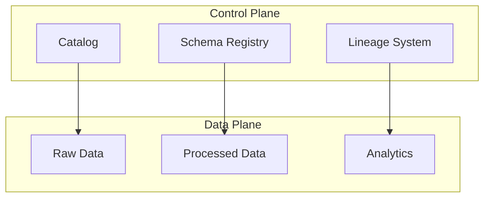

---
tags:
  - deep-dive
  - data-engineering
  - governance
  - metadata
---

# The Metadata Crisis in Modern Data Platforms

*Why Data Systems Fail When Metadata Becomes an Afterthought*

**Themes:** Data Architecture · Governance · Infrastructure

---

## Opening Thesis

Most modern data platforms are built around massive datasets—petabytes in object storage, thousands of tables, hundreds of pipelines—yet the systems that describe, govern, and manage those datasets are often underdeveloped or neglected. Metadata—schema, lineage, ownership, quality contracts—is treated as documentation to be maintained when there is time, rather than as infrastructure that must be produced, enforced, and evolved as a first-class part of the platform. The result is a metadata crisis: data exists but cannot be found, trusted, or governed. This essay examines metadata as infrastructure, the control plane it forms, the debt that accumulates when it is ignored, and how to build metadata-driven systems.

---

## Metadata as Infrastructure

Metadata in data systems falls into distinct categories. Each must be treated as infrastructure—machine-readable, enforceable, and maintained as a byproduct of operation—if the platform is to remain governable.

**Schema metadata**: Structure of tables, streams, and files—column names, types, nullability, and evolution history. When enforced (e.g. at write time via a schema registry or table format), it prevents invalid data from entering the system and allows consumers to depend on a stable contract.

**Operational metadata**: Run history, task success and failure, durations, resource usage. It powers orchestration, alerting, and capacity planning. When stored and queried consistently, it is the source of truth for "what ran, when, and whether it succeeded."

**Governance metadata**: Ownership, classification, retention, and access policy. It supports discovery, compliance, and access control. When tied to enforcement points (IAM, retention jobs, classification labels), it turns policy into behavior.

**Lineage metadata**: Provenance of data—which sources fed which tables, which transformations produced which outputs. It enables impact analysis ("what uses this table?"), root-cause analysis ("where did this value come from?"), and compliance. Lineage that is produced automatically from pipeline execution stays current; lineage that is manual becomes stale and useless.

When these categories exist only in wikis, spreadsheets, or ad-hoc documentation, they diverge from reality. When they exist as infrastructure—stored in catalogs, registries, and lineage systems, and enforced at runtime—they govern the platform.

---

## Metadata as Control Plane

The data plane carries the actual data: bytes in Parquet files, rows in tables, messages in streams. The control plane governs how data is produced, moved, validated, and accessed. Metadata is the control plane.

The catalog describes what exists and who owns it; the schema registry enforces structure on processed data; the lineage system tracks flow into analytics. The control plane does not move data—it governs it. Decisions about what to run, what is valid, and who can access data are made from metadata. Systems that lack a functioning control plane are ungovernable: they may process data at scale, but they cannot answer "what do we have?", "where did it come from?", or "who is responsible for it?" See [Metadata as Control Plane](../best-practices/data/metadata-control-plane.md).

---

## The Metadata Debt Problem

Metadata debt accumulates when metadata is not maintained as infrastructure.

**Undocumented datasets**: New tables, partitions, or files appear without being registered in a catalog. Over time, a large fraction of storage is "dark"—present but undiscoverable. Analysts and pipelines cannot use what they cannot find.

**Schema drift**: Producers change schemas without notifying consumers or updating contracts. Columns are added, removed, or retyped. Downstream pipelines and reports break or produce wrong results. Drift is inevitable when schema is not enforced or versioned.

**Pipeline fragmentation**: Pipelines are added by different teams, in different styles, with different naming and no shared lineage. The graph of dependencies is unknown. Impact analysis and change management become impossible. Failures propagate in ways that no one can trace.

Debt compounds: the longer metadata is neglected, the harder it is to introduce catalog, lineage, and contracts later, because the existing state is large and poorly understood. The crisis is not that metadata is missing in principle—it is that the platform has grown beyond the point where manual or after-the-fact metadata is feasible.

---

## Organizational Factors

Metadata often fails for organizational reasons.

**Manual cataloging**: When catalog entries are created by people filling out forms, they fall behind. New datasets are not registered; old entries become stale. Manual metadata does not scale. Automation—metadata produced from pipeline runs, schema inference, and lineage from orchestrators—is required.

**Unclear ownership**: When no one owns the catalog, schema registry, or lineage system, no one is accountable for their quality or completeness. Metadata infrastructure must have an owner—a platform team or data engineering function—with the mandate to enforce standards and integrate metadata into pipelines.

**Lack of automation**: When pipelines do not register schemas, publish lineage, or update the catalog as part of their execution, metadata is always incomplete. Metadata must be a byproduct of normal operation: every write updates the catalog; every run records lineage; every schema change goes through the registry.

---

## Architectural Lessons

**Build metadata into the pipeline**: Every ingestion and transformation stage should produce or consume metadata. Writes should register schema and lineage; reads should validate against contracts. Metadata is not a separate project—it is part of the data product.

**Enforce at the boundary**: Use schema registries and table formats to enforce schema at write time. Reject or quarantine invalid data. Do not allow "documentation only" schemas that are not enforced.

**Version and evolve metadata**: Schema and contract changes should be versioned and compatible where possible. Consumers should be able to depend on stability; producers should follow evolution rules (e.g. additive changes, deprecation periods).

**Own the control plane**: Assign ownership of catalog, lineage, and schema infrastructure. Fund it as platform infrastructure, not as an optional add-on. Measure completeness and freshness of metadata and treat gaps as platform failures.

---

## Decision Framework

| Situation | Recommendation |
|-----------|-----------------|
| New platform or greenfield | Design metadata (catalog, schema, lineage) from day one. Automate production of metadata from pipelines. |
| Existing platform with weak metadata | Start with high-value datasets and critical pipelines. Introduce schema enforcement and lineage for new work; backfill catalog and lineage for key assets incrementally. |
| Many producers, many consumers | Implement a data contract and schema registry. Require producers to register schemas and consumers to declare dependencies. Use lineage to drive impact analysis. |
| Regulated or high-trust domain | Treat metadata as non-negotiable. Enforce schema, lineage, and retention; document ownership and classification. Metadata is the audit trail. |

**Principle**: When metadata is an afterthought, the platform fails to scale in a governable way. When metadata is infrastructure, the platform can grow while remaining discoverable, trustworthy, and compliant.

!!! tip "See also"
    - [Metadata as Infrastructure](metadata-as-infrastructure.md) — Control plane and contracts
    - [The Hidden Cost of Metadata Debt](the-hidden-cost-of-metadata-debt.md) — Economic cost of neglected metadata
    - [Why Most Data Lakes Become Data Swamps](data-lakes-become-data-swamps.md) — Entropy when metadata collapses
    - [The Myth of Infinite Data Scale](myth-of-infinite-data-scale.md) — Scale without metadata infrastructure
    - [Why Most Data Pipelines Are Operationally Fragile](why-data-pipelines-are-operationally-fragile.md) — Pipelines and contracts
    - [Metadata as Control Plane](../best-practices/data/metadata-control-plane.md) — Best-practice metadata architecture
    - [Reproducible Data Pipelines](../best-practices/data/reproducible-data-pipelines.md) — Lineage and provenance
    - [Data Lineage, Contracts & Provenance](../best-practices/database-data/data-lineage-contracts.md) — Lineage and contract enforcement
