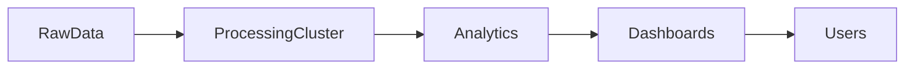

---
tags:
  - deep-dive
  - data-engineering
  - architecture
  - economics
---

# The Myth of Infinite Data Scale

*Why "Just Store Everything" Is an Architectural Fallacy*

**Themes:** Data Architecture · Economics · Systems Design

---

## Opening Thesis

Modern data systems are often designed under the assumption that storage and compute scale infinitely. In reality, scaling data infrastructure introduces compounding operational, economic, and cognitive costs. The ideology of infinite scale—"store everything," "add more nodes," "the cloud scales"—emerged from genuine advances in distributed storage and compute, but it has been applied far beyond the domain where it holds. This essay examines how that ideology emerged, why it frequently leads to brittle systems, and what architectural discipline can replace it.

---

## Historical Context

### The relational database era

For decades, analytical data lived in relational databases and data warehouses. Storage was expensive; so was compute. Designers made deliberate choices about what to retain, how to model it, and when to aggregate or archive. The constraint of finite resources produced a discipline: schemas were designed, retention was planned, and "store everything" was not an option. That discipline kept systems understandable and costs predictable.

### Hadoop and distributed storage

Hadoop and the Hadoop Distributed File System (HDFS) changed the equation. Storage could be spread across many nodes; capacity grew by adding machines. The MapReduce model allowed computation to move to the data. The narrative shifted: scale-out was the answer to growing data volumes. What was less visible was the operational cost—cluster management, replication, Namenode single points of failure, and the complexity of debugging distributed jobs.

### Spark and distributed compute

Spark replaced MapReduce as the dominant distributed compute engine by keeping data in memory where possible and generalizing the programming model. It reinforced the idea that large-scale data problems could be solved by distributing work across a cluster. Again, the benefits were real for workloads that genuinely exceeded single-machine capacity. The risk was that "use Spark" became a default rather than a considered choice, and that the cost of coordination, shuffle, and operational complexity was underestimated.

### Cloud object storage and the "infinite scale" narrative

Cloud object storage (S3, GCS, Azure Blob) made storage cheap and seemingly unbounded. Pricing models encouraged retention: the marginal cost of storing another terabyte was low. Vendors and practitioners began to speak of "infinite scale"—store everything, compute when needed, pay only for what you use. The narrative ignored the fact that *operational* cost—discovery, governance, lineage, and query performance—does not scale down with byte cost. Cloud storage economics changed architectural thinking toward retention and centralization; they did not eliminate the need for structure and lifecycle.

---

## The Illusion of Infinite Storage

Storage appears cheap when measured in dollars per gigabyte. It becomes expensive when measured in total cost of ownership.

**Metadata management**: Every object, partition, or table requires metadata: schema, ownership, lineage, retention. As the number of objects grows, metadata systems—catalogs, schemas, lineage graphs—either scale with them (at significant cost) or collapse (leaving data undocumented and ungovernable). The byte cost of storage is low; the cost of *managing* that storage grows with complexity.

**Replication overhead**: Durability and availability require replication. Multi-AZ or multi-region replication multiplies storage cost and complicates consistency. Backup and disaster-recovery copies add further multiples. "Cheap storage" becomes "cheap storage × replication factor × backup factor."

**Governance complexity**: The more data you store, the more you need policies for access, retention, quality, and classification. Governance does not scale linearly; the number of policies, roles, and exceptions grows with the number of datasets and consumers. Uncontrolled ingestion produces governance debt that is never fully paid down.

**Query performance degradation**: Large, poorly organized datasets slow down queries. Full scans over petabyte-scale storage are expensive in time and compute. Partitioning, indexing, and curation are necessary to make data usable; without them, "all the data" is effectively inaccessible for interactive or time-sensitive use.

The critical distinction is **byte cost vs operational cost**. Byte cost has dropped. Operational cost—the cost of making data findable, understandable, correct, and performant—has not. Systems designed as if only byte cost mattered become unmanageable.

---

## Data Gravity and System Coupling

Data gravity is the idea that large datasets attract compute, pipelines, and applications. The more data accumulates in a place, the more work is drawn to that place. The result is increased coupling: pipelines depend on specific storage layouts; ML training runs where the data lives; dashboards and APIs are built against specific tables and partitions. Moving or restructuring the data becomes costly because so much depends on it.

Raw data lands in a central store; processing clusters are colocated or tightly coupled to it; analytics and dashboards depend on the outputs. Scale increases coupling: more pipelines, more consumers, more assumptions about schema and freshness. The system becomes a monolith in practice even when it is distributed in implementation—because changing one part risks breaking many others. Architectural flexibility is lost when "just add more data" is the default and data lifecycle and boundaries are not designed.

---

## Distributed Compute Costs

Horizontal scaling introduces costs that are hidden in simple "add more nodes" thinking.

**Shuffle operations**: In Spark and similar engines, wide transformations (joins, group-bys) require shuffling data between nodes. Shuffle dominates runtime and cost for many jobs. The more data and the more nodes, the more network and disk I/O. Scaling out does not eliminate shuffle; it can increase total shuffle volume.

**Network I/O**: Data movement between nodes is limited by bandwidth and latency. Cross-AZ or cross-region traffic in the cloud is often billed and can become a major cost. Distributed systems that assume "the network is fast and free" run into both performance and cost walls.

**Serialization overhead**: Moving data between processes or nodes requires serialization and deserialization. CPU and memory for serde scale with data volume and with the number of boundaries crossed. Columnar formats reduce but do not eliminate this cost.

**Cluster coordination**: The driver (or equivalent) must schedule tasks, track progress, and handle failures. Heartbeats, status updates, and scheduling decisions add latency and resource use. Coordination overhead grows with the number of nodes and tasks.

Scaling horizontally therefore introduces new performance constraints. The system is no longer limited only by single-node CPU and memory; it is limited by network, shuffle, and coordination. These limits are often discovered only in production.

---

## Organizational Consequences

The ideology of infinite scale leads to organizational failure modes:

**Uncontrolled ingestion**: If storage is "infinite," there is no pressure to filter or curate at ingest. Everything is dumped into the lake. The result is a mix of valuable and worthless data, with no clear ownership or lifecycle.

**Unclear dataset ownership**: When many teams write to the same store without boundaries, ownership of datasets becomes ambiguous. No one is accountable for quality, retention, or schema evolution. Incidents and cleanup are everyone's and no one's responsibility.

**Duplication across teams**: Teams that do not trust central datasets copy and transform data for their own use. Duplication multiplies storage and compute and produces inconsistent definitions. "Single source of truth" is abandoned in practice.

**Growing governance complexity**: As the number of datasets and consumers grows, governance—who can access what, what quality rules apply, what the schema means—becomes impossible to maintain manually. Without automation and metadata infrastructure, governance collapses and the system drifts toward swamp.

---

## Architectural Lessons

**Tiered storage policies**: Not all data needs the same performance or durability. Define tiers (hot, warm, cold, archive) and move data between them based on age and access patterns. Reduces cost and focuses governance on the tiers that matter most.

**Lifecycle management**: Automate retention and deletion. Data that has passed its useful life or its compliance retention period should be removed or archived. "Store everything forever" is a choice with compounding cost; lifecycle management is the alternative.

**Curated datasets**: Maintain a clear boundary between raw or landing data and curated, product-ready datasets. Curated datasets have owners, schemas, quality checks, and documented semantics. They are the interface between "all the data" and "data we can trust."

**Compute locality**: Where possible, run compute close to data (same region, same cluster) to reduce network cost and latency. For very large batch jobs, distribution is necessary; for many analytical workloads, single-node or warehouse compute over well-partitioned data is cheaper and simpler.

---

## Decision Framework

| Situation | Recommended approach |
|-----------|------------------------|
| Small analytics workloads | Local compute engines (DuckDB, Polars); single-node or warehouse |
| Exploratory analysis | Curated subsets; avoid full-lake scans |
| Multi-terabyte ETL | Distributed processing (Spark or similar) with clear partitioning and lifecycle |
| Archival storage | Tiered object storage; compress and move to cold/archive; define retention |
| Mixed workload | Hybrid: raw/curated separation; distribute only stages that exceed single-node capacity |

**Principle**: Treat scale as a constraint to be managed, not an assumption to be embraced. Design for lifecycle, ownership, and operational cost from the start.

!!! tip "See also"
    - [Why Most Data Lakes Become Data Swamps](data-lakes-become-data-swamps.md) — The entropy that follows uncontrolled scale
    - [The Metadata Crisis in Modern Data Platforms](metadata-crisis-in-modern-data-platforms.md) — Why describing data at scale fails without infrastructure
    - [Why Most Data Pipelines Are Operationally Fragile](why-data-pipelines-are-operationally-fragile.md) — How pipeline complexity compounds with scale
    - [Distributed Systems and the Myth of Infinite Scale](distributed-systems-myth-of-infinite-scale.md) — Coordination and consistency limits
    - [Reproducible Data Pipelines](../best-practices/data/reproducible-data-pipelines.md) — Pipeline discipline and artifact strategy
    - [When to Use Spark (and When Not To)](../best-practices/data-processing/spark/when-to-use-spark.md) — When distributed compute is justified
    - [Parquet](../best-practices/database-data/parquet.md) — Layout and partitioning for scalable storage
