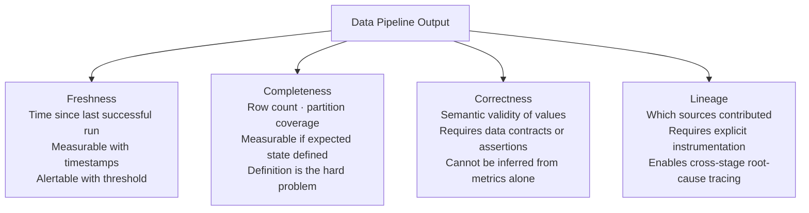

---
tags:
  - deep-dive
  - observability
  - operations
---

# Observability vs Monitoring: Signals, Systems, and the Limits of Metrics

**Themes:** Operations · Observability · Organizational

---

## Opening Thesis

Monitoring answers a narrow, pre-formulated question: is the system in a known good state or a known bad state? It requires the operator to anticipate failure modes in advance and instrument against them. When the system fails in a way that was anticipated, monitoring detects it. When it fails in a novel way, monitoring is silent.

Observability answers a different question: given that something is wrong, can I understand why, from the outside, without having to redeploy the system with additional instrumentation? It is a property of the system — the degree to which the system's internal state can be inferred from its external outputs. A fully observable system exposes enough information that any failure mode, including unanticipated ones, can be diagnosed from existing signals.

This distinction is not semantic. It reflects fundamentally different design philosophies, different tooling investments, and different operational capabilities. The confusion between them — and the marketing ecosystem that has grown up around the term "observability" — makes it worth examining both concepts with care.

---

## Historical Context

### The Nagios Era

Network and system monitoring in the late 1990s and early 2000s was primarily availability monitoring: is the host reachable, is the service responding, is disk utilization below threshold? Tools like Nagios, Zabbix, and their equivalents implemented this model with configurable checks, alerting thresholds, and notification pipelines.

This model was sufficient for the infrastructure of its era: physical servers with well-understood failure modes, monolithic applications where "is the application up?" was a binary and answerable question, and deployment cycles measured in months. An application that was running was presumed to be working correctly; correctness verification was not part of the monitoring surface.

The limitations of this model became apparent as software systems moved toward distributed architectures. In a distributed system, the question "is the system up?" has no binary answer. Some instances may be healthy while others are degraded. Some requests may succeed while others fail on the same service. A user may experience a 10-second response time on a service that reports itself healthy by every check the monitoring system knows how to run.

### APM Evolution

Application Performance Monitoring (APM) emerged as a response to the insufficiency of infrastructure-level monitoring for application-level problems. Tools like New Relic, Dynatrace, and AppDynamics instrumented application code to capture response times, error rates, throughput, and — critically — traces of individual requests through the application stack.

APM introduced the concept of golden signals — the four metrics that characterize application health: latency, traffic, error rate, and saturation. This framing was popularized by Google's Site Reliability Engineering book and became the standard language for service-level objectives.

APM was a significant improvement over infrastructure monitoring, but it retained the fundamental character of monitoring: known metrics, threshold alerts, anticipated failure modes. The APM agent instrumented the application at points the vendor had defined; visibility was limited to what the vendor had anticipated operators would need to see.

### The Rise of Distributed Tracing

Distributed tracing — following a single request across multiple services in a distributed system — emerged from Google's Dapper paper (2010) and became practically accessible with open-source implementations (Zipkin, Jaeger) in the mid-2010s. Distributed traces produce a causally linked chain of spans: each service that handles a request records the time it spent, the service it called next, and any errors it encountered.

The trace model is fundamentally different from the metric model. A metric is an aggregate: the 95th percentile latency of the orders service over the last five minutes. A trace is a specific event: this particular request to the orders service, on this timestamp, took 847ms, of which 620ms was spent waiting for the inventory service, which in turn spent 580ms on a database query that hit a missing index.

Distributed tracing operationalized a key component of observability: the ability to move from aggregate signal (something is slow) to specific root cause (this query on this service is the bottleneck) without additional instrumentation.

---

## The Three Pillars and Their Limits

The "three pillars of observability" framing — logs, metrics, traces — became canonical in the observability discourse of the late 2010s and is now embedded in most vendor positioning and most engineering team mental models. The framing is useful as a taxonomy. It is incomplete as a description of what observability actually requires.

### Logs

Logs are timestamped records of discrete events: a request was received, a database query was executed, an error was caught. They are the most familiar and the most unstructured of the three signal types. Log data is rich — a log line can contain arbitrary context — but it is expensive to query at scale, requires careful formatting discipline to be machine-parseable, and produces prohibitive storage costs at high throughput.

Structured logging (JSON-formatted logs with consistent field names) significantly improves queryability but does not address the fundamental cost problem: at 100,000 requests per second, logging every request at meaningful detail produces terabytes of data per day. Log sampling — recording only a fraction of events — is operationally necessary at high throughput but introduces a blind spot: the event you need to diagnose may be in the fraction that was not logged.

### Metrics

Metrics are aggregated numerical measurements over time: request count, error rate, cache hit ratio, heap usage. They are cheap to store (a metric data point is typically 16–24 bytes in a time series database like Prometheus), cheap to query, and suitable for alerting and dashboarding. Their fundamental limitation is that they are pre-aggregated: the information needed to understand why a metric changed is not present in the metric itself.

Cardinality is the primary operational challenge of metric systems. A metric with high-cardinality labels — labels whose values have many distinct values, such as user_id or request_id — produces a metric series per unique label combination. A metric tagged with `user_id` for a system with one million users creates one million distinct metric series, each requiring storage and query processing. High-cardinality metrics push the cost of metric storage toward the cost of log storage while retaining the limitations of aggregation.

### Traces

Traces provide the request-scoped causal chain that neither logs nor metrics can produce efficiently. Their primary limitations are sampling — capturing every trace in a high-throughput system is prohibitively expensive, so representative sampling is required — and instrumentation burden. Adding distributed tracing to an existing codebase requires adding trace context propagation at every service boundary, which is significant engineering investment in a large, established codebase.

Head-based sampling (the decision to sample is made at the start of the request) discards traces for requests that are interesting precisely because they failed in an unusual way. Tail-based sampling (the decision is made after the request completes, retaining traces for requests that were slow or erroneous) requires buffering all spans until the request completes, adding latency and memory pressure.

### Why the Framing Is Incomplete

The three pillars framing implies that logs + metrics + traces = observability. This is not accurate. Observability is a property of the whole system, not a sum of signal types. A system can have all three signal types implemented thoroughly and still be unobservable in important ways:

- **Absence of context**: logs that don't carry request IDs cannot be correlated with traces. Metrics that don't carry consistent labels cannot be correlated with log events. Signal correlation requires intentional design.
- **Missing semantics**: a trace showing that a request took 2 seconds is useful; a trace showing that a request took 2 seconds because the user's account was in a state that triggered a fallback code path that performs 40 sequential database queries is the same trace with more semantic context. Semantic richness requires deliberate instrumentation.
- **No causal model**: raw signals do not explain causality. Correlating a spike in error rate with a deployment event requires either a system that tracks deployments as events in the observability store or a human who knows to check the deployment log. Neither is provided by the three pillars themselves.

---

## Data Volume vs Signal Quality

The operational tension in observability systems is between data volume (which determines cost and storage requirements) and signal quality (which determines diagnostic value). More data, sampled more completely, produces better observability. It also produces substantially higher costs.

```mermaid
flowchart LR
  subgraph Full["100% Sampling\n(dev / staging)"]
    F1["Complete trace coverage"]
    F2["~50 GB/day at 10K req/s"]
    F3["Cost: very high"]
  end
  subgraph Tail["Tail-based 1%\n(production, moderate volume)"]
    T1["Captures slow + error traces"]
    T2["~0.5 GB/day at 10K req/s"]
    T3["Misses slow patterns below threshold"]
  end
  subgraph Head["Head-based 0.1%\n(high volume, stable systems)"]
    H1["Lowest cost"]
    H2["May miss rare failure modes"]
    H3["P99 estimates become unreliable"]
  end
  Full -->|"reduce coverage"| Tail -->|"reduce coverage"| Head
```

Cardinality management for metrics requires active governance. Teams that label metrics with high-cardinality identifiers create systems that degrade over time as cardinality increases: the metric database slows, query times increase, alerting rules consume more CPU, and eventually the operational cost of the metric system itself becomes a performance concern.

The cost implications of observability are not incidental. For large-scale systems, observability infrastructure (metric storage, trace storage, log storage, query infrastructure) can cost more than the systems being observed. This is not a reason to reduce investment in observability; it is a reason to design observability architecture with cost as a first-class constraint, not an afterthought.

---

## Data Pipeline Observability

The observability challenge for data pipelines is distinct from the observability challenge for request-serving systems, and the three pillars model maps onto it imperfectly.

A request-serving system has a clear success criterion per request: the response was returned within SLA, with the correct status code and body. A data pipeline has a success criterion per batch or per dataset: the output table is fresh, complete, and correct. "Fresh" is measurable. "Complete" requires knowing what "complete" means for a given dataset. "Correct" requires a formal definition of what the output should contain, which is a data governance problem before it is an observability problem.

The freshness vs correctness distinction is operationally important. A pipeline can be fresh (ran successfully 10 minutes ago) and incorrect (the upstream schema changed and the join now silently drops 40% of rows). Monitoring freshness is straightforward and is what most pipeline monitoring tools do. Monitoring correctness requires asserting expectations about the data itself — row counts within expected ranges, referential integrity maintained, field distributions within historical bounds — which is data observability rather than pipeline monitoring.

Tools in this space (Monte Carlo, Bigeye, Soda, elementary-data) attempt to provide automated anomaly detection over data quality metrics. Their effectiveness depends on having sufficient historical data to establish baselines and sufficient semantic understanding to distinguish meaningful anomalies from expected variance. Neither is free.

---

## Cultural Factors

### Blameless Postmortems

The single most effective cultural investment in observability is the blameless postmortem — a structured analysis of what went wrong, why, and how to prevent recurrence, conducted without assigning personal blame. The blameless principle is not naive; it is pragmatic. Systems fail because of systemic conditions, not because individual operators were careless. Assigning blame to individuals discourages the honest reporting of near-misses, incentivizes cover-ups, and does not address the systemic conditions that enabled the failure.

Blameless postmortems produce actionable improvement items: better monitoring, tighter alerting thresholds, additional runbook entries, architectural changes that reduce the impact of the failure class. They also build institutional knowledge about failure modes — knowledge that is lost when incidents are treated as individual failures rather than systemic signals.

### Feedback Loops

Observability infrastructure that does not change system behavior is operational theater. The value of a trace that shows a slow database query is the action it prompts: adding an index, optimizing the query, or caching the result. If the trace is visible but no process exists to act on it, the observability investment has produced no operational improvement.

Effective observability programs close the loop explicitly: alerts generate tickets, tickets have owners, owners have time allocated for addressing systemic issues, and progress is tracked. The observability tooling is the input to a feedback process; it is not the process itself.

### Ownership Models

Observability is most effective when ownership of a service's observability is held by the team that owns the service. Platform teams can provide tooling (metrics infrastructure, trace collection, log aggregation) and standards (required labels, log formats, alerting SLOs), but service-level observability — the definition of what "healthy" means for this service, the appropriate alert thresholds, the diagnostic runbooks — must be owned by service teams.

Central observability teams that own all alerting and dashboarding for all services create a knowledge bottleneck: they know how the observability tools work but not how the services work. When something breaks, the service team is unavailable (it is 3am, they are on a different on-call rotation) or the platform team cannot diagnose the failure (they do not know what the service is supposed to do). Distributed ownership, with platform-provided tooling and standards, produces better operational outcomes.

---

## Tooling Landscape

### Prometheus

Prometheus implements the pull-based metric collection model: a Prometheus server periodically scrapes metric endpoints exposed by instrumented services. It stores time series data locally and provides a query language (PromQL) for analysis. Its alert manager component routes alerts based on configurable rules.

Prometheus's strengths are its simplicity, its wide ecosystem of exporters (instrumentation for virtually every common infrastructure component), and its independence from vendor lock-in. Its limitations are its local storage model (not designed for long-term retention or global federation at large scale) and its lack of native support for distributed tracing or log aggregation. Thanos and Cortex address the long-term storage limitation by adding a distributed, object-storage-backed layer on top of Prometheus.

### OpenTelemetry

OpenTelemetry (OTel) is the CNCF-hosted consolidation of two predecessor projects (OpenCensus and OpenTracing) into a single, vendor-neutral instrumentation framework. Its primary value is standardization: OTel provides a consistent API and SDK for emitting metrics, traces, and logs from application code, with a collector component that routes telemetry to any backend (Prometheus, Jaeger, Zipkin, Datadog, Honeycomb, or any OTel-compatible destination).

OTel reduces vendor lock-in at the instrumentation layer: an application instrumented with OTel can switch its observability backend without changing application code. This is a genuine architectural advantage in a tooling landscape that changes rapidly.

### Vendor vs DIY

The observability tooling market has bifurcated between fully managed vendor solutions (Datadog, Honeycomb, Grafana Cloud, Dynatrace, New Relic) and self-hosted open-source stacks (Prometheus + Thanos + Grafana + Jaeger/Tempo + Loki).

Managed vendors provide operational simplicity at a cost that scales with data volume. The pricing models — per host, per metric series, per gigabyte ingested — can produce substantial bills at enterprise scale, and the cost trajectory as system volume grows is not always predictable. Vendor lock-in at the data layer (retention is in the vendor's store) is a real architectural risk.

Self-hosted stacks provide cost control and data sovereignty at the cost of operational complexity. The Prometheus + Grafana + Loki + Tempo stack is capable of providing full-stack observability, but it requires significant operational investment to maintain at scale — storage capacity planning, retention policy management, high-availability configuration, and upgrade management.

The correct choice depends on the organization's operational capacity and cost sensitivity. Most small teams benefit from a managed vendor. Most large engineering organizations benefit from at least partial self-hosting, particularly for log and trace storage where per-gigabyte vendor costs accumulate rapidly.

---

## Decision Framework

**Basic monitoring only**: appropriate for simple, non-distributed systems with well-understood failure modes, small teams without dedicated SRE capacity, and workloads where system failures are immediately visible to users (so the monitoring is redundant with user reports). Investment: Uptime Robot or equivalent; basic infrastructure health checks; email alerts.

**Production metrics + alerting**: appropriate for services with defined SLOs, teams with on-call rotations, and systems where user-visible failures may not be immediately reported. Investment: Prometheus + Grafana (or equivalent managed metric service); alert routing to on-call rotation; golden signals per service; runbooks for primary alert classes.

**Full distributed tracing**: appropriate for distributed systems where request failures span multiple services, teams that need to diagnose root cause without manual log analysis, and systems where P99 latency is a meaningful SLO. Investment: OpenTelemetry instrumentation across all services; trace storage (Tempo, Jaeger, or vendor); tail-based sampling for cost management; integration with metric and log systems for correlated investigation.

**Data observability layer**: appropriate for data pipelines serving business-critical decisions, regulated environments requiring auditability of data provenance, and organizations where data quality incidents have material business impact. Investment: data contract framework; automated data quality assertions; freshness monitoring with escalating alerts; lineage tracking at the table and column level.

The investments are additive, not mutually exclusive. The sequencing should reflect operational maturity and the cost of undetected failures in each domain.

!!! tip "See also"
    - [Why Most Data Pipelines Fail](why-most-data-pipelines-fail.md) — the failure modes that data observability is designed to surface
    - [IaC vs GitOps](iac-vs-gitops.md) — the infrastructure automation layer where drift detection applies observability principles
    - [The Economics of Observability](the-economics-of-observability.md) — the cost structure, cardinality economics, and organizational incentive analysis that extends this conceptual foundation
