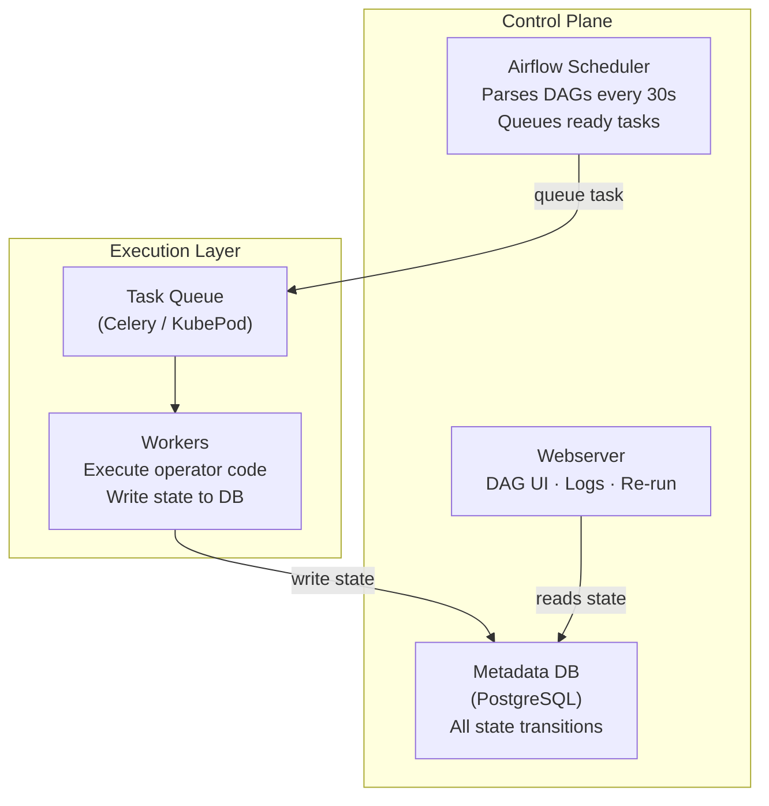
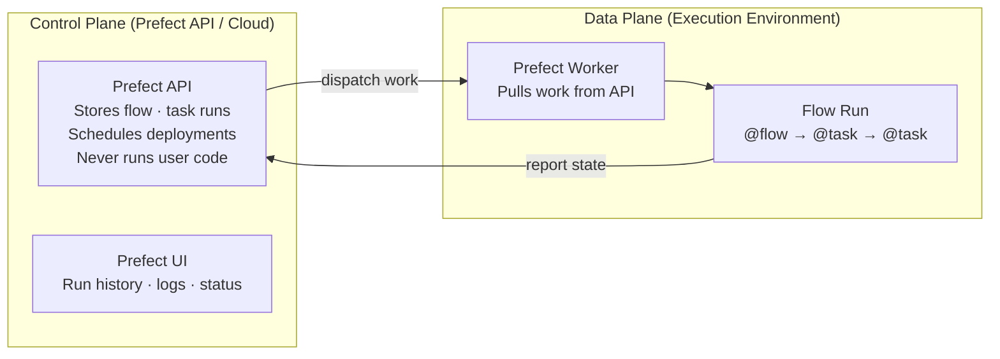

---
tags:
  - deep-dive
  - data-engineering
  - orchestration
---

# Prefect vs Airflow: Orchestration Philosophy and the Evolution of DAGs

*See also: [Why Most Data Pipelines Fail](why-most-data-pipelines-fail.md) — the failure modes that orchestrator selection affects but cannot fully address.*

**Themes:** Data Architecture · Orchestration · Ecosystem

---

## Opening Thesis

Airflow represents a mature, battle-tested approach to workflow orchestration in which the pipeline topology — the directed acyclic graph of tasks and their dependencies — is the central abstraction. This is orchestration organized around structure.

Prefect represents a later philosophy in which ordinary Python code is the central abstraction, and the orchestration semantics (retries, state tracking, scheduling, observability) are applied to that code with minimal modification. This is orchestration organized around behavior.

Neither is universally superior. The practical difference is one of design emphasis: Airflow forces you to think about your pipeline as a graph of tasks before writing the code that executes them; Prefect allows you to write the code first and apply orchestration semantics afterward. Both approaches produce schedulable, observable, retry-capable pipelines. The developer experience, operational overhead, and failure semantics differ in ways that are consequential at different organizational scales and maturity levels.

---

## Historical Context

### Airflow's Origins

Apache Airflow was created at Airbnb in 2014 and open-sourced in 2015. It emerged from a specific context: a large data engineering team managing hundreds of interdependent batch jobs, previously coordinated by cron with manual dependency tracking. The core insight was that batch job dependencies form a directed acyclic graph, and making that graph explicit — defining tasks, their inputs and outputs, and their dependency relationships — would make the pipeline maintainable, observable, and operable.

Airflow's DAG-first design reflects this origin. A DAG file is a Python file, but its purpose is not to describe computation — it is to describe structure: which tasks exist, how they depend on each other, when they should run, and how failures should propagate. The actual computation happens in operators (BashOperator, PythonOperator, KubernetesPodOperator), which are instantiated within the DAG definition. The DAG is the orchestration artifact; the operators are the execution artifacts.

This separation of structure (DAG) from execution (operators) was a deliberate design decision that has significant consequences. It makes the pipeline topology inspectable, visualizable, and static — the dependency graph can be analyzed before any execution. It also makes DAGs awkward to write for dynamic workloads where the task set is not known until runtime.

### Prefect's Philosophy

Prefect was founded in 2018 with an explicit critique of the Airflow model, articulated in a blog post titled "The Perfect DAG." The critique was that Airflow's DAG-first design made simple things complicated: writing Python code and having it orchestrated requires wrapping it in DAG definitions, operators, and Airflow-specific patterns rather than writing the code naturally and adding orchestration afterward.

Prefect 1.x implemented this philosophy with decorators and context managers that added orchestration semantics to Python functions without restructuring them as DAG operators. Prefect 2.x (2022) restructured substantially around a hybrid model: flows and tasks are decorated Python functions, with the flow defining the execution boundary and tasks defining the units of state tracking and retry logic.

The key innovation is the separation of the control plane from the execution environment. Prefect's control plane (Prefect Cloud or self-hosted Prefect Server) tracks state, stores results, handles scheduling, and provides the UI — but does not execute the code itself. Execution happens in whatever environment the flow is deployed to: a Docker container, a Kubernetes job, a local subprocess, or a cloud function. This architecture allows the orchestration semantics to travel with the code without coupling the code to a specific runtime environment.

---

## Execution Models

### Airflow Scheduler Architecture



The metadata database (PostgreSQL in production) is Airflow's single point of truth and its primary operational vulnerability. Every state transition — every task start, success, failure, retry, and skip — is a database write. At high concurrency (hundreds of simultaneous tasks), the metadata database becomes a contention point. Scheduler performance degrades as the number of DAGs and tasks grows; large Airflow deployments require careful scheduler tuning and metadata database maintenance.

DAG parsing is a recurring source of operational problems. The scheduler parses every DAG file on a short cycle to detect changes. DAG files that perform expensive operations at parse time — database queries, API calls, complex imports — add latency to the parsing cycle and may prevent the scheduler from detecting new tasks in time for their scheduled run. This requires careful discipline in DAG file design: DAG files should be pure structure definitions, not executable business logic.

### Prefect Execution Model



The separation of control plane and execution environment is Prefect's defining architectural property. Prefect's API server orchestrates (tracks state, evaluates schedules, stores results) but never executes user code. User code runs wherever a Prefect worker is deployed — on a developer's laptop, in a Docker container, in a Kubernetes cluster, or in a cloud serverless function. This decoupling has significant operational advantages: the Prefect API can be managed service (Prefect Cloud) while execution happens in the organization's own infrastructure with full access to internal network resources, secrets, and compute.

The worker architecture also changes the cost model: Prefect Cloud charges per user and per run at different pricing tiers, not per compute resource. The compute itself runs in the organization's infrastructure, so the cost of execution is borne by the cloud provider or on-premise hardware, not the orchestration vendor.

---

## Failure Semantics

### Airflow Task Retries

Airflow's retry model operates at the task level: a failed task is retried up to a configured maximum, with a configurable retry delay. The task receives no information about why it failed beyond the exception raised; retry logic is implicit in the configuration rather than explicit in the task code.

Task failure propagation follows the dependency graph: a failed task marks its downstream dependencies as "upstream_failed," which prevents them from executing. This cascading behavior is correct for pipelines where downstream tasks cannot produce valid output without the upstream output, but it prevents partial execution of the pipeline for independent branches that do not depend on the failed task.

Airflow's state model is binary for most purposes: a task instance is either running, succeeded, failed, skipped, or upstream_failed. There is no built-in concept of "partially completed" or "completed with warnings." Pipelines that need to express more nuanced outcomes — a task that succeeds but produces empty output, or a task that completes with data quality warnings — require custom operator implementations or sensor patterns.

### Prefect State Transitions

Prefect's state model is more expressive. States include Completed, Failed, Running, Cancelled, Crashed, Pending, and importantly, Paused (for human-in-the-loop workflows) and Scheduled. States carry associated data: a Completed state includes the return value of the task; a Failed state includes the exception; a Scheduled state includes the scheduled start time.

Prefect supports state hooks — callbacks that execute when a task or flow enters a particular state. A flow that transitions to Failed can trigger a notification, log additional context, or initiate a remediation action as part of its state transition, without external monitoring infrastructure detecting the failure and acting on it separately.

Dynamic task generation — creating tasks at runtime based on the results of earlier tasks — is a first-class capability in Prefect. A flow that reads a list of files from S3 and processes each file can generate one task per file at runtime, with each task independently tracked, retried, and observable. This pattern requires significant complexity in Airflow (dynamic task mapping was added in Airflow 2.3 but is more constrained than Prefect's equivalent).

---

## Developer Experience

### Airflow DAG DSL

An Airflow DAG is written in Python, but the Python is used to construct an object model rather than to describe computation:

```python
with DAG(
    dag_id="example_pipeline",
    schedule="@daily",
    start_date=datetime(2024, 1, 1),
    catchup=False,
) as dag:
    extract = PythonOperator(
        task_id="extract",
        python_callable=extract_fn,
    )
    transform = PythonOperator(
        task_id="transform",
        python_callable=transform_fn,
    )
    extract >> transform
```

The `>>` operator defines dependency; the operators instantiate task definitions. The actual functions (`extract_fn`, `transform_fn`) are referenced but not called; Airflow calls them at execution time. This structure separates the definition of the pipeline from its execution cleanly, but it imposes a non-Pythonic pattern on developers: the DAG definition and the execution logic are architecturally separate, even if they live in the same file.

Testing Airflow DAGs requires either a running Airflow instance or the use of Airflow's testing utilities, which simulate the Airflow context but are not identical to the production runtime. DAG unit tests are possible but require discipline; the boundary between "testing the DAG structure" and "testing the operator logic" is often unclear.

### Prefect Python-Native Flows

A Prefect flow is a decorated Python function:

```python
@task
def extract():
    return fetch_data()

@task
def transform(data):
    return process(data)

@flow
def example_pipeline():
    data = extract()
    result = transform(data)
    return result
```

The flow reads as ordinary Python. The `@flow` and `@task` decorators add orchestration semantics — state tracking, retry configuration, result caching, concurrency limits — without restructuring the code. The flow can be called directly in tests, in a Python shell, or in a Jupyter notebook without any Airflow-equivalent infrastructure.

This testability advantage is significant. A Prefect flow is a Python function; it can be tested with standard Python testing tools (pytest, unittest) without a running orchestrator. The behavior in test and in production differs only in the presence of the Prefect backend recording state — the logic is identical.

---

## Scaling Models

### Airflow at Scale

Airflow scales the executor layer to distribute task execution across a worker pool. The CeleryExecutor uses Redis or RabbitMQ as a task queue and distributes work across any number of Celery worker processes. The KubernetesExecutor launches a separate Kubernetes pod for each task, providing complete isolation and horizontal scaling at the cost of pod startup latency (typically 10–60 seconds per task, depending on image size and cluster capacity).

The scheduler itself does not scale horizontally in a useful way: Airflow 2.x supports multiple scheduler replicas for high-availability (one active, others standby), but the scheduler is not designed to distribute scheduling work across replicas. This means scheduler throughput is bounded by a single instance, which becomes a bottleneck at very high task volumes (hundreds of tasks per minute).

### Prefect at Scale

Prefect's architecture separates scheduling concerns (handled by the API) from execution concerns (handled by workers). Multiple workers can be deployed across different environments — different cloud regions, different Kubernetes namespaces, different machine types — and work pools route flows to appropriate workers based on deployment configuration. This allows Prefect deployments to scale execution horizontally without bottlenecks in the control plane, because the control plane (Prefect Cloud or self-hosted API) does not execute code and scales independently.

Prefect's horizontal execution scaling is straightforward: add more workers. Workers are stateless processes that poll the Prefect API for work and execute flows in their local environment. The infrastructure provisioning for each flow run can be parameterized: a data transformation flow might run on small instances, while a model training flow runs on GPU-enabled instances, all scheduled by the same Prefect deployment.

---

## Operational Burden

### Self-Hosted Airflow

A production-grade self-hosted Airflow deployment requires:

- **Metadata database**: PostgreSQL with appropriate sizing, backup, and high-availability configuration. Database performance degrades as DAG count and task volume grow; regular maintenance (vacuuming, index management) is required.
- **Scheduler**: stateful component requiring monitoring and restart management. The scheduler must parse all DAG files frequently; large DAG repositories require tuning of parsing parallelism and caching.
- **Worker pool**: Celery workers or Kubernetes executor configuration with appropriate resource limits.
- **Web server**: stateless but requires database connection pool management.
- **Message broker**: Redis or RabbitMQ for CeleryExecutor; not required for KubernetesExecutor.

The Astronomer managed Airflow platform reduces this operational burden at a cost that scales with usage. Google Cloud Composer and Amazon MWAA provide managed Airflow environments in their respective cloud ecosystems, trading some configuration flexibility for operational simplicity.

### Prefect Trade-offs

Prefect Cloud (managed control plane) eliminates the need to operate the API server, metadata database, and scheduler infrastructure. The team operates only the workers, which are simpler stateless processes. The cost of Prefect Cloud scales with the number of flow runs and the number of users, which is predictable and not directly tied to the complexity of the Airflow metadata database problem.

Self-hosted Prefect Server is available as an open-source alternative to Prefect Cloud. It requires operating a PostgreSQL database and a Python API server, which is substantially simpler than the full Airflow deployment (no scheduler process, no message broker, no executor configuration beyond worker deployment). The self-hosted option is appropriate for organizations with strict data residency requirements or with the operational capacity to manage the infrastructure.

Migration from Airflow to Prefect is not trivial. Airflow DAGs are not mechanically convertible to Prefect flows; the operator pattern and the flow-plus-task pattern require different code organization. Migration typically involves rewriting pipelines, which requires time investment proportional to the size of the DAG codebase and the complexity of the operator patterns in use. The business case for migration must account for this cost.

---

## Decision Framework

**Small team, straightforward batch pipelines, limited orchestration expertise**: Prefect's Python-native model and Prefect Cloud's managed control plane reduce the operational overhead and the learning curve. The ability to test flows without a running orchestrator makes development faster. The Prefect Cloud free tier supports small-scale usage without infrastructure investment.

**Large team, established Airflow deployment, complex interdependencies**: the cost of migrating from Airflow to Prefect must be weighed against the incremental improvements Prefect provides. If the existing Airflow deployment is stable and the team is productive with the DAG model, migration is rarely worth the disruption. The investment is better directed at improving observability, data contracts, and ownership clarity within the Airflow framework.

**Dynamic workloads (task set determined at runtime)**: Prefect's dynamic task mapping is more ergonomic than Airflow's equivalent. If a significant fraction of pipelines involve fan-out over runtime-determined collections, the developer experience advantage of Prefect compounds.

**Multi-tenant pipelines (multiple teams sharing infrastructure)**: Airflow's DAG namespace and RBAC model provide more mature multi-tenancy controls than Prefect. Large organizations with multiple teams sharing an orchestrator may find Airflow's permission model more appropriate.

**Regulated environment requiring detailed audit trail**: both platforms record task-level execution history. Airflow's metadata database provides SQL-queryable execution history; Prefect's API provides the equivalent through its REST interface and UI. Neither provides regulatory-grade audit capabilities out of the box; both require supplementary lineage and provenance tooling for regulated use cases.

**The orchestrator is not the architecture.** A pipeline's reliability, correctness, and maintainability depend primarily on ownership clarity, schema contracts, observability investment, and organizational incentives — not on whether the scheduler is Airflow or Prefect. Choosing the wrong orchestrator is a recoverable mistake; choosing the wrong organizational model for data ownership is not.

!!! tip "See also"
    - [Why Most Data Pipelines Fail](why-most-data-pipelines-fail.md) — the failure modes that neither orchestrator resolves by itself
    - [Observability vs Monitoring](observability-vs-monitoring.md) — the diagnostic layer needed to understand what orchestrators are actually doing
