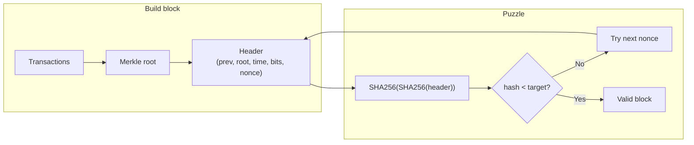
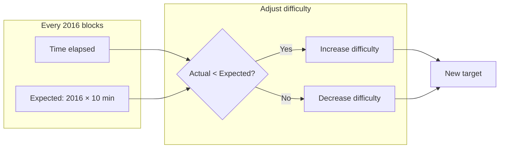

---
tags:
  - deep-dive
  - cryptography
  - distributed-systems
  - consensus
---

# Inside Proof of Work: How Hash Puzzles Secure Bitcoin

**Themes:** Distributed Systems · Cryptography · Consensus

*Proof of Work is the consensus mechanism that secures Bitcoin and several other blockchains. For how blockchains use hash-linked structures and Merkle trees, see [Blockchain vs Hashchain](blockchain-vs-hashchain.md) and [Merkle Trees Explained](merkle-trees-explained.md). For the hardware and infrastructure that perform the work, see [Building a Bitcoin Mining Rig](building-a-bitcoin-mining-rig.md).*

---

## 1. Introduction: The Problem of Distributed Consensus

In a decentralized payment or ledger system, there is no central server to decide which transactions happened and in what order. Every participant could tell a different story. The core challenge is **consensus**: how can a network of mutually distrusting nodes agree on a single, ordered history of transactions?

That problem implies the **double-spend problem**. If Alice has one unit of value and sends it to Bob, what stops her from also sending the same unit to Carol? Without a shared notion of "which transaction came first" and "which one counts," both could be accepted by different parts of the network. Only one can be valid. The system needs a way to **order** transactions and to make that ordering **expensive to reverse** so that once a transaction is "settled," rewriting history is impractical.

**Consensus mechanisms** exist to solve this: they define how the network chooses the next block (the next batch of transactions) and how conflicts (e.g. two valid blocks at the same height) are resolved. **Proof of Work (PoW)** is one such mechanism. It ties the right to propose the next block to the solution of a **computational puzzle** that is costly to solve but cheap to verify. This deep dive explains how that puzzle works, why it secures the network, and how difficulty and incentives keep the system stable.

---

## 2. The Idea Behind Proof of Work

The core idea of Proof of Work is simple:

- To **propose** a new block, a participant must produce evidence of having done a certain amount of **computational work**.
- The **work** is defined so that it cannot be faked: it must be done by repeatedly trying many inputs until one satisfies a condition (e.g. a hash below a target).
- **Verification** is trivial: anyone can check the solution with a single hash computation. So the asymmetry is deliberate: **producing** a valid block is expensive; **checking** it is cheap.

This asymmetry is what makes PoW useful for consensus. If proposing a block were cheap, an attacker could flood the network with blocks or try many alternative histories. If verification were expensive, nodes could not afford to validate the chain. PoW makes honest block production costly (so that attacking is costly too) while keeping validation lightweight so that the network can converge on the same chain.

The concept predates Bitcoin: hash-based proof of work was used for spam resistance (e.g. Hashcash) and other applications. Bitcoin applied it to **block proposal**: only a block whose header hashes below the current **target** is valid. Miners search for such a header by varying a **nonce** (and other fields) until the hash succeeds.

---

## 3. Hash Puzzles

In Bitcoin, the puzzle is defined over the **block header**. The header is a fixed-size structure (80 bytes in Bitcoin) containing:

- Protocol version, previous block hash, Merkle root of transactions, timestamp, difficulty target (encoded as "bits"), and **nonce**.

The **block hash** is the double SHA-256 of this header: \(H(H(\text{header}))\). The puzzle: find a header (and thus a nonce, and possibly other malleable fields) such that the **numeric value** of the block hash is **below** a threshold called the **target**.

**Target and difficulty:** The target is a 256-bit number. The smaller the target, the fewer hash values are below it, so the harder it is to find a valid block. **Difficulty** is inversely related to target (e.g. difficulty = max_target / current_target). So higher difficulty means a smaller target and more expected work per block.

**Leading zeros:** People often say "the hash must have N leading zeros." That is an approximation: the condition is really "hash interpreted as an integer must be less than target." When the target is chosen so that valid hashes are a tiny fraction of the 256-bit space, valid hashes do tend to have many leading zero bits. The exact rule is **hash < target**, not "count zeros."

**Nonce search:** The miner holds fixed: previous block hash, Merkle root (once transactions are chosen), timestamp (within bounds), and difficulty. They then iterate over **nonce** values (0, 1, 2, …). For each nonce they form the header, compute the double SHA-256, and check if it is below the target. If not, they try the next nonce. The nonce is 32 bits, so about 4 billion tries per Merkle root. If no nonce works (e.g. bad luck), the miner can change the timestamp or add a **coinbase** transaction (which changes the Merkle root) and try again. So the search space is effectively unbounded.

**Example (conceptual):** Suppose the target is set so that roughly one in \(2^{20}\) hashes is valid. Then on average a miner needs to try about \(2^{20}\) nonces (and possibly new blocks) before finding a valid hash. Verification is one double SHA-256 and one integer comparison.

---

## 4. Mining Process

Mining, in practice, follows this loop:

1. **Collect transactions** from the mempool (or other sources). Select which to include and in what order. Optionally include a **coinbase** transaction that pays the block reward and fees to the miner.
2. **Build block candidate**: Construct the Merkle tree of transactions; put the Merkle root in the header. Set previous block hash, timestamp (within protocol rules), and difficulty (from current consensus rules). Set nonce to an initial value (e.g. 0).
3. **Compute hash repeatedly**: Compute the block hash (double SHA-256 of header). If the hash is not below the target, increment the nonce (or change timestamp/coinbase if nonce space is exhausted) and repeat.
4. **Find valid hash**: When the hash is below the target, the block is valid.
5. **Broadcast block**: Send the full block (header + transactions) to the network. Other nodes receive it, verify the hash and the transactions, and if valid they append it to their chain and relay it.

**Verification** by other nodes: Check that the block hash is below the current target, that the previous block hash matches the chain tip, that the Merkle root matches the transactions, that transactions are valid (signatures, no double-spend within the block and against the chain), and that the block size and other consensus rules are satisfied. Verification is \(O(n)\) in block size (hashing the header once, checking the Merkle tree and transactions); it does not require redoing the nonce search. So **producing** is hard; **verifying** is easy.

---

## 5. Difficulty Adjustment

If more miners join the network (or hardware gets faster), blocks would be found **faster** unless the puzzle is made harder. If miners leave, blocks would slow down. Bitcoin aims for a **stable average block time** (about 10 minutes) so that issuance and confirmation times are predictable.

**Difficulty adjustment** achieves this. Periodically (in Bitcoin, every 2016 blocks), the protocol looks at how long those 2016 blocks took. If they were found faster than 2016 × 10 minutes, difficulty is **increased** (target decreased). If they were found slower, difficulty is **decreased** (target increased). The adjustment is bounded (e.g. no more than 4× up or down per period) to avoid wild swings.

So:

- **Block time target**: ~10 minutes per block.
- **Network hash rate**: Total hashes per second across all miners. As hash rate goes up, more blocks would be found per unit time unless difficulty rises.
- **Adjustment interval**: Every 2016 blocks, difficulty is recalculated so that the **expected** time for the next 2016 blocks is again 2016 × 10 minutes.

The mathematical goal is to keep **expected blocks per unit time** constant. Difficulty is the protocol’s knob: it tunes how much work is required per block so that block production rate stays roughly stable regardless of total hash power.

---

## 6. Security Model

Proof of Work secures the chain under the assumption that a **majority of the honest hash power** follows the protocol. The security argument is economic and computational:

- **Proposing a block** requires finding a hash below the target. That takes expected work proportional to difficulty. So the **cost** of producing one valid block is proportional to the current difficulty (and thus to the total hash rate, in equilibrium).
- **Rewriting history** (e.g. to reverse a transaction) would require building an **alternative chain** that replaces the chain from the point of the transaction backward (or from a recent block) and then **outpacing** the honest chain. To do that, the attacker would need to redo the proof-of-work for all those blocks and then continue finding blocks faster than the rest of the network. So the attacker would need **more hash power than the honest majority** over the period of the attack.
- **51% attacks**: If an attacker controls more than half of the total hash rate, they can in principle produce blocks faster than the rest and eventually replace the chain (e.g. double-spend or censor). The "51%" is a shorthand; the exact threshold depends on timing and strategy. The point is that security relies on **no single party (or coalition) controlling a majority of hash power**.
- **Chain reorganization**: When two valid blocks exist at the same height (a tie), nodes may temporarily disagree on the chain tip. The protocol rule is to extend the **longest valid chain** (or in Bitcoin, the chain with most cumulative work). So the branch that gets more subsequent work becomes the canonical one. An attacker who cannot outpace the honest chain cannot force a long reorg.

So PoW protects the network by making **attack cost** align with **defense cost**: to undo or override consensus, you must do more work than the honest chain. There is no way to fake work; the only way to win is to have more hash power (and spend the energy) than the rest.

---

## 7. Economic Incentives

Miners are compensated so that honest block production is profitable in expectation:

- **Block subsidy**: The protocol creates new currency (e.g. new bitcoin) and awards it to the miner of each block. In Bitcoin, this amount halves periodically (roughly every four years) and will eventually go to zero.
- **Transaction fees**: Users can attach fees to transactions. Miners include transactions in blocks and collect the fees. As the subsidy shrinks, fees are expected to make up a larger share of miner revenue.

Incentives align with security when:

- **Honest mining** (finding valid blocks and broadcasting them) is more profitable than **withholding** blocks or **attacking** (e.g. double-spend). Rational miners prefer to earn rewards on the accepted chain.
- **Cost of attack** (acquiring and running enough hash power to overwhelm the network) exceeds the **gain** from the attack (e.g. double-spend amount, or value of disrupting the system). So the system is secure as long as the economic value secured by the chain is small relative to the cost of mounting a majority attack—or as long as the community and ecosystem would respond (e.g. hard fork, social coordination) in ways that make attack unattractive.

The design is deliberately simple: work is rewarded; verification is cheap; the longest (most-work) chain wins. Complexity lives in the economic and game-theoretic details (e.g. fee markets, mining pool centralization), but the core mechanism is work → reward → security.

---

## 8. Mining Hardware Evolution

Mining has evolved toward **specialized hardware** because the puzzle is a **fixed function**: double SHA-256. General-purpose hardware cannot compete on energy efficiency (hashes per joule) with chips designed only for that task.

- **CPU**: Early Bitcoin mining ran on CPUs. Throughput was low; efficiency was poor. Quickly obsolete.
- **GPU**: GPUs offered more parallelism and better throughput than CPUs. Used for a while until dedicated hardware appeared.
- **FPGA**: Field-programmable gate arrays allowed custom pipelines for SHA-256. Better efficiency than GPUs but required design effort and were a stepping stone.
- **ASIC**: Application-specific integrated circuits designed solely for Bitcoin’s hash function. They dominate today: orders of magnitude more hashes per watt than CPUs or GPUs. Mining is now an **industrial activity** with large facilities and specialized chips (e.g. Antminer, WhatsMiner).

So **specialized hardware dominates** because the proof-of-work function is fixed and simple. There is no benefit to flexibility; the only goal is to maximize hash rate per dollar and per watt. For more on the infrastructure that runs this hardware, see [Building a Bitcoin Mining Rig](building-a-bitcoin-mining-rig.md).

---

## 9. Energy Consumption Debate

Proof of Work is **energy-intensive by design**: the security of the chain is tied to the cost of doing the work. More hash power (and thus more energy) means more cost to attack. Critics argue that this energy use is wasteful or environmentally harmful; defenders argue that the energy is the **cost of decentralized security** and that comparisons should account for what the system provides (e.g. permissionless, censorship-resistant settlement).

**Technical facts:**

- **Energy cost as security**: The work is intentionally expensive. If it were cheap, an attacker could afford to outpace the honest chain. So energy consumption is not an implementation bug; it is part of the security model.
- **Comparisons**: Other consensus mechanisms (e.g. Proof of Stake) do not use hash puzzles and typically consume far less energy per unit of "throughput." The trade-off is different trust and economic assumptions (e.g. stake at risk vs hardware and electricity).
- **Renewable and stranded energy**: A significant share of mining runs on hydro, wind, or stranded/curtailed energy. Siting near cheap or otherwise underused power is economically rational and can reduce the carbon footprint of mining. This does not eliminate the energy use but changes its source and impact.

A balanced technical perspective: PoW **deliberately** converts energy into security. Whether that trade-off is acceptable is a policy and values question. The engineering reality is that reducing energy use in PoW (e.g. by lowering difficulty) would reduce security unless other mechanisms (e.g. PoS, trusted validators) are introduced.

---

## 10. Proof of Work vs Alternative Consensus

| Aspect | Proof of Work | Proof of Stake | BFT (e.g. PBFT) |
|--------|----------------|----------------|------------------|
| **Resource** | Compute (hash rate), energy | Capital at risk (stake) | Messages among validators |
| **Cost to attack** | Acquire majority hash power + energy | Acquire majority stake (and risk slashing) | Corrupt or control &gt; 1/3 of validators |
| **Energy** | High | Low | Low |
| **Permission** | Open (anyone can mine) | Often permissioned or semi-open | Usually fixed validator set |
| **Finality** | Probabilistic (reorgs possible) | Often probabilistic or long-range issues | Deterministic once committed |
| **Complexity** | Simple puzzle; complex ecosystem | Complex rules, slashing, identity | Protocol and networking complexity |

**Proof of Stake**: Validators lock capital; the protocol selects who proposes blocks (e.g. by stake or randomness). No hash puzzle; energy use is minimal. Trade-offs: long-range attacks, stake concentration, and "nothing at stake" style issues require careful design. Many modern chains use PoS or hybrid designs.

**BFT systems**: A fixed set of validators run a Byzantine-fault-tolerant consensus algorithm (e.g. PBFT, Tendermint). Fast finality and low energy, but the set of validators is typically known and often permissioned. Not suitable for fully open, permissionless networks in the same way as PoW or public PoS.

PoW remains attractive for its **simplicity** (one puzzle, one rule: longest chain wins) and **open participation** (anyone with hardware and power can mine). Its main cost is energy and the resulting centralization pressure (cheap power and scale dominate).

---

## 11. Attack Scenarios

- **Selfish mining**: A miner finds a block but withholds it, then mines the next block and broadcasts both to invalidate others’ work and claim more reward. Mitigations include protocol rules that discourage withholding (e.g. honest nodes orphan the attacker’s branch when they see a competing block) and the fact that withholding is risky (others may find the next block first). The exact profitability of selfish mining depends on parameters; the protocol is designed so that honest mining is usually the best response.
- **Majority (51%) attack**: With more than half of hash power, an attacker can produce the longest chain and reverse or censor transactions. Mitigation is **decentralization**: no single party should control a majority. The security assumption is that majority hash power is honest or at least not coordinated to attack.
- **Block withholding**: A miner in a pool might withhold a valid block to harm the pool or to perform a targeted attack. Pools use various schemes (e.g. share-based payouts, verification) to detect or limit damage. The underlying protocol cannot prevent a miner from withholding; it can only make the chain robust when the **broadcast** chain is produced by honest miners.

In all cases, the **cost** of the attack (hash power, stake, or coordination) must be weighed against the **gain**. PoW’s job is to make the cost of attacking the chain (e.g. majority hash power) high enough that rational actors prefer to participate honestly.

---

## 12. Why Proof of Work Still Matters

Despite the rise of Proof of Stake and other mechanisms, Proof of Work remains important:

- **Simplicity**: The rule set is small. "Find hash below target; longest chain wins; adjust difficulty every N blocks." No slashing logic, no validator selection randomness, no long-range attack fixes. That makes reasoning about security and implementation easier.
- **Robustness**: PoW has been battle-tested in Bitcoin since 2009. Failures have been in implementations (bugs, exchanges) or in economic/centralization dynamics, not in the core puzzle or longest-chain rule. The security model is well understood.
- **Open participation**: In principle, anyone can mine with hardware and electricity. In practice, economies of scale and specialization dominate, but the barrier is economic and physical, not identity or permission. That property is valued in permissionless systems.
- **Alignment of cost and security**: Security is tied to something real (energy and hardware cost). There is no "cheap" way to simulate work. Alternatives (e.g. stake) introduce different trust and game-theoretic assumptions.

PoW is not the only way to achieve decentralized consensus, but it is a clear and durable design. Newer mechanisms optimize for different goals (energy, finality, throughput); PoW optimizes for **simple, work-based security** and open participation at the cost of energy.

---

## 13. Conclusion

Proof of Work turns **computational effort** into a **consensus mechanism**. By requiring miners to solve a hash puzzle before proposing a block, the protocol ensures that:

- Proposing a block is **expensive** (work must be done).
- Verifying a block is **cheap** (one hash check).
- Rewriting history requires **redoing** that work and **outpacing** the honest chain, which is prohibitively expensive for an attacker without majority hash power.

Difficulty adjustment keeps block production stable as hash rate changes. Economic incentives (block subsidy and fees) reward honest mining so that rational participants prefer to extend the canonical chain. The result is a **security protocol for decentralized consensus**: the chain is secure as long as a majority of the hash power is honest or at least not attacking. Proof of Work is not merely a cryptocurrency feature—it is a distributed-systems mechanism that uses hash puzzles and economic incentives to achieve agreement without a central authority.

!!! tip "See also"
    - [Blockchain vs Hashchain](blockchain-vs-hashchain.md) — Hash chains, block structure, and consensus in blockchains
    - [Merkle Trees Explained](merkle-trees-explained.md) — How transaction Merkle trees and Merkle proofs work in blocks
    - [Building a Bitcoin Mining Rig](building-a-bitcoin-mining-rig.md) — Hardware and infrastructure that perform Proof of Work
