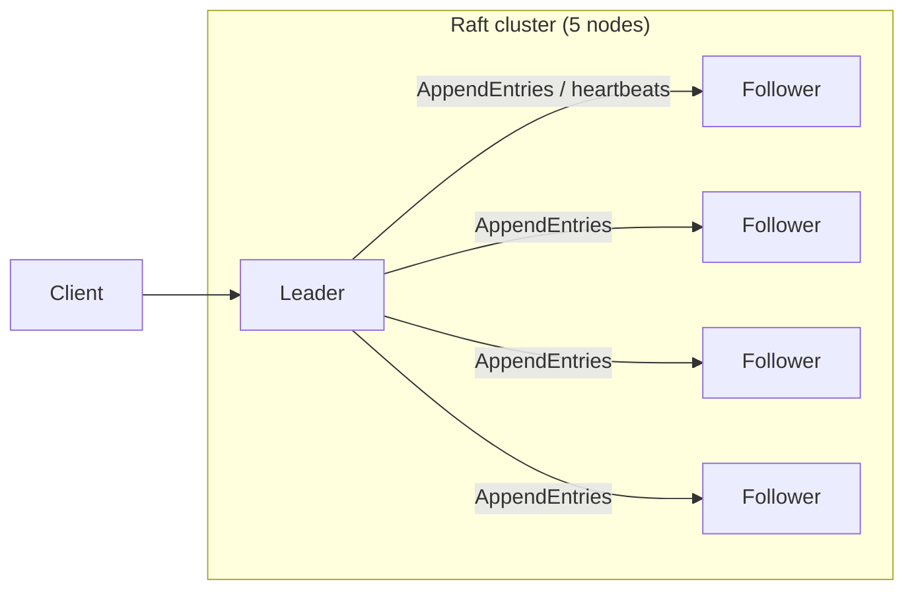

---
tags:
  - deep-dive
  - distributed-systems
  - consensus
  - systems-design
---

# Inside Raft: The Distributed Consensus Algorithm That Powers Modern Systems

**Themes:** Distributed Systems · Consensus · Infrastructure

*Raft is a consensus algorithm for replicated logs; it is used by etcd, Consul, TiKV, and many distributed databases. For how consensus fits into broader distributed architecture, see [Distributed Systems Architecture](distributed-systems-architecture.md). For the limits of scaling and coordination in distributed systems, see [Distributed Systems and the Myth of Infinite Scale](distributed-systems-myth-of-infinite-scale.md).*

---

## 1. Introduction: Why Distributed Systems Need Consensus

When data or state is **replicated** across multiple nodes for fault tolerance or performance, those replicas must agree on the **same sequence of updates**. Otherwise you get:

- **Split brain:** Two or more nodes each believe they are the authority. They accept different writes and diverge. Clients see inconsistent data depending on which node they hit.
- **Inconsistent replicas:** After a failure or partition, some replicas have one history and others another. Without a clear rule for "which history wins," the system cannot recover consistently.
- **Leader election:** If one node is designated the leader (e.g. for accepting writes), the group must agree on who the leader is. When the leader fails, the group must agree on a new one. That agreement is itself a consensus problem.

**Consensus algorithms** solve this: they allow a set of nodes to agree on a sequence of values (a **replicated log**) despite failures and message delays. Once a value is **committed** in the log, every correct node eventually has it and applies it in the same order. That ordered log can drive a **replicated state machine**: each node applies the same commands in the same order, so they stay in sync. Raft is one such algorithm—designed for understandability while preserving safety and liveness. This document explains how Raft works, why it is structured the way it is, and where it is used in practice.

---

## 2. The Goals of Raft

Raft was designed (Diego Ongaro and John Ousterhout, 2014) as an alternative to **Paxos** that would be easier to understand and implement. Its design principles:

- **Understandability:** The algorithm is decomposed into clear pieces—leader election, log replication, safety—so that implementers and operators can reason about it. Paxos is correct but notoriously hard to teach and to implement correctly.
- **Safety:** Raft guarantees that committed log entries are never lost or reordered and that no two nodes commit different values for the same index. So the replicated state machine stays consistent.
- **Liveness:** Under the usual assumptions (majority of nodes reachable, bounded message delays eventually), Raft eventually elects a leader and commits new entries. So the system makes progress.
- **Simplicity:** The protocol has a small number of message types and state transitions. Leader election and log replication are separated so that each can be understood and tested on its own.

Raft achieves the same fundamental guarantee as Paxos—replicated log consensus—but with a structure that has made it the dominant choice for infrastructure systems (datastores, coordination services, and control planes) where a single, well-understood algorithm is valued.

---

## 3. Raft Cluster Roles

Every node in a Raft cluster is in one of three roles at any time:

- **Leader:** There is at most one leader. The leader accepts client requests, appends entries to its log, and **replicates** them to followers. It sends periodic **heartbeats** (or AppendEntries with no new entries) to maintain authority. All client writes go to the leader.
- **Follower:** Followers are passive. They respond to RPCs from the leader (AppendEntries) and from candidates (RequestVote). They do not initiate requests. If they do not hear from the leader for a while, they assume the leader is dead and may transition to **candidate**.
- **Candidate:** A node that is **running for leader**. It increments its term, votes for itself, and sends RequestVote to other nodes. If it receives a **majority** of votes in that term, it becomes leader. If another node wins, or a new term is discovered, it steps down to follower.

Terms are monotonically increasing integers. Each term has at most one leader. Messages carry the sender’s current term; if a node sees a higher term, it updates its own term and typically steps down to follower. This ensures that stale leaders or candidates are superseded.



---

## 4. Leader Election

When a **follower** does not receive heartbeats from the leader for a period (the **election timeout**), it assumes the leader has failed. It:

1. Transitions to **candidate**.
2. Increments its **term**.
3. Votes for **itself**.
4. Sends **RequestVote** RPCs to all other nodes, including its last log index and term (so voters can reject candidates whose log is behind).

Each node votes **at most once per term** (first-come-first-served for that term). A candidate that receives **votes from a majority** of the cluster (including its own) **wins** the election and becomes **leader**. It then sends heartbeats to all others to establish authority and prevent new elections.

If no candidate wins (e.g. split vote), the election **times out** and candidates start a new election with a higher term. Election timeouts are typically **randomized** (within a range) so that not all followers become candidates at once; one usually wins before others timeout again. When a candidate discovers a **higher term** (e.g. receives an AppendEntries from the new leader), it steps down to follower.

```mermaid
sequenceDiagram
    participant F1 as Follower 1
    participant F2 as Follower 2
    participant F3 as Follower 3
    Note over F1,F3: Leader failed; F1 times out first
    F1->>F1: Become candidate, term++
    F1->>F2: RequestVote(term)
    F1->>F3: RequestVote(term)
    F2->>F1: Vote granted
    F3->>F1: Vote granted
    Note over F1: Majority: become Leader
    F1->>F2: AppendEntries (heartbeat)
    F1->>F3: AppendEntries (heartbeat)
```

---

## 5. Log Replication

The leader maintains a **replicated log**: an ordered sequence of entries. Each entry has an **index**, a **term** (when it was created), and a **command** (the application payload).

**Normal operation:**

1. A client sends a command to the **leader**.
2. The leader **appends** the entry to its log (uncommitted).
3. The leader includes the new entry in the next **AppendEntries** RPC to followers (along with the previous log index and term, for consistency checking).
4. Followers receive AppendEntries. They check that their log matches the leader’s up to the previous index/term. If so, they append the new entry; if not, they reject and the leader may retry with an earlier index (log reconciliation).
5. When the entry has been **replicated to a majority** of nodes, the leader **commits** it (advances its commit index) and applies it to its state machine. It includes the commit index in future AppendEntries so that followers can commit and apply as well.
6. The leader returns the result to the client after commit (and typically after applying).

So **commit** means "replicated to a majority." Once committed, Raft’s safety guarantees ensure that the entry will remain in the log and that any future leader will have it (leader completeness). Followers eventually receive the commit index via AppendEntries and apply committed entries in order.

```mermaid
flowchart LR
    subgraph Leader["Leader"]
        LLog["Log: 1,2,3,4,5\n(5 not yet committed)"]
    end
    subgraph Followers["Followers"]
        F1Log["Log: 1,2,3,4,5"]
        F2Log["Log: 1,2,3,4"]
    end
    Leader -->|AppendEntries(5)| Followers
    Note1["Majority has 5 → commit 5"]
```

---

## 6. Safety Guarantees

Raft ensures the following (with proofs in the paper):

- **Election safety:** At most one leader per term. (Each node votes at most once per term; majority is required to win.)
- **Leader append-only:** The leader never overwrites or deletes entries in its log; it only appends. So once the leader has an entry, it is not lost by the leader.
- **Log matching:** If two logs have an entry with the same index and term, they agree on all entries up to that index. (Enforced by AppendEntries: the leader sends previous index/term; followers reject if their log does not match, and the leader backs up to find a matching prefix.)
- **Leader completeness:** If an entry is committed in a given term, it will appear in the logs of all leaders in future terms. (A candidate can only win if it has "all committed entries"—actually, Raft ensures that the candidate’s log is at least as up-to-date as any other log that could have committed. So the elected leader has every committed entry.)
- **State machine safety:** If a node has applied a log entry at an index to its state machine, no other node will ever apply a different entry at that index. (Follows from leader completeness and the fact that nodes apply in order: once committed, the entry is in every future leader’s log and will be applied everywhere.)

Together, these guarantee that the replicated log is consistent and that the state machines stay in sync.

---

## 7. Handling Failures

**Node crash:** A crashed node stops sending and receiving messages. It does not vote. When it recovers, it learns the current term (from incoming RPCs) and catches up its log via AppendEntries from the leader. If it was the leader, the remaining nodes will eventually time out and elect a new leader (assuming a majority is still up).

**Leader failure:** Followers stop receiving heartbeats. After election timeout(s), one or more become candidates and start an election. Once a new leader is elected, it accepts writes and replicates. The old leader, if it comes back, will see a higher term (e.g. in AppendEntries from the new leader) and step down. Any uncommitted entries from the old leader may be overwritten by the new leader (they were not on a majority, so they are lost; clients must retry).

**Network partition:** If the network splits so that no majority can communicate, no leader can be elected (no candidate can get a majority of votes). So the partition that has a majority can continue with a leader; the minority partition cannot commit new entries. When the partition heals, nodes in the minority see a higher term and follow the leader in the majority. So Raft tolerates **minority** failures; it cannot make progress if a **majority** is unreachable.

Raft **recovers** by: (1) electing a new leader when the old one is gone, (2) the new leader forcing its log on followers (by sending AppendEntries and backing up when there is a conflict), and (3) all nodes advancing commit index and applying. So after a failure, the cluster converges to a single log and a single leader.

---

## 8. Commit Mechanism

An entry is **committed** when the leader has replicated it to a **majority** of the cluster. The leader tracks the highest index that is on a majority; that index (and all preceding) are committed. The leader includes its **commit index** in AppendEntries so that followers learn what is committed and can **apply** those entries to their state machines in order.

**Why majority (quorum):** Any two majorities overlap in at least one node. So if one majority has committed entry X, any future leader must have been in some majority that had X—so the new leader’s log contains X (leader completeness). So committed entries survive leader changes.

**Applying:** Application to the state machine is done **after** commit, in log order. So the state machine is deterministic: same log → same state. Clients are typically replied to only after the leader has committed (and often after applying), so that a reply implies durability and consistency.

---

## 9. Real Systems Using Raft

- **etcd:** A distributed key-value store used as the backing store for **Kubernetes** and other systems. etcd uses Raft for leader election and log replication. All writes go to the leader; reads can be served by any node (or only the leader for linearizable reads). Cluster size is typically 3 or 5.
- **Consul:** HashiCorp’s service mesh and discovery tool. Consul uses Raft for its consensus tier (leader election and replication of the catalog and KV store). Raft is used in the "server" agents; "client" agents forward to servers.
- **TiKV:** A distributed key-value store (part of the TiDB ecosystem). TiKV uses Raft per region (shard); each region is a Raft group. So the data is sharded, and each shard is replicated and consistent via Raft.
- **CockroachDB, YugabyteDB:** Distributed SQL databases that use Raft (or Raft-like) replication for ranges or tablets. Writes go to the Raft leader for the relevant range; replication and commit follow the Raft model.
- **NATS JetStream, etc.:** Some message brokers and storage layers use Raft for metadata or for durable log replication.

Raft has become the default choice when a system needs **strong consistency** and **understandable** consensus with a **fixed replica set** (typically 3 or 5 nodes). It is not used for open, permissionless networks (where Proof of Work or Proof of Stake are used); it is used for **infrastructure** consensus.

---

## 10. Raft vs Paxos

| Aspect | Raft | Paxos |
|--------|------|-------|
| **Structure** | Single leader; explicit phases (election, replication) | Multiple roles (proposer, acceptor, learner); less obvious "leader" |
| **Understandability** | Designed to be teachable; one leader per term, clear log replication | Correct but subtle; many people get implementation details wrong |
| **Log** | One contiguous log; entries have index and term | Often presented as agreeing on a sequence of slots; multiple decidable instances |
| **Leader** | Explicit leader; all writes go through it | "Multi-Paxos" often uses a stable leader in practice, but the basic protocol does not require it |
| **Commit** | Committed when replicated to majority; commit index propagated in AppendEntries | Chosen when a majority of acceptors have accepted the value; similar in effect |
| **Implementation** | Many production implementations (etcd, Consul, etc.) | Fewer; often considered harder to implement correctly |

**Design trade-offs:** Raft sacrifices some flexibility (e.g. it is built around a single leader and a single log) for clarity. Paxos can be generalized in more ways (e.g. multi-decree, flexible roles) but at the cost of complexity. For most infrastructure needs—replicated log, small fixed cluster, strong consistency—Raft’s model is a good fit and easier to implement and operate. Paxos remains important in theory and in some systems; Raft dominates in practice for new implementations.

---

## 11. Implementation Considerations

**Log storage:** The Raft log can grow unbounded. Entries are appended; old entries are not modified. Storage must support append and read by index; compaction (see below) removes prefix.

**Snapshotting:** To bound log size, nodes periodically **snapshot** their state machine and **truncate** the log up to the last applied index. Snapshots are written to disk and can be sent to slow or new nodes so they can catch up without replaying the full log. Raft defines a snapshot RPC and how to handle log indices that have been discarded (e.g. send snapshot instead of AppendEntries for old indices).

**Cluster membership changes:** Adding or removing nodes changes the **size** of the cluster and thus what "majority" means. Changing membership incorrectly can cause two disjoint majorities (e.g. old config 3 nodes, new config 5 nodes—if not done carefully, old majority of 2 and new majority of 3 could both think they have majority). Raft and similar systems use **joint consensus** or **single-node change** protocols so that membership changes are safe. Details are in the extended Raft paper and in implementations (e.g. etcd’s membership API).

**Persistence:** For correctness, nodes must persist (to disk or equivalent) at least: current term, vote (if any) for current term, and the log. Otherwise after a crash and restart a node could forget it voted or forget log entries and violate safety. Many implementations also persist commit index and state machine snapshot.

---

## 12. Conclusion

Raft has become the **dominant consensus algorithm** for infrastructure systems because it provides the same safety and liveness as Paxos while being **easier to understand, implement, and operate**. Its structure—single leader per term, explicit log replication, majority commit—maps directly to how engineers think about replicated logs and state machines.

Systems that need **strong consistency** and **fault tolerance** with a **small, fixed set of replicas** (e.g. 3 or 5 nodes) routinely choose Raft. etcd, Consul, TiKV, and numerous distributed databases and control planes rely on it. Understanding Raft—leader election, log replication, commit, and failure recovery—is essential for anyone building or operating such systems.

!!! tip "See also"
    - [Distributed Systems Architecture](distributed-systems-architecture.md) — Where consensus fits in distributed system design
    - [Distributed Systems and the Myth of Infinite Scale](distributed-systems-myth-of-infinite-scale.md) — Coordination cost and the limits of distribution
    - [Why Most Kubernetes Clusters Shouldn't Exist](why-most-kubernetes-clusters-shouldnt-exist.md) — etcd (Raft) as part of Kubernetes control plane
