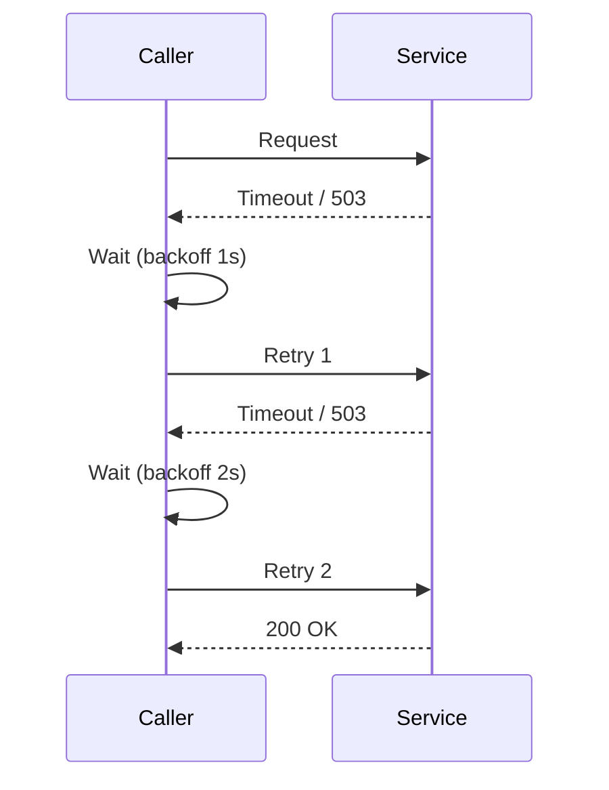
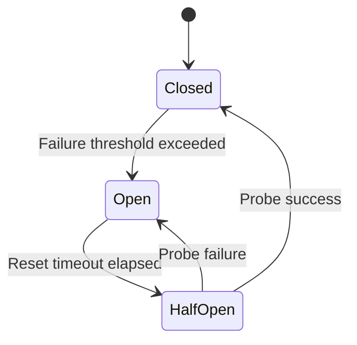
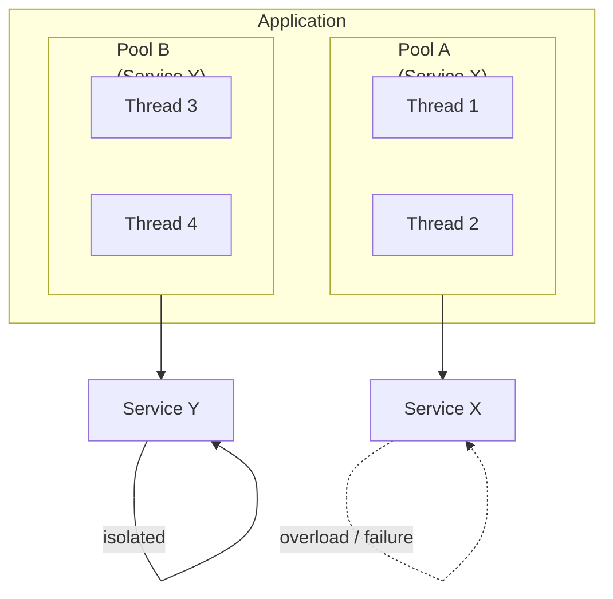
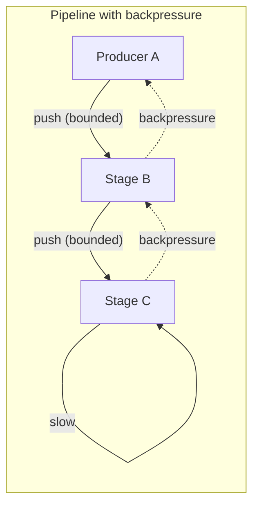

---
tags:
  - deep-dive
  - distributed-systems
  - resilience
  - operations
  - reliability
---

# Designing Resilient Distributed Systems: Retries, Circuit Breakers, and Backpressure

**Themes:** Distributed Systems · Reliability · Operations · Resilience

*Distributed systems fail constantly—nodes crash, networks partition, latency spikes, and one failure can cascade. This document explains the engineering patterns used in production to handle failures gracefully: retries with backoff, circuit breakers, timeouts, bulkheads, backpressure, load shedding, and the observability and chaos-engineering practices that make resilience actionable. For broader distributed-systems context, see [Distributed Systems Architecture](distributed-systems-architecture.md). For the distinction between monitoring and observability, see [Observability vs Monitoring](observability-vs-monitoring.md).*

---

## 1. Introduction: Failure is the Default

In a single machine or a tightly coupled monolith, failure is an exception: the process crashes, the disk fails, and the operator restarts or replaces the component. In a **distributed system**, failure is the **default**. Every node can fail independently. Every network link can drop, delay, or reorder messages. Clocks drift. Partial failures—where some components work and others do not—are the norm. A system that assumes components will usually be available will, under load or during an incident, amplify failure rather than contain it: timeouts stack, threads block, and one sick dependency can take down every caller.

**Resilience** is the property that the system **continues to provide acceptable service** (degraded or full) when components fail. It is achieved by design, not by hoping that failures are rare. This document describes the patterns used in real production systems: retries, circuit breakers, timeouts, bulkheads, backpressure, load shedding, observability, and chaos engineering. The principle that underlies all of them: **assume components will fail; design so that the system survives those failures.**

---

## 2. Failure Types

Distributed systems face several distinct failure modes. Each requires different detection and mitigation.

**Node failure.** A process, VM, or machine stops responding: crash, OOM kill, scheduled restart, or hardware failure. The node may disappear without notice (fail-silent) or after a delay. Callers must **time out** and **retry** or **fail over** to another node. Replication and health checks (with care: they can lie during partial failure) help the system route traffic away from dead nodes.

**Network partitions.** A subset of nodes can no longer reach another subset. Messages are dropped or delayed. From the perspective of one partition, the other partition’s nodes appear dead or extremely slow. Systems that require consensus (e.g. Raft, Paxos) may block writes during a partition until a majority is reachable. Systems that do not may serve stale or divergent data. There is no way to guarantee both availability and strong consistency under partition (CAP); the design must choose and then handle the chosen behavior with timeouts, circuit breakers, and fallbacks.

**Latency spikes.** A dependency becomes slow rather than down. Response times grow from milliseconds to seconds. Without **timeouts**, callers hold resources (threads, connections) while waiting. Thread pools exhaust, and the caller itself becomes slow or unresponsive—**cascading failure**. Timeouts bound the damage; retries with **exponential backoff** avoid hammering a struggling service.

**Cascading failures.** One failing or slow component causes its callers to fail or slow down, who in turn affect their callers. Typical mechanisms: (1) **thread exhaustion**—callers block on slow downstream calls until all threads are busy; (2) **connection exhaustion**—every caller holds a connection to the failing service; (3) **resource exhaustion**—the failing service or its callers consume CPU, memory, or disk. Resilience patterns aim to **isolate** failure (bulkheads, circuit breakers) and **limit load** to the failing component (backpressure, load shedding) so that the rest of the system stays up.

---

## 3. Retry Patterns

**Retries** compensate for transient failures: a dropped packet, a brief overload, a momentary network blip. The caller retries the operation (same request or idempotent variant) one or more times before giving up. Naive retries—immediate, unbounded—can make things worse: if the callee is overloaded, retrying immediately adds more load and can push it over the edge.

**Exponential backoff** spaces retries so that each attempt happens later than the last: e.g. wait 1s, then 2s, then 4s, then 8s (with optional jitter to avoid thundering herd). The failing service gets time to recover; the caller avoids hammering it. **Jitter** (randomizing the delay within a range) ensures that many callers do not all retry at the same moment. Many clients and libraries (e.g. AWS SDKs, gRPC, resilience4j) support configurable max attempts, backoff policy, and jitter.

**When to retry.** Retry only for **transient** failures (timeouts, 503, connection refused). Do not retry **non-idempotent** operations blindly—duplicate requests can double-charge or double-book. Use **idempotency keys** or retry only safe operations. For **permanent** failures (4xx client errors, validation errors), fail fast; retrying does not help.

Retries improve success rate for transient failures but increase latency (user sees the sum of attempts) and load on the dependency. They work best in combination with **timeouts** (so each attempt is bounded) and **circuit breakers** (so repeated failure stops retries and gives the dependency time to recover).

---

## 4. Circuit Breakers

A **circuit breaker** prevents the caller from repeatedly invoking a dependency that is failing. After a threshold of failures (or slow calls), the circuit **opens**: the caller stops sending requests for a period and either returns an error immediately or uses a fallback (cached value, default, degraded path). When the period elapses, the circuit may **half-open**: allow a limited number of requests through. If they succeed, the circuit **closes** (normal operation); if they fail, the circuit opens again.

This protects the **dependency**: it is no longer hammered by retries and callers. It also protects the **caller**: it fails fast instead of blocking on timeouts and exhausting threads. The pattern is named after electrical circuit breakers that trip when current is too high.

**States:**

- **Closed:** Requests flow through. Failures are counted (or latency is measured). When failure count or error rate exceeds a threshold, transition to **Open**.
- **Open:** Requests do not reach the dependency. The caller returns immediately (error or fallback). After a **reset timeout**, transition to **Half-open**.
- **Half-open:** A limited number of **probe** requests are allowed. Success closes the circuit; failure reopens it.

Implementation details vary: sliding window vs fixed window for counting failures, whether to use failure count or failure rate, and how to define “slow” (e.g. latency percentile). Libraries such as **resilience4j** (JVM), **Polly** (.NET), and **go-breaker** (Go) provide configurable circuit breakers. The important idea: **stop calling a failing dependency so it can recover and so the caller does not cascade.**

---

## 5. Timeouts

Every outbound request should have a **timeout**. Without it, a non-responding dependency can hold the caller’s thread or connection indefinitely. Under load, a few stuck calls exhaust the pool and the caller becomes unable to serve any request—**cascading failure**. Timeouts bound how long the caller waits; when the timeout fires, the caller can retry, fail fast, or return a fallback.

**Latency management** requires timeouts at every layer: connection establishment, read/write per request, and end-to-end for the whole operation. Timeouts should be **strictly decreasing** along the call path: if service A calls B and B calls C, A’s timeout for B must be larger than B’s timeout for C, so that B can timeout C and return to A before A’s timeout fires. Otherwise A may give up while B is still waiting on C, wasting resources.

**Choosing timeout values.** Too low: unnecessary failures when the dependency is slow but healthy. Too high: slow recovery when the dependency is down (every request waits the full timeout). Values are often derived from **SLA or SLO** (e.g. p99 latency of the dependency) plus margin. Adaptive or percentile-based timeouts (e.g. dynamic timeout based on recent latency distribution) are used in some high-scale systems but add operational complexity.

---

## 6. Bulkheads

**Bulkheads** isolate failure by limiting how much of the system’s resources can be consumed by a single dependency or a single type of work. The term comes from shipbuilding: compartments limit flooding to one section. In software, isolation is achieved by **separate thread pools**, **connection pools**, or **semaphores** per dependency or per workload. If one dependency goes bad and exhausts its pool, other dependencies still have their own pools and keep working.

Without bulkheads, a single slow or failing dependency can consume all threads or connections. All other callers (including healthy ones) then block or fail. With bulkheads, the failing dependency can at most consume its allocated share; the rest of the system remains responsive.

**Implementation.** Use a dedicated executor (thread pool) or connection pool per downstream service. Cap the size of each pool. When the pool for service X is full, new requests to X queue or fail immediately (fast failure); requests to Y use pool B and are unaffected. Same idea applies to **process isolation** (e.g. separate worker processes or containers per dependency) and **resource limits** (CPU, memory cgroups) so one tenant or one dependency cannot starve others.

---

## 7. Backpressure

When a **consumer** is slower than the **producer**, unbounded buffering leads to memory growth and eventually OOM or collapse. **Backpressure** is the mechanism by which slow consumers signal “slow down” to producers, so that load is controlled and the system remains stable. Without backpressure, the fast side keeps sending and the slow side’s queue grows without bound.

**Propagation.** In a pipeline A → B → C, if C is slow, backpressure should propagate: C slows or stops taking from B, B’s buffer fills or it stops taking from A, and A is forced to slow down or block. That way the entire pipeline runs at the rate of the slowest stage instead of filling every buffer in between.

**Mechanisms.** (1) **Bounded buffers:** When the buffer is full, the producer blocks or drops. (2) **Pull-based flow:** Consumer pulls when ready (e.g. Kafka consumer fetch; reactive streams `request(n)`). (3) **Explicit flow control:** Protocol or API signals “stop” or “ready for more.” (4) **Dropping or shedding:** When the system is overloaded, drop new work at the edge (load shedding) so that accepted work can complete—a form of backpressure at the boundary.

In **reactive** or **streaming** systems (Reactor, RxJava, Kafka consumer), backpressure is often built in: subscribers request N items; publishers emit at most N until the next request. In **synchronous** RPC or HTTP, backpressure is usually implemented by **bounded queues** and **blocking or failing** when full, plus timeouts so callers do not wait forever.

---

## 8. Load Shedding

When the system is **overloaded**—more requests than it can handle—accepting every request leads to growing queues, rising latency, and eventual collapse. **Load shedding** is the practice of **rejecting or dropping** excess requests early so that the system can serve a subset of traffic within SLO instead of failing everyone. “Drop some to save the rest.”

**Where to shed.** Shed at the **edge** (load balancer, API gateway) or at the **entry point** of each service. Shedding can be **random** (e.g. drop 10% of requests when overloaded), **priority-based** (drop low-priority or best-effort traffic first), or **based on client** (e.g. throttle or reject abusive or non-critical clients first). Health checks and **circuit breakers** can also shed by refusing to call a failing dependency.

**Signals.** Shed when queue depth exceeds a threshold, when latency exceeds SLO, when CPU or memory utilization is high, or when error rate spikes. Combining **saturation** (how full the system is) with **latency** and **error rate** (the “golden signals”) gives a basis for when to start shedding and how much.

Load shedding is a last line of defense. It is better to **scale out**, **backpressure**, and **circuit-break** so that overload is avoided or contained. When those are insufficient, shedding prevents a full outage.

---

## 9. Observability

Resilience patterns only work if the system is **observable**. You must know when to open a circuit, when to shed load, and when a dependency is slow or failing. The metrics and signals that matter for resilience align with the **golden signals**: **latency**, **traffic**, **errors**, and **saturation**.

- **Latency:** Response time (e.g. p50, p95, p99) per dependency and per operation. Latency spikes and long tails indicate a struggling dependency or resource contention. Timeouts and circuit breaker “slow” thresholds are often derived from latency percentiles.
- **Error rate:** Success vs failure (by status code, exception, or outcome). Circuit breakers typically open on error rate or failure count. Retries and fallbacks should be visible so you can distinguish “transient failure then success” from “repeated failure.”
- **Saturation:** How full the system is: queue depth, thread-pool utilization, connection-pool usage, CPU/memory. Saturation predicts collapse: when queues grow or pools are exhausted, latency and errors follow. Backpressure and load shedding are driven by saturation.
- **Traffic:** Request rate (incoming and outgoing). Helps correlate with latency and errors (e.g. high traffic + high latency = overload or dependency slowdown).

**Monitoring for resilience.** Dashboards should show per-dependency latency, error rate, circuit breaker state (open/half-open/closed), retry and fallback counts, and queue depths. Alerts should fire when circuits open, when error rate or latency exceeds SLO, or when saturation indicates imminent overload. **Distributed tracing** helps diagnose which hop in a call chain is slow or failing. For more on the distinction between monitoring and observability, see [Observability vs Monitoring](observability-vs-monitoring.md).

---

## 10. Chaos Engineering

**Chaos engineering** is the practice of **deliberately injecting failure** into a system to verify that resilience patterns work and to uncover hidden coupling or single points of failure. The goal is to learn how the system behaves under real failure, not to cause outages: experiments are run in a controlled way (e.g. in non-production first, or in production with small blast radius and quick abort).

**Typical experiments:** Kill a percentage of instances; inject latency or packet loss between services; fill disk or CPU on a node; partition the network between two components. The system should continue to serve traffic (perhaps degraded), and recovery should be automatic (e.g. load balancer removes dead nodes, circuit breakers open and then close when the dependency recovers).

**Tools.** **Chaos Monkey** (Netflix) randomly terminates instances. **Chaos Mesh**, **Litmus**, and **Gremlin** support Kubernetes and broader infrastructure: pod kill, network delay/loss, DNS failure, resource stress. **Fault injection** in service meshes (e.g. Istio) can delay or abort a percentage of requests to a service. Running chaos regularly (e.g. in a staging or production “chaos” environment) makes failure a normal case the system is designed for, rather than a rare surprise.

---

## 11. Real-World Architectures

Large platforms apply these patterns in combination. **Netflix** popularized circuit breakers (Hystrix, later replaced by resilience4j and internal implementations), chaos engineering (Chaos Monkey, Simian Army), and bulkheading with separate thread pools per dependency. **Amazon** and **Google** describe similar practices: strict timeouts along call chains, backpressure and load shedding at the edge, and extensive use of rate limiting and circuit breakers. **Kafka** and other streaming systems use consumer lag and bounded fetch as backpressure; **gRPC** and **HTTP/2** support flow control. **Kubernetes** provides liveness and readiness probes, resource limits (CPU, memory), and pod disruption budgets—all forms of isolation and failure containment.

Common themes: **assume failure**, **bound resources** (timeouts, connection limits, queues), **isolate** (bulkheads, circuit breakers), **control load** (backpressure, load shedding), and **observe** (metrics, tracing, chaos) so that resilience is measurable and improvable.

---

## 12. Conclusion

Distributed systems **experience constant failure**. Nodes fail, networks partition, latency spikes, and one failing component can cascade. Resilience is not about preventing every failure; it is about **designing so that the system survives** when components fail.

**Retries** with exponential backoff handle transient failures without overwhelming the dependency. **Circuit breakers** stop calling failing dependencies so they can recover and so the caller does not exhaust its own resources. **Timeouts** bound wait time and prevent stuck calls from cascading. **Bulkheads** isolate resources so one bad dependency cannot take down others. **Backpressure** limits load when consumers are slow; **load shedding** drops excess load when the system is overloaded. **Observability**—latency, error rate, saturation, and tracing—makes these patterns actionable. **Chaos engineering** validates that the system actually behaves under failure.

The principle to carry forward: **design distributed systems assuming components will fail.** Resilience patterns are the engineering response: they ensure that when failure happens, the system degrades gracefully instead of collapsing.
