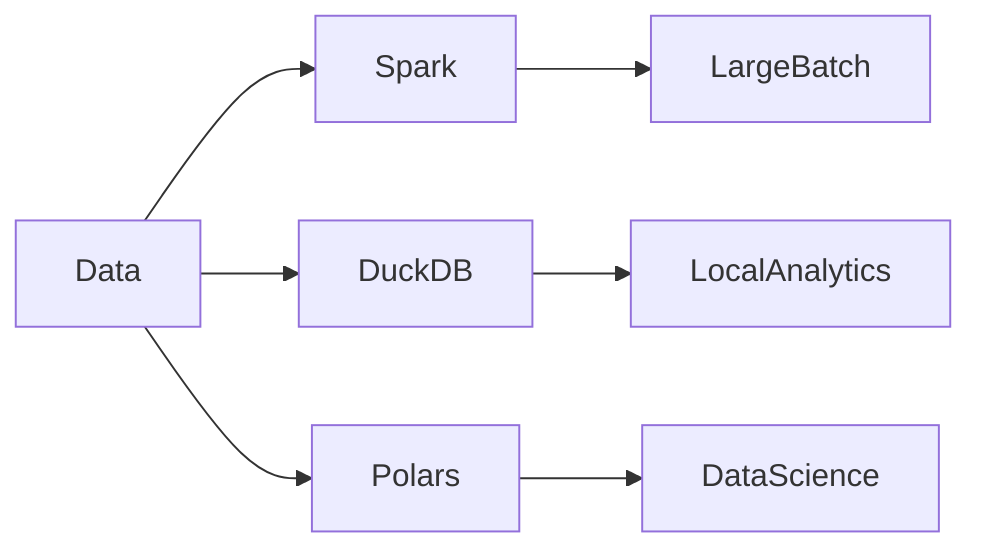

---
tags:
  - deep-dive
  - data-engineering
  - spark
  - duckdb
  - polars
---

# Spark vs DuckDB vs Polars at Scale

*The Changing Landscape of Analytical Data Processing*

**Themes:** Data Architecture · Performance · Ecosystem

---

## Opening Thesis

The data ecosystem is shifting away from always-on distributed compute toward hybrid architectures that combine local and distributed processing engines. Spark remains the default for large-scale batch ETL and ML, but DuckDB and Polars have established themselves as the preferred tools for a large class of analytical workloads that do not require distribution. The result is not a winner-take-all market but a more nuanced choice: the right engine depends on data size, latency requirements, and operational context. This essay compares Spark, DuckDB, and Polars at scale, explains their execution models and performance characteristics, and describes the emerging hybrid pattern—Spark for ingestion and large batch, Parquet for storage, and DuckDB or Polars for analytics—that dominates modern data architecture.

---

## Architectural Overview

### Spark

**Distributed processing**: Spark runs on a cluster of nodes. A driver program builds a logical and physical plan and schedules tasks across executors. Data is partitioned; each task processes one or more partitions. Fault tolerance is achieved by recomputing lost partitions from lineage.

**Cluster execution**: Jobs are submitted to a cluster (standalone, YARN, Kubernetes, or a managed service). Startup cost (cluster provision, JVM warm-up) and coordination overhead are inherent. Spark excels when the data or the computation exceeds single-machine capacity and when the workload is batch-oriented.

### DuckDB

**In-process analytical database**: DuckDB is an embedded, in-process analytical database. There is no server; the engine runs in the same process as the application. It reads Parquet, CSV, and other formats directly and executes SQL with a vectorized, columnar engine.

**Local columnar execution**: Data is processed in vectors (batches of values) using SIMD where possible. Execution is single-node; parallelism is within the process (multi-threaded). DuckDB is ideal for ad-hoc analytics, embedded applications, and any workload where the data fits in memory or on fast local storage.

### Polars

**Rust-based dataframe engine**: Polars is a DataFrame library implemented in Rust with Python and other language bindings. It uses lazy evaluation and columnar execution; queries are optimized before execution.

**Vectorized execution**: Like DuckDB, Polars processes data in columns and batches. It is designed for in-process, single-machine use. It integrates with the Python data ecosystem (Pandas, PyArrow) and can read/write Parquet. Polars excels for data science workflows and medium-sized data where a DataFrame API is preferred over SQL.

---

## Execution Model Comparison

| Engine | Execution model |
|--------|-----------------|
| **Spark** | Distributed DAG; driver schedules tasks on executors; shuffle between stages; fault-tolerant via lineage |
| **DuckDB** | Vectorized query engine; single process; multi-threaded; no network; reads Parquet/CSV natively |
| **Polars** | Columnar lazy execution; single process; query plan optimized then executed; in-memory or streaming over chunks |

Spark's model implies coordination, network, and failure handling. DuckDB and Polars avoid these by staying local. The trade-off is capacity: Spark scales out; DuckDB and Polars scale up (larger machine, more cores, more memory).

---

## Performance Characteristics

Performance differs by workload:

- **Small to medium data (&lt;100 GB), ad-hoc queries**: DuckDB and Polars typically complete faster than Spark because there is no cluster startup, no shuffle, and no serialization across nodes. Latency is measured in seconds or less.
- **Large batch ETL (multi-TB), scheduled**: Spark is the only option when data does not fit on one machine. DuckDB and Polars are not designed for this scale.
- **Wide transformations (joins, group-bys) on large data**: Spark can distribute the work but shuffle cost is high. DuckDB and Polars are limited by single-node memory and disk; they are fast up to the point where they run out of resources.
- **ML pipelines**: Spark has MLlib and ecosystem integration; DuckDB and Polars are analytical query engines, not ML runtimes. For feature computation over large data, Spark is often used; for smaller feature sets, Polars or Pandas may suffice.

The "at scale" in the title means: Spark is the choice when scale implies distribution; DuckDB and Polars are the choice when scale implies single-node performance and simplicity.

---

## Architecture Diagram

The same data (e.g. Parquet on object storage or local disk) can be consumed by any of the three. Spark feeds large-batch outputs; DuckDB and Polars feed local analytics and data science. The decision is workload-driven, not data-driven: one storage layer, multiple engines.

---

## Hybrid Architectures

The emerging pattern is **hybrid**: Spark for ingestion and large ETL; Parquet (or a lakehouse format) for storage; DuckDB or Polars for analytics.

- **Spark**: Ingests from sources, applies heavy transformations, writes to Parquet or lakehouse tables. Runs on a schedule or as part of a pipeline. Handles data sizes that exceed single-node capacity.
- **Parquet storage**: Single source of truth. Columnar, compressed, partitionable. Accessible by Spark, DuckDB, Polars, and warehouses.
- **DuckDB / Polars**: Analysts and data scientists query the same Parquet (or attach to a lakehouse) for ad-hoc analysis, reporting, and exploration. No cluster required; low latency and low cost.

This architecture is not a compromise. It is the natural outcome of open formats and multiple engines: use the right tool for each workload. See [DuckDB vs PostgreSQL vs Spark](duckdb-vs-postgres-vs-spark.md) and [Lakehouse vs Warehouse vs Database](lakehouse-vs-warehouse-vs-database.md) for the broader context.

---

## The Future of Data Processing

Trends that favor the hybrid model:

- **Smaller distributed clusters**: Organizations are right-sizing Spark (or similar) for the subset of work that truly requires distribution. The rest moves to local or warehouse engines.
- **Larger local compute**: Single machines with hundreds of GB RAM and many cores make "local" a much larger category. DuckDB and Polars benefit from this trend.
- **Lakehouse architectures**: Open table formats (Delta, Iceberg, Hudi) on object storage allow multiple engines to read and write the same data. Spark is one consumer; DuckDB, Trino, and warehouses are others.

The future is not "Spark vs DuckDB vs Polars" but "Spark and DuckDB and Polars," each used where it fits. The decision framework below summarizes when to use which.

---

## Decision Framework

| Dataset size | Tool | Notes |
|--------------|------|--------|
| &lt;100 GB | DuckDB | Ad-hoc SQL, embedded use, single-node analytics |
| 100 GB – ~1 TB | Polars / DuckDB / distributed | Depends on query pattern and hardware; Polars for DataFrame workflows, DuckDB for SQL; consider Spark if shuffle-heavy or multi-TB |
| &gt;1–5 TB | Spark or other distributed | Single-node is at the limit; Spark for batch ETL and ML |
| &gt;5 TB | Spark (or similar) | Distributed execution required |

**Refinements**: Prefer DuckDB for SQL and Parquet-native analytics; prefer Polars for Python DataFrame workflows and integration with the PyData stack. Prefer Spark when data or computation exceeds single-node capacity, when fault-tolerant distributed execution is required, or when the platform (e.g. Databricks) is Spark-centric. Use a hybrid: Spark for the heavy lifting, DuckDB/Polars for everything else over the same storage.

!!! tip "See also"
    - [DuckDB vs PostgreSQL vs Spark](duckdb-vs-postgres-vs-spark.md) — Deeper comparison of execution models and economics
    - [When to Use Spark (and When Not To)](../best-practices/data-processing/spark/when-to-use-spark.md) — Best-practice decision guide
    - [Spark in Modern Data Architectures](../best-practices/data-processing/spark/spark-modern-architecture.md) — Where Spark fits in lakehouse pipelines
    - [Parquet best practices](../best-practices/database-data/parquet.md) — Storage format shared by all three engines
    - [Lakehouse vs Warehouse vs Database](lakehouse-vs-warehouse-vs-database.md) — Architectural context for hybrid engines
    - [Reproducible Data Pipelines](../best-practices/data/reproducible-data-pipelines.md) — Pipeline discipline across engines
