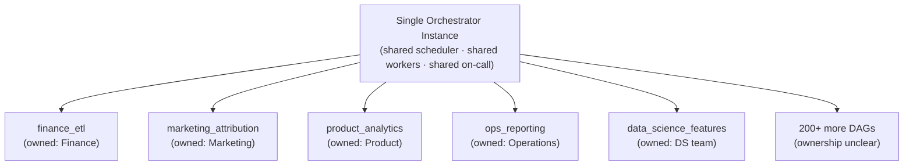
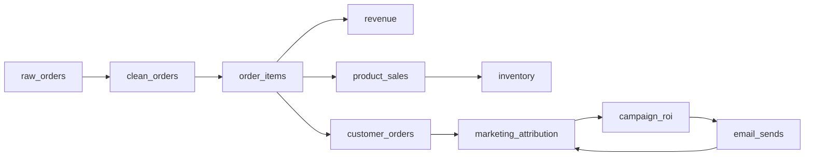
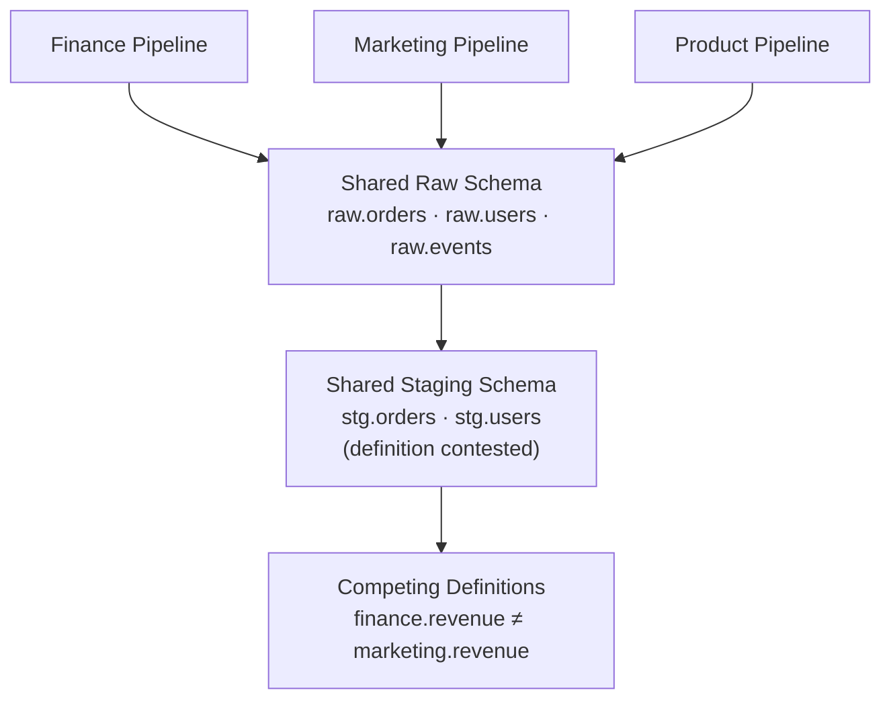
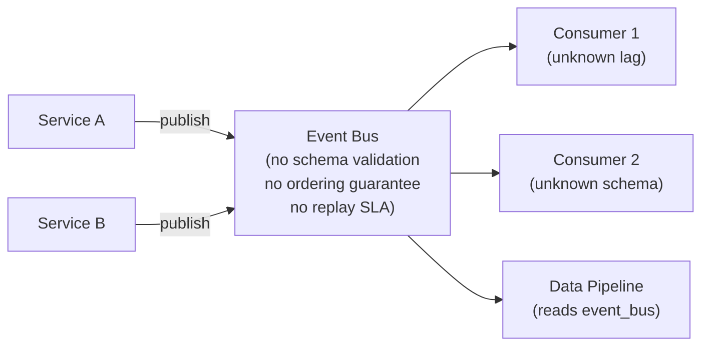

---
tags:
  - deep-dive
  - data-engineering
  - architecture
---

# Why Most Data Pipelines Fail: Complexity, Coupling, and the Illusion of Scale

*See also: [Observability vs Monitoring](observability-vs-monitoring.md) — the diagnostic layer that data pipeline failures expose most acutely.*

**Themes:** Data Architecture · Governance · Organizational

---

## Opening Thesis

Data pipelines fail constantly. Not primarily because the tooling is immature, not because engineers chose the wrong orchestrator, and not because the infrastructure was undersized. They fail because the systems they live inside are poorly bounded, because the contracts between components are implicit and unenforced, and because the organizational incentives that would correct these problems are structurally absent.

The modern data stack — dbt, Airflow, Fivetran, Snowflake, and their equivalents — represents a genuine engineering improvement over the ETL tools of the 1990s and 2000s. This improvement has been widely oversold. The tooling solves a narrower class of problems than its marketing suggests. The broader class of pipeline failures is organizational and architectural, and no orchestration layer addresses it directly.

This is an analysis of what actually goes wrong, why, and what structural properties make pipelines survivable.

---

## Historical Context

### ETL to ELT: The Shift and What It Changed

The ETL (Extract, Transform, Load) pattern of the pre-cloud era imposed transformation at extract time, before data entered the warehouse. This was a practical constraint: warehouse storage was expensive, so only transformed, modeled data was stored. The consequence was that raw data was discarded and transformations were embedded in proprietary tools (Informatica, SSIS, Ab Initio) with poor version control integration.

The ELT inversion — extract and load raw, transform inside the warehouse using SQL — became viable as cloud warehouse costs dropped and MPP query engines became fast enough to transform at query time or in scheduled dbt runs. This shift was genuinely beneficial: raw data is now preserved, transformations are version-controlled, and compute-time transformation removes the dependency on heavyweight ETL middleware.

What the ELT shift did not change is the underlying coupling problem. Raw data still arrives from upstream systems whose owners have different incentives than the data team. Transformations still depend on implicit assumptions about upstream schema stability. Orchestrators still schedule work into a shared namespace without meaningful isolation between domains.

### The Rise of the Modern Data Stack

The "modern data stack" as a term crystallized around 2020–2021, roughly corresponding to the confluence of cloud-native warehouses (Snowflake, BigQuery, Redshift), transformation tools (dbt), and managed ingestion (Fivetran, Stitch, Airbyte). The term is primarily a marketing construct, but it describes a real set of tools that reduced the operational overhead of building analytical pipelines.

The promise implicit in the modern data stack narrative is that the right combination of tools will make data pipelines reliable. This promise is false in a specific way: the tools reduce certain categories of operational burden (infrastructure provisioning, transformation syntax, ingestion configuration) while leaving the fundamental problems — ownership, schema governance, contract enforcement — entirely unaddressed.

### Orchestrators as False Saviors

Apache Airflow became dominant not because it solved pipeline reliability but because it made pipeline dependencies visible and schedulable. A DAG is a graph of what-depends-on-what, rendered visually, with retry logic and dependency tracking. This is valuable. It is not the same as reliability.

An orchestrator answers: "did this task run, and did it succeed?" It does not answer: "was the output correct?", "did the schema match what downstream consumers expect?", "is the data fresh relative to the business event it represents?", or "does the consumer know the definition of the fields they are reading?" These are the questions that determine whether a pipeline is actually working, and no orchestrator framework addresses them without significant additional investment in data quality infrastructure.

---

## Common Failure Modes

### Schema Drift and Upstream Instability

The most pervasive cause of pipeline failure is not a bug in the pipeline itself but a change in the upstream data that the pipeline was not designed to absorb. A source API adds a field, changes a type, or stops populating a previously reliable column. The ingestion layer succeeds — rows are loaded — but the transformation layer produces incorrect results silently, or fails loudly on a type mismatch days later when a downstream consumer notices wrong numbers.

Schema drift is not an edge case. It is the default behavior of any system owned by a team with different priorities than the data team. Application developers are not obligated to notify data consumers of schema changes. In organizations without explicit data contracts, they frequently do not.

The problem compounds at scale. A single source producing schema changes is manageable with careful monitoring. A pipeline with fifty sources, each changing on its own schedule under the control of teams with no data engineering representation, produces a continuous stream of low-level failures that consume a disproportionate fraction of the data team's operational attention.

### Hidden State and Implicit Contracts

Pipelines accumulate hidden state — implicit assumptions about upstream data that are never written down. A transformation assumes that a status column takes values from a fixed set. A join assumes that a foreign key is always populated. A filter assumes that a timestamp column is never null. These assumptions are correct when the pipeline is written and become incorrect as upstream systems evolve.

The assumptions are hidden because they exist only in the transformation code, not in any data contract or schema registry. When they break, the failure mode is often not an error but a silently wrong result: a query returns fewer rows than expected, an aggregate is off by an undiscoverable percentage, or a dashboard quietly stops updating because a downstream table now contains no data.

Implicit contracts extend beyond schema to semantics. A pipeline may assume that an "order" in the source system has the same definition as an "order" in the business model. When the source system's team changes the definition of an order — expanding it to include order drafts, for example — the pipeline produces data that is technically correct by the new definition and semantically wrong by the old one. This class of failure is not detectable by schema monitoring.

### Over-Centralized Orchestration

Most large data platforms converge on a single orchestrator instance — one Airflow or one Prefect deployment — that schedules all pipelines across all domains. This creates a shared operational surface that accumulates problems:

A single large DAG that fails blocks the downstream DAGs that depend on it, regardless of which team owns the downstream. A misconfigured DAG that consumes excess scheduler resources degrades performance for all pipelines. A DAG added by a new team without code review introduces a new failure mode into a shared namespace without any isolation.

The centralized orchestrator also creates organizational ambiguity: who is responsible when a shared pipeline fails? The team that wrote the failing DAG, the platform team that operates the orchestrator, or the downstream team that is missing data? This ambiguity produces delayed incident response, insufficient postmortems, and recurring failures of the same class.

### Lack of Observability

Pipeline observability — distinct from pipeline monitoring — means the ability to understand the internal state of a pipeline from its outputs without having to instrument the pipeline itself after the fact. Most data pipelines have monitoring (task success/failure, run duration, row counts) but not observability.

The distinction matters operationally. A row count check tells you that a table has 10,000 fewer rows than yesterday. It does not tell you whether those rows were legitimately absent from the source, filtered by a changed transformation, or dropped by a failed join. Diagnosing the root cause requires examining intermediate states, checking upstream sources, and tracing the data lineage — steps that require either pre-instrumented lineage tracking or manual investigation.

The absence of observability extends the mean time to diagnosis. A pipeline that fails noisily (error in the orchestrator) typically has a short diagnosis time: the error message points to the failing task, logs show the exception, the fix is usually apparent. A pipeline that fails silently (incorrect output, missing rows, wrong aggregation) may not be detected for days, and when detected, diagnosis requires reconstructing what the data should have looked like versus what it does look like — a forensic exercise rather than a debugging one.

### Data Ownership Ambiguity

Most data quality problems in large organizations are, at their root, ownership problems. The question "who is responsible for the correctness of this table?" frequently has no clear answer. The data engineering team built the pipeline and operates the infrastructure. The analytics team queries the table and defines its business logic in dbt. The source system team owns the upstream data that the table is derived from. The business stakeholders define what the table should represent.

When the table is wrong, each of these groups has a plausible argument that responsibility lies elsewhere. The engineering team points to schema changes from the source team. The analytics team points to incorrect transformation logic from the engineering team. The source team notes that they never agreed to maintain a stable schema. The business stakeholders, who funded the work, cannot navigate the organizational dispute.

This ambiguity is not a failure of individual teams. It is a structural consequence of building pipelines that span organizational boundaries without explicit ownership agreements.

### The CI/CD Gap in Data Systems

Application software has decades of investment in continuous integration and continuous delivery: tests run on every commit, deployment is automated, rollbacks are defined, and the health of the system is continuously validated. Data pipelines, despite being software that runs in production and produces outputs that drive business decisions, rarely have equivalent rigor.

A dbt model may have tests (not null, unique, accepted values) that run in CI, but these tests validate structural properties of the output, not semantic correctness. A new model that passes all its dbt tests may still produce wrong results if its logic misunderstands the business definition of the metric it is computing.

More fundamentally, data pipelines are rarely deployed with any rollback mechanism. A new transformation that produces incorrect results cannot be "rolled back" in the traditional sense — the incorrect data has already been loaded into the warehouse and may have been consumed by downstream dashboards, exported to reporting systems, or used in business decisions. The equivalent of a code rollback is a data migration: backfilling correct data, invalidating caches, notifying downstream consumers, and correcting any decisions made using the incorrect data.

### Misaligned Incentives

Analytics teams are measured on delivering insights and enabling business decisions. They are not measured on data quality, schema stability, or pipeline maintainability. Source system teams are measured on delivering product features. They are not measured on the downstream impact of schema changes on data consumers. Data engineering teams are frequently measured on pipeline uptime and task success rate, not on the correctness or usability of the data their pipelines produce.

These misalignments are not failures of individual motivation. They reflect how teams are structured and how success is measured. Fixing them requires organizational change — explicit ownership agreements, shared quality metrics, data contracts with enforced SLOs — that goes beyond any technical architecture decision.

---

## Organizational vs Technical Causes

The proximate cause of most pipeline failures is technical: a schema change, a failed join, a resource exhaustion event. The root cause is almost always organizational.

| Pipeline model | Primary strengths | Primary failure modes |
|---|---|---|
| Engineering-led | Technical rigor, reliable infrastructure | Distance from business semantics, slow iteration |
| Analyst-built | Close to business definitions, fast delivery | Poor engineering discipline, technical debt |
| Platform-driven | Reusable patterns, operational consistency | Over-abstraction, loss of domain knowledge |

Engineering-led pipelines tend to be technically robust and semantically wrong. The infrastructure is solid; the business definitions embedded in the transformations drift from reality as the business changes. Analyst-built pipelines tend to be semantically correct and technically fragile. The logic is right; the code is not tested, not version-controlled properly, and not operationally monitored. Platform-driven pipelines trade domain knowledge for generality — the abstractions hide complexity until the complexity exceeds what the abstraction can express.

The most functional organizations combine elements of all three: platform teams provide infrastructure and operational patterns, domain teams (engineering or analytics, depending on context) own the semantics and the SLOs, and explicit contracts mediate between them.

---

## Architectural Anti-Patterns

### DAG Spaghetti

### Shared Warehouse Coupling

### Event-Driven Chaos

---

## Survivable Architectures

### Domain Isolation

The most reliably survivable pipelines are those with tight domain ownership and minimal cross-domain dependencies. Each domain — Finance, Marketing, Product — owns its own ingestion layer, its own staging schema, and its own transformation layer. Cross-domain data sharing happens through stable, versioned interfaces rather than direct table reads.

This is the Data Mesh principle applied pragmatically: not every organization needs the full Data Mesh architecture, but the principle of domain ownership and stable data product interfaces is applicable at almost any scale.

### Contract-Driven Pipelines

A data contract is an explicit, machine-enforceable agreement between a data producer and a data consumer. At minimum, it specifies the schema (field names and types), the quality guarantees (nullability, uniqueness, accepted values), the freshness SLA (data is no older than X hours), and the change notification process (breaking changes require N days notice and a migration path).

Contracts do not need to be implemented with a dedicated tool (though tools like Soda, Great Expectations, and emerging contract frameworks help). The most important property is that they exist and are enforced: that a schema change which violates a contract causes an automated alert, not a silent downstream failure.

### Immutable Data Principles

Pipelines that treat their intermediate and output data as immutable — never overwriting or updating, only appending new versions — are more resilient to certain failure classes. An incorrect transformation can be rerun over immutable inputs without losing the original state. A bug that produced incorrect output can be corrected by deleting the incorrect output partition and reprocessing. Debugging is possible because historical states are preserved.

The lakehouse table format layer (Delta Lake, Iceberg, Hudi) provides time travel and transaction semantics on top of immutable Parquet files. This makes the immutability principle operationally viable at scale without requiring manual partition management.

### Metadata-First Design

A metadata-first pipeline treats data lineage, schema definitions, and quality assertions as first-class artifacts — produced and maintained with the same discipline as transformation code. Every table has a documented owner, a documented definition for each significant field, a documented freshness SLA, and a documented set of quality assertions.

Metadata-first design does not require a specific tooling choice. It requires that the question "who owns this table and what does it mean?" is answerable without examining the transformation code.

---

## Decision Framework

**Small team, limited data sources, batch analytics**: prioritize clarity of ownership over architectural sophistication. A small number of well-understood pipelines with documented contracts and human on-call ownership is more reliable than a sophisticated architecture operated by a team that does not understand it.

**Growing team, multiple source systems, mixed batch and near-real-time**: invest in schema enforcement at ingestion (a schema registry or at minimum a type-validated ingestion layer), domain isolation in the transformation layer (separate staging schemas per domain), and basic data quality assertions before promotion to serving tables.

**Enterprise scale, regulated industry, multiple business domains**: the cost of not implementing explicit data contracts, domain ownership, and formal data quality SLOs is paid in audit failures, data incidents that reach regulators, and organizational trust collapses. The investment in contract-driven, metadata-first architecture is not optional at this scale.

**Batch vs streaming**: the failure modes described here apply equally to batch and streaming pipelines. Streaming pipelines have additional failure modes (late-arriving data, out-of-order events, exactly-once semantics) that batch pipelines do not, but the organizational and ownership failures are the same. If ownership is ambiguous and contracts are implicit, the pipeline will fail regardless of whether it runs hourly or continuously.

!!! tip "See also"
    - [Observability vs Monitoring](observability-vs-monitoring.md) — the diagnostic layer that surfaces these failure modes when they occur
    - [Prefect vs Airflow](prefect-vs-airflow.md) — orchestration tool selection in the context of the failure modes described here
    - [Lakehouse vs Warehouse vs Database](lakehouse-vs-warehouse-vs-database.md) — storage architecture choices that affect pipeline resilience
    - [Why Most Data Lakes Become Data Swamps](why-data-lakes-become-swamps.md) — the lake-level entropy that pipeline governance failures produce over time
