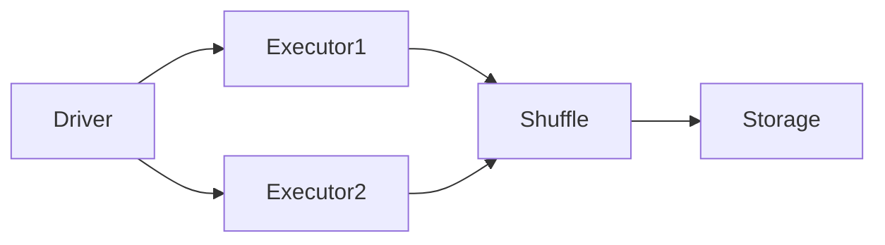

---
tags:
  - deep-dive
  - data-engineering
  - spark
  - distributed-systems
---

# Why Spark Clusters Fail in Production

*Distributed Systems, Hidden Complexity, and Operational Reality*

**Themes:** Data Architecture · Operations · Distributed Systems

---

## Opening Thesis

Spark is a powerful distributed processing engine, but most Spark deployments fail not because of technology limitations but because organizations underestimate the operational complexity of distributed computation. The same properties that make Spark scalable—partitioning, shuffle, fault-tolerant task execution—introduce failure modes that do not exist in single-node systems. When teams treat Spark as a "magic scaling tool" or adopt it without the discipline required to operate distributed systems, clusters become unreliable, expensive, and ultimately abandoned or replaced by simpler alternatives. This essay examines why Spark clusters fail in production, the organizational causes that amplify technical failure, and the architectural lessons that separate survivable deployments from the rest.

---

## Historical Context

### Hadoop MapReduce origins

Apache Hadoop and MapReduce emerged in the mid-2000s as a response to the problem of processing data at scales that exceeded single-machine capacity. MapReduce offered a simple model: map tasks process partitions in parallel; reduce tasks aggregate results. The model was batch-oriented, disk-bound, and tolerant of node failure. It became the foundation of "big data" infrastructure at web-scale companies. The cost was operational: clusters required dedicated teams, careful tuning, and acceptance of high latency. Jobs that took hours were normal.

### Spark replacing MapReduce

Spark, developed at UC Berkeley and open-sourced in 2010, positioned itself as a faster alternative by keeping data in memory where possible and by generalizing the programming model beyond map-reduce to a full DAG of transformations. By the mid-2010s, Spark had largely replaced MapReduce for new development. It offered a unified API for batch, SQL, streaming, and ML. The promise was clear: same scale, better performance, and a single engine for multiple workloads.

### Shift toward memory-first distributed processing

The shift toward memory-first execution changed the failure profile. MapReduce failed in visible ways: slow disks, task timeouts, speculative execution. Spark failed in ways that were often less obvious: memory pressure, GC pauses, shuffle storms, and skew. The coordination overhead of distributing work across many nodes did not disappear; it moved from disk I/O to network and memory. Organizations that had learned to operate MapReduce clusters discovered that Spark clusters required different tuning and different observability.

### Rise of cloud-managed Spark platforms

Databricks, Amazon EMR, Google Dataproc, and Azure Synapse offered managed Spark: the platform provider operated the cluster, and the customer submitted jobs. Managed offerings reduced the burden of cluster provisioning and upgrades but did not eliminate the need to understand partitioning, shuffle, and resource sizing. Jobs that were poorly designed or misconfigured still failed or cost far more than necessary. Spark became the dominant big data engine not because it was easy to operate but because it was the default choice for distributed batch and ML at scale—and because the alternatives (hand-rolled MapReduce, proprietary MPP systems) were less flexible or more expensive.

---

## The Distributed Systems Tax

Distributed computation imposes a tax that single-node systems do not pay. Understanding this tax is essential to understanding why Spark clusters fail.

**Coordination overhead**: The driver must schedule tasks, track completion, and handle failures. Executors must heartbeat, report metrics, and participate in shuffle. This overhead is constant per job; for small jobs, it can dominate runtime.

**Failure domains**: Any node, network link, or disk can fail. Spark tolerates executor failure by re-running tasks, but driver failure kills the job. Network partitions can cause executors to be lost or the driver to lose contact with the cluster. The more nodes, the more failure modes.

**Network latency**: Shuffle moves data between executors over the network. Latency and bandwidth limits shuffle throughput. In wide jobs (e.g. large joins or group-bys), shuffle can dominate total runtime.

**Operational complexity**: Logs, metrics, and state are distributed. Debugging a slow job requires correlating driver logs, executor logs, and metrics across many nodes. Configuration (memory, cores, partition count) must be consistent and appropriate for the workload. Misconfiguration is easy; detecting it requires discipline.

Shuffle operations dominate runtime costs in many Spark jobs. Data is written to local disk (or memory) by the map side and read over the network by the reduce side. When shuffle data is large or skewed, a few tasks hold most of the data and the stage becomes a bottleneck. The diagram above is a simplification: in practice, many executors participate, and the shuffle layer is where latency and failure most often appear.

---

## Failure Modes in Real Spark Systems

### Data skew

When one or a few keys receive a disproportionate share of data, the partitions that process those keys become large. One executor (or a few) does most of the work while the rest sit idle. The stage completes only when the largest partition finishes. Skew appears in joins (one side has hot keys), in group-by operations, and in any transformation that partitions by a key with uneven distribution. In production, skew is one of the leading causes of "the job that never finishes" or "the job that OOMs one executor."

### Shuffle explosion

Wide transformations (join, groupByKey, distinct) produce shuffle. When the intermediate dataset is much larger than the input—e.g. a join that explodes row count, or a groupBy that produces huge aggregates—shuffle write and read can saturate disk and network. Jobs that "worked in dev" fail in production when data volume increases. Shuffle explosion is a design problem: the pipeline is doing more work than necessary or in an order that maximizes intermediate size.

### Executor memory fragmentation

The JVM heap can fragment under long-running or memory-heavy tasks. Even when total free memory exists, the allocator may be unable to satisfy a large allocation. The result is OutOfMemoryError or GC thrashing. Oversized executors (e.g. 32 GB heaps) are more susceptible. Mitigations include smaller executors, off-heap memory for shuffle and cache, and reducing the working set per task (e.g. better partitioning).

### Cluster misconfiguration

Incorrect memory settings (driver or executor), too few or too many partitions, and mismatched CPU/memory ratios lead to underutilization, OOMs, or scheduler backlog. Many production failures are traced to defaults that do not match the workload: for example, `spark.sql.shuffle.partitions` left at 200 when shuffle data is hundreds of GB, or executor memory set without accounting for off-heap and overhead.

### Operational blind spots

Lack of observability—no metrics on shuffle size, task duration distribution, or GC—makes it impossible to diagnose failures or tune proactively. Jobs run in the dark; when they fail, teams lack the data to fix them. Treating Spark as a black box guarantees that failures will be repeated.

---

## Organizational Causes of Spark Failure

Technical failure modes are amplified by organizational ones.

**Poor pipeline design**: Pipelines that were not designed for distribution—e.g. monolithic jobs with no intermediate checkpoints, or jobs that shuffle unnecessarily—become unmaintainable at scale. Refactoring is deferred; the cluster is blamed instead of the design.

**Lack of observability**: Without metrics, logs, and tracing, teams cannot distinguish "Spark is slow" from "this job is poorly written" or "this cluster is misconfigured." Investment in observability is often delayed until after major incidents.

**Treating Spark as a magic scaling tool**: Adopting Spark because "we need to scale" without evaluating whether the workload actually requires distribution leads to over-provisioned clusters and complex pipelines for data that could be processed on a single node with DuckDB or Polars.

**Inadequate data engineering discipline**: Schema evolution, data quality, and lineage are often afterthoughts. When pipelines fail due to upstream changes or bad data, the response is reactive rather than preventive. Discipline around partitioning, idempotency, and reproducible runs is missing.

---

## Architectural Lessons

**Pipeline decomposition**: Break large jobs into smaller stages with well-defined inputs and outputs. Use intermediate storage (e.g. Parquet) so that stages can be re-run and debugged independently. Avoid monolithic DAGs that are impossible to reason about.

**Correct partitioning**: Partition data so that tasks are roughly equal in size and so that shuffle is minimized. Use partition pruning (e.g. by date or region) to skip data. Monitor partition sizes and skew in production.

**Cost-aware job design**: Design for the data size and latency you actually have. Use broadcast joins when one side is small; avoid wide transformations when narrow ones suffice. Right-size the cluster; do not over-provision "to be safe."

**Using Spark only where it fits**: Use Spark for workloads that genuinely exceed single-machine capacity or that require distributed fault tolerance. Use DuckDB, Polars, or a SQL warehouse for smaller or interactive workloads. Hybrid architectures—Spark for ETL, local engines for analytics—are often the most cost-effective.

---

## Decision Framework

| Situation | Use Spark | Avoid Spark |
|-----------|-----------|-------------|
| Massive batch ETL (multi-TB) | ✓ | |
| Small analytics jobs (&lt;100 GB) | | ✓ |
| Interactive queries (sub-second) | | ✓ |
| Petabyte-scale processing | ✓ | |
| Ad-hoc exploration | | ✓ |
| Scheduled large joins / aggregations | ✓ | |
| Single-node fits data and compute | | ✓ |

**When in doubt**, prefer a simpler engine (DuckDB, Polars, warehouse SQL) until you have evidence that the workload exceeds single-node capacity or requires Spark's fault-tolerant distributed model. Introduce Spark when the data size, SLA, or operational requirements justify the distributed systems tax.

!!! tip "See also"
    - [When to Use Spark (and When Not To)](../best-practices/data-processing/spark/when-to-use-spark.md) — Best-practice decision guide
    - [Scaling Spark Clusters Correctly](../best-practices/data-processing/spark/scaling-spark.md) — Partitioning and executor sizing
    - [Why Most Data Pipelines Fail](why-most-data-pipelines-fail.md) — Organizational and pipeline failure modes
    - [Reproducible Data Pipelines](../best-practices/data/reproducible-data-pipelines.md) — Pipeline discipline
    - [DuckDB vs PostgreSQL vs Spark](duckdb-vs-postgres-vs-spark.md) — When to use local vs distributed engines
