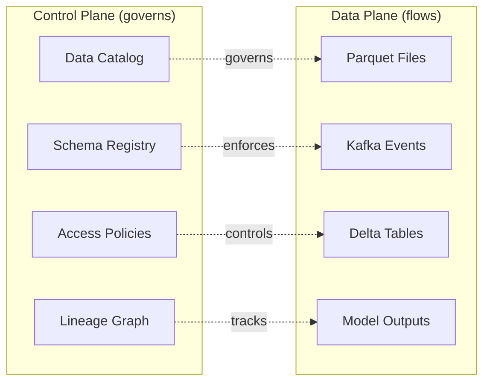
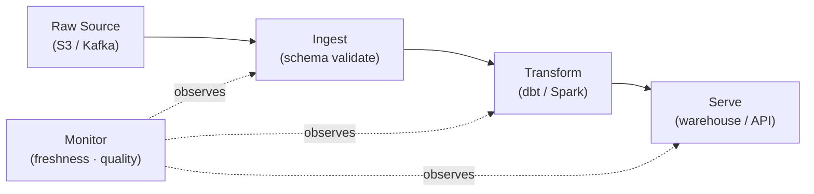
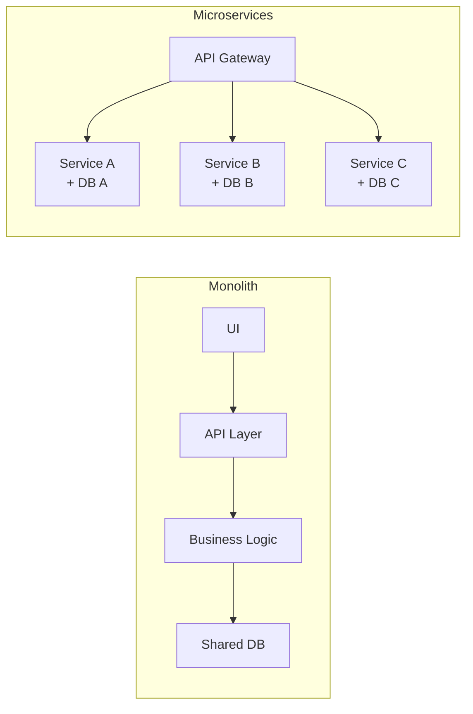
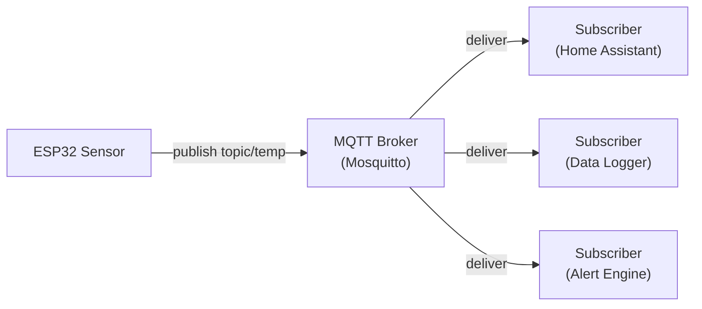
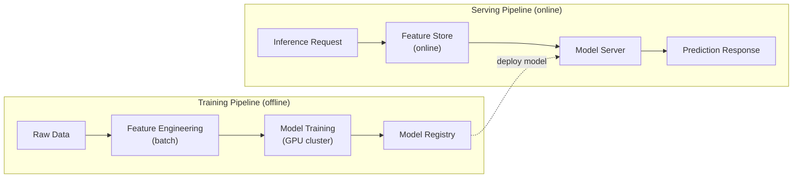

---
tags:
  - diagrams
  - style-guide
  - reference
---

# Diagram Style Guide

This site uses **Mermaid** as the standard for architecture, flow, state, and sequence diagrams. SVG remains available as an exception for geospatial illustrations, high-resolution figures, and cases where Mermaid's layout engine is insufficient.

This guide defines when to use each diagram type, formatting conventions, accessibility requirements, and a reusable snippet library.

---

## When to Use Mermaid vs SVG

| Use Mermaid for | Use SVG for |
|---|---|
| Architecture and component diagrams | Geospatial maps and spatial illustrations |
| Pipeline and data flow diagrams | High-resolution design artifacts |
| Comparison diagrams (monolith vs microservices) | Diagrams requiring precise visual positioning |
| Request/response sequence flows | Custom icons or branding elements |
| State machines (embedded firmware, auth flows) | Cases where Mermaid layout is unacceptable |
| Decision trees | — |

**Default**: if in doubt, use Mermaid. Its text-based format is version-controlled, diffable, and editable by any contributor without tooling.

---

## Diagram Types by Content

### Flowchart — Architecture and Pipeline Diagrams

Use `flowchart LR` (left-to-right) for most architecture and pipeline diagrams. Use `flowchart TD` (top-down) for hierarchical structures.

```
flowchart LR
  Source --> Transform --> Sink
```

Best for: data pipelines, control plane / data plane separation, service topology, deployment architecture.

### Sequence Diagram — Request and Event Flows

Use `sequenceDiagram` for depicting interactions between services or components over time — HTTP requests, event bus publishing, auth flows.

```
sequenceDiagram
  Client->>API: POST /request
  API->>Queue: publish event
  Queue->>Worker: deliver event
  Worker->>API: callback result
```

Best for: API call flows, message broker interactions, authentication sequences, streaming event propagation.

### State Diagram — Embedded Firmware and Lifecycle States

Use `stateDiagram-v2` for firmware state machines, lifecycle management, and any system with discrete, well-defined states and transitions.

```
stateDiagram-v2
  [*] --> Idle
  Idle --> Active: sensor trigger
  Active --> Idle: timeout
  Active --> Sleep: low battery
  Sleep --> Idle: wake timer
```

Best for: ESP32 firmware state machines, pipeline job state transitions, deployment lifecycle stages.

---

## Formatting Conventions

**Node labels**: keep node text short — 1–4 words. Use abbreviations if needed. Long labels wrap awkwardly and reduce diagram readability.

**Orientation**: prefer `LR` (left-to-right) for architecture and pipeline diagrams. Reserve `TD` (top-down) for hierarchies (DNS trees, org charts, decision trees).

**Subgraphs for boundaries**: use `subgraph` blocks to show control plane / data plane separation, organizational boundaries, network zones, or logical groupings.

```
flowchart LR
  subgraph Control Plane
    Scheduler
    Registry
  end
  subgraph Data Plane
    Worker1
    Worker2
  end
  Scheduler --> Worker1
  Scheduler --> Worker2
```

**Complexity limit**: keep diagrams under approximately 15 nodes. If a diagram exceeds this, split it into two diagrams: one showing the high-level topology, one showing a specific subsystem in detail.

**Consistent arrow semantics**: use `-->` for data flow, `--->` for async or eventual flow (when Mermaid supports it via labels), and `--label-->` for labeled edges when the relationship needs clarification.

---

## Accessibility

- **Avoid tiny text**: Mermaid auto-sizes nodes to their labels. Short labels produce readable diagrams; very long labels produce tiny text. Keep labels concise.
- **Avoid deeply nested subgraphs**: more than 2 levels of nesting becomes visually ambiguous. Prefer flat diagrams with clear labels over deep hierarchies.
- **Split complex diagrams**: a reader who cannot parse a diagram in 10 seconds will skip it. If the diagram requires 20+ nodes to represent the concept, split it into a sequence of simpler diagrams.
- **Light and dark mode**: MkDocs Material renders Mermaid with theme-aware colors. Do not hardcode fill colors — let the theme handle node styling for consistent light/dark rendering.

---

## Mermaid Snippet Library

### 1. Control Plane vs Data Plane



### 2. Pipeline with Stages



### 3. Monolith vs Microservices Comparison



### 4. Broker-Based Messaging (MQTT)



### 5. Training vs Serving ML Pipeline



---

## Authoring a New Diagram

1. Choose the diagram type from the table above.
2. Keep nodes to 15 or fewer.
3. Use subgraphs to show system boundaries.
4. Label edges when the relationship is not obvious from the node names alone.
5. Test that the diagram renders in the MkDocs dev server (`mkdocs serve`) before committing.
6. If the diagram is too complex, split it before submitting.
