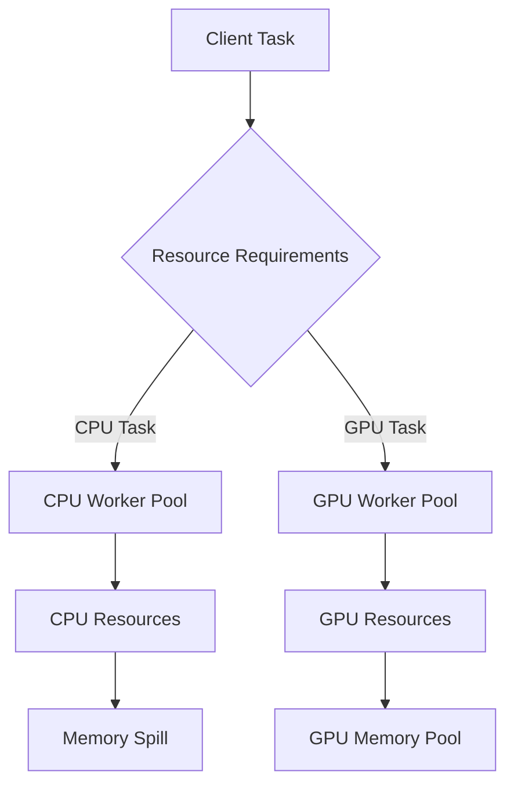

# Provisioning a Dask Cluster with Ansible (Scheduler + CPU/GPU Workers)

**Objective**: Master Dask cluster deployment for heterogeneous compute workloads. When you need to process large datasets with mixed CPU/GPU tasks, when you want to leverage RAPIDS for GPU-accelerated analytics, when you're building production data processing infrastructure—Dask cluster deployment becomes your weapon of choice.

Dask enables distributed computing across CPU and GPU workers with intelligent task scheduling. This tutorial shows you how to wield Dask cluster deployment with the precision of a battle-hardened cluster engineer, covering scheduler setup, heterogeneous worker pools, and production operations.

## 0) Prerequisites (Read Once, Live by Them)

### The Five Commandments

1. **Understand Dask architecture**
   - Scheduler coordination and task distribution
   - Worker resource management and memory handling
   - GPU acceleration with RAPIDS and dask-cuda
   - Network transport optimization with UCX

2. **Master heterogeneous workloads**
   - CPU vs GPU task scheduling and resource allocation
   - Memory management and spill strategies
   - Network optimization for high-bandwidth fabrics
   - Monitoring and performance tuning

3. **Know your infrastructure requirements**
   - Hardware specifications for CPU and GPU nodes
   - Network topology and bandwidth considerations
   - Storage requirements for spill directories
   - Security and access control patterns

4. **Validate everything**
   - Test scheduler connectivity and worker registration
   - Verify GPU worker functionality and resource allocation
   - Check network performance and UCX configuration
   - Validate monitoring and alerting systems

5. **Plan for production**
   - Security hardening and access controls
   - Monitoring and alerting configuration
   - Backup and disaster recovery
   - Scaling and maintenance procedures

**Why These Principles**: Dask cluster deployment requires understanding both distributed computing patterns and infrastructure automation. Understanding these patterns prevents performance bottlenecks and enables reliable data processing.

## 1) Cluster Topology

### Dask Cluster Architecture

```mermaid
flowchart LR
    U[Client] -->|TCP/UCX| S((Dask Scheduler))
    S <--tasks--> C1[[CPU Worker xN]]
    S <--tasks--> G1[[GPU Worker xM (dask-cuda)]]
    S --- D[(Dask Dashboard :8787)]
    
    classDef scheduler fill:#e1f5fe,stroke:#01579b,stroke-width:2px
    classDef cpu fill:#f3e5f5,stroke:#4a148c,stroke-width:2px
    classDef gpu fill:#e8f5e8,stroke:#1b5e20,stroke-width:2px
    classDef client fill:#fff3e0,stroke:#e65100,stroke-width:2px
    
    class S scheduler
    class C1 cpu
    class G1 gpu
    class U client
```

### Resource Allocation Strategy



**Why This Architecture Matters**: Heterogeneous worker pools enable optimal resource utilization for different workload types. Understanding this topology prevents resource contention and enables efficient task scheduling.

## 2) Ansible Inventory

### Inventory Structure

```ini
# inventories/production/inventory.ini
[scheduler]
sched0 ansible_host=10.0.0.10 ansible_user=ubuntu

[cpu_workers]
cpu01 ansible_host=10.0.0.11 ansible_user=ubuntu
cpu02 ansible_host=10.0.0.12 ansible_user=ubuntu

[gpu_workers]
gpu01 ansible_host=10.0.0.21 ansible_user=ubuntu
gpu02 ansible_host=10.0.0.22 ansible_user=ubuntu

[dask_cluster:children]
scheduler
cpu_workers
gpu_workers
```

### Global Variables

```yaml
# group_vars/all.yml
dask_user: dask
dask_prefix: /opt/miniconda
dask_env_name: dask-24.06
dask_env_spec: |
  name: {{ dask_env_name }}
  channels: [conda-forge, rapidsai]
  dependencies:
    - python=3.11
    - dask=2024.7.1
    - distributed=2024.7.1
    - dask-ml
    - bokeh
    - pip
    - pip:
        - "cupy-cuda12x"
        - dask-cuda==24.06
        - ucx-py-cu12x==0.39
        - numpy==2.0.2

dask_dashboard_port: 8787
dask_scheduler_port: 8786
dask_spill_dir: /var/lib/dask/spill
enable_ucx: false
rmm_pool_size: 8GB

# Security settings
dask_admin_subnet: "10.0.0.0/8"
dask_tls_enabled: false
dask_tls_cert: "/etc/ssl/certs/dask.crt"
dask_tls_key: "/etc/ssl/private/dask.key"
```

### GPU Worker Variables

```yaml
# group_vars/gpu_workers.yml
enable_ucx: true
rmm_pool_size: 8GB

# CUDA configuration
cuda_version: "12.1"
nvidia_driver_version: "535"
nvidia_persistence_mode: true

# UCX configuration
ucx_transports: "cuda_copy,cuda_ipc,tcp"
ucx_net_devices: "mlx5_0:1"
ucx_tls: "rc,cuda_copy,cuda_ipc,tcp"
```

**Why Inventory Structure Matters**: Proper inventory organization enables targeted deployments and environment-specific configuration. Understanding these patterns prevents configuration conflicts and enables scalable automation.

## 3) Ansible Roles

### Role Structure

```
ansible-dask/
├── inventories/production/inventory.ini
├── group_vars/
│   ├── all.yml
│   └── gpu_workers.yml
├── roles/
│   ├── base/
│   │   └── tasks/main.yml
│   ├── conda/
│   │   ├── tasks/main.yml
│   │   └── templates/environment.yml.j2
│   ├── dask/
│   │   ├── tasks/main.yml
│   │   └── templates/
│   │       ├── dask.yaml.j2
│   │       ├── dask-scheduler.service.j2
│   │       ├── dask-worker.service.j2
│   │       └── dask-cuda-worker.service.j2
│   └── cuda_nvidia/
│       └── tasks/main.yml
└── playbooks/
    ├── site.yml
    ├── scheduler.yml
    ├── cpu-workers.yml
    └── gpu-workers.yml
```

### Base Role

```yaml
# roles/base/tasks/main.yml
---
- name: "Ensure dask user exists"
  user:
    name: "{{ dask_user }}"
    shell: /bin/bash
    create_home: true
    home: "/home/{{ dask_user }}"
    groups: "sudo"
    append: true

- name: "Create dask spill directory"
  file:
    path: "{{ dask_spill_dir }}"
    state: directory
    owner: "{{ dask_user }}"
    group: "{{ dask_user }}"
    mode: "0755"

- name: "Install base packages"
  apt:
    name:
      - curl
      - wget
      - git
      - build-essential
      - htop
      - tree
    state: present
    update_cache: yes

- name: "Configure file descriptor limits"
  copy:
    dest: /etc/security/limits.d/dask.conf
    content: |
      {{ dask_user }} soft nofile 1048576
      {{ dask_user }} hard nofile 1048576
      {{ dask_user }} soft nproc 32768
      {{ dask_user }} hard nproc 32768

- name: "Configure systemd limits"
  systemd:
    name: systemd-logind
    state: restarted

- name: "Configure firewall for Dask"
  ufw:
    rule: allow
    port: "{{ dask_scheduler_port }}"
    src: "{{ dask_admin_subnet }}"
    proto: tcp

- name: "Configure dashboard firewall"
  ufw:
    rule: allow
    port: "{{ dask_dashboard_port }}"
    src: "{{ dask_admin_subnet }}"
    proto: tcp
```

**Why Base Role Matters**: Proper system configuration enables reliable Dask operations and prevents resource limitations. Understanding these patterns prevents system-level bottlenecks and enables optimal performance.

### Conda Role

```yaml
# roles/conda/tasks/main.yml
---
- name: "Download Miniconda installer"
  get_url:
    url: "https://repo.anaconda.com/miniconda/Miniconda3-latest-Linux-x86_64.sh"
    dest: "/tmp/miniconda.sh"
    mode: "0755"
    timeout: 300

- name: "Install Miniconda"
  command: "/tmp/miniconda.sh -b -p {{ dask_prefix }}"
  args:
    creates: "{{ dask_prefix }}/bin/conda"
  become_user: "{{ dask_user }}"

- name: "Initialize conda for dask user"
  shell: "{{ dask_prefix }}/bin/conda init bash"
  become_user: "{{ dask_user }}"

- name: "Write environment specification"
  template:
    src: environment.yml.j2
    dest: "/tmp/environment.yml"
    owner: "{{ dask_user }}"
    group: "{{ dask_user }}"
    mode: "0644"

- name: "Create conda environment"
  command: "{{ dask_prefix }}/bin/conda env create -f /tmp/environment.yml"
  args:
    creates: "{{ dask_prefix }}/envs/{{ dask_env_name }}"
  become_user: "{{ dask_user }}"

- name: "Update conda environment"
  command: "{{ dask_prefix }}/bin/conda env update -n {{ dask_env_name }} -f /tmp/environment.yml"
  when: conda_env_update | default(false)
  become_user: "{{ dask_user }}"
```

### Environment Template

```yaml
# roles/conda/templates/environment.yml.j2
name: {{ dask_env_name }}
channels:
  - conda-forge

  - rapidsai

dependencies:
  - python=3.11
  - dask={{ dask_version | default('2024.7.1') }}
  - distributed={{ distributed_version | default('2024.7.1') }}
  - dask-ml
  - bokeh
  - pip
  - pip:
      - numpy==2.0.2
      - pandas>=2.0.0
      - scikit-learn

      - cupy-cuda12x
      - dask-cuda==24.06

      - ucx-py-cu12x==0.39


```

**Why Conda Role Matters**: Proper environment management ensures consistent Dask installations across all nodes. Understanding these patterns prevents version conflicts and enables reliable distributed computing.

### CUDA/NVIDIA Role

```yaml
# roles/cuda_nvidia/tasks/main.yml
---
- name: "Check NVIDIA driver installation"
  command: nvidia-smi
  register: nvidia_check
  failed_when: false
  changed_when: false

- name: "Install NVIDIA drivers if missing"
  block:
    - name: "Add NVIDIA repository"
      apt_repository:
        repo: "deb https://developer.download.nvidia.com/compute/cuda/repos/ubuntu2204/x86_64/ /"
        state: present

    - name: "Install NVIDIA drivers"
      apt:
        name:
          - nvidia-driver-{{ nvidia_driver_version }}
          - nvidia-utils-{{ nvidia_driver_version }}
        state: present
        update_cache: yes

    - name: "Reboot system for driver installation"
      reboot:
        msg: "Rebooting to activate NVIDIA drivers"
        connect_timeout: 5
        reboot_timeout: 300
        pre_reboot_delay: 0
        post_reboot_delay: 30
  when: nvidia_check.rc != 0

- name: "Install CUDA toolkit"
  apt:
    name:
      - cuda-toolkit-{{ cuda_version }}
      - cuda-runtime-{{ cuda_version }}
    state: present
  when: nvidia_check.rc == 0

- name: "Configure NVIDIA persistence mode"
  lineinfile:
    path: /etc/systemd/system/nvidia-persistenced.service
    line: "ExecStart=/usr/bin/nvidia-persistenced --daemon"
    create: yes
    state: present

- name: "Enable NVIDIA persistence service"
  systemd:
    name: nvidia-persistenced
    enabled: yes
    state: started

- name: "Configure UCX for GPU workers"
  block:
    - name: "Install UCX packages"
      apt:
        name:
          - libucx-dev
          - ucx
        state: present

    - name: "Configure UCX environment"
      lineinfile:
        path: "/home/{{ dask_user }}/.bashrc"
        line: "export UCX_TLS={{ ucx_tls }}"
        create: yes
        owner: "{{ dask_user }}"
        group: "{{ dask_user }}"
  when: enable_ucx | default(false)
```

**Why CUDA Role Matters**: Proper GPU setup enables CUDA-accelerated computing with RAPIDS. Understanding these patterns prevents GPU initialization failures and enables optimal GPU utilization.

### Dask Role

```yaml
# roles/dask/tasks/main.yml
---
- name: "Create Dask configuration directory"
  file:
    path: /etc/dask
    state: directory
    owner: root
    group: root
    mode: "0755"

- name: "Configure Dask settings"
  template:
    src: dask.yaml.j2
    dest: /etc/dask/dask.yaml
    owner: root
    group: root
    mode: "0644"

- name: "Install Dask scheduler service"
  template:
    src: dask-scheduler.service.j2
    dest: /etc/systemd/system/dask-scheduler.service
    owner: root
    group: root
    mode: "0644"
  when: inventory_hostname in groups['scheduler']

- name: "Install Dask CPU worker service"
  template:
    src: dask-worker.service.j2
    dest: /etc/systemd/system/dask-worker.service
    owner: root
    group: root
    mode: "0644"
  when: inventory_hostname in groups['cpu_workers']

- name: "Install Dask GPU worker service"
  template:
    src: dask-cuda-worker.service.j2
    dest: /etc/systemd/system/dask-cuda-worker.service
    owner: root
    group: root
    mode: "0644"
  when: inventory_hostname in groups['gpu_workers']

- name: "Reload systemd daemon"
  systemd:
    daemon_reload: yes

- name: "Enable and start Dask scheduler"
  systemd:
    name: dask-scheduler
    enabled: yes
    state: started
  when: inventory_hostname in groups['scheduler']

- name: "Enable and start Dask CPU worker"
  systemd:
    name: dask-worker
    enabled: yes
    state: started
  when: inventory_hostname in groups['cpu_workers']

- name: "Enable and start Dask GPU worker"
  systemd:
    name: dask-cuda-worker
    enabled: yes
    state: started
  when: inventory_hostname in groups['gpu_workers']
```

**Why Dask Role Matters**: Proper Dask configuration enables reliable distributed computing with optimal resource utilization. Understanding these patterns prevents task scheduling issues and enables efficient workload distribution.

## 4) Systemd Service Templates

### Dask Configuration

```yaml
# roles/dask/templates/dask.yaml.j2
distributed:
  dashboard:
    link: "http://{{ hostvars[groups['scheduler'][0]].ansible_host }}:{{ dask_dashboard_port }}"
  worker:
    memory:
      target: 0.8
      spill: 0.9
      pause: 0.95
      terminate: 0.98
  comm:
    compression: auto

    ucp:
      create_cuda_context: true
      cuda_copy: true
      tcp: true
      nvlink: true

```

### Scheduler Service

```ini
# roles/dask/templates/dask-scheduler.service.j2
[Unit]
Description=Dask Scheduler
After=network-online.target
Wants=network-online.target

[Service]
Type=simple
User={{ dask_user }}
Group={{ dask_user }}
Environment=PATH={{ dask_prefix }}/envs/{{ dask_env_name }}/bin:/usr/bin
Environment=PYTHONPATH={{ dask_prefix }}/envs/{{ dask_env_name }}/lib/python3.11/site-packages
ExecStart={{ dask_prefix }}/envs/{{ dask_env_name }}/bin/dask-scheduler \
  --port {{ dask_scheduler_port }} \
  --dashboard-address :{{ dask_dashboard_port }} \
  --host 0.0.0.0
Restart=always
RestartSec=3
StandardOutput=journal
StandardError=journal

[Install]
WantedBy=multi-user.target
```

### CPU Worker Service

```ini
# roles/dask/templates/dask-worker.service.j2
[Unit]
Description=Dask CPU Worker
After=network-online.target
Wants=network-online.target

[Service]
Type=simple
User={{ dask_user }}
Group={{ dask_user }}
Environment=PATH={{ dask_prefix }}/envs/{{ dask_env_name }}/bin:/usr/bin
Environment=PYTHONPATH={{ dask_prefix }}/envs/{{ dask_env_name }}/lib/python3.11/site-packages
Environment=DASK_DISTRIBUTED__WORKER__MEMORY__TARGET=0.8
Environment=DASK_DISTRIBUTED__WORKER__MEMORY__SPILL=0.9
Environment=OMP_NUM_THREADS=1
ExecStart={{ dask_prefix }}/envs/{{ dask_env_name }}/bin/dask-worker \
  tcp://{{ hostvars[groups['scheduler'][0]].ansible_host }}:{{ dask_scheduler_port }} \
  --nthreads {{ ansible_facts.processor_vcpus | default(2) }} \
  --memory-limit auto \
  --local-directory {{ dask_spill_dir }} \
  --resources "CPU=1"
Restart=always
RestartSec=3
StandardOutput=journal
StandardError=journal

[Install]
WantedBy=multi-user.target
```

### GPU Worker Service

```ini
# roles/dask/templates/dask-cuda-worker.service.j2
[Unit]
Description=Dask CUDA Worker
After=network-online.target nvidia-persistenced.service
Wants=network-online.target

[Service]
Type=simple
User={{ dask_user }}
Group={{ dask_user }}
Environment=PATH={{ dask_prefix }}/envs/{{ dask_env_name }}/bin:/usr/bin
Environment=PYTHONPATH={{ dask_prefix }}/envs/{{ dask_env_name }}/lib/python3.11/site-packages
Environment=NVIDIA_VISIBLE_DEVICES=all
Environment=DASK_RMM__POOL_SIZE={{ rmm_pool_size }}

Environment=DASK_DISTRIBUTED__COMM__UCX__CREATE_CUDA_CONTEXT=True
Environment=DASK_DISTRIBUTED__COMM__UCX__CUDA_COPY=True
Environment=DASK_DISTRIBUTED__COMM__UCX__TCP=True
Environment=DASK_DISTRIBUTED__COMM__UCX__NVLINK=True

ExecStart={{ dask_prefix }}/envs/{{ dask_env_name }}/bin/dask-cuda-worker \
  tcp://{{ hostvars[groups['scheduler'][0]].ansible_host }}:{{ dask_scheduler_port }} \
  --rmm-pool-size {{ rmm_pool_size }} \
  --memory-limit auto \
  --local-directory {{ dask_spill_dir }} \
  --resources "GPU=1"
Restart=always
RestartSec=3
StandardOutput=journal
StandardError=journal

[Install]
WantedBy=multi-user.target
```

**Why Systemd Services Matter**: Proper service management enables reliable Dask operations with automatic restart and logging. Understanding these patterns prevents service failures and enables production-grade cluster management.

## 5) Ansible Playbooks

### Main Site Playbook

```yaml
# playbooks/site.yml
---
- name: "Configure base system for all nodes"
  hosts: dask_cluster
  gather_facts: yes
  become: yes
  roles:
    - base
    - conda

- name: "Configure CUDA and NVIDIA drivers for GPU nodes"
  hosts: gpu_workers
  become: yes
  roles:
    - cuda_nvidia

- name: "Configure Dask scheduler"
  hosts: scheduler
  become: yes
  roles:
    - dask

- name: "Configure Dask CPU workers"
  hosts: cpu_workers
  become: yes
  roles:
    - dask

- name: "Configure Dask GPU workers"
  hosts: gpu_workers
  become: yes
  roles:
    - dask
```

### Individual Component Playbooks

```yaml
# playbooks/scheduler.yml
---
- name: "Deploy Dask scheduler"
  hosts: scheduler
  gather_facts: yes
  become: yes
  roles:
    - base
    - conda
    - dask

# playbooks/cpu-workers.yml
---
- name: "Deploy Dask CPU workers"
  hosts: cpu_workers
  gather_facts: yes
  become: yes
  roles:
    - base
    - conda
    - dask

# playbooks/gpu-workers.yml
---
- name: "Deploy Dask GPU workers"
  hosts: gpu_workers
  gather_facts: yes
  become: yes
  roles:
    - base
    - conda
    - cuda_nvidia
    - dask
```

**Why Playbook Structure Matters**: Modular playbooks enable targeted deployments and component-specific configuration. Understanding these patterns prevents deployment complexity and enables maintainable automation.

## 6) Docker Alternative

### Dockerfile for CPU Workers

```dockerfile
# Dockerfile.cpu
FROM daskdev/dask:latest

USER root

# Install system dependencies
RUN apt-get update && apt-get install -y \
    build-essential \
    curl \
    wget \
    git \
    && rm -rf /var/lib/apt/lists/*

# Create dask user
RUN useradd -m -s /bin/bash dask

# Install Python packages
RUN pip install --no-cache-dir \
    dask[complete]==2024.7.1 \
    distributed==2024.7.1 \
    dask-ml \
    bokeh \
    numpy==2.0.2 \
    pandas>=2.0.0 \
    scikit-learn

# Create spill directory
RUN mkdir -p /var/lib/dask/spill && \
    chown -R dask:dask /var/lib/dask

USER dask
WORKDIR /home/dask

CMD ["dask-worker", "--help"]
```

### Dockerfile for GPU Workers

```dockerfile
# Dockerfile.gpu
FROM rapidsai/rapidsai:24.06-cuda12.1-runtime-ubuntu22.04

USER root

# Install system dependencies
RUN apt-get update && apt-get install -y \
    build-essential \
    curl \
    wget \
    git \
    && rm -rf /var/lib/apt/lists/*

# Create dask user
RUN useradd -m -s /bin/bash dask

# Install Python packages
RUN pip install --no-cache-dir \
    dask[complete]==2024.7.1 \
    distributed==2024.7.1 \
    dask-cuda==24.06 \
    cupy-cuda12x \
    ucx-py-cu12x==0.39

# Create spill directory
RUN mkdir -p /var/lib/dask/spill && \
    chown -R dask:dask /var/lib/dask

USER dask
WORKDIR /home/dask

CMD ["dask-cuda-worker", "--help"]
```

### Docker Compose for Local Testing

```yaml
# docker-compose.yml
version: '3.8'

services:
  scheduler:
    build:
      context: .
      dockerfile: Dockerfile.cpu
    ports:
      - "8786:8786"
      - "8787:8787"
    command: >
      dask-scheduler
      --port 8786
      --dashboard-address :8787
      --host 0.0.0.0
    environment:
      - DASK_DISTRIBUTED__WORKER__MEMORY__TARGET=0.8

  cpu-worker-1:
    build:
      context: .
      dockerfile: Dockerfile.cpu
    command: >
      dask-worker
      tcp://scheduler:8786
      --nthreads 2
      --memory-limit auto
      --resources "CPU=1"
    depends_on:
      - scheduler

  gpu-worker-1:
    build:
      context: .
      dockerfile: Dockerfile.gpu
    command: >
      dask-cuda-worker
      tcp://scheduler:8786
      --rmm-pool-size 8GB
      --memory-limit auto
      --resources "GPU=1"
    depends_on:
      - scheduler
    deploy:
      resources:
        reservations:
          devices:
            - driver: nvidia
              count: 1
              capabilities: [gpu]
```

**Why Docker Alternative Matters**: Containerized deployment enables consistent environments and simplified scaling. Understanding these patterns prevents environment drift and enables cloud-native Dask deployments.

## 7) Validation and Testing

### Smoke Test Script

```python
# tests/smoke_test.py
#!/usr/bin/env python3
"""
Dask cluster smoke test
Validates scheduler connectivity, CPU workers, and GPU workers
"""

import time
import sys
from dask.distributed import Client, as_completed

def test_scheduler_connectivity(scheduler_address):
    """Test basic scheduler connectivity"""
    print(f"Connecting to scheduler at {scheduler_address}")
    try:
        client = Client(scheduler_address)
        print(f"✓ Connected to scheduler")
        print(f"✓ Dashboard: {client.dashboard_link}")
        print(f"✓ Scheduler info: {client.scheduler_info()}")
        return client
    except Exception as e:
        print(f"✗ Failed to connect to scheduler: {e}")
        sys.exit(1)

def test_cpu_workers(client):
    """Test CPU worker functionality"""
    print("\nTesting CPU workers...")
    
    def cpu_task(x):
        import numpy as np
        return np.sum(x)
    
    # Submit CPU task
    import dask.array as da
    x = da.random.random((10000, 10000), chunks=(1000, 1000))
    result = (x.sum() + x.mean()).compute()
    print(f"✓ CPU computation result: {result}")
    
    # Test resource allocation
    future = client.submit(cpu_task, list(range(1000000)), resources={"CPU": 1})
    result = future.result()
    print(f"✓ CPU resource allocation: {result}")

def test_gpu_workers(client):
    """Test GPU worker functionality"""
    print("\nTesting GPU workers...")
    
    def gpu_task():
        try:
            import cupy as cp
            a = cp.random.random(1000000, dtype=cp.float32)
            return float(a.mean().get())
        except ImportError:
            return "CUDA not available"
    
    # Submit GPU task
    future = client.submit(gpu_task, resources={"GPU": 1})
    result = future.result()
    print(f"✓ GPU computation result: {result}")
    
    if result != "CUDA not available":
        print("✓ GPU workers are functional")
    else:
        print("⚠ GPU workers not available (expected if no GPUs)")

def test_worker_resources(client):
    """Test worker resource allocation"""
    print("\nTesting worker resources...")
    
    # Get worker information
    workers = client.scheduler_info()["workers"]
    print(f"✓ Total workers: {len(workers)}")
    
    for worker_id, worker_info in workers.items():
        resources = worker_info.get("resources", {})
        print(f"  Worker {worker_id}: {resources}")

def main():
    scheduler_address = "tcp://10.0.0.10:8786"
    
    # Test scheduler connectivity
    client = test_scheduler_connectivity(scheduler_address)
    
    # Test CPU workers
    test_cpu_workers(client)
    
    # Test GPU workers
    test_gpu_workers(client)
    
    # Test worker resources
    test_worker_resources(client)
    
    print("\n✓ All tests passed!")
    client.close()

if __name__ == "__main__":
    main()
```

### Validation Commands

```bash
# Check scheduler status
curl -s http://10.0.0.10:8787/api/status | jq

# Check worker status
curl -s http://10.0.0.10:8787/api/workers | jq

# Check systemd services
systemctl status dask-scheduler
systemctl status dask-worker
systemctl status dask-cuda-worker

# Check logs
journalctl -u dask-scheduler -f
journalctl -u dask-worker -f
journalctl -u dask-cuda-worker -f
```

**Why Validation Matters**: Proper testing ensures cluster functionality and performance. Understanding these patterns prevents production issues and enables reliable distributed computing.

## 8) Best Practices

### Production Configuration

```yaml
# Production best practices
production_practices:
  version_pinning: "Pin Dask and RAPIDS versions for consistency"
  resource_annotation: "Use resources={'CPU':1} and resources={'GPU':1} for task scheduling"
  spill_optimization: "Use fast NVMe storage for spill directories"
  network_optimization: "Enable UCX for NVLink/InfiniBand fabrics"
  security_hardening: "Restrict dashboard access and enable TLS"
  monitoring_setup: "Configure Prometheus metrics and alerting"
  backup_strategy: "Backup configurations and spill directories"
```

### Security Hardening

```bash
# Security configuration
security_hardening:
  firewall: "Restrict ports 8786/8787 to admin subnet"
  tls: "Enable TLS for scheduler communication"
  authentication: "Implement basic auth for dashboard"
  network_isolation: "Use VPN or private networks"
  access_control: "Limit scheduler access"
```

### Monitoring and Alerting

```yaml
# Monitoring configuration
monitoring:
  prometheus_metrics: "Scrape /metrics endpoint"
  worker_health: "Monitor worker heartbeats"
  memory_usage: "Alert on high spill ratios"
  gpu_utilization: "Monitor GPU memory and compute"
  network_performance: "Track UCX transport metrics"
```

**Why Best Practices Matter**: Proper configuration enables production-grade Dask clusters. Understanding these patterns prevents performance issues and enables reliable distributed computing.

## 9) Troubleshooting

### Common Issues

```bash
# Workers connect but idle
troubleshooting:
  resource_mismatch: "Check task resource annotations match worker resources"
  scheduler_connectivity: "Verify network connectivity and firewall rules"
  worker_registration: "Check worker logs for registration errors"
  gpu_initialization: "Verify CUDA drivers and dask-cuda installation"
  memory_issues: "Check spill directory permissions and disk space"
```

### Diagnostic Commands

```bash
# Check cluster status
python -c "
from dask.distributed import Client
c = Client('tcp://10.0.0.10:8786')
print('Workers:', list(c.scheduler_info()['workers'].keys()))
print('Resources:', c.scheduler_info()['resources'])
"

# Check GPU availability
python -c "
import cupy as cp
print('CUDA devices:', cp.cuda.runtime.getDeviceCount())
print('CUDA version:', cp.cuda.runtime.runtimeGetVersion())
"

# Check UCX configuration
python -c "
import ucp
print('UCX version:', ucp.get_ucx_version())
print('UCX transports:', ucp.get_config())
"
```

### Performance Tuning

```yaml
# Performance tuning
performance_tuning:
  chunk_sizes: "Optimize chunk sizes for memory usage"
  spill_optimization: "Use fast storage for spill directories"
  network_optimization: "Enable UCX for high-bandwidth fabrics"
  gpu_memory: "Configure RMM pool size appropriately"
  cpu_threading: "Set OMP_NUM_THREADS=1 for NumPy operations"
```

**Why Troubleshooting Matters**: Proper diagnostics enable quick issue resolution. Understanding these patterns prevents production downtime and enables reliable cluster operations.

## 10) TL;DR Runbook

### Essential Commands

```bash
# 1. Edit inventory and variables
vi inventories/production/inventory.ini
vi group_vars/all.yml

# 2. Deploy entire cluster
ansible-playbook -i inventories/production/inventory.ini playbooks/site.yml

# 3. Deploy individual components
ansible-playbook -i inventories/production/inventory.ini playbooks/scheduler.yml
ansible-playbook -i inventories/production/inventory.ini playbooks/cpu-workers.yml
ansible-playbook -i inventories/production/inventory.ini playbooks/gpu-workers.yml

# 4. Validate cluster
python tests/smoke_test.py

# 5. Access dashboard
ssh -L 8787:localhost:8787 ubuntu@10.0.0.10
# Open http://localhost:8787 in browser
```

### Essential Patterns

```yaml
# Essential Dask patterns
dask_patterns:
  deployment: "ansible-playbook -i inventory playbooks/site.yml"
  validation: "python tests/smoke_test.py"
  monitoring: "systemctl status dask-*"
  troubleshooting: "journalctl -u dask-* -f"
  scaling: "Add workers to inventory and re-run playbooks"
```

### Quick Validation

```python
# Quick cluster test
from dask.distributed import Client
c = Client("tcp://10.0.0.10:8786")
print("Dashboard:", c.dashboard_link)
print("Workers:", len(c.scheduler_info()["workers"]))
```

**Why This Runbook**: These patterns cover 90% of Dask cluster deployment and management. Master these before exploring advanced features.

## 11) The Machine's Summary

Dask cluster deployment requires understanding both distributed computing patterns and infrastructure automation. When used correctly, Dask enables scalable data processing across heterogeneous compute resources. The key is understanding task scheduling, mastering resource allocation, and following production best practices.

**The Dark Truth**: Without proper Dask understanding, your distributed computing is fragile and inefficient. Dask is your weapon. Use it wisely.

**The Machine's Mantra**: "In distribution we trust, in resources we allocate, and in the cluster we find the path to scalable data processing."

**Why This Matters**: Dask cluster deployment enables efficient distributed computing that can handle complex data processing workloads, maintain performance, and provide scalable automation while ensuring resource utilization and system reliability.

---

*This tutorial provides the complete machinery for Dask cluster deployment with Ansible. The patterns scale from simple CPU-only clusters to complex heterogeneous GPU-accelerated deployments, from basic task scheduling to advanced resource management and monitoring.*
