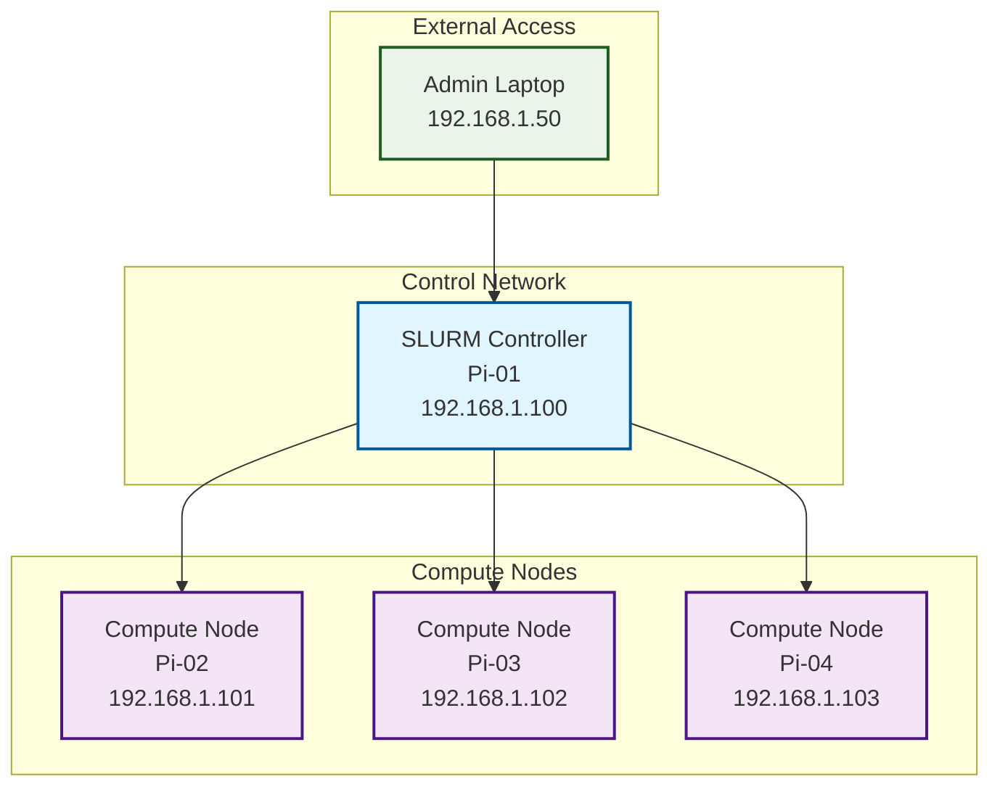
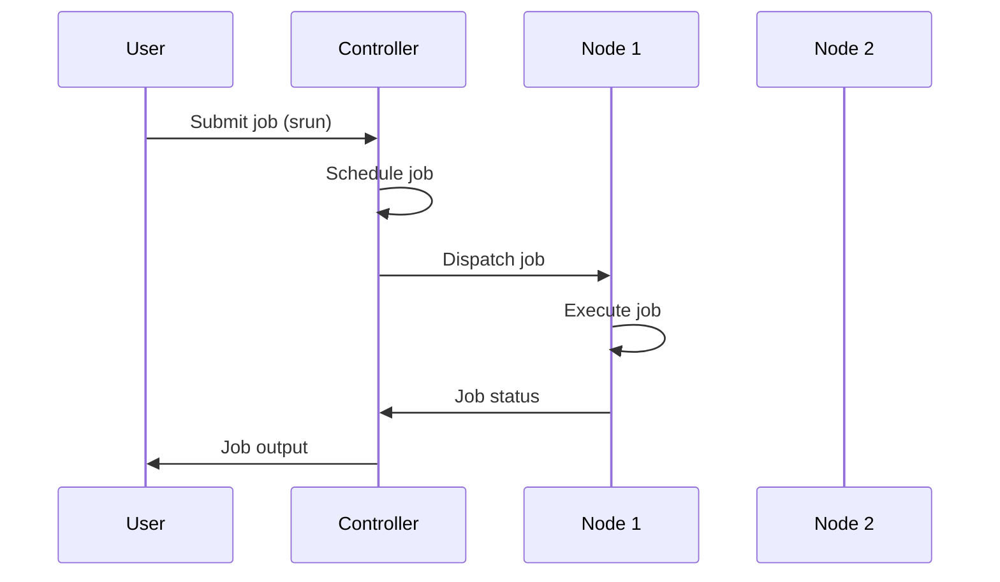

# Deploying SLURM on a Raspberry Pi Cluster with Ansible

**Objective**: Master cluster automation with Ansible and SLURM on Raspberry Pi hardware. When you need to learn HPC concepts, when you want reproducible cluster deployments, when you're building educational or development clusters—Ansible becomes your weapon of choice.

SLURM (Simple Linux Utility for Resource Management) is the de facto standard for job scheduling in HPC environments. Raspberry Pi clusters provide an affordable way to learn HPC concepts, and Ansible makes cluster deployment reproducible and scalable. This tutorial shows you how to wield Ansible with the precision of a cluster administrator.

## 0) Prerequisites (Read Once, Live by Them)

### The Five Commandments

1. **Understand cluster fundamentals**
   - SLURM controller and compute node roles
   - Job scheduling and resource management
   - Network topology and communication
   - Security and authentication (Munge)

2. **Master Ansible automation**
   - Inventory management and grouping
   - Playbook structure and roles
   - Template rendering and variable management
   - Idempotent operations and error handling

3. **Know your hardware constraints**
   - Raspberry Pi ARM architecture
   - Memory and CPU limitations
   - Network bandwidth considerations
   - Storage and I/O patterns

4. **Validate everything**
   - Test playbooks on single nodes
   - Verify SLURM configuration
   - Monitor cluster health
   - Test job submission and execution

5. **Plan for production**
   - Security hardening
   - Monitoring and logging
   - Backup and recovery
   - Scaling and maintenance

**Why These Principles**: Cluster automation requires understanding both HPC concepts and infrastructure automation. Understanding these patterns prevents configuration drift and enables reliable cluster operations.

## 1) Prerequisites

### Hardware Requirements

```yaml
# Minimum hardware specification
hardware_requirements:
  controller_node:
    - "Raspberry Pi 4B (4GB+ RAM recommended)"
    - "32GB+ microSD card"
    - "Ethernet connection"
  
  compute_nodes:
    - "Raspberry Pi 4B (2GB+ RAM minimum)"
    - "16GB+ microSD card"
    - "Ethernet connection"
  
  network_infrastructure:
    - "Gigabit Ethernet switch"
    - "Static IP addresses or DNS resolution"
    - "SSH access to all nodes"
  
  control_machine:
    - "Linux/macOS laptop or desktop"
    - "Ansible installed"
    - "SSH key access to all Pi nodes"
```

### Software Requirements

```bash
# Install Ansible on control machine
# Ubuntu/Debian
sudo apt update
sudo apt install ansible

# macOS
brew install ansible

# Verify installation
ansible --version
```

### Network Setup

```bash
# Example network configuration
# Controller: 192.168.1.100
# Compute nodes: 192.168.1.101-103
# Gateway: 192.168.1.1

# Test connectivity
ping 192.168.1.100
ssh pi@192.168.1.100
```

**Why These Prerequisites Matter**: Proper hardware and network setup prevents deployment failures. Understanding these requirements enables reliable cluster automation.

## 2) Cluster Topology Diagram

### SLURM Cluster Architecture



### Cluster Communication Flow



**Why This Architecture Matters**: Understanding cluster topology enables proper configuration and troubleshooting. This diagram shows the relationship between components and data flow.

## 3) Ansible Inventory Setup

### Inventory File Structure

```ini
# inventory.ini
[controller]
pi-master ansible_host=192.168.1.100 ansible_user=pi

[compute]
pi-node1 ansible_host=192.168.1.101 ansible_user=pi
pi-node2 ansible_host=192.168.1.102 ansible_user=pi
pi-node3 ansible_host=192.168.1.103 ansible_user=pi

[cluster:children]
controller
compute

# Group variables
[cluster:vars]
ansible_ssh_private_key_file=~/.ssh/id_rsa
ansible_ssh_common_args='-o StrictHostKeyChecking=no'
```

### Host Variables

```yaml
# host_vars/pi-master.yml
slurm_role: controller
slurm_node_name: pi-master
slurm_node_addr: 192.168.1.100
```

```yaml
# host_vars/pi-node1.yml
slurm_role: compute
slurm_node_name: pi-node1
slurm_node_addr: 192.168.1.101
```

### Group Variables

```yaml
# group_vars/all.yml
# SLURM configuration
slurm_cluster_name: "pi-cluster"
slurm_control_machine: "pi-master"
slurm_control_addr: "192.168.1.100"

# Network configuration
cluster_network: "192.168.1.0/24"
ntp_servers:
  - "pool.ntp.org"
  - "time.google.com"

# Security
munge_key_path: "/etc/munge/munge.key"
slurm_user: "slurm"
slurm_group: "slurm"
```

**Why Inventory Structure Matters**: Proper inventory organization enables targeted deployments and consistent configuration. Understanding these patterns prevents configuration errors and enables scalable automation.

## 4) Ansible Configuration

### Ansible Configuration File

```ini
# ansible.cfg
[defaults]
inventory = inventory.ini
host_key_checking = False
gathering = smart
fact_caching = memory
stdout_callback = yaml

[ssh_connection]
ssh_args = -o ControlMaster=auto -o ControlPersist=60s
pipelining = True
```

### SSH Key Setup

```bash
# Generate SSH key if not exists
ssh-keygen -t rsa -b 4096 -f ~/.ssh/id_rsa

# Copy public key to all Pi nodes
ssh-copy-id pi@192.168.1.100
ssh-copy-id pi@192.168.1.101
ssh-copy-id pi@192.168.1.102
ssh-copy-id pi@192.168.1.103

# Test connectivity
ansible all -m ping
```

**Why Ansible Configuration Matters**: Proper configuration ensures reliable connections and consistent behavior. Understanding these settings prevents deployment issues and enables efficient automation.

## 5) Ansible Playbooks

### Base System Setup

```yaml
# playbooks/setup.yml
---
- name: "Setup base system on all nodes"
  hosts: all
  become: yes
  gather_facts: yes
  
  tasks:
    - name: "Update package cache"
      apt:
        update_cache: yes
        cache_valid_time: 3600
    
    - name: "Install essential packages"
      apt:
        name:
          - build-essential
          - curl
          - wget
          - git
          - vim
          - htop
          - tree
        state: present
    
    - name: "Install SLURM dependencies"
      apt:
        name:
          - slurm-wlm
          - slurm-wlm-torque
          - munge
          - libmunge-dev
        state: present
    
    - name: "Create SLURM user and group"
      user:
        name: "{{ slurm_user }}"
        group: "{{ slurm_group }}"
        system: yes
        shell: /bin/false
        home: /var/lib/slurm
        create_home: yes
    
    - name: "Create SLURM directories"
      file:
        path: "{{ item }}"
        state: directory
        owner: "{{ slurm_user }}"
        group: "{{ slurm_group }}"
        mode: '0755'
      loop:
        - /var/log/slurm
        - /var/spool/slurm
        - /etc/slurm
```

### Munge Configuration

```yaml
# playbooks/munge.yml
---
- name: "Configure Munge authentication"
  hosts: all
  become: yes
  
  tasks:
    - name: "Stop Munge service"
      systemd:
        name: munge
        state: stopped
    
    - name: "Generate Munge key on controller"
      command: create-munge-key
      args:
        creates: "{{ munge_key_path }}"
      when: inventory_hostname == slurm_control_machine
      delegate_to: "{{ hostvars[slurm_control_machine] }}"
    
    - name: "Copy Munge key from controller"
      copy:
        src: "{{ munge_key_path }}"
        dest: "{{ munge_key_path }}"
        owner: munge
        group: munge
        mode: '0400'
      when: inventory_hostname != slurm_control_machine
    
    - name: "Start and enable Munge"
      systemd:
        name: munge
        state: started
        enabled: yes
```

### SLURM Controller Configuration

```yaml
# playbooks/slurm-controller.yml
---
- name: "Configure SLURM controller"
  hosts: controller
  become: yes
  
  tasks:
    - name: "Create SLURM configuration directory"
      file:
        path: /etc/slurm
        state: directory
        owner: "{{ slurm_user }}"
        group: "{{ slurm_group }}"
        mode: '0755'
    
    - name: "Generate SLURM configuration"
      template:
        src: slurm.conf.j2
        dest: /etc/slurm/slurm.conf
        owner: "{{ slurm_user }}"
        group: "{{ slurm_group }}"
        mode: '0644'
      notify: restart slurmctld
    
    - name: "Start and enable SLURM controller"
      systemd:
        name: slurmctld
        state: started
        enabled: yes
    
    - name: "Wait for SLURM controller to start"
      wait_for:
        port: 6817
        host: "{{ slurm_control_addr }}"
        timeout: 30
  
  handlers:
    - name: restart slurmctld
      systemd:
        name: slurmctld
        state: restarted
```

### SLURM Compute Node Configuration

```yaml
# playbooks/slurm-compute.yml
---
- name: "Configure SLURM compute nodes"
  hosts: compute
  become: yes
  
  tasks:
    - name: "Copy SLURM configuration from controller"
      copy:
        src: /etc/slurm/slurm.conf
        dest: /etc/slurm/slurm.conf
        owner: "{{ slurm_user }}"
        group: "{{ slurm_group }}"
        mode: '0644'
      delegate_to: "{{ hostvars[slurm_control_machine] }}"
    
    - name: "Start and enable SLURM daemon"
      systemd:
        name: slurmd
        state: started
        enabled: yes
    
    - name: "Wait for SLURM daemon to start"
      wait_for:
        port: 6818
        host: "{{ ansible_default_ipv4.address }}"
        timeout: 30
```

**Why These Playbooks Matter**: Structured playbooks enable reliable cluster deployment. Understanding these patterns prevents configuration errors and enables scalable automation.

## 6) SLURM Configuration Template

### SLURM Configuration Template

```jinja2
# templates/slurm.conf.j2
# SLURM configuration for Raspberry Pi cluster
# Generated by Ansible

# Basic cluster information
ClusterName={{ slurm_cluster_name }}
ControlMachine={{ slurm_control_machine }}
ControlAddr={{ slurm_control_addr }}

# Authentication
AuthType=auth/munge
CryptoType=crypto/munge

# Job accounting
JobAcctGatherType=jobacct_gather/linux
JobAcctGatherFrequency=30
AccountingStorageType=accounting_storage/slurmdbd
AccountingStorageHost={{ slurm_control_machine }}

# Scheduler configuration
SchedulerType=sched/backfill
SchedulerParameters=bf_continue,bf_interval=30,bf_max_job_test=1000,bf_window=86400

# Node configuration

NodeName={{ hostvars[host]['slurm_node_name'] }} \
    NodeAddr={{ hostvars[host]['slurm_node_addr'] }} \
    CPUs={{ ansible_processor_vcpus | default(4) }} \
    Sockets=1 \
    CoresPerSocket={{ ansible_processor_vcpus | default(4) }} \
    ThreadsPerCore=1 \
    State=UNKNOWN


# Partition configuration
PartitionName=compute \
    Nodes={{ groups['compute'] | join(',') }} \
    Default=YES \
    MaxTime=INFINITE \
    State=UP

# Prolog and Epilog
Prolog=/etc/slurm/prolog.sh
Epilog=/etc/slurm/epilog.sh

# Logging
SlurmctldLogFile=/var/log/slurm/slurmctld.log
SlurmdLogFile=/var/log/slurm/slurmd.log
SlurmctldDebug=3
SlurmdDebug=3

# Timeouts
SlurmctldTimeout=300
SlurmdTimeout=300
InactiveLimit=0
MinJobAge=300
KillWait=30
Waittime=0

# Memory and CPU limits
MaxJobCount=10000
MaxArraySize=1000
MaxJobId=999999
```

### Prolog and Epilog Scripts

```bash
# templates/prolog.sh.j2
#!/bin/bash
# SLURM prolog script
# Generated by Ansible

# Set up job environment
export SLURM_JOB_ID=$SLURM_JOB_ID
export SLURM_JOB_NAME=$SLURM_JOB_NAME
export SLURM_JOB_USER=$SLURM_JOB_USER

# Log job start
echo "$(date): Job $SLURM_JOB_ID started on node $SLURM_NODELIST" >> /var/log/slurm/jobs.log

# Set up any required environment variables
export TMPDIR=/tmp/slurm-$SLURM_JOB_ID
mkdir -p $TMPDIR
```

```bash
# templates/epilog.sh.j2
#!/bin/bash
# SLURM epilog script
# Generated by Ansible

# Clean up job environment
export TMPDIR=/tmp/slurm-$SLURM_JOB_ID
if [ -d "$TMPDIR" ]; then
    rm -rf $TMPDIR
fi

# Log job completion
echo "$(date): Job $SLURM_JOB_ID completed on node $SLURM_NODELIST" >> /var/log/slurm/jobs.log
```

**Why Configuration Templates Matter**: Proper SLURM configuration enables reliable job scheduling and resource management. Understanding these templates prevents configuration errors and enables optimal cluster performance.

## 7) Running the Playbooks

### Complete Deployment Workflow

```bash
# 1. Test connectivity
ansible all -m ping

# 2. Setup base system
ansible-playbook -i inventory.ini playbooks/setup.yml

# 3. Configure Munge authentication
ansible-playbook -i inventory.ini playbooks/munge.yml

# 4. Configure SLURM controller
ansible-playbook -i inventory.ini playbooks/slurm-controller.yml

# 5. Configure compute nodes
ansible-playbook -i inventory.ini playbooks/slurm-compute.yml

# 6. Verify cluster status
ansible controller -m shell -a "sinfo"
```

### Tagged Execution

```bash
# Run specific components
ansible-playbook -i inventory.ini playbooks/setup.yml --tags "packages"
ansible-playbook -i inventory.ini playbooks/slurm-controller.yml --tags "config"
ansible-playbook -i inventory.ini playbooks/slurm-compute.yml --tags "daemon"
```

### Dry Run and Check Mode

```bash
# Check what would be changed
ansible-playbook -i inventory.ini playbooks/setup.yml --check

# Verbose output for debugging
ansible-playbook -i inventory.ini playbooks/setup.yml -v

# Limit to specific hosts
ansible-playbook -i inventory.ini playbooks/setup.yml --limit compute
```

**Why Deployment Workflow Matters**: Structured deployment prevents configuration errors and enables reliable cluster setup. Understanding these patterns prevents deployment failures and enables efficient automation.

## 8) Verification and Testing

### Cluster Status Verification

```bash
# Check cluster status
sinfo

# Check node status
sinfo -N

# Check partition status
sinfo -p compute

# Check controller status
scontrol show config
```

### Job Submission Testing

```bash
# Test simple job
srun hostname

# Test parallel job
srun -N 2 -n 4 hostname

# Test job with specific requirements
srun -N 1 -n 2 -c 2 --mem=1G hostname

# Test job array
srun -a 1-4 hostname
```

### Resource Monitoring

```bash
# Check job queue
squeue

# Check specific user jobs
squeue -u $USER

# Check job details
scontrol show job <job_id>

# Check node details
scontrol show node <node_name>
```

### Performance Testing

```bash
# Test CPU performance
srun -N 1 -n 4 --cpus-per-task=1 python3 -c "
import time
start = time.time()
sum(i*i for i in range(1000000))
print(f'CPU test: {time.time() - start:.2f}s')
"

# Test memory allocation
srun -N 1 -n 1 --mem=1G python3 -c "
import numpy as np
arr = np.random.random((1000, 1000))
print(f'Memory test: {arr.nbytes / 1024 / 1024:.2f} MB allocated')
"
```

**Why Verification Matters**: Proper testing ensures cluster functionality and performance. Understanding these patterns prevents production issues and enables reliable cluster operations.

## 9) Best Practices

### Configuration Management

```yaml
# group_vars/all.yml - Security settings
security_settings:
  firewall_enabled: true
  ssh_key_only: true
  munge_key_rotation: 30  # days
  
# group_vars/all.yml - Monitoring
monitoring:
  log_level: "info"
  log_retention: 30  # days
  metrics_collection: true
```

### Secrets Management

```bash
# Encrypt sensitive data with Ansible Vault
ansible-vault create group_vars/all/secrets.yml

# Edit encrypted file
ansible-vault edit group_vars/all/secrets.yml

# Run playbooks with vault
ansible-playbook -i inventory.ini playbooks/setup.yml --ask-vault-pass
```

### Scaling and Maintenance

```bash
# Add new compute node
echo "pi-node4 ansible_host=192.168.1.104 ansible_user=pi" >> inventory.ini

# Update group variables
ansible-playbook -i inventory.ini playbooks/setup.yml --limit pi-node4

# Remove node from cluster
scontrol update nodename=pi-node4 state=drain
scontrol update nodename=pi-node4 state=down
```

### Backup and Recovery

```bash
# Backup SLURM configuration
ansible controller -m archive -a "path=/etc/slurm dest=/tmp/slurm-config-backup.tar.gz"

# Backup Munge key
ansible controller -m copy -a "src=/etc/munge/munge.key dest=/tmp/munge.key.backup"

# Restore configuration
ansible controller -m unarchive -a "src=/tmp/slurm-config-backup.tar.gz dest=/etc/slurm"
```

**Why Best Practices Matter**: Proper cluster management ensures reliability and security. Understanding these patterns prevents configuration drift and enables sustainable cluster operations.

## 10) Extensions and Advanced Configuration

### Shared Storage with NFS

```yaml
# playbooks/nfs.yml
---
- name: "Setup NFS shared storage"
  hosts: all
  become: yes
  
  tasks:
    - name: "Install NFS packages"
      apt:
        name:
          - nfs-kernel-server
          - nfs-common
        state: present
    
    - name: "Create shared directory"
      file:
        path: /shared
        state: directory
        mode: '0777'
    
    - name: "Configure NFS exports"
      lineinfile:
        path: /etc/exports
        line: "/shared {{ cluster_network }}(rw,sync,no_subtree_check)"
        state: present
      when: inventory_hostname == slurm_control_machine
    
    - name: "Start NFS services"
      systemd:
        name: "{{ item }}"
        state: started
        enabled: yes
      loop:
        - nfs-kernel-server
        - nfs-common
```

### Resource Limits with cgroups

```yaml
# playbooks/cgroups.yml
---
- name: "Configure cgroups for resource limits"
  hosts: all
  become: yes
  
  tasks:
    - name: "Install cgroups tools"
      apt:
        name:
          - cgroup-tools
          - libcgroup1
        state: present
    
    - name: "Configure cgroups for SLURM"
      lineinfile:
        path: /etc/slurm/slurm.conf
        line: "CgroupMountpoint=/sys/fs/cgroup"
        state: present
    
    - name: "Enable cgroups in SLURM"
      lineinfile:
        path: /etc/slurm/slurm.conf
        line: "CgroupAutomount=yes"
        state: present
```

### Monitoring with Prometheus

```yaml
# playbooks/monitoring.yml
---
- name: "Setup Prometheus monitoring"
  hosts: controller
  become: yes
  
  tasks:
    - name: "Install Prometheus"
      apt:
        name: prometheus
        state: present
    
    - name: "Configure Prometheus"
      template:
        src: prometheus.yml.j2
        dest: /etc/prometheus/prometheus.yml
    
    - name: "Start Prometheus"
      systemd:
        name: prometheus
        state: started
        enabled: yes
```

**Why Extensions Matter**: Advanced configuration enables production-ready clusters. Understanding these patterns prevents limitations and enables scalable cluster operations.

## 11) Full Example Repository Structure

### Complete Project Structure

```
ansible-slurm-pi/
├── ansible.cfg
├── inventory.ini
├── group_vars/
│   ├── all.yml
│   └── all/
│       └── secrets.yml
├── host_vars/
│   ├── pi-master.yml
│   ├── pi-node1.yml
│   ├── pi-node2.yml
│   └── pi-node3.yml
├── playbooks/
│   ├── setup.yml
│   ├── munge.yml
│   ├── slurm-controller.yml
│   ├── slurm-compute.yml
│   ├── nfs.yml
│   ├── cgroups.yml
│   └── monitoring.yml
├── templates/
│   ├── slurm.conf.j2
│   ├── prolog.sh.j2
│   ├── epilog.sh.j2
│   └── prometheus.yml.j2
├── roles/
│   └── slurm/
│       ├── tasks/
│       ├── handlers/
│       ├── templates/
│       └── vars/
├── scripts/
│   ├── deploy.sh
│   ├── verify.sh
│   └── backup.sh
└── README.md
```

### Deployment Script

```bash
#!/bin/bash
# scripts/deploy.sh

set -e

echo "Starting SLURM cluster deployment..."

# Test connectivity
echo "Testing connectivity..."
ansible all -m ping

# Deploy base system
echo "Setting up base system..."
ansible-playbook -i inventory.ini playbooks/setup.yml

# Configure Munge
echo "Configuring Munge authentication..."
ansible-playbook -i inventory.ini playbooks/munge.yml

# Configure SLURM controller
echo "Configuring SLURM controller..."
ansible-playbook -i inventory.ini playbooks/slurm-controller.yml

# Configure compute nodes
echo "Configuring compute nodes..."
ansible-playbook -i inventory.ini playbooks/slurm-compute.yml

# Verify cluster
echo "Verifying cluster..."
ansible controller -m shell -a "sinfo"

echo "SLURM cluster deployment completed!"
```

### Verification Script

```bash
#!/bin/bash
# scripts/verify.sh

echo "Verifying SLURM cluster..."

# Check cluster status
echo "Cluster status:"
ansible controller -m shell -a "sinfo"

# Check node status
echo "Node status:"
ansible controller -m shell -a "sinfo -N"

# Test job submission
echo "Testing job submission..."
ansible controller -m shell -a "srun hostname"

# Check job queue
echo "Job queue:"
ansible controller -m shell -a "squeue"

echo "Verification completed!"
```

**Why Repository Structure Matters**: Organized project structure enables maintainable automation. Understanding these patterns prevents configuration drift and enables scalable cluster management.

## 12) TL;DR Quickstart

### Essential Commands

```bash
# 1. Clone and setup
git clone <your-repo>
cd ansible-slurm-pi

# 2. Configure inventory
cp inventory.ini.example inventory.ini
# Edit inventory.ini with your Pi IPs

# 3. Setup SSH keys
ssh-copy-id pi@<controller-ip>
ssh-copy-id pi@<compute-ip-1>
ssh-copy-id pi@<compute-ip-2>

# 4. Deploy cluster
./scripts/deploy.sh

# 5. Verify cluster
./scripts/verify.sh

# 6. Test job submission
ansible controller -m shell -a "srun hostname"
```

### Essential Patterns

```yaml
# Essential Ansible patterns
ansible_patterns:
  connectivity: "ansible all -m ping"
  base_setup: "ansible-playbook -i inventory.ini playbooks/setup.yml"
  munge_config: "ansible-playbook -i inventory.ini playbooks/munge.yml"
  controller_config: "ansible-playbook -i inventory.ini playbooks/slurm-controller.yml"
  compute_config: "ansible-playbook -i inventory.ini playbooks/slurm-compute.yml"
  cluster_status: "ansible controller -m shell -a 'sinfo'"
  job_test: "ansible controller -m shell -a 'srun hostname'"
```

### Troubleshooting Checklist

```bash
# Troubleshooting checklist
troubleshooting:
  connectivity: "ansible all -m ping"
  services: "ansible all -m shell -a 'systemctl status slurmd'"
  logs: "ansible all -m shell -a 'journalctl -u slurmd -f'"
  config: "ansible controller -m shell -a 'scontrol show config'"
  nodes: "ansible controller -m shell -a 'scontrol show nodes'"
```

**Why This Quickstart**: These patterns cover 90% of SLURM cluster deployment. Master these before exploring advanced features.

## 13) The Machine's Summary

SLURM cluster deployment requires understanding both HPC concepts and infrastructure automation. When used correctly, Ansible enables reproducible cluster deployments that scale from educational clusters to production HPC environments. The key is understanding cluster topology, mastering Ansible automation, and following best practices.

**The Dark Truth**: Without proper cluster understanding, your HPC environment is fragile and unmaintainable. Ansible is your weapon. Use it wisely.

**The Machine's Mantra**: "In automation we trust, in SLURM we schedule, and in the cluster we find the path to scalable high-performance computing."

**Why This Matters**: Cluster automation enables reproducible HPC environments that can scale from educational clusters to production systems. It provides the foundation for reliable high-performance computing that can handle complex workloads and maintain system integrity.

---

*This tutorial provides the complete machinery for deploying SLURM clusters with Ansible. The patterns scale from simple educational clusters to complex production HPC environments, from basic job scheduling to advanced resource management.*
