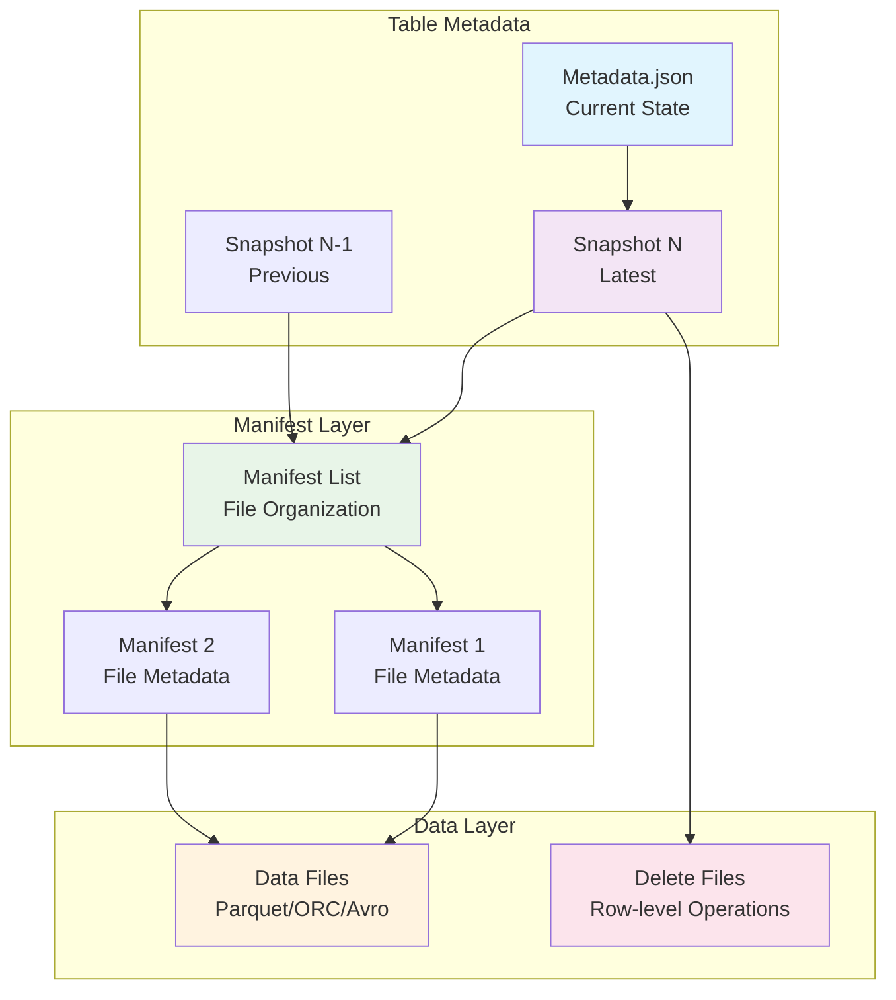

# Apache Iceberg Mastery: Build, Break, and Bend ACID Tables in the Data Lake

**Objective**: Master Apache Iceberg for ACID table management in data lakes. When you need lake economics with warehouse discipline, when you're building scalable data platforms, when you need schema evolution and time travel—Apache Iceberg becomes your weapon of choice.

Apache Iceberg is the cold, exacting edge of modern data architecture. Without proper Iceberg understanding, you're building on unstable foundations with inconsistent data, poor performance, and governance nightmares. This guide shows you how to wield Iceberg with the precision of a data platform engineer.

## 0) Prerequisites (Read Once, Live by Them)

### The Five Commandments

1. **Understand the table format**
   - Metadata-driven architecture
   - Snapshot isolation and ACID guarantees
   - Multi-engine compatibility

2. **Master the features**
   - Schema evolution and hidden partitioning
   - Time travel and branching
   - Row-level operations and MERGE

3. **Know your patterns**
   - Table lifecycle management
   - Maintenance and optimization
   - Streaming and CDC integration

4. **Validate everything**
   - Data consistency and integrity
   - Performance under load
   - Governance and compliance

5. **Plan for production**
   - Catalog management and HA
   - Monitoring and observability
   - Security and access control

**Why These Principles**: Apache Iceberg mastery is the foundation of modern data lake architecture. Understanding the table format, mastering the features, and following best practices is essential for building scalable, reliable data platforms.

## 1) What Iceberg Actually Is (The Foundation)

### Core Concepts

```yaml
# Iceberg is a table format specification
# It defines how tables are stored in object storage (S3, MinIO, GCS, Azure)

iceberg_architecture:
  metadata:
    - "Metadata.json (current state)"
    - "Snapshot files (version history)"
    - "Manifest lists (file organization)"
    - "Manifests (file metadata and stats)"
  
  data_files:
    - "Parquet (default, columnar)"
    - "ORC (columnar, Hive-compatible)"
    - "Avro (row-based, streaming)"
  
  features:
    - "ACID transactions"
    - "Schema evolution"
    - "Hidden partitioning"
    - "Time travel"
    - "Branches and tags"
    - "Row-level operations"
```

### Iceberg Architecture



### Why Iceberg Matters

```bash
# Iceberg provides:
# - ACID transactions on object storage
# - Multi-engine compatibility (Spark, Trino, Flink, Presto)
# - Schema evolution without breaking changes
# - Hidden partitioning for optimal performance
# - Time travel and audit capabilities
# - Row-level operations (DELETE, UPDATE, MERGE)
# - Governance features (branches, tags, metadata tables)
```

**Why Iceberg Matters**: Apache Iceberg provides ACID table semantics on object storage, enabling lake economics with warehouse discipline. It's essential for modern data lake architecture and multi-engine analytics.

## 2) Standing Up a Local Lakehouse (The Environment)

### Docker Compose Stack

```yaml
# docker-compose.yml
version: "3.9"

services:
  minio:
    image: minio/minio:RELEASE.2024-08-17T01-24-54Z
    command: server /data --console-address ":9001"
    environment:
      MINIO_ROOT_USER: admin
      MINIO_ROOT_PASSWORD: password
    ports:
      - "9000:9000"
      - "9001:9001"
    volumes:
      - minio_data:/data
    healthcheck:
      test: ["CMD", "mc", "ready", "local"]
      interval: 10s
      timeout: 5s
      retries: 5

  mc:
    image: minio/mc:RELEASE.2024-08-17T00-49-00Z
    depends_on:
      minio:
        condition: service_healthy
    entrypoint: >
      /bin/sh -c "
      mc alias set local http://minio:9000 admin password &&
      mc mb -p local/lake/warehouse &&
      tail -f /dev/null
      "

  nessie:
    image: ghcr.io/projectnessie/nessie:0.81.0
    environment:
      QUARKUS_HTTP_PORT: "19120"
      QUARKUS_PROFILE: prod
    ports:
      - "19120:19120"
    healthcheck:
      test: ["CMD", "curl", "-f", "http://localhost:19120/api/v2/config"]
      interval: 10s
      timeout: 5s
      retries: 5

  trino:
    image: trinodb/trino:435
    depends_on:
      nessie:
        condition: service_healthy
      minio:
        condition: service_healthy
    ports:
      - "8080:8080"
    volumes:
      - ./trino/catalog:/etc/trino/catalog
    healthcheck:
      test: ["CMD", "curl", "-f", "http://localhost:8080/v1/info"]
      interval: 10s
      timeout: 5s
      retries: 5

  spark:
    image: bitnami/spark:3.5.1
    environment:
      SPARK_MODE: master
      SPARK_USER: root
    ports:
      - "7077:7077"
      - "8081:8080"
    depends_on:
      nessie:
        condition: service_healthy
      minio:
        condition: service_healthy

volumes:
  minio_data:
```

### Trino Iceberg Catalog Configuration

```properties
# trino/catalog/iceberg.properties
connector.name=iceberg
iceberg.catalog.type=rest

# Nessie as REST catalog
iceberg.rest-catalog.uri=http://nessie:19120/api/v2
iceberg.rest-catalog.warehouse=s3://lake/warehouse

# S3/MinIO settings for both data & metadata locations
s3.endpoint=http://minio:9000
s3.path-style-access=true
s3.aws-access-key=admin
s3.aws-secret-key=password

# Performance & file-format defaults
iceberg.file-format=PARQUET
iceberg.concurrent-writes=true
iceberg.hive-catalog-cache-ttl=1m
```

### Bring Up the Stack

```bash
# Start the stack
docker compose up -d

# Check services
docker compose ps

# Access interfaces
# Trino UI: http://localhost:8080
# MinIO Console: http://localhost:9001 (admin/password)
# Nessie API: http://localhost:19120/api/v2
```

**Why This Setup**: A complete Iceberg stack provides hands-on experience with all components. MinIO provides S3-compatible storage, Nessie provides catalog services, Trino provides SQL access, and Spark provides data processing capabilities.

## 3) First Contact: Create and Query Iceberg Tables

### Basic Table Creation

```sql
-- Create schema
CREATE SCHEMA IF NOT EXISTS iceberg.demo
WITH (location = 's3://lake/warehouse/demo');

USE iceberg.demo;

-- Create table with hidden partitioning
CREATE TABLE events (
  id        BIGINT,
  user_id   BIGINT,
  ts        TIMESTAMP,
  kind      VARCHAR,
  payload   VARCHAR
)
WITH (
  format = 'PARQUET',
  partitioning = ARRAY['days(ts)']  -- hidden partition transform
);
```

### Data Ingestion

```sql
-- Insert sample data
INSERT INTO events VALUES
  (1, 101, TIMESTAMP '2025-10-03 10:00:00', 'signup',   '{"src":"ad"}'),
  (2, 101, TIMESTAMP '2025-10-03 10:05:00', 'click',    '{"btn":"cta"}'),
  (3, 202, TIMESTAMP '2025-10-02 08:00:00', 'purchase', '{"amt": 44.20}');

-- Query data
SELECT kind, count(*) FROM events GROUP BY 1 ORDER BY 2 DESC;
```

### Understanding What Happened

```sql
-- Show table metadata
SELECT * FROM "events$properties";

-- Show snapshots
SELECT * FROM "events$snapshots";

-- Show files
SELECT * FROM "events$files" ORDER BY file_size_in_bytes DESC LIMIT 5;
```

**Why This Matters**: Basic table creation and data ingestion demonstrate Iceberg's core functionality. Understanding metadata tables provides insight into how Iceberg organizes data and tracks changes.

## 4) Time Travel: Snapshots, Tags, and Branches

### Snapshot Management

```sql
-- Show all snapshots
SELECT * FROM "events$snapshots" ORDER BY committed_at;

-- Time travel by timestamp
SELECT * FROM events 
FOR TIMESTAMP AS OF timestamp '2025-10-03 10:06:00';

-- Time travel by snapshot ID
SELECT * FROM events 
FOR VERSION AS OF <snapshot_id>;
```

### Branch and Tag Operations

```sql
-- Create a branch
CALL system.create_reference('BRANCH', 'feature_x', 'main', null);

-- Switch to branch
CALL system.use_reference('feature_x');

-- Make changes on branch
INSERT INTO events VALUES (4, 303, TIMESTAMP '2025-10-03 11:00:00', 'test', '{"env":"dev"}');

-- Merge branch back to main
CALL system.merge_reference('feature_x', 'main', 'no-conflict');
```

### History and Lineage

```sql
-- Show table history
SELECT * FROM "events$history";

-- Show partition evolution
SELECT * FROM "events$partitions";

-- Show manifest information
SELECT * FROM "events$manifests";
```

**Why This Matters**: Time travel and branching provide powerful governance capabilities. Snapshots enable audit trails, while branches enable safe schema evolution and testing.

## 5) Schema and Partition Evolution

### Safe Schema Changes

```sql
-- Add columns (safe, forward-compatible)
ALTER TABLE events ADD COLUMN device VARCHAR;

-- Rename columns (safe, tracked by field IDs)
ALTER TABLE events RENAME COLUMN payload TO attributes;

-- Show schema evolution
SELECT * FROM "events$snapshots" ORDER BY committed_at;
```

### Partition Spec Evolution

```sql
-- Evolve partition spec to hours(ts)
ALTER TABLE events SET PROPERTIES 
  partitioning = ARRAY['hours(ts)'];

-- Old files keep days(ts), new files use hours(ts)
-- The planner prunes across both specs
SELECT * FROM "events$partitions";
```

### Schema Validation

```sql
-- Check current schema
DESCRIBE events;

-- Validate partition transforms
SELECT * FROM "events$properties" 
WHERE key = 'partition-spec';
```

**Why This Matters**: Schema evolution enables data platform evolution without breaking changes. Partition spec evolution allows optimization without data migration.

## 6) Row-Level Operations: DELETE, UPDATE, MERGE

### Delete Operations

```sql
-- Delete specific rows
DELETE FROM events WHERE kind = 'click';

-- Check delete files
SELECT * FROM "events$files" WHERE content = 1;
```

### Update Operations

```sql
-- Update specific rows
UPDATE events 
SET kind = 'purchase' 
WHERE id = 1;

-- Verify updates
SELECT * FROM events WHERE id = 1;
```

### MERGE Operations

```sql
-- MERGE (upsert) example
MERGE INTO events t
USING (VALUES (101, TIMESTAMP '2025-10-03 11:00:00', 'click', '{"btn":"alt"}')) 
  s(user_id, ts, kind, attributes)
ON t.user_id = s.user_id AND date(t.ts) = date(s.ts)
WHEN MATCHED THEN 
  UPDATE SET kind = s.kind, attributes = s.attributes
WHEN NOT MATCHED THEN 
  INSERT (id, user_id, ts, kind, attributes)
  VALUES (random(), s.user_id, s.ts, s.kind, s.attributes);
```

### Understanding Delete Files

```sql
-- Show delete files
SELECT * FROM "events$files" WHERE content = 1;

-- Show equality deletes
SELECT * FROM "events$files" WHERE content = 1 AND file_format = 'PARQUET';
```

**Why This Matters**: Row-level operations enable fine-grained data management. Understanding delete files provides insight into how Iceberg maintains ACID guarantees.

## 7) Metadata Tables: Your X-Ray Vision

### File-Level Analysis

```sql
-- File-level view (size, partition, metrics)
SELECT 
  file_path,
  file_size_in_bytes,
  partition,
  record_count,
  null_value_counts
FROM "events$files" 
ORDER BY file_size_in_bytes DESC 
LIMIT 5;
```

### Manifest Analysis

```sql
-- Manifest information
SELECT 
  manifest_path,
  length,
  added_snapshot_id,
  added_files_count,
  deleted_files_count
FROM "events$manifests";
```

### Partition Analysis

```sql
-- Partition information
SELECT 
  partition,
  record_count,
  file_count,
  total_size
FROM "events$partitions";
```

### Snapshot Analysis

```sql
-- Snapshot details
SELECT 
  snapshot_id,
  committed_at,
  operation,
  summary
FROM "events$snapshots" 
ORDER BY committed_at DESC;
```

**Why This Matters**: Metadata tables provide deep insight into table structure and performance. They enable optimization, debugging, and governance.

## 8) Maintenance: Compaction and Optimization

### Spark Maintenance Setup

```bash
# Access Spark container
docker exec -it $(docker ps --format '{{.ID}} {{.Image}}' | awk '/spark/{print $1; exit}') bash

# Start Spark shell with Iceberg dependencies
/opt/bitnami/spark/bin/spark-shell \
  --packages org.apache.iceberg:iceberg-spark-runtime-3.5_2.12:1.6.1 \
  --conf spark.sql.catalog.lh=org.apache.iceberg.spark.SparkCatalog \
  --conf spark.sql.catalog.lh.type=rest \
  --conf spark.sql.catalog.lh.uri=http://nessie:19120/api/v2 \
  --conf spark.sql.catalog.lh.warehouse=s3://lake/warehouse \
  --conf spark.sql.catalog.lh.s3.endpoint=http://minio:9000 \
  --conf spark.sql.catalog.lh.s3.path-style-access=true \
  --conf spark.sql.catalog.lh.s3.access-key=admin \
  --conf spark.sql.catalog.lh.s3.secret-key=password
```

### Compaction Operations

```scala
// In Spark shell
import org.apache.iceberg.actions.Actions

val tbl = "lh.demo.events"

// 1) Bin-pack (compact small files)
Actions.forTable(spark, tbl)
  .rewriteDataFiles()
  .option("target-file-size-bytes", (256L * 1024 * 1024).toString)
  .execute()

// 2) Rewrite manifests (fewer metadata files)
Actions.forTable(spark, tbl)
  .rewriteManifests()
  .execute()

// 3) Expire old snapshots (reclaim storage)
Actions.forTable(spark, tbl)
  .expireSnapshots()
  .expireOlderThan(java.time.Instant.now().minus(java.time.Duration.ofDays(7)))
  .execute()
```

### Maintenance Monitoring

```sql
-- Check file sizes before compaction
SELECT 
  COUNT(*) as file_count,
  AVG(file_size_in_bytes) as avg_size,
  MIN(file_size_in_bytes) as min_size,
  MAX(file_size_in_bytes) as max_size
FROM "events$files";

-- Check manifest count
SELECT COUNT(*) as manifest_count FROM "events$manifests";

-- Check snapshot count
SELECT COUNT(*) as snapshot_count FROM "events$snapshots";
```

**Why This Matters**: Maintenance operations ensure optimal performance and storage efficiency. Regular compaction prevents small file problems and maintains query performance.

## 9) Hidden Partitioning and Performance

### Partition Transform Examples

```sql
-- Create table with multiple partition transforms
CREATE TABLE analytics (
  id BIGINT,
  user_id BIGINT,
  event_time TIMESTAMP,
  category VARCHAR,
  amount DECIMAL(10,2)
)
WITH (
  format = 'PARQUET',
  partitioning = ARRAY[
    'days(event_time)',      -- Daily partitions
    'bucket(user_id, 16)',   -- 16 buckets by user_id
    'truncate(category, 4)'  -- First 4 chars of category
  ]
);
```

### Predicate Pushdown

```sql
-- This query prunes files via days(event_time) transform
SELECT COUNT(*) FROM analytics
WHERE event_time >= TIMESTAMP '2025-10-03 00:00:00'
  AND event_time < TIMESTAMP '2025-10-04 00:00:00';

-- This query prunes via bucket(user_id, 16) transform
SELECT COUNT(*) FROM analytics
WHERE user_id = 12345;

-- This query prunes via truncate(category, 4) transform
SELECT COUNT(*) FROM analytics
WHERE category LIKE 'user%';
```

### Performance Analysis

```sql
-- Check partition pruning effectiveness
SELECT 
  partition,
  file_count,
  record_count,
  total_size
FROM "analytics$partitions"
ORDER BY total_size DESC;
```

**Why This Matters**: Hidden partitioning enables optimal query performance without exposing partition details to users. Partition transforms provide flexible data organization.

## 10) Formats, Compression, and Vectorization

### File Format Configuration

```sql
-- Create table with specific format and compression
CREATE TABLE optimized (
  id BIGINT,
  data VARCHAR
)
WITH (
  format = 'PARQUET',
  'write.parquet.compression-codec' = 'ZSTD',
  'write.parquet.compression-level' = '3',
  'write.parquet.page-size' = '1048576',
  'write.parquet.row-group-size' = '134217728'
);
```

### Compression Analysis

```sql
-- Analyze compression effectiveness
SELECT 
  file_path,
  file_size_in_bytes,
  record_count,
  file_size_in_bytes / record_count as bytes_per_record
FROM "optimized$files"
ORDER BY file_size_in_bytes DESC;
```

### Vectorization Benefits

```sql
-- Vectorized operations benefit from columnar format
SELECT 
  COUNT(*),
  AVG(amount),
  SUM(amount),
  MAX(event_time)
FROM analytics
WHERE event_time >= CURRENT_DATE - INTERVAL '7' DAY;
```

**Why This Matters**: File format and compression choices significantly impact storage efficiency and query performance. Vectorization enables efficient columnar processing.

## 11) Streaming and CDC Integration

### Spark Structured Streaming

```scala
// Stream data into Iceberg table
val streamingDF = spark
  .readStream
  .format("kafka")
  .option("kafka.bootstrap.servers", "localhost:9092")
  .option("subscribe", "events")
  .load()

val processedStream = streamingDF
  .select(
    from_json(col("value").cast("string"), schema).alias("data")
  )
  .select("data.*")
  .withColumn("processed_at", current_timestamp())

// Write to Iceberg table
val query = processedStream
  .writeStream
  .format("iceberg")
  .option("checkpointLocation", "s3://lake/checkpoints/events")
  .trigger(Trigger.ProcessingTime("10 seconds"))
  .toTable("lh.demo.events")
  .start()
```

### CDC Merge Patterns

```sql
-- CDC merge pattern for change data capture
MERGE INTO events t
USING (
  SELECT 
    id,
    user_id,
    ts,
    kind,
    attributes,
    operation,
    processed_at
  FROM change_log
  WHERE processed_at >= CURRENT_TIMESTAMP - INTERVAL '1' HOUR
) s
ON t.id = s.id
WHEN MATCHED AND s.operation = 'UPDATE' THEN
  UPDATE SET 
    user_id = s.user_id,
    ts = s.ts,
    kind = s.kind,
    attributes = s.attributes
WHEN MATCHED AND s.operation = 'DELETE' THEN
  DELETE
WHEN NOT MATCHED AND s.operation = 'INSERT' THEN
  INSERT (id, user_id, ts, kind, attributes)
  VALUES (s.id, s.user_id, s.ts, s.kind, s.attributes);
```

**Why This Matters**: Streaming and CDC integration enable real-time data processing with Iceberg. These patterns provide the foundation for modern data pipelines.

## 12) Governance and Security

### Table Properties and Retention

```sql
-- Set table properties for governance
ALTER TABLE events SET PROPERTIES (
  'write.target-file-size-bytes' = '268435456',
  'write.parquet.compression-codec' = 'ZSTD',
  'history.expire.max-snapshot-age-ms' = '604800000',
  'history.expire.min-snapshots-to-keep' = '10'
);
```

### Access Control and Auditing

```sql
-- Create audit table for access tracking
CREATE TABLE access_audit (
  table_name VARCHAR,
  user_name VARCHAR,
  operation VARCHAR,
  timestamp TIMESTAMP,
  snapshot_id BIGINT
);

-- Track table access
INSERT INTO access_audit VALUES (
  'events',
  'analyst_user',
  'SELECT',
  CURRENT_TIMESTAMP,
  (SELECT snapshot_id FROM "events$snapshots" ORDER BY committed_at DESC LIMIT 1)
);
```

### Data Lineage and Impact Analysis

```sql
-- Analyze table dependencies
SELECT 
  table_name,
  snapshot_id,
  operation,
  summary
FROM "events$snapshots"
WHERE committed_at >= CURRENT_DATE - INTERVAL '7' DAY
ORDER BY committed_at DESC;
```

**Why This Matters**: Governance features enable enterprise-grade data management. Access control, auditing, and lineage provide the foundation for compliance and security.

## 13) Monitoring and Observability

### Performance Metrics

```sql
-- Table performance metrics
SELECT 
  COUNT(*) as file_count,
  AVG(file_size_in_bytes) as avg_file_size,
  SUM(file_size_in_bytes) as total_size,
  COUNT(DISTINCT partition) as partition_count
FROM "events$files";
```

### Health Checks

```sql
-- Small file detection
SELECT 
  COUNT(*) as small_files,
  AVG(file_size_in_bytes) as avg_size
FROM "events$files"
WHERE file_size_in_bytes < 134217728; -- 128MB threshold

-- Stale snapshot detection
SELECT 
  COUNT(*) as stale_snapshots,
  MAX(committed_at) as latest_snapshot
FROM "events$snapshots"
WHERE committed_at < CURRENT_TIMESTAMP - INTERVAL '7' DAY;
```

### Alerting Queries

```sql
-- Filesystem health
SELECT 
  'CRITICAL: Too many small files' as alert,
  COUNT(*) as count
FROM "events$files"
WHERE file_size_in_bytes < 67108864 -- 64MB threshold
HAVING COUNT(*) > 100;

-- Storage growth
SELECT 
  'WARNING: Rapid storage growth' as alert,
  SUM(file_size_in_bytes) as total_size
FROM "events$files"
WHERE file_path LIKE '%/2025-10-03%'
HAVING SUM(file_size_in_bytes) > 1073741824; -- 1GB threshold
```

**Why This Matters**: Monitoring and observability ensure table health and performance. Proactive monitoring prevents performance degradation and storage issues.

## 14) Troubleshooting (The Blood on the Snow)

### Common Issues and Solutions

```sql
-- Issue: Queries are slow
-- Solution: Check for small files and compact
SELECT 
  COUNT(*) as small_files,
  AVG(file_size_in_bytes) as avg_size
FROM "events$files"
WHERE file_size_in_bytes < 134217728;

-- Issue: Stale data visible
-- Solution: Check catalog cache TTL
SELECT * FROM "events$properties" 
WHERE key = 'cache-ttl';

-- Issue: Concurrent write failures
-- Solution: Verify concurrent-writes setting
SELECT * FROM "events$properties" 
WHERE key = 'concurrent-writes';
```

### Debugging Queries

```sql
-- Analyze query execution
EXPLAIN (TYPE LOGICAL) 
SELECT COUNT(*) FROM events 
WHERE ts >= CURRENT_DATE - INTERVAL '7' DAY;

-- Check partition pruning
SELECT 
  partition,
  file_count,
  record_count
FROM "events$partitions"
WHERE partition LIKE '%2025-10%';
```

### Recovery Procedures

```sql
-- Recover from corrupted metadata
-- 1) Check current snapshot
SELECT * FROM "events$snapshots" ORDER BY committed_at DESC LIMIT 1;

-- 2) Validate file integrity
SELECT 
  file_path,
  file_size_in_bytes,
  record_count
FROM "events$files"
WHERE file_size_in_bytes = 0 OR record_count = 0;

-- 3) Rebuild metadata if necessary
-- (This requires Spark maintenance operations)
```

**Why This Matters**: Troubleshooting skills are essential for production Iceberg deployments. Understanding common issues and recovery procedures ensures system reliability.

## 15) Best Practices (The Wisdom)

### Table Design Patterns

```sql
-- Optimal table design
CREATE TABLE optimal_table (
  id BIGINT,
  user_id BIGINT,
  event_time TIMESTAMP,
  category VARCHAR,
  amount DECIMAL(10,2),
  metadata JSON
)
WITH (
  format = 'PARQUET',
  partitioning = ARRAY['days(event_time)', 'bucket(user_id, 16)'],
  'write.target-file-size-bytes' = '268435456',
  'write.parquet.compression-codec' = 'ZSTD',
  'write.parquet.compression-level' = '3'
);
```

### Maintenance Schedules

```bash
# Daily maintenance script
#!/bin/bash
# Compact small files
spark-submit --class MaintenanceJob \
  --conf spark.sql.catalog.lh=org.apache.iceberg.spark.SparkCatalog \
  maintenance.jar compact

# Weekly maintenance script
#!/bin/bash
# Expire old snapshots
spark-submit --class MaintenanceJob \
  --conf spark.sql.catalog.lh=org.apache.iceberg.spark.SparkCatalog \
  maintenance.jar expire
```

### Monitoring and Alerting

```sql
-- Health check queries
-- Small file ratio
SELECT 
  COUNT(*) FILTER (WHERE file_size_in_bytes < 134217728) * 100.0 / COUNT(*) as small_file_ratio
FROM "events$files";

-- Snapshot age
SELECT 
  MAX(committed_at) as latest_snapshot,
  EXTRACT(EPOCH FROM (CURRENT_TIMESTAMP - MAX(committed_at))) / 3600 as hours_since_update
FROM "events$snapshots";
```

**Why This Matters**: Best practices ensure optimal performance and reliability. Following established patterns prevents common issues and enables scalable data platforms.

## 16) Common Pitfalls (The Traps)

### Schema Evolution Mistakes

```sql
-- ❌ WRONG: Dropping columns without planning
ALTER TABLE events DROP COLUMN old_field;

-- ✅ CORRECT: Plan schema evolution
-- 1) Mark column as deprecated
ALTER TABLE events SET PROPERTIES (
  'field.deprecated.old_field' = 'true'
);

-- 2) Update applications to stop using field
-- 3) After sufficient time, drop column
ALTER TABLE events DROP COLUMN old_field;
```

### Partitioning Mistakes

```sql
-- ❌ WRONG: Over-partitioning
CREATE TABLE bad_table (
  id BIGINT,
  data VARCHAR
)
WITH (
  partitioning = ARRAY['bucket(id, 1000)', 'days(ts)', 'truncate(category, 1)']
);

-- ✅ CORRECT: Balanced partitioning
CREATE TABLE good_table (
  id BIGINT,
  ts TIMESTAMP,
  category VARCHAR
)
WITH (
  partitioning = ARRAY['days(ts)', 'bucket(id, 16)']
);
```

### Maintenance Mistakes

```bash
# ❌ WRONG: Never running maintenance
# Tables accumulate small files and stale snapshots

# ✅ CORRECT: Regular maintenance schedule
# Daily: Compact small files
# Weekly: Expire old snapshots
# Monthly: Rewrite manifests
```

**Why These Pitfalls Matter**: Common mistakes lead to performance issues, storage bloat, and operational problems. Understanding these pitfalls prevents costly mistakes.

## 17) TL;DR Quickstart (The Essentials)

### Essential Commands

```bash
# Start Iceberg stack
docker compose up -d

# Access Trino UI
open http://localhost:8080

# Access MinIO Console
open http://localhost:9001
```

### Essential SQL

```sql
-- Create table
CREATE TABLE events (
  id BIGINT,
  ts TIMESTAMP,
  data VARCHAR
)
WITH (
  format = 'PARQUET',
  partitioning = ARRAY['days(ts)']
);

-- Insert data
INSERT INTO events VALUES (1, CURRENT_TIMESTAMP, 'test');

-- Query data
SELECT * FROM events;

-- Time travel
SELECT * FROM events FOR TIMESTAMP AS OF '2025-10-03 10:00:00';
```

### Essential Maintenance

```scala
// Compact files
Actions.forTable(spark, "lh.demo.events")
  .rewriteDataFiles()
  .execute()

// Expire snapshots
Actions.forTable(spark, "lh.demo.events")
  .expireSnapshots()
  .execute()
```

**Why This Quickstart**: These commands and patterns cover 90% of daily Iceberg usage. Master these before exploring advanced features.

## 18) The Machine's Summary

Apache Iceberg mastery provides the foundation for modern data lake architecture. When used correctly, it enables ACID transactions, schema evolution, and multi-engine compatibility on object storage. The key is understanding the table format, mastering the features, and following best practices.

**The Dark Truth**: Without proper Iceberg understanding, your data lake is inconsistent. Apache Iceberg is your weapon. Use it wisely.

**The Machine's Mantra**: "In ACID we trust, in schema evolution we build, and in the metadata we find the path to scalable data platforms."

**Why This Matters**: Apache Iceberg enables applications to maintain data consistency and evolve schemas safely. It provides the foundation for modern data lake architecture and multi-engine analytics.

---

*This guide provides the complete machinery for mastering Apache Iceberg. The patterns scale from development to production, from simple tables to complex data platforms.*
