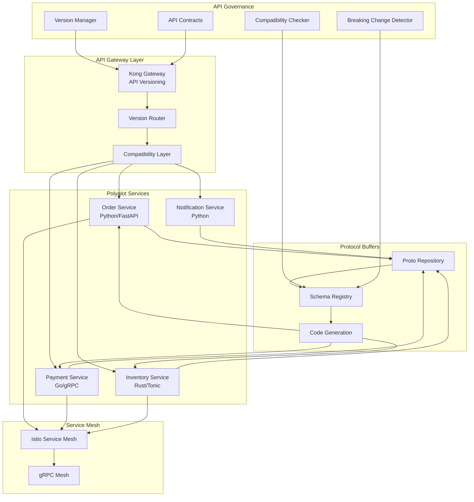

# API-First Polyglot Platform with Protocol Buffers and Backward Compatibility: A Complete Integration Tutorial

**Objective**: Build a production-ready API-first polyglot platform that integrates API governance with backward compatibility, protocol buffers for efficient serialization, polyglot interoperability design, and service decomposition strategies. This tutorial demonstrates how to build scalable, type-safe APIs that work seamlessly across Python, Go, Rust, and other languages.

This tutorial combines:
- **[API Governance, Backward Compatibility Rules, and Cross-Language Interface Stability](../../best-practices/architecture-design/api-governance-interface-stability.md)** - API versioning and stability
- **[Protocol Buffers with Python](../../best-practices/architecture-design/protobuf-python.md)** - Efficient data serialization
- **[Polyglot Interoperability Design](../../best-practices/architecture-design/polyglot-interoperability-design.md)** - Cross-language integration
- **[Service Decomposition Strategy](../../best-practices/architecture-design/service-decomposition-strategy.md)** - Microservices architecture

## 1) Prerequisites

```bash
# Required tools
docker --version          # >= 20.10
python --version          # >= 3.10
go --version              # >= 1.21
rust --version            # >= 1.70
protoc --version          # Protocol Buffers compiler
grpcurl --version         # gRPC CLI tool

# Python packages
pip install grpcio grpcio-tools protobuf \
    fastapi uvicorn \
    openapi-generator \
    prometheus-client

# Go packages
go get google.golang.org/grpc
go get github.com/grpc-ecosystem/grpc-gateway/v2
go get github.com/prometheus/client_golang

# Rust packages (Cargo.toml)
# tonic = "0.10"
# prost = "0.12"
```

**Why**: API-first polyglot platforms require Protocol Buffers for type-safe serialization, gRPC for efficient communication, API versioning for backward compatibility, and service decomposition for scalability.

## 2) Architecture Overview

We'll build an **API-First E-Commerce Platform** with polyglot services:



**Platform Capabilities**:
1. **API Versioning**: Multiple API versions with backward compatibility
2. **Protocol Buffers**: Type-safe, efficient serialization
3. **Polyglot Services**: Python, Go, Rust services communicate seamlessly
4. **Service Decomposition**: Domain-driven microservices

## 3) Repository Layout

```
api-first-polyglot/
├── docker-compose.yaml
├── proto/
│   ├── order/
│   │   ├── v1/
│   │   │   └── order.proto
│   │   └── v2/
│   │       └── order.proto
│   ├── payment/
│   │   └── v1/
│   │       └── payment.proto
│   └── inventory/
│       └── v1/
│           └── inventory.proto
├── services/
│   ├── order-service/
│   │   ├── Dockerfile
│   │   ├── requirements.txt
│   │   ├── app/
│   │   │   ├── __init__.py
│   │   │   ├── main.py
│   │   │   ├── api_v1.py
│   │   │   ├── api_v2.py
│   │   │   └── compatibility.py
│   │   └── generated/
│   │       └── order_pb2.py
│   ├── payment-service/
│   │   ├── Dockerfile
│   │   ├── go.mod
│   │   ├── main.go
│   │   ├── server.go
│   │   └── generated/
│   │       └── payment.pb.go
│   └── inventory-service/
│       ├── Dockerfile
│       ├── Cargo.toml
│       ├── src/
│       │   ├── main.rs
│       │   └── server.rs
│       └── generated/
│           └── inventory.rs
├── gateway/
│   ├── kong.yaml
│   └── version_router.py
├── governance/
│   ├── version_manager.py
│   ├── compatibility_checker.py
│   └── breaking_change_detector.py
└── scripts/
    ├── generate_proto.sh
    └── validate_compatibility.sh
```

## 4) Protocol Buffer Schemas with Versioning

### 4.1) Order Service v1

Create `proto/order/v1/order.proto`:

```protobuf
syntax = "proto3";

package order.v1;

option go_package = "github.com/company/api-first-polyglot/proto/order/v1";
option python_package = "order.proto.v1";
option rust_package = "order::proto::v1";

// Order service API v1
service OrderService {
  rpc CreateOrder(CreateOrderRequest) returns (CreateOrderResponse);
  rpc GetOrder(GetOrderRequest) returns (GetOrderResponse);
  rpc ListOrders(ListOrdersRequest) returns (ListOrdersResponse);
  rpc UpdateOrder(UpdateOrderRequest) returns (UpdateOrderResponse);
  rpc CancelOrder(CancelOrderRequest) returns (CancelOrderResponse);
}

// Order messages
message CreateOrderRequest {
  string customer_id = 1;
  repeated OrderItem items = 2;
  Address shipping_address = 3;
  PaymentMethod payment_method = 4;
}

message CreateOrderResponse {
  string order_id = 1;
  OrderStatus status = 2;
  int64 created_at = 3;
}

message GetOrderRequest {
  string order_id = 1;
}

message GetOrderResponse {
  Order order = 1;
}

message ListOrdersRequest {
  string customer_id = 1;
  int32 page_size = 2;
  string page_token = 3;
}

message ListOrdersResponse {
  repeated Order orders = 1;
  string next_page_token = 2;
}

message UpdateOrderRequest {
  string order_id = 1;
  OrderStatus status = 2;
}

message UpdateOrderResponse {
  Order order = 1;
}

message CancelOrderRequest {
  string order_id = 1;
  string reason = 2;
}

message CancelOrderResponse {
  bool success = 1;
}

// Domain models
message Order {
  string order_id = 1;
  string customer_id = 2;
  OrderStatus status = 3;
  repeated OrderItem items = 4;
  Money total_amount = 5;
  Address shipping_address = 6;
  int64 created_at = 7;
  int64 updated_at = 8;
}

message OrderItem {
  string product_id = 1;
  int32 quantity = 2;
  Money price = 3;
  Money subtotal = 4;
}

message Address {
  string street = 1;
  string city = 2;
  string state = 3;
  string zip_code = 4;
  string country = 5;
}

message Money {
  string currency = 1;
  int64 amount_cents = 2;
}

enum OrderStatus {
  ORDER_STATUS_UNSPECIFIED = 0;
  ORDER_STATUS_PENDING = 1;
  ORDER_STATUS_CONFIRMED = 2;
  ORDER_STATUS_PROCESSING = 3;
  ORDER_STATUS_SHIPPED = 4;
  ORDER_STATUS_DELIVERED = 5;
  ORDER_STATUS_CANCELLED = 6;
}

enum PaymentMethod {
  PAYMENT_METHOD_UNSPECIFIED = 0;
  PAYMENT_METHOD_CREDIT_CARD = 1;
  PAYMENT_METHOD_PAYPAL = 2;
  PAYMENT_METHOD_BANK_TRANSFER = 3;
}
```

### 4.2) Order Service v2 (Backward Compatible)

Create `proto/order/v2/order.proto`:

```protobuf
syntax = "proto3";

package order.v2;

option go_package = "github.com/company/api-first-polyglot/proto/order/v2";
option python_package = "order.proto.v2";
option rust_package = "order::proto::v2";

// Order service API v2 - Backward compatible with v1
service OrderService {
  rpc CreateOrder(CreateOrderRequest) returns (CreateOrderResponse);
  rpc GetOrder(GetOrderRequest) returns (GetOrderResponse);
  rpc ListOrders(ListOrdersRequest) returns (ListOrdersResponse);
  rpc UpdateOrder(UpdateOrderRequest) returns (UpdateOrderResponse);
  rpc CancelOrder(CancelOrderRequest) returns (CancelOrderResponse);
  
  // New v2 methods
  rpc GetOrderHistory(GetOrderHistoryRequest) returns (GetOrderHistoryResponse);
  rpc BatchCreateOrders(BatchCreateOrdersRequest) returns (BatchCreateOrdersResponse);
}

// V2 extends v1 messages (backward compatible)
message CreateOrderRequest {
  string customer_id = 1;
  repeated OrderItem items = 2;
  Address shipping_address = 3;
  PaymentMethod payment_method = 4;
  
  // New v2 fields (optional for backward compatibility)
  OrderMetadata metadata = 5;
  repeated string tags = 6;
  string source = 7;  // web, mobile, api
}

message CreateOrderResponse {
  string order_id = 1;
  OrderStatus status = 2;
  int64 created_at = 3;
  
  // New v2 fields
  OrderMetadata metadata = 4;
  string estimated_delivery_date = 5;
}

message GetOrderRequest {
  string order_id = 1;
  
  // New v2 fields
  bool include_history = 2;
  bool include_metadata = 3;
}

message GetOrderResponse {
  Order order = 1;
  
  // New v2 fields
  repeated OrderEvent history = 2;
}

// New v2 messages
message GetOrderHistoryRequest {
  string order_id = 1;
  int32 limit = 2;
}

message GetOrderHistoryResponse {
  repeated OrderEvent events = 1;
}

message BatchCreateOrdersRequest {
  repeated CreateOrderRequest orders = 1;
}

message BatchCreateOrdersResponse {
  repeated CreateOrderResponse orders = 1;
  int32 success_count = 2;
  int32 failure_count = 3;
}

message OrderMetadata {
  map<string, string> custom_fields = 1;
  string campaign_id = 2;
  string referrer = 3;
}

message OrderEvent {
  string event_id = 1;
  string event_type = 2;
  int64 timestamp = 3;
  map<string, string> data = 4;
}

// Reuse v1 messages (import or redefine)
message Order {
  string order_id = 1;
  string customer_id = 2;
  OrderStatus status = 3;
  repeated OrderItem items = 4;
  Money total_amount = 5;
  Address shipping_address = 6;
  int64 created_at = 7;
  int64 updated_at = 8;
  
  // New v2 fields
  OrderMetadata metadata = 9;
  repeated string tags = 10;
}

message OrderItem {
  string product_id = 1;
  int32 quantity = 2;
  Money price = 3;
  Money subtotal = 4;
  
  // New v2 fields
  string variant_id = 5;
  map<string, string> attributes = 6;
}

message Address {
  string street = 1;
  string city = 2;
  string state = 3;
  string zip_code = 4;
  string country = 5;
  
  // New v2 fields
  string address_line_2 = 6;
  string phone_number = 7;
}

message Money {
  string currency = 1;
  int64 amount_cents = 2;
}

enum OrderStatus {
  ORDER_STATUS_UNSPECIFIED = 0;
  ORDER_STATUS_PENDING = 1;
  ORDER_STATUS_CONFIRMED = 2;
  ORDER_STATUS_PROCESSING = 3;
  ORDER_STATUS_SHIPPED = 4;
  ORDER_STATUS_DELIVERED = 5;
  ORDER_STATUS_CANCELLED = 6;
  
  // New v2 statuses
  ORDER_STATUS_REFUNDED = 7;
  ORDER_STATUS_PARTIALLY_REFUNDED = 8;
}

enum PaymentMethod {
  PAYMENT_METHOD_UNSPECIFIED = 0;
  PAYMENT_METHOD_CREDIT_CARD = 1;
  PAYMENT_METHOD_PAYPAL = 2;
  PAYMENT_METHOD_BANK_TRANSFER = 3;
  
  // New v2 payment methods
  PAYMENT_METHOD_APPLE_PAY = 4;
  PAYMENT_METHOD_GOOGLE_PAY = 5;
}
```

## 5) Python Order Service with Versioning

Create `services/order-service/app/api_v1.py`:

```python
"""Order service API v1 implementation."""
from typing import List, Optional
import grpc
from concurrent import futures
import logging

from proto.order.v1 import order_pb2
from proto.order.v1 import order_pb2_grpc

from prometheus_client import Counter, Histogram

api_metrics = {
    "requests_total": Counter("api_requests_total", "API requests", ["version", "method"]),
    "request_duration": Histogram("api_request_duration_seconds", "Request duration", ["version", "method"]),
}


class OrderServiceV1(order_pb2_grpc.OrderServiceServicer):
    """Order service v1 implementation."""
    
    def __init__(self, order_repository):
        self.repository = order_repository
    
    def CreateOrder(self, request, context):
        """Create order (v1)."""
        api_metrics["requests_total"].labels(version="v1", method="CreateOrder").inc()
        
        # Validate request
        if not request.customer_id:
            context.set_code(grpc.StatusCode.INVALID_ARGUMENT)
            context.set_details("customer_id is required")
            return order_pb2.CreateOrderResponse()
        
        # Create order
        order = self.repository.create_order(
            customer_id=request.customer_id,
            items=[self._convert_item(item) for item in request.items],
            shipping_address=self._convert_address(request.shipping_address),
            payment_method=request.payment_method
        )
        
        return order_pb2.CreateOrderResponse(
            order_id=order.order_id,
            status=order.status,
            created_at=int(order.created_at.timestamp() * 1000)
        )
    
    def GetOrder(self, request, context):
        """Get order (v1)."""
        api_metrics["requests_total"].labels(version="v1", method="GetOrder").inc()
        
        order = self.repository.get_order(request.order_id)
        if not order:
            context.set_code(grpc.StatusCode.NOT_FOUND)
            context.set_details(f"Order {request.order_id} not found")
            return order_pb2.GetOrderResponse()
        
        return order_pb2.GetOrderResponse(
            order=self._convert_order(order)
        )
    
    def ListOrders(self, request, context):
        """List orders (v1)."""
        api_metrics["requests_total"].labels(version="v1", method="ListOrders").inc()
        
        orders = self.repository.list_orders(
            customer_id=request.customer_id,
            page_size=request.page_size or 20,
            page_token=request.page_token
        )
        
        return order_pb2.ListOrdersResponse(
            orders=[self._convert_order(order) for order in orders["items"]],
            next_page_token=orders.get("next_page_token", "")
        )
    
    def UpdateOrder(self, request, context):
        """Update order (v1)."""
        api_metrics["requests_total"].labels(version="v1", method="UpdateOrder").inc()
        
        order = self.repository.update_order(
            order_id=request.order_id,
            status=request.status
        )
        
        return order_pb2.UpdateOrderResponse(
            order=self._convert_order(order)
        )
    
    def CancelOrder(self, request, context):
        """Cancel order (v1)."""
        api_metrics["requests_total"].labels(version="v1", method="CancelOrder").inc()
        
        success = self.repository.cancel_order(
            order_id=request.order_id,
            reason=request.reason
        )
        
        return order_pb2.CancelOrderResponse(success=success)
    
    def _convert_order(self, order) -> order_pb2.Order:
        """Convert domain order to protobuf."""
        return order_pb2.Order(
            order_id=order.order_id,
            customer_id=order.customer_id,
            status=order.status,
            items=[self._convert_item(item) for item in order.items],
            total_amount=order_pb2.Money(
                currency=order.total_amount.currency,
                amount_cents=order.total_amount.amount_cents
            ),
            shipping_address=self._convert_address(order.shipping_address),
            created_at=int(order.created_at.timestamp() * 1000),
            updated_at=int(order.updated_at.timestamp() * 1000)
        )
    
    def _convert_item(self, item) -> order_pb2.OrderItem:
        """Convert domain item to protobuf."""
        return order_pb2.OrderItem(
            product_id=item.product_id,
            quantity=item.quantity,
            price=order_pb2.Money(
                currency=item.price.currency,
                amount_cents=item.price.amount_cents
            ),
            subtotal=order_pb2.Money(
                currency=item.subtotal.currency,
                amount_cents=item.subtotal.amount_cents
            )
        )
    
    def _convert_address(self, address) -> order_pb2.Address:
        """Convert domain address to protobuf."""
        return order_pb2.Address(
            street=address.street,
            city=address.city,
            state=address.state,
            zip_code=address.zip_code,
            country=address.country
        )


def serve(port: int = 50051):
    """Start gRPC server."""
    server = grpc.server(futures.ThreadPoolExecutor(max_workers=10))
    order_pb2_grpc.add_OrderServiceServicer_to_server(
        OrderServiceV1(order_repository),
        server
    )
    server.add_insecure_port(f"[::]:{port}")
    server.start()
    logging.info(f"Order service v1 started on port {port}")
    server.wait_for_termination()
```

Create `services/order-service/app/api_v2.py`:

```python
"""Order service API v2 implementation with backward compatibility."""
from typing import List, Optional
import grpc
from concurrent import futures
import logging

from proto.order.v2 import order_pb2
from proto.order.v2 import order_pb2_grpc
from services.order_service.app.api_v1 import OrderServiceV1  # Reuse v1 logic

from prometheus_client import Counter, Histogram

api_metrics = {
    "requests_total": Counter("api_requests_total", "API requests", ["version", "method"]),
    "request_duration": Histogram("api_request_duration_seconds", "Request duration", ["version", "method"]),
    "v2_features_used": Counter("api_v2_features_used_total", "V2 features used", ["feature"]),
}


class OrderServiceV2(order_pb2_grpc.OrderServiceServicer):
    """Order service v2 implementation with backward compatibility."""
    
    def __init__(self, order_repository, v1_service: OrderServiceV1):
        self.repository = order_repository
        self.v1_service = v1_service  # Reuse v1 implementation
    
    def CreateOrder(self, request, context):
        """Create order (v2) - backward compatible with v1."""
        api_metrics["requests_total"].labels(version="v2", method="CreateOrder").inc()
        
        # Check if v2 features are used
        if request.metadata or request.tags or request.source:
            api_metrics["v2_features_used"].labels(feature="metadata").inc()
        
        # Convert v2 request to v1 format for core logic
        v1_request = self._convert_v2_to_v1_request(request)
        
        # Use v1 service for core logic (backward compatibility)
        v1_response = self.v1_service.CreateOrder(v1_request, context)
        
        # Enhance response with v2 fields
        return order_pb2.CreateOrderResponse(
            order_id=v1_response.order_id,
            status=v1_response.status,
            created_at=v1_response.created_at,
            metadata=request.metadata if request.metadata else None,
            estimated_delivery_date=self._calculate_delivery_date()
        )
    
    def GetOrder(self, request, context):
        """Get order (v2) - backward compatible with v1."""
        api_metrics["requests_total"].labels(version="v2", method="GetOrder").inc()
        
        # Get order using v1 service
        v1_request = order_pb2.GetOrderRequest(order_id=request.order_id)
        v1_response = self.v1_service.GetOrder(v1_request, context)
        
        if context.code() != grpc.StatusCode.OK:
            return order_pb2.GetOrderResponse()
        
        # Enhance with v2 fields
        response = order_pb2.GetOrderResponse(
            order=self._enhance_order_v2(v1_response.order)
        )
        
        # Add history if requested
        if request.include_history:
            response.history.extend(self._get_order_history(request.order_id))
            api_metrics["v2_features_used"].labels(feature="history").inc()
        
        return response
    
    def GetOrderHistory(self, request, context):
        """Get order history (v2 only)."""
        api_metrics["requests_total"].labels(version="v2", method="GetOrderHistory").inc()
        api_metrics["v2_features_used"].labels(feature="history").inc()
        
        events = self.repository.get_order_history(
            order_id=request.order_id,
            limit=request.limit or 100
        )
        
        return order_pb2.GetOrderHistoryResponse(
            events=[self._convert_event(event) for event in events]
        )
    
    def BatchCreateOrders(self, request, context):
        """Batch create orders (v2 only)."""
        api_metrics["requests_total"].labels(version="v2", method="BatchCreateOrders").inc()
        api_metrics["v2_features_used"].labels(feature="batch").inc()
        
        results = []
        success_count = 0
        failure_count = 0
        
        for order_request in request.orders:
            try:
                response = self.CreateOrder(order_request, context)
                results.append(response)
                success_count += 1
            except Exception as e:
                logging.error(f"Failed to create order: {e}")
                failure_count += 1
        
        return order_pb2.BatchCreateOrdersResponse(
            orders=results,
            success_count=success_count,
            failure_count=failure_count
        )
    
    def _convert_v2_to_v1_request(self, v2_request):
        """Convert v2 request to v1 format."""
        from proto.order.v1 import order_pb2 as v1_pb2
        
        return v1_pb2.CreateOrderRequest(
            customer_id=v2_request.customer_id,
            items=v2_request.items,
            shipping_address=v2_request.shipping_address,
            payment_method=v2_request.payment_method
        )
    
    def _enhance_order_v2(self, v1_order):
        """Enhance v1 order with v2 fields."""
        order = self.repository.get_order(v1_order.order_id)
        
        return order_pb2.Order(
            order_id=v1_order.order_id,
            customer_id=v1_order.customer_id,
            status=v1_order.status,
            items=[self._enhance_item_v2(item) for item in v1_order.items],
            total_amount=v1_order.total_amount,
            shipping_address=self._enhance_address_v2(v1_order.shipping_address),
            created_at=v1_order.created_at,
            updated_at=v1_order.updated_at,
            metadata=order.metadata if hasattr(order, 'metadata') else None,
            tags=order.tags if hasattr(order, 'tags') else []
        )
    
    def _enhance_item_v2(self, v1_item):
        """Enhance v1 item with v2 fields."""
        return order_pb2.OrderItem(
            product_id=v1_item.product_id,
            quantity=v1_item.quantity,
            price=v1_item.price,
            subtotal=v1_item.subtotal,
            variant_id="",  # Get from repository
            attributes={}  # Get from repository
        )
    
    def _enhance_address_v2(self, v1_address):
        """Enhance v1 address with v2 fields."""
        return order_pb2.Address(
            street=v1_address.street,
            city=v1_address.city,
            state=v1_address.state,
            zip_code=v1_address.zip_code,
            country=v1_address.country,
            address_line_2="",  # Get from repository
            phone_number=""  # Get from repository
        )
    
    def _get_order_history(self, order_id: str) -> List[order_pb2.OrderEvent]:
        """Get order history events."""
        events = self.repository.get_order_history(order_id)
        return [self._convert_event(event) for event in events]
    
    def _convert_event(self, event) -> order_pb2.OrderEvent:
        """Convert domain event to protobuf."""
        return order_pb2.OrderEvent(
            event_id=event.event_id,
            event_type=event.event_type,
            timestamp=int(event.timestamp.timestamp() * 1000),
            data=event.data
        )
    
    def _calculate_delivery_date(self) -> str:
        """Calculate estimated delivery date."""
        from datetime import datetime, timedelta
        delivery = datetime.utcnow() + timedelta(days=5)
        return delivery.isoformat()
```

## 6) Go Payment Service

Create `services/payment-service/main.go`:

```go
package main

import (
	"context"
	"log"
	"net"

	"google.golang.org/grpc"
	"google.golang.org/grpc/codes"
	"google.golang.org/grpc/status"

	pb "github.com/company/api-first-polyglot/proto/payment/v1"
)

type PaymentService struct {
	pb.UnimplementedPaymentServiceServer
	repository PaymentRepository
}

func (s *PaymentService) ProcessPayment(ctx context.Context, req *pb.ProcessPaymentRequest) (*pb.ProcessPaymentResponse, error) {
	// Validate request
	if req.OrderId == "" {
		return nil, status.Error(codes.InvalidArgument, "order_id is required")
	}

	// Process payment
	payment, err := s.repository.ProcessPayment(ctx, &Payment{
		OrderID:   req.OrderId,
		Amount:    req.Amount,
		Method:    req.Method,
		Details:   req.Details,
	})
	if err != nil {
		return nil, status.Error(codes.Internal, err.Error())
	}

	return &pb.ProcessPaymentResponse{
		PaymentId:    payment.PaymentID,
		Status:       pb.PaymentStatus_PAYMENT_STATUS_COMPLETED,
		ProcessedAt:  payment.ProcessedAt.Unix(),
		TransactionId: payment.TransactionID,
	}, nil
}

func (s *PaymentService) RefundPayment(ctx context.Context, req *pb.RefundPaymentRequest) (*pb.RefundPaymentResponse, error) {
	refund, err := s.repository.RefundPayment(ctx, &Refund{
		PaymentID: req.PaymentId,
		Amount:    req.Amount,
		Reason:    req.Reason,
	})
	if err != nil {
		return nil, status.Error(codes.Internal, err.Error())
	}

	return &pb.RefundPaymentResponse{
		RefundId:     refund.RefundID,
		Success:      true,
		ProcessedAt:  refund.ProcessedAt.Unix(),
	}, nil
}

func (s *PaymentService) GetPaymentStatus(ctx context.Context, req *pb.GetPaymentStatusRequest) (*pb.GetPaymentStatusResponse, error) {
	payment, err := s.repository.GetPayment(ctx, req.PaymentId)
	if err != nil {
		return nil, status.Error(codes.NotFound, err.Error())
	}

	return &pb.GetPaymentStatusResponse{
		Payment: &pb.Payment{
			PaymentId:    payment.PaymentID,
			OrderId:      payment.OrderID,
			Amount:       payment.Amount,
			Status:       payment.Status,
			Method:       payment.Method,
			CreatedAt:    payment.CreatedAt.Unix(),
			ProcessedAt:  payment.ProcessedAt.Unix(),
			TransactionId: payment.TransactionID,
		},
	}, nil
}

func main() {
	lis, err := net.Listen("tcp", ":50052")
	if err != nil {
		log.Fatalf("failed to listen: %v", err)
	}

	s := grpc.NewServer()
	pb.RegisterPaymentServiceServer(s, &PaymentService{
		repository: NewPaymentRepository(),
	})

	log.Printf("Payment service listening on :50052")
	if err := s.Serve(lis); err != nil {
		log.Fatalf("failed to serve: %v", err)
	}
}
```

## 7) Rust Inventory Service

Create `services/inventory-service/src/main.rs`:

```rust
use tonic::{transport::Server, Request, Response, Status};
use inventory::proto::inventory::v1::{
    inventory_service_server::{InventoryService, InventoryServiceServer},
    ReserveItemsRequest, ReserveItemsResponse,
    ReleaseReservationRequest, ReleaseReservationResponse,
    GetInventoryRequest, GetInventoryResponse,
};

pub mod proto {
    pub mod inventory {
        pub mod v1 {
            tonic::include_proto!("inventory.v1");
        }
    }
}

#[derive(Debug, Default)]
pub struct InventoryServiceImpl {
    repository: InventoryRepository,
}

#[tonic::async_trait]
impl InventoryService for InventoryServiceImpl {
    async fn reserve_items(
        &self,
        request: Request<ReserveItemsRequest>,
    ) -> Result<Response<ReserveItemsResponse>, Status> {
        let req = request.into_inner();
        
        // Validate request
        if req.items.is_empty() {
            return Err(Status::invalid_argument("items cannot be empty"));
        }
        
        // Reserve items
        let reservation = self.repository.reserve_items(&req.items).await
            .map_err(|e| Status::internal(e.to_string()))?;
        
        Ok(Response::new(ReserveItemsResponse {
            reservation_id: reservation.id,
            success: true,
        }))
    }
    
    async fn release_reservation(
        &self,
        request: Request<ReleaseReservationRequest>,
    ) -> Result<Response<ReleaseReservationResponse>, Status> {
        let req = request.into_inner();
        
        self.repository.release_reservation(&req.reservation_id).await
            .map_err(|e| Status::internal(e.to_string()))?;
        
        Ok(Response::new(ReleaseReservationResponse {
            success: true,
        }))
    }
    
    async fn get_inventory(
        &self,
        request: Request<GetInventoryRequest>,
    ) -> Result<Response<GetInventoryResponse>, Status> {
        let req = request.into_inner();
        
        let inventory = self.repository.get_inventory(&req.product_id).await
            .map_err(|e| Status::internal(e.to_string()))?;
        
        Ok(Response::new(GetInventoryResponse {
            product_id: inventory.product_id,
            available_quantity: inventory.available_quantity,
            reserved_quantity: inventory.reserved_quantity,
        }))
    }
}

#[tokio::main]
async fn main() -> Result<(), Box<dyn std::error::Error>> {
    let addr = "[::1]:50053".parse()?;
    let service = InventoryServiceImpl::default();
    
    Server::builder()
        .add_service(InventoryServiceServer::new(service))
        .serve(addr)
        .await?;
    
    Ok(())
}
```

## 8) API Version Manager

Create `governance/version_manager.py`:

```python
"""API version management and routing."""
from typing import Dict, List, Optional
from dataclasses import dataclass
from enum import Enum
from datetime import datetime

from prometheus_client import Counter, Gauge

version_metrics = {
    "api_versions_active": Gauge("api_versions_active", "Active API versions", ["service"]),
    "version_requests": Counter("api_version_requests_total", "Version requests", ["service", "version"]),
    "deprecated_version_usage": Counter("api_deprecated_version_usage_total", "Deprecated version usage", ["service", "version"]),
}


class VersionStatus(Enum):
    """API version status."""
    ACTIVE = "active"
    DEPRECATED = "deprecated"
    SUNSET = "sunset"


@dataclass
class APIVersion:
    """API version definition."""
    service_name: str
    version: str
    status: VersionStatus
    released_at: datetime
    deprecated_at: Optional[datetime] = None
    sunset_at: Optional[datetime] = None
    supported_clients: List[str] = None
    breaking_changes: List[str] = None


class APIVersionManager:
    """Manages API versions and routing."""
    
    def __init__(self):
        self.versions: Dict[str, List[APIVersion]] = {}  # service -> versions
        self.default_versions: Dict[str, str] = {}  # service -> default version
    
    def register_version(self, version: APIVersion):
        """Register an API version."""
        if version.service_name not in self.versions:
            self.versions[version.service_name] = []
        
        self.versions[version.service_name].append(version)
        self.versions[version.service_name].sort(key=lambda v: v.version, reverse=True)
        
        # Set as default if first version
        if version.service_name not in self.default_versions:
            self.default_versions[version.service_name] = version.version
        
        version_metrics["api_versions_active"].labels(service=version.service_name).inc()
    
    def get_version(
        self,
        service_name: str,
        requested_version: Optional[str] = None
    ) -> Optional[APIVersion]:
        """Get API version for service."""
        if service_name not in self.versions:
            return None
        
        versions = self.versions[service_name]
        
        if requested_version:
            # Find specific version
            for version in versions:
                if version.version == requested_version:
                    self._track_version_usage(service_name, requested_version, version.status)
                    return version
            return None
        else:
            # Return default (latest active)
            default = self.default_versions.get(service_name)
            if default:
                return self.get_version(service_name, default)
            
            # Fallback to latest active
            for version in versions:
                if version.status == VersionStatus.ACTIVE:
                    return version
        
        return None
    
    def get_supported_versions(self, service_name: str) -> List[APIVersion]:
        """Get all supported versions for a service."""
        if service_name not in self.versions:
            return []
        
        return [
            v for v in self.versions[service_name]
            if v.status in [VersionStatus.ACTIVE, VersionStatus.DEPRECATED]
        ]
    
    def deprecate_version(
        self,
        service_name: str,
        version: str,
        deprecated_at: datetime,
        sunset_at: Optional[datetime] = None
    ):
        """Deprecate an API version."""
        api_version = self.get_version(service_name, version)
        if api_version:
            api_version.status = VersionStatus.DEPRECATED
            api_version.deprecated_at = deprecated_at
            api_version.sunset_at = sunset_at
    
    def _track_version_usage(
        self,
        service_name: str,
        version: str,
        status: VersionStatus
    ):
        """Track version usage metrics."""
        version_metrics["version_requests"].labels(
            service=service_name,
            version=version
        ).inc()
        
        if status == VersionStatus.DEPRECATED:
            version_metrics["deprecated_version_usage"].labels(
                service=service_name,
                version=version
            ).inc()
```

## 9) Compatibility Checker

Create `governance/compatibility_checker.py`:

```python
"""API compatibility checking."""
from typing import Dict, List, Tuple, Any
from dataclasses import dataclass
from enum import Enum
import difflib

from prometheus_client import Counter

compatibility_metrics = {
    "compatibility_checks": Counter("api_compatibility_checks_total", "Compatibility checks", ["result"]),
    "breaking_changes_detected": Counter("api_breaking_changes_detected_total", "Breaking changes", ["change_type"]),
}


class ChangeType(Enum):
    """Change type classification."""
    BACKWARD_COMPATIBLE = "backward_compatible"
    BREAKING = "breaking"
    ADDITIVE = "additive"


@dataclass
class SchemaChange:
    """Schema change definition."""
    change_type: ChangeType
    field_path: str
    description: str
    impact: str  # low, medium, high


class CompatibilityChecker:
    """Checks API compatibility between versions."""
    
    def check_compatibility(
        self,
        old_schema: Dict[str, Any],
        new_schema: Dict[str, Any]
    ) -> Tuple[bool, List[SchemaChange]]:
        """Check compatibility between schemas."""
        changes = []
        
        # Check for breaking changes
        breaking_changes = self._detect_breaking_changes(old_schema, new_schema)
        changes.extend(breaking_changes)
        
        # Check for additive changes
        additive_changes = self._detect_additive_changes(old_schema, new_schema)
        changes.extend(additive_changes)
        
        is_compatible = len(breaking_changes) == 0
        
        compatibility_metrics["compatibility_checks"].labels(
            result="compatible" if is_compatible else "incompatible"
        ).inc()
        
        if breaking_changes:
            for change in breaking_changes:
                compatibility_metrics["breaking_changes_detected"].labels(
                    change_type=change.change_type.value
                ).inc()
        
        return is_compatible, changes
    
    def _detect_breaking_changes(
        self,
        old_schema: Dict[str, Any],
        new_schema: Dict[str, Any]
    ) -> List[SchemaChange]:
        """Detect breaking changes."""
        breaking_changes = []
        
        # Check for removed fields
        old_fields = self._extract_fields(old_schema)
        new_fields = self._extract_fields(new_schema)
        
        removed_fields = set(old_fields) - set(new_fields)
        for field in removed_fields:
            breaking_changes.append(SchemaChange(
                change_type=ChangeType.BREAKING,
                field_path=field,
                description=f"Field {field} was removed",
                impact="high"
            ))
        
        # Check for type changes
        for field in old_fields & new_fields:
            old_type = self._get_field_type(old_schema, field)
            new_type = self._get_field_type(new_schema, field)
            
            if old_type != new_type and not self._is_compatible_type(old_type, new_type):
                breaking_changes.append(SchemaChange(
                    change_type=ChangeType.BREAKING,
                    field_path=field,
                    description=f"Field {field} type changed from {old_type} to {new_type}",
                    impact="high"
                ))
        
        # Check for required field changes
        old_required = self._get_required_fields(old_schema)
        new_required = self._get_required_fields(new_schema)
        
        newly_required = set(new_required) - set(old_required)
        for field in newly_required:
            breaking_changes.append(SchemaChange(
                change_type=ChangeType.BREAKING,
                field_path=field,
                description=f"Field {field} is now required",
                impact="medium"
            ))
        
        return breaking_changes
    
    def _detect_additive_changes(
        self,
        old_schema: Dict[str, Any],
        new_schema: Dict[str, Any]
    ) -> List[SchemaChange]:
        """Detect additive (non-breaking) changes."""
        additive_changes = []
        
        old_fields = self._extract_fields(old_schema)
        new_fields = self._extract_fields(new_schema)
        
        added_fields = set(new_fields) - set(old_fields)
        for field in added_fields:
            # Check if field is optional
            if not self._is_required(new_schema, field):
                additive_changes.append(SchemaChange(
                    change_type=ChangeType.ADDITIVE,
                    field_path=field,
                    description=f"Optional field {field} was added",
                    impact="low"
                ))
        
        return additive_changes
    
    def _extract_fields(self, schema: Dict[str, Any], prefix: str = "") -> List[str]:
        """Extract all field paths from schema."""
        fields = []
        
        if "properties" in schema:
            for field_name, field_schema in schema["properties"].items():
                field_path = f"{prefix}.{field_name}" if prefix else field_name
                fields.append(field_path)
                
                # Recursively extract nested fields
                if "properties" in field_schema:
                    fields.extend(self._extract_fields(field_schema, field_path))
        
        return fields
    
    def _get_field_type(self, schema: Dict[str, Any], field_path: str) -> Optional[str]:
        """Get field type from schema."""
        parts = field_path.split(".")
        current = schema
        
        for part in parts:
            if "properties" in current and part in current["properties"]:
                current = current["properties"][part]
            else:
                return None
        
        return current.get("type")
    
    def _is_compatible_type(self, old_type: str, new_type: str) -> bool:
        """Check if type change is compatible."""
        # Integer to number is compatible
        if old_type == "integer" and new_type == "number":
            return True
        
        # String to string is compatible
        if old_type == "string" and new_type == "string":
            return True
        
        return False
    
    def _get_required_fields(self, schema: Dict[str, Any]) -> List[str]:
        """Get required fields from schema."""
        return schema.get("required", [])
    
    def _is_required(self, schema: Dict[str, Any], field_path: str) -> bool:
        """Check if field is required."""
        parts = field_path.split(".")
        current = schema
        
        for i, part in enumerate(parts):
            if "properties" in current and part in current["properties"]:
                if i == len(parts) - 1:
                    # Last part - check if required
                    required = current.get("required", [])
                    return part in required
                else:
                    current = current["properties"][part]
            else:
                return False
        
        return False
```

## 10) Kong Gateway Configuration

Create `gateway/kong.yaml`:

```yaml
_format_version: "3.0"

services:
  - name: order-service-v1
    url: http://order-service:50051
    routes:
      - name: order-v1-route
        paths:
          - /api/v1/orders
        strip_path: false
        plugins:
          - name: request-transformer
            config:
              add:
                headers:
                  - "X-API-Version:v1"
  
  - name: order-service-v2
    url: http://order-service:50052
    routes:
      - name: order-v2-route
        paths:
          - /api/v2/orders
        strip_path: false
        plugins:
          - name: request-transformer
            config:
              add:
                headers:
                  - "X-API-Version:v2"
          - name: cors
            config:
              origins:
                - "*"
              methods:
                - GET
                - POST
                - PUT
                - DELETE
          - name: rate-limiting
            config:
              minute: 100
              hour: 1000

plugins:
  - name: prometheus
    config:
      per_consumer: true
      status_code_metrics: true
      latency_metrics: true
      bandwidth_metrics: true
      upstream_health_metrics: true
```

## 11) Testing the System

### 11.1) Start Services

```bash
# Generate protobuf code
./scripts/generate_proto.sh

# Start services
docker compose up -d

# Start Kong
docker compose up -d kong
```

### 11.2) Test API Versioning

```python
import grpc
from proto.order.v1 import order_pb2, order_pb2_grpc
from proto.order.v2 import order_pb2 as v2_pb2, order_pb2_grpc as v2_grpc

# Test v1 API
channel = grpc.insecure_channel('localhost:50051')
stub = order_pb2_grpc.OrderServiceStub(channel)

request = order_pb2.CreateOrderRequest(
    customer_id="cust123",
    items=[order_pb2.OrderItem(product_id="prod1", quantity=2)],
    shipping_address=order_pb2.Address(
        street="123 Main St",
        city="City",
        state="State",
        zip_code="12345",
        country="USA"
    )
)

response = stub.CreateOrder(request)
print(f"V1 Order ID: {response.order_id}")

# Test v2 API (backward compatible)
v2_channel = grpc.insecure_channel('localhost:50052')
v2_stub = v2_grpc.OrderServiceStub(v2_channel)

v2_request = v2_pb2.CreateOrderRequest(
    customer_id="cust123",
    items=[v2_pb2.OrderItem(product_id="prod1", quantity=2)],
    shipping_address=v2_pb2.Address(
        street="123 Main St",
        city="City",
        state="State",
        zip_code="12345",
        country="USA"
    ),
    metadata=v2_pb2.OrderMetadata(custom_fields={"campaign": "summer2024"}),
    tags=["priority", "express"],
    source="web"
)

v2_response = v2_stub.CreateOrder(v2_request)
print(f"V2 Order ID: {v2_response.order_id}")
print(f"Estimated Delivery: {v2_response.estimated_delivery_date}")
```

## 12) Best Practices Integration Summary

This tutorial demonstrates:

1. **API Governance**: Version management, backward compatibility, and breaking change detection
2. **Protocol Buffers**: Type-safe, efficient serialization across languages
3. **Polyglot Interoperability**: Python, Go, Rust services communicate via gRPC
4. **Service Decomposition**: Domain-driven microservices with clear boundaries

**Key Integration Points**:
- Protocol Buffers enable type-safe cross-language communication
- API versioning maintains backward compatibility
- Service decomposition creates clear service boundaries
- Compatibility checker prevents breaking changes
- Kong gateway routes requests to appropriate versions

## 13) Next Steps

- Add OpenAPI/Swagger generation from protobuf
- Implement API rate limiting and quotas
- Add API analytics and usage tracking
- Implement API key management
- Add API documentation generation

---

*This tutorial demonstrates how multiple best practices integrate to create a scalable, type-safe, polyglot API platform with comprehensive versioning and backward compatibility.*

