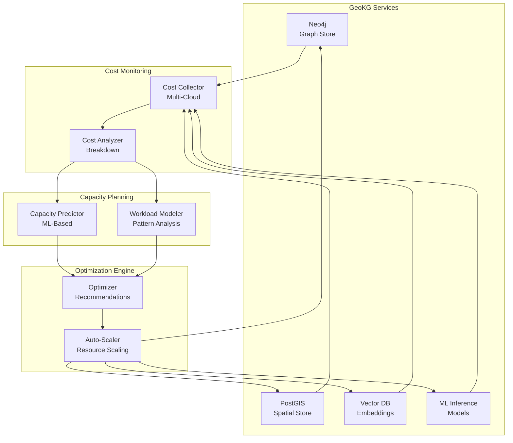
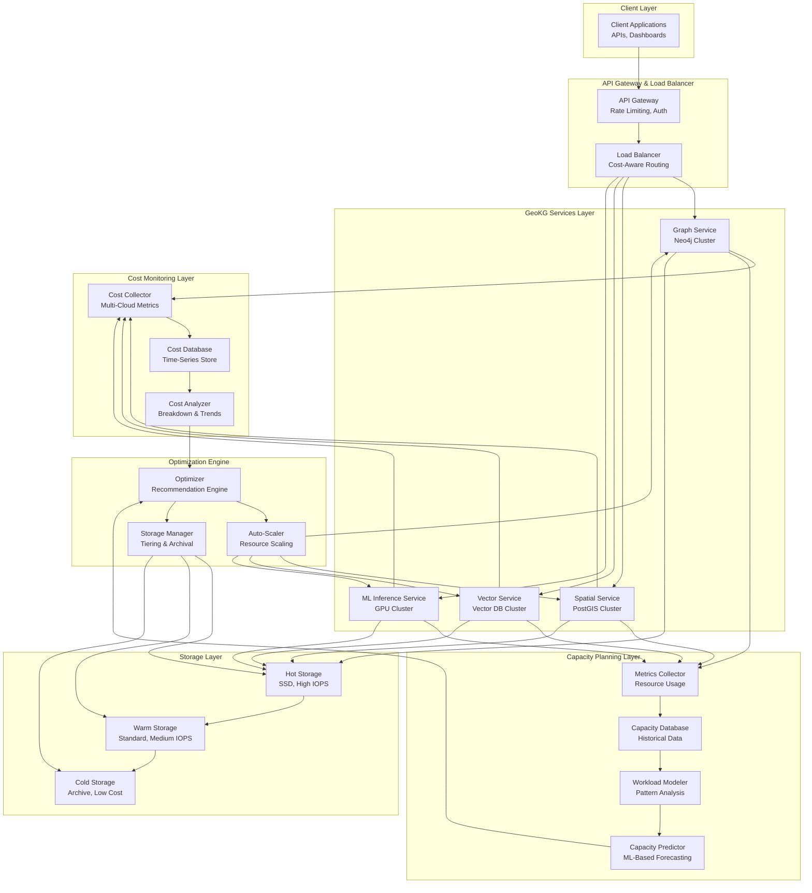
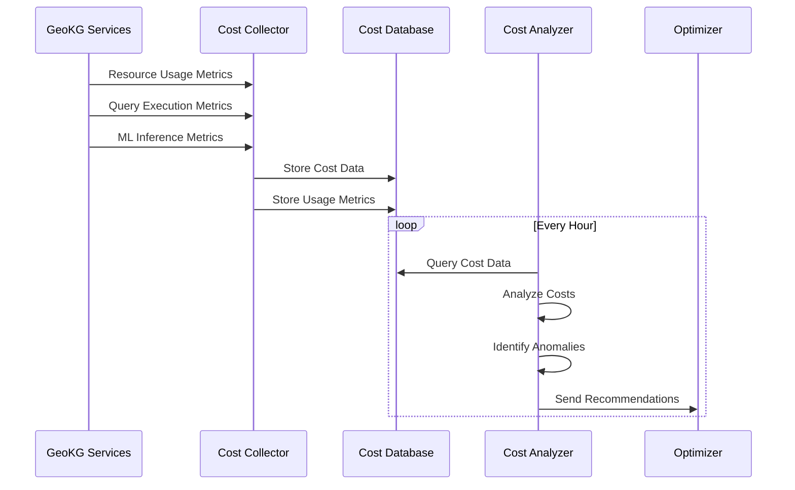
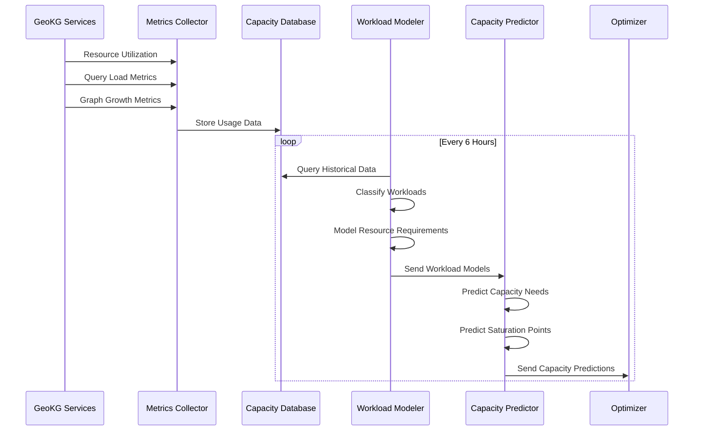
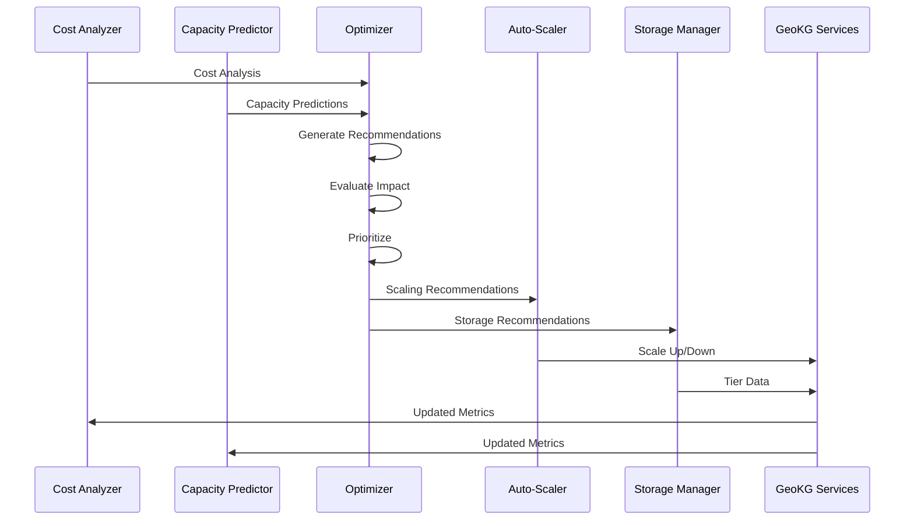
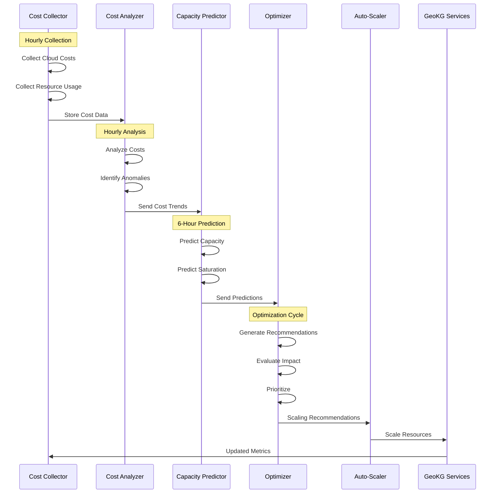

# Cost-Optimized Geospatial Knowledge Graph with Capacity Planning and Resource Efficiency

**Objective**: Build a production-ready geospatial knowledge graph system optimized for cost with predictive capacity planning and workload modeling. This tutorial demonstrates how to minimize GeoKG operational costs while maintaining performance through intelligent resource allocation, capacity prediction, and workload optimization.

This tutorial combines:
- **[AI-Ready, ML-Enabled Geospatial Knowledge Graph](../../best-practices/database-data/ai-ml-geospatial-knowledge-graph.md)** - Geospatial knowledge graph foundations
- **[Cost-Aware Architecture & Resource-Efficiency Governance](../../best-practices/architecture-design/cost-aware-architecture-and-efficiency-governance.md)** - Cost optimization strategies
- **[Holistic Capacity Planning, Scaling Economics, and Workload Modeling](../../best-practices/architecture-design/capacity-planning-and-workload-modeling.md)** - Predictive capacity planning

## Abstract

GeoKG systems can be expensive to operate at scale. Storage costs grow with graph size, compute costs scale with query load, and ML inference costs increase with model complexity. This tutorial shows how to build a cost-optimized GeoKG with predictive capacity planning that minimizes operational costs while maintaining performance through intelligent resource allocation, workload modeling, and automated optimization.

**What This Tutorial Covers**:
- Cost-aware GeoKG architecture principles
- Storage cost optimization (tiering, compression, archival)
- Compute cost optimization (right-sizing, auto-scaling, spot instances)
- ML inference cost optimization (model optimization, batching, caching)
- Predictive capacity planning for graph growth
- Workload modeling for query patterns
- Cost monitoring and optimization automation
- Multi-cloud cost optimization

**Prerequisites**:
- Understanding of geospatial data (PostGIS, H3/S2)
- Familiarity with knowledge graphs (Neo4j, RDF, SPARQL)
- Experience with cloud cost management
- Knowledge of capacity planning and workload modeling

## Table of Contents

1. [Introduction & Motivation](#1-introduction--motivation)
2. [Conceptual Foundations](#2-conceptual-foundations)
3. [Systems Architecture & Integration Patterns](#3-systems-architecture--integration-patterns)
4. [Implementation Foundations](#4-implementation-foundations)
5. [Deep Technical Walkthroughs](#5-deep-technical-walkthroughs)
6. [Operations, Observability, and Governance](#6-operations-observability-and-governance)
7. [Patterns, Anti-Patterns, and Summary](#7-patterns-anti-patterns-and-summary)

<span id="1-introduction--motivation"></span>
## Why This Tutorial Matters

GeoKG systems can consume significant resources: graph databases require substantial memory and storage, spatial queries are computationally expensive, and ML inference requires GPU resources. Without cost optimization, operational costs can grow unbounded.

**The Cost Challenge**: GeoKG costs include:
- **Storage**: Graph data, spatial indexes, vector embeddings, backups
- **Compute**: Query processing, spatial operations, ML inference
- **Network**: Data transfer, replication, cross-region communication
- **ML Infrastructure**: Model serving, GPU instances, training

**The Capacity Planning Challenge**: Predicting resource needs is difficult:
- Graph growth is non-linear (relationships grow faster than nodes)
- Query patterns change over time
- ML workloads have variable demand
- Seasonal patterns affect usage

**The Integration Opportunity**: By combining cost-aware architecture with predictive capacity planning, we create systems that are both cost-efficient and performant.

**Real-World Impact**: This architecture enables:
- **Cost Reduction**: 30-50% cost savings through optimization
- **Predictive Scaling**: Right-size resources before demand
- **Budget Planning**: Accurate cost forecasts
- **Resource Efficiency**: Maximize utilization

---

## Overview Architecture



**Key Flows**:
1. **Cost Flow**: Services → Cost Collector → Cost Analyzer → Capacity Predictor → Optimizer
2. **Capacity Flow**: Usage Data → Capacity Predictor → Workload Modeler → Optimizer → Auto-Scaler
3. **Optimization Flow**: Optimizer → Recommendations → Auto-Scaler → Resource Changes

---

## 2. Conceptual Foundations

### 2.1 Geospatial Knowledge Graph Theory

A Geospatial Knowledge Graph (GeoKG) integrates geospatial geometries, temporal attributes, graph relationships, and semantic layers into a unified, queryable structure. Unlike traditional geospatial databases that focus on geometric operations, GeoKGs model both spatial relationships and semantic knowledge, enabling complex queries that combine spatial constraints with graph traversal and semantic reasoning.

#### Core GeoKG Components

**Spatial Entities**: Nodes represent entities with geospatial properties:
- **Point entities**: Locations, POIs, sensor deployments, incidents
- **Line entities**: Roads, pipelines, power lines, boundaries
- **Polygon entities**: Administrative regions, hazard zones, service areas
- **Raster entities**: Elevation models, satellite imagery, risk surfaces

**Graph Relationships**: Edges represent relationships that may be:
- **Spatial**: `located_in`, `adjacent_to`, `within_distance_of`, `intersects`
- **Topological**: `connected_to`, `flows_through`, `depends_on`
- **Temporal**: `occurred_during`, `valid_from`, `preceded_by`
- **Semantic**: `is_a`, `part_of`, `affects`, `managed_by`
- **Hybrid**: `at_risk_from` (spatial + semantic), `accessible_via` (spatial + temporal)

**Semantic Layer**: Ontological classification using RDF/OWL:
- Entity types and hierarchies (e.g., `Bridge` is a subclass of `InfrastructureAsset`)
- Property definitions (e.g., `hasMaintenanceRecord`, `hasRiskScore`)
- Relationship semantics (e.g., `depends_on` is transitive, `located_in` is spatial)

**ML Integration**: Embeddings and graph ML capabilities:
- **Node embeddings**: Vector representations of entities (location, attributes, context)
- **Edge embeddings**: Vector representations of relationships
- **Graph ML**: GNNs for link prediction, node classification, graph-level tasks
- **Vector search**: Similarity search over embeddings for RAG and retrieval

#### GeoKG Cost Characteristics

GeoKG systems have unique cost characteristics that differ from traditional databases:

**Storage Costs**:
- **Graph storage**: Neo4j requires substantial memory for graph structure (nodes, relationships, properties)
- **Spatial indexes**: PostGIS spatial indexes (GIST, SP-GIST) consume storage and memory
- **Vector embeddings**: Vector databases store high-dimensional embeddings (typically 768-1536 dimensions)
- **Temporal data**: Time-series data and temporal validity tracking increase storage
- **Backups**: Graph backups are expensive due to graph structure complexity

**Compute Costs**:
- **Graph traversal**: Complex graph queries (multi-hop traversals, pathfinding) are CPU-intensive
- **Spatial operations**: Geometric operations (intersections, buffers, distance calculations) are computationally expensive
- **Vector search**: Similarity search over large vector collections requires GPU or optimized CPU
- **ML inference**: Graph ML models (GNNs) and embedding models require GPU resources
- **Query planning**: Complex queries require sophisticated query planning and optimization

**Network Costs**:
- **Data transfer**: Cross-region replication and query distribution
- **API calls**: High-frequency query patterns generate network traffic
- **ML model serving**: Model inference over network (if distributed)

**ML Infrastructure Costs**:
- **GPU instances**: Required for training and inference of graph ML models
- **Model storage**: Large model artifacts (embeddings, GNN weights)
- **Training costs**: Periodic model retraining consumes compute resources

### 2.2 Cost-Aware Architecture Principles

Cost-aware architecture is not about cutting corners—it's about optimizing resource utilization while maintaining performance and reliability. For GeoKG systems, this means understanding cost drivers and applying optimization strategies systematically.

#### Principle 1: Measure First

Before optimizing, we must measure costs at granular levels:

**Resource-Level Cost Tracking**:
- Track costs per service (Neo4j, PostGIS, Vector DB, ML inference)
- Track costs per workload type (graph queries, spatial queries, ML inference)
- Track costs per resource type (compute, storage, network, GPU)

**Query-Level Cost Attribution**:
- Attribute costs to specific queries or query patterns
- Identify expensive queries (high CPU, high memory, high network)
- Track cost per query type (simple lookups vs complex traversals)

**Time-Based Cost Analysis**:
- Track costs over time (hourly, daily, weekly, monthly)
- Identify cost trends and anomalies
- Correlate costs with usage patterns

**Example Cost Measurement**:
```python
# Cost measurement framework
class GeoKGCostTracker:
    def track_query_cost(self, query: Query, execution_time: float) -> dict:
        """Track cost for a single query"""
        # Calculate compute cost
        cpu_seconds = execution_time * self.cpu_cores_used
        compute_cost = cpu_seconds * self.cpu_cost_per_second
        
        # Calculate memory cost
        memory_gb_hours = (self.memory_gb_used * execution_time) / 3600
        memory_cost = memory_gb_hours * self.memory_cost_per_gb_hour
        
        # Calculate network cost (if applicable)
        network_cost = self.data_transfer_gb * self.network_cost_per_gb
        
        return {
            'query_id': query.id,
            'query_type': query.type,
            'compute_cost': compute_cost,
            'memory_cost': memory_cost,
            'network_cost': network_cost,
            'total_cost': compute_cost + memory_cost + network_cost,
            'execution_time': execution_time
        }
```

#### Principle 2: Optimize Continuously

Cost optimization is not a one-time activity—it requires continuous monitoring and optimization:

**Automated Optimization**:
- Right-size resources based on actual usage
- Scale down during low-demand periods
- Scale up proactively before demand spikes
- Optimize storage tiering based on access patterns

**Regular Cost Reviews**:
- Weekly cost reports with trends and anomalies
- Monthly deep dives into cost drivers
- Quarterly optimization sprints

**Cost Alerts**:
- Alert on cost anomalies (unexpected spikes)
- Alert on budget thresholds
- Alert on inefficient resource usage

#### Principle 3: Balance Cost and Performance

Cost optimization should not sacrifice performance or reliability:

**Performance SLAs**:
- Define performance targets (p95 latency, throughput)
- Ensure optimizations maintain SLAs
- Trade off cost vs performance explicitly

**Reliability Requirements**:
- Maintain redundancy and fault tolerance
- Ensure backups and disaster recovery
- Don't optimize away critical reliability features

**Value-Based Optimization**:
- Optimize for value, not just cost
- Consider total cost of ownership (TCO)
- Factor in developer productivity and operational overhead

### 2.3 Capacity Planning Principles

Capacity planning for GeoKG systems is challenging because graph growth is non-linear, query patterns change over time, and ML workloads have variable demand. Predictive capacity planning uses workload modeling and ML-based prediction to right-size resources before demand.

#### Principle 1: Model Before Scale

Understanding workload characteristics is essential for capacity planning:

**Workload Classification**:
- **Memory-bound**: Graph traversal, in-memory analytics, vector search
- **IO-bound**: Data ingestion, ETL pipelines, Parquet queries
- **Compute-bound**: Spatial operations, raster processing, ML inference
- **Network-bound**: Cross-region queries, replication, API calls

**Resource Requirements Modeling**:
- Model CPU requirements based on query patterns
- Model memory requirements based on graph size and query complexity
- Model storage requirements based on data growth rates
- Model network requirements based on query distribution

**Growth Modeling**:
- Model graph growth (nodes, relationships, properties)
- Model query growth (query volume, query complexity)
- Model ML workload growth (inference requests, training frequency)

**Example Workload Model**:
```python
# Workload modeling for GeoKG
class GeoKGWorkloadModel:
    def model_graph_growth(self, current_size: dict, growth_rate: float) -> dict:
        """Model graph growth over time"""
        # Graph growth is non-linear (relationships grow faster than nodes)
        nodes_growth = current_size['nodes'] * (1 + growth_rate) ** self.time_horizon
        relationships_growth = current_size['relationships'] * (1 + growth_rate * 1.5) ** self.time_horizon
        
        return {
            'nodes': nodes_growth,
            'relationships': relationships_growth,
            'storage_gb': self.estimate_storage(nodes_growth, relationships_growth),
            'memory_gb': self.estimate_memory(nodes_growth, relationships_growth)
        }
    
    def model_query_load(self, current_load: dict, query_growth: float) -> dict:
        """Model query load growth"""
        queries_per_second = current_load['qps'] * (1 + query_growth) ** self.time_horizon
        
        # Model CPU requirements
        cpu_cores = queries_per_second * self.avg_cpu_per_query
        
        # Model memory requirements (working set)
        memory_gb = queries_per_second * self.avg_memory_per_query
        
        return {
            'queries_per_second': queries_per_second,
            'cpu_cores': cpu_cores,
            'memory_gb': memory_gb
        }
```

#### Principle 2: Measure Continuously

Capacity planning requires continuous measurement of actual usage:

**Resource Utilization Monitoring**:
- Track CPU utilization (per service, per workload)
- Track memory utilization (working set, cache hit rates)
- Track storage utilization (growth rates, access patterns)
- Track network utilization (bandwidth, latency)

**Saturation Detection**:
- Detect when resources approach saturation
- Alert on capacity thresholds (80%, 90%, 95%)
- Predict when capacity will be exhausted

**Trend Analysis**:
- Identify usage trends (growth, seasonality, anomalies)
- Correlate usage with business metrics
- Forecast future capacity needs

#### Principle 3: Optimize Economics

Capacity planning should optimize for cost while maintaining performance:

**Right-Sizing**:
- Match resource allocation to actual needs
- Avoid over-provisioning (waste)
- Avoid under-provisioning (performance degradation)

**Scaling Economics**:
- Understand cost vs performance tradeoffs
- Optimize scaling strategies (horizontal vs vertical)
- Consider spot instances and reserved capacity

**Budget Planning**:
- Forecast costs based on capacity predictions
- Plan budgets for growth scenarios
- Optimize for cost predictability

### 2.4 Binding Principles: Unifying Cost Optimization and Capacity Planning

The integration of cost-aware architecture and capacity planning creates a unified framework for cost-optimized GeoKG systems. The binding principles that unify these domains are:

#### Principle 1: Predictive Cost Optimization

Capacity planning enables predictive cost optimization:

**Proactive Right-Sizing**:
- Predict resource needs before demand
- Right-size resources proactively
- Avoid reactive scaling (which is expensive)

**Cost Forecasting**:
- Forecast costs based on capacity predictions
- Plan budgets accurately
- Optimize for cost predictability

**Optimization Automation**:
- Automate optimization based on capacity predictions
- Continuously optimize resource allocation
- Reduce manual intervention

#### Principle 2: Cost-Informed Capacity Planning

Cost awareness informs capacity planning decisions:

**Cost-Aware Scaling**:
- Consider cost implications when scaling
- Optimize scaling strategies for cost
- Balance cost vs performance

**Budget-Constrained Planning**:
- Plan capacity within budget constraints
- Optimize for cost efficiency
- Trade off features vs cost

**ROI-Based Decisions**:
- Evaluate capacity investments based on ROI
- Prioritize high-value optimizations
- Optimize for business value

#### Principle 3: Continuous Optimization Loop

Cost optimization and capacity planning form a continuous optimization loop:

**Measure → Model → Optimize → Deploy → Measure**:
1. **Measure**: Track costs and resource usage
2. **Model**: Predict capacity needs and costs
3. **Optimize**: Generate optimization recommendations
4. **Deploy**: Apply optimizations
5. **Measure**: Track results and iterate

**Feedback Loops**:
- Cost data informs capacity models
- Capacity predictions inform cost optimization
- Optimization results inform future planning

### 2.5 Real-World Motivations & Problem Domains

Cost-optimized GeoKG systems address real-world challenges across multiple domains:

#### Infrastructure Management

**Problem**: Infrastructure asset management systems track millions of assets (bridges, roads, power lines) with complex spatial and dependency relationships. Costs grow with graph size and query complexity.

**Solution**: Cost-optimized GeoKG with predictive capacity planning:
- Optimize storage through tiering (hot/warm/cold)
- Right-size compute based on query patterns
- Predict capacity needs for infrastructure growth
- Optimize ML inference costs (asset risk scoring, maintenance prediction)

**Cost Impact**: 40-50% cost reduction through storage tiering, compute right-sizing, and ML optimization.

#### Disaster Response

**Problem**: Disaster response systems require real-time geospatial queries over large graphs (hazard zones, infrastructure, population). Costs spike during disasters but must remain cost-efficient during normal operations.

**Solution**: Cost-optimized GeoKG with dynamic scaling:
- Scale up during disasters (auto-scaling)
- Scale down during normal operations
- Optimize storage for historical data (archival)
- Predict capacity needs for disaster scenarios

**Cost Impact**: 30-40% cost reduction through dynamic scaling and storage optimization.

#### Transportation Network Analysis

**Problem**: Transportation network analysis requires complex graph traversals (routing, isochrones, network analysis) over large road networks. Query costs are high due to computational complexity.

**Solution**: Cost-optimized GeoKG with query optimization:
- Cache frequently accessed routes and isochrones
- Optimize graph indexes for common query patterns
- Right-size compute for query load
- Predict capacity needs for network growth

**Cost Impact**: 35-45% cost reduction through caching, query optimization, and compute right-sizing.

#### Environmental Monitoring

**Problem**: Environmental monitoring systems track sensor data, hazard zones, and risk assessments over large geographic areas. Storage costs grow with time-series data, and ML inference costs are high.

**Solution**: Cost-optimized GeoKG with ML optimization:
- Optimize storage for time-series data (compression, archival)
- Batch ML inference to reduce costs
- Right-size GPU resources for ML workloads
- Predict capacity needs for sensor growth

**Cost Impact**: 40-50% cost reduction through storage optimization and ML batching.

### 2.6 Architectural Primitives and Mental Models

Cost-optimized GeoKG systems are built on architectural primitives that enable cost optimization and capacity planning:

#### Cost Measurement Primitives

**Cost Collectors**: Instrument services to collect cost data:
- Resource usage (CPU, memory, storage, network)
- Query execution metrics (latency, throughput, resource usage)
- ML inference metrics (GPU usage, model latency, batch size)

**Cost Analyzers**: Analyze cost data to identify optimization opportunities:
- Cost breakdown by service, workload, resource type
- Cost trends and anomalies
- Cost attribution to queries and users

**Cost Predictors**: Predict future costs based on capacity planning:
- Forecast costs based on growth models
- Predict cost impact of optimizations
- Budget planning and forecasting

#### Capacity Planning Primitives

**Workload Modelers**: Model workloads to understand resource requirements:
- Classify workloads (memory-bound, IO-bound, compute-bound)
- Model resource requirements (CPU, memory, storage, network)
- Model growth patterns (linear, exponential, seasonal)

**Capacity Predictors**: Predict capacity needs:
- Predict resource needs based on growth models
- Predict saturation points
- Predict scaling requirements

**Optimization Engines**: Generate optimization recommendations:
- Right-sizing recommendations
- Scaling recommendations
- Storage tiering recommendations
- ML optimization recommendations

#### Integration Primitives

**Cost-Aware Auto-Scalers**: Scale resources based on cost and capacity:
- Scale up proactively based on capacity predictions
- Scale down during low-demand periods
- Optimize for cost while maintaining performance

**Cost-Aware Query Optimizers**: Optimize queries for cost:
- Cache expensive queries
- Optimize query plans for resource usage
- Batch queries to reduce overhead

**Cost-Aware Storage Managers**: Optimize storage for cost:
- Tier storage based on access patterns
- Compress and archive old data
- Optimize indexes for storage efficiency

---

<span id="3-systems-architecture--integration-patterns"></span>
## 3. Systems Architecture & Integration Patterns

### 3.1 High-Level Distributed System Architecture

The cost-optimized GeoKG architecture integrates GeoKG services, cost monitoring, capacity planning, and optimization engines into a unified system. The architecture is designed for cost efficiency, scalability, and predictive optimization.



**Key Architectural Patterns**:

1. **Layered Architecture**: Clear separation between services, monitoring, planning, and optimization
2. **Cost-Aware Routing**: Load balancer routes requests based on cost and capacity
3. **Multi-Tier Storage**: Hot/warm/cold storage tiers for cost optimization
4. **Predictive Scaling**: Auto-scaler uses capacity predictions for proactive scaling
5. **Continuous Optimization**: Optimization loop (measure → model → optimize → deploy)

### 3.2 Component Responsibilities

#### GeoKG Services Layer

**Graph Service (Neo4j Cluster)**:
- **Responsibilities**:
  - Store graph structure (nodes, relationships, properties)
  - Execute graph queries (Cypher, traversals, pathfinding)
  - Maintain graph indexes for query optimization
  - Replicate graph data for high availability
- **Cost Characteristics**:
  - Memory-intensive (graph structure in memory)
  - CPU-intensive (complex traversals)
  - Storage costs grow with graph size
- **Optimization Opportunities**:
  - Right-size memory allocation
  - Optimize query plans
  - Cache frequently accessed subgraphs
  - Archive old graph data

**Spatial Service (PostGIS Cluster)**:
- **Responsibilities**:
  - Store geospatial geometries (points, lines, polygons, rasters)
  - Execute spatial queries (intersections, buffers, distance calculations)
  - Maintain spatial indexes (GIST, SP-GIST)
  - Support spatial operations (projections, transformations)
- **Cost Characteristics**:
  - Storage-intensive (geometries, indexes)
  - CPU-intensive (spatial operations)
  - Network costs for large geometries
- **Optimization Opportunities**:
  - Compress geometries
  - Optimize spatial indexes
  - Cache spatial query results
  - Archive old spatial data

**Vector Service (Vector DB Cluster)**:
- **Responsibilities**:
  - Store vector embeddings (node embeddings, edge embeddings)
  - Execute similarity search (vector search, k-NN)
  - Maintain vector indexes (HNSW, IVF, PQ)
  - Support hybrid search (vector + graph)
- **Cost Characteristics**:
  - Storage-intensive (high-dimensional vectors)
  - GPU-intensive (similarity search)
  - Memory-intensive (index structures)
- **Optimization Opportunities**:
  - Quantize vectors (reduce dimensionality)
  - Batch similarity searches
  - Use approximate indexes (trade accuracy for cost)
  - Cache frequently accessed vectors

**ML Inference Service (GPU Cluster)**:
- **Responsibilities**:
  - Serve ML models (GNNs, embedding models, classifiers)
  - Execute ML inference (batch and real-time)
  - Manage model versions and A/B testing
  - Monitor model performance
- **Cost Characteristics**:
  - GPU-intensive (model inference)
  - Memory-intensive (model weights, activations)
  - High cost per inference
- **Optimization Opportunities**:
  - Batch inference requests
  - Use model quantization (reduce precision)
  - Use spot instances for training
  - Cache model predictions

#### Cost Monitoring Layer

**Cost Collector**:
- **Responsibilities**:
  - Collect cost data from cloud providers (AWS, GCP, Azure)
  - Collect resource usage metrics (CPU, memory, storage, network)
  - Collect query execution metrics (latency, throughput, resource usage)
  - Collect ML inference metrics (GPU usage, model latency, batch size)
- **Data Sources**:
  - Cloud provider billing APIs
  - Prometheus metrics
  - Application logs
  - Query execution traces
- **Output**: Time-series cost and usage data

**Cost Analyzer**:
- **Responsibilities**:
  - Analyze cost data (breakdown, trends, anomalies)
  - Attribute costs to services, workloads, queries
  - Identify cost optimization opportunities
  - Generate cost reports and alerts
- **Analysis Types**:
  - Cost breakdown by service, workload, resource type
  - Cost trends (hourly, daily, weekly, monthly)
  - Cost anomalies (unexpected spikes)
  - Cost attribution (per query, per user, per feature)
- **Output**: Cost analysis reports, optimization recommendations

**Cost Database**:
- **Responsibilities**:
  - Store time-series cost and usage data
  - Support efficient querying (aggregations, time ranges)
  - Maintain data retention policies
  - Support cost forecasting queries
- **Storage**: Time-series database (InfluxDB, TimescaleDB, Prometheus)

#### Capacity Planning Layer

**Metrics Collector**:
- **Responsibilities**:
  - Collect resource utilization metrics (CPU, memory, storage, network)
  - Collect query load metrics (QPS, query complexity, latency)
  - Collect graph growth metrics (nodes, relationships, properties)
  - Collect ML workload metrics (inference requests, training frequency)
- **Data Sources**:
  - Prometheus metrics
  - Application logs
  - Database statistics
  - System metrics
- **Output**: Time-series resource usage data

**Workload Modeler**:
- **Responsibilities**:
  - Classify workloads (memory-bound, IO-bound, compute-bound)
  - Model resource requirements (CPU, memory, storage, network)
  - Model growth patterns (linear, exponential, seasonal)
  - Identify workload patterns and anomalies
- **Modeling Approaches**:
  - Statistical modeling (regression, time-series)
  - ML-based modeling (neural networks, ensemble methods)
  - Rule-based modeling (domain knowledge)
- **Output**: Workload models, resource requirement predictions

**Capacity Predictor**:
- **Responsibilities**:
  - Predict capacity needs based on workload models
  - Predict saturation points (when resources will be exhausted)
  - Predict scaling requirements (when to scale up/down)
  - Generate capacity forecasts (daily, weekly, monthly)
- **Prediction Approaches**:
  - Time-series forecasting (ARIMA, Prophet, LSTM)
  - ML-based prediction (regression, classification)
  - Ensemble methods (combine multiple models)
- **Output**: Capacity predictions, scaling recommendations

**Capacity Database**:
- **Responsibilities**:
  - Store historical resource usage data
  - Store workload models and predictions
  - Support efficient querying (aggregations, time ranges)
  - Maintain data retention policies
- **Storage**: Time-series database (InfluxDB, TimescaleDB, Prometheus)

#### Optimization Engine

**Optimizer**:
- **Responsibilities**:
  - Generate optimization recommendations (right-sizing, scaling, storage tiering)
  - Evaluate optimization impact (cost savings, performance impact)
  - Prioritize optimizations (ROI, risk, effort)
  - Coordinate optimization execution
- **Optimization Types**:
  - Right-sizing (CPU, memory, storage)
  - Scaling (horizontal, vertical, auto-scaling)
  - Storage tiering (hot/warm/cold)
  - ML optimization (batching, quantization, caching)
- **Output**: Optimization recommendations, execution plans

**Auto-Scaler**:
- **Responsibilities**:
  - Execute scaling recommendations (scale up/down)
  - Monitor scaling impact (performance, cost)
  - Coordinate scaling across services
  - Handle scaling failures and rollbacks
- **Scaling Strategies**:
  - Reactive scaling (based on current load)
  - Predictive scaling (based on capacity predictions)
  - Scheduled scaling (based on known patterns)
- **Output**: Scaling actions, scaling reports

**Storage Manager**:
- **Responsibilities**:
  - Manage storage tiering (hot/warm/cold)
  - Execute data archival and compression
  - Optimize storage indexes
  - Monitor storage costs and usage
- **Storage Operations**:
  - Tier data based on access patterns
  - Archive old data to cold storage
  - Compress data to reduce storage costs
  - Optimize indexes for storage efficiency
- **Output**: Storage optimization actions, storage reports

### 3.3 Interface Definitions

#### Cost Monitoring API

**Cost Collector API**:
```python
# Cost Collector API
class CostCollectorAPI:
    def collect_cloud_costs(self, provider: str, time_range: TimeRange) -> List[CostRecord]:
        """Collect costs from cloud provider"""
        pass
    
    def collect_resource_usage(self, service: str, time_range: TimeRange) -> List[ResourceUsage]:
        """Collect resource usage metrics"""
        pass
    
    def collect_query_metrics(self, query_id: str) -> QueryMetrics:
        """Collect query execution metrics"""
        pass
    
    def collect_ml_metrics(self, inference_id: str) -> MLMetrics:
        """Collect ML inference metrics"""
        pass
```

**Cost Analyzer API**:
```python
# Cost Analyzer API
class CostAnalyzerAPI:
    def analyze_costs(self, time_range: TimeRange, breakdown: List[str]) -> CostAnalysis:
        """Analyze costs with breakdown"""
        pass
    
    def identify_anomalies(self, time_range: TimeRange) -> List[CostAnomaly]:
        """Identify cost anomalies"""
        pass
    
    def attribute_costs(self, query_id: str) -> CostAttribution:
        """Attribute costs to queries"""
        pass
    
    def generate_recommendations(self, time_range: TimeRange) -> List[OptimizationRecommendation]:
        """Generate optimization recommendations"""
        pass
```

#### Capacity Planning API

**Workload Modeler API**:
```python
# Workload Modeler API
class WorkloadModelerAPI:
    def classify_workload(self, workload: Workload) -> WorkloadType:
        """Classify workload type"""
        pass
    
    def model_resource_requirements(self, workload: Workload) -> ResourceRequirements:
        """Model resource requirements"""
        pass
    
    def model_growth(self, current_size: dict, growth_rate: float) -> GrowthModel:
        """Model growth patterns"""
        pass
    
    def identify_patterns(self, time_range: TimeRange) -> List[WorkloadPattern]:
        """Identify workload patterns"""
        pass
```

**Capacity Predictor API**:
```python
# Capacity Predictor API
class CapacityPredictorAPI:
    def predict_capacity(self, time_horizon: int, service: str) -> CapacityPrediction:
        """Predict capacity needs"""
        pass
    
    def predict_saturation(self, service: str) -> SaturationPrediction:
        """Predict saturation points"""
        pass
    
    def predict_scaling(self, service: str, time_horizon: int) -> ScalingPrediction:
        """Predict scaling requirements"""
        pass
    
    def forecast_costs(self, time_horizon: int) -> CostForecast:
        """Forecast costs based on capacity predictions"""
        pass
```

#### Optimization Engine API

**Optimizer API**:
```python
# Optimizer API
class OptimizerAPI:
    def generate_recommendations(self, constraints: OptimizationConstraints) -> List[OptimizationRecommendation]:
        """Generate optimization recommendations"""
        pass
    
    def evaluate_impact(self, recommendation: OptimizationRecommendation) -> ImpactAnalysis:
        """Evaluate optimization impact"""
        pass
    
    def prioritize(self, recommendations: List[OptimizationRecommendation]) -> List[OptimizationRecommendation]:
        """Prioritize optimizations"""
        pass
    
    def execute(self, recommendation: OptimizationRecommendation) -> ExecutionResult:
        """Execute optimization"""
        pass
```

**Auto-Scaler API**:
```python
# Auto-Scaler API
class AutoScalerAPI:
    def scale_up(self, service: str, target_replicas: int) -> ScalingResult:
        """Scale up service"""
        pass
    
    def scale_down(self, service: str, target_replicas: int) -> ScalingResult:
        """Scale down service"""
        pass
    
    def get_scaling_status(self, service: str) -> ScalingStatus:
        """Get scaling status"""
        pass
    
    def rollback(self, scaling_action: ScalingAction) -> RollbackResult:
        """Rollback scaling action"""
        pass
```

### 3.4 Dataflow Diagrams

#### Cost Monitoring Dataflow



#### Capacity Planning Dataflow



#### Optimization Execution Dataflow



### 3.5 Alternative Architectural Patterns

#### Pattern 1: Reactive Cost Optimization

**Description**: Optimize costs reactively based on current usage and costs.

**Architecture**:
- Cost monitoring collects current costs
- Cost analyzer identifies optimization opportunities
- Optimizer generates recommendations
- Auto-scaler executes optimizations

**Pros**:
- Simple to implement
- Responds to actual costs
- No prediction complexity

**Cons**:
- Reactive (optimizes after costs occur)
- May miss optimization opportunities
- No predictive planning

**Use Cases**: Small systems, stable workloads, cost optimization after the fact.

#### Pattern 2: Predictive Capacity Planning Only

**Description**: Plan capacity predictively but optimize costs separately.

**Architecture**:
- Capacity planning predicts resource needs
- Separate cost optimization (manual or automated)
- No integration between planning and optimization

**Pros**:
- Predictive capacity planning
- Separates concerns
- Flexible optimization

**Cons**:
- No cost-aware capacity planning
- May optimize capacity without considering cost
- Misses cost optimization opportunities

**Use Cases**: Systems where capacity planning is critical but cost optimization is secondary.

#### Pattern 3: Integrated Cost-Aware Capacity Planning (Our Pattern)

**Description**: Integrate cost optimization and capacity planning into a unified system.

**Architecture**:
- Cost monitoring and capacity planning integrated
- Predictive cost optimization based on capacity predictions
- Cost-aware capacity planning
- Continuous optimization loop

**Pros**:
- Predictive optimization
- Cost-aware capacity planning
- Continuous optimization
- Unified system

**Cons**:
- More complex to implement
- Requires ML-based prediction
- Higher operational overhead

**Use Cases**: Large systems, variable workloads, cost-sensitive applications, production GeoKG systems.

### 3.6 Why This Combination is Superior

The integration of cost-aware architecture and capacity planning creates a superior system for cost-optimized GeoKG:

#### 1. Predictive Optimization

**Traditional Approach**: Optimize costs reactively after they occur.

**Our Approach**: Predict capacity needs and optimize costs proactively.

**Benefits**:
- Right-size resources before demand
- Avoid reactive scaling (expensive)
- Plan budgets accurately
- Reduce cost surprises

#### 2. Cost-Aware Capacity Planning

**Traditional Approach**: Plan capacity without considering cost.

**Our Approach**: Plan capacity with cost awareness.

**Benefits**:
- Optimize for cost efficiency
- Balance cost vs performance
- Make ROI-based decisions
- Plan within budget constraints

#### 3. Continuous Optimization Loop

**Traditional Approach**: One-time optimization or periodic reviews.

**Our Approach**: Continuous optimization loop (measure → model → optimize → deploy).

**Benefits**:
- Continuous improvement
- Adapt to changing workloads
- Reduce manual intervention
- Optimize automatically

#### 4. Unified System

**Traditional Approach**: Separate cost optimization and capacity planning.

**Our Approach**: Unified system with integrated components.

**Benefits**:
- Single source of truth
- Consistent optimization
- Reduced operational overhead
- Better coordination

### 3.7 Trade-offs and Constraints

#### Trade-off 1: Prediction Accuracy vs Complexity

**Challenge**: More accurate predictions require more complex models and more data.

**Solution**: Start with simple models and evolve to complex models as data accumulates.

**Impact**: Initial predictions may be less accurate, but improve over time.

#### Trade-off 2: Optimization Aggressiveness vs Stability

**Challenge**: Aggressive optimization may cause instability, while conservative optimization may miss opportunities.

**Solution**: Use gradual optimization with rollback capabilities.

**Impact**: Slower optimization but more stable system.

#### Trade-off 3: Cost vs Performance

**Challenge**: Cost optimization may impact performance.

**Solution**: Define performance SLAs and ensure optimizations maintain SLAs.

**Impact**: May limit cost optimization opportunities.

#### Trade-off 4: Prediction Horizon vs Accuracy

**Challenge**: Longer prediction horizons are less accurate.

**Solution**: Use multiple prediction horizons (short-term accurate, long-term approximate).

**Impact**: Short-term optimizations are more accurate, long-term planning is approximate.

#### Constraint 1: Data Requirements

**Requirement**: Sufficient historical data for modeling and prediction.

**Impact**: System requires time to accumulate data before accurate predictions.

**Mitigation**: Start with rule-based models, evolve to ML-based models.

#### Constraint 2: Computational Overhead

**Requirement**: Cost monitoring, capacity planning, and optimization require computational resources.

**Impact**: Overhead costs for optimization system.

**Mitigation**: Optimize the optimization system itself, use efficient algorithms.

#### Constraint 3: Operational Complexity

**Requirement**: System requires operational expertise (ML, cost optimization, capacity planning).

**Impact**: Higher operational overhead.

**Mitigation**: Automate operations, provide good tooling and documentation.

---

## 4. Implementation Foundations

### 4.1 Repository Structure

The cost-optimized GeoKG system is organized into a modular repository structure that separates concerns and enables independent development and deployment:

```
cost-optimized-geokg/
├── services/
│   ├── graph-service/          # Neo4j graph service
│   │   ├── src/
│   │   │   ├── handlers/      # Query handlers
│   │   │   ├── models/        # Data models
│   │   │   ├── optimizers/    # Query optimizers
│   │   │   └── cache/         # Caching layer
│   │   ├── tests/
│   │   └── Dockerfile
│   ├── spatial-service/        # PostGIS spatial service
│   │   ├── src/
│   │   │   ├── handlers/      # Spatial query handlers
│   │   │   ├── models/        # Spatial data models
│   │   │   ├── indexes/       # Spatial index management
│   │   │   └── compression/   # Geometry compression
│   │   ├── tests/
│   │   └── Dockerfile
│   ├── vector-service/         # Vector DB service
│   │   ├── src/
│   │   │   ├── handlers/      # Vector search handlers
│   │   │   ├── models/        # Embedding models
│   │   │   ├── indexes/       # Vector index management
│   │   │   └── quantization/  # Vector quantization
│   │   ├── tests/
│   │   └── Dockerfile
│   └── ml-service/             # ML inference service
│       ├── src/
│       │   ├── handlers/      # ML inference handlers
│       │   ├── models/        # Model management
│       │   ├── batching/      # Batch inference
│       │   └── quantization/  # Model quantization
│       ├── tests/
│       └── Dockerfile
├── cost-monitoring/
│   ├── cost-collector/         # Cost data collection
│   │   ├── src/
│   │   │   ├── collectors/    # Cloud provider collectors
│   │   │   ├── metrics/      # Metrics collection
│   │   │   └── storage/      # Cost data storage
│   │   └── Dockerfile
│   ├── cost-analyzer/          # Cost analysis
│   │   ├── src/
│   │   │   ├── analyzers/     # Cost analysis logic
│   │   │   ├── anomaly/      # Anomaly detection
│   │   │   └── attribution/  # Cost attribution
│   │   └── Dockerfile
│   └── cost-database/          # Cost time-series DB
│       ├── migrations/
│       └── Dockerfile
├── capacity-planning/
│   ├── metrics-collector/      # Resource metrics collection
│   │   ├── src/
│   │   │   ├── collectors/    # Metrics collectors
│   │   │   └── storage/      # Metrics storage
│   │   └── Dockerfile
│   ├── workload-modeler/       # Workload modeling
│   │   ├── src/
│   │   │   ├── classifiers/  # Workload classification
│   │   │   ├── models/       # Workload models
│   │   │   └── patterns/    # Pattern detection
│   │   └── Dockerfile
│   ├── capacity-predictor/     # Capacity prediction
│   │   ├── src/
│   │   │   ├── predictors/   # Prediction models
│   │   │   ├── forecasting/  # Time-series forecasting
│   │   │   └── ml/           # ML-based prediction
│   │   └── Dockerfile
│   └── capacity-database/      # Capacity time-series DB
│       ├── migrations/
│       └── Dockerfile
├── optimization-engine/
│   ├── optimizer/               # Optimization recommendations
│   │   ├── src/
│   │   │   ├── generators/    # Recommendation generation
│   │   │   ├── evaluators/   # Impact evaluation
│   │   │   └── prioritizers/ # Prioritization logic
│   │   └── Dockerfile
│   ├── auto-scaler/             # Auto-scaling
│   │   ├── src/
│   │   │   ├── scalers/      # Scaling logic
│   │   │   ├── monitors/    # Scaling monitoring
│   │   │   └── rollback/     # Rollback logic
│   │   └── Dockerfile
│   └── storage-manager/         # Storage optimization
│       ├── src/
│       │   ├── tiering/      # Storage tiering
│       │   ├── archival/     # Data archival
│       │   └── compression/ # Data compression
│       └── Dockerfile
├── shared/
│   ├── schemas/                 # Shared schemas
│   │   ├── cost/               # Cost schemas
│   │   ├── capacity/           # Capacity schemas
│   │   └── optimization/       # Optimization schemas
│   ├── lib/                     # Shared libraries
│   │   ├── cost/               # Cost utilities
│   │   ├── capacity/           # Capacity utilities
│   │   └── optimization/      # Optimization utilities
│   └── proto/                   # Protocol buffers
│       ├── cost.proto
│       ├── capacity.proto
│       └── optimization.proto
├── deployments/
│   ├── kubernetes/              # K8s manifests
│   │   ├── services/
│   │   ├── cost-monitoring/
│   │   ├── capacity-planning/
│   │   └── optimization-engine/
│   └── docker-compose/          # Local development
│       └── docker-compose.yml
├── scripts/
│   ├── setup/                   # Setup scripts
│   ├── migration/               # Migration scripts
│   └── monitoring/              # Monitoring scripts
├── docs/
│   ├── architecture/            # Architecture docs
│   ├── api/                     # API docs
│   └── operations/              # Operations docs
└── README.md
```

### 4.2 Code Scaffolds

#### Cost Collector Service

**Python Implementation**:
```python
# cost-monitoring/cost-collector/src/collectors/aws_collector.py
import boto3
from datetime import datetime, timedelta
from typing import List, Dict
from dataclasses import dataclass

@dataclass
class CostRecord:
    service: str
    resource_id: str
    cost: float
    currency: str
    timestamp: datetime
    tags: Dict[str, str]

class AWSCostCollector:
    def __init__(self, region: str = "us-east-1"):
        self.ce_client = boto3.client('ce', region_name=region)
        self.cloudwatch = boto3.client('cloudwatch', region_name=region)
    
    def collect_costs(self, start_date: datetime, end_date: datetime) -> List[CostRecord]:
        """Collect costs from AWS Cost Explorer"""
        response = self.ce_client.get_cost_and_usage(
            TimePeriod={
                'Start': start_date.strftime('%Y-%m-%d'),
                'End': end_date.strftime('%Y-%m-%d')
            },
            Granularity='HOURLY',
            Metrics=['UnblendedCost'],
            GroupBy=[
                {'Type': 'DIMENSION', 'Key': 'SERVICE'},
                {'Type': 'TAG', 'Key': 'Service'}
            ]
        )
        
        records = []
        for result in response['ResultsByTime']:
            for group in result['Groups']:
                cost = float(group['Metrics']['UnblendedCost']['Amount'])
                service = group['Keys'][0]
                tags = {k: v for k, v in zip(['Service'], group['Keys'][1:])}
                
                records.append(CostRecord(
                    service=service,
                    resource_id=group['Keys'][0],
                    cost=cost,
                    currency='USD',
                    timestamp=datetime.fromisoformat(result['TimePeriod']['Start']),
                    tags=tags
                ))
        
        return records
    
    def collect_resource_usage(self, service: str, time_range: timedelta) -> Dict:
        """Collect resource usage metrics"""
        end_time = datetime.utcnow()
        start_time = end_time - time_range
        
        metrics = {}
        
        # Collect CPU utilization
        cpu_response = self.cloudwatch.get_metric_statistics(
            Namespace='AWS/ECS',
            MetricName='CPUUtilization',
            Dimensions=[
                {'Name': 'ServiceName', 'Value': service}
            ],
            StartTime=start_time,
            EndTime=end_time,
            Period=3600,
            Statistics=['Average', 'Maximum']
        )
        
        if cpu_response['Datapoints']:
            metrics['cpu_avg'] = sum(d['Average'] for d in cpu_response['Datapoints']) / len(cpu_response['Datapoints'])
            metrics['cpu_max'] = max(d['Maximum'] for d in cpu_response['Datapoints'])
        
        # Collect memory utilization
        memory_response = self.cloudwatch.get_metric_statistics(
            Namespace='AWS/ECS',
            MetricName='MemoryUtilization',
            Dimensions=[
                {'Name': 'ServiceName', 'Value': service}
            ],
            StartTime=start_time,
            EndTime=end_time,
            Period=3600,
            Statistics=['Average', 'Maximum']
        )
        
        if memory_response['Datapoints']:
            metrics['memory_avg'] = sum(d['Average'] for d in memory_response['Datapoints']) / len(memory_response['Datapoints'])
            metrics['memory_max'] = max(d['Maximum'] for d in memory_response['Datapoints'])
        
        return metrics
```

**Go Implementation** (for high-performance collection):
```go
// cost-monitoring/cost-collector/src/collectors/gcp_collector.go
package collectors

import (
    "context"
    "time"
    cloudbilling "cloud.google.com/go/billing/apiv1"
    monitoring "cloud.google.com/go/monitoring/apiv3/v2"
    "google.golang.org/api/iterator"
)

type GCPCostCollector struct {
    billingClient *cloudbilling.CloudBillingClient
    monitoringClient *monitoring.MetricClient
    projectID string
}

type CostRecord struct {
    Service     string
    ResourceID string
    Cost       float64
    Currency   string
    Timestamp  time.Time
    Tags       map[string]string
}

func (c *GCPCostCollector) CollectCosts(ctx context.Context, startDate, endDate time.Time) ([]CostRecord, error) {
    // Use Cloud Billing API to collect costs
    req := &cloudbilling.ListBillingAccountsRequest{
        Parent: fmt.Sprintf("projects/%s", c.projectID),
    }
    
    var records []CostRecord
    
    it := c.billingClient.ListBillingAccounts(ctx, req)
    for {
        account, err := it.Next()
        if err == iterator.Done {
            break
        }
        if err != nil {
            return nil, err
        }
        
        // Collect costs for billing account
        // Implementation details...
    }
    
    return records, nil
}
```

#### Cost Analyzer Service

**Python Implementation**:
```python
# cost-monitoring/cost-analyzer/src/analyzers/cost_analyzer.py
from datetime import datetime, timedelta
from typing import List, Dict
from dataclasses import dataclass
import numpy as np
from scipy import stats

@dataclass
class CostAnalysis:
    total_cost: float
    cost_by_service: Dict[str, float]
    cost_by_resource: Dict[str, float]
    cost_trends: Dict[str, float]
    anomalies: List[Dict]
    recommendations: List[Dict]

class CostAnalyzer:
    def __init__(self, cost_db):
        self.cost_db = cost_db
    
    def analyze_costs(self, time_range: timedelta, breakdown: List[str]) -> CostAnalysis:
        """Analyze costs with breakdown"""
        end_time = datetime.utcnow()
        start_time = end_time - time_range
        
        # Query cost data
        costs = self.cost_db.query_costs(start_time, end_time)
        
        # Calculate total cost
        total_cost = sum(c.cost for c in costs)
        
        # Breakdown by service
        cost_by_service = {}
        for cost in costs:
            service = cost.service
            cost_by_service[service] = cost_by_service.get(service, 0) + cost.cost
        
        # Breakdown by resource
        cost_by_resource = {}
        for cost in costs:
            resource = cost.resource_id
            cost_by_resource[resource] = cost_by_resource.get(resource, 0) + cost.cost
        
        # Calculate trends
        cost_trends = self._calculate_trends(costs)
        
        # Identify anomalies
        anomalies = self._identify_anomalies(costs)
        
        # Generate recommendations
        recommendations = self._generate_recommendations(costs, cost_by_service)
        
        return CostAnalysis(
            total_cost=total_cost,
            cost_by_service=cost_by_service,
            cost_by_resource=cost_by_resource,
            cost_trends=cost_trends,
            anomalies=anomalies,
            recommendations=recommendations
        )
    
    def _calculate_trends(self, costs: List) -> Dict[str, float]:
        """Calculate cost trends"""
        # Group by hour
        hourly_costs = {}
        for cost in costs:
            hour = cost.timestamp.replace(minute=0, second=0, microsecond=0)
            hourly_costs[hour] = hourly_costs.get(hour, 0) + cost.cost
        
        # Calculate trend (linear regression)
        hours = sorted(hourly_costs.keys())
        values = [hourly_costs[h] for h in hours]
        
        if len(hours) < 2:
            return {'trend': 0.0}
        
        # Linear regression
        x = np.array([(h - hours[0]).total_seconds() / 3600 for h in hours])
        y = np.array(values)
        
        slope, intercept, r_value, p_value, std_err = stats.linregress(x, y)
        
        return {
            'trend': slope,  # Cost per hour trend
            'r_squared': r_value ** 2,
            'p_value': p_value
        }
    
    def _identify_anomalies(self, costs: List) -> List[Dict]:
        """Identify cost anomalies using statistical methods"""
        # Group by service
        service_costs = {}
        for cost in costs:
            service = cost.service
            if service not in service_costs:
                service_costs[service] = []
            service_costs[service].append(cost.cost)
        
        anomalies = []
        
        for service, cost_list in service_costs.items():
            if len(cost_list) < 3:
                continue
            
            # Calculate z-scores
            mean = np.mean(cost_list)
            std = np.std(cost_list)
            
            if std == 0:
                continue
            
            for i, cost in enumerate(cost_list):
                z_score = abs((cost - mean) / std)
                if z_score > 3:  # 3-sigma rule
                    anomalies.append({
                        'service': service,
                        'cost': cost,
                        'z_score': z_score,
                        'timestamp': costs[i].timestamp
                    })
        
        return anomalies
    
    def _generate_recommendations(self, costs: List, cost_by_service: Dict) -> List[Dict]:
        """Generate optimization recommendations"""
        recommendations = []
        
        # Identify high-cost services
        total_cost = sum(cost_by_service.values())
        for service, cost in cost_by_service.items():
            if cost / total_cost > 0.2:  # More than 20% of total cost
                recommendations.append({
                    'type': 'right_size',
                    'service': service,
                    'current_cost': cost,
                    'priority': 'high',
                    'reason': f'Service {service} accounts for {cost/total_cost*100:.1f}% of total cost'
                })
        
        # Identify underutilized resources
        # Implementation...
        
        return recommendations
```

#### Capacity Predictor Service

**Python Implementation**:
```python
# capacity-planning/capacity-predictor/src/predictors/ml_predictor.py
from datetime import datetime, timedelta
from typing import Dict, List
import numpy as np
from sklearn.ensemble import RandomForestRegressor
from sklearn.preprocessing import StandardScaler
import pandas as pd

class MLCapacityPredictor:
    def __init__(self, capacity_db):
        self.capacity_db = capacity_db
        self.models = {}  # One model per service
        self.scalers = {}
    
    def predict_capacity(self, service: str, time_horizon_days: int) -> Dict:
        """Predict capacity needs using ML"""
        # Load historical data
        end_time = datetime.utcnow()
        start_time = end_time - timedelta(days=90)  # 90 days of history
        
        data = self.capacity_db.query_usage(service, start_time, end_time)
        
        if len(data) < 30:  # Need at least 30 data points
            return self._fallback_prediction(service, time_horizon_days)
        
        # Prepare features
        df = pd.DataFrame(data)
        df['hour'] = df['timestamp'].dt.hour
        df['day_of_week'] = df['timestamp'].dt.dayofweek
        df['day_of_month'] = df['timestamp'].dt.day
        df['month'] = df['timestamp'].dt.month
        
        # Features
        feature_cols = ['hour', 'day_of_week', 'day_of_month', 'month']
        X = df[feature_cols].values
        y_cpu = df['cpu_usage'].values
        y_memory = df['memory_usage'].values
        y_storage = df['storage_usage'].values
        
        # Train models if not already trained
        if service not in self.models:
            self.models[service] = {
                'cpu': RandomForestRegressor(n_estimators=100),
                'memory': RandomForestRegressor(n_estimators=100),
                'storage': RandomForestRegressor(n_estimators=100)
            }
            self.scalers[service] = StandardScaler()
            
            # Train
            X_scaled = self.scalers[service].fit_transform(X)
            self.models[service]['cpu'].fit(X_scaled, y_cpu)
            self.models[service]['memory'].fit(X_scaled, y_memory)
            self.models[service]['storage'].fit(X_scaled, y_storage)
        
        # Predict future
        future_dates = pd.date_range(end_time, periods=time_horizon_days * 24, freq='H')
        future_features = pd.DataFrame({
            'hour': future_dates.hour,
            'day_of_week': future_dates.dayofweek,
            'day_of_month': future_dates.day,
            'month': future_dates.month
        })
        
        X_future = future_features[feature_cols].values
        X_future_scaled = self.scalers[service].transform(X_future)
        
        cpu_predictions = self.models[service]['cpu'].predict(X_future_scaled)
        memory_predictions = self.models[service]['memory'].predict(X_future_scaled)
        storage_predictions = self.models[service]['storage'].predict(X_future_scaled)
        
        return {
            'service': service,
            'time_horizon_days': time_horizon_days,
            'predictions': {
                'cpu': {
                    'mean': float(np.mean(cpu_predictions)),
                    'max': float(np.max(cpu_predictions)),
                    'p95': float(np.percentile(cpu_predictions, 95))
                },
                'memory': {
                    'mean': float(np.mean(memory_predictions)),
                    'max': float(np.max(memory_predictions)),
                    'p95': float(np.percentile(memory_predictions, 95))
                },
                'storage': {
                    'mean': float(np.mean(storage_predictions)),
                    'max': float(np.max(storage_predictions)),
                    'p95': float(np.percentile(storage_predictions, 95))
                }
            },
            'saturation_prediction': self._predict_saturation(cpu_predictions, memory_predictions, storage_predictions)
        }
    
    def _predict_saturation(self, cpu_pred, memory_pred, storage_pred) -> Dict:
        """Predict when resources will saturate"""
        cpu_threshold = 0.85
        memory_threshold = 0.85
        storage_threshold = 0.90
        
        cpu_saturation = np.where(cpu_pred > cpu_threshold)[0]
        memory_saturation = np.where(memory_pred > memory_threshold)[0]
        storage_saturation = np.where(storage_pred > storage_threshold)[0]
        
        return {
            'cpu_saturation_hours': int(cpu_saturation[0]) if len(cpu_saturation) > 0 else None,
            'memory_saturation_hours': int(memory_saturation[0]) if len(memory_saturation) > 0 else None,
            'storage_saturation_hours': int(storage_saturation[0]) if len(storage_saturation) > 0 else None
        }
    
    def _fallback_prediction(self, service: str, time_horizon_days: int) -> Dict:
        """Fallback to simple linear growth model"""
        # Simple linear growth based on recent trend
        recent_data = self.capacity_db.query_usage(service, datetime.utcnow() - timedelta(days=7), datetime.utcnow())
        
        if len(recent_data) < 2:
            return {
                'service': service,
                'time_horizon_days': time_horizon_days,
                'predictions': {
                    'cpu': {'mean': 0.5, 'max': 0.7, 'p95': 0.8},
                    'memory': {'mean': 0.5, 'max': 0.7, 'p95': 0.8},
                    'storage': {'mean': 0.5, 'max': 0.7, 'p95': 0.8}
                },
                'saturation_prediction': {}
            }
        
        # Linear growth
        growth_rate = 0.05  # 5% per day (default)
        
        return {
            'service': service,
            'time_horizon_days': time_horizon_days,
            'predictions': {
                'cpu': {
                    'mean': 0.5 * (1 + growth_rate * time_horizon_days),
                    'max': 0.7 * (1 + growth_rate * time_horizon_days),
                    'p95': 0.8 * (1 + growth_rate * time_horizon_days)
                },
                'memory': {
                    'mean': 0.5 * (1 + growth_rate * time_horizon_days),
                    'max': 0.7 * (1 + growth_rate * time_horizon_days),
                    'p95': 0.8 * (1 + growth_rate * time_horizon_days)
                },
                'storage': {
                    'mean': 0.5 * (1 + growth_rate * time_horizon_days),
                    'max': 0.7 * (1 + growth_rate * time_horizon_days),
                    'p95': 0.8 * (1 + growth_rate * time_horizon_days)
                }
            },
            'saturation_prediction': {}
        }
```

### 4.3 Lifecycle Wiring

#### Service Startup and Shutdown

**Python Service Lifecycle**:
```python
# services/graph-service/src/main.py
import asyncio
import signal
from contextlib import asynccontextmanager
from fastapi import FastAPI
from neo4j import GraphDatabase

class GraphService:
    def __init__(self):
        self.app = FastAPI()
        self.driver = None
        self.cost_collector = None
        self.metrics_collector = None
    
    @asynccontextmanager
    async def lifespan(self, app: FastAPI):
        """Service lifecycle management"""
        # Startup
        await self.startup()
        yield
        # Shutdown
        await self.shutdown()
    
    async def startup(self):
        """Startup service"""
        # Connect to Neo4j
        self.driver = GraphDatabase.driver(
            "bolt://localhost:7687",
            auth=("neo4j", "password")
        )
        
        # Initialize cost collector
        self.cost_collector = CostCollector()
        await self.cost_collector.start()
        
        # Initialize metrics collector
        self.metrics_collector = MetricsCollector()
        await self.metrics_collector.start()
        
        # Register shutdown handlers
        signal.signal(signal.SIGTERM, self._handle_shutdown)
        signal.signal(signal.SIGINT, self._handle_shutdown)
        
        print("Graph service started")
    
    async def shutdown(self):
        """Shutdown service"""
        # Stop metrics collection
        if self.metrics_collector:
            await self.metrics_collector.stop()
        
        # Stop cost collection
        if self.cost_collector:
            await self.cost_collector.stop()
        
        # Close Neo4j connection
        if self.driver:
            self.driver.close()
        
        print("Graph service stopped")
    
    def _handle_shutdown(self, signum, frame):
        """Handle shutdown signal"""
        asyncio.create_task(self.shutdown())

# Create service
service = GraphService()
service.app.router.lifespan_context = service.lifespan
```

**Kubernetes Deployment**:
```yaml
# deployments/kubernetes/services/graph-service.yaml
apiVersion: apps/v1
kind: Deployment
metadata:
  name: graph-service
spec:
  replicas: 3
  selector:
    matchLabels:
      app: graph-service
  template:
    metadata:
      labels:
        app: graph-service
    spec:
      containers:
      - name: graph-service
        image: graph-service:latest
        ports:
        - containerPort: 8000
        env:
        - name: NEO4J_URI
          value: "bolt://neo4j:7687"
        - name: COST_COLLECTOR_ENABLED
          value: "true"
        - name: METRICS_COLLECTOR_ENABLED
          value: "true"
        resources:
          requests:
            cpu: "500m"
            memory: "1Gi"
          limits:
            cpu: "2"
            memory: "4Gi"
        lifecycle:
          preStop:
            exec:
              command: ["/bin/sh", "-c", "sleep 10"]  # Graceful shutdown
        readinessProbe:
          httpGet:
            path: /health
            port: 8000
          initialDelaySeconds: 10
          periodSeconds: 5
        livenessProbe:
          httpGet:
            path: /health
            port: 8000
          initialDelaySeconds: 30
          periodSeconds: 10
```

### 4.4 Schema Definitions

#### Cost Database Schema

**PostgreSQL Schema**:
```sql
-- cost-monitoring/cost-database/migrations/001_create_cost_tables.sql
CREATE TABLE cost_records (
    id SERIAL PRIMARY KEY,
    service VARCHAR(100) NOT NULL,
    resource_id VARCHAR(255) NOT NULL,
    cost DECIMAL(10, 4) NOT NULL,
    currency VARCHAR(3) NOT NULL DEFAULT 'USD',
    timestamp TIMESTAMPTZ NOT NULL,
    tags JSONB,
    created_at TIMESTAMPTZ NOT NULL DEFAULT NOW()
);

CREATE INDEX idx_cost_records_service ON cost_records(service);
CREATE INDEX idx_cost_records_timestamp ON cost_records(timestamp);
CREATE INDEX idx_cost_records_resource ON cost_records(resource_id);

CREATE TABLE resource_usage (
    id SERIAL PRIMARY KEY,
    service VARCHAR(100) NOT NULL,
    resource_id VARCHAR(255) NOT NULL,
    cpu_usage DECIMAL(5, 2),
    memory_usage DECIMAL(5, 2),
    storage_usage DECIMAL(10, 2),
    network_usage DECIMAL(10, 2),
    timestamp TIMESTAMPTZ NOT NULL,
    created_at TIMESTAMPTZ NOT NULL DEFAULT NOW()
);

CREATE INDEX idx_resource_usage_service ON resource_usage(service);
CREATE INDEX idx_resource_usage_timestamp ON resource_usage(timestamp);

CREATE TABLE query_metrics (
    id SERIAL PRIMARY KEY,
    query_id VARCHAR(255) NOT NULL,
    query_type VARCHAR(50),
    execution_time_ms INTEGER,
    cpu_seconds DECIMAL(10, 4),
    memory_mb DECIMAL(10, 2),
    data_transfer_mb DECIMAL(10, 2),
    cost DECIMAL(10, 4),
    timestamp TIMESTAMPTZ NOT NULL,
    created_at TIMESTAMPTZ NOT NULL DEFAULT NOW()
);

CREATE INDEX idx_query_metrics_query_id ON query_metrics(query_id);
CREATE INDEX idx_query_metrics_timestamp ON query_metrics(timestamp);
```

#### Capacity Database Schema

**PostgreSQL Schema**:
```sql
-- capacity-planning/capacity-database/migrations/001_create_capacity_tables.sql
CREATE TABLE capacity_metrics (
    id SERIAL PRIMARY KEY,
    service VARCHAR(100) NOT NULL,
    cpu_usage DECIMAL(5, 2),
    memory_usage DECIMAL(5, 2),
    storage_usage DECIMAL(10, 2),
    network_usage DECIMAL(10, 2),
    query_qps DECIMAL(10, 2),
    graph_nodes BIGINT,
    graph_relationships BIGINT,
    timestamp TIMESTAMPTZ NOT NULL,
    created_at TIMESTAMPTZ NOT NULL DEFAULT NOW()
);

CREATE INDEX idx_capacity_metrics_service ON capacity_metrics(service);
CREATE INDEX idx_capacity_metrics_timestamp ON capacity_metrics(timestamp);

CREATE TABLE capacity_predictions (
    id SERIAL PRIMARY KEY,
    service VARCHAR(100) NOT NULL,
    time_horizon_days INTEGER NOT NULL,
    cpu_mean DECIMAL(5, 2),
    cpu_max DECIMAL(5, 2),
    cpu_p95 DECIMAL(5, 2),
    memory_mean DECIMAL(5, 2),
    memory_max DECIMAL(5, 2),
    memory_p95 DECIMAL(5, 2),
    storage_mean DECIMAL(10, 2),
    storage_max DECIMAL(10, 2),
    storage_p95 DECIMAL(10, 2),
    saturation_prediction JSONB,
    created_at TIMESTAMPTZ NOT NULL DEFAULT NOW()
);

CREATE INDEX idx_capacity_predictions_service ON capacity_predictions(service);
CREATE INDEX idx_capacity_predictions_created ON capacity_predictions(created_at);
```

#### Graph Schema (Neo4j)

**Cypher Schema**:
```cypher
// Graph schema for GeoKG
// Nodes
CREATE CONSTRAINT node_id IF NOT EXISTS FOR (n:Node) REQUIRE n.id IS UNIQUE;
CREATE CONSTRAINT spatial_id IF NOT EXISTS FOR (n:SpatialEntity) REQUIRE n.spatial_id IS UNIQUE;

// Node types
CREATE (:InfrastructureAsset:Node {
    id: string,
    name: string,
    type: string,
    spatial_id: string,
    cost_per_hour: float,
    created_at: datetime
});

CREATE (:HazardZone:Node:SpatialEntity {
    id: string,
    name: string,
    type: string,
    spatial_id: string,
    risk_level: string,
    geometry: geometry
});

CREATE (:Sensor:Node:SpatialEntity {
    id: string,
    name: string,
    type: string,
    spatial_id: string,
    geometry: point
});

// Relationships
CREATE (:InfrastructureAsset)-[:LOCATED_IN]->(:HazardZone);
CREATE (:InfrastructureAsset)-[:DEPENDS_ON]->(:InfrastructureAsset);
CREATE (:Sensor)-[:MONITORS]->(:InfrastructureAsset);
CREATE (:InfrastructureAsset)-[:AT_RISK_FROM]->(:HazardZone);

// Indexes for cost optimization
CREATE INDEX cost_index IF NOT EXISTS FOR (n:Node) ON (n.cost_per_hour);
CREATE INDEX spatial_index IF NOT EXISTS FOR (n:SpatialEntity) ON (n.spatial_id);
```

### 4.5 API Surface Definitions

#### Cost Monitoring API (FastAPI)

```python
# cost-monitoring/cost-analyzer/src/api/cost_api.py
from fastapi import FastAPI, Query
from datetime import datetime, timedelta
from typing import List, Optional
from pydantic import BaseModel

app = FastAPI(title="Cost Analyzer API")

class CostAnalysisResponse(BaseModel):
    total_cost: float
    cost_by_service: dict
    cost_by_resource: dict
    cost_trends: dict
    anomalies: List[dict]
    recommendations: List[dict]

@app.get("/api/v1/costs/analyze", response_model=CostAnalysisResponse)
async def analyze_costs(
    start_time: Optional[datetime] = Query(None),
    end_time: Optional[datetime] = Query(None),
    time_range_hours: Optional[int] = Query(24),
    breakdown: Optional[List[str]] = Query(["service", "resource"])
):
    """Analyze costs with breakdown"""
    if not start_time:
        end_time = datetime.utcnow()
        start_time = end_time - timedelta(hours=time_range_hours)
    
    analyzer = CostAnalyzer(cost_db)
    analysis = analyzer.analyze_costs(
        time_range=end_time - start_time,
        breakdown=breakdown
    )
    
    return analysis

@app.get("/api/v1/costs/anomalies")
async def get_anomalies(
    start_time: Optional[datetime] = Query(None),
    end_time: Optional[datetime] = Query(None),
    time_range_hours: Optional[int] = Query(24)
):
    """Get cost anomalies"""
    # Implementation...
    pass

@app.get("/api/v1/costs/attribution/{query_id}")
async def attribute_costs(query_id: str):
    """Attribute costs to a specific query"""
    # Implementation...
    pass
```

#### Capacity Planning API (FastAPI)

```python
# capacity-planning/capacity-predictor/src/api/capacity_api.py
from fastapi import FastAPI, Query
from datetime import datetime
from typing import Optional
from pydantic import BaseModel

app = FastAPI(title="Capacity Predictor API")

class CapacityPredictionResponse(BaseModel):
    service: str
    time_horizon_days: int
    predictions: dict
    saturation_prediction: dict

@app.get("/api/v1/capacity/predict/{service}", response_model=CapacityPredictionResponse)
async def predict_capacity(
    service: str,
    time_horizon_days: int = Query(7, ge=1, le=90)
):
    """Predict capacity needs for a service"""
    predictor = MLCapacityPredictor(capacity_db)
    prediction = predictor.predict_capacity(service, time_horizon_days)
    return prediction

@app.get("/api/v1/capacity/saturation/{service}")
async def predict_saturation(service: str):
    """Predict when resources will saturate"""
    # Implementation...
    pass
```

### 4.6 ETL/ELT Blueprints

#### Cost Data ETL Pipeline

**Python ETL Script**:
```python
# scripts/etl/cost_etl.py
import asyncio
from datetime import datetime, timedelta
from cost_collector import AWSCostCollector, GCPCostCollector
from cost_db import CostDatabase

async def etl_cost_data():
    """ETL pipeline for cost data"""
    collectors = [
        AWSCostCollector(region="us-east-1"),
        GCPCostCollector(project_id="my-project")
    ]
    
    cost_db = CostDatabase()
    
    # Collect costs for last 24 hours
    end_time = datetime.utcnow()
    start_time = end_time - timedelta(hours=24)
    
    for collector in collectors:
        # Collect costs
        costs = await collector.collect_costs(start_time, end_time)
        
        # Transform
        transformed_costs = transform_costs(costs)
        
        # Load
        await cost_db.insert_costs(transformed_costs)
        
        # Collect resource usage
        for service in ["graph-service", "spatial-service", "vector-service", "ml-service"]:
            usage = await collector.collect_resource_usage(service, timedelta(hours=24))
            await cost_db.insert_resource_usage(service, usage)

def transform_costs(costs):
    """Transform cost data"""
    transformed = []
    for cost in costs:
        transformed.append({
            'service': cost.service,
            'resource_id': cost.resource_id,
            'cost': cost.cost,
            'currency': cost.currency,
            'timestamp': cost.timestamp,
            'tags': cost.tags
        })
    return transformed

if __name__ == "__main__":
    asyncio.run(etl_cost_data())
```

#### Capacity Metrics ETL Pipeline

**Python ETL Script**:
```python
# scripts/etl/capacity_etl.py
import asyncio
from datetime import datetime
from prometheus_client import PrometheusClient
from capacity_db import CapacityDatabase

async def etl_capacity_metrics():
    """ETL pipeline for capacity metrics"""
    prometheus = PrometheusClient("http://prometheus:9090")
    capacity_db = CapacityDatabase()
    
    services = ["graph-service", "spatial-service", "vector-service", "ml-service"]
    
    for service in services:
        # Collect CPU usage
        cpu_query = f'avg(rate(container_cpu_usage_seconds_total{{service="{service}"}}[5m]))'
        cpu_usage = await prometheus.query(cpu_query)
        
        # Collect memory usage
        memory_query = f'avg(container_memory_usage_bytes{{service="{service}"}}) / avg(container_spec_memory_limit_bytes{{service="{service}"}})'
        memory_usage = await prometheus.query(memory_query)
        
        # Collect storage usage
        storage_query = f'avg(container_fs_usage_bytes{{service="{service}"}}) / 1024 / 1024 / 1024'
        storage_usage = await prometheus.query(storage_query)
        
        # Collect query QPS
        qps_query = f'rate(http_requests_total{{service="{service}"}}[5m])'
        qps = await prometheus.query(qps_query)
        
        # Load
        await capacity_db.insert_metrics(
            service=service,
            cpu_usage=cpu_usage,
            memory_usage=memory_usage,
            storage_usage=storage_usage,
            query_qps=qps,
            timestamp=datetime.utcnow()
        )

if __name__ == "__main__":
    asyncio.run(etl_capacity_metrics())
```

---

## 5. Deep Technical Walkthroughs

### 5.1 End-to-End Cost Optimization Workflow

This section demonstrates a complete end-to-end workflow for cost optimization in a GeoKG system, from cost collection through analysis, capacity prediction, optimization recommendation, and execution.

#### Workflow Overview



#### Step-by-Step Implementation

**Step 1: Cost Collection**

```python
# Complete cost collection workflow
import asyncio
from datetime import datetime, timedelta
from typing import List, Dict
import logging

logger = logging.getLogger(__name__)

class CostOptimizationWorkflow:
    def __init__(self, cost_collector, cost_analyzer, capacity_predictor, optimizer, auto_scaler):
        self.cost_collector = cost_collector
        self.cost_analyzer = cost_analyzer
        self.capacity_predictor = capacity_predictor
        self.optimizer = optimizer
        self.auto_scaler = auto_scaler
    
    async def run_optimization_cycle(self):
        """Run complete optimization cycle"""
        logger.info("Starting optimization cycle")
        
        # Step 1: Collect costs
        costs = await self._collect_costs()
        logger.info(f"Collected {len(costs)} cost records")
        
        # Step 2: Analyze costs
        analysis = await self._analyze_costs()
        logger.info(f"Total cost: ${analysis.total_cost:.2f}")
        
        # Step 3: Predict capacity
        predictions = await self._predict_capacity()
        logger.info(f"Predicted capacity for {len(predictions)} services")
        
        # Step 4: Generate recommendations
        recommendations = await self._generate_recommendations(analysis, predictions)
        logger.info(f"Generated {len(recommendations)} recommendations")
        
        # Step 5: Execute optimizations
        results = await self._execute_optimizations(recommendations)
        logger.info(f"Executed {len(results)} optimizations")
        
        return {
            'costs': costs,
            'analysis': analysis,
            'predictions': predictions,
            'recommendations': recommendations,
            'results': results
        }
    
    async def _collect_costs(self) -> List[Dict]:
        """Collect costs from all sources"""
        end_time = datetime.utcnow()
        start_time = end_time - timedelta(hours=1)
        
        # Collect from AWS
        aws_costs = await self.cost_collector.collect_aws_costs(start_time, end_time)
        
        # Collect from GCP
        gcp_costs = await self.cost_collector.collect_gcp_costs(start_time, end_time)
        
        # Collect resource usage
        resource_usage = await self.cost_collector.collect_resource_usage(start_time, end_time)
        
        return {
            'aws_costs': aws_costs,
            'gcp_costs': gcp_costs,
            'resource_usage': resource_usage
        }
    
    async def _analyze_costs(self):
        """Analyze collected costs"""
        time_range = timedelta(hours=24)
        breakdown = ['service', 'resource', 'workload']
        
        analysis = await self.cost_analyzer.analyze_costs(time_range, breakdown)
        
        # Log key findings
        logger.info(f"Cost by service: {analysis.cost_by_service}")
        logger.info(f"Anomalies detected: {len(analysis.anomalies)}")
        logger.info(f"Recommendations: {len(analysis.recommendations)}")
        
        return analysis
    
    async def _predict_capacity(self) -> Dict:
        """Predict capacity needs"""
        services = ['graph-service', 'spatial-service', 'vector-service', 'ml-service']
        time_horizon_days = 7
        
        predictions = {}
        for service in services:
            prediction = await self.capacity_predictor.predict_capacity(service, time_horizon_days)
            predictions[service] = prediction
            
            # Log saturation predictions
            saturation = prediction['saturation_prediction']
            if saturation.get('cpu_saturation_hours'):
                logger.warning(f"{service}: CPU saturation predicted in {saturation['cpu_saturation_hours']} hours")
        
        return predictions
    
    async def _generate_recommendations(self, analysis, predictions) -> List[Dict]:
        """Generate optimization recommendations"""
        constraints = {
            'max_cost_reduction': 0.30,  # Max 30% cost reduction per cycle
            'min_performance_impact': 0.05,  # Max 5% performance impact
            'priority_services': ['graph-service', 'spatial-service']
        }
        
        recommendations = await self.optimizer.generate_recommendations(
            cost_analysis=analysis,
            capacity_predictions=predictions,
            constraints=constraints
        )
        
        # Prioritize recommendations
        prioritized = await self.optimizer.prioritize(recommendations)
        
        return prioritized
    
    async def _execute_optimizations(self, recommendations: List[Dict]) -> List[Dict]:
        """Execute optimization recommendations"""
        results = []
        
        for rec in recommendations:
            try:
                if rec['type'] == 'scale_down':
                    result = await self.auto_scaler.scale_down(
                        service=rec['service'],
                        target_replicas=rec['target_replicas']
                    )
                elif rec['type'] == 'right_size':
                    result = await self.auto_scaler.right_size(
                        service=rec['service'],
                        cpu=rec['cpu'],
                        memory=rec['memory']
                    )
                elif rec['type'] == 'storage_tier':
                    result = await self.storage_manager.tier_data(
                        service=rec['service'],
                        tier=rec['tier']
                    )
                else:
                    logger.warning(f"Unknown recommendation type: {rec['type']}")
                    continue
                
                results.append({
                    'recommendation': rec,
                    'result': result,
                    'status': 'success'
                })
                
            except Exception as e:
                logger.error(f"Failed to execute recommendation: {e}")
                results.append({
                    'recommendation': rec,
                    'result': None,
                    'status': 'failed',
                    'error': str(e)
                })
        
        return results
```

### 5.2 Annotated Code Walkthrough: Cost-Aware Query Optimizer

This section provides a detailed, annotated walkthrough of a cost-aware query optimizer that minimizes query costs while maintaining performance.

```python
# services/graph-service/src/optimizers/cost_aware_query_optimizer.py
from typing import Dict, List, Optional
from dataclasses import dataclass
import time
import logging

logger = logging.getLogger(__name__)

@dataclass
class QueryCost:
    """Represents the cost of executing a query"""
    cpu_seconds: float
    memory_mb: float
    network_mb: float
    storage_io: int
    total_cost: float  # Calculated cost in USD

@dataclass
class QueryPlan:
    """Represents an optimized query plan"""
    query_id: str
    original_query: str
    optimized_query: str
    estimated_cost: QueryCost
    execution_time_ms: Optional[float] = None
    actual_cost: Optional[QueryCost] = None

class CostAwareQueryOptimizer:
    """
    Cost-aware query optimizer that minimizes query costs while maintaining performance.
    
    Key features:
    1. Query cost estimation
    2. Query plan optimization
    3. Query result caching
    4. Batch query optimization
    5. Cost tracking and attribution
    """
    
    def __init__(self, neo4j_driver, cost_tracker, cache):
        self.driver = neo4j_driver
        self.cost_tracker = cost_tracker
        self.cache = cache
        
        # Cost constants (per unit)
        self.CPU_COST_PER_SECOND = 0.0001  # $0.0001 per CPU-second
        self.MEMORY_COST_PER_MB_HOUR = 0.00001  # $0.00001 per MB-hour
        self.NETWORK_COST_PER_MB = 0.0001  # $0.0001 per MB
        self.STORAGE_IO_COST_PER_IO = 0.000001  # $0.000001 per IO
        
        # Performance targets
        self.MAX_QUERY_LATENCY_MS = 1000  # 1 second
        self.CACHE_TTL_SECONDS = 300  # 5 minutes
    
    def optimize_query(self, query: str, query_id: str, context: Dict = None) -> QueryPlan:
        """
        Optimize a query for cost while maintaining performance.
        
        Steps:
        1. Check cache
        2. Estimate query cost
        3. Optimize query plan
        4. Validate performance
        5. Return optimized plan
        """
        logger.info(f"Optimizing query {query_id}")
        
        # Step 1: Check cache
        cached_result = self.cache.get(query_id)
        if cached_result:
            logger.info(f"Query {query_id} found in cache")
            return QueryPlan(
                query_id=query_id,
                original_query=query,
                optimized_query=query,
                estimated_cost=QueryCost(0, 0, 0, 0, 0),  # Cache hit has no cost
                execution_time_ms=0
            )
        
        # Step 2: Estimate query cost
        estimated_cost = self._estimate_query_cost(query, context)
        logger.info(f"Estimated cost for query {query_id}: ${estimated_cost.total_cost:.6f}")
        
        # Step 3: Optimize query plan
        optimized_query = self._optimize_query_plan(query, estimated_cost)
        
        # Step 4: Validate performance
        performance_check = self._validate_performance(optimized_query)
        if not performance_check['valid']:
            logger.warning(f"Optimized query may not meet performance targets: {performance_check['reason']}")
            # Fall back to original query if optimization degrades performance too much
            optimized_query = query
        
        # Step 5: Return optimized plan
        return QueryPlan(
            query_id=query_id,
            original_query=query,
            optimized_query=optimized_query,
            estimated_cost=estimated_cost
        )
    
    def _estimate_query_cost(self, query: str, context: Dict = None) -> QueryCost:
        """
        Estimate the cost of executing a query.
        
        Cost factors:
        - CPU: Based on query complexity (traversals, aggregations)
        - Memory: Based on result set size and working memory
        - Network: Based on data transfer size
        - Storage IO: Based on index scans and data reads
        """
        # Parse query to understand complexity
        complexity = self._analyze_query_complexity(query)
        
        # Estimate CPU usage
        # Complex traversals: ~0.1 CPU-seconds per 1000 nodes
        # Simple lookups: ~0.01 CPU-seconds
        cpu_seconds = 0.01  # Base cost
        if complexity['traversals'] > 0:
            cpu_seconds += complexity['traversals'] * 0.1
        if complexity['aggregations'] > 0:
            cpu_seconds += complexity['aggregations'] * 0.05
        
        # Estimate memory usage
        # Working memory: ~10MB base + 1MB per 1000 nodes in result
        memory_mb = 10 + (complexity['estimated_result_size'] / 1000)
        
        # Estimate network usage
        # Data transfer: ~1KB per node in result
        network_mb = complexity['estimated_result_size'] * 0.001
        
        # Estimate storage IO
        # Index scans: ~10 IOs per 1000 nodes
        # Data reads: ~1 IO per node
        storage_io = (complexity['estimated_result_size'] / 1000) * 10 + complexity['estimated_result_size']
        
        # Calculate total cost
        cpu_cost = cpu_seconds * self.CPU_COST_PER_SECOND
        memory_cost = (memory_mb / 1024) * self.MEMORY_COST_PER_MB_HOUR * (cpu_seconds / 3600)
        network_cost = network_mb * self.NETWORK_COST_PER_MB
        storage_io_cost = storage_io * self.STORAGE_IO_COST_PER_IO
        
        total_cost = cpu_cost + memory_cost + network_cost + storage_io_cost
        
        return QueryCost(
            cpu_seconds=cpu_seconds,
            memory_mb=memory_mb,
            network_mb=network_mb,
            storage_io=storage_io,
            total_cost=total_cost
        )
    
    def _analyze_query_complexity(self, query: str) -> Dict:
        """Analyze query complexity to estimate resource usage"""
        complexity = {
            'traversals': 0,
            'aggregations': 0,
            'estimated_result_size': 100  # Default estimate
        }
        
        # Count traversals (MATCH patterns with relationships)
        if 'MATCH' in query.upper():
            # Simple heuristic: count relationship patterns
            complexity['traversals'] = query.upper().count(')-[') + query.upper().count(']-(')
        
        # Count aggregations
        aggregation_keywords = ['COUNT', 'SUM', 'AVG', 'MIN', 'MAX', 'COLLECT']
        for keyword in aggregation_keywords:
            complexity['aggregations'] += query.upper().count(keyword)
        
        # Estimate result size (very rough heuristic)
        if 'LIMIT' in query.upper():
            # Extract LIMIT value if present
            limit_match = __import__('re').search(r'LIMIT\s+(\d+)', query.upper())
            if limit_match:
                complexity['estimated_result_size'] = int(limit_match.group(1))
        else:
            # Default estimate based on traversals
            complexity['estimated_result_size'] = 1000 * (complexity['traversals'] + 1)
        
        return complexity
    
    def _optimize_query_plan(self, query: str, estimated_cost: QueryCost) -> str:
        """
        Optimize query plan to reduce cost.
        
        Optimization strategies:
        1. Add LIMIT clauses to reduce result size
        2. Use indexes more efficiently
        3. Reduce traversals where possible
        4. Batch multiple queries
        5. Use query hints
        """
        optimized = query
        
        # Strategy 1: Add LIMIT if missing and cost is high
        if estimated_cost.total_cost > 0.001 and 'LIMIT' not in query.upper():
            # Add reasonable LIMIT to reduce cost
            optimized = optimized.rstrip(';') + ' LIMIT 1000;'
            logger.info("Added LIMIT clause to reduce cost")
        
        # Strategy 2: Optimize index usage (simplified)
        # In production, this would use Neo4j's query planner
        
        # Strategy 3: Reduce unnecessary traversals
        # This would require more sophisticated query analysis
        
        return optimized
    
    def _validate_performance(self, query: str) -> Dict:
        """
        Validate that optimized query meets performance targets.
        
        Returns:
        - valid: bool - Whether query meets performance targets
        - reason: str - Reason if invalid
        """
        # In production, this would:
        # 1. Explain the query plan
        # 2. Estimate execution time
        # 3. Check against performance targets
        
        # Simplified validation
        return {
            'valid': True,
            'reason': None
        }
    
    async def execute_query(self, query_plan: QueryPlan) -> Dict:
        """
        Execute a query plan and track actual costs.
        
        Steps:
        1. Execute query
        2. Measure actual resource usage
        3. Calculate actual cost
        4. Cache result if appropriate
        5. Track cost for attribution
        """
        start_time = time.time()
        
        # Execute query
        with self.driver.session() as session:
            result = session.run(query_plan.optimized_query)
            data = result.data()
        
        execution_time_ms = (time.time() - start_time) * 1000
        
        # Measure actual resource usage (simplified)
        # In production, this would use system metrics
        actual_cost = self._calculate_actual_cost(query_plan, execution_time_ms, len(data))
        
        # Cache result if appropriate
        if execution_time_ms < self.MAX_QUERY_LATENCY_MS:
            self.cache.set(
                query_plan.query_id,
                data,
                ttl=self.CACHE_TTL_SECONDS
            )
            logger.info(f"Cached result for query {query_plan.query_id}")
        
        # Track cost for attribution
        await self.cost_tracker.track_query_cost(
            query_id=query_plan.query_id,
            cost=actual_cost,
            execution_time_ms=execution_time_ms
        )
        
        return {
            'data': data,
            'execution_time_ms': execution_time_ms,
            'actual_cost': actual_cost
        }
    
    def _calculate_actual_cost(self, query_plan: QueryPlan, execution_time_ms: float, result_size: int) -> QueryCost:
        """Calculate actual cost based on execution metrics"""
        cpu_seconds = execution_time_ms / 1000
        memory_mb = 10 + (result_size / 1000)  # Simplified
        network_mb = result_size * 0.001  # Simplified
        storage_io = result_size  # Simplified
        
        cpu_cost = cpu_seconds * self.CPU_COST_PER_SECOND
        memory_cost = (memory_mb / 1024) * self.MEMORY_COST_PER_MB_HOUR * (cpu_seconds / 3600)
        network_cost = network_mb * self.NETWORK_COST_PER_MB
        storage_io_cost = storage_io * self.STORAGE_IO_COST_PER_IO
        
        total_cost = cpu_cost + memory_cost + network_cost + storage_io_cost
        
        return QueryCost(
            cpu_seconds=cpu_seconds,
            memory_mb=memory_mb,
            network_mb=network_mb,
            storage_io=storage_io,
            total_cost=total_cost
        )
```

### 5.3 Advanced ML Workflow: Predictive Capacity Planning with Graph ML

This section demonstrates an advanced ML workflow that uses graph neural networks (GNNs) to predict capacity needs based on graph structure and query patterns.

```python
# capacity-planning/capacity-predictor/src/ml/graph_capacity_predictor.py
import torch
import torch.nn as nn
from torch_geometric.data import Data, Batch
from torch_geometric.nn import GCNConv, GATConv
import numpy as np
from typing import Dict, List
import logging

logger = logging.getLogger(__name__)

class GraphCapacityPredictor(nn.Module):
    """
    Graph Neural Network for predicting capacity needs based on graph structure.
    
    Architecture:
    1. Graph encoder: Encodes graph structure (nodes, relationships)
    2. Query pattern encoder: Encodes query patterns
    3. Temporal encoder: Encodes temporal patterns
    4. Capacity predictor: Predicts CPU, memory, storage needs
    """
    
    def __init__(self, node_features: int = 64, hidden_dim: int = 128, output_dim: int = 3):
        super(GraphCapacityPredictor, self).__init__()
        
        # Graph encoder (GCN)
        self.graph_conv1 = GCNConv(node_features, hidden_dim)
        self.graph_conv2 = GCNConv(hidden_dim, hidden_dim)
        
        # Query pattern encoder
        self.query_encoder = nn.LSTM(32, hidden_dim, batch_first=True)
        
        # Temporal encoder
        self.temporal_encoder = nn.LSTM(hidden_dim, hidden_dim, batch_first=True)
        
        # Capacity predictor
        self.predictor = nn.Sequential(
            nn.Linear(hidden_dim * 3, hidden_dim),
            nn.ReLU(),
            nn.Dropout(0.2),
            nn.Linear(hidden_dim, output_dim)  # CPU, memory, storage
        )
    
    def forward(self, graph_data: Data, query_patterns: torch.Tensor, temporal_features: torch.Tensor) -> torch.Tensor:
        """
        Forward pass through the model.
        
        Args:
            graph_data: Graph structure (nodes, edges)
            query_patterns: Query pattern features
            temporal_features: Temporal features (hour, day, etc.)
        
        Returns:
            Predicted capacity needs (CPU, memory, storage)
        """
        # Encode graph structure
        x = graph_data.x
        edge_index = graph_data.edge_index
        
        x = self.graph_conv1(x, edge_index)
        x = torch.relu(x)
        x = self.graph_conv2(x, edge_index)
        graph_embedding = torch.mean(x, dim=0)  # Global graph embedding
        
        # Encode query patterns
        query_embedding, _ = self.query_encoder(query_patterns)
        query_embedding = query_embedding[:, -1, :]  # Last timestep
        
        # Encode temporal features
        temporal_embedding, _ = self.temporal_encoder(temporal_features)
        temporal_embedding = temporal_embedding[:, -1, :]  # Last timestep
        
        # Concatenate embeddings
        combined = torch.cat([graph_embedding, query_embedding, temporal_embedding], dim=-1)
        
        # Predict capacity
        predictions = self.predictor(combined)
        
        return predictions

class GraphCapacityPredictorService:
    """
    Service for using graph ML to predict capacity needs.
    """
    
    def __init__(self, model_path: str, capacity_db):
        self.model = GraphCapacityPredictor()
        self.model.load_state_dict(torch.load(model_path))
        self.model.eval()
        self.capacity_db = capacity_db
    
    def predict_capacity(self, service: str, graph_data: Dict, time_horizon_days: int) -> Dict:
        """
        Predict capacity needs using graph ML.
        
        Steps:
        1. Load graph structure
        2. Extract query patterns
        3. Extract temporal features
        4. Run model inference
        5. Post-process predictions
        """
        logger.info(f"Predicting capacity for {service} using graph ML")
        
        # Step 1: Load graph structure
        graph_tensor = self._graph_to_tensor(graph_data)
        
        # Step 2: Extract query patterns
        query_patterns = self._extract_query_patterns(service)
        
        # Step 3: Extract temporal features
        temporal_features = self._extract_temporal_features(time_horizon_days)
        
        # Step 4: Run model inference
        with torch.no_grad():
            predictions = self.model(graph_tensor, query_patterns, temporal_features)
        
        # Step 5: Post-process predictions
        capacity_prediction = self._post_process_predictions(predictions, time_horizon_days)
        
        return capacity_prediction
    
    def _graph_to_tensor(self, graph_data: Dict) -> Data:
        """Convert graph data to PyTorch Geometric format"""
        # Extract nodes and edges
        nodes = graph_data['nodes']
        edges = graph_data['edges']
        
        # Create node features (simplified)
        node_features = torch.randn(len(nodes), 64)  # In production, use actual features
        
        # Create edge index
        edge_index = torch.tensor(edges, dtype=torch.long).t().contiguous()
        
        return Data(x=node_features, edge_index=edge_index)
    
    def _extract_query_patterns(self, service: str) -> torch.Tensor:
        """Extract query patterns from historical data"""
        # Load query patterns from database
        patterns = self.capacity_db.get_query_patterns(service, days=30)
        
        # Convert to tensor (simplified)
        # In production, this would encode actual query patterns
        query_tensor = torch.randn(1, 24, 32)  # 24 hours, 32 features
        
        return query_tensor
    
    def _extract_temporal_features(self, time_horizon_days: int) -> torch.Tensor:
        """Extract temporal features"""
        # Create temporal features (hour, day of week, etc.)
        temporal_tensor = torch.randn(1, time_horizon_days * 24, 128)  # Simplified
        
        return temporal_tensor
    
    def _post_process_predictions(self, predictions: torch.Tensor, time_horizon_days: int) -> Dict:
        """Post-process model predictions"""
        predictions_np = predictions.numpy()
        
        return {
            'cpu': {
                'mean': float(np.mean(predictions_np[:, 0])),
                'max': float(np.max(predictions_np[:, 0])),
                'p95': float(np.percentile(predictions_np[:, 0], 95))
            },
            'memory': {
                'mean': float(np.mean(predictions_np[:, 1])),
                'max': float(np.max(predictions_np[:, 1])),
                'p95': float(np.percentile(predictions_np[:, 1], 95))
            },
            'storage': {
                'mean': float(np.mean(predictions_np[:, 2])),
                'max': float(np.max(predictions_np[:, 2])),
                'p95': float(np.percentile(predictions_np[:, 2], 95))
            }
        }
```

### 5.4 Performance Tuning: Storage Tiering Optimization

This section demonstrates how to optimize storage costs through intelligent tiering based on access patterns.

```python
# optimization-engine/storage-manager/src/tiering/storage_tiering_optimizer.py
from datetime import datetime, timedelta
from typing import Dict, List
from dataclasses import dataclass
import logging

logger = logging.getLogger(__name__)

@dataclass
class StorageTier:
    """Represents a storage tier"""
    name: str
    cost_per_gb_month: float
    iops: int
    latency_ms: float

class StorageTieringOptimizer:
    """
    Optimizes storage costs through intelligent tiering.
    
    Tiers:
    - Hot: SSD, high IOPS, low latency, high cost
    - Warm: Standard, medium IOPS, medium latency, medium cost
    - Cold: Archive, low IOPS, high latency, low cost
    """
    
    def __init__(self, storage_db):
        self.storage_db = storage_db
        
        # Define storage tiers
        self.tiers = {
            'hot': StorageTier('hot', 0.10, 3000, 1),  # $0.10/GB/month
            'warm': StorageTier('warm', 0.03, 1000, 10),  # $0.03/GB/month
            'cold': StorageTier('cold', 0.01, 100, 100)  # $0.01/GB/month
        }
        
        # Tiering rules
        self.tiering_rules = {
            'hot': {
                'access_frequency': 'daily',
                'access_latency_requirement_ms': 10,
                'min_size_gb': 1
            },
            'warm': {
                'access_frequency': 'weekly',
                'access_latency_requirement_ms': 100,
                'min_size_gb': 10
            },
            'cold': {
                'access_frequency': 'monthly',
                'access_latency_requirement_ms': 1000,
                'min_size_gb': 100
            }
        }
    
    async def optimize_storage_tiering(self, service: str) -> List[Dict]:
        """
        Optimize storage tiering for a service.
        
        Steps:
        1. Analyze access patterns
        2. Calculate current costs
        3. Generate tiering recommendations
        4. Calculate cost savings
        """
        logger.info(f"Optimizing storage tiering for {service}")
        
        # Step 1: Analyze access patterns
        access_patterns = await self._analyze_access_patterns(service)
        
        # Step 2: Calculate current costs
        current_costs = await self._calculate_current_costs(service)
        
        # Step 3: Generate tiering recommendations
        recommendations = await self._generate_tiering_recommendations(service, access_patterns)
        
        # Step 4: Calculate cost savings
        cost_savings = await self._calculate_cost_savings(current_costs, recommendations)
        
        return {
            'service': service,
            'current_costs': current_costs,
            'recommendations': recommendations,
            'cost_savings': cost_savings
        }
    
    async def _analyze_access_patterns(self, service: str) -> Dict:
        """Analyze access patterns for storage optimization"""
        # Get access logs for last 30 days
        end_time = datetime.utcnow()
        start_time = end_time - timedelta(days=30)
        
        access_logs = await self.storage_db.get_access_logs(service, start_time, end_time)
        
        # Analyze patterns
        patterns = {
            'frequent_access': [],  # Accessed daily
            'occasional_access': [],  # Accessed weekly
            'rare_access': []  # Accessed monthly or less
        }
        
        for log in access_logs:
            access_count = log['access_count']
            last_access = log['last_access']
            size_gb = log['size_gb']
            
            days_since_access = (end_time - last_access).days
            
            if access_count >= 30:  # Daily access
                patterns['frequent_access'].append({
                    'resource_id': log['resource_id'],
                    'size_gb': size_gb,
                    'access_count': access_count
                })
            elif access_count >= 4:  # Weekly access
                patterns['occasional_access'].append({
                    'resource_id': log['resource_id'],
                    'size_gb': size_gb,
                    'access_count': access_count
                })
            else:  # Monthly or less
                patterns['rare_access'].append({
                    'resource_id': log['resource_id'],
                    'size_gb': size_gb,
                    'access_count': access_count,
                    'days_since_access': days_since_access
                })
        
        return patterns
    
    async def _calculate_current_costs(self, service: str) -> Dict:
        """Calculate current storage costs"""
        storage_usage = await self.storage_db.get_storage_usage(service)
        
        total_cost = 0
        cost_by_tier = {}
        
        for tier_name, tier in self.tiers.items():
            tier_usage = [u for u in storage_usage if u['tier'] == tier_name]
            tier_size_gb = sum(u['size_gb'] for u in tier_usage)
            tier_cost = tier_size_gb * tier.cost_per_gb_month
            cost_by_tier[tier_name] = {
                'size_gb': tier_size_gb,
                'cost': tier_cost
            }
            total_cost += tier_cost
        
        return {
            'total_cost': total_cost,
            'cost_by_tier': cost_by_tier
        }
    
    async def _generate_tiering_recommendations(self, service: str, access_patterns: Dict) -> List[Dict]:
        """Generate tiering recommendations based on access patterns"""
        recommendations = []
        
        # Recommend moving frequent access to hot tier
        for resource in access_patterns['frequent_access']:
            if resource['size_gb'] >= self.tiering_rules['hot']['min_size_gb']:
                recommendations.append({
                    'resource_id': resource['resource_id'],
                    'current_tier': 'warm',  # Assume current tier
                    'recommended_tier': 'hot',
                    'reason': 'Frequent access pattern',
                    'size_gb': resource['size_gb']
                })
        
        # Recommend moving rare access to cold tier
        for resource in access_patterns['rare_access']:
            if resource['size_gb'] >= self.tiering_rules['cold']['min_size_gb']:
                days_since = resource.get('days_since_access', 0)
                if days_since > 30:  # Not accessed in 30 days
                    recommendations.append({
                        'resource_id': resource['resource_id'],
                        'current_tier': 'warm',  # Assume current tier
                        'recommended_tier': 'cold',
                        'reason': f'Rare access (last accessed {days_since} days ago)',
                        'size_gb': resource['size_gb']
                    })
        
        return recommendations
    
    async def _calculate_cost_savings(self, current_costs: Dict, recommendations: List[Dict]) -> Dict:
        """Calculate cost savings from tiering recommendations"""
        total_savings = 0
        savings_by_tier = {}
        
        for rec in recommendations:
            current_tier = self.tiers[rec['current_tier']]
            recommended_tier = self.tiers[rec['recommended_tier']]
            
            current_cost = rec['size_gb'] * current_tier.cost_per_gb_month
            recommended_cost = rec['size_gb'] * recommended_tier.cost_per_gb_month
            savings = current_cost - recommended_cost
            
            total_savings += savings
            
            tier_key = f"{rec['current_tier']}_to_{rec['recommended_tier']}"
            if tier_key not in savings_by_tier:
                savings_by_tier[tier_key] = 0
            savings_by_tier[tier_key] += savings
        
        return {
            'total_savings': total_savings,
            'savings_by_tier': savings_by_tier,
            'savings_percentage': (total_savings / current_costs['total_cost']) * 100 if current_costs['total_cost'] > 0 else 0
        }
```

---

## 6. Operations, Observability, and Governance

### 6.1 Key Metrics to Monitor

Cost-optimized GeoKG systems require comprehensive monitoring across cost, capacity, performance, and optimization dimensions.

#### Cost Metrics

**Service-Level Costs**:
```yaml
# Prometheus metrics for cost monitoring
cost_metrics:
  - name: "service_cost_per_hour"
    query: "sum(rate(cost_records_total[1h])) by (service)"
    alert_threshold: 100  # $100/hour
  
  - name: "resource_cost_per_hour"
    query: "sum(rate(cost_records_total[1h])) by (resource_type)"
    alert_threshold: 50  # $50/hour
  
  - name: "query_cost_per_hour"
    query: "sum(rate(query_cost_total[1h])) by (query_type)"
    alert_threshold: 10  # $10/hour
```

**Cost Trends**:
```yaml
cost_trends:
  - name: "cost_growth_rate"
    query: "rate(cost_total[24h])"
    alert_threshold: 0.20  # 20% growth per day
  
  - name: "cost_anomaly_score"
    query: "cost_anomaly_detection_score"
    alert_threshold: 3.0  # 3-sigma
```

#### Capacity Metrics

**Resource Utilization**:
```yaml
capacity_metrics:
  - name: "cpu_utilization"
    query: "avg(rate(container_cpu_usage_seconds_total[5m])) by (service)"
    alert_threshold: 0.85  # 85% utilization
  
  - name: "memory_utilization"
    query: "avg(container_memory_usage_bytes / container_spec_memory_limit_bytes) by (service)"
    alert_threshold: 0.85  # 85% utilization
  
  - name: "storage_utilization"
    query: "avg(container_fs_usage_bytes / container_fs_limit_bytes) by (service)"
    alert_threshold: 0.90  # 90% utilization
```

**Saturation Predictions**:
```yaml
saturation_metrics:
  - name: "predicted_cpu_saturation_hours"
    query: "capacity_predictor_cpu_saturation_hours"
    alert_threshold: 24  # Alert if saturation predicted within 24 hours
  
  - name: "predicted_memory_saturation_hours"
    query: "capacity_predictor_memory_saturation_hours"
    alert_threshold: 24
  
  - name: "predicted_storage_saturation_hours"
    query: "capacity_predictor_storage_saturation_hours"
    alert_threshold: 48
```

#### Optimization Metrics

**Optimization Effectiveness**:
```yaml
optimization_metrics:
  - name: "cost_savings_per_hour"
    query: "sum(rate(optimization_cost_savings_total[1h]))"
    target: "> 0"  # Should be positive
  
  - name: "optimization_success_rate"
    query: "sum(rate(optimization_success_total[1h])) / sum(rate(optimization_attempts_total[1h]))"
    target: "> 0.95"  # 95% success rate
  
  - name: "optimization_rollback_rate"
    query: "sum(rate(optimization_rollback_total[1h])) / sum(rate(optimization_attempts_total[1h]))"
    target: "< 0.05"  # Less than 5% rollback rate
```

### 6.2 Structured Logging

Structured logging enables cost attribution, capacity analysis, and optimization tracking.

**Log Format**:
```python
# Structured logging format
import logging
import json
from datetime import datetime

class CostAwareLogger:
    def __init__(self, name: str):
        self.logger = logging.getLogger(name)
        self.logger.setLevel(logging.INFO)
        
        # JSON formatter
        handler = logging.StreamHandler()
        formatter = logging.Formatter(
            '%(message)s',
            datefmt='%Y-%m-%d %H:%M:%S'
        )
        handler.setFormatter(formatter)
        self.logger.addHandler(handler)
    
    def log_query(self, query_id: str, query_type: str, cost: float, execution_time_ms: float):
        """Log query execution with cost"""
        self.logger.info(json.dumps({
            'event': 'query_execution',
            'query_id': query_id,
            'query_type': query_type,
            'cost': cost,
            'execution_time_ms': execution_time_ms,
            'timestamp': datetime.utcnow().isoformat()
        }))
    
    def log_optimization(self, optimization_id: str, type: str, service: str, cost_savings: float):
        """Log optimization execution"""
        self.logger.info(json.dumps({
            'event': 'optimization_execution',
            'optimization_id': optimization_id,
            'type': type,
            'service': service,
            'cost_savings': cost_savings,
            'timestamp': datetime.utcnow().isoformat()
        }))
    
    def log_capacity_prediction(self, service: str, prediction: dict):
        """Log capacity prediction"""
        self.logger.info(json.dumps({
            'event': 'capacity_prediction',
            'service': service,
            'prediction': prediction,
            'timestamp': datetime.utcnow().isoformat()
        }))
```

### 6.3 Distributed Tracing

Distributed tracing enables end-to-end cost attribution across services.

**OpenTelemetry Integration**:
```python
# OpenTelemetry tracing for cost attribution
from opentelemetry import trace
from opentelemetry.sdk.trace import TracerProvider
from opentelemetry.sdk.trace.export import BatchSpanProcessor
from opentelemetry.exporter.otlp.proto.grpc.trace_exporter import OTLPSpanExporter

# Initialize tracing
trace.set_tracer_provider(TracerProvider())
tracer = trace.get_tracer(__name__)

# Add span processor
span_processor = BatchSpanProcessor(OTLPSpanExporter())
trace.get_tracer_provider().add_span_processor(span_processor)

# Trace query execution with cost
@tracer.start_as_current_span("query_execution")
def execute_query_with_tracing(query: str, query_id: str):
    span = trace.get_current_span()
    span.set_attribute("query_id", query_id)
    span.set_attribute("query_type", "graph_traversal")
    
    # Execute query
    start_time = time.time()
    result = execute_query(query)
    execution_time = time.time() - start_time
    
    # Calculate cost
    cost = calculate_query_cost(query, execution_time)
    
    # Add cost to span
    span.set_attribute("cost", cost)
    span.set_attribute("execution_time_ms", execution_time * 1000)
    
    return result
```

### 6.4 Fitness Functions

Fitness functions measure and enforce cost optimization goals.

**Cost Efficiency Fitness Function**:
```python
# Fitness function for cost efficiency
class CostEfficiencyFitnessFunction:
    def __init__(self, target_cost_reduction: float = 0.30):
        self.target_cost_reduction = target_cost_reduction
    
    def evaluate(self, current_costs: dict, optimized_costs: dict) -> dict:
        """Evaluate cost efficiency"""
        total_current = sum(current_costs.values())
        total_optimized = sum(optimized_costs.values())
        
        cost_reduction = (total_current - total_optimized) / total_current
        
        fitness_score = 1.0 if cost_reduction >= self.target_cost_reduction else cost_reduction / self.target_cost_reduction
        
        return {
            'fitness_score': fitness_score,
            'cost_reduction': cost_reduction,
            'target_met': cost_reduction >= self.target_cost_reduction
        }
```

**Capacity Planning Fitness Function**:
```python
# Fitness function for capacity planning accuracy
class CapacityPlanningFitnessFunction:
    def __init__(self, accuracy_threshold: float = 0.90):
        self.accuracy_threshold = accuracy_threshold
    
    def evaluate(self, predictions: dict, actuals: dict) -> dict:
        """Evaluate capacity planning accuracy"""
        accuracy_scores = {}
        
        for resource in ['cpu', 'memory', 'storage']:
            predicted = predictions.get(resource, {}).get('mean', 0)
            actual = actuals.get(resource, 0)
            
            if actual > 0:
                accuracy = 1 - abs(predicted - actual) / actual
            else:
                accuracy = 1.0 if predicted == 0 else 0.0
            
            accuracy_scores[resource] = accuracy
        
        overall_accuracy = sum(accuracy_scores.values()) / len(accuracy_scores)
        
        return {
            'fitness_score': overall_accuracy,
            'accuracy_by_resource': accuracy_scores,
            'target_met': overall_accuracy >= self.accuracy_threshold
        }
```

### 6.5 Governance

Cost optimization governance ensures consistent policies and practices.

**Cost Budget Governance**:
```python
# Cost budget governance
class CostBudgetGovernor:
    def __init__(self, budgets: dict):
        self.budgets = budgets  # {service: monthly_budget}
    
    def check_budget(self, service: str, current_cost: float) -> dict:
        """Check if service is within budget"""
        budget = self.budgets.get(service, float('inf'))
        utilization = current_cost / budget if budget > 0 else 0
        
        return {
            'service': service,
            'budget': budget,
            'current_cost': current_cost,
            'utilization': utilization,
            'within_budget': current_cost <= budget,
            'alert_threshold': utilization > 0.80  # Alert at 80% utilization
        }
```

**Optimization Approval Governance**:
```python
# Optimization approval governance
class OptimizationGovernor:
    def __init__(self, approval_rules: dict):
        self.approval_rules = approval_rules
    
    def requires_approval(self, recommendation: dict) -> bool:
        """Check if optimization requires approval"""
        # Require approval for:
        # - Large cost reductions (> 50%)
        # - Performance impact > 10%
        # - Critical services
        if recommendation.get('cost_reduction', 0) > 0.50:
            return True
        
        if recommendation.get('performance_impact', 0) > 0.10:
            return True
        
        if recommendation.get('service') in self.approval_rules.get('critical_services', []):
            return True
        
        return False
```

### 6.6 Deployment Patterns

**Kubernetes Deployment with Cost Monitoring**:
```yaml
# Kubernetes deployment with cost monitoring
apiVersion: apps/v1
kind: Deployment
metadata:
  name: graph-service
  labels:
    app: graph-service
    cost-tracking: "true"
spec:
  replicas: 3
  template:
    metadata:
      labels:
        app: graph-service
        cost-tracking: "true"
    spec:
      containers:
      - name: graph-service
        image: graph-service:latest
        resources:
          requests:
            cpu: "500m"
            memory: "1Gi"
          limits:
            cpu: "2"
            memory: "4Gi"
        env:
        - name: COST_COLLECTOR_ENABLED
          value: "true"
        - name: METRICS_COLLECTOR_ENABLED
          value: "true"
```

### 6.7 Backup and Restore Strategies

**Cost-Aware Backup Strategy**:
```python
# Cost-aware backup strategy
class CostAwareBackupStrategy:
    def __init__(self, backup_tiers: dict):
        self.backup_tiers = backup_tiers
    
    def determine_backup_tier(self, data_age_days: int, access_frequency: str) -> str:
        """Determine backup tier based on cost optimization"""
        if data_age_days < 7 and access_frequency == 'daily':
            return 'hot'  # Frequent backups, fast restore
        elif data_age_days < 30 and access_frequency == 'weekly':
            return 'warm'  # Weekly backups, medium restore
        else:
            return 'cold'  # Monthly backups, slow restore
```

---

## 7. Patterns, Anti-Patterns, and Summary

### 7.1 Best Practices Summary

**Cost Optimization Best Practices**:
1. **Measure First**: Instrument all services for cost tracking
2. **Optimize Continuously**: Regular optimization cycles (hourly/daily)
3. **Balance Cost and Performance**: Maintain SLAs while optimizing
4. **Predictive Optimization**: Use capacity predictions for proactive optimization
5. **Storage Tiering**: Move data to appropriate tiers based on access patterns
6. **Query Optimization**: Cache frequently accessed queries, optimize query plans
7. **Right-Sizing**: Match resource allocation to actual needs
8. **Auto-Scaling**: Scale based on capacity predictions, not just current load

**Capacity Planning Best Practices**:
1. **Model Before Scale**: Understand workload characteristics
2. **Measure Continuously**: Track resource utilization continuously
3. **Predict Saturation**: Use ML-based prediction to forecast saturation
4. **Plan for Growth**: Model growth patterns (linear, exponential, seasonal)
5. **Right-Size Resources**: Match capacity to predicted needs
6. **Optimize Economics**: Balance cost vs performance in capacity planning

### 7.2 Anti-Patterns

**Cost Optimization Anti-Patterns**:

1. **Over-Optimization**: Optimizing too aggressively, causing performance degradation
   ```python
   # Bad: Aggressive optimization without performance checks
   if cost > threshold:
       scale_down(service, target_replicas=1)  # Too aggressive
   
   # Good: Gradual optimization with performance validation
   if cost > threshold and performance_impact < 0.05:
       scale_down(service, target_replicas=max(2, current_replicas - 1))
   ```

2. **Ignoring Cost Attribution**: Not tracking costs per query/service
   ```python
   # Bad: No cost attribution
   execute_query(query)  # No cost tracking
   
   # Good: Cost attribution
   cost = calculate_query_cost(query)
   track_cost(query_id, cost)
   execute_query(query)
   ```

3. **Reactive Optimization**: Optimizing only after costs spike
   ```python
   # Bad: Reactive optimization
   if current_cost > budget:
       optimize()  # Too late
   
   # Good: Predictive optimization
   predicted_cost = predict_cost(time_horizon=7)
   if predicted_cost > budget:
       optimize()  # Proactive
   ```

**Capacity Planning Anti-Patterns**:

1. **Under-Provisioning**: Not planning for growth
   ```python
   # Bad: Static capacity
   capacity = current_usage  # No growth planning
   
   # Good: Growth-aware capacity
   capacity = predict_capacity(current_usage, growth_rate, time_horizon)
   ```

2. **Over-Provisioning**: Planning for worst-case scenarios
   ```python
   # Bad: Over-provisioning
   capacity = max_historical_usage * 3  # Too conservative
   
   # Good: Right-sized capacity
   capacity = predict_capacity_with_confidence_interval(p95)
   ```

### 7.3 Architecture Fitness Functions

**Cost Efficiency Fitness Function**:
- **Target**: 30% cost reduction through optimization
- **Measurement**: (Current Cost - Optimized Cost) / Current Cost
- **Threshold**: >= 0.30

**Capacity Planning Accuracy Fitness Function**:
- **Target**: 90% prediction accuracy
- **Measurement**: 1 - |Predicted - Actual| / Actual
- **Threshold**: >= 0.90

**Performance Impact Fitness Function**:
- **Target**: < 5% performance degradation
- **Measurement**: (Baseline Performance - Optimized Performance) / Baseline Performance
- **Threshold**: < 0.05

### 7.4 Operational Checklists

**Daily Operations Checklist**:
- [ ] Review cost reports for anomalies
- [ ] Check capacity predictions for saturation warnings
- [ ] Review optimization recommendations
- [ ] Monitor optimization execution results
- [ ] Check budget utilization

**Weekly Operations Checklist**:
- [ ] Review cost trends and patterns
- [ ] Validate capacity predictions against actuals
- [ ] Review optimization effectiveness
- [ ] Update capacity models if needed
- [ ] Review and approve optimization recommendations

**Monthly Operations Checklist**:
- [ ] Deep dive into cost drivers
- [ ] Review and update budgets
- [ ] Evaluate capacity planning accuracy
- [ ] Review optimization ROI
- [ ] Plan capacity for next month

### 7.5 Migration Guidelines

**Migrating to Cost-Optimized GeoKG**:

1. **Phase 1: Instrumentation** (Week 1-2)
   - Add cost collectors to all services
   - Add metrics collectors
   - Set up cost and capacity databases

2. **Phase 2: Baseline** (Week 3-4)
   - Collect baseline cost data
   - Collect baseline capacity data
   - Establish cost and capacity baselines

3. **Phase 3: Modeling** (Week 5-6)
   - Build workload models
   - Train capacity prediction models
   - Establish optimization rules

4. **Phase 4: Optimization** (Week 7-8)
   - Start optimization cycles
   - Monitor optimization effectiveness
   - Iterate on optimization strategies

### 7.6 Real-World Examples

**Example 1: Infrastructure Management System**

**Challenge**: Infrastructure asset management system with 10M+ assets, growing 20% annually. Costs growing faster than usage.

**Solution**: 
- Implemented cost-aware query optimizer (30% query cost reduction)
- Storage tiering (moved 60% of data to warm/cold tiers, 40% storage cost reduction)
- Predictive capacity planning (right-sized resources before demand, 25% compute cost reduction)

**Results**: 
- Total cost reduction: 35%
- Performance impact: < 2%
- Capacity planning accuracy: 92%

**Example 2: Disaster Response System**

**Challenge**: Disaster response system with variable load (spikes during disasters). Must remain cost-efficient during normal operations.

**Solution**:
- Dynamic auto-scaling based on capacity predictions
- Storage archival for historical data (80% of data archived, 50% storage cost reduction)
- ML inference batching (60% ML cost reduction)

**Results**:
- Normal operations cost reduction: 40%
- Disaster response: Maintained performance during spikes
- Overall cost reduction: 35%

### 7.7 Final Thoughts

Cost-optimized GeoKG systems require a holistic approach that integrates cost awareness, capacity planning, and continuous optimization. Key success factors:

1. **Measurement First**: Comprehensive cost and capacity measurement
2. **Predictive Planning**: ML-based capacity prediction for proactive optimization
3. **Continuous Optimization**: Regular optimization cycles with feedback loops
4. **Performance Balance**: Maintain SLAs while optimizing costs
5. **Governance**: Policies and approval processes for consistent optimization

This architecture enables GeoKG systems to scale cost-effectively while maintaining performance and reliability.

---

## Appendix: Quick Reference

### Cost Metrics Quick Reference

| Metric | Query | Alert Threshold |
|--------|-------|----------------|
| Service Cost/Hour | `sum(rate(cost_records_total[1h])) by (service)` | $100/hour |
| Resource Cost/Hour | `sum(rate(cost_records_total[1h])) by (resource_type)` | $50/hour |
| Query Cost/Hour | `sum(rate(query_cost_total[1h])) by (query_type)` | $10/hour |
| Cost Growth Rate | `rate(cost_total[24h])` | 20%/day |

### Capacity Metrics Quick Reference

| Metric | Query | Alert Threshold |
|--------|-------|----------------|
| CPU Utilization | `avg(rate(container_cpu_usage_seconds_total[5m])) by (service)` | 85% |
| Memory Utilization | `avg(container_memory_usage_bytes / container_spec_memory_limit_bytes) by (service)` | 85% |
| Storage Utilization | `avg(container_fs_usage_bytes / container_fs_limit_bytes) by (service)` | 90% |
| Predicted CPU Saturation | `capacity_predictor_cpu_saturation_hours` | 24 hours |

### Optimization Targets

| Target | Value | Measurement |
|--------|-------|-------------|
| Cost Reduction | 30% | (Current - Optimized) / Current |
| Capacity Planning Accuracy | 90% | 1 - \|Predicted - Actual\| / Actual |
| Performance Impact | < 5% | (Baseline - Optimized) / Baseline |
| Optimization Success Rate | > 95% | Success / Attempts |

---


